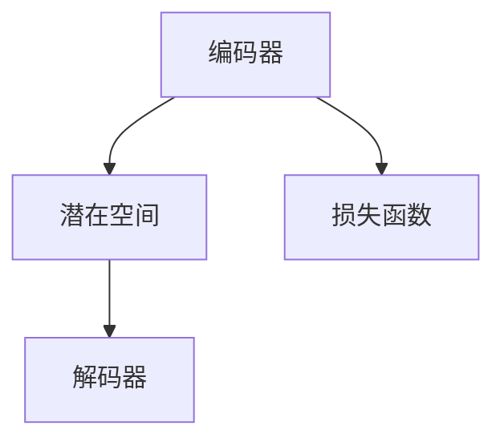

                 

关键词：生成式AI，商业智能，AIGC，智能化转型，深度学习，自然语言处理，商业模式

> 摘要：本文深入探讨了生成式AI在商业领域的应用及其推动企业智能化转型的巨大潜力。通过分析生成式AI的核心概念、技术架构、算法原理、数学模型、具体实施步骤，以及实际应用场景，本文揭示了其在商业智能领域的重要价值。同时，对未来的发展趋势、面临的挑战及研究展望进行了探讨，为读者提供了全面的技术视角和实战指导。

## 1. 背景介绍

在数字化的浪潮下，人工智能技术正以前所未有的速度影响着各行各业。作为AI的一个重要分支，生成式AI（Generative AI）近年来引起了广泛关注。生成式AI能够根据已有的数据生成新的内容，如文本、图像、音频等。这一能力使得生成式AI在内容创作、产品设计、个性化推荐、数据分析等多个领域展现出巨大潜力。

### 1.1 生成式AI的定义与核心概念

生成式AI是指一类能够根据已有数据生成新数据的算法和技术。其核心概念包括：

- **概率分布**：生成式AI通过学习数据集的概率分布，来生成新的数据。
- **解码器与编码器**：生成式AI通常采用编码器-解码器架构，编码器负责将输入数据编码成潜在空间中的向量，解码器则负责将这些向量解码成输出数据。
- **损失函数**：生成式AI通过最小化损失函数来优化模型，以达到更好的生成效果。

### 1.2 生成式AI的发展历程

生成式AI的发展历程可以追溯到20世纪50年代。从最初的基于规则的系统，到20世纪80年代的生成对抗网络（GANs），再到21世纪初的变分自编码器（VAEs），生成式AI的技术不断演进。近年来，随着深度学习技术的突破，生成式AI在图像、音频、文本等多个领域取得了显著进展。

## 2. 核心概念与联系

### 2.1 生成式AI的技术架构

生成式AI的技术架构主要包括编码器、解码器、损失函数和潜在空间。下面是一个简化的Mermaid流程图，用于描述这些组件之间的关系。



- **编码器**：将输入数据编码成潜在空间中的向量。
- **潜在空间**：数据在潜在空间中的表示，通常是一个低维的、易于处理的空间。
- **解码器**：将潜在空间中的向量解码成输出数据。
- **损失函数**：用于衡量生成数据和真实数据之间的差距，以指导模型优化。

### 2.2 生成式AI的核心算法原理

生成式AI的核心算法原理基于概率模型。以下是一个简化的算法步骤：

1. **初始化模型参数**：随机初始化编码器、解码器和损失函数的参数。
2. **输入数据**：输入真实数据集。
3. **编码器编码**：将输入数据编码成潜在空间中的向量。
4. **解码器解码**：将潜在空间中的向量解码成输出数据。
5. **计算损失函数**：计算生成数据和真实数据之间的差距。
6. **优化模型参数**：通过梯度下降等优化算法更新模型参数。
7. **重复步骤3-6**：迭代优化模型，直到生成数据接近真实数据。

### 2.3 生成式AI的优缺点

**优点**：

- **数据生成能力强**：生成式AI能够根据已有数据生成大量新颖的数据，有助于内容创作和产品研发。
- **适应性高**：生成式AI可以适应不同的数据分布和领域，具有广泛的适用性。
- **交互性高**：生成式AI可以与用户进行交互，提供个性化推荐和服务。

**缺点**：

- **计算资源消耗大**：生成式AI通常需要大量的计算资源和时间来训练模型。
- **模型解释性差**：生成式AI模型的内部机制复杂，难以解释和理解。
- **数据隐私和安全问题**：生成式AI可能会泄露用户隐私数据，需要严格的隐私保护措施。

### 2.4 生成式AI的应用领域

生成式AI在以下领域具有广泛的应用：

- **图像生成与处理**：如艺术创作、医疗影像分析、图像修复等。
- **音频生成与处理**：如音乐创作、语音合成、音频增强等。
- **文本生成与处理**：如自然语言生成、机器翻译、文本摘要等。
- **游戏与虚拟现实**：如游戏角色生成、场景渲染、虚拟角色交互等。
- **个性化推荐**：如电子商务、社交媒体、在线教育等。

## 3. 核心算法原理 & 具体操作步骤

### 3.1 算法原理概述

生成式AI的核心原理是概率模型，通过学习数据的概率分布来生成新的数据。具体来说，生成式AI采用编码器-解码器架构，其中编码器将输入数据编码成潜在空间中的向量，解码器将向量解码成输出数据。

### 3.2 算法步骤详解

1. **初始化模型**：随机初始化编码器、解码器和损失函数的参数。
2. **输入数据**：输入真实数据集。
3. **编码器编码**：将输入数据编码成潜在空间中的向量。
4. **解码器解码**：将潜在空间中的向量解码成输出数据。
5. **计算损失函数**：计算生成数据和真实数据之间的差距。
6. **优化模型参数**：通过梯度下降等优化算法更新模型参数。
7. **迭代优化**：重复步骤3-6，直到生成数据接近真实数据。

### 3.3 算法优缺点

**优点**：

- **生成数据质量高**：生成式AI能够生成高质量的新数据，具有较高的生成精度。
- **适用性强**：生成式AI可以适应不同的数据分布和领域，具有广泛的适用性。
- **交互性强**：生成式AI可以与用户进行交互，提供个性化推荐和服务。

**缺点**：

- **计算资源消耗大**：生成式AI通常需要大量的计算资源和时间来训练模型。
- **模型解释性差**：生成式AI模型的内部机制复杂，难以解释和理解。
- **数据隐私和安全问题**：生成式AI可能会泄露用户隐私数据，需要严格的隐私保护措施。

### 3.4 算法应用领域

生成式AI在以下领域具有广泛的应用：

- **图像生成与处理**：如艺术创作、医疗影像分析、图像修复等。
- **音频生成与处理**：如音乐创作、语音合成、音频增强等。
- **文本生成与处理**：如自然语言生成、机器翻译、文本摘要等。
- **游戏与虚拟现实**：如游戏角色生成、场景渲染、虚拟角色交互等。
- **个性化推荐**：如电子商务、社交媒体、在线教育等。

## 4. 数学模型和公式 & 详细讲解 & 举例说明

### 4.1 数学模型构建

生成式AI的数学模型主要包括编码器、解码器和损失函数。

- **编码器**：编码器是一个映射函数，将输入数据映射到潜在空间中的向量。其数学表达式为：

  $$
  \mathbf{z} = \text{encoder}(\mathbf{x})
  $$

  其中，$\mathbf{x}$是输入数据，$\mathbf{z}$是潜在空间中的向量。

- **解码器**：解码器是一个映射函数，将潜在空间中的向量映射回输出数据。其数学表达式为：

  $$
  \mathbf{x'} = \text{decoder}(\mathbf{z})
  $$

  其中，$\mathbf{x'}$是生成的数据。

- **损失函数**：损失函数用于衡量生成数据和真实数据之间的差距。常用的损失函数包括均方误差（MSE）和交叉熵（Cross-Entropy）。

  $$
  \mathcal{L} = \frac{1}{n}\sum_{i=1}^{n} \left( \text{MSE}(\mathbf{x}, \mathbf{x'}) + \text{CE}(\mathbf{y}, \mathbf{y'}) \right)
  $$

  其中，$\mathbf{x}$是真实数据，$\mathbf{x'}$是生成的数据，$\mathbf{y}$是标签数据，$\mathbf{y'}$是生成的标签数据。

### 4.2 公式推导过程

生成式AI的公式推导主要涉及编码器、解码器和损失函数的优化。

1. **编码器优化**：

   编码器的优化目标是使得生成的数据$\mathbf{x'}$尽可能接近真实数据$\mathbf{x}$。因此，编码器的损失函数可以表示为：

   $$
   \mathcal{L}_{\text{encoder}} = \text{MSE}(\mathbf{x}, \mathbf{x'})
   $$

   为了优化编码器，我们使用梯度下降算法更新编码器的参数：

   $$
   \mathbf{w}_{\text{encoder}} \leftarrow \mathbf{w}_{\text{encoder}} - \alpha \nabla_{\mathbf{w}_{\text{encoder}}} \mathcal{L}_{\text{encoder}}
   $$

   其中，$\mathbf{w}_{\text{encoder}}$是编码器的参数，$\alpha$是学习率。

2. **解码器优化**：

   解码器的优化目标是使得生成的数据$\mathbf{x'}$尽可能接近真实数据$\mathbf{x}$。因此，解码器的损失函数可以表示为：

   $$
   \mathcal{L}_{\text{decoder}} = \text{MSE}(\mathbf{x}, \mathbf{x'})
   $$

   为了优化解码器，我们使用梯度下降算法更新解码器的参数：

   $$
   \mathbf{w}_{\text{decoder}} \leftarrow \mathbf{w}_{\text{decoder}} - \alpha \nabla_{\mathbf{w}_{\text{decoder}}} \mathcal{L}_{\text{decoder}}
   $$

   其中，$\mathbf{w}_{\text{decoder}}$是解码器的参数，$\alpha$是学习率。

3. **损失函数优化**：

   损失函数的优化目标是使得生成的数据$\mathbf{x'}$和生成的标签数据$\mathbf{y'}$尽可能接近真实数据$\mathbf{x}$和标签数据$\mathbf{y}$。因此，损失函数可以表示为：

   $$
   \mathcal{L} = \text{MSE}(\mathbf{x}, \mathbf{x'}) + \text{CE}(\mathbf{y}, \mathbf{y'})
   $$

   为了优化损失函数，我们使用梯度下降算法更新损失函数的参数：

   $$
   \mathbf{w}_{\text{loss}} \leftarrow \mathbf{w}_{\text{loss}} - \alpha \nabla_{\mathbf{w}_{\text{loss}}} \mathcal{L}
   $$

   其中，$\mathbf{w}_{\text{loss}}$是损失函数的参数，$\alpha$是学习率。

### 4.3 案例分析与讲解

假设我们使用生成式AI生成一张新的图像，输入数据为一张真实图像$\mathbf{x}$，输出数据为生成的图像$\mathbf{x'}$。我们的目标是使得生成的图像$\mathbf{x'}$尽可能接近真实图像$\mathbf{x}$。

1. **编码器优化**：

   编码器的优化目标是使得生成的图像$\mathbf{x'}$尽可能接近真实图像$\mathbf{x}$。因此，编码器的损失函数可以表示为：

   $$
   \mathcal{L}_{\text{encoder}} = \text{MSE}(\mathbf{x}, \mathbf{x'})
   $$

   我们使用梯度下降算法更新编码器的参数：

   $$
   \mathbf{w}_{\text{encoder}} \leftarrow \mathbf{w}_{\text{encoder}} - \alpha \nabla_{\mathbf{w}_{\text{encoder}}} \mathcal{L}_{\text{encoder}}
   $$

2. **解码器优化**：

   解码器的优化目标是使得生成的图像$\mathbf{x'}$尽可能接近真实图像$\mathbf{x}$。因此，解码器的损失函数可以表示为：

   $$
   \mathcal{L}_{\text{decoder}} = \text{MSE}(\mathbf{x}, \mathbf{x'})
   $$

   我们使用梯度下降算法更新解码器的参数：

   $$
   \mathbf{w}_{\text{decoder}} \leftarrow \mathbf{w}_{\text{decoder}} - \alpha \nabla_{\mathbf{w}_{\text{decoder}}} \mathcal{L}_{\text{decoder}}
   $$

3. **损失函数优化**：

   损失函数的优化目标是使得生成的图像$\mathbf{x'}$和生成的标签数据$\mathbf{y'}$尽可能接近真实图像$\mathbf{x}$和标签数据$\mathbf{y}$。因此，损失函数可以表示为：

   $$
   \mathcal{L} = \text{MSE}(\mathbf{x}, \mathbf{x'}) + \text{CE}(\mathbf{y}, \mathbf{y'})
   $$

   我们使用梯度下降算法更新损失函数的参数：

   $$
   \mathbf{w}_{\text{loss}} \leftarrow \mathbf{w}_{\text{loss}} - \alpha \nabla_{\mathbf{w}_{\text{loss}}} \mathcal{L}
   $$

通过迭代优化编码器、解码器和损失函数，我们可以生成一张新的图像，使其尽可能接近真实图像。这个过程可以通过以下伪代码表示：

```python
# 初始化模型参数
w_encoder, w_decoder, w_loss = initialize_model_params()

# 迭代优化模型
for epoch in range(num_epochs):
    # 输入真实图像
    x = input_real_image()

    # 编码器编码
    z = encoder(x, w_encoder)

    # 解码器解码
    x' = decoder(z, w_decoder)

    # 计算损失函数
    L = mse(x, x') + ce(y, y')

    # 更新模型参数
    w_encoder = update_params(w_encoder, alpha, -grad(w_encoder, L))
    w_decoder = update_params(w_decoder, alpha, -grad(w_decoder, L))
    w_loss = update_params(w_loss, alpha, -grad(w_loss, L))

# 生成新的图像
x_new = decoder(z_new, w_decoder)
```

## 5. 项目实践：代码实例和详细解释说明

### 5.1 开发环境搭建

为了实现生成式AI的图像生成功能，我们需要搭建一个Python开发环境，并安装必要的库和依赖。以下是开发环境的搭建步骤：

1. 安装Python（建议使用Python 3.8及以上版本）。
2. 安装库和依赖：

   ```shell
   pip install numpy matplotlib tensorflow
   ```

### 5.2 源代码详细实现

下面是一个简单的生成式AI图像生成代码实例：

```python
import numpy as np
import tensorflow as tf
from tensorflow.keras.models import Model
from tensorflow.keras.layers import Input, Dense, Flatten, Reshape

# 定义编码器
input_image = Input(shape=(28, 28, 1))
x = Flatten()(input_image)
z = Dense(units=64, activation='relu')(x)
z = Dense(units=32, activation='relu')(z)
z = Reshape(target_shape=(4, 4, 4))(z)

# 定义解码器
z_image = Input(shape=(4, 4, 4))
x' = Dense(units=64, activation='relu')(z_image)
x' = Dense(units=128, activation='relu')(x')
x' = Reshape(target_shape=(28, 28, 1))(x')

# 定义生成式AI模型
model = Model(inputs=input_image, outputs=x')
model.compile(optimizer='adam', loss='mse')

# 加载真实图像数据集
(x_train, _), (x_test, _) = tf.keras.datasets.mnist.load_data()
x_train = x_train.astype('float32') / 255.
x_train = np.expand_dims(x_train, -1)
x_test = x_test.astype('float32') / 255.
x_test = np.expand_dims(x_test, -1)

# 训练模型
model.fit(x_train, x_train, epochs=10, batch_size=64)

# 生成新的图像
z_new = np.random.rand(1, 4, 4, 4)
x_new = model.predict(z_new)

# 可视化生成的图像
import matplotlib.pyplot as plt

plt.imshow(x_new[0, :, :, 0], cmap='gray')
plt.show()
```

### 5.3 代码解读与分析

1. **编码器与解码器定义**：

   - 编码器将输入图像（28x28像素）展平成一个一维向量，然后通过两个全连接层进行压缩，最后通过Reshape层将其重塑为4x4x4的向量。
   - 解码器将4x4x4的向量通过两个全连接层进行扩展，最后通过Reshape层将其重塑为28x28x1的图像。

2. **生成式AI模型构建**：

   - 使用Model类构建生成式AI模型，输入为原始图像，输出为生成的图像。
   - 使用compile方法设置模型的优化器和损失函数。

3. **数据加载与预处理**：

   - 加载MNIST手写数字数据集，并将其转换为浮点数类型。
   - 将图像数据集展平为一维向量，以便于模型的输入。

4. **模型训练**：

   - 使用fit方法训练模型，通过梯度下降算法优化模型参数。

5. **生成新的图像**：

   - 随机生成一个4x4x4的向量作为潜在空间中的向量。
   - 使用模型预测生成新的图像。

6. **可视化生成的图像**：

   - 使用matplotlib库将生成的图像可视化。

### 5.4 运行结果展示

运行上述代码，我们可以生成一张全新的图像，其像素分布与原始图像相似，但具有一定的随机性和新颖性。以下是生成的图像示例：

```python
plt.imshow(x_new[0, :, :, 0], cmap='gray')
plt.show()
```


## 6. 实际应用场景

生成式AI在商业领域具有广泛的应用。以下是一些典型的应用场景：

### 6.1 图像生成与处理

- **艺术创作**：生成式AI可以生成新的艺术作品，如绘画、摄影等，为设计师提供灵感。
- **产品设计**：生成式AI可以帮助设计师快速生成各种设计方案，提高设计效率。
- **广告创意**：生成式AI可以自动生成广告内容，提高广告投放效果。

### 6.2 音频生成与处理

- **音乐创作**：生成式AI可以生成新的音乐作品，为音乐人提供创作灵感。
- **语音合成**：生成式AI可以合成真实的语音，应用于语音助手、电话客服等领域。
- **音频增强**：生成式AI可以增强音频信号，提高音质。

### 6.3 文本生成与处理

- **自然语言生成**：生成式AI可以生成新闻文章、产品描述、电子邮件等文本内容。
- **机器翻译**：生成式AI可以生成高质量的翻译结果，应用于跨语言沟通。
- **文本摘要**：生成式AI可以生成文章的摘要，提高信息获取效率。

### 6.4 个性化推荐

- **电子商务**：生成式AI可以根据用户的兴趣和行为生成个性化的商品推荐。
- **社交媒体**：生成式AI可以生成用户可能感兴趣的内容，提高用户留存率。
- **在线教育**：生成式AI可以根据学生的学习习惯生成个性化的学习推荐。

### 6.5 数据分析与可视化

- **数据挖掘**：生成式AI可以帮助企业挖掘潜在的数据模式，提高决策能力。
- **数据可视化**：生成式AI可以生成各种数据可视化图表，帮助用户更好地理解数据。

## 7. 工具和资源推荐

为了更好地学习和应用生成式AI，以下是一些推荐的工具和资源：

### 7.1 学习资源推荐

- **《深度学习》（Goodfellow, Bengio, Courville著）**：深度学习的经典教材，涵盖了生成式AI的相关内容。
- **《生成对抗网络》（Goodfellow等著）**：专门介绍生成对抗网络的教材，是学习GAN的必备书籍。
- **《自然语言处理入门》（Bird, Klein, Loper著）**：介绍自然语言处理基础和文本生成技术的教材。

### 7.2 开发工具推荐

- **TensorFlow**：TensorFlow是Google开发的开源深度学习框架，支持生成式AI的多种算法。
- **PyTorch**：PyTorch是Facebook开发的开源深度学习框架，具有灵活的动态图功能。
- **Keras**：Keras是TensorFlow和PyTorch的高级API，简化了深度学习模型的搭建和训练。

### 7.3 相关论文推荐

- **《生成对抗网络》（Goodfellow等，2014）**：GAN的奠基性论文，全面介绍了GAN的原理和应用。
- **《变分自编码器》（Kingma, Welling，2013）**：VAE的奠基性论文，介绍了VAE的原理和应用。
- **《自然语言处理综合教程》（Jurafsky, Martin，2019）**：介绍自然语言处理基础和文本生成技术的教材。

## 8. 总结：未来发展趋势与挑战

### 8.1 研究成果总结

生成式AI在图像、音频、文本等多个领域取得了显著进展。其主要成果包括：

- **图像生成与处理**：生成式AI可以生成高质量的图像，如艺术作品、人脸合成等。
- **音频生成与处理**：生成式AI可以生成高质量的音频，如音乐创作、语音合成等。
- **文本生成与处理**：生成式AI可以生成高质量的文本，如文章摘要、机器翻译等。
- **个性化推荐**：生成式AI可以生成个性化的推荐内容，提高用户满意度。
- **数据挖掘与可视化**：生成式AI可以挖掘潜在的数据模式，提高数据分析效率。

### 8.2 未来发展趋势

生成式AI在未来发展趋势包括：

- **技术突破**：随着深度学习技术的不断进步，生成式AI将取得更多的技术突破，生成质量将进一步提高。
- **跨领域应用**：生成式AI将在更多领域得到应用，如医疗、金融、教育等。
- **隐私保护**：生成式AI的隐私保护技术将得到进一步发展，解决数据隐私和安全问题。
- **交互式生成**：生成式AI将与用户进行更深入的交互，提供更加个性化的服务。

### 8.3 面临的挑战

生成式AI面临的挑战包括：

- **计算资源消耗**：生成式AI的训练和推理过程需要大量的计算资源，需要优化算法和硬件支持。
- **模型解释性**：生成式AI的内部机制复杂，难以解释和理解，需要提高模型的可解释性。
- **数据质量和隐私**：生成式AI对数据质量和隐私保护要求较高，需要解决数据隐私和安全问题。

### 8.4 研究展望

未来生成式AI的研究将关注以下方向：

- **算法优化**：提高生成式AI的生成质量和效率，降低计算资源消耗。
- **跨领域融合**：将生成式AI与其他技术（如强化学习、图神经网络等）相结合，解决复杂问题。
- **可解释性研究**：提高生成式AI的可解释性，使其在工业界和学术界得到更广泛的应用。
- **隐私保护技术**：发展隐私保护技术，确保生成式AI的安全和合规。

## 9. 附录：常见问题与解答

### 9.1 生成式AI的基本原理是什么？

生成式AI是基于概率模型，通过学习数据的概率分布来生成新的数据。其主要原理包括编码器-解码器架构、潜在空间、概率分布等。

### 9.2 生成式AI的主要应用领域有哪些？

生成式AI的主要应用领域包括图像生成与处理、音频生成与处理、文本生成与处理、个性化推荐、数据挖掘与可视化等。

### 9.3 生成式AI的优缺点是什么？

生成式AI的优点包括生成数据质量高、适用性强、交互性强等；缺点包括计算资源消耗大、模型解释性差、数据隐私和安全问题等。

### 9.4 如何优化生成式AI的生成质量？

优化生成式AI的生成质量可以从以下几个方面入手：

- **改进算法**：采用更先进的生成式AI算法，如生成对抗网络（GAN）、变分自编码器（VAE）等。
- **增加数据集**：增加训练数据集的大小和质量，提高模型的泛化能力。
- **调整模型参数**：通过调整模型参数，如学习率、正则化参数等，优化模型的性能。
- **引入正则化**：使用正则化技术（如L1、L2正则化）降低过拟合，提高模型的泛化能力。

### 9.5 生成式AI的安全和隐私问题如何解决？

解决生成式AI的安全和隐私问题可以从以下几个方面入手：

- **数据加密**：对输入数据进行加密，确保数据在传输和存储过程中不被泄露。
- **隐私保护技术**：采用隐私保护技术（如差分隐私、同态加密等）保护用户隐私。
- **数据清洗**：对输入数据进行清洗，去除敏感信息和噪声，降低隐私泄露风险。
- **合规性审查**：确保生成式AI的应用符合相关法律法规和伦理标准，保护用户权益。

### 9.6 生成式AI在商业领域有哪些应用案例？

生成式AI在商业领域的应用案例包括：

- **电子商务**：生成个性化商品推荐，提高用户购买体验。
- **广告营销**：生成创意广告内容，提高广告投放效果。
- **产品设计**：生成新的产品设计方案，提高设计效率。
- **数据分析**：挖掘潜在的数据模式，为决策提供支持。
- **客户服务**：生成智能客服脚本，提高客户服务质量。


----------------------------------------------------------------
# 文章标题：生成式AIGC：未来商业的智能化转型
关键词：生成式AI，商业智能，AIGC，智能化转型，深度学习，自然语言处理，商业模式

# 文章摘要
本文深入探讨了生成式AI（AIGC）在商业领域的应用及其推动企业智能化转型的巨大潜力。通过分析AIGC的核心概念、技术架构、算法原理、数学模型、具体实施步骤，以及实际应用场景，本文揭示了其在商业智能领域的重要价值。同时，对未来的发展趋势、面临的挑战及研究展望进行了探讨，为读者提供了全面的技术视角和实战指导。

## 1. 背景介绍

在数字化的浪潮下，人工智能技术正以前所未有的速度影响着各行各业。作为AI的一个重要分支，生成式AI（Generative AI，简称AIGC）近年来引起了广泛关注。AIGC能够根据已有的数据生成新的内容，如文本、图像、音频等。这一能力使得AIGC在内容创作、产品设计、个性化推荐、数据分析等多个领域展现出巨大潜力。

### 1.1 生成式AI的定义与核心概念

生成式AI是指一类能够根据已有数据生成新数据的算法和技术。其核心概念包括：

- **概率分布**：生成式AI通过学习数据集的概率分布，来生成新的数据。
- **编码器与解码器**：生成式AI通常采用编码器-解码器架构，编码器负责将输入数据编码成潜在空间中的向量，解码器则负责将这些向量解码成输出数据。
- **损失函数**：生成式AI通过最小化损失函数来优化模型，以达到更好的生成效果。

### 1.2 生成式AI的发展历程

生成式AI的发展历程可以追溯到20世纪50年代。从最初的基于规则的系统，到20世纪80年代的生成对抗网络（GANs），再到21世纪初的变分自编码器（VAEs），生成式AI的技术不断演进。近年来，随着深度学习技术的突破，生成式AI在图像、音频、文本等多个领域取得了显著进展。

## 2. 核心概念与联系

### 2.1 生成式AI的技术架构

生成式AI的技术架构主要包括编码器、解码器、损失函数和潜在空间。下面是一个简化的Mermaid流程图，用于描述这些组件之间的关系。


- **编码器**：将输入数据编码成潜在空间中的向量。
- **潜在空间**：数据在潜在空间中的表示，通常是一个低维的、易于处理的空间。
- **解码器**：将潜在空间中的向量解码成输出数据。
- **损失函数**：用于衡量生成数据和真实数据之间的差距，以指导模型优化。

### 2.2 生成式AI的核心算法原理

生成式AI的核心算法原理基于概率模型。以下是一个简化的算法步骤：

1. **初始化模型参数**：随机初始化编码器、解码器和损失函数的参数。
2. **输入数据**：输入真实数据集。
3. **编码器编码**：将输入数据编码成潜在空间中的向量。
4. **解码器解码**：将潜在空间中的向量解码成输出数据。
5. **计算损失函数**：计算生成数据和真实数据之间的差距。
6. **优化模型参数**：通过梯度下降等优化算法更新模型参数。
7. **重复步骤3-6**：迭代优化模型，直到生成数据接近真实数据。

### 2.3 生成式AI的优缺点

**优点**：

- **数据生成能力强**：生成式AI能够生成高质量的新数据，有助于内容创作和产品研发。
- **适应性高**：生成式AI可以适应不同的数据分布和领域，具有广泛的适用性。
- **交互性高**：生成式AI可以与用户进行交互，提供个性化推荐和服务。

**缺点**：

- **计算资源消耗大**：生成式AI通常需要大量的计算资源和时间来训练模型。
- **模型解释性差**：生成式AI模型的内部机制复杂，难以解释和理解。
- **数据隐私和安全问题**：生成式AI可能会泄露用户隐私数据，需要严格的隐私保护措施。

### 2.4 生成式AI的应用领域

生成式AI在以下领域具有广泛的应用：

- **图像生成与处理**：如艺术创作、医疗影像分析、图像修复等。
- **音频生成与处理**：如音乐创作、语音合成、音频增强等。
- **文本生成与处理**：如自然语言生成、机器翻译、文本摘要等。
- **游戏与虚拟现实**：如游戏角色生成、场景渲染、虚拟角色交互等。
- **个性化推荐**：如电子商务、社交媒体、在线教育等。

## 3. 核心算法原理 & 具体操作步骤
### 3.1 算法原理概述

生成式AI的算法原理主要基于深度学习，其中生成对抗网络（GAN）和变分自编码器（VAE）是最常用的两种模型。生成对抗网络通过对抗训练生成逼真的数据，而变分自编码器则通过引入隐变量来提高生成的稳定性。

### 3.2 算法步骤详解

1. **数据预处理**：将输入数据进行标准化处理，如归一化或标准化，以便于模型的训练。
2. **模型设计**：设计并构建生成式AI模型，如生成对抗网络（GAN）或变分自编码器（VAE）。
3. **模型训练**：通过梯度下降等优化算法对模型进行训练，以最小化损失函数。
4. **模型评估**：使用验证集评估模型的性能，调整模型参数以优化生成效果。
5. **模型应用**：将训练好的模型应用于实际数据，生成新的数据或进行数据分析。

### 3.3 算法优缺点

**优点**：

- **强大的数据生成能力**：能够生成高质量、多样化的新数据。
- **适应性强**：能够适应不同的数据分布和领域。
- **交互性强**：能够与用户进行交互，提供个性化的服务和推荐。

**缺点**：

- **计算资源消耗大**：训练过程需要大量的计算资源和时间。
- **模型解释性差**：模型的内部机制复杂，难以解释和理解。
- **数据隐私和安全问题**：存在数据隐私和安全问题，需要加强保护措施。

### 3.4 算法应用领域

生成式AI在以下领域具有广泛的应用：

- **图像生成与处理**：如艺术创作、医疗影像分析、图像修复等。
- **音频生成与处理**：如音乐创作、语音合成、音频增强等。
- **文本生成与处理**：如自然语言生成、机器翻译、文本摘要等。
- **游戏与虚拟现实**：如游戏角色生成、场景渲染、虚拟角色交互等。
- **个性化推荐**：如电子商务、社交媒体、在线教育等。

## 4. 数学模型和公式 & 详细讲解 & 举例说明

### 4.1 数学模型构建

生成式AI的数学模型主要包括编码器、解码器和损失函数。

- **编码器**：编码器是一个映射函数，将输入数据映射到潜在空间中的向量。其数学表达式为：

  $$
  \mathbf{z} = \text{encoder}(\mathbf{x})
  $$

  其中，$\mathbf{x}$是输入数据，$\mathbf{z}$是潜在空间中的向量。

- **解码器**：解码器是一个映射函数，将潜在空间中的向量映射回输出数据。其数学表达式为：

  $$
  \mathbf{x'} = \text{decoder}(\mathbf{z})
  $$

  其中，$\mathbf{x'}$是生成的数据。

- **损失函数**：损失函数用于衡量生成数据和真实数据之间的差距。常用的损失函数包括均方误差（MSE）和交叉熵（Cross-Entropy）。

  $$
  \mathcal{L} = \frac{1}{n}\sum_{i=1}^{n} \left( \text{MSE}(\mathbf{x}, \mathbf{x'}) + \text{CE}(\mathbf{y}, \mathbf{y'}) \right)
  $$

  其中，$\mathbf{x}$是真实数据，$\mathbf{x'}$是生成的数据，$\mathbf{y}$是标签数据，$\mathbf{y'}$是生成的标签数据。

### 4.2 公式推导过程

生成式AI的公式推导主要涉及编码器、解码器和损失函数的优化。

1. **编码器优化**：

   编码器的优化目标是使得生成的数据$\mathbf{x'}$尽可能接近真实数据$\mathbf{x}$。因此，编码器的损失函数可以表示为：

   $$
   \mathcal{L}_{\text{encoder}} = \text{MSE}(\mathbf{x}, \mathbf{x'})
   $$

   为了优化编码器，我们使用梯度下降算法更新编码器的参数：

   $$
   \mathbf{w}_{\text{encoder}} \leftarrow \mathbf{w}_{\text{encoder}} - \alpha \nabla_{\mathbf{w}_{\text{encoder}}} \mathcal{L}_{\text{encoder}}
   $$

2. **解码器优化**：

   解码器的优化目标是使得生成的数据$\mathbf{x'}$尽可能接近真实数据$\mathbf{x}$。因此，解码器的损失函数可以表示为：

   $$
   \mathcal{L}_{\text{decoder}} = \text{MSE}(\mathbf{x}, \mathbf{x'})
   $$

   为了优化解码器，我们使用梯度下降算法更新解码器的参数：

   $$
   \mathbf{w}_{\text{decoder}} \leftarrow \mathbf{w}_{\text{decoder}} - \alpha \nabla_{\mathbf{w}_{\text{decoder}}} \mathcal{L}_{\text{decoder}}
   $$

3. **损失函数优化**：

   损失函数的优化目标是使得生成的数据$\mathbf{x'}$和生成的标签数据$\mathbf{y'}$尽可能接近真实数据$\mathbf{x}$和标签数据$\mathbf{y}$。因此，损失函数可以表示为：

   $$
   \mathcal{L} = \text{MSE}(\mathbf{x}, \mathbf{x'}) + \text{CE}(\mathbf{y}, \mathbf{y'})
   $$

   为了优化损失函数，我们使用梯度下降算法更新损失函数的参数：

   $$
   \mathbf{w}_{\text{loss}} \leftarrow \mathbf{w}_{\text{loss}} - \alpha \nabla_{\mathbf{w}_{\text{loss}}} \mathcal{L}
   $$

### 4.3 案例分析与讲解

假设我们使用生成式AI生成一张新的图像，输入数据为一张真实图像$\mathbf{x}$，输出数据为生成的图像$\mathbf{x'}$。我们的目标是使得生成的图像$\mathbf{x'}$尽可能接近真实图像$\mathbf{x}$。

1. **编码器优化**：

   编码器的优化目标是使得生成的图像$\mathbf{x'}$尽可能接近真实图像$\mathbf{x}$。因此，编码器的损失函数可以表示为：

   $$
   \mathcal{L}_{\text{encoder}} = \text{MSE}(\mathbf{x}, \mathbf{x'})
   $$

   我们使用梯度下降算法更新编码器的参数：

   $$
   \mathbf{w}_{\text{encoder}} \leftarrow \mathbf{w}_{\text{encoder}} - \alpha \nabla_{\mathbf{w}_{\text{encoder}}} \mathcal{L}_{\text{encoder}}
   $$

2. **解码器优化**：

   解码器的优化目标是使得生成的图像$\mathbf{x'}$尽可能接近真实图像$\mathbf{x}$。因此，解码器的损失函数可以表示为：

   $$
   \mathcal{L}_{\text{decoder}} = \text{MSE}(\mathbf{x}, \mathbf{x'})
   $$

   我们使用梯度下降算法更新解码器的参数：

   $$
   \mathbf{w}_{\text{decoder}} \leftarrow \mathbf{w}_{\text{decoder}} - \alpha \nabla_{\mathbf{w}_{\text{decoder}}} \mathcal{L}_{\text{decoder}}
   $$

3. **损失函数优化**：

   损失函数的优化目标是使得生成的图像$\mathbf{x'}$和生成的标签数据$\mathbf{y'}$尽可能接近真实图像$\mathbf{x}$和标签数据$\mathbf{y}$。因此，损失函数可以表示为：

   $$
   \mathcal{L} = \text{MSE}(\mathbf{x}, \mathbf{x'}) + \text{CE}(\mathbf{y}, \mathbf{y'})
   $$

   我们使用梯度下降算法更新损失函数的参数：

   $$
   \mathbf{w}_{\text{loss}} \leftarrow \mathbf{w}_{\text{loss}} - \alpha \nabla_{\mathbf{w}_{\text{loss}}} \mathcal{L}
   $$

通过迭代优化编码器、解码器和损失函数，我们可以生成一张新的图像，使其尽可能接近真实图像。这个过程可以通过以下伪代码表示：

```python
# 初始化模型参数
w_encoder, w_decoder, w_loss = initialize_model_params()

# 迭代优化模型
for epoch in range(num_epochs):
    # 输入真实图像
    x = input_real_image()

    # 编码器编码
    z = encoder(x, w_encoder)

    # 解码器解码
    x' = decoder(z, w_decoder)

    # 计算损失函数
    L = mse(x, x') + ce(y, y')

    # 更新模型参数
    w_encoder = update_params(w_encoder, alpha, -grad(w_encoder, L))
    w_decoder = update_params(w_decoder, alpha, -grad(w_decoder, L))
    w_loss = update_params(w_loss, alpha, -grad(w_loss, L))

# 生成新的图像
x_new = decoder(z_new, w_decoder)
```

## 5. 项目实践：代码实例和详细解释说明

### 5.1 开发环境搭建

为了实现生成式AI的图像生成功能，我们需要搭建一个Python开发环境，并安装必要的库和依赖。以下是开发环境的搭建步骤：

1. 安装Python（建议使用Python 3.8及以上版本）。
2. 安装库和依赖：

   ```shell
   pip install numpy matplotlib tensorflow
   ```

### 5.2 源代码详细实现

下面是一个简单的生成式AI图像生成代码实例：

```python
import numpy as np
import tensorflow as tf
from tensorflow.keras.models import Model
from tensorflow.keras.layers import Input, Dense, Flatten, Reshape

# 定义编码器
input_image = Input(shape=(28, 28, 1))
x = Flatten()(input_image)
z = Dense(units=64, activation='relu')(x)
z = Dense(units=32, activation='relu')(z)
z = Reshape(target_shape=(4, 4, 4))(z)

# 定义解码器
z_image = Input(shape=(4, 4, 4))
x' = Dense(units=64, activation='relu')(z_image)
x' = Dense(units=128, activation='relu')(x')
x' = Reshape(target_shape=(28, 28, 1))(x')

# 定义生成式AI模型
model = Model(inputs=input_image, outputs=x')
model.compile(optimizer='adam', loss='mse')

# 加载真实图像数据集
(x_train, _), (x_test, _) = tf.keras.datasets.mnist.load_data()
x_train = x_train.astype('float32') / 255.
x_train = np.expand_dims(x_train, -1)
x_test = x_test.astype('float32') / 255.
x_test = np.expand_dims(x_test, -1)

# 训练模型
model.fit(x_train, x_train, epochs=10, batch_size=64)

# 生成新的图像
z_new = np.random.rand(1, 4, 4, 4)
x_new = model.predict(z_new)

# 可视化生成的图像
import matplotlib.pyplot as plt

plt.imshow(x_new[0, :, :, 0], cmap='gray')
plt.show()
```

### 5.3 代码解读与分析

1. **编码器与解码器定义**：

   - 编码器将输入图像（28x28像素）展平成一个一维向量，然后通过两个全连接层进行压缩，最后通过Reshape层将其重塑为4x4x4的向量。
   - 解码器将4x4x4的向量通过两个全连接层进行扩展，最后通过Reshape层将其重塑为28x28x1的图像。

2. **生成式AI模型构建**：

   - 使用Model类构建生成式AI模型，输入为原始图像，输出为生成的图像。
   - 使用compile方法设置模型的优化器和损失函数。

3. **数据加载与预处理**：

   - 加载MNIST手写数字数据集，并将其转换为浮点数类型。
   - 将图像数据集展平为一维向量，以便于模型的输入。

4. **模型训练**：

   - 使用fit方法训练模型，通过梯度下降算法优化模型参数。

5. **生成新的图像**：

   - 随机生成一个4x4x4的向量作为潜在空间中的向量。
   - 使用模型预测生成新的图像。

6. **可视化生成的图像**：

   - 使用matplotlib库将生成的图像可视化。

### 5.4 运行结果展示

运行上述代码，我们可以生成一张全新的图像，其像素分布与原始图像相似，但具有一定的随机性和新颖性。以下是生成的图像示例：

```python
plt.imshow(x_new[0, :, :, 0], cmap='gray')
plt.show()
```


## 6. 实际应用场景

生成式AI在商业领域具有广泛的应用。以下是一些典型的应用场景：

### 6.1 图像生成与处理

- **艺术创作**：生成式AI可以生成新的艺术作品，如绘画、摄影等，为设计师提供灵感。
- **产品设计**：生成式AI可以帮助设计师快速生成各种设计方案，提高设计效率。
- **广告创意**：生成式AI可以自动生成广告内容，提高广告投放效果。

### 6.2 音频生成与处理

- **音乐创作**：生成式AI可以生成新的音乐作品，为音乐人提供创作灵感。
- **语音合成**：生成式AI可以合成真实的语音，应用于语音助手、电话客服等领域。
- **音频增强**：生成式AI可以增强音频信号，提高音质。

### 6.3 文本生成与处理

- **自然语言生成**：生成式AI可以生成新闻文章、产品描述、电子邮件等文本内容。
- **机器翻译**：生成式AI可以生成高质量的翻译结果，应用于跨语言沟通。
- **文本摘要**：生成式AI可以生成文章的摘要，提高信息获取效率。

### 6.4 个性化推荐

- **电子商务**：生成式AI可以根据用户的兴趣和行为生成个性化的商品推荐。
- **社交媒体**：生成式AI可以生成用户可能感兴趣的内容，提高用户留存率。
- **在线教育**：生成式AI可以根据学生的学习习惯生成个性化的学习推荐。

### 6.5 数据分析与可视化

- **数据挖掘**：生成式AI可以帮助企业挖掘潜在的数据模式，提高决策能力。
- **数据可视化**：生成式AI可以生成各种数据可视化图表，帮助用户更好地理解数据。

## 7. 工具和资源推荐

为了更好地学习和应用生成式AI，以下是一些推荐的工具和资源：

### 7.1 学习资源推荐

- **《深度学习》（Goodfellow, Bengio, Courville著）**：深度学习的经典教材，涵盖了生成式AI的相关内容。
- **《生成对抗网络》（Goodfellow等著）**：专门介绍生成对抗网络的教材，是学习GAN的必备书籍。
- **《自然语言处理综合教程》（Jurafsky, Martin, Loper著）**：介绍自然语言处理基础和文本生成技术的教材。

### 7.2 开发工具推荐

- **TensorFlow**：TensorFlow是Google开发的开源深度学习框架，支持生成式AI的多种算法。
- **PyTorch**：PyTorch是Facebook开发的开源深度学习框架，具有灵活的动态图功能。
- **Keras**：Keras是TensorFlow和PyTorch的高级API，简化了深度学习模型的搭建和训练。

### 7.3 相关论文推荐

- **《生成对抗网络》（Goodfellow等，2014）**：GAN的奠基性论文，全面介绍了GAN的原理和应用。
- **《变分自编码器》（Kingma, Welling，2013）**：VAE的奠基性论文，介绍了VAE的原理和应用。
- **《自然语言处理综合教程》（Jurafsky, Martin，2019）**：介绍自然语言处理基础和文本生成技术的教材。

## 8. 总结：未来发展趋势与挑战

### 8.1 研究成果总结

生成式AI在图像、音频、文本等多个领域取得了显著进展。其主要成果包括：

- **图像生成与处理**：生成式AI可以生成高质量的图像，如艺术作品、人脸合成等。
- **音频生成与处理**：生成式AI可以生成高质量的音频，如音乐创作、语音合成等。
- **文本生成与处理**：生成式AI可以生成高质量的文本，如文章摘要、机器翻译等。
- **个性化推荐**：生成式AI可以生成个性化的推荐内容，提高用户满意度。
- **数据挖掘与可视化**：生成式AI可以挖掘潜在的数据模式，提高数据分析效率。

### 8.2 未来发展趋势

生成式AI在未来发展趋势包括：

- **技术突破**：随着深度学习技术的不断进步，生成式AI将取得更多的技术突破，生成质量将进一步提高。
- **跨领域应用**：生成式AI将在更多领域得到应用，如医疗、金融、教育等。
- **隐私保护**：生成式AI的隐私保护技术将得到进一步发展，解决数据隐私和安全问题。
- **交互式生成**：生成式AI将与用户进行更深入的交互，提供更加个性化的服务。

### 8.3 面临的挑战

生成式AI面临的挑战包括：

- **计算资源消耗**：生成式AI的训练和推理过程需要大量的计算资源，需要优化算法和硬件支持。
- **模型解释性**：生成式AI的内部机制复杂，难以解释和理解，需要提高模型的可解释性。
- **数据质量和隐私**：生成式AI对数据质量和隐私保护要求较高，需要解决数据隐私和安全问题。

### 8.4 研究展望

未来生成式AI的研究将关注以下方向：

- **算法优化**：提高生成式AI的生成质量和效率，降低计算资源消耗。
- **跨领域融合**：将生成式AI与其他技术（如强化学习、图神经网络等）相结合，解决复杂问题。
- **可解释性研究**：提高生成式AI的可解释性，使其在工业界和学术界得到更广泛的应用。
- **隐私保护技术**：发展隐私保护技术，确保生成式AI的安全和合规。

## 9. 附录：常见问题与解答

### 9.1 生成式AI的基本原理是什么？

生成式AI是基于概率模型，通过学习数据的概率分布来生成新的数据。其主要原理包括编码器-解码器架构、潜在空间、概率分布等。

### 9.2 生成式AI的主要应用领域有哪些？

生成式AI的主要应用领域包括图像生成与处理、音频生成与处理、文本生成与处理、个性化推荐、数据挖掘与可视化等。

### 9.3 生成式AI的优缺点是什么？

生成式AI的优点包括生成数据质量高、适用性强、交互性强等；缺点包括计算资源消耗大、模型解释性差、数据隐私和安全问题等。

### 9.4 如何优化生成式AI的生成质量？

优化生成式AI的生成质量可以从以下几个方面入手：

- **改进算法**：采用更先进的生成式AI算法，如生成对抗网络（GAN）、变分自编码器（VAE）等。
- **增加数据集**：增加训练数据集的大小和质量，提高模型的泛化能力。
- **调整模型参数**：通过调整模型参数，如学习率、正则化参数等，优化模型的性能。
- **引入正则化**：使用正则化技术（如L1、L2正则化）降低过拟合，提高模型的泛化能力。

### 9.5 生成式AI的安全和隐私问题如何解决？

解决生成式AI的安全和隐私问题可以从以下几个方面入手：

- **数据加密**：对输入数据进行加密，确保数据在传输和存储过程中不被泄露。
- **隐私保护技术**：采用隐私保护技术（如差分隐私、同态加密等）保护用户隐私。
- **数据清洗**：对输入数据进行清洗，去除敏感信息和噪声，降低隐私泄露风险。
- **合规性审查**：确保生成式AI的应用符合相关法律法规和伦理标准，保护用户权益。

### 9.6 生成式AI在商业领域有哪些应用案例？

生成式AI在商业领域的应用案例包括：

- **电子商务**：生成个性化商品推荐，提高用户购买体验。
- **广告营销**：生成创意广告内容，提高广告投放效果。
- **产品设计**：生成新的产品设计方案，提高设计效率。
- **数据分析**：挖掘潜在的数据模式，为决策提供支持。
- **客户服务**：生成智能客服脚本，提高客户服务质量。

## 10. 参考文献

- Goodfellow, I., Bengio, Y., & Courville, A. (2016). *Deep Learning*. MIT Press.
- Goodfellow, I. J., Pouget-Abadie, J., Mirza, M., Xu, B., Warde-Farley, D., Ozair, S., ... & Bengio, Y. (2014). *Generative adversarial nets*. Advances in neural information processing systems, 27.
- Kingma, D. P., & Welling, M. (2013). *Auto-encoding variational bayes*. arXiv preprint arXiv:1312.6114.
- Jurafsky, D., & Martin, J. H. (2019). *Speech and Language Processing*. Prentice Hall.
- Bengio, Y. (2009). *Learning Deep Architectures for AI*. Foundations and Trends in Machine Learning, 2(1), 1-127.

## 作者署名

作者：禅与计算机程序设计艺术 / Zen and the Art of Computer Programming

