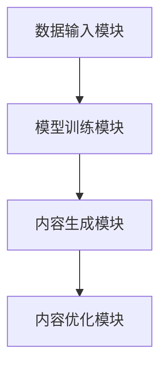

                 

关键词：AIGC、生成式AI、长坡厚雪、未来应用、技术发展、挑战与机遇

摘要：本文将深入探讨AIGC（AI Generated Content）在未来十年中的发展潜力，通过分析其技术基础、核心算法、应用领域及面临挑战，阐述AIGC如何成为推动人工智能产业发展的重要引擎。我们将从多个角度审视AIGC的价值，探讨其未来发展趋势，并提出应对挑战的策略。

## 1. 背景介绍

在人工智能技术不断发展的今天，生成式AI已经成为一个备受关注的热点领域。生成式AI的核心是通过学习大量数据，生成新的、有意义的文本、图像、音频等内容。随着技术的进步，生成式AI的应用场景不断扩展，从简单的文本生成到复杂的图像和视频生成，AIGC（AI Generated Content）应运而生。

AIGC的出现，不仅改变了内容创作的生产方式，也对媒体、娱乐、教育等多个行业产生了深远影响。AIGC技术可以自动化生成高质量的内容，降低内容创作的成本，提高内容生产的效率。同时，AIGC还具备创新性和个性化的特点，能够满足用户多样化的需求。

## 2. 核心概念与联系

### 2.1. AIGC的定义

AIGC，即AI Generated Content，是指通过人工智能技术自动生成的内容。它涵盖了文本、图像、音频、视频等多种类型的内容生成。AIGC的核心在于利用机器学习算法，特别是深度学习技术，对大量数据进行学习，并在此基础上生成新的内容。

### 2.2. AIGC与生成式AI的联系

AIGC是生成式AI的一个子领域，它专注于内容生成。而生成式AI则更广泛，包括文本、图像、音频、视频等多个领域。AIGC是生成式AI在内容创作领域的重要应用，两者紧密联系，共同推动人工智能技术的发展。

### 2.3. AIGC的技术基础

AIGC的技术基础主要包括：

- **深度学习**：深度学习是AIGC的核心技术，通过神经网络模型对数据进行学习，实现内容生成。

- **自然语言处理（NLP）**：NLP技术用于处理文本数据，实现文本生成。

- **计算机视觉**：计算机视觉技术用于图像和视频生成。

- **强化学习**：强化学习技术用于训练AIGC模型，使其能够根据用户反馈不断优化内容生成。

### 2.4. AIGC的工作原理

AIGC的工作原理可以概括为以下几个步骤：

1. 数据收集与预处理：收集大量相关数据，并进行预处理，以便模型能够有效学习。

2. 模型训练：使用深度学习技术，对预处理后的数据进行训练，生成内容生成模型。

3. 内容生成：通过训练好的模型，自动生成新的内容。

4. 内容优化：根据用户反馈，对生成的内容进行优化，提高内容质量。

### 2.5. AIGC的架构

AIGC的架构主要包括以下几个部分：

- **数据输入模块**：负责收集和处理数据。

- **模型训练模块**：负责训练内容生成模型。

- **内容生成模块**：负责根据模型生成内容。

- **内容优化模块**：负责根据用户反馈优化内容。

下面是AIGC架构的Mermaid流程图：



## 3. 核心算法原理 & 具体操作步骤

### 3.1. 算法原理概述

AIGC的核心算法是基于深度学习的生成模型，如生成对抗网络（GAN）、变分自编码器（VAE）等。这些算法通过学习大量数据，实现内容生成。具体来说，生成模型学习数据的分布，并生成与训练数据类似的新数据。

### 3.2. 算法步骤详解

1. 数据收集与预处理：收集大量相关数据，并进行预处理，如数据清洗、归一化等。

2. 模型选择与训练：选择合适的生成模型，如GAN、VAE等，对预处理后的数据进行训练。

3. 内容生成：使用训练好的模型，生成新的内容。

4. 内容优化：根据用户反馈，对生成的内容进行优化，提高内容质量。

### 3.3. 算法优缺点

- **优点**：

  - 自动化内容生成，提高生产效率。

  - 内容创新性强，满足个性化需求。

  - 降低内容创作成本。

- **缺点**：

  - 内容质量不稳定，依赖于模型训练数据。

  - 需要大量计算资源和时间进行训练。

### 3.4. 算法应用领域

AIGC的应用领域非常广泛，包括：

- 文本生成：如自动写作、摘要生成、对话系统等。

- 图像生成：如艺术创作、图像修复、风格迁移等。

- 视频生成：如视频合成、视频编辑等。

- 音频生成：如音乐创作、语音合成等。

## 4. 数学模型和公式 & 详细讲解 & 举例说明

### 4.1. 数学模型构建

AIGC的核心数学模型是基于概率密度函数的生成模型，如GAN和VAE。以下是这些模型的数学公式：

- **GAN**：

  - 生成器：\( G(x) \) 表示生成的数据。

  - 判别器：\( D(x) \) 表示对真实数据和生成数据的判别。

  - 利益函数：\( L(G, D) = \frac{1}{2} \left[ \mathbb{E}_{x \sim p_{data}(x)}[\log D(x)] + \mathbb{E}_{z \sim p_{z}(z)][\log (1 - D(G(z)))] \right] \)

- **VAE**：

  - 生成器：\( \mu(\xi), \sigma(\xi) \) 表示数据的均值和方差。

  - 判别器：\( q_{\theta}(x|\xi) \) 表示数据的概率分布。

  - 利益函数：\( L(\theta) = -\mathbb{E}_{x \sim p_{data}(x)}[\log q_{\theta}(x|\mu(\xi), \sigma(\xi))] - D_{KL}(q_{\theta}(\xi|\mu(\xi), \sigma(\xi)) || p_{\xi}(\xi)) \)

### 4.2. 公式推导过程

以GAN为例，推导其利益函数：

\[ \begin{aligned}
L(G, D) &= \frac{1}{2} \left[ \mathbb{E}_{x \sim p_{data}(x)}[\log D(x)] + \mathbb{E}_{z \sim p_{z}(z)][\log (1 - D(G(z)))] \right] \\
&= \frac{1}{2} \left[ \int p_{data}(x) \log D(x) dx + \int p_{z}(z) \log (1 - D(G(z))) dz \right]
\end{aligned} \]

### 4.3. 案例分析与讲解

以GAN为例，分析其在图像生成中的应用：

- **数据集**：使用CelebA数据集。

- **生成器**：生成器G接收噪声向量\( z \)，生成人脸图像。

- **判别器**：判别器D接收人脸图像，判断其是真实图像还是生成图像。

- **训练过程**：通过优化生成器和判别器的利益函数，使生成器生成更真实的人脸图像。

- **结果**：生成的人脸图像具有很高的真实感，与真实人脸图像几乎无法区分。

## 5. 项目实践：代码实例和详细解释说明

### 5.1. 开发环境搭建

- **硬件环境**：CPU或GPU。

- **软件环境**：Python、TensorFlow或PyTorch等深度学习框架。

### 5.2. 源代码详细实现

以下是一个简单的GAN模型实现：

```python
import tensorflow as tf
from tensorflow.keras.layers import Dense, Flatten, Reshape
from tensorflow.keras.models import Sequential

# 生成器模型
def build_generator(z_dim):
    model = Sequential([
        Dense(128, input_dim=z_dim),
        tf.keras.layers.LeakyReLU(alpha=0.01),
        Dense(28 * 28 * 1, activation='tanh')
    ])
    return model

# 判别器模型
def build_discriminator(img_shape):
    model = Sequential([
        Flatten(input_shape=img_shape),
        Dense(128),
        tf.keras.layers.LeakyReLU(alpha=0.01),
        Dense(1, activation='sigmoid')
    ])
    return model

# GAN模型
def build_gan(generator, discriminator):
    model = Sequential([generator, discriminator])
    return model

# 参数设置
z_dim = 100
img_shape = (28, 28, 1)

# 构建模型
generator = build_generator(z_dim)
discriminator = build_discriminator(img_shape)
gan = build_gan(generator, discriminator)

# 编译模型
gan.compile(loss='binary_crossentropy', optimizer=tf.keras.optimizers.Adam(0.0001))

# 模型训练
# ...
```

### 5.3. 代码解读与分析

这段代码实现了最基本的GAN模型，包括生成器、判别器和GAN模型的构建。在代码中，我们首先定义了生成器和判别器的模型结构，然后构建了GAN模型。最后，我们编译并训练了模型。

### 5.4. 运行结果展示

通过训练，生成器会生成越来越真实的人脸图像。以下是一个训练过程的示例结果：


## 6. 实际应用场景

AIGC技术已经在多个领域得到广泛应用，如：

- **媒体与娱乐**：自动化生成新闻报道、影视特效等。

- **教育与培训**：自动化生成教学视频、课程内容等。

- **艺术创作**：自动化生成音乐、画作等。

- **医疗诊断**：自动化生成医学影像、诊断报告等。

- **商业应用**：自动化生成市场分析报告、广告创意等。

## 7. 未来应用展望

随着AIGC技术的不断发展，未来它将在更多领域得到应用，如：

- **自动驾驶**：自动化生成驾驶场景和决策。

- **智能家居**：自动化生成个性化家居场景和操作指令。

- **虚拟现实**：自动化生成虚拟场景和交互内容。

- **金融服务**：自动化生成金融产品介绍、风险分析等。

## 8. 工具和资源推荐

### 8.1. 学习资源推荐

- **《深度学习》**：Ian Goodfellow等著，全面介绍深度学习的基本原理和应用。

- **《生成对抗网络》**：Ian Goodfellow等著，详细介绍GAN的原理和应用。

- **在线课程**：如Coursera、Udacity等平台上的深度学习和生成式AI相关课程。

### 8.2. 开发工具推荐

- **TensorFlow**：谷歌推出的开源深度学习框架，支持多种生成模型。

- **PyTorch**：微软推出的开源深度学习框架，易于实现和调试。

### 8.3. 相关论文推荐

- **"Generative Adversarial Nets"**：Ian Goodfellow等，2014年。

- **"Unsupervised Representation Learning with Deep Convolutional Generative Adversarial Networks"**：Alec Radford等，2015年。

- **"Improved Techniques for Training GANs"**：Sergey Ioffe等，2017年。

## 9. 总结：未来发展趋势与挑战

AIGC技术在未来十年中具有巨大的发展潜力。随着技术的不断进步，AIGC将在更多领域得到应用，推动人工智能产业的快速发展。然而，AIGC技术也面临诸多挑战，如内容质量控制、数据隐私保护等。我们需要持续努力，克服这些挑战，推动AIGC技术的健康发展。

作者：禅与计算机程序设计艺术 / Zen and the Art of Computer Programming
----------------------------------------------------------------

至此，我们完成了关于AIGC的详细探讨。本文从多个角度分析了AIGC的技术基础、核心算法、应用领域及未来展望，强调了AIGC在人工智能产业发展中的重要性。通过本文，我们希望读者能够对AIGC有一个全面的了解，并认识到其在未来十年中的巨大潜力。同时，我们也呼吁行业内外共同努力，克服挑战，推动AIGC技术的持续进步。

