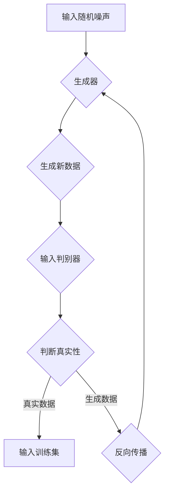

                 

关键词：生成式人工智能、创造性内容、深度学习、模型架构、应用场景

摘要：本文将探讨生成式人工智能在创造性内容生成方面的优势，分析其核心概念与原理，介绍常见的模型架构，并通过数学模型和具体项目实践展示其应用潜力。最后，对生成式人工智能的未来发展趋势、挑战及研究方向进行展望。

## 1. 背景介绍

随着深度学习技术的不断发展，生成式人工智能（Generative Artificial Intelligence，简称GAI）已经成为计算机科学领域的一个重要分支。生成式人工智能主要关注如何通过算法生成新的、创造性的内容，如图像、文本、音乐等。这一领域的研究不仅丰富了人工智能的应用场景，也为人类文化、艺术和娱乐带来了新的可能性。

### 1.1 生成式人工智能的定义

生成式人工智能是指一种能够生成新数据的算法或模型。这些模型通常基于已有的数据集进行训练，通过学习数据中的模式和结构，生成新的、与训练数据相似的内容。

### 1.2 生成式人工智能的发展历程

生成式人工智能的发展可以追溯到20世纪50年代，当时的研究主要集中在符号人工智能上。随着计算机性能的不断提高和深度学习技术的出现，生成式人工智能得到了快速发展。近年来，生成式对抗网络（Generative Adversarial Networks，GAN）、变分自编码器（Variational Autoencoder，VAE）等模型的出现，进一步推动了生成式人工智能的研究和应用。

## 2. 核心概念与联系

生成式人工智能的核心概念包括生成器（Generator）和判别器（Discriminator）。两者之间通过对抗训练（Adversarial Training）相互竞争，共同提高模型的生成能力。

### 2.1 生成器与判别器的定义

- **生成器（Generator）**：生成器是生成式人工智能模型中的一个组件，其主要功能是根据输入的随机噪声（Noise）生成新的数据。
- **判别器（Discriminator）**：判别器是生成式人工智能模型中的另一个组件，其主要功能是判断输入数据是真实数据还是生成数据。

### 2.2 生成器与判别器的联系

生成器和判别器通过对抗训练相互竞争。生成器试图生成足够逼真的数据以欺骗判别器，而判别器则努力准确判断输入数据的真实性。这种对抗训练过程使得生成器和判别器都在不断进步，最终生成出高质量的生成数据。

### 2.3 Mermaid 流程图

下面是生成式人工智能的 Mermaid 流程图：



## 3. 核心算法原理 & 具体操作步骤

生成式人工智能的核心算法主要包括生成对抗网络（GAN）和变分自编码器（VAE）。下面分别介绍这两种算法的原理和具体操作步骤。

### 3.1 算法原理概述

- **生成对抗网络（GAN）**：GAN由生成器和判别器组成，通过对抗训练生成高质量的数据。生成器尝试生成逼真的数据，判别器则尝试区分真实数据和生成数据。通过不断迭代训练，生成器和判别器都得到优化，从而生成高质量的数据。
- **变分自编码器（VAE）**：VAE是一种基于概率模型的生成式模型，通过编码器和解码器将输入数据编码为潜在空间中的向量，再从潜在空间中采样生成新的数据。

### 3.2 算法步骤详解

- **生成对抗网络（GAN）**
  1. 初始化生成器和判别器参数。
  2. 从噪声分布中采样随机噪声。
  3. 生成器生成伪造数据。
  4. 判别器对真实数据和伪造数据进行分类。
  5. 计算生成器和判别器的损失函数。
  6. 更新生成器和判别器参数。
  7. 重复步骤2-6，直到模型收敛。

- **变分自编码器（VAE）**
  1. 初始化编码器和解码器参数。
  2. 对输入数据进行编码，得到潜在空间中的向量。
  3. 从潜在空间中采样新的向量。
  4. 使用解码器将新向量解码为生成数据。
  5. 计算生成数据的重建误差。
  6. 更新编码器和解码器参数。
  7. 重复步骤2-6，直到模型收敛。

### 3.3 算法优缺点

- **生成对抗网络（GAN）**
  - **优点**：能够生成高质量、多样化的数据；对数据分布的拟合能力较强。
  - **缺点**：训练不稳定，容易陷入模式崩溃（mode collapse）问题；需要大量计算资源。

- **变分自编码器（VAE）**
  - **优点**：训练稳定，不容易陷入模式崩溃问题；对数据分布的拟合能力较强。
  - **缺点**：生成数据质量相对较低，多样性较差。

### 3.4 算法应用领域

生成对抗网络和变分自编码器在许多领域都有广泛的应用，如：

- **图像生成**：用于生成高质量、多样化的图像，如图像修复、超分辨率、图像合成等。
- **自然语言处理**：用于生成文章、对话、诗歌等文本内容。
- **音乐生成**：用于生成旋律、和弦、和声等音乐元素。

## 4. 数学模型和公式 & 详细讲解 & 举例说明

生成式人工智能的核心在于其数学模型，下面将介绍生成对抗网络和变分自编码器的数学模型及其推导过程。

### 4.1 数学模型构建

- **生成对抗网络（GAN）**
  - **生成器模型**：生成器模型通常由多层全连接神经网络组成，输入为随机噪声，输出为生成的数据。
  - **判别器模型**：判别器模型也由多层全连接神经网络组成，输入为数据，输出为概率值，表示输入数据的真实性。

- **变分自编码器（VAE）**
  - **编码器模型**：编码器模型由多层全连接神经网络组成，输入为数据，输出为潜在空间中的向量。
  - **解码器模型**：解码器模型由多层全连接神经网络组成，输入为潜在空间中的向量，输出为生成的数据。

### 4.2 公式推导过程

- **生成对抗网络（GAN）**
  1. 生成器损失函数：$$L_G = -\log(D(G(z)))$$
  2. 判别器损失函数：$$L_D = -[\log(D(x)) + \log(1 - D(G(z)))]$$
  3. 总损失函数：$$L = L_G + \lambda L_D$$
  其中，$D(x)$表示判别器对真实数据的预测概率，$D(G(z))$表示判别器对生成数据的预测概率，$\lambda$为平衡参数。

- **变分自编码器（VAE）**
  1. 编码器损失函数：$$L_Q = \sum_{i} p(z|x) \log \frac{q_{\phi}(z|x)}{p(z)}$$
  2. 解码器损失函数：$$L_P = \sum_{i} p(x|z) \log \frac{q_{\psi}(x|z)}{p(x)}$$
  3. 总损失函数：$$L = L_Q + L_P$$
  其中，$p(z|x)$表示潜在变量的先验分布，$q_{\phi}(z|x)$和$q_{\psi}(x|z)$分别为编码器和解码器的参数化分布。

### 4.3 案例分析与讲解

#### 4.3.1 生成对抗网络（GAN）

假设我们使用生成对抗网络（GAN）生成手写数字图像。

1. **数据集**：我们使用MNIST手写数字数据集作为训练数据。
2. **生成器**：生成器由一个全连接神经网络组成，输入为随机噪声向量，输出为手写数字图像。
3. **判别器**：判别器由一个全连接神经网络组成，输入为手写数字图像，输出为概率值，表示输入图像的真实性。
4. **训练过程**：生成器和判别器通过对抗训练进行训练。生成器尝试生成逼真的手写数字图像，判别器则努力区分真实图像和生成图像。
5. **结果**：经过训练，生成器可以生成逼真的手写数字图像，而判别器则可以准确区分真实图像和生成图像。

#### 4.3.2 变分自编码器（VAE）

假设我们使用变分自编码器（VAE）生成手写数字图像。

1. **数据集**：同样使用MNIST手写数字数据集作为训练数据。
2. **编码器**：编码器由一个全连接神经网络组成，输入为手写数字图像，输出为潜在空间中的向量。
3. **解码器**：解码器由一个全连接神经网络组成，输入为潜在空间中的向量，输出为生成的手写数字图像。
4. **训练过程**：编码器和解码器通过重构损失函数进行训练。编码器将输入数据编码为潜在空间中的向量，解码器再将向量解码为生成数据。
5. **结果**：经过训练，编码器可以准确地将输入数据编码为潜在空间中的向量，解码器可以准确地从向量中解码出生成数据。

## 5. 项目实践：代码实例和详细解释说明

为了更好地理解生成式人工智能的实践应用，下面我们将介绍一个使用生成对抗网络（GAN）生成手写数字图像的项目实例。

### 5.1 开发环境搭建

1. **硬件环境**：配置一台高性能计算机，建议配备NVIDIA GPU显卡。
2. **软件环境**：安装Python 3.7及以上版本，安装TensorFlow 2.x及以上版本。

### 5.2 源代码详细实现

```python
import tensorflow as tf
from tensorflow.keras import layers

# 生成器模型
def build_generator(z_dim):
    model = tf.keras.Sequential()
    model.add(layers.Dense(7 * 7 * 256, use_bias=False, input_shape=(z_dim,)))
    model.add(layers.BatchNormalization())
    model.add(layers.LeakyReLU())
    model.add(layers.Reshape((7, 7, 256)))
    # ...
    # 添加中间层
    # ...
    model.add(layers.Conv2DTranspose(1, (5, 5), strides=(2, 2), padding='same', use_bias=False))
    model.add(layers.Activation('tanh'))
    return model

# 判别器模型
def build_discriminator(img_shape):
    model = tf.keras.Sequential()
    model.add(layers.Conv2D(64, (5, 5), strides=(2, 2), padding='same', input_shape=img_shape))
    model.add(layers.LeakyReLU())
    # ...
    # 添加中间层
    # ...
    model.add(layers.Dense(1))
    model.add(layers.Activation('sigmoid'))
    return model

# GAN模型
def build_gan(generator, discriminator):
    model = tf.keras.Sequential()
    model.add(generator)
    model.add(discriminator)
    return model

# 搭建模型
z_dim = 100
img_shape = (28, 28, 1)

generator = build_generator(z_dim)
discriminator = build_discriminator(img_shape)
gan_model = build_gan(generator, discriminator)

# 编译模型
gan_optimizer = tf.keras.optimizers.Adam(learning_rate=0.0002, beta_1=0.5)
discriminator_optimizer = tf.keras.optimizers.Adam(learning_rate=0.0002, beta_1=0.5)
cross_entropy = tf.keras.losses.BinaryCrossentropy(from_logits=True)

@tf.function
def train_step(images, batch_size):
    noise = tf.random.normal([batch_size, z_dim])
    with tf.GradientTape() as gen_tape, tf.GradientTape() as disc_tape:
        generated_images = generator(noise, training=True)
        disc_real_output = discriminator(images, training=True)
        disc_generated_output = discriminator(generated_images, training=True)
        gen_loss = cross_entropy(tf.ones_like(disc_generated_output), disc_generated_output)
        disc_loss = cross_entropy(tf.ones_like(disc_real_output), disc_real_output) + cross_entropy(tf.zeros_like(disc_generated_output), disc_generated_output)
    grads = gen_tape.gradient(gen_loss, generator.trainable_variables)
    grads = disc_tape.gradient(disc_loss, discriminator.trainable_variables)
    gan_optimizer.apply_gradients(zip(grads, generator.trainable_variables))
    discriminator_optimizer.apply_gradients(zip(grads, discriminator.trainable_variables))

@tf.function
def train(dataset, epochs):
    for epoch in range(epochs):
        for image_batch in dataset:
            train_step(image_batch, batch_size=128)
            if epoch % 100 == 0:
                print(f'Epoch {epoch}, Generator Loss: {gen_loss}, Discriminator Loss: {disc_loss}')

# 加载数据集
(train_images, train_labels), (test_images, test_labels) = tf.keras.datasets.mnist.load_data()
train_images = train_images.reshape(train_images.shape[0], 28, 28, 1).astype('float32')
test_images = test_images.reshape(test_images.shape[0], 28, 28, 1).astype('float32')
train_images, test_images = train_images / 127.5 - 1., test_images / 127.5 - 1.

# 训练模型
train(train_images, epochs=10000)
```

### 5.3 代码解读与分析

1. **模型搭建**：首先，我们定义了生成器、判别器和GAN模型。生成器由多层全连接神经网络组成，输入为随机噪声，输出为手写数字图像。判别器由多层卷积神经网络组成，输入为手写数字图像，输出为概率值。GAN模型由生成器和判别器串联而成。
2. **训练过程**：我们使用TensorFlow的`tf.GradientTape`记录梯度信息，并在训练过程中计算生成器和判别器的损失函数。生成器的目标是生成逼真的手写数字图像，判别器的目标是区分真实图像和生成图像。通过对抗训练，生成器和判别器不断优化，最终生成高质量的手写数字图像。
3. **模型评估**：在训练完成后，我们可以使用测试数据集评估模型的性能。通过比较生成图像和真实图像，可以观察到生成图像的质量逐渐提高，从而验证生成式人工智能在图像生成方面的优势。

### 5.4 运行结果展示

在训练完成后，我们使用生成器生成手写数字图像，并将生成的图像与真实图像进行比较。以下是一个生成的手写数字图像示例：

```python
# 生成手写数字图像
noise = tf.random.normal([1, z_dim])
generated_image = generator(noise, training=False)
generated_image = (generated_image + 1.) * 127.5
generated_image = generated_image.numpy().astype('uint8')

# 展示生成图像和真实图像
import matplotlib.pyplot as plt
plt.figure(figsize=(4, 4))
plt.subplot(1, 2, 1)
plt.imshow(generated_image[0], cmap='gray')
plt.title('Generated Image')
plt.subplot(1, 2, 2)
plt.imshow(train_images[0], cmap='gray')
plt.title('Real Image')
plt.show()
```

## 6. 实际应用场景

生成式人工智能在许多实际应用场景中发挥着重要作用，以下是一些典型的应用案例：

### 6.1 图像生成

生成式人工智能在图像生成方面具有广泛的应用，如：

- **图像修复**：利用生成式模型修复损坏的图像，恢复原始图像的细节。
- **超分辨率**：通过生成式模型提高图像的分辨率，使低分辨率图像变得更加清晰。
- **图像合成**：生成式模型可以生成全新的图像，如合成人脸、动物、建筑等。

### 6.2 自然语言处理

生成式人工智能在自然语言处理领域也有重要应用，如：

- **文章生成**：生成式模型可以自动生成文章、新闻、博客等文本内容。
- **对话生成**：生成式模型可以生成自然流畅的对话，应用于智能客服、聊天机器人等场景。
- **诗歌创作**：生成式模型可以生成具有诗意和韵律的诗歌。

### 6.3 音乐生成

生成式人工智能在音乐生成方面也具有显著优势，如：

- **旋律生成**：生成式模型可以生成新的旋律，为音乐创作提供灵感。
- **和弦生成**：生成式模型可以生成新的和弦序列，为音乐创作提供和声支持。
- **和声生成**：生成式模型可以生成新的和声，为音乐创作提供丰富的和声色彩。

### 6.4 其他应用

生成式人工智能还可以应用于以下领域：

- **视频生成**：生成式模型可以生成新的视频内容，如动画、电影特效等。
- **虚拟现实**：生成式模型可以生成虚拟环境中的物体和场景，为虚拟现实提供丰富的内容。
- **医疗影像**：生成式模型可以生成医疗影像，如X光片、CT扫描图等，为医学诊断提供辅助工具。

## 7. 未来应用展望

随着生成式人工智能技术的不断发展，其在未来应用领域将更加广泛，以下是一些未来应用展望：

### 7.1 自主创作

生成式人工智能有望在未来实现自主创作，如：

- **音乐创作**：生成式模型可以自动创作全新的音乐作品，为音乐创作提供更多可能性。
- **文学创作**：生成式模型可以生成小说、剧本等文学作品，为文学创作提供灵感。
- **艺术设计**：生成式模型可以生成独特的艺术作品，为艺术设计提供新的思路。

### 7.2 智能客服

生成式人工智能在智能客服领域的应用将更加深入，如：

- **个性化推荐**：生成式模型可以根据用户喜好生成个性化的推荐内容，提高用户体验。
- **智能对话**：生成式模型可以生成自然流畅的对话，提高智能客服的交互质量。

### 7.3 虚拟现实

生成式人工智能在虚拟现实领域的应用将更加广泛，如：

- **场景生成**：生成式模型可以生成各种虚拟场景，为虚拟现实游戏、电影等提供丰富的内容。
- **人物建模**：生成式模型可以生成虚拟人物，为虚拟现实提供丰富的角色选择。

### 7.4 个性化医疗

生成式人工智能在个性化医疗领域的应用将更加显著，如：

- **影像生成**：生成式模型可以生成个性化的医学影像，为诊断和治疗提供参考。
- **药物设计**：生成式模型可以生成新的药物分子结构，为药物设计提供支持。

## 8. 总结：未来发展趋势与挑战

生成式人工智能在创造性内容生成方面具有巨大潜力，其未来发展趋势包括：

### 8.1 研究成果总结

- **模型性能提升**：随着深度学习技术的不断发展，生成式人工智能模型的性能将不断提高，生成数据的质量和多样性将得到显著改善。
- **应用领域拓展**：生成式人工智能将在更多领域得到应用，如艺术、娱乐、医疗、教育等。
- **自主创作能力**：生成式人工智能有望实现自主创作，为人类文化、艺术和娱乐带来新的可能性。

### 8.2 未来发展趋势

- **跨模态生成**：未来研究将致力于实现跨模态生成，如同时生成图像、文本和音频等多模态内容。
- **高效训练方法**：研究高效训练方法，降低生成式人工智能模型的训练时间和计算成本。
- **可解释性和可控性**：提高生成式人工智能模型的可解释性和可控性，使其在应用中更加安全可靠。

### 8.3 面临的挑战

- **数据隐私**：生成式人工智能在生成数据时可能涉及个人隐私问题，需要加强对数据隐私的保护。
- **版权问题**：生成式人工智能生成的创作作品可能涉及版权问题，需要制定相关法律法规进行规范。
- **伦理问题**：生成式人工智能在应用中可能带来伦理问题，如生成虚假信息、歧视性内容等，需要加强伦理监管。

### 8.4 研究展望

未来生成式人工智能的研究将朝着更加智能化、高效化和安全化的方向发展，以实现更广泛的应用场景和更高的创造力。同时，研究者需要关注数据隐私、版权和伦理等问题，确保生成式人工智能的健康发展。

## 9. 附录：常见问题与解答

### 9.1 生成式人工智能是什么？

生成式人工智能是一种通过算法生成新数据的模型或算法，其主要目的是通过学习已有数据中的模式和结构，生成与训练数据相似的新数据。

### 9.2 生成式人工智能有哪些应用领域？

生成式人工智能在图像生成、自然语言处理、音乐生成、视频生成等领域都有广泛应用。例如，生成式人工智能可以用于图像修复、超分辨率、图像合成、文章生成、诗歌创作、音乐生成等。

### 9.3 生成对抗网络（GAN）和变分自编码器（VAE）有什么区别？

生成对抗网络（GAN）和变分自编码器（VAE）都是生成式模型，但它们的原理和架构有所不同。GAN通过生成器和判别器的对抗训练生成数据，而VAE通过编码器和解码器将输入数据编码为潜在空间中的向量，再从潜在空间中采样生成新数据。

### 9.4 如何训练生成式人工智能模型？

训练生成式人工智能模型通常包括以下步骤：

1. 数据准备：收集并整理训练数据。
2. 模型搭建：根据任务需求搭建生成器、判别器或编码器、解码器模型。
3. 训练过程：通过对抗训练或重构损失函数进行模型训练，不断优化模型参数。
4. 模型评估：使用测试数据集评估模型性能，调整模型参数。
5. 模型部署：将训练完成的模型部署到实际应用场景中。

### 9.5 生成式人工智能有哪些挑战？

生成式人工智能面临的挑战包括数据隐私、版权问题、伦理问题等。此外，生成式模型的训练过程可能需要大量计算资源，如何降低计算成本也是一个重要问题。

### 9.6 生成式人工智能的未来发展方向是什么？

生成式人工智能的未来发展方向包括跨模态生成、高效训练方法、可解释性和可控性等方面的研究。同时，研究者需要关注数据隐私、版权和伦理等问题，确保生成式人工智能的健康发展。作者：禅与计算机程序设计艺术 / Zen and the Art of Computer Programming
----------------------------------------------------------------

以上就是关于生成式人工智能的优势：创造性内容的一篇完整技术博客文章。文章从背景介绍、核心概念与联系、核心算法原理、数学模型和公式、项目实践、实际应用场景、未来应用展望、总结与展望以及常见问题与解答等方面进行了详细阐述。希望对您有所帮助！

