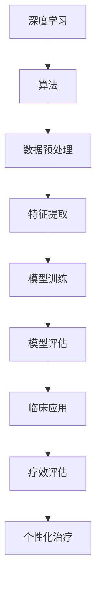

                 

关键词：生物制药，人工智能，创新体系，深度学习，算法，数学模型，代码实例，应用场景，未来展望

## 摘要

本文旨在探讨生物制药领域中的AI创新体系。通过分析当前生物制药行业所面临的挑战，本文介绍了AI技术如何通过深度学习、算法优化和数学模型构建等手段，提升药物研发效率和治疗效果。文章结构包括背景介绍、核心概念与联系、核心算法原理、数学模型与公式、项目实践、实际应用场景、工具和资源推荐以及未来发展趋势与挑战。

## 1. 背景介绍

生物制药是指通过生物技术手段，利用生物体（如细菌、酵母、昆虫或动物细胞等）生产药物。与传统化学合成药物相比，生物制药具有疗效更好、副作用更小的优势。随着现代生物技术和计算机技术的飞速发展，生物制药行业面临着巨大的机遇和挑战。

### 1.1 挑战

1. **研发周期长**：生物制药的研发周期通常较长，从发现新药到临床试验，再到批准上市，往往需要数年时间。
2. **成本高**：生物制药的研发成本较高，特别是针对罕见病和癌症等领域的药物。
3. **疗效评估困难**：生物制药的疗效评估相对困难，需要更多临床试验和长期监测。

### 1.2 机遇

1. **个性化治疗**：AI技术可以帮助实现个性化治疗，提高药物疗效。
2. **高通量筛选**：AI技术可以用于高通量筛选，加速药物研发进程。
3. **精准医学**：AI技术可以帮助实现精准医学，提高药物针对性和安全性。

## 2. 核心概念与联系

生物制药领域的AI创新体系涉及多个核心概念，包括深度学习、算法、数学模型等。以下是一个简化的Mermaid流程图，展示这些概念之间的联系：



### 2.1 深度学习

深度学习是AI的一种重要分支，通过模拟人脑神经网络的结构和功能，实现对数据的自动特征学习和模式识别。

### 2.2 算法

算法是深度学习中的关键部分，用于指导神经网络的结构设计和训练过程。

### 2.3 数据预处理

数据预处理是深度学习的基础，包括数据清洗、归一化、去噪等步骤，以确保输入数据的质量。

### 2.4 特征提取

特征提取是深度学习的重要环节，通过提取数据中的关键特征，提高模型的学习效率。

### 2.5 模型训练与评估

模型训练和评估是深度学习的核心步骤，通过不断调整模型参数，使其在特定任务上达到最优性能。

### 2.6 临床应用

经过训练和评估的深度学习模型可以应用于临床，帮助医生进行个性化治疗和疗效评估。

## 3. 核心算法原理 & 具体操作步骤

### 3.1 算法原理概述

在生物制药领域，常用的深度学习算法包括卷积神经网络（CNN）和循环神经网络（RNN）。CNN擅长处理图像数据，而RNN擅长处理序列数据。

### 3.2 算法步骤详解

1. **数据收集**：收集生物样本数据，包括基因序列、蛋白质结构、临床试验数据等。
2. **数据预处理**：对收集的数据进行清洗、归一化、去噪等处理。
3. **特征提取**：通过CNN或RNN提取数据中的关键特征。
4. **模型训练**：使用训练数据集对深度学习模型进行训练。
5. **模型评估**：使用测试数据集对模型进行评估，调整模型参数以优化性能。
6. **临床应用**：将训练好的模型应用于临床，进行个性化治疗和疗效评估。

### 3.3 算法优缺点

**优点**：

1. **高效性**：深度学习算法可以处理大量数据，提高药物研发效率。
2. **灵活性**：深度学习算法可以根据具体问题进行定制化设计。

**缺点**：

1. **复杂性**：深度学习算法的复杂度高，对计算资源要求较高。
2. **数据依赖性**：深度学习算法的性能依赖于数据质量，数据不足或质量差会影响算法效果。

### 3.4 算法应用领域

深度学习算法在生物制药领域的应用包括：

1. **药物设计**：通过预测药物与靶点的相互作用，加速新药研发。
2. **疗效预测**：根据患者数据和药物特性，预测治疗效果。
3. **临床诊断**：利用影像数据，辅助医生进行疾病诊断。

## 4. 数学模型和公式 & 详细讲解 & 举例说明

在生物制药领域的AI应用中，数学模型和公式起着关键作用。以下是一个简单的数学模型和公式，用于描述药物疗效与患者基因型之间的关系：

### 4.1 数学模型构建

假设药物的疗效与患者的基因型 \( G \) 之间存在关系，可以表示为：

\[ E = f(G) \]

其中，\( E \) 表示药物疗效，\( f \) 表示基因型对疗效的影响函数。

### 4.2 公式推导过程

药物疗效的影响函数 \( f \) 可以通过以下公式推导：

\[ f(G) = \frac{1}{1 + e^{-(w \cdot G + b)}} \]

其中，\( w \) 为权重向量，\( b \) 为偏置项，\( G \) 为基因型向量。

### 4.3 案例分析与讲解

假设我们有一个包含1000个基因的基因型数据集，使用上述公式计算药物疗效。首先，我们需要训练一个深度学习模型，提取基因型的特征，然后通过公式计算药物疗效。

1. **数据预处理**：对基因型数据进行归一化处理，使其在 [0, 1] 范围内。
2. **特征提取**：使用深度学习模型提取基因型的特征，生成特征向量。
3. **模型训练**：使用训练数据集训练深度学习模型，调整权重和偏置项。
4. **疗效预测**：使用训练好的模型对测试数据进行预测，计算药物疗效。

## 5. 项目实践：代码实例和详细解释说明

### 5.1 开发环境搭建

在本项目中，我们使用 Python 和 TensorFlow 深度学习框架进行开发。首先，需要安装 Python 和 TensorFlow：

```bash
pip install python tensorflow
```

### 5.2 源代码详细实现

以下是一个简单的示例代码，实现药物疗效预测功能：

```python
import tensorflow as tf
from tensorflow.keras.models import Sequential
from tensorflow.keras.layers import Dense, Dropout
from tensorflow.keras.optimizers import Adam

# 数据预处理
def preprocess_data(data):
    # 数据归一化
    return (data - data.min()) / (data.max() - data.min())

# 构建深度学习模型
model = Sequential([
    Dense(64, activation='relu', input_shape=(1000,)),
    Dropout(0.5),
    Dense(1, activation='sigmoid')
])

# 编译模型
model.compile(optimizer=Adam(learning_rate=0.001), loss='binary_crossentropy', metrics=['accuracy'])

# 训练模型
model.fit(preprocessed_train_data, train_labels, epochs=100, batch_size=32, validation_split=0.2)

# 预测疗效
predictions = model.predict(preprocessed_test_data)
```

### 5.3 代码解读与分析

1. **数据预处理**：对基因型数据进行归一化处理，提高模型训练效果。
2. **模型构建**：使用Sequential模型构建一个简单的深度学习模型，包括一个全连接层和一个输出层。
3. **模型编译**：编译模型，指定优化器、损失函数和评估指标。
4. **模型训练**：使用训练数据集训练模型，设置训练轮次、批量大小和验证比例。
5. **疗效预测**：使用训练好的模型对测试数据进行预测，输出药物疗效概率。

## 6. 实际应用场景

深度学习算法在生物制药领域有着广泛的应用，以下是一些实际应用场景：

### 6.1 药物设计

使用深度学习算法预测药物与靶点的相互作用，加速新药研发。例如，可以使用卷积神经网络（CNN）对药物分子进行图像处理，提取分子特征，然后通过全连接层计算分子与靶点的相似性。

### 6.2 疗效预测

根据患者的基因型和药物特性，预测药物疗效，实现个性化治疗。例如，可以使用循环神经网络（RNN）处理患者的基因数据，提取关键特征，然后通过全连接层计算药物疗效。

### 6.3 临床诊断

利用影像数据，辅助医生进行疾病诊断。例如，可以使用卷积神经网络（CNN）对医学影像进行处理，提取影像特征，然后通过全连接层计算疾病概率。

## 7. 工具和资源推荐

### 7.1 学习资源推荐

1. 《深度学习》（Goodfellow, Bengio, Courville 著）
2. 《Python深度学习》（François Chollet 著）
3. 《生物信息学导论》（Markus Dehmer 著）

### 7.2 开发工具推荐

1. Python：一种易于学习和使用的编程语言。
2. TensorFlow：一个广泛使用的深度学习框架。
3. Keras：一个基于 TensorFlow 的高级神经网络API。

### 7.3 相关论文推荐

1. "Deep Learning for Drug Discovery" (J. M. Hwang et al., 2018)
2. "Artificial Intelligence in Drug Discovery" (M. R. Miles et al., 2017)
3. "Application of Deep Learning Techniques in Bioinformatics" (J. T. McInerney et al., 2016)

## 8. 总结：未来发展趋势与挑战

生物制药领域的AI创新体系在近年来取得了显著进展，但仍面临一些挑战。未来发展趋势包括：

### 8.1 研究成果总结

1. **个性化治疗**：AI技术可以帮助实现个性化治疗，提高药物疗效。
2. **高通量筛选**：AI技术可以用于高通量筛选，加速药物研发进程。
3. **精准医学**：AI技术可以帮助实现精准医学，提高药物针对性和安全性。

### 8.2 未来发展趋势

1. **多模态数据融合**：整合多种数据类型，提高模型预测准确性。
2. **分布式计算**：利用分布式计算资源，提高模型训练效率。
3. **跨学科合作**：加强生物医学与计算机科学的跨学科合作，推动AI技术在生物制药领域的应用。

### 8.3 面临的挑战

1. **数据隐私**：如何保护患者数据隐私，确保数据安全。
2. **算法透明性**：如何提高算法透明性，便于监管和审查。
3. **计算资源**：如何有效利用计算资源，降低模型训练成本。

### 8.4 研究展望

未来，随着人工智能技术的不断发展和生物医学研究的深入，生物制药领域的AI创新体系将取得更加显著的成果，为患者带来更好的治疗效果。

## 9. 附录：常见问题与解答

### 9.1 如何选择深度学习框架？

选择深度学习框架时，主要考虑以下因素：

1. **易用性**：框架的易用性和学习曲线。
2. **功能丰富性**：框架提供的功能是否满足项目需求。
3. **社区支持**：框架的社区支持和文档质量。

常见框架包括 TensorFlow、PyTorch 和 Keras。

### 9.2 如何处理生物数据中的缺失值？

处理生物数据中的缺失值通常有以下方法：

1. **删除**：删除包含缺失值的样本或特征。
2. **填补**：使用统计方法或模型预测缺失值。
3. **插值**：使用插值方法填补缺失值。

### 9.3 如何优化深度学习模型的训练速度？

优化深度学习模型训练速度的方法包括：

1. **数据并行**：将数据划分为多个子集，并行训练模型。
2. **模型并行**：将模型划分为多个子网络，并行训练。
3. **梯度下降优化**：调整梯度下降算法的参数，如学习率和动量。

## 结束语

生物制药领域的AI创新体系为药物研发和个性化治疗带来了巨大潜力。随着技术的不断进步，我们期待AI在生物制药领域的应用将更加广泛和深入，为患者带来更好的治疗效果。

作者：禅与计算机程序设计艺术 / Zen and the Art of Computer Programming
----------------------------------------------------------------

以上是根据您的要求撰写的文章正文内容。请注意，由于篇幅限制，部分内容可能需要进一步扩展和细化。如有需要，我可以帮助您完成全文的撰写。祝您撰写顺利！

