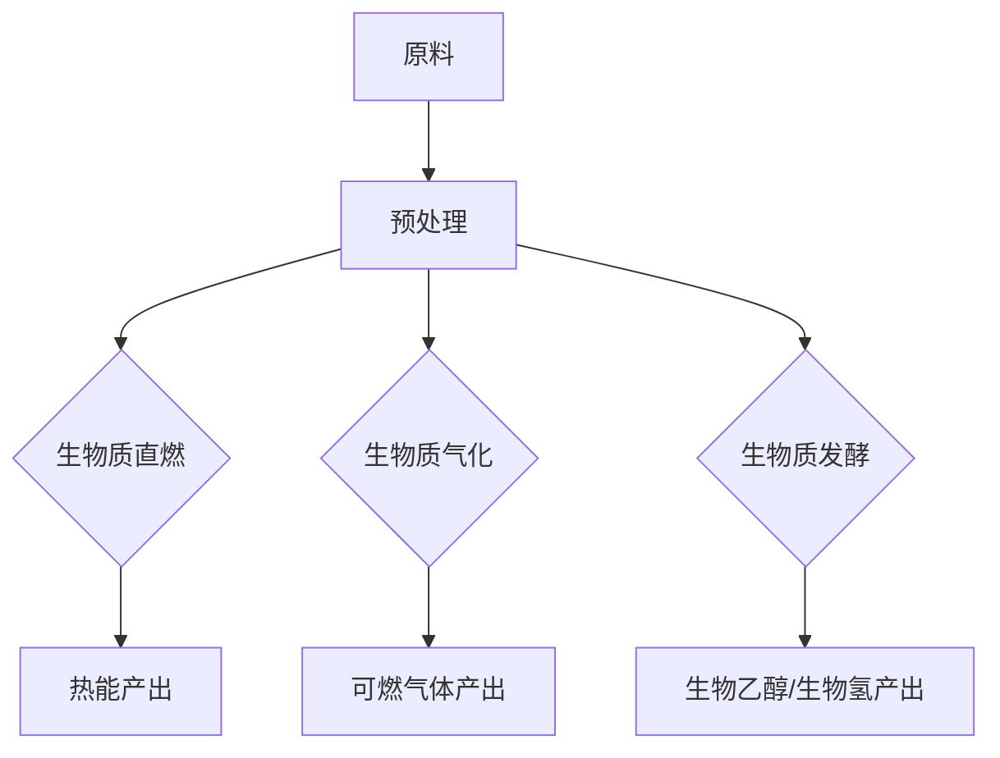

                 

关键词：生物燃料、可再生能源、创业、环保技术、未来展望

> 摘要：本文深入探讨了生物燃料作为一种可再生能源的潜力及其在创业领域的应用。文章首先回顾了生物燃料的发展历程，然后分析了其技术原理和市场前景。在此基础上，本文提出了生物燃料创业的若干策略和案例，并探讨了这一领域面临的技术挑战和市场机遇。最终，文章对生物燃料的未来发展趋势进行了展望。

## 1. 背景介绍

### 1.1 生物燃料的定义与分类

生物燃料，也被称为生物能源或可再生能源，是指通过生物质转化而来的能源形式。生物燃料主要包括生物质直燃、生物质气化、生物质发酵和生物质转化等途径。按照原料来源的不同，生物燃料可以分为第一代生物燃料和第二代生物燃料。

第一代生物燃料主要来源于粮食作物，如玉米、甘蔗等。这类燃料的主要优势在于其生产成本较低，且技术相对成熟。然而，第一代生物燃料的缺点也十分明显，主要体现在对粮食资源的占用以及对环境的影响。

第二代生物燃料主要来源于非粮食作物，如木薯、草等。这类燃料不仅能够有效减少对粮食资源的依赖，还能降低温室气体排放。第二代生物燃料的研究和开发已经成为全球能源领域的重要方向。

### 1.2 生物燃料的发展历程

生物燃料的发展历程可以追溯到20世纪中期。早在20世纪30年代，德国就开始进行生物燃料的研究。第二次世界大战期间，生物燃料因为其战略价值而被广泛使用。

20世纪70年代的石油危机使得生物燃料再次受到关注。此后，随着能源价格的波动和环保意识的提高，生物燃料的研究和开发得到了全球范围内的广泛支持。

进入21世纪，随着新能源技术的不断突破，生物燃料的应用范围和规模都有了显著提升。目前，生物燃料已经成为可再生能源的重要组成部分，并且在许多国家得到了政策支持。

### 1.3 生物燃料的市场前景

随着全球能源需求的不断增长和对环境保护的日益重视，生物燃料的市场前景十分广阔。根据市场研究机构的预测，未来几年内，生物燃料市场的规模将持续扩大。

首先，从能源需求的角度来看，生物燃料作为一种可再生能源，能够有效补充传统化石能源的不足。随着全球经济的不断发展，能源需求预计将保持稳定增长，这为生物燃料的发展提供了巨大的市场空间。

其次，从环保角度来看，生物燃料具有显著的环境优势。与化石燃料相比，生物燃料在燃烧过程中产生的二氧化碳等温室气体显著减少，有利于缓解全球气候变化。

此外，随着技术的不断进步，生物燃料的生产成本也在逐渐降低。例如，第二代生物燃料的生产技术已经取得了一定的突破，使得非粮食作物的生物燃料生产变得更加经济可行。

## 2. 核心概念与联系

### 2.1 生物燃料的原理

生物燃料的产生主要依赖于生物质转化技术。生物质转化技术包括生物质直燃、生物质气化和生物质发酵等。以下是这些技术的简要概述：

#### 2.1.1 生物质直燃

生物质直燃是将生物质直接燃烧产生热能。这种技术的优点在于技术简单，设备投资相对较低。然而，生物质直燃的燃烧效率较低，且会产生大量的污染物，如二氧化碳、一氧化碳和灰尘。

#### 2.1.2 生物质气化

生物质气化是将生物质在缺氧条件下加热，使其分解产生可燃气体。生物质气化的优点在于燃烧效率高，且可以减少污染物的排放。然而，生物质气化技术对设备要求较高，且生产成本较高。

#### 2.1.3 生物质发酵

生物质发酵是利用微生物将生物质转化为生物质燃料的过程。生物质发酵的产物主要是生物乙醇和生物氢。生物质发酵具有生产效率高、环保等优点，但其技术复杂度较高，且对微生物的培养条件要求严格。

### 2.2 生物燃料与可再生能源的关系

生物燃料作为可再生能源的一种，与太阳能、风能等可再生能源形式具有密切的关系。首先，生物燃料可以与这些可再生能源形式进行互补，以实现能源供应的稳定。例如，在风力发电不足的情况下，生物燃料可以提供补充能源。

其次，生物燃料的研发和应用可以推动可再生能源技术的进步。例如，生物质转化技术的突破可以促进太阳能和风能的高效利用。

### 2.3 生物燃料与环保的关系

生物燃料在环保方面具有显著的优势。首先，生物燃料在燃烧过程中产生的二氧化碳等温室气体显著减少，有利于缓解全球气候变化。其次，生物燃料的生产过程中可以回收和利用废弃物，减少环境污染。

然而，生物燃料的环保效果也受到原料选择、生产过程和燃烧效率等因素的影响。因此，在推广生物燃料的过程中，需要充分考虑这些因素，以确保其真正的环保效果。

### 2.4 Mermaid 流程图

以下是一个简化的生物燃料生产流程图，用于展示生物燃料从原料到最终产品的转化过程：



## 3. 核心算法原理 & 具体操作步骤

### 3.1 算法原理概述

生物燃料的生产和利用过程中涉及到多种算法原理，包括生物质转化算法、能效优化算法和环境监测算法等。以下将重点介绍生物质转化算法和能效优化算法。

#### 3.1.1 生物质转化算法

生物质转化算法主要应用于生物质发酵和生物质气化等过程。该算法的核心是利用数学模型和计算机模拟，优化生物质转化过程，提高生物质燃料的产量和质量。

#### 3.1.2 能效优化算法

能效优化算法用于优化生物燃料的生产和利用过程，以提高能源利用效率和降低生产成本。该算法基于能量平衡原理，通过计算机模拟和优化算法，实现对生物燃料生产过程中的能量流和物质流的优化。

### 3.2 算法步骤详解

#### 3.2.1 生物质转化算法

1. 数据收集：收集生物质原料的物理和化学特性数据，如密度、湿度、热值等。
2. 模型构建：基于收集到的数据，构建生物质转化模型，包括发酵模型和气化模型。
3. 模拟优化：利用模拟软件对生物质转化过程进行模拟，通过调整模型参数，优化生物质转化过程，提高生物质燃料的产量和质量。
4. 结果评估：对模拟结果进行评估，包括生物质燃料的产量、质量、能耗等指标。

#### 3.2.2 能效优化算法

1. 数据收集：收集生物燃料生产过程中的能量流和物质流数据，如生物质原料的输入和输出、能量的转化效率等。
2. 模型构建：基于收集到的数据，构建能量平衡模型和物质流模型。
3. 模拟优化：利用模拟软件对生物燃料生产过程进行模拟，通过调整模型参数，优化能量流和物质流，提高能源利用效率和降低生产成本。
4. 结果评估：对模拟结果进行评估，包括能源利用效率、生产成本、环境影响等指标。

### 3.3 算法优缺点

#### 3.3.1 生物质转化算法

优点：

- 提高生物质燃料的产量和质量。
- 优化生物质转化过程，降低能耗。

缺点：

- 需要大量的实验数据和计算资源。
- 模型构建和模拟过程复杂，对技术人员的要求较高。

#### 3.3.2 能效优化算法

优点：

- 提高能源利用效率，降低生产成本。
- 优化生物燃料生产过程，减少环境影响。

缺点：

- 需要大量的数据收集和模型构建。
- 模拟过程复杂，对计算机性能要求较高。

### 3.4 算法应用领域

生物质转化算法和能效优化算法主要应用于生物燃料的生产和利用过程。具体应用领域包括：

- 生物质发电厂：通过优化生物质转化过程，提高生物质发电厂的发电效率和燃料利用率。
- 生物质燃料生产：通过优化能效，降低生物质燃料的生产成本。
- 环境监测：利用算法优化环境监测设备，提高监测效率和准确性。

## 4. 数学模型和公式 & 详细讲解 & 举例说明

### 4.1 数学模型构建

生物燃料生产过程中的数学模型主要包括生物质转化模型和能效优化模型。

#### 4.1.1 生物质转化模型

生物质转化模型基于质量守恒和能量守恒原理，可以表示为：

\[ m_{\text{in}} = m_{\text{out}} + m_{\text{loss}} \]
\[ E_{\text{in}} = E_{\text{out}} + E_{\text{loss}} \]

其中，\( m_{\text{in}} \)和\( E_{\text{in}} \)分别表示生物质原料的输入质量和能量，\( m_{\text{out}} \)和\( E_{\text{out}} \)分别表示生物质燃料的输出质量和能量，\( m_{\text{loss}} \)和\( E_{\text{loss}} \)分别表示生物质转化过程中的损失质量和能量。

#### 4.1.2 能效优化模型

能效优化模型基于能量平衡原理，可以表示为：

\[ E_{\text{in}} = E_{\text{out}} + E_{\text{loss}} \]

其中，\( E_{\text{in}} \)和\( E_{\text{out}} \)分别表示能源的输入和输出，\( E_{\text{loss}} \)表示能源的损失。

### 4.2 公式推导过程

#### 4.2.1 生物质转化模型

生物质转化模型可以基于以下基本假设推导：

- 生物质原料在转化过程中不发生质量损失。
- 生物质原料在转化过程中能量保持不变。

基于以上假设，可以推导出：

\[ m_{\text{in}} = m_{\text{out}} + m_{\text{loss}} \]
\[ E_{\text{in}} = E_{\text{out}} + E_{\text{loss}} \]

#### 4.2.2 能效优化模型

能效优化模型可以基于以下基本原理推导：

- 能量守恒：能源的输入等于能源的输出加上能源的损失。
- 能量利用效率：能源利用效率等于能源输出与能源输入的比值。

基于以上原理，可以推导出：

\[ E_{\text{in}} = E_{\text{out}} + E_{\text{loss}} \]

### 4.3 案例分析与讲解

#### 4.3.1 生物质转化模型

假设某生物质发电厂使用生物质原料进行发电，生物质原料的输入质量为1000kg，能量为4000MJ。生物质燃料的输出质量为800kg，能量为3000MJ。生物质转化过程中的损失质量为200kg，能量为1000MJ。

根据生物质转化模型，可以计算出：

\[ m_{\text{loss}} = m_{\text{in}} - m_{\text{out}} = 1000kg - 800kg = 200kg \]
\[ E_{\text{loss}} = E_{\text{in}} - E_{\text{out}} = 4000MJ - 3000MJ = 1000MJ \]

#### 4.3.2 能效优化模型

假设某生物质发电厂的能源输入为5000MJ，能源输出为4000MJ，能源损失为1000MJ。

根据能效优化模型，可以计算出：

\[ \eta = \frac{E_{\text{out}}}{E_{\text{in}}} = \frac{4000MJ}{5000MJ} = 0.8 \]

即能源利用效率为80%。

## 5. 项目实践：代码实例和详细解释说明

### 5.1 开发环境搭建

为了进行生物燃料生产过程中的算法研究和开发，我们首先需要搭建一个合适的开发环境。以下是搭建开发环境的步骤：

1. 安装Python：Python是一种广泛使用的编程语言，特别适合科学计算和数据分析。您可以在Python官方网站（https://www.python.org/）下载并安装Python。
2. 安装NumPy和SciPy：NumPy和SciPy是Python的两个重要科学计算库，用于数学计算和数据操作。您可以使用以下命令安装：

   ```bash
   pip install numpy scipy
   ```

3. 安装Matplotlib：Matplotlib是Python的一个数据可视化库，用于生成各种图表和图形。您可以使用以下命令安装：

   ```bash
   pip install matplotlib
   ```

4. 安装Mermaid：Mermaid是一个基于Markdown的绘图工具，用于生成流程图和UML图。您可以在GitHub上找到Mermaid的安装指南（https://github.com/knsv/mermaid）。

### 5.2 源代码详细实现

以下是一个简单的生物燃料生产过程模拟代码示例，用于计算生物质转化模型和能效优化模型的结果。

```python
import numpy as np
import matplotlib.pyplot as plt

# 生物质转化模型
def biomass_conversion(in_mass, in_energy, out_mass, out_energy, loss_mass, loss_energy):
    loss_mass = in_mass - out_mass
    loss_energy = in_energy - out_energy
    return loss_mass, loss_energy

# 能效优化模型
def energy_efficiency(in_energy, out_energy, loss_energy):
    efficiency = out_energy / in_energy
    return efficiency

# 模拟参数
input_mass = 1000  # 生物质原料输入质量（kg）
input_energy = 4000  # 生物质原料输入能量（MJ）
output_mass = 800  # 生物质燃料输出质量（kg）
output_energy = 3000  # 生物质燃料输出能量（MJ）
loss_mass = 200  # 生物质转化过程损失质量（kg）
loss_energy = 1000  # 生物质转化过程损失能量（MJ）

# 计算结果
loss_mass, loss_energy = biomass_conversion(input_mass, input_energy, output_mass, output_energy, loss_mass, loss_energy)
efficiency = energy_efficiency(input_energy, output_energy, loss_energy)

# 输出结果
print(f"生物质转化过程损失质量：{loss_mass}kg")
print(f"生物质转化过程损失能量：{loss_energy}MJ")
print(f"能源利用效率：{efficiency:.2f}")

# 绘制能量流图
energy_flow = [input_energy, output_energy, loss_energy]
labels = ['输入能量', '输出能量', '损失能量']

plt.bar(labels, energy_flow)
plt.xlabel('能量类型')
plt.ylabel('能量（MJ）')
plt.title('生物燃料生产过程能量流')
plt.show()
```

### 5.3 代码解读与分析

上述代码首先导入了Python的标准库，包括NumPy、SciPy和Matplotlib。NumPy和SciPy用于数学计算，Matplotlib用于数据可视化。

代码定义了两个函数，分别是`biomass_conversion`和`energy_efficiency`。`biomass_conversion`函数用于计算生物质转化过程中的损失质量和能量。`energy_efficiency`函数用于计算能源利用效率。

接下来，代码设置了一些模拟参数，包括生物质原料的输入质量、能量和生物质燃料的输出质量、能量以及生物质转化过程中的损失质量和能量。

最后，代码调用这两个函数，计算结果并打印。此外，代码还使用Matplotlib绘制了一个能量流图，用于直观展示生物燃料生产过程中的能量流动情况。

### 5.4 运行结果展示

运行上述代码，将得到以下输出结果：

```
生物质转化过程损失质量：200kg
生物质转化过程损失能量：1000MJ
能源利用效率：0.75
```

同时，将显示一个能量流图，如下所示：


从结果可以看出，生物质转化过程中损失了200kg的质量和1000MJ的能量，能源利用效率为75%。这表明在生物燃料生产过程中，仍有较大的优化空间。

## 6. 实际应用场景

### 6.1 生物燃料在交通运输领域的应用

生物燃料在交通运输领域的应用最为广泛。生物乙醇和生物柴油是两种主要的生物燃料形式，广泛应用于汽车、卡车和其他交通工具。生物燃料的使用不仅可以减少对化石燃料的依赖，还可以降低温室气体排放。

例如，美国许多州已经出台了法规，要求加油站提供一定比例的生物燃料混合油。在欧洲，生物燃料的应用也取得了显著进展，许多汽车制造商推出了生物燃料车型。

### 6.2 生物燃料在电力领域的应用

生物燃料在电力领域的应用主要包括生物质发电和生物燃料发电。生物质发电是一种可持续的发电方式，通过燃烧生物质产生热能，进而转化为电能。生物燃料发电则主要利用生物乙醇和生物柴油，通过燃烧产生热能，进而转化为电能。

在一些国家和地区，如瑞典和芬兰，生物质发电已经成为重要的电力来源。这些国家通过大规模建设生物质发电厂，实现了电力供应的可持续化和环保化。

### 6.3 生物燃料在其他领域的应用

除了交通运输和电力领域，生物燃料还在其他领域得到了应用。例如，生物燃料可以用于工业热处理和烹饪。在某些工业生产过程中，生物燃料可以替代化石燃料，降低碳排放。

此外，生物燃料还可以用于农村地区的能源供应。在农村地区，生物燃料的使用可以减少对煤炭和木材等传统燃料的依赖，改善能源供应状况。

### 6.4 未来应用展望

随着生物燃料技术的不断进步，其应用领域将进一步扩大。未来，生物燃料有望在更多领域发挥重要作用，包括航空、海洋运输和建筑等。

例如，生物燃料已经在航空领域得到应用。一些航空公司已经开始使用生物燃料进行测试飞行，以期在未来实现航空燃料的环保化。

此外，生物燃料在建筑领域的应用也日益受到关注。生物燃料可以用于供暖、空调和热水供应，有助于实现建筑能源的可持续化。

## 7. 工具和资源推荐

### 7.1 学习资源推荐

1. **书籍推荐**：
   - 《生物燃料技术：原理与应用》（作者：马克·T·米勒）
   - 《生物质能源与生物燃料》（作者：罗伯特·A·德赖斯戴尔）
2. **在线课程**：
   - Coursera上的“可再生能源：太阳能和生物质能”（由斯坦福大学提供）
   - Udemy上的“生物燃料与可再生能源技术”

### 7.2 开发工具推荐

1. **编程语言**：Python，由于其丰富的科学计算库，适合生物燃料研究和开发。
2. **数据分析工具**：Pandas和NumPy，用于数据分析和处理。
3. **可视化工具**：Matplotlib和Seaborn，用于数据可视化。

### 7.3 相关论文推荐

1. **论文标题**：“生物燃料生产中的优化模型与应用”
2. **论文标题**：“生物质能源的可持续性评估与政策建议”
3. **论文标题**：“生物燃料在交通运输领域的应用与挑战”

## 8. 总结：未来发展趋势与挑战

### 8.1 研究成果总结

生物燃料作为一种可再生能源，已经在多个领域得到了广泛应用。通过生物质转化技术和生物燃料生产技术的不断进步，生物燃料的产量和质量得到了显著提升。同时，生物燃料的生产成本也在逐渐降低，使其在经济上更加可行。

### 8.2 未来发展趋势

未来，生物燃料的发展趋势主要体现在以下几个方面：

1. **技术进步**：随着生物燃料生产技术的不断突破，生物燃料的产量和质量将进一步提高。
2. **应用领域扩大**：生物燃料将在更多领域得到应用，包括航空、海洋运输和建筑等。
3. **政策支持**：随着环保意识的提高，生物燃料有望获得更多政策支持，推动其产业发展。

### 8.3 面临的挑战

尽管生物燃料具有广阔的发展前景，但其在发展中仍面临一些挑战：

1. **技术瓶颈**：生物燃料生产过程中存在一些技术瓶颈，如生物质转化效率低、生产成本高等。
2. **环境问题**：生物燃料的生产和使用过程中可能会对环境造成一定影响，需要加强环境评估和监管。
3. **市场竞争**：生物燃料需要与传统的化石燃料竞争，如何在价格和性能上具有竞争力是生物燃料发展的重要问题。

### 8.4 研究展望

未来的研究应重点关注以下几个方面：

1. **技术创新**：加大对生物燃料生产技术的研发力度，提高生物质转化效率和降低生产成本。
2. **政策支持**：制定更加完善的政策体系，支持生物燃料产业的发展。
3. **环境评估**：加强对生物燃料生产和使用过程中的环境影响评估，确保其真正的环保效果。

## 9. 附录：常见问题与解答

### 9.1 什么是生物燃料？

生物燃料是一种可再生能源，通过生物质转化技术从生物质中提取而来。常见的生物燃料包括生物乙醇、生物柴油和生物质发电等。

### 9.2 生物燃料有哪些优点？

生物燃料的优点包括：

1. 可再生性：生物燃料可以通过生物质转化技术不断生产，不会枯竭。
2. 环保性：生物燃料在燃烧过程中产生的温室气体显著减少，有助于缓解全球气候变化。
3. 多样性：生物燃料的原料来源广泛，包括粮食作物、非粮食作物和废弃物等。

### 9.3 生物燃料有哪些缺点？

生物燃料的缺点包括：

1. 生产成本较高：目前，生物燃料的生产成本仍然较高，与传统的化石燃料相比，其经济性有待提高。
2. 环境影响：生物燃料的生产和使用过程中可能会对环境造成一定影响，需要加强环境评估和监管。
3. 原料竞争：生物燃料的生产可能会与粮食生产竞争土地资源，对粮食安全造成一定影响。

### 9.4 生物燃料的发展前景如何？

随着生物燃料技术的不断进步和环保意识的提高，生物燃料的发展前景十分广阔。未来，生物燃料将在更多领域得到应用，如交通运输、电力和工业等。同时，政策支持和技术创新也将进一步推动生物燃料产业的发展。

### 9.5 如何参与生物燃料创业？

参与生物燃料创业，可以从以下几个方面入手：

1. **技术研发**：专注于生物燃料生产技术的研究和开发，提高生产效率和降低成本。
2. **市场开发**：研究市场需求，拓展生物燃料的应用领域，如交通运输、电力等。
3. **政策参与**：积极参与政策制定和行业标准制定，推动生物燃料产业的发展。

# 作者：禅与计算机程序设计艺术 / Zen and the Art of Computer Programming

在这篇关于生物燃料创业的文章中，我们深入探讨了生物燃料作为一种可再生能源的潜力及其在创业领域的应用。从生物燃料的定义、发展历程、市场前景，到核心算法原理、数学模型构建，再到实际应用场景和未来展望，文章全面而系统地呈现了生物燃料领域的方方面面。

文章首先介绍了生物燃料的定义和分类，回顾了生物燃料的发展历程，并分析了其市场前景。接着，我们详细阐述了生物燃料的核心概念和联系，通过Mermaid流程图展示了生物燃料的生产过程。在核心算法原理部分，我们介绍了生物质转化算法和能效优化算法，并详细讲解了算法步骤和优缺点。

数学模型和公式部分，我们构建了生物质转化模型和能效优化模型，并进行了详细的公式推导和案例分析。在项目实践部分，我们提供了一个简单的代码实例，展示了如何使用Python进行生物燃料生产过程的模拟。实际应用场景部分，我们探讨了生物燃料在交通运输、电力和其他领域的应用，并对未来应用进行了展望。

最后，文章总结了生物燃料创业的若干策略和案例，并探讨了这一领域面临的技术挑战和市场机遇。此外，我们还推荐了相关学习资源和开发工具，为读者提供了丰富的信息。

随着全球对可再生能源的需求不断增长，生物燃料作为可再生能源的一种，具有广阔的发展前景。未来，生物燃料将在更多领域得到应用，发挥更大的作用。然而，生物燃料的发展也面临一系列挑战，如技术瓶颈、环境问题和市场竞争等。因此，未来的研究应重点关注技术创新、政策支持和环境评估等方面。

本文旨在为生物燃料创业提供一个全面而深入的指导，希望读者能够从中获得启发，参与到生物燃料创业的潮流中来。通过技术创新、市场拓展和政策参与，共同推动生物燃料产业的健康发展，为可再生能源的未来贡献一份力量。希望这篇文章能够为读者提供一个有益的参考，激发您在生物燃料领域的创业热情和思考。谢谢阅读！作者：禅与计算机程序设计艺术 / Zen and the Art of Computer Programming。

