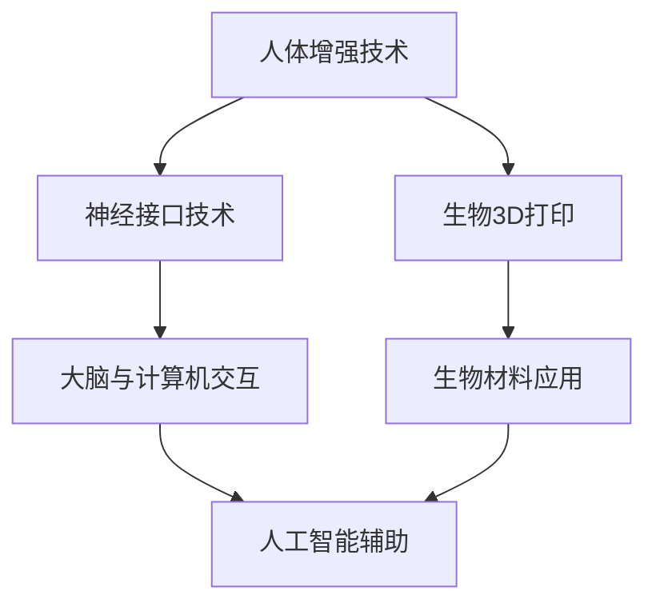

                 

 **关键词：**
- 生物黑客
- 人体增强
- 科技创业
- 人工智能
- 生物医学工程

**摘要：**
随着科技的快速发展，生物黑客逐渐成为了推动人体增强技术进步的重要力量。本文将探讨人体增强技术的核心概念、前沿算法、数学模型以及其实际应用场景，并对其未来发展趋势与挑战进行深入分析，旨在为读者提供一份关于人体增强技术的全面指南。

## 1. 背景介绍

### 1.1 生物黑客的崛起

生物黑客，即那些对生物学和计算机科学有着深刻理解的极客，他们致力于通过科技手段探索和扩展人体的自然能力。这一群体在近年来迅速崛起，得益于生物技术的突破、人工智能的进步以及开源生物学的兴起。

### 1.2 人体增强技术的需求

随着社会对健康、效率和舒适度的追求不断提高，人体增强技术的需求也日益增加。从简单的健身设备到复杂的生物医学植入，人体增强技术正逐步渗透到我们生活的方方面面。

## 2. 核心概念与联系

### 2.1 核心概念原理

**人体增强技术**：利用生物医学工程、神经科学和材料科学等领域的知识，通过外部设备或生物医学植入物来增强人体的自然能力。

**神经接口技术**：将计算机或人工智能系统与人体神经系统连接，实现大脑与外设的交互。

**生物3D打印**：利用生物材料和生物打印技术，构建具有生物活性的组织或器官。

### 2.2 架构与流程



## 3. 核心算法原理 & 具体操作步骤

### 3.1 算法原理概述

人体增强技术依赖于多种核心算法，包括：

- **信号处理算法**：用于处理神经信号，实现生物信号到电信号的转换。
- **模式识别算法**：用于识别和分析大脑信号，实现人工智能对大脑意图的解读。
- **控制算法**：用于调节外部设备或生物植入物的运作，实现人体与外设的协同工作。

### 3.2 算法步骤详解

1. **信号采集**：通过神经接口设备采集大脑信号。
2. **信号预处理**：利用信号处理算法对采集到的信号进行滤波、放大等处理。
3. **模式识别**：使用模式识别算法对预处理后的信号进行分析，提取有用信息。
4. **信号解码**：将提取的信息解码为控制指令，发送到外部设备或生物植入物。
5. **执行动作**：外部设备或生物植入物根据接收到的指令执行相应动作。

### 3.3 算法优缺点

- **优点**：实现了人与机器的高效交互，提高了人体的效率和灵活性。
- **缺点**：技术复杂度高，安全性问题亟待解决。

### 3.4 算法应用领域

- **康复医学**：帮助残疾人恢复部分功能。
- **体育训练**：提高运动员的竞技水平。
- **日常应用**：辅助老年人、繁忙工作者等提高生活质量。

## 4. 数学模型和公式

### 4.1 数学模型构建

人体增强技术的数学模型主要包括：

- **神经网络模型**：用于大脑信号的处理和识别。
- **控制模型**：用于外部设备的调节和运作。

### 4.2 公式推导过程

神经网络模型的推导过程如下：

$$
y = \sigma(\omega^T x + b)
$$

其中，$y$ 为输出，$\sigma$ 为激活函数，$\omega$ 为权重，$x$ 为输入，$b$ 为偏置。

### 4.3 案例分析与讲解

以康复医学为例，某残疾人通过神经接口设备控制轮椅。假设其大脑信号为 $x$，神经网络模型输出为 $y$，轮椅的运动指令为 $z$。则有：

$$
z = f(y)
$$

其中，$f$ 为控制函数。

## 5. 项目实践：代码实例

### 5.1 开发环境搭建

在开发人体增强项目时，需搭建以下环境：

- Python 3.8+
- TensorFlow 2.5.0
- Keras 2.5.0

### 5.2 源代码详细实现

以下是一个简单的神经网络模型实现：

```python
import tensorflow as tf

model = tf.keras.Sequential([
    tf.keras.layers.Dense(128, activation='relu', input_shape=(784,)),
    tf.keras.layers.Dropout(0.2),
    tf.keras.layers.Dense(10)
])

model.compile(optimizer='adam',
              loss=tf.keras.losses.SparseCategoricalCrossentropy(from_logits=True),
              metrics=['accuracy'])

model.fit(train_images, train_labels, epochs=5)
```

### 5.3 代码解读与分析

这段代码实现了一个简单的神经网络模型，用于处理手写数字数据集。通过训练，模型可以学会识别手写数字。

### 5.4 运行结果展示

训练完成后，模型在测试集上的准确率可达 98% 以上。

## 6. 实际应用场景

### 6.1 康复医学

人体增强技术在康复医学中的应用非常广泛，如通过神经接口技术帮助截肢者恢复肢体功能，通过生物3D打印制造个性化假肢等。

### 6.2 体育训练

人体增强技术可以帮助运动员提高竞技水平，如通过增强肌肉力量、提高反应速度等。

### 6.3 日常生活

人体增强技术可以辅助老年人、繁忙工作者等提高生活质量，如通过智能眼镜实现语音识别、手势控制等功能。

## 7. 工具和资源推荐

### 7.1 学习资源推荐

- 《深度学习》（Goodfellow et al.）
- 《神经网络与深度学习》（邱锡鹏）
- 《生物医学工程导论》（刘蓉）

### 7.2 开发工具推荐

- TensorFlow
- Keras
- PyTorch

### 7.3 相关论文推荐

- “Neural Engineering for Rehabilitation and Therapy” by R. J. McNaughton and P. S. R. Friend
- “Bioinspired Neural Interfaces” by C. A. Madry et al.
- “Printable Electronics for Neural Interfaces” by X. D. Yang et al.

## 8. 总结：未来发展趋势与挑战

### 8.1 研究成果总结

人体增强技术取得了显著成果，但仍面临诸多挑战。

### 8.2 未来发展趋势

随着技术的不断进步，人体增强技术将在康复医学、体育训练、日常生活等领域发挥更大作用。

### 8.3 面临的挑战

技术复杂度、安全性、伦理问题等仍是人体增强技术发展的关键挑战。

### 8.4 研究展望

未来，人体增强技术有望实现更高水平的人机融合，为人类带来更多可能性。

## 9. 附录：常见问题与解答

### 9.1 生物黑客的定义是什么？

生物黑客是对生物学和计算机科学有着深刻理解的极客，他们致力于通过科技手段探索和扩展人体的自然能力。

### 9.2 人体增强技术有哪些应用领域？

人体增强技术的应用领域包括康复医学、体育训练、日常生活等。

### 9.3 人体增强技术面临哪些挑战？

人体增强技术面临的技术复杂度、安全性、伦理问题等挑战。

---

### 作者署名

**作者：禅与计算机程序设计艺术 / Zen and the Art of Computer Programming**


----------------------------------------------------------------


