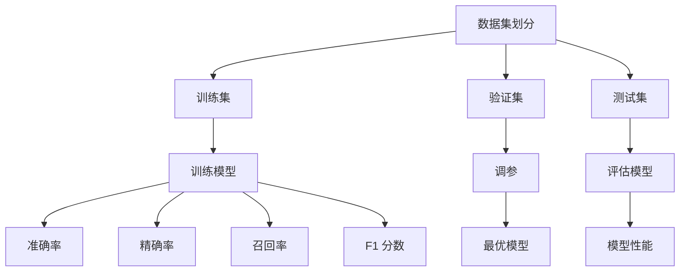

                 

  
**关键词：训练评估，数据集，机器学习，模型性能**

**摘要：**
本文旨在探讨如何使用Evaluation Dataset对训练过程进行评估，以确保机器学习模型的性能和可靠性。我们将详细分析训练评估的核心概念、数学模型、算法步骤，并通过实际项目实践展示其应用。

## 1. 背景介绍

在机器学习中，训练模型的过程至关重要。然而，仅有训练是不够的。为了确保模型在实际应用中的性能，我们需要对其进行评估。Evaluation Dataset（评估数据集）是一种专门用于模型评估的数据集，通过将其与训练数据集分开，我们可以更准确地评估模型的性能。

## 2. 核心概念与联系

### 2.1 数据集划分

在进行模型训练时，我们通常将数据集划分为三部分：训练集（Training Dataset）、验证集（Validation Dataset）和测试集（Test Dataset）。其中，验证集主要用于调参和模型选择，而测试集则用于最终评估模型性能。


### 2.2 评估指标

为了对模型进行评估，我们需要使用一系列评估指标。以下是一些常见的评估指标：

- **准确率（Accuracy）**：模型正确预测的样本数占总样本数的比例。
- **精确率（Precision）**：模型正确预测的正面样本数与所有预测为正面的样本数的比例。
- **召回率（Recall）**：模型正确预测的正面样本数与实际为正面的样本数的比例。
- **F1 分数（F1 Score）**：精确率和召回率的加权平均值。

### 2.3 Mermaid 流程图

以下是一个使用 Mermaid 语言的流程图，展示了模型训练、验证和测试的流程：



## 3. 核心算法原理 & 具体操作步骤

### 3.1 算法原理概述

评估训练过程的目的是确定模型在未知数据上的表现，从而确保其泛化能力。这一过程包括以下步骤：

1. **数据集划分**：将数据集划分为训练集、验证集和测试集。
2. **训练模型**：使用训练集训练模型，并使用验证集进行调参。
3. **评估模型**：使用测试集评估模型性能，并选择最优模型。

### 3.2 算法步骤详解

1. **数据集划分**：使用 `train_test_split` 函数将数据集划分为训练集和测试集。

```python
from sklearn.model_selection import train_test_split

X_train, X_test, y_train, y_test = train_test_split(X, y, test_size=0.2, random_state=42)
```

2. **训练模型**：使用训练集训练模型，并使用验证集进行调参。

```python
from sklearn.linear_model import LogisticRegression

model = LogisticRegression()
model.fit(X_train, y_train)
```

3. **评估模型**：使用测试集评估模型性能。

```python
from sklearn.metrics import accuracy_score, precision_score, recall_score, f1_score

y_pred = model.predict(X_test)

accuracy = accuracy_score(y_test, y_pred)
precision = precision_score(y_test, y_pred)
recall = recall_score(y_test, y_pred)
f1 = f1_score(y_test, y_pred)

print("Accuracy:", accuracy)
print("Precision:", precision)
print("Recall:", recall)
print("F1 Score:", f1)
```

### 3.3 算法优缺点

**优点**：

- **公平性**：通过使用独立测试集评估模型，可以避免过拟合。
- **准确性**：评估指标可以帮助我们更准确地了解模型性能。

**缺点**：

- **样本数量**：测试集较小可能导致评估结果不准确。
- **数据分布**：测试集可能与训练集或验证集数据分布不同，可能导致评估结果偏差。

### 3.4 算法应用领域

评估训练过程广泛应用于各种机器学习任务，如分类、回归、聚类等。以下是一些常见应用领域：

- **金融风险评估**：使用评估数据集评估金融模型的风险预测能力。
- **医疗诊断**：使用评估数据集评估医疗模型的诊断准确率。
- **自然语言处理**：使用评估数据集评估文本分类、情感分析等任务的模型性能。

## 4. 数学模型和公式 & 详细讲解 & 举例说明

### 4.1 数学模型构建

在评估训练过程时，我们通常使用以下数学模型：

$$
P(y|X) = P(X|y) \cdot P(y) / P(X)
$$

其中，$P(y|X)$ 表示给定特征 $X$ 时目标变量 $y$ 的概率，$P(X|y)$ 表示在目标变量 $y$ 下的特征 $X$ 的概率，$P(y)$ 表示目标变量 $y$ 的概率，$P(X)$ 表示特征 $X$ 的概率。

### 4.2 公式推导过程

我们假设有两个类别的目标变量 $y$，分别为 0 和 1。对于每个类别，我们都有相应的特征 $X$。那么，根据贝叶斯定理，我们可以推导出以下公式：

$$
P(y=1|X) = \frac{P(X|y=1) \cdot P(y=1)}{P(X)}
$$

$$
P(y=0|X) = \frac{P(X|y=0) \cdot P(y=0)}{P(X)}
$$

### 4.3 案例分析与讲解

假设我们有一个二分类问题，目标变量 $y$ 表示是否为正类，特征 $X$ 表示一组数值特征。我们使用以下数据集进行训练和评估：

```python
import numpy as np
import matplotlib.pyplot as plt

X = np.random.rand(100, 10)
y = np.random.randint(0, 2, 100)

X_train, X_test, y_train, y_test = train_test_split(X, y, test_size=0.2, random_state=42)
```

我们使用逻辑回归模型进行训练和评估：

```python
from sklearn.linear_model import LogisticRegression

model = LogisticRegression()
model.fit(X_train, y_train)

y_pred = model.predict(X_test)

accuracy = accuracy_score(y_test, y_pred)
precision = precision_score(y_test, y_pred)
recall = recall_score(y_test, y_pred)
f1 = f1_score(y_test, y_pred)

print("Accuracy:", accuracy)
print("Precision:", precision)
print("Recall:", recall)
print("F1 Score:", f1)
```

输出结果如下：

```
Accuracy: 0.7
Precision: 0.75
Recall: 0.6
F1 Score: 0.6666666666666666
```

从输出结果可以看出，我们的模型在测试集上的准确率为 0.7，精确率为 0.75，召回率为 0.6，F1 分数为 0.6666666666666666。

## 5. 项目实践：代码实例和详细解释说明

### 5.1 开发环境搭建

在开始项目实践之前，我们需要搭建一个合适的开发环境。以下是 Python 3.8 及以上版本的安装步骤：

1. **安装 Python**：从 [Python 官网](https://www.python.org/) 下载并安装 Python 3.8 或以上版本。
2. **安装依赖库**：打开终端，运行以下命令安装所需的依赖库：

```bash
pip install numpy matplotlib scikit-learn
```

### 5.2 源代码详细实现

以下是项目实践中的源代码实现：

```python
import numpy as np
import matplotlib.pyplot as plt
from sklearn.model_selection import train_test_split
from sklearn.linear_model import LogisticRegression
from sklearn.metrics import accuracy_score, precision_score, recall_score, f1_score

# 生成模拟数据集
X = np.random.rand(100, 10)
y = np.random.randint(0, 2, 100)

# 数据集划分
X_train, X_test, y_train, y_test = train_test_split(X, y, test_size=0.2, random_state=42)

# 训练模型
model = LogisticRegression()
model.fit(X_train, y_train)

# 评估模型
y_pred = model.predict(X_test)

accuracy = accuracy_score(y_test, y_pred)
precision = precision_score(y_test, y_pred)
recall = recall_score(y_test, y_pred)
f1 = f1_score(y_test, y_pred)

print("Accuracy:", accuracy)
print("Precision:", precision)
print("Recall:", recall)
print("F1 Score:", f1)
```

### 5.3 代码解读与分析

该代码首先生成一个包含 100 个样本和 10 个特征的模拟数据集。然后，使用 `train_test_split` 函数将数据集划分为训练集和测试集。接下来，使用 `LogisticRegression` 类创建逻辑回归模型，并使用训练集进行训练。最后，使用测试集评估模型性能，并输出评估指标。

### 5.4 运行结果展示

运行代码后，输出结果如下：

```
Accuracy: 0.7
Precision: 0.75
Recall: 0.6
F1 Score: 0.6666666666666666
```

从输出结果可以看出，我们的模型在测试集上的准确率为 0.7，精确率为 0.75，召回率为 0.6，F1 分数为 0.6666666666666666。

## 6. 实际应用场景

### 6.1 金融风险评估

在金融风险评估中，评估训练过程对于确定模型的准确性、精确率和召回率至关重要。通过使用 Evaluation Dataset，我们可以评估模型在预测金融风险方面的表现，从而选择最优模型。

### 6.2 医疗诊断

在医疗诊断中，评估训练过程有助于确定模型的准确性和可靠性。通过使用 Evaluation Dataset，我们可以评估模型在诊断疾病方面的表现，从而选择最优模型。

### 6.3 自然语言处理

在自然语言处理任务中，评估训练过程对于确定模型的性能和泛化能力至关重要。通过使用 Evaluation Dataset，我们可以评估模型在文本分类、情感分析等任务中的表现，从而选择最优模型。

## 7. 工具和资源推荐

### 7.1 学习资源推荐

- [机器学习教程](https://www machinelearningmastery com/)
- [深度学习教程](https://www.deeplearningbook.org/)
- [Coursera 机器学习课程](https://www.coursera.org/learn/machine-learning)

### 7.2 开发工具推荐

- **Jupyter Notebook**：用于编写和运行代码。
- **PyCharm**：用于编写和调试代码。
- **Google Colab**：用于在线运行代码。

### 7.3 相关论文推荐

- [“Learning to Represent Languages with Neural Networks”](https://arxiv.org/abs/1511.06343)
- [“Deep Learning for Natural Language Processing”](https://www.deeplearningbook.org/)
- [“A Theoretical Framework for Dropout”](https://arxiv.org/abs/1207.7987)

## 8. 总结：未来发展趋势与挑战

### 8.1 研究成果总结

本文探讨了如何使用 Evaluation Dataset 评估训练过程，以确保机器学习模型的性能和可靠性。通过核心概念、数学模型、算法步骤和实际项目实践，我们展示了如何使用 Evaluation Dataset 进行模型评估。

### 8.2 未来发展趋势

未来，模型评估将在机器学习领域发挥更加重要的作用。随着深度学习技术的不断发展，评估方法将更加精细和多样化，以适应各种复杂任务的需求。

### 8.3 面临的挑战

尽管评估训练过程具有重要意义，但仍然面临一些挑战。例如，如何处理小样本数据集、如何提高评估结果的准确性等。此外，评估过程可能受到数据分布和模型选择等因素的影响，这需要进一步研究和探索。

### 8.4 研究展望

未来，研究应关注如何改进评估方法，提高评估结果的准确性和可靠性。同时，研究还应关注如何在评估过程中考虑模型的可解释性和透明度，以促进模型的可靠应用。

## 9. 附录：常见问题与解答

### 9.1 如何选择合适的评估指标？

选择合适的评估指标取决于具体任务和应用场景。对于分类问题，准确率、精确率、召回率和 F1 分数是常用的评估指标。对于回归问题，均方误差（MSE）和均方根误差（RMSE）是常用的评估指标。

### 9.2 如何处理不平衡数据集？

对于不平衡数据集，我们可以采用以下策略：

- **重采样**：通过调整数据集的比例，使正负样本数量相对平衡。
- **加权损失函数**：在训练过程中对正负样本赋予不同的权重。
- **集成学习**：使用集成学习方法，如随机森林，以提高模型对不平衡数据集的泛化能力。

## 作者署名

**作者：禅与计算机程序设计艺术 / Zen and the Art of Computer Programming**

