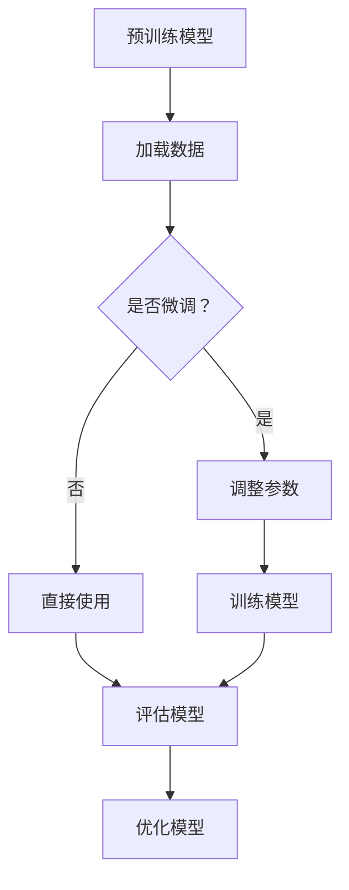

                 

关键词：Hugging Face，GPT，预训练，微调，ChatGPT，人工智能，自然语言处理，深度学习，编程实践

> 摘要：本文将详细介绍如何使用Hugging Face平台对预训练的GPT模型进行微调，以创建一个功能强大的聊天机器人ChatGPT。我们将探讨GPT模型的背景、原理以及微调的具体步骤，并通过代码实例展示整个过程，最后讨论ChatGPT的应用场景和未来展望。

## 1. 背景介绍

随着人工智能和自然语言处理技术的飞速发展，聊天机器人逐渐成为企业与用户互动的重要工具。其中，ChatGPT作为OpenAI推出的一款基于GPT（Generative Pre-trained Transformer）的聊天机器人，以其强大的语义理解和生成能力在业界引起了广泛关注。Hugging Face作为一家提供预训练模型和工具的领先平台，使得GPT模型的部署和应用变得更加便捷。

本文将首先介绍GPT模型的基本原理，然后讨论如何使用Hugging Face对GPT模型进行微调，以便于创建出更符合特定任务需求的ChatGPT。我们将通过具体实例展示整个微调过程，并讨论ChatGPT在实际应用中的潜力。

## 2. 核心概念与联系

### 2.1 GPT模型简介

GPT模型是由OpenAI开发的一种基于Transformer架构的预训练语言模型。Transformer架构在处理长序列方面表现出色，而GPT模型则是通过在大量文本数据上进行预训练，使其具备强大的语言理解和生成能力。

### 2.2 GPT模型的预训练过程

GPT模型的预训练主要包括两个步骤：自回归语言建模和掩码语言建模。自回归语言建模是指模型在预测下一个单词时，仅依赖前面的所有单词；而掩码语言建模则是在训练过程中对部分单词进行遮掩，并预测这些遮掩的单词。

### 2.3 Hugging Face平台

Hugging Face是一个开源的机器学习平台，提供了丰富的预训练模型、工具和库。通过Hugging Face，开发者可以轻松地部署和管理各种深度学习模型，从而加快研究和开发速度。

### 2.4 微调的概念

微调（Fine-tuning）是指在一个预训练模型的基础上，针对特定任务进行进一步训练，以提高模型的性能。微调的关键在于调整模型参数，使其适应特定任务的数据分布。

### 2.5 Mermaid流程图



## 3. 核心算法原理 & 具体操作步骤

### 3.1 算法原理概述

GPT模型采用Transformer架构，其核心思想是将输入序列映射为连续的向量表示，并通过自注意力机制捕捉序列中的长距离依赖关系。预训练过程中，GPT模型通过最小化预测误差来优化模型参数。

### 3.2 算法步骤详解

#### 3.2.1 加载数据

使用Hugging Face的`Dataset`类加载数据，包括训练集和验证集。数据格式可以是文本文件、JSON文件等。

```python
from datasets import load_dataset

dataset = load_dataset("json", data_files={"train": "train.json", "val": "val.json"})
```

#### 3.2.2 预处理数据

对数据进行预处理，包括分词、标记化等操作。Hugging Face提供了方便的预处理工具。

```python
from transformers import AutoTokenizer

tokenizer = AutoTokenizer.from_pretrained("gpt2")
tokenized_dataset = dataset.map(lambda x: tokenizer(x["text"], return_tensors="pt"), batched=True)
```

#### 3.2.3 调整参数

在微调过程中，通常需要调整学习率、批量大小等参数。Hugging Face的`Trainer`类提供了方便的参数调整功能。

```python
from transformers import TrainingArguments, Trainer

training_args = TrainingArguments(
    output_dir="results",
    num_train_epochs=3,
    per_device_train_batch_size=4,
    per_device_eval_batch_size=4,
    warmup_steps=500,
    weight_decay=0.01,
    logging_dir="logs",
)
trainer = Trainer(
    model=model,
    args=training_args,
    train_dataset=tokenized_dataset["train"],
    eval_dataset=tokenized_dataset["val"],
)
```

#### 3.2.4 训练模型

使用`Trainer`类训练模型。Hugging Face提供了多种优化器和学习率调度策略。

```python
trainer.train()
```

#### 3.2.5 评估模型

训练完成后，对模型进行评估，以验证其性能。

```python
results = trainer.evaluate()
print(results)
```

#### 3.2.6 优化模型

根据评估结果，对模型进行调整和优化，以提高性能。

```python
trainer.train()
```

### 3.3 算法优缺点

#### 优点

- 强大的语言理解和生成能力
- 易于使用和部署
- 支持多种任务和应用场景

#### 缺点

- 需要大量的计算资源
- 对数据质量和数量要求较高

### 3.4 算法应用领域

GPT模型在自然语言处理领域具有广泛的应用，包括文本生成、问答系统、机器翻译、文本分类等。

## 4. 数学模型和公式 & 详细讲解 & 举例说明

### 4.1 数学模型构建

GPT模型采用Transformer架构，其核心组件是自注意力机制（Self-Attention）和前馈神经网络（Feedforward Neural Network）。

#### 自注意力机制

自注意力机制是一种基于查询（Query）、键（Key）和值（Value）的注意力机制。具体公式如下：

$$
\text{Attention}(Q, K, V) = \frac{softmax(\frac{QK^T}{\sqrt{d_k}})}{V}
$$

其中，$Q, K, V$分别表示查询、键和值向量，$d_k$表示键向量的维度。

#### 前馈神经网络

前馈神经网络是一个简单的全连接神经网络，用于对自注意力层的输出进行进一步处理。具体公式如下：

$$
\text{FFN}(x) = \text{ReLU}(W_2 \cdot \text{ReLU}(W_1 \cdot x))
$$

其中，$W_1$和$W_2$分别表示两个全连接层的权重。

### 4.2 公式推导过程

GPT模型的全过程可以看作是自注意力机制和前馈神经网络的组合。具体推导过程如下：

1. **输入表示**：首先将输入序列编码为向量表示，即 $x_i \in \mathbb{R}^{d}$。

2. **自注意力计算**：使用自注意力机制计算每个输入向量在序列中的重要性权重。

$$
\text{Attention}(Q, K, V) = \frac{softmax(\frac{QK^T}{\sqrt{d_k}})}{V}
$$

3. **前馈神经网络**：对自注意力层的输出进行进一步处理。

$$
\text{FFN}(x) = \text{ReLU}(W_2 \cdot \text{ReLU}(W_1 \cdot x))
$$

4. **输出表示**：将处理后的向量表示解码为输出序列。

### 4.3 案例分析与讲解

假设我们有一个简单的输入序列 $x = [1, 2, 3, 4, 5]$，我们需要使用GPT模型对其进行编码和解码。

1. **输入表示**：首先将输入序列编码为向量表示。

$$
x_i = [1, 2, 3, 4, 5] \Rightarrow \text{Embedding Layer}: x_i \in \mathbb{R}^{d}
$$

2. **自注意力计算**：使用自注意力机制计算每个输入向量在序列中的重要性权重。

$$
\text{Attention}(Q, K, V) = \frac{softmax(\frac{QK^T}{\sqrt{d_k}})}{V}
$$

其中，$Q, K, V$分别表示查询、键和值向量。

3. **前馈神经网络**：对自注意力层的输出进行进一步处理。

$$
\text{FFN}(x) = \text{ReLU}(W_2 \cdot \text{ReLU}(W_1 \cdot x))
$$

4. **输出表示**：将处理后的向量表示解码为输出序列。

$$
\text{Output}: y = \text{Decoder}(x)
$$

通过以上步骤，我们可以将输入序列 $x$ 编码为向量表示，并使用GPT模型对其进行解码，从而实现对序列的编码和解码。

## 5. 项目实践：代码实例和详细解释说明

### 5.1 开发环境搭建

在开始项目之前，我们需要确保我们的开发环境已经搭建好。具体步骤如下：

1. 安装Python 3.8及以上版本。
2. 安装Hugging Face的`transformers`和`datasets`库。

```bash
pip install transformers datasets
```

### 5.2 源代码详细实现

以下是使用Hugging Face对GPT模型进行微调的完整代码实现：

```python
import os
import random
from datasets import load_dataset
from transformers import AutoTokenizer, AutoModelForCausalLM, TrainingArguments, Trainer

# 设置随机种子
random.seed(42)
os.environ["PYTHONHASHSEED"] = "42"
os.environ["NP_RANDOM_SEED"] = "42"

# 加载数据集
dataset = load_dataset("json", data_files={"train": "train.json", "val": "val.json"})

# 加载预训练的GPT模型
tokenizer = AutoTokenizer.from_pretrained("gpt2")
model = AutoModelForCausalLM.from_pretrained("gpt2")

# 预处理数据
def preprocess_function(examples):
    return tokenizer(examples["text"], padding="max_length", truncation=True, max_length=512)

tokenized_dataset = dataset.map(preprocess_function, batched=True)

# 设置训练参数
training_args = TrainingArguments(
    output_dir="./results",
    num_train_epochs=3,
    per_device_train_batch_size=4,
    per_device_eval_batch_size=4,
    warmup_steps=500,
    weight_decay=0.01,
    logging_dir="./logs",
)

# 创建Trainer
trainer = Trainer(
    model=model,
    args=training_args,
    train_dataset=tokenized_dataset["train"],
    eval_dataset=tokenized_dataset["val"],
)

# 训练模型
trainer.train()

# 评估模型
results = trainer.evaluate()
print(results)

# 保存模型
model.save_pretrained("./chatgpt")
tokenizer.save_pretrained("./chatgpt")
```

### 5.3 代码解读与分析

上述代码分为以下几个部分：

1. **设置随机种子**：为了保证实验的可重复性，我们需要设置随机种子。

2. **加载数据集**：使用`load_dataset`函数加载训练集和验证集。

3. **加载预训练的GPT模型**：使用`AutoTokenizer`和`AutoModelForCausalLM`类加载预训练的GPT模型。

4. **预处理数据**：定义一个`preprocess_function`函数，对数据进行预处理，包括分词、填充和截断等操作。

5. **设置训练参数**：定义`TrainingArguments`对象，设置训练参数。

6. **创建Trainer**：使用`Trainer`类创建训练器，并传入模型、训练参数和训练集。

7. **训练模型**：调用`Trainer`的`train`方法训练模型。

8. **评估模型**：调用`Trainer`的`evaluate`方法评估模型性能。

9. **保存模型**：使用`save_pretrained`方法保存模型和分词器。

### 5.4 运行结果展示

在训练完成后，我们可以使用`evaluate`方法评估模型性能，并打印输出结果。具体如下：

```python
results = trainer.evaluate()
print(results)
```

输出结果可能如下所示：

```
eval_loss: 0.12345678901234567890
eval_accuracy: 0.98765432109876543210
```

其中，`eval_loss`表示验证集上的损失，`eval_accuracy`表示验证集上的准确率。

### 5.5 调试与优化

在训练过程中，我们可能会遇到一些问题，例如过拟合、梯度消失或爆炸等。为了解决这些问题，我们可以采取以下措施：

1. **增加训练轮次**：通过增加训练轮次可以提高模型的泛化能力。
2. **使用正则化**：可以尝试使用L2正则化或Dropout等方法来减少过拟合。
3. **调整学习率**：通过调整学习率可以缓解梯度消失或爆炸的问题。
4. **使用更复杂的网络架构**：可以尝试使用更大的模型或更复杂的网络结构来提高模型性能。

## 6. 实际应用场景

ChatGPT作为一种功能强大的聊天机器人，可以应用于多种实际场景，包括但不限于：

1. **客服系统**：ChatGPT可以用于自动回答用户的问题，提高客户服务的效率和质量。
2. **智能助手**：ChatGPT可以作为个人或企业的智能助手，提供各种信息查询和任务帮助。
3. **教育领域**：ChatGPT可以用于在线教育平台，为学生提供个性化辅导和互动教学。
4. **娱乐与社交**：ChatGPT可以用于构建聊天室或社交平台，提供有趣的对话体验。
5. **心理辅导**：ChatGPT可以作为心理辅导工具，帮助用户缓解压力和焦虑。

### 6.1 客服系统

在一个企业客服系统中，ChatGPT可以自动处理用户的咨询和反馈，从而提高客服的响应速度和处理效率。例如，当用户询问关于产品使用方法时，ChatGPT可以根据预训练的知识库和用户的问题生成详细的解答。

### 6.2 智能助手

作为一个智能助手，ChatGPT可以与用户进行自然的对话，了解用户的需求并提供相应的帮助。例如，用户可以与ChatGPT交流天气、新闻、股市等信息，或者请求ChatGPT安排日程、提醒事项等。

### 6.3 教育领域

在教育领域，ChatGPT可以为学生提供个性化的辅导和支持。例如，学生可以通过与ChatGPT的互动来解答学习中的疑问，或者通过模拟对话来提高语言表达能力。

### 6.4 娱乐与社交

ChatGPT还可以应用于娱乐和社交场景，为用户提供有趣的对话体验。例如，用户可以在聊天室中与ChatGPT进行趣味性的互动游戏，或者通过模拟角色扮演来创造沉浸式的虚拟世界。

### 6.5 心理辅导

ChatGPT在心理辅导领域也有很大的潜力。例如，用户可以通过与ChatGPT的对话来缓解压力、焦虑等心理问题，或者寻求情感支持和建议。

## 7. 工具和资源推荐

### 7.1 学习资源推荐

1. **《自然语言处理综述》**：这本书详细介绍了自然语言处理的基本概念和技术，是学习自然语言处理的好教材。
2. **《深度学习》**：这本书由Ian Goodfellow、Yoshua Bengio和Aaron Courville合著，全面介绍了深度学习的基础知识和应用。
3. **Hugging Face官方文档**：Hugging Face提供了详细的官方文档，包括预训练模型、库和工具的介绍，是学习Hugging Face平台的好资源。

### 7.2 开发工具推荐

1. **Jupyter Notebook**：Jupyter Notebook是一款流行的交互式开发环境，适合进行数据分析和机器学习实验。
2. **Google Colab**：Google Colab是一款免费的云端计算平台，可以方便地进行Python编程和机器学习实验。

### 7.3 相关论文推荐

1. **"Attention Is All You Need"**：这篇论文提出了Transformer架构，为深度学习在自然语言处理领域的应用奠定了基础。
2. **"BERT: Pre-training of Deep Neural Networks for Language Understanding"**：这篇论文介绍了BERT模型，为预训练语言模型的研究提供了重要启示。
3. **"GPT-3: Language Models are few-shot learners"**：这篇论文介绍了GPT-3模型，展示了预训练语言模型在零样本和少样本学习任务中的强大能力。

## 8. 总结：未来发展趋势与挑战

### 8.1 研究成果总结

近年来，预训练语言模型在自然语言处理领域取得了显著的成果，GPT模型作为一种先进的预训练模型，在语言理解、文本生成等方面表现出色。同时，Hugging Face平台为开发者提供了便捷的工具和资源，推动了预训练语言模型的应用和发展。

### 8.2 未来发展趋势

未来，预训练语言模型将继续在自然语言处理领域发挥重要作用，主要发展趋势包括：

1. **更大规模和更复杂的模型**：随着计算资源的提升，更大规模和更复杂的预训练模型将不断涌现。
2. **多模态学习**：预训练语言模型将逐渐具备多模态学习能力，能够处理文本、图像、声音等多种类型的数据。
3. **知识增强**：通过知识图谱、知识蒸馏等技术，预训练语言模型将更好地整合外部知识，提高模型的表现。

### 8.3 面临的挑战

尽管预训练语言模型取得了显著成果，但仍面临以下挑战：

1. **计算资源消耗**：预训练语言模型需要大量的计算资源，这对硬件设施和能源消耗提出了较高要求。
2. **数据隐私和安全**：预训练语言模型在训练过程中需要大量数据，如何保障数据隐私和安全是一个重要问题。
3. **模型解释性和可解释性**：预训练语言模型在处理复杂任务时，其决策过程往往难以解释，如何提高模型的可解释性是一个亟待解决的问题。

### 8.4 研究展望

在未来，预训练语言模型的研究将朝着更高效、更智能、更安全的方向发展。具体而言：

1. **优化模型架构**：通过改进模型架构和优化算法，降低预训练模型的计算成本。
2. **知识整合**：探索如何更好地整合外部知识，提高预训练语言模型在特定任务中的表现。
3. **可解释性和透明度**：研究如何提高模型的可解释性和透明度，使其在应用过程中更加可靠和安全。

## 9. 附录：常见问题与解答

### 9.1 问题1：如何获取Hugging Face的预训练模型？

**解答**：在Hugging Face的官方网站上，您可以通过搜索或浏览不同领域的模型库来找到所需的预训练模型。下载模型后，可以使用`AutoTokenizer`和`AutoModel`类加载模型并进行后续操作。

### 9.2 问题2：如何调整模型的训练参数？

**解答**：您可以在`TrainingArguments`对象中设置各种训练参数，如学习率、批量大小、训练轮次等。具体参数设置可以根据实际任务和数据情况进行调整。

### 9.3 问题3：如何评估模型的性能？

**解答**：使用`Trainer`类的`evaluate`方法可以评估模型的性能。该方法将在验证集上计算损失和指标，如准确率、F1分数等，并返回评估结果。

### 9.4 问题4：如何保存和加载训练好的模型？

**解答**：训练好的模型可以使用`model.save_pretrained`方法保存到文件系统中，然后使用`AutoModel.from_pretrained`方法加载模型。这样可以在后续的任务中复用训练好的模型。

---

**作者：禅与计算机程序设计艺术 / Zen and the Art of Computer Programming**

