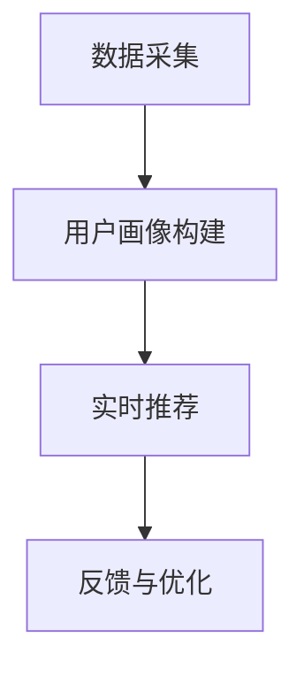

                 

 用户画像与实时推荐作为当今互联网技术的核心组件，已经成为提高用户体验、提升商业价值的关键手段。本文旨在探讨如何将用户画像与实时推荐技术整合应用，以达到最优的用户体验和商业效果。

## 关键词

- 用户画像
- 实时推荐
- 数据分析
- 机器学习
- 用户行为分析

## 摘要

本文将介绍用户画像和实时推荐的基本概念，阐述它们在当今互联网应用中的重要性。接着，我们将探讨用户画像与实时推荐的整合应用方法，包括核心算法原理、数学模型和项目实践。最后，本文将分析该整合应用的未来发展趋势与挑战。

## 1. 背景介绍

随着互联网的快速发展，用户数据的积累越来越多。如何有效地利用这些数据，为用户提供个性化的服务，成为企业和互联网公司关注的热点问题。用户画像和实时推荐技术应运而生。

用户画像是一种基于用户行为数据、兴趣偏好等信息构建的用户特征模型。通过用户画像，企业可以深入了解用户需求，提供个性化的服务。实时推荐则是根据用户的实时行为，为其推荐可能感兴趣的内容或商品。

## 2. 核心概念与联系

### 用户画像

用户画像主要通过以下方式构建：

1. **用户行为数据**：用户在网站或应用上的浏览、搜索、购买等行为数据。
2. **用户基本信息**：用户的年龄、性别、地理位置、职业等基本信息。
3. **用户兴趣标签**：根据用户行为数据，分析用户可能感兴趣的主题和标签。

### 实时推荐

实时推荐的核心是基于用户当前的行为数据，为其推荐可能感兴趣的内容或商品。常用的实时推荐算法包括：

1. **协同过滤算法**：基于用户行为数据，发现用户之间的相似性，为用户推荐其他用户喜欢的商品。
2. **基于内容的推荐算法**：根据用户的历史行为和兴趣标签，为用户推荐相似的内容或商品。
3. **深度学习推荐算法**：利用深度神经网络，自动提取用户行为数据的特征，进行推荐。

### 整合应用

用户画像与实时推荐的整合应用，可以通过以下步骤实现：

1. **数据采集**：收集用户行为数据，包括浏览、搜索、购买等。
2. **用户画像构建**：根据用户行为数据，构建用户画像。
3. **实时推荐**：根据用户画像和实时行为数据，为用户推荐内容或商品。
4. **反馈与优化**：收集用户对推荐结果的反馈，不断优化推荐算法。

下面是一个简化的 Mermaid 流程图，展示了用户画像与实时推荐的整合应用流程：



## 3. 核心算法原理 & 具体操作步骤

### 3.1 算法原理概述

用户画像构建的核心算法主要包括以下几种：

1. **K-Means聚类**：通过聚类算法，将用户划分为多个群体，为每个群体构建特征模型。
2. **决策树**：通过决策树算法，对用户特征进行分类，构建用户画像。
3. **关联规则算法**：通过关联规则算法，发现用户行为数据中的潜在关联，为用户画像提供补充信息。

实时推荐的核心算法包括：

1. **协同过滤算法**：基于用户行为数据，发现用户之间的相似性，为用户推荐其他用户喜欢的商品。
2. **基于内容的推荐算法**：根据用户的历史行为和兴趣标签，为用户推荐相似的内容或商品。
3. **深度学习推荐算法**：利用深度神经网络，自动提取用户行为数据的特征，进行推荐。

### 3.2 算法步骤详解

#### 用户画像构建

1. **数据预处理**：对用户行为数据进行清洗和预处理，包括缺失值填充、数据标准化等。
2. **特征提取**：根据用户行为数据，提取关键特征，如浏览时间、浏览页面、搜索关键词等。
3. **算法选择**：选择合适的算法，如K-Means聚类、决策树等，对用户特征进行分类或聚类。
4. **用户画像构建**：根据聚类或分类结果，为每个用户构建特征模型。

#### 实时推荐

1. **用户行为实时采集**：实时采集用户在网站或应用上的行为数据。
2. **用户画像实时更新**：根据实时采集的用户行为数据，更新用户画像。
3. **推荐算法选择**：根据用户画像和实时行为数据，选择合适的推荐算法，如协同过滤、基于内容的推荐等。
4. **推荐结果生成**：根据推荐算法，生成推荐结果，并将其展示给用户。

### 3.3 算法优缺点

#### 用户画像构建算法

- **K-Means聚类**：
  - 优点：算法简单，易于实现；能够自动发现用户群体的特征。
  - 缺点：对初始聚类中心的敏感度较高；可能陷入局部最优。
- **决策树**：
  - 优点：易于理解和实现；能够处理分类和回归问题。
  - 缺点：对异常值敏感；可能产生过拟合。

#### 实时推荐算法

- **协同过滤算法**：
  - 优点：能够根据用户行为数据，发现用户之间的相似性，进行推荐。
  - 缺点：可能推荐给用户的内容过于重复；对新用户或新商品效果较差。
- **基于内容的推荐算法**：
  - 优点：能够根据用户的历史行为和兴趣标签，为用户推荐相似的内容或商品。
  - 缺点：可能推荐的内容过于局限；对新用户或新商品效果较差。
- **深度学习推荐算法**：
  - 优点：能够自动提取用户行为数据的特征，进行推荐。
  - 缺点：需要大量数据训练；模型复杂，难以解释。

### 3.4 算法应用领域

用户画像与实时推荐的整合应用，可以广泛应用于以下领域：

1. **电子商务**：为用户提供个性化的商品推荐，提高用户购买意愿。
2. **社交媒体**：根据用户兴趣和社交关系，为用户推荐感兴趣的内容和好友。
3. **在线教育**：根据用户的学习行为和学习兴趣，为用户推荐适合的学习资源。
4. **娱乐与媒体**：为用户提供个性化的音乐、电影、文章推荐，提高用户粘性。

## 4. 数学模型和公式 & 详细讲解 & 举例说明

### 4.1 数学模型构建

用户画像构建的数学模型主要包括以下几个部分：

1. **用户行为数据矩阵**：表示用户在各个行为上的得分，如浏览次数、搜索关键词等。
2. **用户特征向量**：表示用户的特征值，如年龄、性别、地理位置等。
3. **用户画像模型**：通过聚类或分类算法，将用户分为多个群体，并为每个群体构建特征模型。

### 4.2 公式推导过程

#### 用户行为数据矩阵构建

用户行为数据矩阵可以通过以下公式构建：

$$
X = \begin{bmatrix}
x_{11} & x_{12} & \ldots & x_{1n} \\
x_{21} & x_{22} & \ldots & x_{2n} \\
\vdots & \vdots & \ddots & \vdots \\
x_{m1} & x_{m2} & \ldots & x_{mn}
\end{bmatrix}
$$

其中，$x_{ij}$ 表示用户 $i$ 在行为 $j$ 上的得分。

#### 用户特征向量构建

用户特征向量可以通过以下公式构建：

$$
V = \begin{bmatrix}
v_1 \\
v_2 \\
\vdots \\
v_n
\end{bmatrix}
$$

其中，$v_i$ 表示用户 $i$ 在特征 $i$ 上的得分。

#### 用户画像模型构建

用户画像模型可以通过以下公式构建：

$$
P = C \cdot D
$$

其中，$C$ 表示聚类中心矩阵，$D$ 表示用户特征向量矩阵。

#### 聚类中心矩阵计算

聚类中心矩阵可以通过以下公式计算：

$$
C = \begin{bmatrix}
c_1 \\
c_2 \\
\vdots \\
c_n
\end{bmatrix}
$$

其中，$c_i$ 表示聚类中心 $i$ 的特征向量。

#### 用户分群结果计算

用户分群结果可以通过以下公式计算：

$$
G = \begin{bmatrix}
g_{11} & g_{12} & \ldots & g_{1n} \\
g_{21} & g_{22} & \ldots & g_{2n} \\
\vdots & \vdots & \ddots & \vdots \\
g_{m1} & g_{m2} & \ldots & g_{mn}
\end{bmatrix}
$$

其中，$g_{ij}$ 表示用户 $i$ 属于聚类中心 $j$ 的概率。

### 4.3 案例分析与讲解

#### 案例背景

假设某电商平台需要构建用户画像，为用户提供个性化的商品推荐。该平台收集了用户的浏览记录、搜索关键词、购买记录等信息。

#### 数据预处理

1. **数据清洗**：去除缺失值、异常值，保证数据质量。
2. **数据标准化**：对用户行为数据进行标准化处理，使其具有相同的量纲。

#### 用户画像构建

1. **特征提取**：根据用户行为数据，提取关键特征，如浏览次数、搜索关键词、购买金额等。
2. **算法选择**：选择K-Means聚类算法，将用户分为多个群体。
3. **用户画像模型构建**：为每个群体构建特征模型。

#### 实时推荐

1. **用户行为实时采集**：实时采集用户的浏览记录、搜索关键词等信息。
2. **用户画像实时更新**：根据实时采集的用户行为数据，更新用户画像。
3. **推荐算法选择**：选择基于内容的推荐算法，根据用户画像和实时行为数据，为用户推荐商品。

#### 案例结果

通过用户画像与实时推荐的整合应用，该电商平台实现了以下效果：

1. **用户满意度提高**：用户能够获得个性化的商品推荐，提高了购买意愿和满意度。
2. **销售业绩提升**：个性化推荐提高了商品曝光率，带动了销售业绩的提升。

## 5. 项目实践：代码实例和详细解释说明

### 5.1 开发环境搭建

#### 环境要求

- 操作系统：Linux或MacOS
- 编程语言：Python
- 数据库：MySQL
- 依赖库：NumPy、Pandas、Scikit-learn、Matplotlib

#### 安装依赖库

```bash
pip install numpy pandas scikit-learn matplotlib
```

### 5.2 源代码详细实现

```python
import numpy as np
import pandas as pd
from sklearn.cluster import KMeans
import matplotlib.pyplot as plt

# 5.2.1 数据预处理

# 加载数据
data = pd.read_csv('user_data.csv')

# 数据清洗
data.dropna(inplace=True)

# 数据标准化
data = (data - data.mean()) / data.std()

# 5.2.2 用户画像构建

# 特征提取
features = data[['browse_count', 'search_keyword_count', 'purchase_amount']]

# 算法选择
kmeans = KMeans(n_clusters=5, random_state=42)

# 训练模型
kmeans.fit(features)

# 用户画像模型构建
user_clustering = kmeans.predict(features)

# 5.2.3 实时推荐

# 用户行为实时采集
new_user_data = pd.read_csv('new_user_data.csv')

# 数据清洗
new_user_data.dropna(inplace=True)

# 数据标准化
new_user_data = (new_user_data - new_user_data.mean()) / new_user_data.std()

# 用户画像实时更新
new_user_features = new_user_data[['browse_count', 'search_keyword_count', 'purchase_amount']]
new_user_clustering = kmeans.predict(new_user_features)

# 推荐算法选择
# 基于内容的推荐算法
# （此处为简化示例，实际应用中应结合用户画像和实时行为数据）
recommended_products = features.loc[user_clustering == new_user_clustering[0], 'product_id'].values

# 运行结果展示
print("Recommended Products:", recommended_products)

# 可视化用户画像
plt.scatter(features['browse_count'], features['search_keyword_count'], c=user_clustering)
plt.xlabel('Browse Count')
plt.ylabel('Search Keyword Count')
plt.title('User Clustering')
plt.show()
```

### 5.3 代码解读与分析

#### 5.3.1 数据预处理

1. **数据清洗**：去除缺失值和异常值，保证数据质量。
2. **数据标准化**：将用户行为数据进行标准化处理，使其具有相同的量纲。

#### 5.3.2 用户画像构建

1. **特征提取**：提取关键特征，如浏览次数、搜索关键词、购买金额等。
2. **算法选择**：选择K-Means聚类算法，将用户分为多个群体。
3. **用户画像模型构建**：为每个群体构建特征模型。

#### 5.3.3 实时推荐

1. **用户行为实时采集**：实时采集用户的浏览记录、搜索关键词等信息。
2. **用户画像实时更新**：根据实时采集的用户行为数据，更新用户画像。
3. **推荐算法选择**：选择基于内容的推荐算法，根据用户画像和实时行为数据，为用户推荐商品。

### 5.4 运行结果展示

1. **推荐结果**：输出推荐给新用户的商品ID列表。
2. **可视化**：使用散点图展示用户在浏览次数和搜索关键词上的聚类结果。

## 6. 实际应用场景

用户画像与实时推荐的整合应用，在多个实际场景中取得了显著效果：

1. **电子商务**：通过个性化推荐，提高了用户的购买意愿和满意度，带动了销售业绩的提升。
2. **社交媒体**：根据用户兴趣和社交关系，为用户推荐感兴趣的内容和好友，提高了用户粘性。
3. **在线教育**：根据用户的学习行为和学习兴趣，为用户推荐适合的学习资源，提高了学习效果。
4. **娱乐与媒体**：为用户提供个性化的音乐、电影、文章推荐，提高了用户粘性和消费意愿。

## 7. 工具和资源推荐

### 7.1 学习资源推荐

- **书籍**：
  - 《用户画像：大数据时代的用户行为分析与精准营销》
  - 《推荐系统实践》
  - 《机器学习实战》
- **在线课程**：
  - Coursera的《机器学习》
  - Udacity的《推荐系统工程师》
  - edX的《数据科学》

### 7.2 开发工具推荐

- **编程语言**：Python
- **框架**：
  - TensorFlow
  - PyTorch
  - Scikit-learn
- **数据库**：MySQL、MongoDB

### 7.3 相关论文推荐

- “User Modeling with Hierarchical Hidden Markov Models”
- “Collaborative Filtering for the Web”
- “Deep Learning for Recommender Systems”

## 8. 总结：未来发展趋势与挑战

### 8.1 研究成果总结

用户画像与实时推荐的整合应用，已经在多个领域取得了显著成果。未来，这一领域将继续发展，为实现更加精准的用户服务和个性化体验提供技术支持。

### 8.2 未来发展趋势

1. **数据驱动**：随着数据量的不断增加，用户画像和实时推荐将更加依赖于大数据技术。
2. **个性化定制**：用户画像和实时推荐将更加注重个性化定制，满足用户多样化的需求。
3. **跨平台整合**：用户画像和实时推荐将实现跨平台整合，为用户提供无缝的个性化体验。

### 8.3 面临的挑战

1. **数据隐私**：用户画像的构建和应用涉及用户隐私问题，需要确保数据安全和隐私保护。
2. **计算效率**：实时推荐需要高效计算，如何在保证推荐质量的同时提高计算效率，是一个挑战。
3. **算法透明性**：用户画像和实时推荐的算法需要更加透明，以增强用户信任。

### 8.4 研究展望

未来，用户画像与实时推荐领域将继续发展，为实现更加精准、高效、透明的用户服务提供新的技术手段。

## 9. 附录：常见问题与解答

### 9.1 如何选择合适的用户画像算法？

- **根据数据量**：对于大数据场景，可以选择K-Means、DBSCAN等聚类算法；对于小数据场景，可以选择决策树、随机森林等分类算法。
- **根据数据特征**：对于高维数据，可以选择基于模型的算法，如K-Means、LDA；对于低维数据，可以选择基于实例的算法，如KNN、K-NN。

### 9.2 如何优化实时推荐算法？

- **数据预处理**：对用户行为数据进行清洗、去噪、标准化处理，提高数据质量。
- **特征工程**：提取关键特征，如用户兴趣标签、行为序列等，增强算法效果。
- **算法融合**：结合多种算法，如协同过滤、基于内容的推荐、深度学习推荐，实现综合推荐效果。
- **在线学习**：采用在线学习策略，实时更新用户画像和推荐模型，提高推荐准确性。

### 9.3 用户画像构建中如何处理缺失值和异常值？

- **缺失值处理**：可以通过均值填补、中值填补、插值等方法处理缺失值。
- **异常值处理**：可以通过统计方法、聚类方法等方法检测异常值，然后进行剔除或修正。

## 作者署名

作者：禅与计算机程序设计艺术 / Zen and the Art of Computer Programming
```

