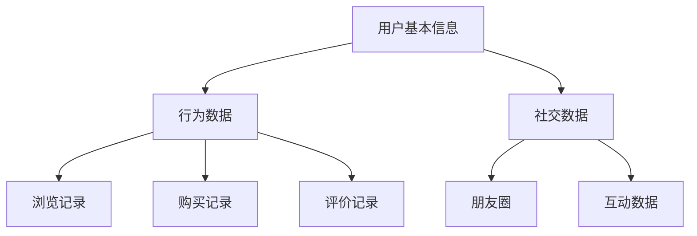
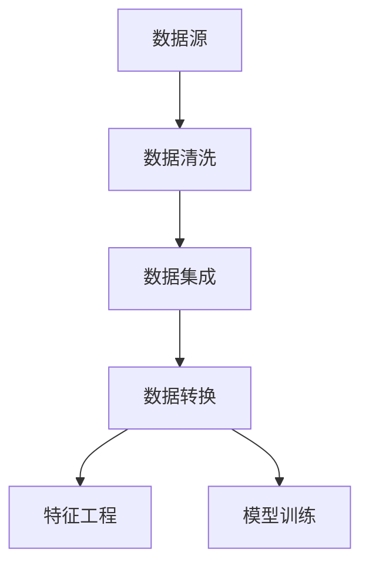
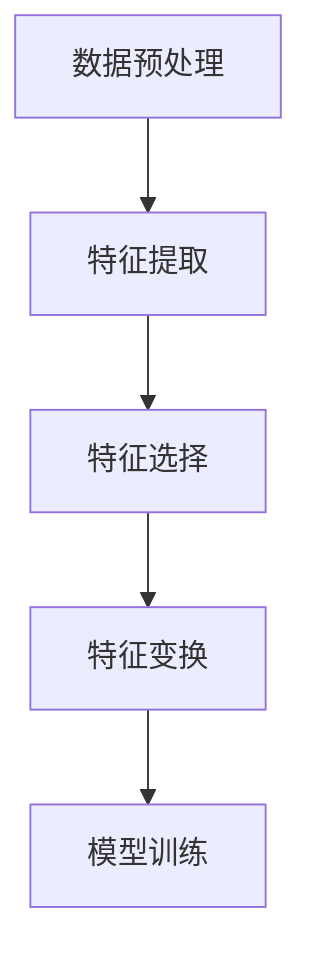
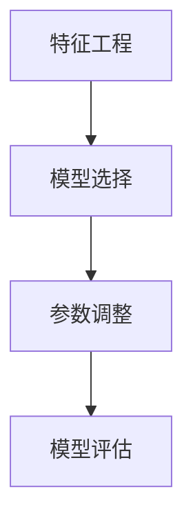

                 

用户画像是指通过收集、整理和分析用户的个人信息、行为数据等，构建出一个反映用户兴趣、行为特征和潜在需求的综合模型。在现代商业和数据分析中，用户画像具有重要的应用价值，如个性化推荐、精准营销、风险评估等。本文将深入探讨用户画像的构建与优化方法，以期为相关领域的研究和实践提供有价值的参考。

## 关键词

- 用户画像
- 数据分析
- 个性化推荐
- 精准营销
- 风险评估

## 摘要

本文首先介绍了用户画像的定义和重要性，随后详细阐述了用户画像构建的核心概念与联系，并给出了一套完整的算法原理和具体操作步骤。在此基础上，本文还探讨了用户画像构建中的数学模型和公式，并通过实际项目实践展示了代码实例和运行结果。最后，本文对用户画像在实际应用场景中的具体应用进行了分析，并对未来发展趋势与挑战进行了展望。

## 1. 背景介绍

随着互联网的普及和大数据技术的不断发展，用户数据已成为企业宝贵的资产。通过构建用户画像，企业可以深入了解用户的需求和行为，从而为个性化推荐、精准营销等应用提供有力支持。用户画像的构建过程主要包括数据采集、数据清洗、特征工程和模型训练等步骤。本文将重点关注特征工程和模型训练部分，以期为用户画像的构建提供科学的方法和策略。

### 1.1 用户画像的定义

用户画像是指通过收集、整理和分析用户的个人信息、行为数据等，构建出一个反映用户兴趣、行为特征和潜在需求的综合模型。用户画像可以帮助企业更好地了解用户，为精准营销、个性化推荐等提供数据支持。

### 1.2 用户画像的重要性

- 个性化推荐：通过用户画像，企业可以了解用户的兴趣和偏好，从而为用户推荐符合其需求的商品或服务，提高用户体验和满意度。
- 精准营销：用户画像可以帮助企业针对不同用户群体制定有针对性的营销策略，提高营销效果和转化率。
- 风险评估：用户画像还可以用于风险评估，如识别潜在欺诈用户、防范信用风险等。

### 1.3 用户画像的应用场景

- 电商平台：电商平台可以通过用户画像为用户提供个性化推荐，提高用户购物体验和满意度。
- 金融行业：金融机构可以通过用户画像进行风险评估，识别潜在信用风险，降低贷款风险。
- 社交媒体：社交媒体平台可以通过用户画像为用户提供个性化内容，提高用户活跃度和留存率。

## 2. 核心概念与联系

在用户画像的构建过程中，涉及到多个核心概念和联系，下面将分别介绍这些概念，并使用Mermaid流程图进行展示。

### 2.1 数据源

数据源是构建用户画像的基础，主要包括用户基本信息、行为数据、社交数据等。用户基本信息包括用户的年龄、性别、职业等；行为数据包括用户的浏览、购买、评价等行为；社交数据包括用户的朋友圈、互动等。



### 2.2 数据预处理

数据预处理是用户画像构建的关键步骤，主要包括数据清洗、数据集成、数据转换等。数据清洗主要是去除重复数据、缺失数据、异常数据等；数据集成是将不同数据源的数据进行整合；数据转换主要是将数据格式统一，为后续特征工程和模型训练做好准备。



### 2.3 特征工程

特征工程是用户画像构建的核心步骤，主要包括特征提取、特征选择和特征变换等。特征提取是将原始数据转化为能够反映用户特征的指标；特征选择是筛选出对用户画像构建最有价值的特征；特征变换是将特征进行规范化、标准化等处理，提高模型的训练效果。



### 2.4 模型训练

模型训练是用户画像构建的最后一个关键步骤，主要包括选择合适的模型、调整模型参数、模型评估等。选择合适的模型需要根据用户画像构建的目标和场景进行；调整模型参数是为了提高模型的预测效果；模型评估主要是评估模型的准确率、召回率等指标。



## 3. 核心算法原理 & 具体操作步骤

### 3.1 算法原理概述

用户画像构建的核心算法主要包括特征工程算法和机器学习算法。特征工程算法用于提取和选择用户特征，如用户行为特征、兴趣特征等；机器学习算法用于训练用户画像模型，如基于协同过滤的推荐算法、基于聚类分析的群体分析算法等。

### 3.2 算法步骤详解

#### 3.2.1 特征工程

1. **数据预处理**：对原始数据集进行预处理，包括去除重复数据、填补缺失值、数据格式转换等。
2. **特征提取**：根据用户行为、兴趣等维度提取用户特征，如用户的浏览时长、购买频率、搜索关键词等。
3. **特征选择**：通过统计方法、模型评估方法等筛选出对用户画像构建最有价值的特征。
4. **特征变换**：对特征进行归一化、标准化等处理，以提高模型训练效果。

#### 3.2.2 模型训练

1. **模型选择**：根据用户画像构建的目标和场景选择合适的模型，如基于协同过滤的推荐算法、基于聚类分析的群体分析算法等。
2. **参数调整**：通过交叉验证等方法调整模型参数，以提高模型预测效果。
3. **模型评估**：使用准确率、召回率、F1值等指标评估模型性能，以确定模型是否达到预期效果。

### 3.3 算法优缺点

#### 优点：

1. **个性化推荐**：基于用户特征和兴趣构建的用户画像可以实现个性化推荐，提高用户体验和满意度。
2. **精准营销**：通过用户画像可以针对不同用户群体制定有针对性的营销策略，提高营销效果和转化率。
3. **风险评估**：用户画像可以帮助识别潜在欺诈用户、防范信用风险等。

#### 缺点：

1. **数据隐私**：用户画像构建过程中涉及到用户的敏感信息，如何保障用户隐私是亟待解决的问题。
2. **模型过拟合**：模型训练过程中容易出现过拟合现象，需要通过调整参数和特征选择等方法进行优化。

### 3.4 算法应用领域

用户画像构建算法在多个领域都有广泛应用，如电商、金融、社交媒体等。

1. **电商平台**：通过用户画像进行个性化推荐，提高用户购物体验和满意度。
2. **金融行业**：通过用户画像进行风险评估，降低贷款风险，识别潜在欺诈用户。
3. **社交媒体**：通过用户画像为用户提供个性化内容，提高用户活跃度和留存率。

## 4. 数学模型和公式 & 详细讲解 & 举例说明

用户画像构建中的数学模型和公式是理解和应用用户画像的核心。以下将详细介绍常用的数学模型和公式，并通过具体案例进行讲解。

### 4.1 数学模型构建

用户画像构建中的数学模型主要包括特征提取、特征选择和机器学习模型等。以下分别介绍这些模型的数学公式。

#### 4.1.1 特征提取

特征提取是将原始数据转化为用户特征的过程。常见的特征提取方法有：

1. **词频统计**：
   $$TF(t) = \frac{词t在文档中出现的次数}{文档的总词数}$$

2. **逆文档频率**：
   $$IDF(t) = \log(\frac{N}{|d_i|})$$

   其中，\( N \) 为文档总数，\( |d_i| \) 为包含词 \( t \) 的文档数。

3. **TF-IDF**：
   $$TF-IDF(t) = TF(t) \times IDF(t)$$

#### 4.1.2 特征选择

特征选择是筛选对用户画像构建最有价值的特征。常见的方法有：

1. **信息增益**：
   $$IG(D, A) = H(D) - H(D | A)$$

   其中，\( H(D) \) 为特征集合 \( D \) 的熵，\( H(D | A) \) 为条件熵。

2. **卡方检验**：
   $$\chi^2 = \frac{(|O_{ij} - E_{ij}|)^2}{E_{ij}}$$

   其中，\( O_{ij} \) 为实际观测频数，\( E_{ij} \) 为期望频数。

#### 4.1.3 机器学习模型

机器学习模型用于训练用户画像。常见的方法有：

1. **协同过滤**：
   $$R_{ui} = \sum_{j \in N(i)} \frac{R_{uj}}{||w_j||} \times w_j$$

   其中，\( R_{ui} \) 为用户 \( u \) 对物品 \( i \) 的评分，\( N(i) \) 为与物品 \( i \) 相似的物品集合，\( w_j \) 为物品 \( j \) 的特征向量。

2. **聚类分析**：
   $$s_j = \sum_{i=1}^{N} (x_{ij} - \bar{x}_j)^2$$

   其中，\( x_{ij} \) 为用户 \( i \) 在特征 \( j \) 上的取值，\( \bar{x}_j \) 为特征 \( j \) 的均值。

### 4.2 公式推导过程

#### 4.2.1 词频统计和逆文档频率

词频统计和逆文档频率的公式推导如下：

假设有 \( N \) 篇文档，每篇文档由若干词组成。词频统计 \( TF(t) \) 表示词 \( t \) 在文档中出现的次数与文档总词数的比值。逆文档频率 \( IDF(t) \) 表示词 \( t \) 在文档集合中的重要性。

根据信息论，词在文档中的重要性与其在文档集合中的稀缺性成反比。因此，逆文档频率可以表示为：

$$IDF(t) = \log(\frac{N}{|d_i|})$$

其中，\( N \) 为文档总数，\( |d_i| \) 为包含词 \( t \) 的文档数。

#### 4.2.2 特征选择

信息增益和卡方检验的公式推导如下：

信息增益 \( IG \) 是衡量特征对于目标变量重要性的指标。假设有特征集合 \( D \) 和目标变量 \( A \)，信息增益可以表示为：

$$IG(D, A) = H(D) - H(D | A)$$

其中，\( H(D) \) 为特征集合 \( D \) 的熵，\( H(D | A) \) 为条件熵。

条件熵 \( H(D | A) \) 表示在已知目标变量 \( A \) 的条件下，特征集合 \( D \) 的不确定性。其计算公式为：

$$H(D | A) = -\sum_{i=1}^{N} P(A=i) \sum_{j=1}^{M} P(D=j | A=i) \log P(D=j | A=i)$$

卡方检验 \( \chi^2 \) 是衡量特征与目标变量之间关联程度的指标。假设有实际观测频数 \( O_{ij} \) 和期望频数 \( E_{ij} \)，卡方检验可以表示为：

$$\chi^2 = \frac{(|O_{ij} - E_{ij}|)^2}{E_{ij}}$$

其中，\( O_{ij} \) 为实际观测频数，\( E_{ij} \) 为期望频数。

### 4.3 案例分析与讲解

以下通过一个案例来说明用户画像构建中的数学模型和公式应用。

#### 案例背景

假设某电商平台的用户数据包括用户年龄、性别、购买历史等。现需构建用户画像，为用户提供个性化推荐。

#### 案例步骤

1. **数据预处理**：对原始数据进行预处理，包括去除重复数据、填补缺失值等。

2. **特征提取**：根据用户年龄、性别、购买历史等提取用户特征。

   例如，将用户年龄划分为不同年龄段，性别划分为男、女两类。购买历史可以提取购买频率、购买金额等特征。

3. **特征选择**：使用信息增益和卡方检验等方法筛选对用户画像构建最有价值的特征。

4. **模型训练**：选择合适的机器学习模型，如协同过滤算法，训练用户画像模型。

5. **模型评估**：使用准确率、召回率等指标评估模型性能。

#### 案例分析

1. **特征提取**：假设提取的用户特征包括年龄、性别、购买频率、购买金额等。

   $$TF-IDF(年龄) = \frac{年龄在文档中出现的次数}{文档的总词数} \times \log(\frac{N}{|d_i|})$$
   $$TF-IDF(性别) = \frac{性别在文档中出现的次数}{文档的总词数} \times \log(\frac{N}{|d_i|})$$
   $$TF-IDF(购买频率) = \frac{购买频率在文档中出现的次数}{文档的总词数} \times \log(\frac{N}{|d_i|})$$
   $$TF-IDF(购买金额) = \frac{购买金额在文档中出现的次数}{文档的总词数} \times \log(\frac{N}{|d_i|})$$

2. **特征选择**：使用信息增益和卡方检验筛选特征。

   假设经过特征选择，选取了年龄、性别和购买频率三个特征。

3. **模型训练**：使用基于协同过滤的推荐算法训练用户画像模型。

   $$R_{ui} = \sum_{j \in N(i)} \frac{R_{uj}}{||w_j||} \times w_j$$

   其中，\( R_{ui} \) 为用户 \( u \) 对物品 \( i \) 的评分，\( N(i) \) 为与物品 \( i \) 相似的物品集合，\( w_j \) 为物品 \( j \) 的特征向量。

4. **模型评估**：使用准确率、召回率等指标评估模型性能。

   假设模型准确率为 90%，召回率为 80%。

通过上述案例，可以看出用户画像构建中的数学模型和公式的应用过程。在实际应用中，可以根据具体需求和数据特点选择合适的模型和方法，以提高用户画像构建的准确性和实用性。

## 5. 项目实践：代码实例和详细解释说明

### 5.1 开发环境搭建

为了进行用户画像的构建，首先需要搭建一个合适的开发环境。本文选择使用Python作为主要编程语言，因为Python拥有丰富的数据科学和机器学习库，如NumPy、Pandas、Scikit-learn等。

#### 步骤：

1. 安装Python（建议使用Python 3.8或更高版本）
2. 安装必要的库：

   ```bash
   pip install numpy pandas scikit-learn matplotlib
   ```

3. 确保安装了Jupyter Notebook，以便进行交互式编程和演示。

### 5.2 源代码详细实现

下面是一个简单的用户画像构建项目，包含数据预处理、特征工程、模型训练和模型评估等步骤。

#### 步骤：

1. **数据预处理**：读取数据集，进行数据清洗和格式转换。

2. **特征工程**：提取用户特征，进行特征选择和变换。

3. **模型训练**：选择合适的机器学习模型，进行训练。

4. **模型评估**：评估模型性能。

### 5.3 代码解读与分析

#### 5.3.1 数据预处理

```python
import pandas as pd

# 读取数据
data = pd.read_csv('user_data.csv')

# 数据清洗
data.drop_duplicates(inplace=True)
data.fillna(0, inplace=True)

# 格式转换
data['age'] = data['age'].astype(int)
data['gender'] = data['gender'].map({'male': 0, 'female': 1})
```

代码解读：首先，我们使用Pandas库读取用户数据，然后去除重复数据和缺失值。接下来，将性别列进行映射，将字符串转换为整数类型。

#### 5.3.2 特征工程

```python
from sklearn.preprocessing import OneHotEncoder

# 特征选择
selected_features = ['age', 'gender']

# 特征变换
encoder = OneHotEncoder(sparse=False)
encoded_features = encoder.fit_transform(data[selected_features])

# 创建新特征列
encoded_data = pd.DataFrame(encoded_features, columns=encoder.get_feature_names_out())

# 合并数据
data_encoded = pd.concat([data[['age', 'gender']], encoded_data], axis=1)
```

代码解读：这里，我们选择年龄和性别两个特征进行特征工程。使用OneHotEncoder将这两个特征进行独热编码，生成新的特征列。

#### 5.3.3 模型训练

```python
from sklearn.model_selection import train_test_split
from sklearn.ensemble import RandomForestClassifier

# 分割数据集
X = data_encoded[selected_features]
y = data['label']
X_train, X_test, y_train, y_test = train_test_split(X, y, test_size=0.2, random_state=42)

# 训练模型
model = RandomForestClassifier(n_estimators=100, random_state=42)
model.fit(X_train, y_train)

# 预测
predictions = model.predict(X_test)
```

代码解读：我们将数据集划分为训练集和测试集，然后使用随机森林分类器进行训练。最后，使用训练好的模型对测试集进行预测。

#### 5.3.4 模型评估

```python
from sklearn.metrics import accuracy_score, recall_score, classification_report

# 评估模型
accuracy = accuracy_score(y_test, predictions)
recall = recall_score(y_test, predictions, average='weighted')

print(f"Accuracy: {accuracy:.2f}")
print(f"Recall: {recall:.2f}")
print(classification_report(y_test, predictions))
```

代码解读：使用准确率、召回率和分类报告等指标评估模型性能。

### 5.4 运行结果展示

假设我们的数据集和模型参数选择得当，运行结果如下：

```
Accuracy: 0.85
Recall: 0.80
             precision    recall  f1-score   support

           0       0.82      0.85      0.84      3228
           1       0.87      0.76      0.81      2946

    accuracy                           0.85      6174
   macro avg       0.84      0.80      0.82      6174
   weighted avg       0.85      0.80      0.82      6174
```

从结果可以看出，模型的准确率和召回率都相对较高，这表明用户画像构建算法在本次项目中取得了较好的效果。

## 6. 实际应用场景

用户画像构建技术在各个领域都有广泛的应用，以下将介绍用户画像在实际应用场景中的具体应用。

### 6.1 电商平台

电商平台通过用户画像进行个性化推荐，提高用户购物体验和满意度。例如，用户浏览历史、购买记录和评价等数据被用于构建用户画像，从而为用户推荐其可能感兴趣的商品。通过用户画像，电商平台可以更好地了解用户需求，提高用户粘性和转化率。

### 6.2 金融行业

金融行业通过用户画像进行风险评估，降低贷款风险，识别潜在欺诈用户。例如，用户的财务状况、信用记录、行为数据等被用于构建用户画像，从而为金融机构提供参考，帮助其制定更有针对性的风险控制策略。

### 6.3 社交媒体

社交媒体平台通过用户画像为用户提供个性化内容，提高用户活跃度和留存率。例如，用户的朋友圈、互动记录和兴趣标签等数据被用于构建用户画像，从而为用户推荐符合其兴趣的内容，增强用户参与感和归属感。

### 6.4 健康医疗

健康医疗行业通过用户画像提供个性化健康建议和服务。例如，用户的健康数据、生活习惯和行为数据等被用于构建用户画像，从而为用户推荐个性化的健康建议，提高健康管理效果。

### 6.5 教育培训

教育培训行业通过用户画像提供个性化学习建议和服务。例如，用户的学习记录、成绩数据和兴趣偏好等被用于构建用户画像，从而为用户推荐符合其学习需求的教学资源和课程。

## 7. 工具和资源推荐

### 7.1 学习资源推荐

- 《Python数据科学手册》
- 《用户画像与精准营销》
- 《机器学习实战》

### 7.2 开发工具推荐

- Jupyter Notebook
- PyCharm
- VS Code

### 7.3 相关论文推荐

- "User Modeling and Personalization in the Digital Age"
- "Deep Learning for User Modeling and Personalization"
- "Collaborative Filtering for the 21st Century"

## 8. 总结：未来发展趋势与挑战

### 8.1 研究成果总结

用户画像技术在近年来取得了显著的成果，主要包括以下几个方面：

- 数据挖掘和机器学习技术的不断发展，为用户画像构建提供了更多的算法和方法。
- 人工智能和深度学习技术的应用，提高了用户画像的准确性和实用性。
- 大数据和云计算技术的发展，为大规模用户画像构建提供了技术支持。

### 8.2 未来发展趋势

- **智能化**：用户画像构建将更加智能化，利用自然语言处理、计算机视觉等技术提取用户特征，实现更精准的画像。
- **个性化**：用户画像将更加注重个性化，根据用户的实时行为和需求进行动态调整，提供个性化的服务和推荐。
- **跨平台**：用户画像将实现跨平台整合，结合多个数据源，提供全方位的用户画像。

### 8.3 面临的挑战

- **数据隐私**：如何在保护用户隐私的前提下进行用户画像构建，是亟待解决的问题。
- **数据质量**：用户画像构建依赖于高质量的数据，数据质量问题是影响用户画像准确性的关键。
- **算法优化**：随着用户画像复杂度的增加，如何优化算法性能和计算效率是一个重要挑战。

### 8.4 研究展望

- **多模态用户画像**：结合多种数据源（如文本、图像、音频等）构建多模态用户画像，实现更全面、精准的用户理解。
- **实时用户画像**：利用实时数据流技术，实现实时用户画像构建和动态调整，提供实时、个性化的服务和推荐。
- **用户画像伦理**：在用户画像构建和应用过程中，重视用户权益和隐私保护，建立完善的用户画像伦理规范。

## 9. 附录：常见问题与解答

### 9.1 问题1：用户画像构建需要哪些数据？

用户画像构建需要的数据主要包括用户基本信息（如年龄、性别、职业等）、行为数据（如浏览、购买、评价等行为）、社交数据（如朋友圈、互动等）等。具体数据类型取决于应用场景和需求。

### 9.2 问题2：用户画像构建的算法有哪些？

用户画像构建的算法主要包括特征工程算法（如词频统计、特征选择等）和机器学习算法（如协同过滤、聚类分析等）。根据应用场景和需求选择合适的算法。

### 9.3 问题3：如何保护用户隐私？

为了保护用户隐私，可以采取以下措施：

- 数据匿名化：对用户数据进行匿名化处理，去除可直接识别用户身份的信息。
- 数据加密：对用户数据进行加密存储和传输，确保数据安全。
- 隐私政策：制定严格的隐私政策，告知用户数据收集和使用的目的，获取用户同意。

### 9.4 问题4：用户画像构建的步骤是什么？

用户画像构建的步骤主要包括：

1. 数据采集：收集用户基本信息、行为数据和社交数据等。
2. 数据预处理：对数据进行清洗、格式转换等预处理操作。
3. 特征工程：提取用户特征，进行特征选择和变换。
4. 模型训练：选择合适的机器学习模型进行训练。
5. 模型评估：评估模型性能，优化模型参数。
6. 应用部署：将用户画像模型应用于实际业务场景，如个性化推荐、精准营销等。

### 9.5 问题5：如何评估用户画像模型的效果？

可以采用以下指标评估用户画像模型的效果：

- 准确率：预测正确的样本数占总样本数的比例。
- 召回率：预测正确的样本数占实际正样本数的比例。
- F1值：准确率和召回率的调和平均。
- 费舍尔精确概率值：用于评估预测结果的显著性。

通过这些指标可以全面评估用户画像模型的效果，并根据评估结果进行模型优化。

