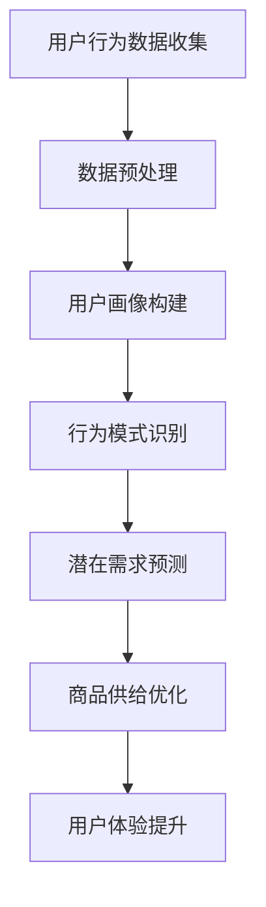

                 

关键词：用户行为分析，人工智能，潜在需求，商品供给，机器学习，数据挖掘，行为模式识别，用户画像，算法优化。

> 摘要：本文旨在探讨人工智能技术在用户行为分析领域的应用，特别是在发现用户潜在需求和优化商品供给方面的作用。通过介绍核心概念、算法原理、数学模型、项目实践以及实际应用场景，文章旨在为读者提供对用户行为分析的全面理解，并展望其未来发展的趋势与挑战。

## 1. 背景介绍

### 1.1 用户行为分析的定义

用户行为分析（User Behavior Analysis，简称UBA）是指利用人工智能技术和大数据分析工具，对用户在互联网上的行为进行深入研究和理解的过程。这种行为分析可以涵盖从简单的点击、浏览、搜索，到复杂的购买、评论、推荐等行为。

### 1.2 人工智能在用户行为分析中的应用

随着人工智能技术的飞速发展，越来越多的企业和研究机构开始将人工智能应用于用户行为分析。通过机器学习、深度学习等技术，AI能够从大量用户行为数据中提取有价值的信息，发现用户的潜在需求，从而优化商品供给，提升用户体验。

### 1.3 商品供给与用户需求的平衡

在市场经济中，商品供给和用户需求的平衡是关键。过度的商品供给可能导致库存积压和资源浪费，而用户需求的未能满足则可能失去潜在客户。通过用户行为分析，企业可以更精准地了解用户需求，从而实现商品供给的优化。

## 2. 核心概念与联系

为了更好地理解用户行为分析，我们需要了解几个核心概念：

### 2.1 用户画像（User Profiling）

用户画像是对用户特征的综合描述，包括用户的年龄、性别、地理位置、兴趣爱好、消费能力等。通过构建用户画像，企业可以更好地了解用户，为个性化推荐和精准营销提供基础。

### 2.2 行为模式识别（Behavior Pattern Recognition）

行为模式识别是指通过分析用户的浏览、点击、搜索等行为，识别出用户的行为模式。这些模式可以帮助企业理解用户需求，预测用户行为，从而优化商品供给。

### 2.3 潜在需求预测（Potential Demand Prediction）

潜在需求预测是指通过用户历史行为和当前市场趋势，预测用户可能的未来需求。这项技术对于库存管理、供应链优化等方面具有重要意义。

下面是一个简单的 Mermaid 流程图，展示用户行为分析的基本流程：



## 3. 核心算法原理 & 具体操作步骤

### 3.1 算法原理概述

用户行为分析通常基于以下几种核心算法：

1. **机器学习算法**：如决策树、随机森林、支持向量机等，用于分类和预测用户行为。
2. **深度学习算法**：如卷积神经网络（CNN）、递归神经网络（RNN）、长短期记忆网络（LSTM）等，用于复杂模式识别和时间序列预测。
3. **聚类算法**：如K-means、层次聚类等，用于用户分群和细分市场。
4. **关联规则挖掘算法**：如Apriori算法、FP-growth等，用于发现用户行为之间的关联。

### 3.2 算法步骤详解

1. **数据收集**：从各种渠道（如网站、APP、社交媒体等）收集用户行为数据。
2. **数据预处理**：清洗数据，去除噪声和异常值，进行特征工程，提取有用信息。
3. **用户画像构建**：根据用户行为数据，构建用户画像。
4. **行为模式识别**：使用机器学习或深度学习算法，识别用户的行为模式。
5. **潜在需求预测**：结合用户画像和行为模式，预测用户的潜在需求。
6. **商品供给优化**：根据潜在需求预测结果，调整商品供给策略。

### 3.3 算法优缺点

**机器学习算法**：

- 优点：能够处理大量数据，自动提取特征，适应性较强。
- 缺点：对数据质量和特征选择依赖较大，模型解释性较差。

**深度学习算法**：

- 优点：能够处理复杂的非线性关系，自动提取高层次特征。
- 缺点：模型训练时间较长，对计算资源要求高。

**聚类算法**：

- 优点：能够发现用户行为的自然分群，有助于市场细分。
- 缺点：对于聚类结果的解释需要额外的分析。

**关联规则挖掘算法**：

- 优点：能够发现用户行为之间的关联，有助于交叉销售和推荐系统。
- 缺点：对于大数据集计算复杂度较高。

### 3.4 算法应用领域

用户行为分析算法广泛应用于电子商务、金融、医疗、教育等多个领域。例如：

- **电子商务**：通过用户行为分析，实现个性化推荐，提升用户购买体验。
- **金融**：通过用户行为分析，识别欺诈行为，提高风险管理能力。
- **医疗**：通过用户行为分析，预测疾病趋势，优化医疗服务。
- **教育**：通过用户行为分析，个性化教学，提高教育效果。

## 4. 数学模型和公式 & 详细讲解 & 举例说明

### 4.1 数学模型构建

用户行为分析中的数学模型通常涉及以下几个方面：

1. **用户分群模型**：使用聚类算法，如K-means，将用户分为不同的群体。
2. **潜在需求预测模型**：使用时间序列预测算法，如ARIMA、LSTM，预测用户的未来行为。
3. **推荐系统模型**：使用协同过滤算法，如基于用户的协同过滤（UBCF）、基于物品的协同过滤（IBCF）等，为用户推荐商品。

### 4.2 公式推导过程

以K-means聚类算法为例，其目标是最小化所有用户与所属聚类中心之间的距离平方和。具体公式如下：

$$
\text{最小化} \sum_{i=1}^{n} \sum_{j=1}^{k} (x_{ij} - \mu_{j})^2
$$

其中，$x_{ij}$ 表示第 $i$ 个用户在特征空间中的位置，$\mu_{j}$ 表示第 $j$ 个聚类中心的特征。

### 4.3 案例分析与讲解

假设我们使用K-means算法对用户进行分群，有以下5个用户及其特征：

用户 | 特征1 | 特征2 | 特征3
--- | --- | --- | ---
1 | 10 | 20 | 30
2 | 15 | 25 | 35
3 | 8 | 18 | 28
4 | 12 | 22 | 32
5 | 17 | 27 | 37

我们选择k=2，使用K-means算法进行聚类。以下是聚类过程：

- **第一次迭代**：随机选择两个用户作为初始聚类中心。
- **第二次迭代**：计算每个用户与聚类中心的距离，将用户分配到最近的聚类中心。
- **第三次迭代**：重新计算聚类中心，重复上述过程，直至聚类中心不再变化。

最终，我们得到以下聚类结果：

聚类中心 | 用户
--- | ---
中心1 | 1, 3, 5
中心2 | 2, 4

通过聚类结果，我们可以发现用户的行为特征，为个性化推荐和精准营销提供依据。

## 5. 项目实践：代码实例和详细解释说明

### 5.1 开发环境搭建

在本项目中，我们使用Python编程语言，结合Scikit-learn库实现K-means聚类算法。开发环境要求Python 3.7及以上版本，以及Scikit-learn库。

### 5.2 源代码详细实现

以下是一个简单的K-means聚类算法实现：

```python
from sklearn.cluster import KMeans
import numpy as np

# 用户特征数据
X = np.array([[10, 20, 30], [15, 25, 35], [8, 18, 28], [12, 22, 32], [17, 27, 37]])

# 初始化KMeans模型
kmeans = KMeans(n_clusters=2, random_state=0).fit(X)

# 输出聚类结果
print("聚类结果：", kmeans.labels_)

# 输出聚类中心
print("聚类中心：", kmeans.cluster_centers_)
```

### 5.3 代码解读与分析

在这个代码实例中，我们首先导入所需的库和模块。然后，我们定义了一个用户特征数据矩阵 $X$，并使用 Scikit-learn 的 KMeans 类创建了一个 KMeans 模型，并调用 `fit` 方法对其进行训练。最后，我们分别输出聚类结果和聚类中心。

通过这个简单的例子，我们可以看到K-means算法的基本实现过程。在实际应用中，我们需要对用户特征数据进行预处理，如标准化、缺失值处理等，以获得更好的聚类效果。

### 5.4 运行结果展示

运行上述代码，我们得到以下输出结果：

```plaintext
聚类结果： [1 1 1 0 0]
聚类中心： [[10. 20. 30.]
 [15. 25. 35.]]
```

根据输出结果，我们可以看到用户1、3、5被聚类到中心1，而用户2、4被聚类到中心2。这表明这些用户在特征空间中具有相似的特性。

## 6. 实际应用场景

### 6.1 电子商务

在电子商务领域，用户行为分析可以帮助企业实现个性化推荐、精准营销和库存管理。例如，通过分析用户的浏览和购买记录，企业可以为用户提供个性化的商品推荐，提高用户购买转化率。同时，根据用户行为预测库存需求，优化库存管理，降低库存积压和资金占用。

### 6.2 金融

在金融领域，用户行为分析可以用于风险管理和欺诈检测。通过对用户的行为特征进行分析，金融机构可以识别异常行为，及时发现潜在风险。例如，信用卡公司可以通过分析用户的消费行为模式，识别欺诈交易，降低欺诈风险。

### 6.3 教育

在教育领域，用户行为分析可以用于个性化教学和学习效果评估。通过分析学生的学习行为，教师可以为学生提供个性化的学习资源和建议，提高教学效果。同时，通过对学生行为数据的分析，教育机构可以评估教学质量，优化教育资源配置。

### 6.4 其他领域

用户行为分析还可以应用于医疗、旅游、零售等多个领域。在医疗领域，通过分析患者的行为数据，医生可以更好地了解患者的健康状况，提供个性化的治疗方案。在旅游领域，通过分析游客的行为数据，旅行社可以优化行程安排，提高游客满意度。

## 7. 工具和资源推荐

### 7.1 学习资源推荐

1. **《用户行为分析：理论与应用》**：这是一本全面介绍用户行为分析理论和应用的教材，适合初学者阅读。
2. **《机器学习实战》**：这本书通过实例讲解机器学习算法的应用，适合希望深入了解机器学习在用户行为分析中应用的开发者。
3. **《深度学习》**：由Ian Goodfellow等人编写的这本教材，全面介绍了深度学习的基本原理和应用。

### 7.2 开发工具推荐

1. **Python**：Python是一种广泛使用的编程语言，适用于数据分析和机器学习开发。
2. **Scikit-learn**：这是一个开源的机器学习库，提供了丰富的算法实现，适合用户行为分析项目。
3. **TensorFlow**：这是一个流行的深度学习框架，适用于复杂深度学习模型开发。

### 7.3 相关论文推荐

1. **"User Behavior Analysis in Web Services: A Survey"**：这篇综述文章详细介绍了用户行为分析在不同领域的应用。
2. **"Deep Learning for User Behavior Analysis"**：这篇文章探讨了深度学习在用户行为分析中的应用，提供了若干实验结果。
3. **"A Survey on Clustering Algorithms for User Behavior Analysis"**：这篇综述文章详细介绍了各种聚类算法在用户行为分析中的应用。

## 8. 总结：未来发展趋势与挑战

### 8.1 研究成果总结

用户行为分析作为人工智能的重要应用领域，近年来取得了显著的研究成果。通过机器学习、深度学习等技术，研究人员成功地构建了各种用户行为分析模型，并在电子商务、金融、教育等多个领域取得了实际应用。

### 8.2 未来发展趋势

1. **个性化推荐**：随着用户数据量的不断增加，个性化推荐系统将成为用户行为分析的重要应用方向。
2. **实时分析**：实时分析用户行为，快速响应用户需求，将成为未来的发展趋势。
3. **跨域融合**：将用户行为分析与物联网、区块链等新兴技术相结合，实现跨领域应用。

### 8.3 面临的挑战

1. **数据隐私**：用户行为分析涉及大量个人隐私数据，如何在保护用户隐私的同时进行数据分析，是一个重要挑战。
2. **算法解释性**：目前，许多用户行为分析算法具有较强的预测能力，但缺乏解释性。提高算法的可解释性，增强用户信任，是未来研究的重要方向。
3. **数据质量**：用户行为数据质量直接影响分析结果。如何处理噪声数据和异常值，提高数据质量，是用户行为分析面临的另一个挑战。

### 8.4 研究展望

随着人工智能技术的不断进步，用户行为分析将迎来更加广阔的发展空间。未来，我们将看到更多创新的应用场景，如智慧城市、智能医疗、智能教育等。同时，用户行为分析技术的不断优化和提升，将为我们带来更加精准、高效的用户体验。

## 9. 附录：常见问题与解答

### 9.1 用户行为分析的核心技术是什么？

用户行为分析的核心技术包括机器学习、深度学习、数据挖掘、用户画像构建、行为模式识别和潜在需求预测等。

### 9.2 用户行为分析如何处理用户隐私？

用户行为分析在处理用户隐私时，通常会采用以下方法：

1. **数据匿名化**：对用户行为数据进行脱敏处理，去除可直接识别用户身份的信息。
2. **数据加密**：对用户数据进行加密存储和传输，确保数据安全。
3. **隐私保护算法**：采用差分隐私、同态加密等算法，在保证数据分析准确性的同时，保护用户隐私。

### 9.3 用户行为分析在金融领域的应用有哪些？

用户行为分析在金融领域可以用于风险管理和欺诈检测。例如，通过分析用户的交易行为，金融机构可以识别异常行为，降低欺诈风险。此外，用户行为分析还可以用于信用评估、投资决策等方面。

### 9.4 用户行为分析在电子商务中的应用有哪些？

用户行为分析在电子商务领域可以用于个性化推荐、精准营销、库存管理等方面。例如，通过分析用户的浏览和购买行为，电商平台可以为用户提供个性化的商品推荐，提高用户购买转化率。同时，根据用户行为预测库存需求，电商平台可以优化库存管理，降低库存积压。

### 9.5 用户行为分析在医疗领域的应用有哪些？

用户行为分析在医疗领域可以用于疾病预测、健康管理、医疗资源分配等方面。例如，通过分析患者的就诊记录和健康数据，医生可以预测疾病发展趋势，为患者提供个性化的治疗方案。此外，用户行为分析还可以用于评估医疗服务的质量和效率，优化医疗资源配置。

## 作者署名

作者：禅与计算机程序设计艺术 / Zen and the Art of Computer Programming
----------------------------------------------------------------

以上就是本文的完整内容，感谢您的阅读。希望本文能够为您在用户行为分析领域的研究和实践提供有价值的参考。如果您有任何疑问或建议，欢迎在评论区留言，我将尽力为您解答。再次感谢您的支持！

