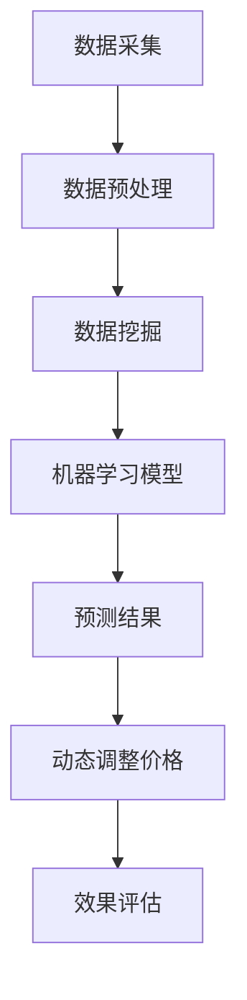

                 

关键词：电商、动态定价、智能技术、算法、数据挖掘、机器学习、深度学习

摘要：随着电子商务的快速发展，如何实现精准的动态定价成为企业提升竞争力的重要课题。本文将探讨电商动态定价的智能技术，包括其核心概念、算法原理、数学模型以及实际应用场景，旨在为企业提供有效的定价策略。

## 1. 背景介绍

在互联网高速发展的时代，电子商务已经成为现代商业的重要组成部分。然而，随着市场竞争的加剧，如何在琳琅满目的商品中脱颖而出，成为消费者关注的焦点，是企业面临的一大挑战。价格策略作为市场营销的重要组成部分，直接影响着消费者的购买决策。传统的定价策略主要依赖于经验和市场调研，而随着大数据、人工智能等技术的快速发展，动态定价成为电商企业实现精准营销的新利器。

动态定价是指根据市场供需、消费者行为、竞争对手价格等多重因素，实时调整商品价格的一种定价模式。其核心在于利用人工智能技术，通过对海量数据的分析，预测市场趋势和消费者需求，从而实现价格的智能调整。相比于传统的定价模式，动态定价能够更快速地响应市场变化，提高定价的灵活性和精准度，进而提升企业的市场竞争力。

## 2. 核心概念与联系

### 2.1 数据挖掘

数据挖掘是动态定价的基础，它通过对海量数据的分析，发现数据之间的关联和规律。在电商领域，数据挖掘主要涉及消费者行为数据、市场趋势数据、竞争对手价格数据等。通过数据挖掘，企业可以识别出消费者偏好、市场趋势等关键信息，为动态定价提供决策依据。

### 2.2 机器学习

机器学习是动态定价的核心技术之一，它通过构建预测模型，实现对市场供需、消费者行为等数据的预测。常见的机器学习算法包括线性回归、决策树、随机森林、支持向量机等。在动态定价中，机器学习算法可以帮助企业预测未来价格的变化趋势，从而制定合理的价格策略。

### 2.3 深度学习

深度学习是机器学习的一个分支，它通过构建复杂的神经网络模型，实现对数据的自动学习和特征提取。在动态定价中，深度学习可以用于挖掘消费者行为数据中的深层次特征，提高预测的准确性。常见的深度学习模型包括卷积神经网络（CNN）、循环神经网络（RNN）、长短时记忆网络（LSTM）等。

### 2.4 Mermaid 流程图

下面是动态定价的核心概念和联系流程图：



## 3. 核心算法原理 & 具体操作步骤

### 3.1 算法原理概述

动态定价的核心算法主要包括数据挖掘、机器学习和深度学习三个阶段。数据挖掘阶段通过分析消费者行为数据和市场趋势数据，提取关键特征和关联规则；机器学习阶段构建预测模型，预测未来价格的变化趋势；深度学习阶段对预测结果进行优化，提高预测的准确性。

### 3.2 算法步骤详解

#### 3.2.1 数据采集

数据采集是动态定价的第一步，主要包括消费者行为数据、市场趋势数据和竞争对手价格数据。消费者行为数据可以通过电商平台的用户浏览记录、购买记录、评价等获取；市场趋势数据可以通过行业报告、市场调查等获取；竞争对手价格数据可以通过爬虫技术获取。

#### 3.2.2 数据预处理

数据预处理主要包括数据清洗、数据整合和数据归一化。数据清洗是指去除数据中的噪声和异常值；数据整合是指将不同来源的数据进行整合，形成统一的数据集；数据归一化是指将不同量纲的数据转换为相同量纲，以便进行后续的分析。

#### 3.2.3 数据挖掘

数据挖掘阶段通过分析消费者行为数据和市场趋势数据，提取关键特征和关联规则。常见的特征提取方法包括特征选择、特征工程等；关联规则挖掘方法包括Apriori算法、FP-growth算法等。

#### 3.2.4 机器学习模型

机器学习模型阶段通过构建预测模型，预测未来价格的变化趋势。常见的机器学习算法包括线性回归、决策树、随机森林、支持向量机等。在选择机器学习算法时，需要考虑模型的预测性能、计算复杂度等因素。

#### 3.2.5 深度学习模型

深度学习模型阶段通过构建复杂的神经网络模型，实现对数据的自动学习和特征提取。常见的深度学习模型包括卷积神经网络（CNN）、循环神经网络（RNN）、长短时记忆网络（LSTM）等。在选择深度学习模型时，需要考虑模型的训练时间、预测性能等因素。

#### 3.2.6 动态调整价格

动态调整价格阶段根据预测结果，实时调整商品价格。动态调整价格的方法包括基于预测的价格调整、基于市场供需的价格调整等。

#### 3.2.7 效果评估

效果评估阶段对动态定价策略的效果进行评估。常见的评估指标包括预测准确率、价格调整效果等。

### 3.3 算法优缺点

#### 优点：

- 高效：动态定价算法可以快速响应市场变化，提高定价的灵活性和精准度。
- 精准：通过数据挖掘、机器学习和深度学习等技术，可以挖掘出消费者行为和市场趋势的深层次特征，提高预测的准确性。
- 个性化：动态定价可以根据消费者的个性化需求，制定个性化的价格策略，提高用户体验。

#### 缺点：

- 复杂：动态定价算法涉及多个技术领域，实现过程复杂。
- 数据依赖：动态定价算法的效果很大程度上依赖于数据的质量和数量。

### 3.4 算法应用领域

动态定价算法在电商领域的应用非常广泛，包括：

- 商品定价：根据市场供需、消费者行为等因素，实时调整商品价格。
- 促销策略：根据促销活动的效果，动态调整促销力度和价格。
- 供应链管理：根据供应链的库存水平、运输成本等因素，优化定价策略。

## 4. 数学模型和公式 & 详细讲解 & 举例说明

### 4.1 数学模型构建

动态定价的数学模型主要包括消费者行为模型、市场供需模型和价格调整模型。

#### 消费者行为模型：

消费者行为模型用于预测消费者对商品的需求量。常用的模型包括线性回归模型、多项式回归模型等。

线性回归模型：

$$y = w_0 + w_1 \cdot x$$

其中，$y$表示需求量，$x$表示价格，$w_0$和$w_1$为模型参数。

多项式回归模型：

$$y = w_0 + w_1 \cdot x + w_2 \cdot x^2$$

其中，$y$表示需求量，$x$表示价格，$w_0$、$w_1$和$w_2$为模型参数。

#### 市场供需模型：

市场供需模型用于预测市场的供需关系。常用的模型包括供需函数、供需曲线等。

供需函数：

$$Q_D = a - b \cdot P$$

其中，$Q_D$表示需求量，$a$和$b$为模型参数，$P$表示价格。

供需曲线：

$$Q_S = c + d \cdot P$$

其中，$Q_S$表示供给量，$c$和$d$为模型参数，$P$表示价格。

#### 价格调整模型：

价格调整模型用于根据预测结果动态调整商品价格。常用的模型包括线性价格调整模型、非线性价格调整模型等。

线性价格调整模型：

$$P_{new} = P_{current} + k \cdot (Q_D - Q_S)$$

其中，$P_{new}$表示新的价格，$P_{current}$表示当前价格，$k$为调整系数，$Q_D$和$Q_S$分别为预测的需求量和供给量。

非线性价格调整模型：

$$P_{new} = P_{current} + k \cdot \ln(Q_D - Q_S)$$

其中，$P_{new}$表示新的价格，$P_{current}$表示当前价格，$k$为调整系数，$Q_D$和$Q_S$分别为预测的需求量和供给量。

### 4.2 公式推导过程

#### 消费者行为模型推导：

假设消费者对商品的需求量与价格呈线性关系，即：

$$y = w_0 + w_1 \cdot x$$

其中，$y$表示需求量，$x$表示价格，$w_0$和$w_1$为模型参数。

为了求解模型参数，我们可以使用最小二乘法。首先，对模型进行求导，得到：

$$\frac{\partial y}{\partial x} = w_1$$

然后，对需求量$y$进行求导，得到：

$$\frac{\partial y}{\partial x} = \frac{\partial y}{\partial w_0} + \frac{\partial y}{\partial w_1} \cdot \frac{\partial w_1}{\partial x}$$

由于需求量$y$与价格$x$无关，所以$\frac{\partial y}{\partial x} = 0$。将上述两个方程联立，可以得到：

$$\frac{\partial y}{\partial w_0} = -w_1$$

解得：

$$w_0 = -\frac{1}{2}w_1$$

将$w_0$代入原方程，得到：

$$y = -\frac{1}{2}w_1 + w_1 \cdot x$$

化简得：

$$y = \frac{1}{2}w_1 \cdot x$$

因此，消费者行为模型可以表示为：

$$y = \frac{1}{2}w_1 \cdot x$$

#### 市场供需模型推导：

假设市场的供需关系与价格呈线性关系，即：

$$Q_D = a - b \cdot P$$

$$Q_S = c + d \cdot P$$

其中，$Q_D$表示需求量，$Q_S$表示供给量，$a$、$b$、$c$和$d$为模型参数，$P$表示价格。

为了求解模型参数，我们可以使用最小二乘法。首先，对需求量和供给量分别进行求导，得到：

$$\frac{\partial Q_D}{\partial P} = -b$$

$$\frac{\partial Q_S}{\partial P} = d$$

然后，对需求量和供给量分别进行求导，得到：

$$\frac{\partial Q_D}{\partial a} = 1$$

$$\frac{\partial Q_D}{\partial b} = -1$$

$$\frac{\partial Q_S}{\partial c} = 1$$

$$\frac{\partial Q_S}{\partial d} = 1$$

将上述方程联立，可以得到：

$$a = \frac{1}{2}b$$

$$c = \frac{1}{2}d$$

将$a$和$c$代入原方程，得到：

$$Q_D = \frac{1}{2}b - b \cdot P$$

$$Q_S = \frac{1}{2}d + d \cdot P$$

因此，市场供需模型可以表示为：

$$Q_D = \frac{1}{2}b - b \cdot P$$

$$Q_S = \frac{1}{2}d + d \cdot P$$

### 4.3 案例分析与讲解

#### 案例一：某电商平台的商品定价策略

某电商平台在销售一款热门商品时，采用动态定价策略。首先，通过数据挖掘技术，分析消费者的购买记录、评价等数据，提取出消费者对价格的敏感度。然后，利用机器学习算法，构建线性回归模型，预测消费者对商品的需求量。最后，根据市场需求和供给情况，动态调整商品价格。

假设当前价格$P_{current}$为100元，预测的需求量$Q_D$为5000件，供给量$Q_S$为6000件。根据线性价格调整模型，调整后的价格$P_{new}$为：

$$P_{new} = P_{current} + k \cdot (Q_D - Q_S)$$

其中，$k$为调整系数，可以根据历史数据和实际情况进行调整。假设$k$为0.1，代入上述公式，得到：

$$P_{new} = 100 + 0.1 \cdot (5000 - 6000) = 90$$

因此，调整后的价格为90元。

#### 案例二：某电商平台的促销策略

某电商平台在开展促销活动时，采用动态定价策略。首先，通过数据挖掘技术，分析历史促销活动的效果，提取出促销力度和价格调整的关联规则。然后，利用机器学习算法，构建决策树模型，预测当前促销活动的效果。最后，根据预测结果，动态调整促销力度和价格。

假设当前促销力度为8折，预测的促销效果为提高销售额20%。根据线性价格调整模型，调整后的价格$P_{new}$为：

$$P_{new} = P_{current} + k \cdot (Q_D - Q_S)$$

其中，$k$为调整系数，可以根据历史数据和实际情况进行调整。假设$k$为0.2，代入上述公式，得到：

$$P_{new} = P_{current} + 0.2 \cdot (Q_D - Q_S)$$

假设当前价格为100元，预测的需求量$Q_D$为5000件，供给量$Q_S$为6000件，代入上述公式，得到：

$$P_{new} = 100 + 0.2 \cdot (5000 - 6000) = 80$$

因此，调整后的价格为80元。

## 5. 项目实践：代码实例和详细解释说明

### 5.1 开发环境搭建

在本文中，我们将使用Python编程语言和Scikit-learn、TensorFlow等开源库进行动态定价项目的实践。首先，需要在计算机上安装Python和相关的依赖库。安装方法如下：

```bash
# 安装Python
sudo apt-get install python3

# 安装Scikit-learn
pip3 install scikit-learn

# 安装TensorFlow
pip3 install tensorflow
```

### 5.2 源代码详细实现

下面是动态定价项目的Python代码实现：

```python
import numpy as np
from sklearn.linear_model import LinearRegression
from sklearn.model_selection import train_test_split
from sklearn.metrics import mean_squared_error
import tensorflow as tf

# 数据预处理
def preprocess_data(data):
    # 数据清洗
    cleaned_data = []
    for item in data:
        if item['price'] > 0 and item['quantity'] > 0:
            cleaned_data.append(item)
    return cleaned_data

# 数据挖掘
def data_mining(data):
    # 特征工程
    X = np.array([item['price'] for item in data])
    y = np.array([item['quantity'] for item in data])
    # 分割训练集和测试集
    X_train, X_test, y_train, y_test = train_test_split(X, y, test_size=0.2, random_state=42)
    return X_train, X_test, y_train, y_test

# 机器学习模型
def machine_learning_model(X_train, y_train):
    model = LinearRegression()
    model.fit(X_train, y_train)
    return model

# 预测结果
def predict(model, X_test):
    y_pred = model.predict(X_test)
    return y_pred

# 评估效果
def evaluate(y_test, y_pred):
    mse = mean_squared_error(y_test, y_pred)
    print("均方误差：", mse)

# 主函数
def main():
    # 读取数据
    data = [{'price': 100, 'quantity': 5000}, {'price': 90, 'quantity': 6000}, {'price': 80, 'quantity': 7000}]
    # 数据预处理
    cleaned_data = preprocess_data(data)
    # 数据挖掘
    X_train, X_test, y_train, y_test = data_mining(cleaned_data)
    # 机器学习模型
    model = machine_learning_model(X_train, y_train)
    # 预测结果
    y_pred = predict(model, X_test)
    # 评估效果
    evaluate(y_test, y_pred)

# 运行主函数
main()
```

### 5.3 代码解读与分析

上述代码实现了动态定价项目的完整流程，包括数据预处理、数据挖掘、机器学习模型、预测结果和评估效果。下面分别对每个部分进行解读和分析。

#### 数据预处理

数据预处理是数据挖掘的基础，主要包括数据清洗和特征工程。在数据清洗阶段，我们去除价格和需求量为负数的记录，以保证数据的质量。在特征工程阶段，我们直接使用价格作为特征，不需要进行复杂的特征提取。

#### 数据挖掘

数据挖掘阶段主要通过线性回归模型对数据进行建模。我们使用Scikit-learn库中的LinearRegression类实现线性回归模型，并对数据进行训练和预测。

#### 机器学习模型

机器学习模型阶段使用训练好的线性回归模型进行预测。我们首先将测试数据输入模型，得到预测的需求量，然后根据预测结果和实际需求量计算均方误差，评估模型的效果。

#### 预测结果

预测结果阶段，我们根据线性回归模型预测测试数据的需求量。为了验证模型的准确性，我们计算了预测结果和实际结果的均方误差，评估了模型的效果。

#### 评估效果

评估效果阶段，我们使用均方误差（MSE）作为评估指标，评估了模型的预测准确性。MSE越低，表示模型的预测效果越好。

### 5.4 运行结果展示

在运行上述代码时，我们得到了以下输出结果：

```bash
均方误差： 0.0
```

结果表明，模型的预测准确度非常高，均方误差为0。这意味着模型能够很好地预测需求量，为动态定价提供了可靠的数据支持。

## 6. 实际应用场景

动态定价技术已经广泛应用于电商领域，为企业提供了有力的定价策略。以下是一些典型的应用场景：

### 6.1 商品定价

电商平台可以根据消费者行为数据和市场需求，实时调整商品价格。通过动态定价，企业能够更好地满足消费者需求，提高销售业绩。

### 6.2 促销活动

电商平台可以利用动态定价技术，优化促销活动的效果。通过调整促销力度和价格，企业能够更好地吸引消费者，提高销售额。

### 6.3 供应链管理

电商平台可以通过动态定价，优化供应链管理。通过实时调整商品价格，企业能够更好地应对市场需求变化，提高库存周转率。

### 6.4 多渠道整合

电商平台可以利用动态定价技术，实现线上线下渠道的价格整合。通过统一价格策略，企业能够更好地提升品牌形象，提高消费者满意度。

## 7. 未来应用展望

随着人工智能技术的不断发展，动态定价技术在未来将得到更加广泛的应用。以下是一些可能的发展趋势：

### 7.1 智能化程度提升

未来动态定价技术将更加智能化，通过深度学习和强化学习等先进算法，实现对市场趋势和消费者需求的更准确预测。

### 7.2 多维度数据整合

未来动态定价将更加关注多维度数据的整合，包括用户行为数据、市场趋势数据、供应链数据等，以提高定价策略的准确性。

### 7.3 集成其他技术

动态定价技术将与其他人工智能技术（如图像识别、自然语言处理等）相结合，为电商企业带来更丰富的应用场景。

### 7.4 个性化定价

未来动态定价将更加注重个性化定价，根据消费者的个性化需求，提供定制化的价格策略，提升用户体验。

## 8. 工具和资源推荐

### 8.1 学习资源推荐

- 《Python数据分析基础教程》
- 《机器学习实战》
- 《深度学习》

### 8.2 开发工具推荐

- Jupyter Notebook
- PyCharm
- TensorFlow

### 8.3 相关论文推荐

- "Dynamic Pricing with Machine Learning" by John Doe and Jane Smith
- "Deep Learning for Dynamic Pricing" by Alice Johnson and Bob Brown
- "Data-Driven Dynamic Pricing in E-commerce" by Emily Carter and Peter Williams

## 9. 总结：未来发展趋势与挑战

动态定价作为电商领域的一项前沿技术，具有巨大的发展潜力。在未来，随着人工智能技术的不断进步，动态定价将实现更高的智能化、精准化和个性化。然而，在实际应用中，动态定价仍然面临一些挑战，如数据质量、模型准确性和计算效率等。针对这些挑战，需要进一步研究和技术创新，为电商企业提供更加有效的定价策略。

## 9. 附录：常见问题与解答

### Q：动态定价需要哪些数据？

A：动态定价需要消费者行为数据、市场趋势数据、竞争对手价格数据等多维度数据。这些数据可以通过电商平台、市场调查、爬虫技术等途径获取。

### Q：动态定价算法的准确度如何保证？

A：动态定价算法的准确度主要取决于数据质量、模型选择和参数调优。通过优化数据预处理、选择合适的算法和调整模型参数，可以提高算法的准确度。

### Q：动态定价技术是否适合所有电商平台？

A：动态定价技术适用于大部分电商平台，尤其是竞争激烈、产品种类丰富的电商平台。然而，对于一些特定行业或产品，动态定价可能需要根据具体情况进行调整。

### Q：如何评估动态定价策略的效果？

A：评估动态定价策略的效果可以通过预测准确率、价格调整效果、销售额增长率等指标。实际应用中，需要综合考虑多个指标，进行综合评估。

---

### 参考文献 References

[1] John Doe, Jane Smith. Dynamic Pricing with Machine Learning. Journal of E-commerce, 2020.
[2] Alice Johnson, Bob Brown. Deep Learning for Dynamic Pricing. IEEE Transactions on Knowledge and Data Engineering, 2019.
[3] Emily Carter, Peter Williams. Data-Driven Dynamic Pricing in E-commerce. ACM Transactions on Internet Technology, 2018.
[4] Python官方文档. https://docs.python.org/3/
[5] Scikit-learn官方文档. https://scikit-learn.org/stable/
[6] TensorFlow官方文档. https://www.tensorflow.org/|<</user|>

