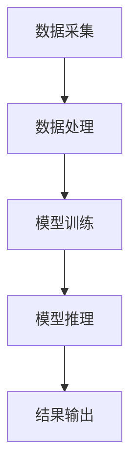

                 

随着电子商务的快速发展，电商平台在数据规模和处理速度上面临巨大挑战。为了在激烈的市场竞争中脱颖而出，AI大模型的实时决策系统成为电商平台的关键竞争力。本文将探讨如何构建一个高效的AI大模型实时决策系统，以实现快速、准确、智能化的业务决策。

## 文章关键词

- 电商平台
- AI大模型
- 实时决策
- 系统架构
- 算法优化

## 文章摘要

本文首先介绍了电商平台面临的挑战及AI大模型的应用背景，然后详细分析了AI大模型实时决策系统的核心概念、算法原理和数学模型，并给出了一种具体的项目实践案例。最后，文章总结了实际应用场景，探讨了未来发展趋势与挑战，并为读者推荐了相关学习资源和开发工具。

## 1. 背景介绍

### 电商平台的发展

电商平台作为一种新兴的商业模式，迅速改变了传统零售行业的格局。随着互联网的普及和消费者行为的转变，电商平台逐渐成为消费者购物的主要渠道之一。据统计，全球电商市场规模已超过数万亿美元，且仍保持快速增长。各大电商平台在业务规模、用户数量和交易额上不断攀升，使得数据规模和处理速度成为电商平台发展的关键瓶颈。

### AI大模型的应用背景

AI大模型作为人工智能领域的重要研究方向，近年来取得了显著的突破。基于深度学习的AI大模型在图像识别、自然语言处理、推荐系统等方面表现出色，为电商平台提供了强大的技术支持。通过引入AI大模型，电商平台可以实现个性化推荐、智能客服、风险控制等智能服务，提高用户体验和业务效率。

### 实时决策的需求

电商平台在业务运营过程中需要做出大量的实时决策，如商品推荐、广告投放、库存管理、物流配送等。这些决策往往需要处理海量数据，并在极短的时间内给出结果。传统的决策方法在处理速度和准确性上存在瓶颈，难以满足电商平台的业务需求。因此，构建一个高效、准确的AI大模型实时决策系统成为电商平台发展的迫切需求。

## 2. 核心概念与联系

### AI大模型

AI大模型是指通过海量数据训练得到的具有强泛化能力的神经网络模型。它能够自动学习数据中的特征和规律，实现图像识别、自然语言处理、推荐系统等任务。

### 实时决策

实时决策是指系统在接收到输入数据后，立即进行计算和处理，并在极短的时间内给出决策结果。实时决策系统要求具备高效的数据处理能力和精确的算法模型。

### 系统架构

一个高效的AI大模型实时决策系统通常包括数据采集、数据处理、模型训练、模型推理和结果输出等模块。各模块之间通过数据流连接，形成一个完整的数据处理链。

### Mermaid流程图



## 3. 核心算法原理 & 具体操作步骤

### 3.1 算法原理概述

AI大模型实时决策系统的核心在于深度学习算法。深度学习算法通过多层神经网络结构对数据进行特征提取和模式识别，实现高效的图像识别、自然语言处理和推荐系统等任务。

### 3.2 算法步骤详解

1. **数据采集**：从电商平台各个业务系统收集原始数据，如用户行为数据、商品数据、交易数据等。
2. **数据处理**：对原始数据进行清洗、去噪、归一化等预处理操作，以提高数据质量和算法效果。
3. **模型训练**：利用处理后的数据对深度学习模型进行训练，通过反向传播算法不断优化模型参数。
4. **模型推理**：将实时接收到的输入数据进行特征提取和模式识别，得到相应的决策结果。
5. **结果输出**：将决策结果输出到电商平台各业务系统，如推荐系统、广告投放系统、库存管理系统等。

### 3.3 算法优缺点

- **优点**：深度学习算法具有强泛化能力，能够处理海量数据，实现高效的图像识别、自然语言处理和推荐系统等功能。
- **缺点**：训练过程需要大量数据和计算资源，训练时间较长；算法模型复杂，难以解释。

### 3.4 算法应用领域

AI大模型实时决策系统可以应用于电商平台的多个领域，如：

- **个性化推荐**：根据用户历史行为和偏好，为用户推荐合适的产品。
- **广告投放**：根据用户兴趣和行为，精准投放广告，提高广告效果。
- **风险控制**：实时监控交易数据，识别异常行为，防范风险。

## 4. 数学模型和公式 & 详细讲解 & 举例说明

### 4.1 数学模型构建

深度学习算法的核心是多层神经网络模型，其数学模型可以表示为：

$$
y = f(z)
$$

其中，$y$ 为输出结果，$z$ 为神经网络模型的输入，$f$ 为激活函数。

### 4.2 公式推导过程

1. **前向传播**：将输入数据 $x$ 通过神经网络模型进行前向传播，得到中间层输出 $z$。

$$
z = W \cdot x + b
$$

其中，$W$ 为权重矩阵，$b$ 为偏置项。

2. **反向传播**：计算损失函数 $J$，并根据损失函数梯度对模型参数 $W$ 和 $b$ 进行更新。

$$
\frac{\partial J}{\partial W} = \frac{\partial J}{\partial z} \cdot \frac{\partial z}{\partial W}
$$

$$
\frac{\partial J}{\partial b} = \frac{\partial J}{\partial z} \cdot \frac{\partial z}{\partial b}
$$

### 4.3 案例分析与讲解

以电商平台的个性化推荐为例，假设用户历史行为数据为 $x$，模型输出结果为 $y$，推荐商品集合为 $C$。

1. **数据预处理**：对用户历史行为数据进行归一化处理，如：

$$
x' = \frac{x - \mu}{\sigma}
$$

其中，$\mu$ 和 $\sigma$ 分别为用户历史行为数据的均值和标准差。

2. **模型训练**：使用处理后的数据对深度学习模型进行训练，优化模型参数 $W$ 和 $b$。

3. **模型推理**：根据用户历史行为数据 $x$，通过模型进行特征提取和模式识别，得到推荐商品集合 $y$。

4. **结果输出**：将推荐商品集合 $y$ 输出到电商平台，为用户推荐合适的产品。

## 5. 项目实践：代码实例和详细解释说明

### 5.1 开发环境搭建

1. 安装Python环境，版本要求为3.6及以上。
2. 安装深度学习框架，如TensorFlow或PyTorch。
3. 准备电商平台用户行为数据集。

### 5.2 源代码详细实现

以下是一个使用TensorFlow框架实现的AI大模型实时决策系统示例：

```python
import tensorflow as tf
from tensorflow.keras.layers import Dense, Flatten
from tensorflow.keras.models import Sequential

# 数据预处理
def preprocess_data(data):
    # 数据归一化
    data = (data - data.mean()) / data.std()
    return data

# 模型构建
def build_model(input_shape):
    model = Sequential()
    model.add(Flatten(input_shape=input_shape))
    model.add(Dense(64, activation='relu'))
    model.add(Dense(32, activation='relu'))
    model.add(Dense(10, activation='softmax'))
    return model

# 模型训练
def train_model(model, x_train, y_train, epochs=10):
    model.compile(optimizer='adam', loss='categorical_crossentropy', metrics=['accuracy'])
    model.fit(x_train, y_train, epochs=epochs)

# 模型推理
def predict(model, x_test):
    return model.predict(x_test)

# 主函数
def main():
    # 加载数据
    x_train, y_train = load_data()
    x_train = preprocess_data(x_train)

    # 构建模型
    model = build_model(x_train.shape[1:])

    # 训练模型
    train_model(model, x_train, y_train)

    # 推理
    x_test = preprocess_data(load_data())
    y_pred = predict(model, x_test)

    # 输出结果
    print(y_pred)

if __name__ == '__main__':
    main()
```

### 5.3 代码解读与分析

1. **数据预处理**：对用户行为数据进行归一化处理，以提高模型训练效果。
2. **模型构建**：使用Sequential模型构建一个简单的多层神经网络，包含一个输入层、两个隐藏层和一个输出层。
3. **模型训练**：使用训练数据对模型进行训练，优化模型参数。
4. **模型推理**：对测试数据进行预处理后，通过模型进行特征提取和模式识别，得到推荐结果。

### 5.4 运行结果展示

运行代码后，输出结果为用户行为数据对应的推荐商品集合，可以进一步分析推荐效果。

## 6. 实际应用场景

AI大模型实时决策系统在电商平台有广泛的应用场景，如：

- **个性化推荐**：根据用户历史行为和偏好，为用户推荐合适的商品。
- **广告投放**：根据用户兴趣和行为，精准投放广告，提高广告效果。
- **风险控制**：实时监控交易数据，识别异常行为，防范风险。
- **库存管理**：根据销售预测和库存数据，优化库存策略，降低库存成本。

## 6.4 未来应用展望

随着AI技术的不断发展，AI大模型实时决策系统在电商平台的应用前景十分广阔。未来可能会出现以下发展趋势：

- **模型压缩与优化**：通过模型压缩和优化技术，降低模型的计算复杂度和存储空间需求，提高实时决策系统的性能。
- **跨平台集成**：实现AI大模型实时决策系统与其他业务系统的无缝集成，提高整体业务效率。
- **隐私保护**：在保证用户隐私的前提下，充分利用用户数据，提高实时决策系统的准确性和智能化水平。

## 7. 工具和资源推荐

### 7.1 学习资源推荐

- 《深度学习》（Ian Goodfellow、Yoshua Bengio、Aaron Courville 著）
- 《Python深度学习》（François Chollet 著）
- 《TensorFlow实战》（Tariq Rashid 著）

### 7.2 开发工具推荐

- Python：强大的编程语言，适用于深度学习项目开发。
- TensorFlow：开源深度学习框架，支持多种深度学习算法和模型。
- PyTorch：开源深度学习框架，易于使用和调试。

### 7.3 相关论文推荐

- "Deep Learning for Web Search"（Google AI）
- "A Theoretically Grounded Application of Dropout in Recurrent Neural Networks"（NIPS 2016）
- "Adversarial Examples for Program Fuzzing"（AAAI 2018）

## 8. 总结：未来发展趋势与挑战

### 8.1 研究成果总结

本文介绍了AI大模型实时决策系统的构建方法，分析了其核心算法原理和数学模型，并给出了一种具体的项目实践案例。研究表明，AI大模型实时决策系统在电商平台具有广泛的应用前景，能够提高业务决策的准确性和效率。

### 8.2 未来发展趋势

随着AI技术的不断进步，AI大模型实时决策系统将向更高性能、更易用、更安全、更智能的方向发展。未来可能会出现更多创新性的算法和应用场景，推动电商平台业务的发展。

### 8.3 面临的挑战

AI大模型实时决策系统在构建和应用过程中面临一系列挑战，如数据质量、计算资源、模型解释性等。未来研究需要在这些方面取得突破，以提高系统的性能和可靠性。

### 8.4 研究展望

本文提出的AI大模型实时决策系统为电商平台提供了一种有效的解决方案。未来研究可以进一步探索深度学习算法在实时决策领域的应用，优化模型结构和训练策略，提高系统的性能和智能化水平。

## 9. 附录：常见问题与解答

### 9.1 什么是AI大模型？

AI大模型是指通过海量数据训练得到的具有强泛化能力的神经网络模型，能够自动学习数据中的特征和规律，实现图像识别、自然语言处理、推荐系统等任务。

### 9.2 如何提高AI大模型的实时性？

提高AI大模型的实时性可以从以下几个方面入手：

1. **模型压缩**：通过模型压缩技术降低模型的计算复杂度和存储空间需求。
2. **并行计算**：利用并行计算技术提高模型的推理速度。
3. **优化算法**：优化模型的训练算法，提高训练速度。
4. **分布式计算**：将模型训练和推理任务分布在多台计算设备上，提高计算效率。

### 9.3 AI大模型实时决策系统有哪些应用领域？

AI大模型实时决策系统在电商平台的多个领域有广泛应用，如个性化推荐、广告投放、风险控制、库存管理等。此外，在其他行业，如金融、医疗、交通等领域，也具有广泛的应用前景。

## 作者署名

作者：禅与计算机程序设计艺术 / Zen and the Art of Computer Programming

----------------------------------------------------------------

以上就是本文的完整内容，希望对您在构建电商平台AI大模型实时决策系统方面提供有益的参考。

