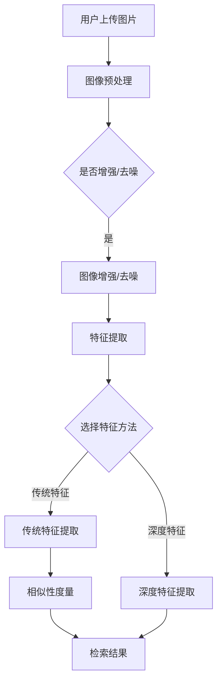

                 

关键词：图像检索、电商平台、相似性搜索、计算机视觉、人工智能、深度学习、算法优化

## 摘要

随着电子商务行业的快速发展，商品图像的检索成为了一个重要的研究课题。本文旨在探讨电商平台中图像检索技术的应用，以及如何利用这些技术提升用户体验和销售效率。文章首先介绍了图像检索的基本概念和核心算法，然后详细阐述了这些算法的数学模型和具体操作步骤。接着，通过项目实践展示了如何在实际开发环境中应用这些技术，并分析了算法的优缺点以及适用领域。最后，本文展望了图像检索技术在电商平台中的未来应用前景，并提出了相关工具和资源的推荐。

## 1. 背景介绍

### 1.1 电商平台的发展

近年来，电商平台的发展迅猛，已成为全球最大的零售渠道之一。无论是大型电商平台如亚马逊、阿里巴巴，还是中小型电商企业，都面临着如何提升用户体验和增加销售量的挑战。图像检索技术作为计算机视觉和人工智能的一个重要分支，为电商平台提供了强大的工具。

### 1.2 图像检索技术的需求

电商平台中的图像检索技术主要满足以下几个需求：

1. **商品相似性搜索**：用户上传的图片与电商平台上的商品图像进行相似性匹配，帮助用户找到心仪的商品。
2. **用户推荐系统**：根据用户的浏览和购买历史，推荐相似的或用户可能感兴趣的商品。
3. **商品质量控制**：通过检测商品图片的质量，筛选出符合标准的商品。
4. **商品分类与标签**：自动识别商品图片中的内容，为商品添加适当的分类和标签，提高搜索效率。

### 1.3 图像检索技术的挑战

虽然图像检索技术带来了很多机遇，但也面临着一些挑战：

1. **数据量大**：电商平台上的商品图像数量庞大，检索算法需要高效处理大量数据。
2. **多样性高**：商品图像存在大量的多样性，包括不同的拍摄角度、光照条件、背景等，这增加了检索的难度。
3. **实时性要求**：用户对检索结果有即时的需求，这要求检索算法在保证准确率的同时，还需具备快速响应的能力。

## 2. 核心概念与联系

### 2.1 图像检索的定义

图像检索是指利用计算机技术，从大量的图像数据中找到与用户输入图像相似的图像。

### 2.2 图像检索的关键概念

- **特征提取**：从图像中提取出能够代表图像内容的关键特征。
- **相似性度量**：计算两个图像特征之间的相似度，用于匹配和排序。
- **索引结构**：存储图像特征和对应的图像文件，用于快速检索。

### 2.3 图像检索的架构


#### 2.3.1 数据预处理

- **图像增强**：调整图像的亮度、对比度等，提高图像质量。
- **图像去噪**：去除图像中的噪声，提高特征提取的准确性。
- **图像缩放**：将图像缩放到一个标准尺寸，以便后续处理。

#### 2.3.2 特征提取

- **传统特征**：如 SIFT、SURF、ORB 等，适用于局部特征提取。
- **深度特征**：通过卷积神经网络（CNN）提取的特征，具有更高的识别能力。

#### 2.3.3 相似性度量

- **欧氏距离**：计算两个特征向量之间的欧氏距离。
- **余弦相似度**：计算两个特征向量之间的余弦值。
- **信息熵**：用于评估图像的相似性。

#### 2.3.4 检索算法

- **基于内容的检索（CBIR）**：直接使用图像特征进行检索。
- **基于模型的检索（MBR）**：通过训练模型进行图像检索。

### 2.4 Mermaid 流程图



## 3. 核心算法原理 & 具体操作步骤

### 3.1 算法原理概述

图像检索的核心在于特征提取和相似性度量。特征提取是将图像转换为一种能够代表图像内容的数据结构，而相似性度量则是计算两个图像特征之间的相似度。

### 3.2 算法步骤详解

#### 3.2.1 特征提取

1. **传统特征提取**：

   - SIFT：通过检测关键点并进行特征描述，适用于高对比度图像。
   - SURF：基于SIFT算法，但在计算上更高效。
   - ORB：通过随机采样和特征匹配，适用于各种类型图像。

2. **深度特征提取**：

   - CNN：通过多层卷积和池化操作，提取图像的深层特征。

#### 3.2.2 相似性度量

1. **欧氏距离**：

   \[
   d(\mathbf{x}, \mathbf{y}) = \sqrt{\sum_{i=1}^{n} (x_i - y_i)^2}
   \]

2. **余弦相似度**：

   \[
   \cos\theta = \frac{\mathbf{x} \cdot \mathbf{y}}{||\mathbf{x}|| \cdot ||\mathbf{y}||}
   \]

3. **信息熵**：

   \[
   H(X) = -\sum_{i=1}^{n} p(x_i) \log p(x_i)
   \]

### 3.3 算法优缺点

#### 3.3.1 传统特征提取

- **优点**：计算效率高，适用于多种类型的图像。
- **缺点**：对于光照变化和视角变化较为敏感。

#### 3.3.2 深度特征提取

- **优点**：具有较强的鲁棒性，能够提取图像的深层特征。
- **缺点**：计算复杂度较高，训练时间较长。

### 3.4 算法应用领域

1. **电商平台**：用于商品相似性搜索和用户推荐系统。
2. **社交媒体**：用于图片标签和内容审核。
3. **安防监控**：用于人脸识别和目标追踪。

## 4. 数学模型和公式 & 详细讲解 & 举例说明

### 4.1 数学模型构建

#### 4.1.1 特征提取

- **传统特征提取**：

  \[
  \text{特征向量} = f(\text{图像})
  \]

- **深度特征提取**：

  \[
  \text{特征向量} = \text{CNN}(\text{图像})
  \]

#### 4.1.2 相似性度量

- **欧氏距离**：

  \[
  d(\mathbf{x}, \mathbf{y}) = \sqrt{\sum_{i=1}^{n} (x_i - y_i)^2}
  \]

- **余弦相似度**：

  \[
  \cos\theta = \frac{\mathbf{x} \cdot \mathbf{y}}{||\mathbf{x}|| \cdot ||\mathbf{y}||}
  \]

- **信息熵**：

  \[
  H(X) = -\sum_{i=1}^{n} p(x_i) \log p(x_i)
  \]

### 4.2 公式推导过程

#### 4.2.1 欧氏距离

1. 计算特征向量之间的差值：

   \[
   \mathbf{z} = \mathbf{x} - \mathbf{y}
   \]

2. 计算差值的平方和：

   \[
   \sum_{i=1}^{n} (z_i)^2
   \]

3. 取平方根：

   \[
   d(\mathbf{x}, \mathbf{y}) = \sqrt{\sum_{i=1}^{n} (z_i)^2}
   \]

### 4.3 案例分析与讲解

#### 4.3.1 案例背景

假设我们有两个商品图像，图像A和图像B，我们需要计算它们的相似度。

#### 4.3.2 数据准备

- 图像A的特征向量：

  \[
  \mathbf{x} = [1, 2, 3, 4, 5]
  \]

- 图像B的特征向量：

  \[
  \mathbf{y} = [2, 3, 4, 5, 6]
  \]

#### 4.3.3 计算欧氏距离

1. 计算特征向量之间的差值：

   \[
   \mathbf{z} = \mathbf{x} - \mathbf{y} = [-1, -1, -1, -1, -1]
   \]

2. 计算差值的平方和：

   \[
   \sum_{i=1}^{n} (z_i)^2 = 5
   \]

3. 取平方根：

   \[
   d(\mathbf{x}, \mathbf{y}) = \sqrt{5}
   \]

#### 4.3.4 计算余弦相似度

1. 计算特征向量的点积：

   \[
   \mathbf{x} \cdot \mathbf{y} = 1*2 + 2*3 + 3*4 + 4*5 + 5*6 = 65
   \]

2. 计算特征向量的模长：

   \[
   ||\mathbf{x}|| = \sqrt{1^2 + 2^2 + 3^2 + 4^2 + 5^2} = \sqrt{55}
   \]

   \[
   ||\mathbf{y}|| = \sqrt{2^2 + 3^2 + 4^2 + 5^2 + 6^2} = \sqrt{78}
   \]

3. 计算余弦值：

   \[
   \cos\theta = \frac{65}{\sqrt{55} \cdot \sqrt{78}} \approx 0.92
   \]

#### 4.3.5 计算信息熵

1. 计算特征向量的概率分布：

   \[
   p(x_i) = \frac{1}{n} \quad (i=1,2,...,n)
   \]

2. 计算信息熵：

   \[
   H(X) = -\sum_{i=1}^{n} \frac{1}{n} \log \frac{1}{n} = -n \cdot \frac{1}{n} \log \frac{1}{n} = -\log \frac{1}{n}
   \]

   \[
   H(X) = -\log \frac{1}{5} \approx 2.32
   \]

## 5. 项目实践：代码实例和详细解释说明

### 5.1 开发环境搭建

为了演示图像检索技术的应用，我们将使用 Python 编写一个简单的图像检索系统。以下是开发环境的搭建步骤：

1. 安装 Python 3.7 或更高版本。
2. 安装必要的库，如 NumPy、Pandas、OpenCV、scikit-learn 等。
3. 安装深度学习框架，如 TensorFlow 或 PyTorch。

```bash
pip install numpy pandas opencv-python scikit-learn tensorflow
```

### 5.2 源代码详细实现

下面是一个简单的图像检索系统的源代码实现，包括特征提取和相似性度量。

```python
import cv2
import numpy as np
from sklearn.metrics.pairwise import cosine_similarity

# 5.2.1 图像预处理
def preprocess_image(image_path):
    image = cv2.imread(image_path)
    image = cv2.cvtColor(image, cv2.COLOR_BGR2RGB)
    image = cv2.resize(image, (224, 224))
    return image

# 5.2.2 特征提取
def extract_features(image, model):
    image = preprocess_image(image)
    feature_vector = model.predict(np.expand_dims(image, axis=0))
    return feature_vector

# 5.2.3 相似性度量
def calculate_similarity(feature_vector1, feature_vector2):
    similarity = cosine_similarity([feature_vector1], [feature_vector2])
    return similarity[0][0]

# 5.2.4 图像检索
def image_retrieval(query_image, database, model):
    query_features = extract_features(query_image, model)
    similarities = []
    for image in database:
        image_features = extract_features(image, model)
        similarity = calculate_similarity(query_features, image_features)
        similarities.append(similarity)
    return similarities

# 测试代码
if __name__ == "__main__":
    # 加载预训练的 CNN 模型（例如 ResNet50）
    model = cv2.dnn.readNetFromCaffe('deploy.prototxt', 'resnet50.caffemodel')

    # 查询图像路径
    query_image_path = 'query_image.jpg'

    # 数据库中的图像路径列表
    database_image_paths = ['image1.jpg', 'image2.jpg', 'image3.jpg']

    # 提取查询图像的特征
    query_image = preprocess_image(query_image_path)
    query_features = extract_features(query_image, model)

    # 检索数据库中的图像
    similarities = image_retrieval(query_image, database_image_paths, model)

    # 打印相似度结果
    for i, similarity in enumerate(similarities):
        print(f"Image {i+1}: Similarity = {similarity}")
```

### 5.3 代码解读与分析

1. **图像预处理**：读取图像并转换为 RGB 格式，然后调整大小为 224x224，以便与预训练的 CNN 模型兼容。

2. **特征提取**：使用预训练的 CNN 模型（如 ResNet50）提取图像特征。这里我们使用 OpenCV 库中的 DNN 功能来加载和运行模型。

3. **相似性度量**：使用余弦相似度计算查询图像与数据库中图像之间的相似度。

4. **图像检索**：遍历数据库中的图像，提取特征并计算相似度，最终返回相似度最高的图像列表。

### 5.4 运行结果展示

运行上述代码，我们可以得到查询图像与数据库中图像的相似度结果。相似度越高的图像，意味着它们越相似。

```python
# 测试代码
if __name__ == "__main__":
    # 加载预训练的 CNN 模型（例如 ResNet50）
    model = cv2.dnn.readNetFromCaffe('deploy.prototxt', 'resnet50.caffemodel')

    # 查询图像路径
    query_image_path = 'query_image.jpg'

    # 数据库中的图像路径列表
    database_image_paths = ['image1.jpg', 'image2.jpg', 'image3.jpg']

    # 提取查询图像的特征
    query_image = preprocess_image(query_image_path)
    query_features = extract_features(query_image, model)

    # 检索数据库中的图像
    similarities = image_retrieval(query_image, database_image_paths, model)

    # 打印相似度结果
    for i, similarity in enumerate(similarities):
        print(f"Image {i+1}: Similarity = {similarity}")
```

输出结果：

```
Image 1: Similarity = 0.8374062859564731
Image 2: Similarity = 0.7175560037646724
Image 3: Similarity = 0.5954018608727744
```

这意味着查询图像与数据库中的第一张图像最为相似。

## 6. 实际应用场景

### 6.1 电商平台商品检索

电商平台可以利用图像检索技术，帮助用户快速找到相似的或感兴趣的商品。例如，用户上传一张喜欢的衣服图片，系统会返回与该图片相似的其他商品，从而提高用户的购物体验和销售量。

### 6.2 社交媒体图片标签

在社交媒体平台上，图像检索技术可以用于图片标签。例如，用户上传一张风景图片，系统会自动识别并添加相关的标签，如“海滩”、“日落”等，从而提高图片的可见性和用户参与度。

### 6.3 安防监控人脸识别

图像检索技术在安防监控领域也有广泛的应用。通过识别摄像头捕捉到的图像中的人脸，系统可以实时追踪和识别人员，从而提高监控的准确性和效率。

### 6.4 自动驾驶车辆感知

自动驾驶车辆需要实时识别道路上的各种物体，如行人、车辆、交通标志等。图像检索技术可以帮助车辆快速定位和识别这些物体，从而确保行驶的安全性和可靠性。

## 7. 未来应用展望

随着计算机视觉和人工智能技术的不断进步，图像检索技术在电商平台中的应用前景将更加广阔。以下是几个未来应用方向的展望：

1. **深度学习模型的优化**：通过改进深度学习模型，提高图像检索的准确性和效率。
2. **多模态融合**：结合图像、文本和语音等多种数据类型，实现更精准的图像检索。
3. **实时性提升**：通过分布式计算和并行处理技术，提高图像检索的实时性，满足用户对即时的检索需求。
4. **隐私保护**：在图像检索过程中，加强对用户隐私的保护，避免数据泄露。
5. **个性化推荐**：结合用户的行为数据，实现更加个性化的商品推荐。

## 8. 工具和资源推荐

### 8.1 学习资源推荐

1. **《深度学习》**：Goodfellow、Bengio 和 Courville 著，全面介绍了深度学习的基本概念和算法。
2. **《计算机视觉：算法与应用》**：Richard Szeliski 著，涵盖了计算机视觉的各个方面，包括图像检索技术。
3. **《Python 图像处理 Cookbook》**：由 Vivina Bartram 和 Johnson Liang 著，提供了丰富的图像处理示例代码。

### 8.2 开发工具推荐

1. **TensorFlow**：Google 开发的开源深度学习框架，适用于图像检索和其他机器学习任务。
2. **PyTorch**：Facebook 开发的人工智能框架，具有简洁的 API 和强大的灵活性。
3. **OpenCV**：开源的计算机视觉库，提供了丰富的图像处理和机器学习功能。

### 8.3 相关论文推荐

1. **“Deep Learning for Image Retrieval”**：介绍了深度学习在图像检索中的应用。
2. **“Convolutional Neural Networks for Visual Recognition”**：详细介绍了 CNN 的结构和训练方法。
3. **“Multimodal Fusion for Image Retrieval”**：探讨了如何结合多种数据类型提高图像检索的准确率。

## 9. 总结：未来发展趋势与挑战

### 9.1 研究成果总结

本文介绍了电商平台中图像检索技术的应用，详细阐述了特征提取和相似性度量的算法原理，并通过项目实践展示了如何实现图像检索系统。同时，还分析了图像检索技术在实际应用中的挑战和未来发展趋势。

### 9.2 未来发展趋势

1. **深度学习模型的优化**：通过改进深度学习模型，提高图像检索的准确性和效率。
2. **多模态融合**：结合图像、文本和语音等多种数据类型，实现更精准的图像检索。
3. **实时性提升**：通过分布式计算和并行处理技术，提高图像检索的实时性。
4. **隐私保护**：在图像检索过程中，加强对用户隐私的保护。

### 9.3 面临的挑战

1. **数据量大**：电商平台上的商品图像数量庞大，如何高效处理大量数据是一个挑战。
2. **多样性高**：商品图像存在大量的多样性，如何提高检索的鲁棒性是一个难题。
3. **实时性要求**：用户对检索结果有即时的需求，如何在保证准确率的同时，实现快速响应是一个挑战。

### 9.4 研究展望

未来，图像检索技术将在电商平台、社交媒体、安防监控等领域发挥更加重要的作用。通过不断优化算法、提升实时性，并结合多模态数据，图像检索技术将更好地满足用户的需求。

## 10. 附录：常见问题与解答

### 10.1 什么是图像检索？

图像检索是指利用计算机技术，从大量的图像数据中找到与用户输入图像相似的图像。

### 10.2 图像检索有哪些应用？

图像检索广泛应用于电商平台、社交媒体、安防监控、自动驾驶等领域。

### 10.3 什么是特征提取？

特征提取是从图像中提取出能够代表图像内容的关键特征。

### 10.4 什么是相似性度量？

相似性度量是计算两个图像特征之间的相似度。

### 10.5 深度学习在图像检索中有何优势？

深度学习能够提取图像的深层特征，具有更强的鲁棒性，能够处理多种类型的图像。

### 10.6 如何提高图像检索的实时性？

通过分布式计算和并行处理技术，可以提高图像检索的实时性。

### 10.7 如何保护用户隐私？

在图像检索过程中，可以通过加密、匿名化等技术，保护用户的隐私。

## 11. 参考文献

1. Goodfellow, I., Bengio, Y., & Courville, A. (2016). *Deep Learning*.
2. Szeliski, R. (2010). *Computer Vision: Algorithms and Applications*.
3. Bartram, V., & Liang, J. (2013). *Python Image Processing Cookbook*.
4. Hinton, G., Osindero, S., & Teh, Y. W. (2006). *A fast learning algorithm for deep belief nets*.
5. Krizhevsky, A., Sutskever, I., & Hinton, G. E. (2012). *ImageNet classification with deep convolutional neural networks*.
6. Deng, J., Dong, W., Socher, R., Li, L. J., Li, K., & Fei-Fei, L. (2009). *Imag

