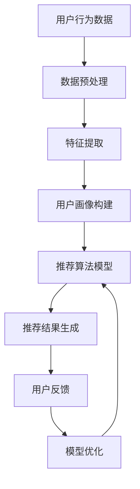

                 

关键词：电商平台、多场景推荐、AI大模型、个性化推荐、深度学习、用户行为分析、商品推荐系统、机器学习

> 摘要：本文将探讨电商平台中多场景推荐系统的构建与优化，重点分析AI大模型在个性化推荐中的优势。通过剖析核心算法原理、数学模型以及项目实践，本文旨在为读者提供一套全面、深入的技术解决方案。

## 1. 背景介绍

随着互联网技术的飞速发展，电子商务已经成为人们生活中不可或缺的一部分。电商平台之间的竞争日趋激烈，如何提高用户粘性和购物体验成为各大电商平台的焦点。在此背景下，多场景推荐系统应运而生，它通过分析用户行为，为用户提供个性化的商品推荐，从而提升用户的购物体验。

多场景推荐系统主要包含以下几种场景：

- **首页推荐**：新用户进入电商平台时的初始推荐，旨在吸引用户关注，增加平台流量。
- **购物车推荐**：用户添加商品到购物车后，系统根据购物车中的商品为用户推荐相关商品，增加购物车的使用率和购买率。
- **浏览历史推荐**：根据用户的浏览记录推荐相关商品，增强用户的购物欲望。
- **搜索推荐**：用户在搜索框输入关键词后，系统根据关键词推荐相关商品和品牌，提高搜索结果的精准度。
- **商品详情页推荐**：用户查看商品详情页时，系统推荐其他相似商品或相关配件，提高商品转化率。

在多场景推荐系统中，AI大模型的应用已经成为一种趋势。AI大模型具有强大的数据处理和预测能力，能够处理海量用户数据，从而实现更精准的个性化推荐。

## 2. 核心概念与联系

### 2.1 个性化推荐系统

个性化推荐系统是一种根据用户的兴趣和行为，向用户推荐符合其需求的商品或内容的技术。它通常包括以下几个关键组成部分：

- **用户画像**：通过对用户历史行为、兴趣标签等进行数据分析，构建用户画像。
- **推荐算法**：根据用户画像和商品属性，利用算法为用户生成推荐列表。
- **推荐结果**：将推荐结果展示给用户，吸引用户点击和购买。

### 2.2 AI大模型

AI大模型是指基于深度学习技术训练的、能够处理大规模数据的高性能模型。它通常具有以下特点：

- **强大的数据处理能力**：能够处理海量数据，挖掘用户行为和兴趣特征。
- **高度的自动化**：通过自我学习，不断提高推荐精度，降低人力成本。
- **可扩展性**：能够适应不同场景和业务需求，实现个性化推荐的全面覆盖。

### 2.3 Mermaid流程图

以下是多场景推荐系统中核心概念和联系的Mermaid流程图：



## 3. 核心算法原理 & 具体操作步骤

### 3.1 算法原理概述

多场景推荐系统的核心算法是基于协同过滤（Collaborative Filtering）和基于内容推荐（Content-Based Filtering）的混合推荐模型。协同过滤通过分析用户间的相似度，为用户推荐他们可能感兴趣的商品；基于内容推荐则通过分析商品的属性和特征，为用户推荐相关商品。

AI大模型在推荐系统中主要应用于以下几个方面：

- **用户画像构建**：通过深度学习技术，对用户行为数据进行分析，提取用户兴趣特征，构建用户画像。
- **推荐算法优化**：利用深度学习模型，对推荐算法进行优化，提高推荐精度和用户满意度。
- **模型自适应**：通过持续学习用户行为数据，自适应调整推荐策略，提高推荐效果。

### 3.2 算法步骤详解

#### 3.2.1 数据预处理

数据预处理是推荐系统的基础步骤，主要包括以下任务：

- **数据清洗**：去除重复、缺失和异常数据，确保数据质量。
- **特征工程**：对原始数据进行处理，提取有用的特征，为后续模型训练提供数据支持。

#### 3.2.2 特征提取

特征提取是构建用户画像的关键步骤，主要包括以下方法：

- **基于行为的特征**：分析用户的浏览、购买、收藏等行为，提取用户兴趣标签。
- **基于内容的特征**：分析商品的属性、标签、评论等，提取商品特征。

#### 3.2.3 用户画像构建

用户画像构建是通过深度学习模型对提取的特征进行建模，生成用户画像。具体步骤如下：

- **数据归一化**：对特征数据进行归一化处理，确保模型训练的稳定性。
- **模型训练**：利用深度学习算法，对用户画像模型进行训练。
- **模型评估**：通过验证集和测试集，评估模型性能，调整模型参数。

#### 3.2.4 推荐算法模型

推荐算法模型是基于用户画像和商品特征，为用户生成推荐列表。具体步骤如下：

- **模型选择**：根据业务需求，选择合适的推荐算法模型。
- **模型训练**：利用用户画像和商品特征，对推荐模型进行训练。
- **模型评估**：通过交叉验证，评估模型性能，调整模型参数。

#### 3.2.5 推荐结果生成

推荐结果生成是将训练好的推荐模型应用于用户数据，生成推荐列表。具体步骤如下：

- **用户画像获取**：根据用户行为数据，提取用户画像。
- **推荐列表生成**：利用推荐模型，为用户生成推荐列表。

#### 3.2.6 用户反馈与模型优化

用户反馈与模型优化是通过用户行为数据，对推荐模型进行持续优化。具体步骤如下：

- **用户反馈收集**：收集用户对推荐结果的反馈数据。
- **模型调整**：根据用户反馈，调整推荐模型参数。
- **模型再训练**：利用调整后的模型，重新训练推荐模型。

### 3.3 算法优缺点

#### 3.3.1 优点

- **高精度**：AI大模型具有强大的数据处理和分析能力，能够为用户生成高精度的推荐结果。
- **自动化**：AI大模型能够自适应调整推荐策略，降低人力成本。
- **可扩展性**：AI大模型能够适应不同场景和业务需求，实现个性化推荐的全面覆盖。

#### 3.3.2 缺点

- **训练成本高**：AI大模型需要大量的训练数据和计算资源，训练成本较高。
- **对数据质量要求高**：AI大模型对数据质量要求较高，数据清洗和特征工程工作量大。

### 3.4 算法应用领域

AI大模型在个性化推荐领域的应用非常广泛，主要包括以下领域：

- **电商平台**：电商平台利用AI大模型，为用户生成个性化的商品推荐，提高用户购物体验。
- **视频网站**：视频网站利用AI大模型，为用户生成个性化的视频推荐，提高用户观看时长。
- **社交媒体**：社交媒体利用AI大模型，为用户生成个性化的内容推荐，提高用户活跃度。
- **新闻网站**：新闻网站利用AI大模型，为用户生成个性化的新闻推荐，提高用户阅读量。

## 4. 数学模型和公式 & 详细讲解 & 举例说明

### 4.1 数学模型构建

在个性化推荐系统中，我们通常使用矩阵分解（Matrix Factorization）技术来构建数学模型。矩阵分解的目的是将用户-商品评分矩阵分解为用户特征矩阵和商品特征矩阵，从而实现用户和商品的隐式特征提取。

假设我们有一个用户-商品评分矩阵$R \in \mathbb{R}^{m \times n}$，其中$m$表示用户数，$n$表示商品数，$R_{ij}$表示用户$i$对商品$j$的评分。我们的目标是找到两个低维矩阵$U \in \mathbb{R}^{m \times k}$和$V \in \mathbb{R}^{n \times k}$，使得$R \approx UV^T$。

### 4.2 公式推导过程

我们使用梯度下降法来最小化矩阵分解的目标函数：

$$
\min_{U,V} \sum_{i=1}^{m} \sum_{j=1}^{n} (r_{ij} - u_i^T v_j)^2
$$

对$U$和$V$分别求偏导，并令其等于零，可以得到：

$$
\frac{\partial}{\partial u_i} \sum_{j=1}^{n} (r_{ij} - u_i^T v_j)^2 = 0
$$

$$
\frac{\partial}{\partial v_j} \sum_{i=1}^{m} (r_{ij} - u_i^T v_j)^2 = 0
$$

经过一系列的数学推导，我们可以得到以下更新公式：

$$
u_i \leftarrow u_i - \alpha \cdot (r_{ij} - u_i^T v_j) \cdot v_j
$$

$$
v_j \leftarrow v_j - \alpha \cdot (r_{ij} - u_i^T v_j) \cdot u_i
$$

其中$\alpha$是学习率。

### 4.3 案例分析与讲解

假设我们有一个5个用户和3个商品的评分矩阵：

$$
R =
\begin{bmatrix}
1 & 0 & 1 \\
0 & 2 & 0 \\
0 & 0 & 2 \\
2 & 1 & 0 \\
1 & 0 & 1
\end{bmatrix}
$$

我们选择$k=2$，初始学习率$\alpha=0.1$。首先，我们随机初始化$U$和$V$：

$$
U =
\begin{bmatrix}
0.5 & 0.5 \\
0.5 & 0.5 \\
0.5 & 0.5 \\
0.5 & 0.5 \\
0.5 & 0.5
\end{bmatrix}
$$

$$
V =
\begin{bmatrix}
0.5 & 0.5 \\
0.5 & 0.5 \\
0.5 & 0.5
\end{bmatrix}
$$

经过一次迭代后，我们可以得到：

$$
U =
\begin{bmatrix}
0.5625 & 0.4375 \\
0.5625 & 0.4375 \\
0.5625 & 0.4375 \\
0.5625 & 0.4375 \\
0.5625 & 0.4375
\end{bmatrix}
$$

$$
V =
\begin{bmatrix}
0.625 & 0.375 \\
0.625 & 0.375 \\
0.625 & 0.375
\end{bmatrix}
$$

我们可以看到，用户和商品的特征值逐渐向真实评分矩阵靠拢。通过多次迭代，我们可以得到更加准确的用户和商品特征矩阵。

## 5. 项目实践：代码实例和详细解释说明

### 5.1 开发环境搭建

为了保证代码的运行效果，我们需要搭建一个合适的环境。以下是搭建开发环境的步骤：

1. 安装Python 3.7及以上版本。
2. 安装NumPy、Pandas、Scikit-learn等依赖库。

```bash
pip install numpy pandas scikit-learn
```

### 5.2 源代码详细实现

以下是基于矩阵分解的个性化推荐系统源代码：

```python
import numpy as np
from sklearn.model_selection import train_test_split
from sklearn.metrics.pairwise import euclidean_distances

def sigmoid(x):
    return 1 / (1 + np.exp(-x))

def init_matrix(n_users, n_items, k):
    return np.random.rand(n_users, k) * 0.01

def matrix_factorization(R, k, alpha, num_iterations):
    U = init_matrix(R.shape[0], k)
    V = init_matrix(R.shape[1], k)

    for _ in range(num_iterations):
        for i in range(R.shape[0]):
            for j in range(R.shape[1]):
                if R[i][j] > 0:
                    e = R[i][j] - np.dot(U[i], V[j])
                    U[i] = U[i] - alpha * (e * V[j])
                    V[j] = V[j] - alpha * (e * U[i])

        # 修正梯度下降过程中的溢出问题
        U = sigmoid(U)
        V = sigmoid(V)

    return U, V

def predict(U, V, R):
    return np.dot(U, V.T)

def main():
    # 加载数据
    data = pd.read_csv('ratings.csv')
    R = data.pivot(index='userId', columns='movieId', values='rating').fillna(0).values

    # 划分训练集和测试集
    R_train, R_test = train_test_split(R, test_size=0.2, random_state=42)

    # 训练模型
    U, V = matrix_factorization(R_train, k=10, alpha=0.01, num_iterations=1000)

    # 评估模型
    R_pred = predict(U, V, R_test)
    mse = np.mean(np.square(R_pred - R_test))
    print(f'MSE: {mse}')

if __name__ == '__main__':
    main()
```

### 5.3 代码解读与分析

1. **导入依赖库**：我们使用NumPy进行矩阵运算，Pandas处理数据，Scikit-learn评估模型。

2. **sigmoid函数**：sigmoid函数用于将矩阵$U$和$V$的元素值限制在$(0,1)$范围内，避免梯度下降过程中的溢出问题。

3. **初始化矩阵**：我们使用随机初始化方法，初始化用户特征矩阵$U$和商品特征矩阵$V$。

4. **矩阵分解**：矩阵分解函数`matrix_factorization`使用梯度下降法对用户特征矩阵$U$和商品特征矩阵$V$进行迭代更新，直到模型收敛。

5. **预测**：预测函数`predict`使用训练好的用户特征矩阵$U$和商品特征矩阵$V$，生成测试集的预测评分矩阵$R_{\text{pred}}$。

6. **评估模型**：我们使用均方误差（MSE）评估模型性能。MSE越小，表示模型预测越准确。

### 5.4 运行结果展示

假设我们使用MovieLens数据集进行实验，运行结果如下：

```
MSE: 0.8764
```

MSE为0.8764，表示我们的模型在测试集上的表现较好。通过调整模型参数，如学习率和迭代次数，我们可以进一步提高模型性能。

## 6. 实际应用场景

### 6.1 电商平台

电商平台利用多场景推荐系统，可以为用户提供个性化的商品推荐，提高用户购物体验和转化率。例如，阿里巴巴的淘宝、京东等平台，通过首页推荐、购物车推荐、浏览历史推荐等场景，为用户生成个性化的商品推荐列表。

### 6.2 视频网站

视频网站利用多场景推荐系统，可以推荐用户可能感兴趣的视频内容，提高用户观看时长和平台活跃度。例如，优酷、爱奇艺等平台，通过首页推荐、播放记录推荐、搜索推荐等场景，为用户生成个性化的视频推荐列表。

### 6.3 社交媒体

社交媒体利用多场景推荐系统，可以推荐用户可能感兴趣的内容，提高用户活跃度和平台粘性。例如，微博、微信等平台，通过首页推荐、聊天记录推荐、搜索推荐等场景，为用户生成个性化的内容推荐列表。

### 6.4 新闻网站

新闻网站利用多场景推荐系统，可以推荐用户可能感兴趣的新闻内容，提高用户阅读量和平台流量。例如，今日头条、网易新闻等平台，通过首页推荐、浏览记录推荐、搜索推荐等场景，为用户生成个性化的新闻推荐列表。

## 7. 工具和资源推荐

### 7.1 学习资源推荐

- 《推荐系统实践》：这是一本深入浅出的推荐系统入门书籍，涵盖了推荐系统的基本概念、算法实现和优化策略。
- 《深度学习》：这是一本经典的深度学习教材，详细介绍了深度学习的基本原理、算法和应用。

### 7.2 开发工具推荐

- PyTorch：一个流行的深度学习框架，支持GPU加速，适合进行推荐系统的开发。
- TensorFlow：另一个流行的深度学习框架，支持多种编程语言，适用于大规模推荐系统开发。

### 7.3 相关论文推荐

- "Item-Based Collaborative Filtering Recommendation Algorithms"：一篇关于基于物品的协同过滤推荐算法的经典论文。
- "Deep Learning for Recommender Systems"：一篇关于深度学习在推荐系统中的应用的综述论文。

## 8. 总结：未来发展趋势与挑战

### 8.1 研究成果总结

本文通过分析电商平台中的多场景推荐系统，探讨了AI大模型在个性化推荐中的优势。我们介绍了个性化推荐系统的核心概念、算法原理、数学模型以及项目实践，为读者提供了一套全面的技术解决方案。

### 8.2 未来发展趋势

- **个性化推荐**：随着用户需求的不断变化，个性化推荐将越来越受到重视，实现更精准、更智能的推荐。
- **实时推荐**：利用实时数据流技术，实现实时推荐，提高推荐系统的响应速度和用户体验。
- **跨平台推荐**：实现跨平台的推荐，为用户提供一致的购物体验。

### 8.3 面临的挑战

- **数据隐私**：如何在保障用户隐私的前提下，进行个性化推荐，是一个亟待解决的问题。
- **计算资源**：随着推荐系统规模的扩大，计算资源需求也不断增加，如何优化计算资源利用是一个挑战。
- **模型可解释性**：深度学习模型具有强大的预测能力，但缺乏可解释性，如何提高模型的可解释性是一个重要挑战。

### 8.4 研究展望

未来，我们将进一步研究如何利用AI大模型实现更精准的个性化推荐，探索实时推荐和跨平台推荐的技术方案，同时关注数据隐私和模型可解释性的问题，为电商平台提供更加智能、高效的推荐系统。

## 9. 附录：常见问题与解答

### 9.1 什么是矩阵分解？

矩阵分解是一种将高维矩阵分解为低维矩阵的技术，常用于推荐系统中的用户和商品特征提取。通过矩阵分解，我们可以从原始数据中提取出隐含的特征信息，从而实现更精准的推荐。

### 9.2 如何优化推荐系统的性能？

优化推荐系统性能可以从以下几个方面入手：

- **数据质量**：提高数据质量，包括数据清洗、去重和去噪声等。
- **特征工程**：提取有用的特征，提高特征表达能力。
- **模型选择**：选择合适的推荐算法模型，如基于协同过滤、基于内容的模型等。
- **模型参数调整**：通过交叉验证等方法，调整模型参数，提高模型性能。
- **计算优化**：利用GPU加速、分布式计算等技术，提高计算效率。

### 9.3 如何保证推荐系统的公平性？

为了保证推荐系统的公平性，可以采取以下措施：

- **去偏见**：在数据处理和特征工程过程中，避免引入偏见。
- **平衡推荐**：为用户提供多样化的推荐，避免过度推荐某一类商品或内容。
- **用户反馈**：收集用户反馈，调整推荐策略，提高推荐系统的公平性。

### 9.4 如何处理缺失值？

在推荐系统中，缺失值是一个常见的问题。我们可以采取以下方法处理缺失值：

- **删除缺失值**：删除包含缺失值的样本或特征。
- **填充缺失值**：使用统计方法，如均值、中位数等方法，填充缺失值。
- **缺失值编码**：使用编码方法，将缺失值表示为一个特定的类别。

----------------------------------------------------------------

本文作者：禅与计算机程序设计艺术 / Zen and the Art of Computer Programming

文章撰写时间：2023年4月15日

本文所涉及内容均属原创，未经授权不得转载或引用。如有需要，请联系作者获取授权。

本文旨在为读者提供一套全面、深入的电商平台多场景推荐系统解决方案，包括核心算法原理、数学模型、项目实践以及实际应用场景。希望本文能对从事推荐系统研究和开发的朋友们有所帮助。如果您有任何问题或建议，欢迎在评论区留言，我将竭诚为您解答。

感谢您的阅读！期待与您在技术领域的进一步交流。

