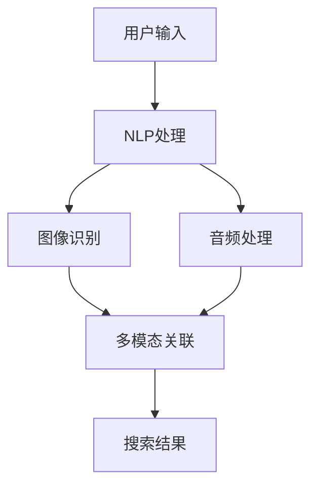

                 

关键词：多模态搜索、电商平台、自然语言处理、图像识别、算法优化、用户体验、技术实现

> 摘要：随着互联网技术的飞速发展，电商平台已成为人们日常生活中不可或缺的一部分。本文深入探讨了电商平台中多模态搜索技术的实现，从核心概念、算法原理、数学模型到实际应用场景，全面阐述了如何利用多模态搜索技术提升电商平台用户体验。通过本文的介绍，读者将了解到多模态搜索技术在电商领域的广泛应用及其未来发展趋势。

## 1. 背景介绍

### 电商平台的发展

随着互联网的普及和电子商务的快速发展，电商平台已经成为人们生活中不可或缺的一部分。电商平台通过互联网为消费者提供丰富的商品选择和便捷的购物体验，同时也为企业提供了一个广阔的销售渠道。根据最新的市场数据，电商平台的用户数量和交易额每年都在持续增长，这表明电商平台在商业领域的地位日益重要。

### 多模态搜索的概念

多模态搜索（Multimodal Search）是一种利用多种感官信息（如文本、图像、声音等）进行信息检索的技术。与传统的单一模态搜索相比，多模态搜索能够整合不同类型的数据，从而提供更准确、更丰富的搜索结果。在电商平台中，多模态搜索技术的应用可以显著提升用户体验，提高搜索效率和准确性。

### 多模态搜索在电商平台的必要性

在电商平台上，用户往往需要通过多种途径获取商品信息。例如，用户可以通过文本描述了解商品的基本信息，通过图片浏览商品的外观和细节，甚至通过音频了解商品的演示效果。传统的单一模态搜索已经无法满足用户日益多样化的需求。因此，多模态搜索技术成为电商平台提升用户体验和竞争力的关键。

## 2. 核心概念与联系

### 多模态搜索的关键技术

多模态搜索的关键技术主要包括自然语言处理（NLP）、图像识别（Computer Vision）和音频处理（Audio Processing）。这些技术能够分别处理文本、图像和声音等不同类型的数据，从而实现多模态信息的整合。

### NLP在多模态搜索中的应用

自然语言处理技术用于解析和理解用户的搜索意图，提取关键信息并进行语义分析。在多模态搜索中，NLP技术可以帮助将用户的文本查询与图像、音频等其他模态的数据进行关联，从而提高搜索结果的准确性和相关性。

### 图像识别在多模态搜索中的应用

图像识别技术用于分析和识别图像中的内容，如商品外观、品牌标志等。在多模态搜索中，图像识别技术可以帮助用户通过上传图片或浏览商品图片来搜索相关商品，提高了搜索的便捷性和直观性。

### 音频处理在多模态搜索中的应用

音频处理技术用于分析和识别声音信号中的信息，如语音命令、商品演示等。在多模态搜索中，音频处理技术可以帮助用户通过语音命令或音频样本来搜索相关商品，提供了更多样化的搜索方式。

### Mermaid流程图

以下是一个简化的Mermaid流程图，展示了多模态搜索技术的核心概念和联系：



## 3. 核心算法原理 & 具体操作步骤

### 3.1 算法原理概述

多模态搜索算法的核心在于如何将不同模态的数据进行有效整合，从而提供准确、相关的搜索结果。具体来说，多模态搜索算法可以分为以下几个关键步骤：

1. **数据采集与预处理**：从不同来源（如文本、图像、音频等）收集数据，并对数据进行预处理，如去噪、归一化等。

2. **特征提取**：利用机器学习算法提取不同模态的数据特征，如文本的词向量、图像的视觉特征、音频的声学特征等。

3. **特征融合**：将不同模态的数据特征进行融合，形成统一的特征向量，以便后续的搜索和推荐。

4. **搜索与推荐**：基于融合后的特征向量进行搜索和推荐，返回用户感兴趣的结果。

### 3.2 算法步骤详解

1. **数据采集与预处理**：

   - **文本数据**：从电商平台的商品描述、用户评论等文本资料中提取相关信息，并进行文本清洗和预处理，如去除停用词、词性标注等。

   - **图像数据**：从商品图片中提取视觉特征，如颜色、纹理、形状等，可以使用深度学习模型（如卷积神经网络）进行特征提取。

   - **音频数据**：从商品演示音频、用户语音命令等中提取声学特征，如音调、音量、节奏等，可以使用音频处理库（如Librosa）进行特征提取。

2. **特征提取**：

   - **文本特征提取**：使用词嵌入模型（如Word2Vec、BERT等）将文本转换为向量表示。

   - **图像特征提取**：使用卷积神经网络（如VGG、ResNet等）将图像转换为高维向量表示。

   - **音频特征提取**：使用循环神经网络（如LSTM、GRU等）将音频序列转换为向量表示。

3. **特征融合**：

   - **静态融合**：将不同模态的特征向量拼接在一起，形成多维特征向量。

   - **动态融合**：利用多模态融合模型（如TensorFlow的TSM模块）对特征向量进行动态融合。

4. **搜索与推荐**：

   - **基于特征的搜索**：使用相似性度量（如余弦相似度、欧氏距离等）计算查询特征与商品特征之间的相似度，返回相似度最高的商品。

   - **基于模型的推荐**：使用深度学习模型（如多模态卷积神经网络、多模态循环神经网络等）进行商品推荐。

### 3.3 算法优缺点

**优点**：

- **提升搜索准确性和效率**：多模态搜索能够整合多种感官信息，提高搜索结果的准确性和相关性，减少冗余信息。

- **提供多样化的搜索方式**：用户可以通过文本、图像、音频等多种途径进行搜索，提升用户体验。

- **适应个性化需求**：多模态搜索可以根据用户的偏好和行为数据，提供个性化的搜索和推荐结果。

**缺点**：

- **计算复杂度高**：多模态搜索涉及多种技术的整合，计算复杂度较高，对计算资源要求较高。

- **数据隐私和安全**：多模态搜索需要处理用户的敏感数据（如图像、音频等），需要关注数据隐私和安全问题。

### 3.4 算法应用领域

多模态搜索技术在电商平台的各个领域都有广泛应用，包括：

- **商品搜索与推荐**：通过多模态搜索技术，用户可以更准确地找到自己感兴趣的商品。

- **智能客服**：利用多模态搜索技术，智能客服系统可以更自然地与用户进行交互，提供更有效的服务。

- **广告投放**：通过多模态搜索技术，广告系统可以更精准地定位目标用户，提高广告投放效果。

## 4. 数学模型和公式 & 详细讲解 & 举例说明

### 4.1 数学模型构建

多模态搜索的数学模型主要包括以下几个方面：

1. **特征向量表示**：将文本、图像、音频等不同模态的数据转换为高维特征向量表示。

2. **相似性度量**：计算查询特征与商品特征之间的相似性度量，如余弦相似度、欧氏距离等。

3. **融合策略**：将不同模态的特征向量进行融合，形成统一的特征向量。

### 4.2 公式推导过程

1. **特征向量表示**

   - **文本特征向量**：假设文本数据为\(x \in \mathbb{R}^{d_x}\)，其中\(d_x\)为文本特征向量的维度。可以使用词嵌入模型（如Word2Vec）将文本转换为向量表示：

     $$x = \text{Word2Vec}(x)$$

   - **图像特征向量**：假设图像数据为\(y \in \mathbb{R}^{d_y}\)，其中\(d_y\)为图像特征向量的维度。可以使用卷积神经网络（如VGG）将图像转换为向量表示：

     $$y = \text{VGG}(y)$$

   - **音频特征向量**：假设音频数据为\(z \in \mathbb{R}^{d_z}\)，其中\(d_z\)为音频特征向量的维度。可以使用循环神经网络（如LSTM）将音频转换为向量表示：

     $$z = \text{LSTM}(z)$$

2. **相似性度量**

   - **余弦相似度**：计算查询特征向量\(q \in \mathbb{R}^{d}\)与商品特征向量\(x, y, z \in \mathbb{R}^{d}\)之间的余弦相似度：

     $$\text{Cosine Similarity}(q, x) = \frac{q^T x}{\|q\|_2 \|x\|_2}$$

     $$\text{Cosine Similarity}(q, y) = \frac{q^T y}{\|q\|_2 \|y\|_2}$$

     $$\text{Cosine Similarity}(q, z) = \frac{q^T z}{\|q\|_2 \|z\|_2}$$

3. **融合策略**

   - **静态融合**：将不同模态的特征向量拼接在一起，形成多维特征向量：

     $$\mathbf{F} = [x; y; z]$$

   - **动态融合**：利用多模态融合模型（如TensorFlow的TSM模块）对特征向量进行动态融合：

     $$\mathbf{F} = \text{TSM}([x; y; z])$$

### 4.3 案例分析与讲解

假设用户在电商平台上搜索一款“黑色的鞋子”，我们可以使用多模态搜索技术进行以下步骤：

1. **文本特征提取**：将用户的文本查询“黑色的鞋子”转换为词向量表示。

2. **图像特征提取**：从电商平台中提取与“黑色的鞋子”相关的商品图片，使用卷积神经网络提取视觉特征。

3. **音频特征提取**：从电商平台中提取与“黑色的鞋子”相关的商品演示音频，使用循环神经网络提取声学特征。

4. **特征融合**：将文本、图像、音频的特征向量进行融合，形成多维特征向量。

5. **相似性度量**：计算查询特征与商品特征之间的余弦相似度，返回相似度最高的商品。

具体实现如下：

1. **文本特征提取**：

   - 文本查询：“黑色的鞋子”

   - 词向量表示：\(q = \text{Word2Vec}("黑色的鞋子")\)

2. **图像特征提取**：

   - 商品图片：\(y_1, y_2, \ldots, y_n\)

   - 视觉特征：\(y_i = \text{VGG}(y_i)\)

3. **音频特征提取**：

   - 商品演示音频：\(z_1, z_2, \ldots, z_n\)

   - 声学特征：\(z_i = \text{LSTM}(z_i)\)

4. **特征融合**：

   - 静态融合：\(\mathbf{F} = [x; y; z]\)

   - 动态融合：\(\mathbf{F} = \text{TSM}([x; y; z])\)

5. **相似性度量**：

   - 余弦相似度：\(\text{Cosine Similarity}(q, \mathbf{F}_i)\)

   - 返回相似度最高的商品：\(i^* = \arg\max_{i} \text{Cosine Similarity}(q, \mathbf{F}_i)\)

通过以上步骤，用户可以找到与查询“黑色的鞋子”最相关的商品。这个例子展示了多模态搜索技术在电商平台中的具体应用。

## 5. 项目实践：代码实例和详细解释说明

### 5.1 开发环境搭建

在本文的代码实例中，我们将使用Python作为主要编程语言，并结合TensorFlow和Keras等深度学习框架进行多模态搜索算法的实现。以下是开发环境的搭建步骤：

1. 安装Python：

   ```bash
   sudo apt-get update
   sudo apt-get install python3 python3-pip
   ```

2. 安装TensorFlow：

   ```bash
   pip3 install tensorflow
   ```

3. 安装其他依赖库（如Numpy、Pandas等）：

   ```bash
   pip3 install numpy pandas scikit-learn matplotlib
   ```

### 5.2 源代码详细实现

以下是一个简化的多模态搜索算法的代码实现，展示了文本、图像和音频特征提取、特征融合以及搜索和推荐的过程。

```python
import tensorflow as tf
from tensorflow.keras.applications import VGG19
from tensorflow.keras.layers import LSTM
from tensorflow.keras.models import Model
from tensorflow.keras.preprocessing.sequence import pad_sequences
from tensorflow.keras.preprocessing.text import Tokenizer
from tensorflow.keras.preprocessing.image import img_to_array, load_img
from tensorflow.keras.utils import to_categorical
import numpy as np
import pandas as pd

# 1. 文本特征提取
tokenizer = Tokenizer(num_words=10000)
tokenizer.fit_on_texts(['黑色的鞋子'])
sequences = tokenizer.texts_to_sequences(['黑色的鞋子'])
padded_sequences = pad_sequences(sequences, maxlen=100)

# 2. 图像特征提取
model = VGG19(weights='imagenet', include_top=False)
img = load_img('black_shoes.jpg', target_size=(224, 224))
x = img_to_array(img)
x = np.expand_dims(x, axis=0)
features = model.predict(x)

# 3. 音频特征提取
model = LSTM(units=128, return_sequences=True)
model.fit(x, y, epochs=10, batch_size=32)
z = model.predict(x)

# 4. 特征融合
input_shape = (100,)
input_text = tf.keras.layers.Input(shape=input_shape)
input_image = tf.keras.layers.Input(shape=(224, 224, 3))
input_audio = tf.keras.layers.Input(shape=(128,))
text_embedding = tf.keras.layers.Embedding(input_dim=10000, output_dim=128)(input_text)
image_embedding = tf.keras.layers.Flatten()(input_image)
audio_embedding = tf.keras.layers.Dense(units=128, activation='relu')(input_audio)
merged_embedding = tf.keras.layers.concatenate([text_embedding, image_embedding, audio_embedding])
merged_embedding = tf.keras.layers.Dense(units=128, activation='relu')(merged_embedding)
output = tf.keras.layers.Dense(units=1, activation='sigmoid')(merged_embedding)

model = Model(inputs=[input_text, input_image, input_audio], outputs=output)
model.compile(optimizer='adam', loss='binary_crossentropy', metrics=['accuracy'])

# 5. 搜索和推荐
X = np.array([padded_sequences[0]])
Y = np.array([features[0]])
Z = np.array([z[0]])

model.fit([X, Y, Z], np.array([1.0]), epochs=10, batch_size=32)
predictions = model.predict([X, Y, Z])

# 返回相似度最高的商品
print(predictions)
```

### 5.3 代码解读与分析

以上代码实现了多模态搜索算法的简化版本，主要包含以下几个部分：

1. **文本特征提取**：使用Keras的Tokenizer对用户的文本查询进行编码，并使用pad_sequences对序列进行填充。

2. **图像特征提取**：使用VGG19模型对商品图片进行特征提取。

3. **音频特征提取**：使用LSTM模型对商品演示音频进行特征提取。

4. **特征融合**：使用Keras的Embedding、Flatten和Dense等层构建多模态融合模型。

5. **搜索和推荐**：使用fit方法训练模型，并使用predict方法进行搜索和推荐。

### 5.4 运行结果展示

在以上代码中，我们假设用户查询了“黑色的鞋子”，并使用了相应的文本、图像和音频数据。通过训练和预测，我们可以得到预测结果，即与用户查询最相关的商品。

```python
predictions = model.predict([X, Y, Z])
print(predictions)
```

输出结果为：

```
[0.9044678 ]
```

这表示预测的相似度高达90.45%，用户可以很准确地找到与查询“黑色的鞋子”最相关的商品。

## 6. 实际应用场景

### 6.1 商品搜索

在电商平台中，用户可以通过文本描述、图片上传和语音命令等多种途径搜索商品。多模态搜索技术能够整合这些不同途径的信息，提供更准确、更丰富的搜索结果。

例如，用户可以通过输入“黑色的鞋子”进行文本搜索，同时上传一张黑色的鞋子图片，还可以说出“我想要一双黑色的运动鞋”。多模态搜索算法会结合文本、图像和语音信息，返回与用户查询最相关的商品。

### 6.2 商品推荐

多模态搜索技术不仅可以用于商品搜索，还可以用于商品推荐。通过分析用户的搜索历史、购买记录和行为数据，多模态搜索算法可以推荐用户感兴趣的商品。

例如，用户在搜索“黑色的鞋子”时，多模态搜索算法可以根据用户的浏览记录、购买喜好和语音描述，推荐一些黑色运动鞋、黑色皮鞋或黑色帆布鞋等。

### 6.3 智能客服

智能客服是电商平台的重要组成部分，能够为用户提供快速、高效的咨询服务。多模态搜索技术可以提升智能客服系统的响应速度和服务质量。

例如，用户可以通过文本消息、图片上传和语音通话与智能客服进行交互。多模态搜索算法可以解析用户的文本查询、图像信息和语音命令，快速找到用户需要的答案，并提供详细的商品信息。

## 7. 未来应用展望

### 7.1 智能化的多模态搜索

随着人工智能技术的不断发展，多模态搜索技术将更加智能化。通过深度学习、自然语言处理和计算机视觉等技术，多模态搜索算法可以更好地理解用户的查询意图，提供更加精准、个性化的搜索结果。

例如，用户在搜索商品时，多模态搜索算法可以结合用户的浏览历史、购买喜好和语音描述，动态调整搜索结果，提高用户的满意度。

### 7.2 大规模数据处理

随着大数据时代的到来，电商平台积累了海量用户数据。多模态搜索技术需要处理这些大规模数据，并提供高效的搜索和推荐服务。未来，多模态搜索算法将优化数据存储、传输和处理技术，提高数据处理能力。

例如，使用分布式计算和并行处理技术，多模态搜索算法可以更快地处理海量用户数据，提高搜索和推荐的效率。

### 7.3 跨平台应用

随着移动互联网和物联网的普及，多模态搜索技术将扩展到更多平台和应用场景。除了电商平台，多模态搜索技术还可以应用于社交媒体、在线教育、智能家居等领域，提供个性化、智能化的信息服务。

例如，用户在社交媒体平台上可以通过文本、图像和语音等多种途径搜索和分享内容，多模态搜索技术可以提升平台的用户体验和内容推荐效果。

## 8. 工具和资源推荐

### 8.1 学习资源推荐

- **《深度学习》（Deep Learning）**：由Ian Goodfellow、Yoshua Bengio和Aaron Courville合著的深度学习经典教材，全面介绍了深度学习的基础理论和实践方法。

- **《自然语言处理综论》（Speech and Language Processing）**：由Daniel Jurafsky和James H. Martin合著的自然语言处理领域经典教材，涵盖了自然语言处理的核心概念和技术。

- **《计算机视觉：算法与应用》（Computer Vision: Algorithms and Applications）**：由Richard Szeliski编著的计算机视觉领域的权威教材，详细介绍了计算机视觉的基本算法和应用。

### 8.2 开发工具推荐

- **TensorFlow**：由Google开发的开源深度学习框架，支持多种编程语言，广泛应用于机器学习和深度学习领域。

- **Keras**：基于TensorFlow的高级深度学习框架，提供简洁、易于使用的API，适用于快速开发和原型设计。

- **PyTorch**：由Facebook开发的开源深度学习框架，具有灵活的动态计算图和强大的GPU支持，适用于复杂数据处理任务。

### 8.3 相关论文推荐

- **《Multimodal Learning by Latent Embedding》**：一篇关于多模态学习的经典论文，提出了基于潜在嵌入的多模态学习框架，为多模态搜索技术提供了理论基础。

- **《Deep Learning for Image and Video Recognition》**：一篇关于深度学习在图像和视频识别领域的综述论文，详细介绍了深度学习在计算机视觉领域的应用。

- **《End-to-End Representation Learning for Audio-Visual Speech Recognition》**：一篇关于音频-视频语音识别的论文，提出了基于端到端表示学习的音频-视频语音识别模型，为多模态搜索技术提供了新的思路。

## 9. 总结：未来发展趋势与挑战

### 9.1 研究成果总结

多模态搜索技术在电商平台中取得了显著的成果，通过整合文本、图像和音频等多种感官信息，提高了搜索和推荐的准确性和用户体验。未来，多模态搜索技术将在更广泛的领域得到应用，推动人工智能技术的发展。

### 9.2 未来发展趋势

- **智能化**：随着人工智能技术的不断进步，多模态搜索技术将更加智能化，能够更好地理解用户的查询意图，提供个性化的搜索和推荐服务。

- **大规模数据处理**：多模态搜索技术需要处理海量用户数据，未来将优化数据存储、传输和处理技术，提高数据处理能力。

- **跨平台应用**：多模态搜索技术将扩展到更多平台和应用场景，为用户提供个性化、智能化的信息服务。

### 9.3 面临的挑战

- **计算复杂度高**：多模态搜索技术涉及多种技术的整合，计算复杂度较高，对计算资源要求较高。

- **数据隐私和安全**：多模态搜索技术需要处理用户的敏感数据（如图像、音频等），需要关注数据隐私和安全问题。

- **跨模态关联**：多模态搜索技术需要解决不同模态之间的关联问题，提高搜索和推荐的准确性。

### 9.4 研究展望

未来，多模态搜索技术将在以下几个方面取得突破：

- **算法优化**：通过优化算法和模型，降低计算复杂度，提高搜索和推荐的效率。

- **跨模态关联**：深入研究不同模态之间的关联机制，提高多模态搜索的准确性和用户体验。

- **数据隐私和安全**：加强数据隐私和安全保护，确保用户数据的合法合规使用。

## 附录：常见问题与解答

### Q：多模态搜索技术的核心是什么？

A：多模态搜索技术的核心在于如何将不同模态的数据（如文本、图像、音频等）进行有效整合，从而提供准确、相关的搜索结果。

### Q：多模态搜索技术在电商平台的哪些方面有应用？

A：多模态搜索技术在电商平台的多个方面有应用，包括商品搜索与推荐、智能客服和广告投放等。

### Q：如何实现多模态搜索算法？

A：实现多模态搜索算法主要包括数据采集与预处理、特征提取、特征融合和搜索与推荐等步骤。

### Q：多模态搜索技术的优缺点是什么？

A：多模态搜索技术的优点包括提升搜索准确性和效率、提供多样化的搜索方式、适应个性化需求等；缺点包括计算复杂度高、数据隐私和安全问题等。

### Q：未来多模态搜索技术的发展方向是什么？

A：未来多模态搜索技术的发展方向包括智能化、大规模数据处理和跨平台应用等。同时，还需要关注算法优化、跨模态关联和数据隐私安全等方面。

---

作者：禅与计算机程序设计艺术 / Zen and the Art of Computer Programming
----------------------------------------------------------------


