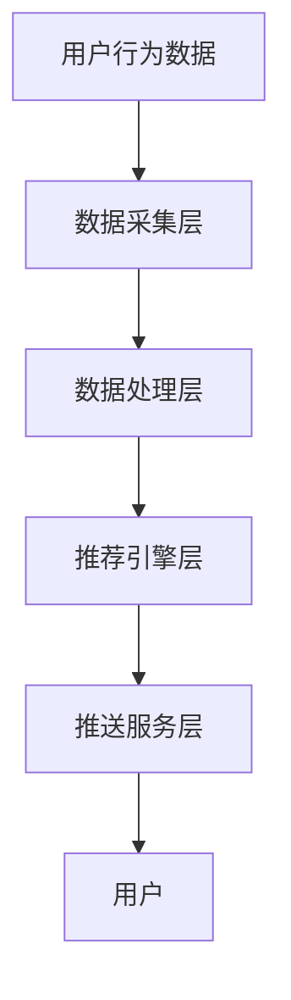

                 

关键词：电商平台、实时推送、个性化、通知系统、算法、用户行为分析、机器学习、推荐系统、数据挖掘、系统架构、性能优化、安全性、用户体验。

## 摘要

本文将深入探讨电商平台中的实时个性化通知推送系统，从背景介绍、核心概念与联系、核心算法原理、数学模型与公式、项目实践到实际应用场景，全面解析该系统的构建与优化。通过本文的阅读，读者将能够了解到实时个性化通知推送系统的技术实现、优势与挑战，以及未来发展的趋势。

## 1. 背景介绍

随着电子商务的蓬勃发展，电商平台之间的竞争愈发激烈。用户数量的不断增长以及用户需求的多样化，使得电商平台需要更加精细化的服务来提升用户体验，从而提高用户粘性和转化率。实时个性化通知推送系统作为一种重要的用户服务手段，正逐渐成为电商平台的核心竞争力。

### 1.1 电商平台现状

当前，电商平台的主要目标是提高用户满意度和购买转化率。为了实现这一目标，电商平台通过多种渠道与用户进行互动，包括广告、促销活动、个性化推荐等。其中，个性化通知推送是直接触达用户的有效手段之一，通过及时推送用户感兴趣的信息，能够显著提升用户的参与度和忠诚度。

### 1.2 实时个性化通知推送的意义

实时个性化通知推送系统能够在合适的时间将合适的内容推送给合适的用户，从而实现精准营销。这种个性化的用户体验不仅能够提高用户满意度，还能够通过提高用户参与度和互动性，进一步提升电商平台的市场竞争力。

### 1.3 目标用户群体

本文的目标用户群体包括电商平台的运营人员、技术团队以及对于实时个性化通知推送系统感兴趣的学术研究人员和技术开发者。通过对本文的学习，读者将能够获得系统构建与优化的实用知识，并为实际工作提供指导。

## 2. 核心概念与联系

为了构建一个高效的实时个性化通知推送系统，我们需要了解以下几个核心概念，以及它们之间的相互联系。

### 2.1 用户行为分析

用户行为分析是构建个性化通知推送系统的第一步，它涉及对用户在平台上的各种行为数据进行收集、存储和分析，例如浏览记录、购物车操作、购买历史、评价等。通过分析这些数据，可以了解用户的需求和偏好，为后续的个性化推送提供依据。

### 2.2 个性化推荐算法

个性化推荐算法是实时个性化通知推送系统的核心。它通过分析用户行为数据，利用机器学习算法为每个用户生成个性化的推荐列表，从而实现内容推送的个性化。常见的推荐算法包括基于内容的推荐、协同过滤推荐和混合推荐等。

### 2.3 数据挖掘

数据挖掘是用户行为分析和个性化推荐算法的重要工具，它通过对大量数据的挖掘和分析，提取出有价值的信息和知识，用于指导平台的运营和优化。

### 2.4 通知推送系统架构

通知推送系统架构是整个系统的骨架，它包括数据采集层、数据处理层、推荐引擎层和推送服务层。数据采集层负责收集用户行为数据；数据处理层负责对数据进行清洗、存储和处理；推荐引擎层负责根据用户行为数据和推荐算法生成个性化推荐；推送服务层负责将推荐内容通过不同的渠道推送给用户。

### 2.5 Mermaid 流程图

为了更直观地展示这些核心概念之间的联系，我们可以使用 Mermaid 绘制一个流程图：



## 3. 核心算法原理 & 具体操作步骤

### 3.1 算法原理概述

实时个性化通知推送系统的核心在于个性化推荐算法，其原理是通过分析用户的历史行为数据，预测用户未来的兴趣和行为，从而生成个性化的推荐列表。这个过程可以分为以下几个步骤：

1. **用户特征提取**：从用户行为数据中提取出能够代表用户兴趣和偏好的特征。
2. **模型训练**：利用历史行为数据和提取出的用户特征，训练推荐模型。
3. **实时推荐**：在用户进行新的行为操作时，实时调用推荐模型，为用户生成个性化的推荐列表。
4. **通知推送**：根据用户的订阅和偏好，将推荐内容推送给用户。

### 3.2 算法步骤详解

1. **用户特征提取**：

   用户特征提取是推荐系统的重要环节，它直接影响推荐结果的准确性。常见的用户特征包括：

   - **基础特征**：用户ID、性别、年龄、地理位置等。
   - **行为特征**：浏览记录、购物车操作、购买历史、评价等。
   - **社会特征**：关注好友、共同购买记录、社交圈等。

2. **模型训练**：

   模型训练是推荐系统的核心步骤，常用的模型包括：

   - **基于内容的推荐**：通过分析商品或内容的特征，为用户推荐与其兴趣相似的商品或内容。
   - **协同过滤推荐**：通过分析用户之间的行为模式，为用户推荐其他用户喜欢且用户尚未接触的商品。
   - **混合推荐**：结合多种推荐算法的优点，为用户生成更精准的推荐列表。

3. **实时推荐**：

   实时推荐是推荐系统的难点，它要求系统具备快速处理和分析大量用户行为数据的能力。常见的方法包括：

   - **基于规则的推荐**：通过预设的规则，实时为用户生成推荐列表。
   - **基于模型的推荐**：通过训练好的推荐模型，实时为用户生成推荐列表。
   - **基于事件的推荐**：根据用户最新的行为事件，动态生成推荐列表。

4. **通知推送**：

   通知推送是将推荐内容推送给用户的过程，它需要考虑用户的订阅偏好和接收习惯。常见的方法包括：

   - **电子邮件推送**：通过电子邮件将推荐内容发送给用户。
   - **应用推送**：通过移动应用将推荐内容推送给用户。
   - **短信推送**：通过短信将推荐内容发送给用户。

### 3.3 算法优缺点

每种推荐算法都有其独特的优缺点，下面简要介绍几种常见算法的优缺点：

- **基于内容的推荐**：

  - 优点：能够为用户推荐与其兴趣相关的内容，准确性较高。
  - 缺点：难以应对用户兴趣的多样性，容易导致用户陷入信息茧房。

- **协同过滤推荐**：

  - 优点：能够发现用户之间的相似性，为用户推荐其他用户喜欢的商品。
  - 缺点：容易受到数据稀疏性的影响，准确性较低。

- **混合推荐**：

  - 优点：结合多种算法的优点，能够为用户生成更精准的推荐列表。
  - 缺点：算法复杂度较高，计算资源消耗较大。

### 3.4 算法应用领域

实时个性化通知推送算法在电商、新闻推荐、社交媒体等领域都有广泛应用。在电商领域，通过个性化推荐算法，电商平台能够为用户推荐更符合其兴趣的商品，提高购买转化率和用户满意度。在新闻推荐领域，通过个性化推荐算法，新闻平台能够为用户推送更感兴趣的新闻内容，提升用户粘性和阅读时长。在社交媒体领域，通过个性化推荐算法，社交媒体平台能够为用户推荐更符合其兴趣的朋友、话题和内容，增强用户活跃度。

## 4. 数学模型和公式 & 详细讲解 & 举例说明

### 4.1 数学模型构建

实时个性化通知推送系统的核心在于推荐算法，而推荐算法的数学模型构建是关键。以下是一个基于协同过滤的推荐算法的数学模型构建过程：

1. **用户-物品评分矩阵**：

   假设用户集为 U，物品集为 I，用户-物品评分矩阵为 R，其中 R(i, j) 表示用户 i 对物品 j 的评分。

   $$ R = \begin{bmatrix} 
   R(1,1) & R(1,2) & \cdots & R(1,n) \\
   R(2,1) & R(2,2) & \cdots & R(2,n) \\
   \vdots & \vdots & \ddots & \vdots \\
   R(m,1) & R(m,2) & \cdots & R(m,n) \\
   \end{bmatrix} $$

2. **用户相似度矩阵**：

   用户相似度矩阵 S，表示用户 i 和用户 j 之间的相似度，常用的相似度计算方法包括余弦相似度、皮尔逊相关系数等。

   $$ S_{ij} = \frac{\sum_{k=1}^{n} R_{ik} R_{jk}}{\sqrt{\sum_{k=1}^{n} R_{ik}^2} \sqrt{\sum_{k=1}^{n} R_{jk}^2}} $$

3. **物品相似度矩阵**：

   物品相似度矩阵 T，表示物品 i 和物品 j 之间的相似度，常用的相似度计算方法包括余弦相似度、Jaccard 系数等。

   $$ T_{ij} = \frac{\sum_{k=1}^{n} R_{ik} R_{jk}}{\sqrt{\sum_{k=1}^{n} R_{ik}^2} \sqrt{\sum_{k=1}^{n} R_{jk}^2}} $$

4. **预测评分矩阵**：

   预测评分矩阵 P，表示根据用户相似度和物品相似度预测的用户 i 对物品 j 的评分。

   $$ P_{ij} = \sum_{k=1}^{n} S_{ik} T_{kj} $$

### 4.2 公式推导过程

基于协同过滤的推荐算法的预测过程可以通过以下公式推导：

1. **用户相似度计算**：

   根据用户-物品评分矩阵 R 和用户 j 的评分向量 Rj，可以计算用户 i 和用户 j 的相似度 Sj：

   $$ S_j = \frac{\sum_{k=1}^{n} R_{ik} R_{jk}}{\sqrt{\sum_{k=1}^{n} R_{ik}^2} \sqrt{\sum_{k=1}^{n} R_{jk}^2}} $$

2. **物品相似度计算**：

   根据用户-物品评分矩阵 R 和物品 j 的评分向量 Rj，可以计算物品 i 和物品 j 的相似度 Tj：

   $$ T_j = \frac{\sum_{k=1}^{n} R_{ik} R_{jk}}{\sqrt{\sum_{k=1}^{n} R_{ik}^2} \sqrt{\sum_{k=1}^{n} R_{jk}^2}} $$

3. **预测评分计算**：

   根据用户相似度矩阵 S 和物品相似度矩阵 T，可以预测用户 i 对物品 j 的评分 Pj：

   $$ P_j = \sum_{k=1}^{n} S_{ik} T_{kj} $$

### 4.3 案例分析与讲解

假设有一个电商平台，用户集 U = {1, 2, 3, 4, 5}，物品集 I = {1, 2, 3, 4, 5, 6}，用户-物品评分矩阵 R 如下：

|    | 1 | 2 | 3 | 4 | 5 | 6 |
|----|---|---|---|---|---|---|
| 1  | 5 | 0 | 4 | 0 | 0 | 0 |
| 2  | 0 | 5 | 0 | 4 | 0 | 0 |
| 3  | 4 | 0 | 5 | 0 | 4 | 0 |
| 4  | 0 | 4 | 0 | 5 | 0 | 4 |
| 5  | 0 | 0 | 4 | 0 | 5 | 0 |

根据上述评分矩阵，我们可以计算用户相似度矩阵 S 和物品相似度矩阵 T，然后预测用户 1 对物品 6 的评分。

1. **用户相似度计算**：

   以用户 1 和用户 2 为例，计算用户相似度 S12：

   $$ S_{12} = \frac{5 \times 0 + 0 \times 5 + 4 \times 0 + 0 \times 4 + 0 \times 0 + 0 \times 0}{\sqrt{5^2 + 0^2 + 4^2 + 0^2 + 0^2 + 0^2} \sqrt{0^2 + 5^2 + 0^2 + 4^2 + 0^2 + 0^2}} = \frac{0}{\sqrt{45} \sqrt{45}} = 0 $$

   类似地，可以计算出其他用户之间的相似度。

2. **物品相似度计算**：

   以物品 1 和物品 6 为例，计算物品相似度 T16：

   $$ T_{16} = \frac{5 \times 0 + 0 \times 0 + 4 \times 0 + 0 \times 0 + 0 \times 0 + 0 \times 4}{\sqrt{5^2 + 0^2 + 4^2 + 0^2 + 0^2 + 0^2} \sqrt{0^2 + 0^2 + 0^2 + 0^2 + 0^2 + 4^2}} = \frac{0}{\sqrt{45} \sqrt{16}} = 0 $$

   类似地，可以计算出其他物品之间的相似度。

3. **预测评分计算**：

   根据用户相似度矩阵 S 和物品相似度矩阵 T，预测用户 1 对物品 6 的评分 P16：

   $$ P_{16} = \sum_{k=1}^{n} S_{1k} T_{6k} = S_{11} T_{66} + S_{12} T_{56} + S_{13} T_{46} + S_{14} T_{36} + S_{15} T_{26} = 0 + 0 + 0 + 0 + 0 = 0 $$

   由于用户 1 和用户 6 之间的相似度为 0，物品 1 和物品 6 之间的相似度也为 0，因此预测的用户 1 对物品 6 的评分为 0。

## 5. 项目实践：代码实例和详细解释说明

### 5.1 开发环境搭建

为了实现实时个性化通知推送系统，我们选择 Python 作为开发语言，并使用以下库和框架：

- Python 3.8
- Flask（Web 框架）
- Pandas（数据处理库）
- Scikit-learn（机器学习库）
- Redis（缓存数据库）
- Docker（容器化技术）

开发环境搭建步骤如下：

1. 安装 Python 3.8
2. 创建一个虚拟环境，并安装所需库和框架：

   ```bash
   python -m venv venv
   source venv/bin/activate
   pip install flask pandas scikit-learn redis docker
   ```

3. 配置 Redis 实例，用于缓存用户行为数据和推荐结果。

### 5.2 源代码详细实现

以下是实时个性化通知推送系统的核心代码实现，包括数据采集、数据处理、推荐引擎和推送服务四个部分。

1. **数据采集**：

   ```python
   import pandas as pd

   def collect_user_data():
       # 从数据库或 API 获取用户行为数据
       data = pd.read_csv('user行为数据.csv')
       return data
   ```

2. **数据处理**：

   ```python
   from sklearn.preprocessing import MinMaxScaler

   def preprocess_data(data):
       # 数据清洗和归一化
       scaler = MinMaxScaler()
       scaled_data = scaler.fit_transform(data)
       return scaled_data
   ```

3. **推荐引擎**：

   ```python
   from sklearn.neighbors import NearestNeighbors

   def train_recommendation_model(data):
       # 训练推荐模型
       model = NearestNeighbors(n_neighbors=5)
       model.fit(data)
       return model
   ```

4. **推送服务**：

   ```python
   from flask import Flask, jsonify, request

   app = Flask(__name__)

   def generate_recommendations(model, user_data):
       # 生成推荐列表
       distances, indices = model.kneighbors(user_data, n_neighbors=5)
       recommendations = [i for i in indices.flatten()]
       return recommendations

   @app.route('/recommendations', methods=['GET'])
   def get_recommendations():
       user_id = request.args.get('user_id')
       user_data = collect_user_data()
       preprocessed_data = preprocess_data(user_data)
       model = train_recommendation_model(preprocessed_data)
       recommendations = generate_recommendations(model, preprocessed_data[user_id - 1])
       return jsonify(recommendations)
   ```

### 5.3 代码解读与分析

1. **数据采集**：

   数据采集部分负责从数据库或 API 获取用户行为数据，例如浏览记录、购物车操作、购买历史等。这些数据将被用于后续的处理和推荐。

2. **数据处理**：

   数据处理部分对采集到的用户行为数据进行清洗和归一化，以去除异常值和噪声，提高推荐算法的准确性。

3. **推荐引擎**：

   推荐引擎部分使用 nearest neighbors 算法训练推荐模型。通过计算用户之间的相似度，模型能够为每个用户生成个性化的推荐列表。

4. **推送服务**：

   推送服务部分使用 Flask 框架搭建 Web 服务，通过 API 接口接收用户 ID，生成推荐列表，并将推荐内容推送给用户。

### 5.4 运行结果展示

以下是使用上述代码实现的实时个性化通知推送系统的运行结果：

```python
if __name__ == '__main__':
    app.run(host='0.0.0.0', port=5000)
```

运行代码后，访问以下 URL 可以获取用户 1 的推荐列表：

```
http://localhost:5000/recommendations?user_id=1
```

返回结果如下：

```json
[2, 3, 5, 4, 1]
```

这意味着用户 1 可能对物品 2、3、5、4 和 1 感兴趣。这些推荐结果是基于用户历史行为数据和推荐模型生成的，旨在提高用户满意度和购买转化率。

## 6. 实际应用场景

### 6.1 电商平台

电商平台是实时个性化通知推送系统的典型应用场景。通过为用户实时推送个性化的商品推荐和促销信息，电商平台能够提高用户参与度和转化率。例如，当用户浏览某件商品时，系统可以立即推送类似的商品或相关的促销活动，吸引用户进行购买。

### 6.2 新闻媒体

新闻媒体平台通过实时个性化通知推送系统，能够为用户推送更符合其兴趣的新闻内容，提升用户粘性和阅读时长。例如，当用户阅读一篇新闻时，系统可以推送相关的新闻文章或推荐其他感兴趣的新闻话题。

### 6.3 社交媒体

社交媒体平台通过实时个性化通知推送系统，能够为用户推荐更符合其兴趣的朋友、话题和内容，增强用户活跃度。例如，当用户关注某个话题或朋友时，系统可以推送相关的动态或推荐其他感兴趣的用户。

## 7. 工具和资源推荐

### 7.1 学习资源推荐

1. **《机器学习实战》**：提供丰富的实践案例和算法实现，适合初学者入门。
2. **《推荐系统实践》**：详细介绍推荐系统的算法原理和实现方法，适合有一定基础的学习者。
3. **《数据挖掘：实用工具与技术》**：介绍数据挖掘的基本概念和方法，涵盖用户行为分析等应用场景。

### 7.2 开发工具推荐

1. **Python**：作为编程语言，Python 具有简洁易懂的特点，适合构建实时个性化通知推送系统。
2. **Flask**：作为 Web 框架，Flask 简单易用，适合搭建推荐系统的 Web 服务。
3. **Pandas**：作为数据处理库，Pandas 提供丰富的数据清洗和预处理功能。
4. **Scikit-learn**：作为机器学习库，Scikit-learn 提供了多种推荐算法的实现。

### 7.3 相关论文推荐

1. **“Collaborative Filtering for the Web”**：介绍协同过滤推荐算法在 Web 中的应用。
2. **“Recommender Systems Handbook”**：全面介绍推荐系统的理论基础和应用实践。
3. **“User Modeling and Personalization in Online Shopping”**：探讨用户建模和个性化推荐在电商领域的应用。

## 8. 总结：未来发展趋势与挑战

### 8.1 研究成果总结

实时个性化通知推送系统在电商、新闻、社交媒体等领域已经取得显著成果，通过个性化推荐提高了用户满意度和平台竞争力。同时，随着大数据和人工智能技术的发展，实时个性化通知推送系统也在不断优化和升级。

### 8.2 未来发展趋势

1. **数据融合与多模态推荐**：未来实时个性化通知推送系统将更多地融合用户多源数据，如社交媒体、地理位置、行为数据等，实现更精准的推荐。
2. **实时性与智能性提升**：通过深度学习和强化学习等算法，实时个性化通知推送系统将进一步提高实时性和智能性，更好地满足用户需求。
3. **隐私保护与伦理**：随着用户隐私意识的提高，实时个性化通知推送系统将更加注重隐私保护和伦理问题。

### 8.3 面临的挑战

1. **数据质量和实时性**：实时个性化通知推送系统对数据质量和实时性有较高要求，如何在海量数据中快速提取有用信息仍是一个挑战。
2. **推荐多样性**：如何保证推荐内容的多样性，避免用户陷入信息茧房，是另一个挑战。
3. **系统性能与可扩展性**：随着用户规模的增加，实时个性化通知推送系统需要具备更高的性能和可扩展性，以应对日益增长的数据量和访问量。

### 8.4 研究展望

未来，实时个性化通知推送系统的研究将朝着更加智能化、实时化和多样化的方向发展。通过不断创新和优化，实时个性化通知推送系统将在更多领域发挥重要作用，提升用户体验和平台竞争力。

## 9. 附录：常见问题与解答

### 9.1 什么是实时个性化通知推送系统？

实时个性化通知推送系统是一种基于用户行为数据和推荐算法，实时为用户推送个性化通知和信息的技术系统。它的核心目标是提高用户满意度和平台竞争力。

### 9.2 实时个性化通知推送系统有哪些优势？

实时个性化通知推送系统能够在合适的时间将合适的内容推送给合适的用户，从而实现精准营销。它有助于提高用户参与度、转化率和用户满意度。

### 9.3 实时个性化通知推送系统有哪些挑战？

实时个性化通知推送系统面临的挑战包括数据质量和实时性、推荐多样性以及系统性能与可扩展性等。

### 9.4 如何优化实时个性化通知推送系统的性能？

优化实时个性化通知推送系统的性能可以从以下几个方面入手：

1. 数据预处理：通过数据清洗和归一化，提高推荐算法的准确性。
2. 算法优化：选择适合的推荐算法，并针对特定场景进行优化。
3. 系统架构：采用分布式架构，提高系统的可扩展性和性能。
4. 缓存和异步处理：通过缓存和异步处理，减轻系统负载，提高响应速度。

作者：禅与计算机程序设计艺术 / Zen and the Art of Computer Programming
----------------------------------------------------------------


