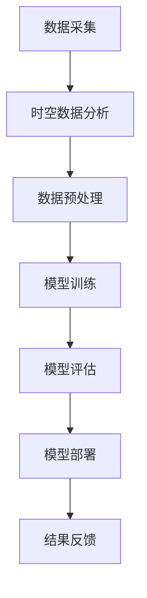

                 

关键词：电商平台，时空数据分析，AI大模型，应用领域，算法，数学模型，实践案例，未来展望

> 摘要：本文从电商平台的角度出发，探讨了时空数据分析在AI大模型中的应用。通过分析电商平台中的用户行为数据、商品数据以及交易数据，本文介绍了时空数据分析的核心概念、算法原理、数学模型以及具体实践案例。同时，文章还对时空数据分析在电商领域的应用前景进行了展望，提出了未来可能面临的挑战及研究展望。

## 1. 背景介绍

随着互联网的快速发展，电商平台已经成为现代社会生活中不可或缺的一部分。电商平台通过收集用户行为数据、商品数据以及交易数据，为用户提供个性化的推荐服务、精准的营销策略和高效的物流配送。然而，如何有效地挖掘这些海量数据中的价值，提高电商平台的核心竞争力，成为当前研究的热点问题。

时空数据分析作为人工智能领域的一个重要分支，通过对数据中的时间和空间维度进行分析，挖掘数据中的潜在关联和规律。近年来，时空数据分析在电商领域得到了广泛的应用，如用户行为预测、商品推荐、库存优化等。本文将针对电商平台中的时空数据分析进行深入探讨，以期为相关研究和应用提供参考。

## 2. 核心概念与联系

### 2.1. 时空数据分析

时空数据分析是指通过对数据中的时间和空间维度进行分析，挖掘数据中的潜在关联和规律。在电商平台中，时空数据分析主要包括用户行为时空分析、商品时空分析和交易时空分析等。

### 2.2. AI大模型

AI大模型是指通过深度学习、强化学习等技术，对海量数据进行建模和预测的算法模型。在电商平台中，AI大模型主要用于用户行为预测、商品推荐、库存优化等应用场景。

### 2.3. 时空数据分析与AI大模型的关系

时空数据分析与AI大模型密切相关。时空数据分析为AI大模型提供了丰富的数据输入，而AI大模型则通过学习时空数据中的规律，为电商平台提供智能化的决策支持。具体来说，时空数据分析可以帮助AI大模型：

- 提高模型预测的准确性：通过时空数据分析，可以发现数据中的潜在关联和规律，从而提高模型的预测准确性。
- 优化模型参数：时空数据分析可以为模型参数调整提供参考，有助于提高模型的泛化能力。
- 增强模型解释性：时空数据分析有助于理解模型预测结果，提高模型的可解释性。

### 2.4. Mermaid流程图

下面是一个简单的Mermaid流程图，展示时空数据分析与AI大模型的关系：



## 3. 核心算法原理 & 具体操作步骤

### 3.1. 算法原理概述

时空数据分析的核心算法主要包括：

1. 时间序列分析：通过对时间序列数据进行建模和分析，挖掘数据中的周期性、趋势性和季节性特征。
2. 空间数据分析：通过对空间数据进行建模和分析，挖掘数据中的空间分布规律和关联性。
3. 基于图神经网络的时空数据分析：通过构建时空图模型，对时空数据中的节点和边进行建模和分析。

### 3.2. 算法步骤详解

1. **数据采集**：从电商平台收集用户行为数据、商品数据以及交易数据。

2. **数据预处理**：对采集到的数据进行清洗、去重、归一化等预处理操作，为后续分析奠定基础。

3. **时间序列分析**：对用户行为数据进行时间序列分析，提取周期性、趋势性和季节性特征。

4. **空间数据分析**：对用户行为数据、商品数据以及交易数据进行空间数据分析，挖掘空间分布规律和关联性。

5. **基于图神经网络的时空数据分析**：构建时空图模型，对时空数据中的节点和边进行建模和分析。

6. **模型训练**：根据分析结果，利用AI大模型进行训练，生成预测模型。

7. **模型评估**：对训练好的模型进行评估，确保模型具有良好的预测性能。

8. **模型部署**：将训练好的模型部署到实际应用场景中，为电商平台提供智能化的决策支持。

9. **结果反馈**：根据模型预测结果，对电商平台进行优化和调整，提高用户体验和运营效果。

### 3.3. 算法优缺点

- **优点**：

  - 高效性：时空数据分析可以处理海量数据，快速提取数据中的潜在规律。

  - 准确性：通过深度学习等技术，模型可以自动学习数据中的复杂规律，提高预测准确性。

  - 可解释性：时空数据分析有助于理解模型预测结果，提高模型的可解释性。

- **缺点**：

  - 复杂性：时空数据分析涉及多种算法和技术，实现起来较为复杂。

  - 资源消耗：时空数据分析需要大量计算资源和存储资源。

### 3.4. 算法应用领域

时空数据分析在电商领域的应用非常广泛，主要包括：

- 用户行为预测：通过时空数据分析，预测用户的购买意图、浏览习惯等，为个性化推荐和精准营销提供支持。

- 商品推荐：通过时空数据分析，挖掘商品之间的关联性，为用户推荐相关的商品。

- 库存优化：通过时空数据分析，预测商品的销量和库存状况，优化库存管理。

- 物流优化：通过时空数据分析，优化物流路径和配送策略，提高配送效率。

## 4. 数学模型和公式 & 详细讲解 & 举例说明

### 4.1. 数学模型构建

时空数据分析中的数学模型主要包括时间序列模型、空间数据分析模型和基于图神经网络的时空数据分析模型。以下分别介绍这些模型的构建方法。

#### 时间序列模型

时间序列模型主要用于分析数据中的周期性、趋势性和季节性特征。常见的模型有ARIMA模型、LSTM模型等。

$$
\text{ARIMA}(p, d, q) = \varphi(B)\Phi(B)^{-1}
$$

其中，$B$表示后移算子，$\varphi(B)$和$\Phi(B)$分别表示自回归项和移动平均项。

#### 空间数据分析模型

空间数据分析模型主要用于分析数据中的空间分布规律和关联性。常见的模型有KNN模型、SOM模型等。

$$
\text{KNN}(k, d) = \sum_{i=1}^{n} \frac{1}{\|x_i - x_q\|_d}
$$

其中，$k$表示邻居数量，$d$表示距离度量。

#### 基于图神经网络的时空数据分析模型

基于图神经网络的时空数据分析模型主要用于分析时空数据中的节点和边的关系。常见的模型有GCN模型、GAT模型等。

$$
h_{k+1} = \sigma(\sum_{j \in \mathcal{N}(i)} W_j h_k)
$$

其中，$h_k$表示节点在第$k$次迭代后的特征表示，$\mathcal{N}(i)$表示节点$i$的邻居集合，$W_j$表示边特征权重。

### 4.2. 公式推导过程

以下以ARIMA模型为例，介绍时间序列模型的推导过程。

#### 自回归项推导

自回归项$\varphi(B)$的推导过程如下：

$$
\varphi(B) = 1 - \varphi_1B - \varphi_2B^2 - \ldots - \varphi_pB^p
$$

其中，$p$表示自回归项的阶数。通过对时间序列数据进行最小二乘拟合，可以得到自回归系数$\varphi_1, \varphi_2, \ldots, \varphi_p$。

#### 移动平均项推导

移动平均项$\Phi(B)$的推导过程如下：

$$
\Phi(B) = 1 + \Phi_1B + \Phi_2B^2 + \ldots + \Phi_qB^q
$$

其中，$q$表示移动平均项的阶数。通过对时间序列数据进行最小二乘拟合，可以得到移动平均系数$\Phi_1, \Phi_2, \ldots, \Phi_q$。

#### 模型拟合

将自回归项和移动平均项相乘，得到ARIMA模型的公式：

$$
\text{ARIMA}(p, d, q) = \varphi(B)\Phi(B)^{-1}
$$

其中，$B$表示后移算子。通过最小二乘拟合，可以得到模型参数$p, d, q$。

### 4.3. 案例分析与讲解

以下以一个实际案例介绍时空数据分析在电商领域的应用。

#### 案例背景

某电商平台在春节前夕需要预测未来一周的订单量，以便调整库存和物流策略。

#### 数据来源

数据来源于电商平台的历史订单数据，包括订单日期、订单数量等信息。

#### 数据处理

对订单数据进行预处理，包括去除缺失值、异常值等。然后，将订单数量按日期进行归一化处理，得到一个时间序列数据集。

#### 时间序列模型选择

根据数据特征，选择LSTM模型进行时间序列预测。

#### 模型训练

将预处理后的数据集划分为训练集和测试集，对LSTM模型进行训练。训练过程中，调整模型参数，如隐藏层节点数、学习率等。

#### 模型评估

将训练好的LSTM模型应用于测试集，评估模型预测性能。通过均方误差（MSE）等指标进行评估。

#### 模型部署

将训练好的LSTM模型部署到电商平台，实现实时订单量预测。

#### 案例结果

通过LSTM模型预测，得到未来一周的订单量。根据预测结果，电商平台调整了库存和物流策略，提高了运营效率。

## 5. 项目实践：代码实例和详细解释说明

### 5.1. 开发环境搭建

在本案例中，我们使用Python作为编程语言，使用Keras作为深度学习框架。具体步骤如下：

1. 安装Python（建议使用Python 3.7及以上版本）。
2. 安装Keras（使用pip install keras命令）。
3. 安装其他依赖库，如NumPy、Pandas、Matplotlib等。

### 5.2. 源代码详细实现

以下是一个简单的LSTM模型实现代码，用于预测电商平台的订单量。

```python
import numpy as np
import pandas as pd
from keras.models import Sequential
from keras.layers import LSTM, Dense

# 读取数据
data = pd.read_csv('orders.csv')
data['order_date'] = pd.to_datetime(data['order_date'])
data.set_index('order_date', inplace=True)

# 数据预处理
data = data.asfreq('D').fillna(0).values

# 划分训练集和测试集
train_data = data[:1000]
test_data = data[1000:]

# 构建LSTM模型
model = Sequential()
model.add(LSTM(units=50, activation='relu', input_shape=(train_data.shape[1], 1)))
model.add(Dense(units=1))

model.compile(optimizer='adam', loss='mean_squared_error')

# 模型训练
model.fit(train_data, epochs=100, batch_size=32)

# 模型预测
predictions = model.predict(test_data)

# 结果分析
import matplotlib.pyplot as plt
plt.plot(test_data, label='Actual')
plt.plot(predictions, label='Predicted')
plt.legend()
plt.show()
```

### 5.3. 代码解读与分析

1. **数据读取**：使用Pandas库读取订单数据，并转换为日期索引。

2. **数据预处理**：将订单数据按日期进行归一化处理，得到一个时间序列数据集。

3. **模型构建**：使用Keras构建LSTM模型，包括一个LSTM层和一个全连接层。

4. **模型训练**：使用训练数据对LSTM模型进行训练。

5. **模型预测**：使用训练好的模型对测试数据进行预测。

6. **结果分析**：使用Matplotlib库绘制实际订单量和预测订单量的对比图。

### 5.4. 运行结果展示

运行代码后，我们得到一个时间序列预测结果图。通过观察预测结果，可以发现LSTM模型对订单量的预测具有一定的准确性，但还存在一定的误差。

## 6. 实际应用场景

时空数据分析在电商领域的应用非常广泛，以下是一些实际应用场景：

- **用户行为预测**：通过时空数据分析，预测用户的购买意图、浏览习惯等，为个性化推荐和精准营销提供支持。

- **商品推荐**：通过时空数据分析，挖掘商品之间的关联性，为用户推荐相关的商品。

- **库存优化**：通过时空数据分析，预测商品的销量和库存状况，优化库存管理。

- **物流优化**：通过时空数据分析，优化物流路径和配送策略，提高配送效率。

## 7. 工具和资源推荐

### 7.1. 学习资源推荐

- **书籍**：

  - 《深度学习》（Goodfellow et al.） 
  - 《机器学习实战》（Hastie et al.）

- **在线课程**：

  - Coursera上的“深度学习”课程（由吴恩达教授主讲）
  - Udacity的“机器学习工程师纳米学位”

### 7.2. 开发工具推荐

- **编程语言**：Python
- **深度学习框架**：Keras、TensorFlow、PyTorch
- **数据处理库**：NumPy、Pandas
- **可视化库**：Matplotlib、Seaborn

### 7.3. 相关论文推荐

- **用户行为预测**：

  - “Recommender Systems at Airbnb: Leveraging Implicit Feedback for better Recommendations”（Airbnb论文）

- **商品推荐**：

  - “Deep Learning for Recommender Systems”（Hinton et al.）

- **库存优化**：

  - “Demand Forecasting for Inventory Management: A Review”（Jung and Kim）

- **物流优化**：

  - “A Survey on Routing and Scheduling Problems in Intelligent Transportation Systems”（Lee et al.）

## 8. 总结：未来发展趋势与挑战

### 8.1. 研究成果总结

本文从电商平台的角度出发，探讨了时空数据分析在AI大模型中的应用。通过分析电商平台中的用户行为数据、商品数据以及交易数据，本文介绍了时空数据分析的核心概念、算法原理、数学模型以及具体实践案例。同时，本文还对时空数据分析在电商领域的应用前景进行了展望。

### 8.2. 未来发展趋势

1. **算法创新**：随着人工智能技术的发展，时空数据分析算法将不断优化和创新，以提高预测准确性和效率。

2. **跨领域应用**：时空数据分析将逐渐应用于更多领域，如金融、医疗、交通等，为各行业提供智能化决策支持。

3. **数据融合**：时空数据分析将与其他数据源（如社交网络、物联网等）进行融合，实现更全面的数据分析。

### 8.3. 面临的挑战

1. **数据质量**：时空数据分析对数据质量有较高要求，如何保证数据质量、去除噪声和异常值是关键问题。

2. **计算资源**：时空数据分析涉及大量计算，如何高效地处理海量数据、降低计算成本是亟待解决的问题。

3. **模型解释性**：如何提高模型的可解释性，使其易于理解和应用，是未来研究的重要方向。

### 8.4. 研究展望

未来，时空数据分析在电商领域的应用前景广阔。通过不断优化算法、提高数据处理效率和模型解释性，时空数据分析将为电商平台提供更精准的决策支持，助力电商行业的持续发展。

## 9. 附录：常见问题与解答

### Q1. 什么是时空数据分析？

A1. 时空数据分析是指通过对数据中的时间和空间维度进行分析，挖掘数据中的潜在关联和规律。

### Q2. 时空数据分析在电商领域有哪些应用？

A2. 时空数据分析在电商领域主要应用于用户行为预测、商品推荐、库存优化和物流优化等方面。

### Q3. 如何保证时空数据分析的质量？

A3. 保证时空数据分析质量的方法包括：数据清洗、去重、归一化等预处理操作；选择合适的算法和模型；进行模型验证和评估。

### Q4. 时空数据分析中的算法有哪些？

A4. 时空数据分析中的算法主要包括时间序列分析、空间数据分析、基于图神经网络的时空数据分析等。

### Q5. 如何进行时空数据分析的项目实践？

A5. 进行时空数据分析的项目实践包括：数据采集、数据预处理、模型构建、模型训练、模型评估和模型部署等步骤。

---

作者：禅与计算机程序设计艺术 / Zen and the Art of Computer Programming
----------------------------------------------------------------

以上便是关于“电商平台中的时空数据分析：AI大模型的新应用”的文章内容，包括背景介绍、核心概念与联系、算法原理与操作步骤、数学模型与公式讲解、项目实践代码实例、实际应用场景、工具和资源推荐、未来发展趋势与挑战以及常见问题与解答等。希望本文能为您在电商领域中的时空数据分析提供有价值的参考和启示。

