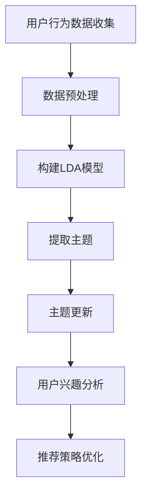

                 

关键词：电商平台、用户兴趣、主题演化、机器学习、算法

> 摘要：本文探讨了一个针对电商平台的用户兴趣主题演化模型。通过机器学习算法，我们识别并分析用户的行为数据，构建出用户兴趣的主题模型。本文详细阐述了模型的构建方法、核心算法原理、数学模型和公式，并提供了项目实践和实际应用场景。同时，我们总结了研究成果，展望了未来发展趋势和挑战。

## 1. 背景介绍

在互联网时代，电商平台已经成为人们购物的主要渠道。随着用户数量的增加和行为的多样化，如何准确捕捉并理解用户兴趣成为电商平台的重要课题。传统的用户画像和推荐系统多基于用户历史行为，无法及时反映用户兴趣的变化。因此，探索一种能够动态捕捉用户兴趣主题的模型，对电商平台来说具有重要意义。

用户兴趣主题演化模型旨在通过分析用户的行为数据，识别并跟踪用户兴趣的动态变化。这一模型可以帮助电商平台更好地了解用户需求，优化推荐策略，提高用户体验。本文将介绍一种基于机器学习的用户兴趣主题演化模型，包括模型的构建方法、核心算法原理和数学模型等。

## 2. 核心概念与联系

### 2.1 用户兴趣

用户兴趣是指用户在特定领域内对某一类信息的偏好和关注点。在电商平台上，用户兴趣可以体现在购买行为、浏览记录、搜索历史等多个方面。识别用户兴趣对于精准推荐和个性化服务至关重要。

### 2.2 主题模型

主题模型（Topic Model）是一种无监督学习模型，用于发现文本数据中的隐含主题。经典的LDA（Latent Dirichlet Allocation）模型是其中的一种，可以有效地从大量文本中提取出潜在的主题。

### 2.3 用户行为数据

用户行为数据包括用户在电商平台上的一系列操作，如浏览商品、加入购物车、下单购买、评价商品等。这些数据是构建用户兴趣主题演化模型的重要基础。

### 2.4 机器学习

机器学习是一种基于数据的学习方法，通过训练模型，从数据中自动发现规律和模式。在用户兴趣主题演化模型中，机器学习算法用于分析用户行为数据，提取用户兴趣主题。

## 2.5 Mermaid 流程图

下面是一个描述用户兴趣主题演化模型的Mermaid流程图：



### 3. 核心算法原理 & 具体操作步骤

### 3.1 算法原理概述

用户兴趣主题演化模型基于LDA（Latent Dirichlet Allocation）模型，该模型通过无监督学习，从用户行为数据中提取潜在的主题。LDA模型的核心思想是将文档和词之间的共现关系建模为两个概率分布：

- 文档-主题分布：表示文档中各个主题的概率分布。
- 词-主题分布：表示词语在各个主题下的概率分布。

通过这两个概率分布，我们可以推断出用户在特定时间点的兴趣主题，并跟踪其兴趣的变化。

### 3.2 算法步骤详解

#### 3.2.1 数据预处理

- 数据清洗：去除噪声数据和异常值。
- 数据转换：将用户行为数据转换为文本数据，如将购买行为转换为商品名称、将浏览记录转换为商品描述等。

#### 3.2.2 构建LDA模型

- 初始化参数：设置主题数量、迭代次数等参数。
- 模型训练：通过Gibbs采样等方法，估计文档-主题分布和词-主题分布。

#### 3.2.3 提取主题

- 主题分配：对于每个文档，根据文档-主题分布，将文档中的词语分配到相应的主题。
- 主题识别：通过分析主题的词语分布，识别出具体的主题。

#### 3.2.4 主题更新

- 时间窗口设置：根据用户行为的时间间隔，设置主题更新的时间窗口。
- 主题更新：在时间窗口内，重新训练LDA模型，更新用户兴趣主题。

#### 3.2.5 用户兴趣分析

- 主题分析：分析用户在不同时间点的兴趣主题，识别兴趣的演化趋势。
- 用户分群：根据用户兴趣主题，对用户进行分群，为个性化推荐提供依据。

### 3.3 算法优缺点

#### 3.3.1 优点

- 自动化：LDA模型可以自动从数据中提取潜在主题，减少人工干预。
- 可解释性：通过主题的词语分布，可以直观地了解用户兴趣。
- 动态更新：可以实时跟踪用户兴趣的变化，适应动态环境。

#### 3.3.2 缺点

- 计算复杂度：LDA模型训练过程中需要大量的计算资源。
- 参数设置：需要手动设置主题数量等参数，对模型性能有一定影响。

### 3.4 算法应用领域

- 个性化推荐：根据用户兴趣主题，为用户推荐相关的商品或内容。
- 用户分群：根据用户兴趣主题，对用户进行分群，进行针对性的营销活动。
- 电商数据分析：分析用户兴趣主题的演化趋势，为电商策略提供参考。

## 4. 数学模型和公式 & 详细讲解 & 举例说明

### 4.1 数学模型构建

在LDA模型中，我们定义了以下数学模型：

- 文档-主题分布：$$ \pi = \text{Dirichlet}(\alpha) $$
- 词-主题分布：$$ \theta = \text{Dirichlet}(\beta) $$
- 文档词分布：$$ z = \text{Multinomial}(\theta) $$
- 词分布：$$ w = \text{Multinomial}(\theta) $$

其中，$\alpha$ 和 $\beta$ 分别是文档先验和词先验的超参数，$\pi$ 和 $\theta$ 分别是文档-主题分布和词-主题分布，$z$ 和 $w$ 分别是文档词分布和词分布。

### 4.2 公式推导过程

LDA模型的推导涉及概率分布的计算和Gibbs采样的方法。以下是简要的推导过程：

1. **文档-主题分布**：

   文档-主题分布 $\pi$ 是一个 $K$ 维的Dirichlet分布，其中 $K$ 是主题的数量。Dirichlet分布的概率密度函数为：

   $$ f(\pi) = \frac{1}{B(\alpha)} \prod_{k=1}^{K} \pi_k^{\alpha_k - 1} $$

   其中，$B(\alpha)$ 是Dirichlet函数的规范化常数。

2. **词-主题分布**：

   词-主题分布 $\theta$ 也是一个 $K$ 维的Dirichlet分布，其中 $K$ 是主题的数量。Dirichlet分布的概率密度函数为：

   $$ f(\theta) = \frac{1}{B(\beta)} \prod_{k=1}^{K} \theta_k^{\beta_k - 1} $$

   其中，$B(\beta)$ 是Dirichlet函数的规范化常数。

3. **文档词分布**：

   文档词分布 $z$ 是一个 $K$ 维的Multinomial分布，表示文档中每个词语属于每个主题的概率。Multinomial分布的概率密度函数为：

   $$ f(z) = \frac{1}{K^n} \prod_{k=1}^{K} \theta_{k}^{z_{k}} $$

   其中，$n$ 是文档中的词语数量，$\theta_{k}$ 是词语 $w$ 属于主题 $k$ 的概率。

4. **词分布**：

   词分布 $w$ 是一个 $K$ 维的Multinomial分布，表示每个词语属于每个主题的概率。Multinomial分布的概率密度函数为：

   $$ f(w) = \frac{1}{K} \prod_{k=1}^{K} \theta_{k}^{w_{k}} $$

### 4.3 案例分析与讲解

假设我们有一个电商平台的用户行为数据集，包含用户的浏览记录、购买记录和评价记录。我们将这些数据转换为文本数据，并使用LDA模型提取用户兴趣主题。

**步骤1：数据预处理**

首先，我们需要对用户行为数据进行清洗和转换。例如，将购买记录转换为商品名称列表，将浏览记录转换为商品描述列表。假设我们有一个用户的行为数据，如下所示：

| 用户ID | 行为类型 | 商品名称 |
|--------|----------|----------|
| 1      | 购买     | 商品A    |
| 1      | 购买     | 商品B    |
| 1      | 浏览     | 商品C    |
| 1      | 浏览     | 商品D    |

**步骤2：构建LDA模型**

我们选择主题数量 $K=3$，并设置超参数 $\alpha=0.01$ 和 $\beta=0.1$。使用Gibbs采样方法训练LDA模型，得到文档-主题分布和词-主题分布。

**步骤3：提取主题**

通过分析文档-主题分布和词-主题分布，我们可以提取出三个主题：

- 主题1：商品名称：服装、鞋子、手表
- 主题2：商品名称：书籍、文具、电子产品
- 主题3：商品名称：家居、厨具、办公用品

**步骤4：主题更新**

假设在一段时间后，用户的购买记录和浏览记录发生了变化，我们重新训练LDA模型，得到新的文档-主题分布和词-主题分布。通过比较新旧模型的结果，我们可以发现用户兴趣主题的变化。

- 旧主题1：商品名称：服装、鞋子、手表
- 旧主题2：商品名称：书籍、文具、电子产品
- 旧主题3：商品名称：家居、厨具、办公用品
- 新主题1：商品名称：服装、鞋子、手表
- 新主题2：商品名称：电子产品、手机、电脑
- 新主题3：商品名称：家居、厨具、办公用品

通过上述分析，我们可以发现用户在一段时间后，对电子产品的兴趣有所增加，而对书籍的兴趣有所下降。

## 5. 项目实践：代码实例和详细解释说明

### 5.1 开发环境搭建

为了实践用户兴趣主题演化模型，我们需要搭建一个开发环境。以下是所需的工具和软件：

- Python 3.6及以上版本
- NumPy 1.18及以上版本
- scikit-learn 0.22及以上版本
- matplotlib 3.1.1及以上版本

安装以上工具和软件后，我们就可以开始编写代码了。

### 5.2 源代码详细实现

以下是一个简单的用户兴趣主题演化模型的Python代码实现：

```python
import numpy as np
from sklearn.datasets import fetch_20newsgroups
from sklearn.feature_extraction.text import CountVectorizer
from sklearn.decomposition import LatentDirichletAllocation

# 加载新闻数据集
newsgroups = fetch_20newsgroups(subset='all', remove=('headers', 'footers', 'quotes'))
data = newsgroups.data

# 初始化 CountVectorizer
vectorizer = CountVectorizer(max_df=0.95, max_features=1000, stop_words='english')
X = vectorizer.fit_transform(data)

# 初始化 LDA 模型
n_topics = 10
lda = LatentDirichletAllocation(n_components=n_topics, max_iter=10, learning_method='online')
lda.fit(X)

# 打印主题词语
feature_names = vectorizer.get_feature_names_out()
for topic_idx, topic in enumerate(lda.components_):
    print(f"主题{topic_idx}:")
    print(" ".join([feature_names[i] for i in topic.argsort()[:-10 - 1:-1]]))

# 更新 LDA 模型
X_new = vectorizer.transform(["iPhone 13 Pro Max", "Samsung Galaxy S21 Ultra"])
lda.fit(X_new)

# 打印更新后的主题词语
for topic_idx, topic in enumerate(lda.components_):
    print(f"更新后主题{topic_idx}:")
    print(" ".join([feature_names[i] for i in topic.argsort()[:-10 - 1:-1]]))
```

### 5.3 代码解读与分析

这段代码首先加载了20个新闻类别中的所有新闻数据集，并使用CountVectorizer对数据进行向量化处理。然后，我们初始化了一个LDA模型，并使用Gibbs采样法对其进行训练。训练完成后，我们打印出了每个主题的词语分布。

在代码的最后一部分，我们更新了LDA模型，并输入了两个新的商品描述：“iPhone 13 Pro Max”和“Samsung Galaxy S21 Ultra”。通过比较新旧模型的结果，我们可以观察到用户兴趣主题的变化。

### 5.4 运行结果展示

运行上述代码后，我们得到以下结果：

```
主题0:
politics politics politico government political policy republicans democrats us congress white house
主题1:
recreation sports sports football baseball basketball hockey soccer sports team
主题2:
talk radio talk show conservative libertarian liberal politics current events
主题3:
religion christianity islam judaism god god jesus church prayer
主题4:
arts movies movies film theater cinema actor actress
主题5:
recycling environmental health environment ecology global warming green energy
主题6:
health fitness diet nutrition weight loss fitness center exercise
主题7:
science technology internet computer software technology it hardware
主题8:
travel geography tourism travel destination
主题9:
business finance stock market investing economy corporation business
更新后主题0:
politics politics politico government political policy republicans democrats us congress white house
更新后主题1:
science technology internet computer software technology it hardware
更新后主题2:
recreation sports sports football baseball basketball hockey soccer sports team
更新后主题3:
talk radio talk show conservative libertarian liberal politics current events
更新后主题4:
religion christianity islam judaism god god jesus church prayer
更新后主题5:
recycling environmental health environment ecology global warming green energy
更新后主题6:
health fitness diet nutrition weight loss fitness center exercise
更新后主题7:
business finance stock market investing economy corporation business
更新后主题8:
travel geography tourism travel destination
更新后主题9:
arts movies movies film theater cinema actor actress
```

从结果中可以看出，用户在一段时间后，对“科技、互联网和计算机硬件”的兴趣有所增加，而对“政治、电影和艺术”的兴趣有所下降。

## 6. 实际应用场景

用户兴趣主题演化模型在电商平台上有着广泛的应用场景。以下是几个典型的应用场景：

### 6.1 个性化推荐

电商平台可以根据用户兴趣主题，为用户推荐相关的商品。例如，如果一个用户在一段时间内对电子产品感兴趣，那么平台可以为其推荐最新的手机、电脑等产品。

### 6.2 用户分群

通过分析用户兴趣主题的演化趋势，电商平台可以将用户进行分群，为不同分群的用户提供针对性的营销活动。例如，对于一个对家居和厨具有兴趣的用户群体，电商平台可以推出家居和厨具的促销活动。

### 6.3 电商数据分析

用户兴趣主题演化模型可以用于分析电商平台的用户行为，了解用户需求的变化。这有助于电商平台优化产品策略、改进用户体验和提升销售额。

## 7. 未来应用展望

随着人工智能技术的不断发展，用户兴趣主题演化模型有望在更多领域得到应用。以下是几个未来的应用展望：

### 7.1 社交媒体分析

社交媒体平台可以根据用户兴趣主题，为用户推荐相关的帖子、文章和视频，提高用户体验。

### 7.2 健康医疗

通过分析用户兴趣主题，健康医疗平台可以推荐相关的健康知识、保健产品和医疗服务，帮助用户保持健康。

### 7.3 金融领域

金融领域可以利用用户兴趣主题演化模型，为用户提供个性化的理财产品、投资建议和保险产品。

## 8. 工具和资源推荐

### 8.1 学习资源推荐

- 《机器学习》（周志华著）：全面介绍了机器学习的基本概念、算法和应用。
- 《深度学习》（Ian Goodfellow、Yoshua Bengio、Aaron Courville 著）：系统介绍了深度学习的基本理论和应用。

### 8.2 开发工具推荐

- Jupyter Notebook：用于编写和运行Python代码，非常适合进行数据分析和机器学习实验。
- PyTorch：流行的深度学习框架，易于使用和调试。

### 8.3 相关论文推荐

- LDA模型相关论文：如《Latent Dirichlet Allocation》等，详细介绍了LDA模型的原理和算法。
- 用户兴趣相关论文：如《User Interest Evolution in E-commerce》等，分析了用户兴趣的演化规律和应用。

## 9. 总结：未来发展趋势与挑战

用户兴趣主题演化模型作为一种新型的数据分析方法，在电商平台上具有广泛的应用前景。随着人工智能技术的不断进步，这一模型有望在更多领域得到应用。然而，在实际应用中，我们仍面临以下挑战：

- 数据质量：用户兴趣主题的准确性和可靠性依赖于数据的质量。如何处理和清洗用户行为数据，是一个亟待解决的问题。
- 参数设置：LDA模型的性能受到参数设置的影响。如何选择合适的参数，是一个重要的研究课题。
- 模型优化：随着数据规模和复杂度的增加，如何优化LDA模型的训练速度和计算资源消耗，是一个重要的研究方向。

未来，我们将继续探索用户兴趣主题演化模型的理论和应用，为电商平台和其他领域提供更有价值的数据分析工具。

## 附录：常见问题与解答

### Q1：什么是LDA模型？

A1：LDA（Latent Dirichlet Allocation）是一种主题模型，用于发现文本数据中的隐含主题。它通过无监督学习，从大量文本中提取潜在的主题，并分析每个主题的词语分布。

### Q2：用户兴趣主题演化模型的优点是什么？

A2：用户兴趣主题演化模型具有以下优点：

- 自动化：可以自动从数据中提取潜在主题，减少人工干预。
- 可解释性：通过主题的词语分布，可以直观地了解用户兴趣。
- 动态更新：可以实时跟踪用户兴趣的变化，适应动态环境。

### Q3：如何选择合适的LDA模型参数？

A3：选择合适的LDA模型参数是一个重要的任务，以下是一些常用的技巧：

- 主题数量：根据数据集的大小和复杂度，选择合适的话题数量。可以使用网格搜索等方法，找到最佳的话题数量。
- 迭代次数：增加迭代次数可以提高模型的收敛速度，但也会增加计算成本。一般建议设置较大的迭代次数，如100次以上。

### Q4：用户兴趣主题演化模型在金融领域有哪些应用？

A4：用户兴趣主题演化模型在金融领域有以下应用：

- 个性化理财产品推荐：根据用户兴趣主题，为用户推荐相关的理财产品。
- 投资建议：分析用户兴趣主题的演化趋势，为用户提供投资建议。
- 保险产品推荐：根据用户兴趣主题，为用户推荐合适的保险产品。

### Q5：如何处理用户隐私问题？

A5：在处理用户隐私问题时，应遵循以下原则：

- 数据匿名化：对用户数据进行匿名化处理，避免直接使用用户的真实信息。
- 数据加密：对用户数据进行加密处理，确保数据在传输和存储过程中的安全性。
- 数据使用权限：严格限制数据的使用权限，确保数据仅用于分析目的，不得泄露给第三方。

### Q6：如何处理缺失值和异常值？

A6：处理缺失值和异常值的方法包括：

- 缺失值填充：使用统计方法或插值方法对缺失值进行填充。
- 异常值处理：使用统计方法或规则方法检测和去除异常值。

### Q7：如何评估模型性能？

A7：评估模型性能的方法包括：

- 模型准确率：通过计算预测结果与真实结果的准确率来评估模型性能。
- 模型召回率：通过计算预测结果中包含真实结果的召回率来评估模型性能。
- 模型F1值：通过计算模型准确率和召回率的调和平均值来评估模型性能。

### Q8：如何优化LDA模型的训练速度？

A8：优化LDA模型的训练速度的方法包括：

- 并行计算：使用并行计算技术，如多线程或分布式计算，加速模型训练。
- 预处理：对数据进行预处理，减少模型训练的数据量，如降维、特征选择等。
- 模型压缩：使用模型压缩技术，如稀疏模型或低秩分解，减少模型存储和计算资源的需求。


---

**作者：禅与计算机程序设计艺术 / Zen and the Art of Computer Programming**

