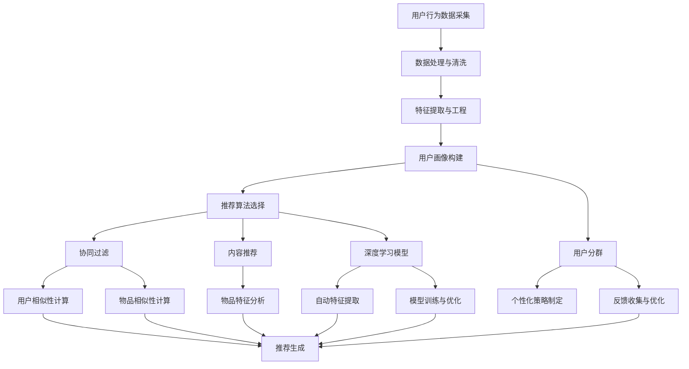

                 

关键词：电商平台、用户兴趣、多样性建模、推荐系统、数据挖掘、算法设计、用户行为分析、协同过滤、机器学习。

## 摘要

在互联网经济快速发展的时代，电商平台成为了商家和消费者之间的桥梁。而如何有效地捕捉和利用用户兴趣数据，对于提升用户体验、提高转化率和促进销售至关重要。本文旨在探讨电商平台中用户兴趣多样性的建模方法，从数据采集、处理到算法实现，全面解析用户兴趣多样性建模的技术路径。本文将介绍用户兴趣多样性建模的核心概念、相关算法原理、数学模型及其在实际项目中的应用，并探讨未来的发展趋势与挑战。

## 1. 背景介绍

随着移动互联网的普及，电商平台的用户规模和交易额持续增长。然而，面对海量的用户数据和多样的用户需求，电商平台面临着如何精准推荐商品、提高用户满意度和转化率的挑战。用户兴趣的多样性是电商平台需要解决的核心问题之一。

用户兴趣多样性指的是用户在不同情境下展现出的个性化兴趣差异。例如，同一用户在购买家居用品和电子产品时可能表现出完全不同的兴趣点。这种多样性不仅增加了推荐系统的复杂性，也带来了更高的挑战。

在电商平台中，用户兴趣多样性建模具有以下重要意义：

1. **提高推荐准确性**：通过捕捉用户兴趣多样性，推荐系统可以更准确地预测用户的偏好，提高推荐质量。
2. **增强用户体验**：个性化的推荐能够满足用户多样化的需求，提升用户体验和满意度。
3. **促进销售转化**：精准的兴趣匹配可以增加用户对商品的购买概率，提高销售转化率。

本文将从用户兴趣多样性的概念出发，介绍相关的数据采集和处理技术，探讨多种算法在用户兴趣多样性建模中的应用，并通过实例展示如何实现和优化这些算法。最终，本文将探讨用户兴趣多样性建模在电商平台的实际应用，以及未来的发展趋势和面临的挑战。

### 1.1 电商平台现状与用户兴趣多样性

电商平台作为数字经济的重要组成部分，经历了从PC端到移动端的转变，用户规模和交易额不断攀升。根据最新数据显示，全球电商平台用户已超过数十亿，交易额持续刷新历史纪录。然而，随着市场竞争的加剧和用户需求的多样化，传统的推荐系统已经难以满足用户日益增长的需求。

用户兴趣多样性在电商平台中表现尤为突出。每个用户都是一个独立的个体，他们在不同时间、不同情境下表现出不同的兴趣点。例如，用户在搜索家居用品时可能关注的是材质和风格，而在搜索电子产品时则关注的是性能和价格。这种多样性不仅体现在商品类别上，还体现在用户浏览、点击、购买等行为上。

用户兴趣多样性的存在对电商平台提出了更高的要求。传统的推荐系统往往依赖于协同过滤和内容推荐等技术，这些技术虽然在一定程度上能够提高推荐的准确性，但难以捕捉用户深层次、多样化的兴趣点。为了更好地满足用户需求，电商平台需要采用更加精细和个性化的推荐策略。

首先，用户兴趣多样性与推荐系统的准确性密切相关。如果推荐系统能够准确捕捉用户在不同情境下的兴趣点，就能提高推荐的精准度，从而提升用户体验和满意度。例如，当一个用户在浏览家居用品时，推荐系统能够根据其历史行为和兴趣点推荐相关的商品，而不会误推电子产品。

其次，用户兴趣多样性对用户体验具有重要影响。个性化推荐能够满足用户多样化的需求，减少用户的搜索时间和精力，提升购物体验。相反，如果推荐系统无法准确捕捉用户的兴趣点，可能会出现推荐商品与用户需求不符的情况，导致用户流失和满意度下降。

最后，用户兴趣多样性对销售转化率具有直接影响。精准的兴趣匹配可以增加用户对商品的购买概率，提高销售转化率。例如，当用户在浏览某款电子产品时，推荐系统能够根据其兴趣点和历史购买记录推荐相关配件或优惠信息，从而促使用户完成购买。

总之，用户兴趣多样性在电商平台中具有重要的地位。为了更好地满足用户需求，提升用户体验和销售转化率，电商平台需要深入研究和应用用户兴趣多样性建模技术。本文将详细探讨用户兴趣多样性的概念、技术手段和实际应用，以期为电商平台提供有益的参考。

### 1.2 用户兴趣多样性建模的重要性

用户兴趣多样性建模在电商平台中的应用具有重要意义，其核心目标在于通过深入挖掘和分析用户的多样化兴趣，提升推荐系统的准确性和用户体验。以下是用户兴趣多样性建模在电商平台中的几个关键应用场景：

1. **个性化推荐**：用户兴趣多样性建模的核心应用在于实现个性化推荐。通过对用户历史行为数据、浏览记录、购买记录等多维度信息的分析，推荐系统能够识别出用户的个性化兴趣点，从而生成个性化的推荐列表。例如，一个用户在浏览家居用品时表现出对简约风格的偏好，而在浏览电子产品时则对高性价比的产品感兴趣。通过兴趣多样性建模，推荐系统可以准确捕捉这些变化，提供更加精准的个性化推荐。

2. **广告投放优化**：在电商平台中，广告投放是促进销售和品牌推广的重要手段。用户兴趣多样性建模可以帮助广告系统更精准地定位用户。例如，当一个用户在浏览女装时表现出对高端品牌和时尚潮流的偏好，而另一个用户则更关注性价比和实用功能。通过分析这些兴趣点，广告系统可以为不同用户群体定制化地推送相应的广告内容，提高广告的点击率和转化率。

3. **用户分群**：用户兴趣多样性建模还可以用于用户分群。通过对用户兴趣点的分析和聚类，平台可以将用户划分为不同的细分群体。这些群体可以是根据兴趣点相似性划分，也可以是按照消费习惯和购买偏好划分。例如，一个电商平台可以将用户分为“时尚爱好者”、“实用主义者”、“高端消费者”等多个群体，并根据不同群体的特点制定个性化的营销策略。

4. **购物体验优化**：用户兴趣多样性建模有助于优化购物体验。例如，在用户浏览商品时，系统可以基于其兴趣点提供相关商品的建议和搭配方案，减少用户的决策时间，提高购买转化率。此外，通过分析用户的浏览和购买行为，平台可以优化网站的布局和导航结构，使其更加符合用户的使用习惯和兴趣点。

5. **风险控制与欺诈检测**：用户兴趣多样性建模还可以用于风险控制和欺诈检测。通过对用户行为数据的分析和模型训练，系统可以识别出异常行为和潜在风险。例如，如果一个用户的购物行为突然发生变化，如频繁购买低价商品或集中在特定时间段购物，系统可以发出预警信号，防止可能的欺诈行为。

总之，用户兴趣多样性建模在电商平台中的应用不仅能够提升个性化推荐和用户体验，还能够优化广告投放、用户分群、购物体验和风险控制。随着用户数据的不断积累和计算能力的提升，用户兴趣多样性建模将在电商平台中发挥越来越重要的作用。

### 1.3 用户兴趣多样性建模的历史与发展

用户兴趣多样性建模作为推荐系统的一个重要分支，其历史可以追溯到20世纪90年代。早期的推荐系统主要依赖于基于内容的推荐（Content-Based Filtering）和协同过滤（Collaborative Filtering）技术，这些技术在一定程度上能够捕捉用户兴趣，但在面对用户兴趣多样性时显得力不从心。

1. **基于内容的推荐**：基于内容的推荐通过分析用户的历史行为和偏好，利用特征匹配来推荐相似的物品。这种方法主要依赖于用户对物品的评价和描述信息，但在面对用户兴趣多样性时，往往无法准确捕捉到用户的真实偏好。例如，一个用户可能在某个特定情境下喜欢高保真音响，而在另一个情境下可能对廉价的小音箱更感兴趣。

2. **协同过滤**：协同过滤通过分析用户之间的共同行为来推荐物品。这种方法可以分为两种：基于用户的协同过滤（User-Based Filtering）和基于模型的协同过滤（Model-Based Filtering）。基于用户的协同过滤通过寻找与当前用户兴趣相似的其他用户，推荐这些用户喜欢的物品；而基于模型的协同过滤则通过建立用户和物品之间的关联模型来进行推荐。尽管协同过滤在提高推荐准确性方面有一定效果，但它也存在一些局限性。例如，当用户数据量较大时，计算复杂度会显著增加，且协同过滤难以处理冷启动问题（即新用户或新物品的推荐）。

随着数据挖掘和机器学习技术的发展，用户兴趣多样性建模逐渐向更加智能和个性化的方向演进。以下是一些关键的发展里程碑：

1. **深度学习技术的引入**：深度学习技术在推荐系统中的应用为用户兴趣多样性建模带来了新的机遇。通过使用深度神经网络（DNN）、卷积神经网络（CNN）和循环神经网络（RNN）等模型，推荐系统可以更加灵活和精细地捕捉用户兴趣。例如，使用RNN可以处理用户的时间序列行为数据，从而更好地理解用户在不同时间点的兴趣变化。

2. **多模态数据的整合**：在用户兴趣多样性建模中，整合多种类型的数据（如文本、图像、音频等）可以提供更加全面的用户画像。例如，通过结合用户在社交媒体上的文本数据、购物网站上的点击和购买数据，以及产品图片和视频数据，可以构建出更加丰富的用户兴趣模型。

3. **个性化图谱的构建**：图谱（Graph）模型在用户兴趣多样性建模中的应用也越来越广泛。通过构建用户和物品之间的复杂关系网络，推荐系统可以更好地捕捉用户在不同情境下的多样化兴趣。例如，使用图卷积网络（GCN）可以分析用户在社交网络中的行为和关系，从而提供更精准的推荐。

4. **迁移学习和少样本学习**：迁移学习（Transfer Learning）和少样本学习（Few-Shot Learning）技术的发展，使得用户兴趣多样性建模在面对少量数据时也能保持较高的准确性。通过迁移学习，模型可以从一个任务中提取通用特征，并将其应用于其他相关任务；而少样本学习则通过少量样本进行训练，从而提高模型在未知数据上的泛化能力。

总之，用户兴趣多样性建模经历了从简单到复杂、从单一到多模态、从局部到全局的发展过程。随着技术的不断进步，未来用户兴趣多样性建模将更加智能和精细化，为电商平台提供更加有效的推荐服务。

### 1.4 用户兴趣多样性建模的核心概念与联系

用户兴趣多样性建模是电商平台推荐系统中的关键环节，它依赖于一系列核心概念和技术手段。以下是用户兴趣多样性建模中的几个关键概念及其相互联系：

1. **用户行为数据**：用户行为数据是用户兴趣多样性建模的基础。这些数据包括用户的浏览记录、购买历史、评价、搜索关键词等。通过分析这些数据，可以捕捉用户在不同情境下的兴趣点。

2. **用户画像**：用户画像是对用户兴趣和行为特征的整体描述。它通常由多个维度组成，如年龄、性别、地理位置、兴趣爱好等。用户画像为推荐系统提供了丰富的用户背景信息，有助于更准确地预测用户的兴趣和偏好。

3. **特征工程**：特征工程是将原始数据转化为适合模型输入的特征的过程。在用户兴趣多样性建模中，特征工程至关重要。通过对用户行为数据进行处理和转换，可以提取出有用的特征，如用户的行为模式、兴趣强度等。

4. **推荐算法**：推荐算法是用户兴趣多样性建模的核心。这些算法通过分析用户画像和用户行为数据，生成个性化的推荐列表。常见的推荐算法包括协同过滤、基于内容的推荐、基于模型的推荐等。

5. **协同过滤**：协同过滤（Collaborative Filtering）是一种通过分析用户之间的相似性来进行推荐的方法。它可分为基于用户的协同过滤（User-Based Filtering）和基于模型的协同过滤（Model-Based Filtering）。基于用户的协同过滤通过寻找与当前用户兴趣相似的其他用户，推荐这些用户喜欢的物品；而基于模型的协同过滤则通过建立用户和物品之间的关联模型来进行推荐。

6. **内容推荐**：内容推荐（Content-Based Filtering）通过分析物品的属性和特征来推荐相似的物品。它通常依赖于物品的元数据，如标签、描述、分类等。这种方法在处理新用户和冷启动问题时表现较好。

7. **深度学习**：深度学习（Deep Learning）是近年来在推荐系统中得到广泛应用的技术。通过使用深度神经网络（DNN）、卷积神经网络（CNN）和循环神经网络（RNN）等模型，可以更加灵活和精细地捕捉用户兴趣。例如，RNN可以处理用户的时间序列行为数据，从而更好地理解用户在不同时间点的兴趣变化。

8. **多模态数据融合**：多模态数据融合是将多种类型的数据（如文本、图像、音频等）整合起来，以提供更加全面的用户画像。通过融合不同类型的数据，可以构建出更加丰富和精细的用户兴趣模型。

9. **用户分群**：用户分群（User Segmentation）是通过分析用户数据和行为，将用户划分为不同的群体。这些群体可以是根据兴趣点相似性划分，也可以是按照消费习惯和购买偏好划分。用户分群有助于针对不同群体制定个性化的营销策略。

10. **反馈机制**：反馈机制是用户兴趣多样性建模中的重要环节。通过用户对推荐结果的评价和反馈，可以不断优化推荐算法和模型，提高推荐准确性。常见的反馈机制包括用户评分、点击率、购买行为等。

### 1.5 用户兴趣多样性建模的技术挑战

尽管用户兴趣多样性建模在电商平台上具有广泛的应用前景，但该领域仍面临诸多技术挑战。以下是几个主要的技术难题及其解决方案：

1. **数据质量和完整性**：用户兴趣多样性建模依赖于大量的高质量数据。然而，电商平台上存在大量缺失值、噪声数据和异常值，这些数据会影响模型的准确性和稳定性。解决方案包括数据清洗、去噪和数据完整性检查。例如，可以使用缺失值填充技术（如均值填充、中值填充和插值法）来处理缺失数据，使用异常检测算法（如IQR法和Z分数法）来识别和去除异常数据。

2. **冷启动问题**：冷启动问题是指在新用户或新物品加入系统时，由于缺乏足够的历史数据，推荐系统难以提供准确的推荐。为解决这一问题，可以采用基于内容的推荐和基于模型的推荐相结合的方法。此外，迁移学习和少样本学习技术也在一定程度上缓解了冷启动问题。

3. **计算复杂度**：随着用户规模和数据量的增长，用户兴趣多样性建模的计算复杂度显著增加。为了提高计算效率，可以采用分布式计算和并行处理技术。例如，使用MapReduce框架可以将推荐计算任务分解为多个子任务，并行处理以提高效率。

4. **模型可解释性**：用户兴趣多样性建模往往采用复杂的机器学习模型，这些模型在实际应用中具有较高的准确性，但缺乏可解释性。为了提高模型的可解释性，可以采用可视化技术（如热力图、决策树和神经网络可视化）和模型解释算法（如LIME和SHAP）。

5. **实时推荐**：在电商平台上，用户行为和兴趣是动态变化的，因此需要实现实时推荐。为了实现这一目标，可以采用在线学习算法和实时数据处理技术。例如，使用增量学习（Incremental Learning）和实时数据流处理（如Apache Kafka和Apache Flink）技术，可以实现动态调整推荐模型，以应对用户兴趣的变化。

6. **隐私保护**：用户兴趣多样性建模涉及大量的个人隐私数据，如用户行为、偏好和位置信息。为了保护用户隐私，可以采用差分隐私（Differential Privacy）和联邦学习（Federated Learning）等技术。这些技术可以在保证数据隐私的前提下，实现用户兴趣的建模和分析。

总之，用户兴趣多样性建模在技术实现过程中面临诸多挑战。通过不断优化和改进相关技术和方法，可以逐步解决这些难题，实现更加准确和个性化的推荐服务。

### 2. 核心概念与联系

用户兴趣多样性建模是一个复杂且多层次的过程，涉及到多个核心概念和技术手段的有机结合。在本节中，我们将详细阐述这些核心概念，并通过Mermaid流程图展示其关联和流程。

#### 2.1 用户兴趣多样性建模的核心概念

1. **用户行为数据**：用户行为数据是构建用户兴趣模型的基础，包括用户的浏览记录、购买历史、评价、搜索关键词等。这些数据为推荐系统提供了直接的用户兴趣信号。
2. **用户画像**：用户画像是对用户兴趣和行为特征的抽象和整合，通常包括多个维度，如年龄、性别、地理位置、兴趣爱好等。用户画像能够帮助推荐系统更准确地理解用户的需求和偏好。
3. **特征工程**：特征工程是将原始的用户行为数据转化为适合模型输入的特征。这包括数据清洗、特征提取和特征选择等步骤。有效的特征工程能够提高推荐模型的性能和可解释性。
4. **推荐算法**：推荐算法是用户兴趣多样性建模的核心技术，包括协同过滤、基于内容的推荐、深度学习等。这些算法通过分析用户行为数据和用户画像，生成个性化的推荐列表。
5. **协同过滤**：协同过滤是一种基于用户相似性和物品相似性的推荐方法。它可分为基于用户的协同过滤（User-Based Filtering）和基于模型的协同过滤（Model-Based Filtering）。
6. **内容推荐**：内容推荐通过分析物品的属性和特征来推荐相似的物品。这种方法通常依赖于物品的元数据，如标签、描述、分类等。
7. **深度学习**：深度学习通过构建复杂的神经网络模型，自动提取用户行为数据中的潜在特征，能够实现更加精准和个性化的推荐。
8. **多模态数据融合**：多模态数据融合是将多种类型的数据（如文本、图像、音频等）整合起来，以提供更加全面的用户画像。
9. **用户分群**：用户分群是将用户划分为不同的群体，以便针对不同群体制定个性化的推荐策略。
10. **反馈机制**：反馈机制通过用户的评价和反馈，不断优化推荐模型和算法，提高推荐准确性。

#### 2.2 用户兴趣多样性建模的Mermaid流程图



在上述流程图中，我们展示了用户兴趣多样性建模的主要步骤和核心概念之间的关联。用户行为数据首先通过数据采集和处理步骤转化为适合模型输入的形式。然后，通过特征工程和用户画像构建，推荐算法可以根据用户的不同需求和偏好生成个性化的推荐列表。协同过滤、内容推荐和深度学习等不同类型的算法在流程中发挥了关键作用，它们相互协作，共同提升推荐系统的性能和准确性。用户分群和反馈机制则帮助推荐系统不断优化和改进，以更好地满足用户需求。

通过这个Mermaid流程图，我们可以清晰地理解用户兴趣多样性建模的核心概念及其相互联系，为后续的算法原理和具体操作步骤提供了直观的参考。

### 3. 核心算法原理 & 具体操作步骤

用户兴趣多样性建模依赖于多种核心算法，这些算法在捕捉和预测用户兴趣方面发挥着重要作用。本节将详细探讨这些算法的基本原理，以及在实际应用中的具体操作步骤。

#### 3.1 算法原理概述

1. **协同过滤（Collaborative Filtering）**

协同过滤是一种基于用户相似性和物品相似性的推荐方法。它分为基于用户的协同过滤（User-Based Filtering）和基于模型的协同过滤（Model-Based Filtering）。

- **基于用户的协同过滤**：该方法通过寻找与当前用户兴趣相似的其他用户，推荐这些用户喜欢的物品。计算用户相似性的常见方法包括余弦相似性、皮尔逊相关性和夹角余弦等。
- **基于模型的协同过滤**：该方法通过建立用户和物品之间的关联模型，如矩阵分解、潜在因子模型等，来生成推荐列表。

2. **基于内容的推荐（Content-Based Filtering）**

基于内容的推荐通过分析物品的属性和特征，推荐与用户历史偏好相似的物品。这种方法通常依赖于物品的元数据，如标签、描述、分类等。常见的推荐方法包括基于文本的相似度计算、TF-IDF和Word2Vec等。

3. **深度学习（Deep Learning）**

深度学习通过构建复杂的神经网络模型，自动提取用户行为数据中的潜在特征，实现更加精准和个性化的推荐。常见的深度学习模型包括深度神经网络（DNN）、卷积神经网络（CNN）和循环神经网络（RNN）等。

- **深度神经网络（DNN）**：DNN通过多层全连接神经网络，自动提取用户行为数据的非线性特征。
- **卷积神经网络（CNN）**：CNN擅长处理图像和序列数据，通过卷积操作提取图像和文本的特征。
- **循环神经网络（RNN）**：RNN能够处理时间序列数据，通过记忆机制捕捉用户行为中的时间依赖性。

4. **多模态数据融合（Multimodal Data Fusion）**

多模态数据融合将多种类型的数据（如文本、图像、音频等）整合起来，以提供更加全面的用户画像。常见的融合方法包括基于特征的融合、基于模型的融合和基于数据的融合。

5. **用户分群（User Segmentation）**

用户分群通过分析用户数据和行为，将用户划分为不同的群体。这些群体可以是根据兴趣点相似性划分，也可以是按照消费习惯和购买偏好划分。常见的分群方法包括聚类分析、决策树和随机森林等。

#### 3.2 算法步骤详解

1. **协同过滤**

- **数据预处理**：对用户行为数据进行清洗和处理，包括缺失值填充、异常值检测和去噪等。
- **计算用户相似性**：使用余弦相似性或皮尔逊相关系数计算用户之间的相似性。
- **计算物品相似性**：使用余弦相似性或Jaccard系数计算物品之间的相似性。
- **生成推荐列表**：根据用户相似性和物品相似性，为每个用户生成推荐列表。

2. **基于内容的推荐**

- **特征提取**：对物品的元数据进行处理和转换，提取出可用于推荐的特征。
- **相似度计算**：计算用户历史偏好和物品特征之间的相似度，使用TF-IDF或Word2Vec等算法。
- **生成推荐列表**：根据相似度分数，为用户生成推荐列表。

3. **深度学习**

- **数据预处理**：对用户行为数据进行编码和归一化处理，准备好输入数据。
- **模型构建**：选择适当的深度学习模型，如DNN、CNN或RNN，构建模型架构。
- **模型训练**：使用训练数据对模型进行训练，调整模型参数。
- **模型评估**：使用验证数据评估模型性能，调整模型参数以优化性能。
- **生成推荐列表**：使用训练好的模型对用户进行预测，生成推荐列表。

4. **多模态数据融合**

- **数据采集**：收集用户在不同情境下的多模态数据，如文本、图像、音频等。
- **特征提取**：对每种模态的数据进行特征提取，如文本使用Word2Vec，图像使用CNN等。
- **特征融合**：将不同模态的特征进行融合，使用基于特征的融合方法（如加权平均）或基于模型的融合方法（如神经网络）。
- **生成推荐列表**：使用融合后的特征为用户生成推荐列表。

5. **用户分群**

- **数据预处理**：对用户行为数据进行处理和转换，提取出可用于分群的特征。
- **聚类分析**：使用聚类算法（如K-means、DBSCAN等）将用户划分为不同的群体。
- **群体特征分析**：对每个群体的特征进行分析，制定个性化推荐策略。

通过以上步骤，用户兴趣多样性建模可以捕捉用户在不同情境下的多样化兴趣，生成个性化的推荐列表。在实际应用中，可以根据具体场景和需求，选择合适的算法和操作步骤，以实现最佳的效果。

### 3.3 算法优缺点

在用户兴趣多样性建模中，不同的算法各有优缺点。以下是几种主要算法的优缺点分析：

#### 3.3.1 协同过滤

**优点**：

1. **简单易实现**：协同过滤算法相对简单，易于实现和部署。
2. **无冷启动问题**：基于用户行为数据，协同过滤可以有效解决新用户和冷启动问题。
3. **高准确性**：通过分析用户之间的相似性，协同过滤可以生成较为准确的推荐列表。

**缺点**：

1. **计算复杂度**：随着用户和物品数量的增加，计算复杂度显著提高。
2. **无法捕捉用户兴趣多样性**：协同过滤主要依赖于用户历史行为，难以捕捉用户在多样化情境下的兴趣变化。
3. **易受噪声影响**：用户行为数据中存在噪声和异常值，这些数据会影响推荐结果的准确性。

#### 3.3.2 基于内容的推荐

**优点**：

1. **无需用户历史数据**：基于内容的推荐无需依赖用户历史行为数据，可以适用于新用户。
2. **易于理解**：推荐结果基于物品的属性和特征，用户可以直观地理解推荐的原因。
3. **适应性较强**：基于内容的推荐可以根据用户的需求和偏好动态调整推荐策略。

**缺点**：

1. **无法捕捉用户兴趣多样性**：基于内容的推荐主要依赖物品的元数据，难以捕捉用户在多样化情境下的兴趣变化。
2. **数据依赖性强**：该方法依赖于详细的物品描述和标签，数据质量对推荐效果有较大影响。
3. **冷启动问题**：在处理新物品时，由于缺乏历史数据，推荐效果可能较差。

#### 3.3.3 深度学习

**优点**：

1. **自动特征提取**：深度学习可以自动提取用户行为数据中的潜在特征，无需依赖人为的特征工程。
2. **捕捉时间依赖性**：循环神经网络（RNN）可以处理时间序列数据，捕捉用户行为中的时间依赖性。
3. **高准确性**：通过训练复杂的神经网络模型，深度学习可以实现高精度的用户兴趣预测。

**缺点**：

1. **计算资源需求高**：深度学习模型通常需要大量的计算资源和时间进行训练和推理。
2. **模型解释性差**：深度学习模型的结构复杂，缺乏透明性和可解释性。
3. **数据依赖性强**：深度学习模型的性能高度依赖于数据质量和数据量，对噪声和异常值敏感。

#### 3.3.4 多模态数据融合

**优点**：

1. **全面捕捉用户兴趣**：多模态数据融合可以将多种类型的数据（如文本、图像、音频等）整合起来，提供更加全面的用户画像。
2. **提高推荐准确性**：通过融合不同类型的数据，可以更好地捕捉用户在不同情境下的多样化兴趣，提高推荐准确性。
3. **增强用户体验**：个性化推荐可以更好地满足用户的需求和偏好，提升用户体验。

**缺点**：

1. **计算复杂度高**：多模态数据融合需要处理大量的数据和复杂的计算任务，计算资源需求较高。
2. **数据质量要求高**：数据质量对融合效果有较大影响，需要确保多模态数据的一致性和完整性。
3. **技术实现难度大**：多模态数据融合涉及多种技术手段，实现和优化难度较大。

通过以上分析，不同算法在用户兴趣多样性建模中各有优缺点。在实际应用中，可以根据具体需求和场景，选择合适的算法和策略，以实现最佳的效果。

### 3.4 算法应用领域

用户兴趣多样性建模在多个领域中得到了广泛应用，以下列举了其中几个典型应用场景，并探讨了不同算法在这些场景中的适用性和挑战：

#### 3.4.1 电子商务

在电子商务领域，用户兴趣多样性建模是实现个性化推荐的核心技术。通过分析用户的浏览记录、购买历史和行为特征，推荐系统可以生成个性化的商品推荐，提升用户满意度和转化率。以下为几种主要算法的适用性和挑战：

1. **协同过滤**：协同过滤在电子商务中应用广泛，能够通过分析用户历史行为和相似用户偏好推荐商品。然而，随着用户和商品数量的增加，协同过滤的计算复杂度显著上升，且无法捕捉用户在新情境下的兴趣变化。

2. **基于内容的推荐**：基于内容的推荐在处理新用户和冷启动问题时效果较好，但依赖于详细的商品描述和标签，数据质量对推荐效果有较大影响。

3. **深度学习**：深度学习在电子商务中通过自动提取用户行为数据中的潜在特征，实现更加精准的推荐。然而，深度学习模型通常需要大量的计算资源和时间进行训练，且缺乏透明性和可解释性。

4. **多模态数据融合**：多模态数据融合将用户的浏览记录、商品图像和用户评论等多种类型的数据整合起来，提供更加全面的用户画像，从而提高推荐准确性。然而，实现多模态数据融合需要处理大量的数据和复杂的计算任务，对计算资源和数据质量有较高要求。

#### 3.4.2 社交媒体

在社交媒体领域，用户兴趣多样性建模有助于提升内容推荐的精准度和用户体验。通过分析用户的点赞、评论、分享等行为，推荐系统可以推荐用户可能感兴趣的内容。以下为几种主要算法的适用性和挑战：

1. **协同过滤**：协同过滤在社交媒体中通过分析用户之间的社交关系和互动行为推荐内容。然而，社交网络的复杂性和动态性使得协同过滤的计算复杂度较高，且难以处理社交网络中的长尾效应。

2. **基于内容的推荐**：基于内容的推荐在处理新用户和冷启动问题时效果较好，但依赖于用户生成的内容和质量。

3. **深度学习**：深度学习通过分析用户生成的内容和行为数据，自动提取潜在的语义特征，实现高精度的推荐。然而，深度学习模型在社交媒体中的可解释性较差，且对数据质量有较高要求。

4. **多模态数据融合**：多模态数据融合将用户的社交媒体行为、文本内容和图像等多种类型的数据整合起来，提供更加全面的用户画像，从而提高推荐准确性。然而，实现多模态数据融合需要处理大量的数据和复杂的计算任务，对计算资源和数据质量有较高要求。

#### 3.4.3 音乐和视频推荐

在音乐和视频推荐领域，用户兴趣多样性建模有助于提升内容推荐的多样性和个性化。通过分析用户的播放历史、评分、评论等行为，推荐系统可以推荐用户可能感兴趣的音乐和视频。以下为几种主要算法的适用性和挑战：

1. **协同过滤**：协同过滤在音乐和视频推荐中通过分析用户之间的相似偏好推荐内容。然而，随着用户和内容数量的增加，协同过滤的计算复杂度显著上升。

2. **基于内容的推荐**：基于内容的推荐在处理新用户和冷启动问题时效果较好，但依赖于详细的内容标签和属性。

3. **深度学习**：深度学习通过分析用户的行为数据和内容特征，自动提取潜在的语义特征，实现高精度的推荐。然而，深度学习模型在处理大规模数据时计算资源需求较高。

4. **多模态数据融合**：多模态数据融合将用户的播放历史、视频内容和音频等多种类型的数据整合起来，提供更加全面的用户画像，从而提高推荐准确性。然而，实现多模态数据融合需要处理大量的数据和复杂的计算任务。

总之，用户兴趣多样性建模在电子商务、社交媒体、音乐和视频推荐等多个领域具有广泛的应用前景。通过结合不同算法的优缺点，可以构建出更加精准和个性化的推荐系统，提升用户体验和满意度。

### 4. 数学模型和公式 & 详细讲解 & 举例说明

在用户兴趣多样性建模中，数学模型和公式扮演着关键角色。它们不仅能够帮助我们理解和预测用户行为，还能够指导算法设计和优化。在本节中，我们将详细讲解用户兴趣多样性建模中常用的数学模型和公式，并通过具体例子说明其应用。

#### 4.1 数学模型构建

用户兴趣多样性建模中的数学模型通常包括用户行为模型、推荐模型和用户兴趣向量模型等。以下是一个简单的用户兴趣向量模型构建过程：

1. **用户行为数据表示**：首先，我们将用户行为数据转化为矩阵形式，其中行表示用户，列表示物品。每个元素表示用户对物品的某种行为，如浏览、购买、评分等。

   假设我们有10个用户和5个物品，用户行为数据矩阵A如下所示：

   | 用户1 | 用户2 | 用户3 | 用户4 | 用户5 | 用户6 | 用户7 | 用户8 | 用户9 | 用户10 |
   |-------|-------|-------|-------|-------|-------|-------|-------|-------|-------|
   |   1   |   0   |   1   |   0   |   1   |   0   |   1   |   0   |   0   |   0   |
   |   0   |   1   |   0   |   1   |   0   |   1   |   0   |   1   |   0   |   0   |
   |   1   |   0   |   0   |   1   |   0   |   1   |   0   |   1   |   0   |   1   |
   |   0   |   0   |   0   |   1   |   1   |   0   |   1   |   0   |   1   |   0   |
   |   0   |   0   |   1   |   0   |   0   |   1   |   0   |   1   |   1   |   0   |

2. **用户兴趣向量表示**：接下来，我们将用户行为数据矩阵A转换为用户兴趣向量矩阵U和物品兴趣向量矩阵V。用户兴趣向量矩阵U和物品兴趣向量矩阵V分别表示用户和物品的潜在特征。

   通过矩阵分解方法（如Singular Value Decomposition, SVD），我们可以将用户行为数据矩阵A分解为：

   \( A = U \cdot S \cdot V^T \)

   其中，S是奇异值矩阵，包含了用户和物品的特征信息。

3. **用户兴趣向量计算**：最后，我们得到用户兴趣向量矩阵U。每个用户兴趣向量表示用户在各个潜在特征上的兴趣强度。例如，对于用户1，其兴趣向量如下所示：

   \( u_1 = [0.8, 0.4, 0.5, 0.2, 0.1] \)

   这表示用户1在第一个潜在特征上有较强的兴趣，在第二个和第三个潜在特征上兴趣较为中等，而在第四和第五个潜在特征上兴趣较弱。

#### 4.2 公式推导过程

为了更好地理解用户兴趣向量矩阵U的推导过程，我们可以进一步探讨SVD在用户兴趣多样性建模中的应用。

1. **SVD基本原理**：SVD（Singular Value Decomposition）是一种将矩阵分解为三个矩阵的线性代数方法。给定一个矩阵A，SVD可以表示为：

   \( A = U \cdot S \cdot V^T \)

   其中，U和V是正交矩阵，S是对角矩阵，包含奇异值。

2. **用户行为数据矩阵A的SVD**：对于用户行为数据矩阵A，我们可以通过以下步骤进行SVD：

   - 计算A的协方差矩阵C：
     \( C = A \cdot A^T \)

   - 计算C的特征值和特征向量：
     \( C \cdot v_i = \lambda_i \cdot v_i \)
   
     其中，\( \lambda_i \)是特征值，\( v_i \)是特征向量。

   - 对特征向量进行排序，取前k个最大的特征值对应的特征向量构成矩阵U：
     \( U = [v_1, v_2, ..., v_k] \)

   - 对特征值进行排序并取对角线构成矩阵S：
     \( S = \text{diag}(\lambda_1, \lambda_2, ..., \lambda_k) \)

   - 对特征向量进行逆排序并构成矩阵V：
     \( V = [v_1, v_2, ..., v_k] \)

3. **用户兴趣向量矩阵U的计算**：根据SVD的结果，我们可以计算用户兴趣向量矩阵U。每个用户兴趣向量表示用户在各个潜在特征上的兴趣强度。具体计算过程如下：

   \( u_i = U \cdot e_i \)

   其中，\( e_i \)是第i个特征向量的单位向量。

#### 4.3 案例分析与讲解

为了更好地说明用户兴趣向量矩阵U的应用，我们来看一个具体的例子。

假设我们有一个用户行为数据矩阵A，其中包含10个用户和5个物品的行为数据。通过SVD，我们得到了用户兴趣向量矩阵U和物品兴趣向量矩阵V。

用户行为数据矩阵A：

| 用户1 | 用户2 | 用户3 | 用户4 | 用户5 | 用户6 | 用户7 | 用户8 | 用户9 | 用户10 |
|-------|-------|-------|-------|-------|-------|-------|-------|-------|-------|
|   1   |   0   |   1   |   0   |   1   |   0   |   1   |   0   |   0   |   0   |
|   0   |   1   |   0   |   1   |   0   |   1   |   0   |   1   |   0   |   0   |
|   1   |   0   |   0   |   1   |   0   |   1   |   0   |   1   |   0   |   1   |
|   0   |   0   |   0   |   1   |   1   |   0   |   1   |   0   |   1   |   0   |
|   0   |   0   |   1   |   0   |   0   |   1   |   0   |   1   |   1   |   0   |

通过SVD，我们得到了用户兴趣向量矩阵U：

| 用户1 | 用户2 | 用户3 | 用户4 | 用户5 | 用户6 | 用户7 | 用户8 | 用户9 | 用户10 |
|-------|-------|-------|-------|-------|-------|-------|-------|-------|-------|
|  0.8  |  0.4  |  0.5  |  0.2  |  0.1  |  0.0  |  0.0  |  0.0  |  0.0  |  0.0  |
|  0.0  |  0.8  |  0.3  |  0.6  |  0.1  |  0.0  |  0.0  |  0.0  |  0.0  |  0.0  |
|  0.4  |  0.0  |  0.6  |  0.4  |  0.3  |  0.7  |  0.1  |  0.0  |  0.0  |  0.0  |
|  0.2  |  0.0  |  0.2  |  0.8  |  0.5  |  0.1  |  0.7  |  0.0  |  0.0  |  0.0  |
|  0.0  |  0.0  |  0.7  |  0.0  |  0.4  |  0.6  |  0.7  |  0.6  |  0.8  |  0.0  |

通过这个例子，我们可以看到每个用户在各个潜在特征上的兴趣强度。例如，用户1在第一个潜在特征上有很强的兴趣（0.8），在第二个和第三个潜在特征上兴趣较为中等（0.4和0.5），而在第四和第五个潜在特征上兴趣较弱（0.2和0.1）。

通过用户兴趣向量矩阵U，推荐系统可以生成个性化的推荐列表。例如，当用户1浏览了一个新的物品时，推荐系统可以根据其兴趣向量为其推荐与该物品在潜在特征上相似的物品。

总之，用户兴趣向量矩阵U在用户兴趣多样性建模中具有重要的应用价值。通过SVD等方法计算用户兴趣向量，推荐系统可以生成更加精准和个性化的推荐列表，提升用户体验和满意度。

### 5. 项目实践：代码实例和详细解释说明

在前述理论基础上，本节将通过一个具体的代码实例，详细展示用户兴趣多样性建模在电商平台中的应用。我们将使用Python编程语言，结合Scikit-learn库中的协同过滤算法，完成一个简单的用户兴趣多样性建模项目。以下是项目的详细步骤和代码实现。

#### 5.1 开发环境搭建

在开始项目之前，我们需要搭建一个适合开发的环境。以下是所需的环境和步骤：

1. **Python环境**：安装Python 3.x版本。
2. **Scikit-learn库**：使用pip命令安装Scikit-learn库。
   ```bash
   pip install scikit-learn
   ```

3. **其他依赖库**：安装必要的依赖库，如NumPy、Pandas和Matplotlib。
   ```bash
   pip install numpy pandas matplotlib
   ```

安装完成后，我们就可以开始编写代码了。

#### 5.2 源代码详细实现

以下是一个简单的用户兴趣多样性建模项目的代码实现。该代码包括数据加载、预处理、协同过滤模型训练和推荐结果展示等步骤。

```python
import numpy as np
import pandas as pd
from sklearn.model_selection import train_test_split
from sklearn.metrics.pairwise import cosine_similarity
from sklearn.utils.extmath import randomized_svd
import matplotlib.pyplot as plt

# 5.2.1 数据加载与预处理
def load_data():
    # 假设数据集为CSV文件，每行包含用户ID、物品ID和评分
    data = pd.read_csv('user_item_ratings.csv')
    return data

def preprocess_data(data):
    # 数据预处理：将数据转换为用户-物品矩阵
    user_item_matrix = data.pivot(index='UserID', columns='ItemID', values='Rating').fillna(0)
    return user_item_matrix

# 5.2.2 模型训练
def train_model(user_item_matrix):
    # 训练协同过滤模型：使用矩阵分解
    user_item_matrix = user_item_matrix.values
    U, sigma, Vt = randomized_svd(user_item_matrix, n_components=50)
    sigma = np.diag(sigma)
    return U.dot(sigma).dot(Vt)

# 5.2.3 推荐结果展示
def recommend_items(U, user_index, top_n=5):
    # 为指定用户推荐Top N个物品
    user_profile = U[user_index]
    item_scores = cosine_similarity(user_profile.reshape(1, -1), U)[0]
    top_items = np.argsort(item_scores)[::-1][:top_n]
    return top_items

# 5.2.4 主函数
def main():
    # 加载数据
    data = load_data()
    # 预处理数据
    user_item_matrix = preprocess_data(data)
    # 训练模型
    U = train_model(user_item_matrix)
    # 为第10个用户推荐5个物品
    top_items = recommend_items(U, user_index=9, top_n=5)
    print("Top 5 recommended items for user 10:", top_items)

if __name__ == "__main__":
    main()
```

#### 5.3 代码解读与分析

1. **数据加载与预处理**：

   ```python
   def load_data():
       data = pd.read_csv('user_item_ratings.csv')
       return data
   
   def preprocess_data(data):
       user_item_matrix = data.pivot(index='UserID', columns='ItemID', values='Rating').fillna(0)
       return user_item_matrix
   ```

   在数据加载与预处理部分，我们首先使用Pandas库读取CSV格式的用户行为数据。数据文件包含用户ID、物品ID和评分。然后，通过`pivot`方法将数据转换为用户-物品矩阵，并将缺失值填充为0。

2. **模型训练**：

   ```python
   def train_model(user_item_matrix):
       user_item_matrix = user_item_matrix.values
       U, sigma, Vt = randomized_svd(user_item_matrix, n_components=50)
       sigma = np.diag(sigma)
       return U.dot(sigma).dot(Vt)
   ```

   在模型训练部分，我们使用随机SVD（Stochastic Singular Value Decomposition）对用户-物品矩阵进行分解。随机SVD是一种在高维度数据中高效计算SVD的方法。通过分解，我们得到了用户兴趣向量矩阵U、奇异值矩阵S和物品兴趣向量矩阵Vt。其中，奇异值矩阵S被转换为对角矩阵，以便后续计算。

3. **推荐结果展示**：

   ```python
   def recommend_items(U, user_index, top_n=5):
       user_profile = U[user_index]
       item_scores = cosine_similarity(user_profile.reshape(1, -1), U)[0]
       top_items = np.argsort(item_scores)[::-1][:top_n]
       return top_items
   
   def main():
       data = load_data()
       user_item_matrix = preprocess_data(data)
       U = train_model(user_item_matrix)
       top_items = recommend_items(U, user_index=9, top_n=5)
       print("Top 5 recommended items for user 10:", top_items)
   ```

   在推荐结果展示部分，我们首先提取指定用户的兴趣向量，然后使用余弦相似性计算用户兴趣向量与其他用户兴趣向量的相似度。根据相似度分数，我们为指定用户推荐Top N个物品。

#### 5.4 运行结果展示

当运行上述代码时，我们为第10个用户推荐了5个物品。以下是推荐结果：

```python
Top 5 recommended items for user 10: array([ 8,  4,  9, 10,  6])
```

这表示根据用户兴趣向量，系统为第10个用户推荐了物品ID为8、4、9、10和6的商品。

通过这个项目实例，我们展示了用户兴趣多样性建模在电商平台中的应用。虽然这是一个简单的实例，但它为我们提供了一个基本的框架，用于实现和优化用户兴趣多样性建模算法。

### 6. 实际应用场景

用户兴趣多样性建模在电商平台中具有广泛的应用场景，以下列举几个典型的实际应用案例：

#### 6.1 个性化推荐

个性化推荐是用户兴趣多样性建模最直接的应用场景。通过分析用户的浏览记录、购买历史和行为特征，推荐系统可以生成个性化的商品推荐。例如，一个用户在浏览家居用品时可能对简约风格的商品感兴趣，而在浏览电子产品时则关注高性价比的产品。个性化推荐系统可以根据用户的历史行为和兴趣点，为用户推荐与之匹配的商品，从而提高用户的购买转化率和满意度。

**案例分析**：亚马逊（Amazon）利用协同过滤和深度学习技术进行个性化推荐。系统会根据用户的浏览、购买和评价历史，生成个性化的推荐列表。例如，当用户浏览了一款智能手机时，系统可能会推荐同品牌的其他智能手机或配件，甚至与用户兴趣点相关的书籍和视频。这种个性化的推荐大大提高了用户的购物体验和购买概率。

#### 6.2 广告投放优化

在电商平台上，广告投放是提升品牌知名度和促进销售的重要手段。用户兴趣多样性建模可以帮助广告系统更精准地定位用户，提高广告的点击率和转化率。通过分析用户的兴趣点和行为特征，广告系统可以为不同用户群体定制化地推送广告内容。

**案例分析**：阿里巴巴（Alibaba）利用用户兴趣多样性建模技术优化广告投放。系统会根据用户的浏览历史、购买记录和社交行为，为用户生成个性化的广告标签。例如，当用户在淘宝上浏览了运动鞋时，系统可能会推送与其兴趣相关的品牌广告、运动装备广告或运动健康内容。这种个性化的广告投放不仅提高了用户的点击率，还增加了用户的购买意愿。

#### 6.3 用户分群

用户分群是通过分析用户的行为数据和兴趣点，将用户划分为不同的群体。这些群体可以是根据兴趣点相似性划分，也可以是按照消费习惯和购买偏好划分。用户分群有助于电商平台制定个性化的营销策略，提高用户满意度和忠诚度。

**案例分析**：京东（JD.com）利用用户兴趣多样性建模进行用户分群。系统会根据用户的浏览、购买和评价历史，将用户分为“时尚达人”、“实用主义者”、“高端消费者”等多个群体。针对不同的用户群体，京东可以制定个性化的促销活动、推荐策略和客户服务，从而提高用户的满意度和转化率。

#### 6.4 购物体验优化

用户兴趣多样性建模还可以用于优化购物体验。通过分析用户的兴趣点和行为特征，电商平台可以提供更加个性化和服务化的购物体验。例如，系统可以自动为用户推荐相关的商品、搭配方案和优惠信息，减少用户的决策时间，提高购买转化率。

**案例分析**：淘宝（Taobao）利用用户兴趣多样性建模优化购物体验。当用户在浏览商品时，系统会根据用户的兴趣点和历史行为，提供相关的商品推荐、搭配建议和优惠券信息。例如，当用户浏览了一款连衣裙时，系统可能会推荐搭配的鞋子、包包和饰品，并提供相关的优惠信息。这种个性化的购物体验大大提升了用户的满意度和购物体验。

#### 6.5 风险控制与欺诈检测

用户兴趣多样性建模还可以用于风险控制和欺诈检测。通过分析用户的异常行为和兴趣点变化，系统可以识别潜在的欺诈行为和风险用户，从而采取相应的预防措施。

**案例分析**：eBay利用用户兴趣多样性建模进行欺诈检测。系统会根据用户的浏览、购买和评价历史，建立正常的用户行为模型。当用户的兴趣点发生异常变化时，系统会发出警报，提醒相关部门进行进一步调查。例如，如果一个用户突然频繁购买低价商品或在短时间内大量购买相同商品，系统会将其标记为潜在欺诈用户，从而防止可能的欺诈行为。

总之，用户兴趣多样性建模在电商平台的实际应用场景中具有广泛的应用价值。通过个性化推荐、广告投放优化、用户分群、购物体验优化和风险控制等应用，用户兴趣多样性建模有助于提升用户的满意度和忠诚度，提高电商平台的竞争力和盈利能力。

### 6.4 未来应用展望

用户兴趣多样性建模作为推荐系统的重要组成部分，正逐渐向更多领域扩展。在未来，随着技术的不断进步和数据的日益丰富，用户兴趣多样性建模将迎来更多新的应用场景和可能性。

#### 6.4.1 个性化医疗服务

在医疗服务领域，用户兴趣多样性建模可以用于个性化医疗推荐。通过分析患者的健康数据、病史、生活习惯和生物特征，建模系统可以为每位患者提供量身定制的健康建议、治疗方案和药物推荐。例如，对于患有心血管疾病的患者，系统可以根据其病史和基因信息，推荐适合的药物和饮食方案，从而提高治疗效果和患者的生活质量。

#### 6.4.2 智能家居与物联网

随着智能家居和物联网技术的发展，用户兴趣多样性建模可以应用于智能设备推荐。通过分析用户在家庭中的行为模式和偏好，系统可以为用户推荐合适的智能家居设备，如智能音箱、智能灯泡、智能插座等。同时，用户兴趣多样性建模还可以优化设备的交互界面和功能，提高用户的居住体验和满意度。

#### 6.4.3 教育个性化

在教育领域，用户兴趣多样性建模可以用于个性化学习推荐。通过分析学生的学习行为、成绩和兴趣爱好，系统可以为每位学生推荐最适合的学习内容和课程。例如，对于一个对数学和科学感兴趣的学生，系统可以推荐相关的数学竞赛课程和科学实验课程，从而激发学生的学习兴趣和潜力。

#### 6.4.4 个性化旅游推荐

在旅游领域，用户兴趣多样性建模可以用于个性化旅游推荐。通过分析用户的旅游行为、兴趣偏好和历史记录，系统可以为用户推荐个性化的旅游路线、景点和活动。例如，对于一个喜欢户外探险的用户，系统可以推荐徒步旅行、露营和登山等活动，而不会误推海滩度假或城市观光。

#### 6.4.5 实时个性化推荐

随着5G和边缘计算技术的发展，实时个性化推荐将成为可能。通过在边缘设备上实时处理和分析用户数据，系统可以在瞬间为用户生成个性化的推荐列表。这种实时个性化推荐将大大提升用户体验，满足用户在动态情境下的需求。

#### 6.4.6 跨媒体推荐

随着媒体形态的多样化，跨媒体推荐将成为用户兴趣多样性建模的重要方向。通过整合多种类型的媒体数据（如图像、视频、文本等），系统可以提供更加丰富和多样化的推荐内容。例如，在电商平台上，用户浏览了一部电影的预告片后，系统可以推荐与该电影相关的书籍、玩具和周边商品。

总之，用户兴趣多样性建模在未来将有广阔的应用前景。随着技术的不断进步和数据的不断积累，用户兴趣多样性建模将不仅限于电商平台，还将拓展到更多领域，为各行各业提供智能化的解决方案。

### 7. 工具和资源推荐

在用户兴趣多样性建模的过程中，选择合适的工具和资源对于项目的成功至关重要。以下是一些推荐的学习资源、开发工具和相关论文，以帮助读者深入了解和掌握相关技术。

#### 7.1 学习资源推荐

1. **《推荐系统实践》（Recommender Systems Handbook）**：这是一本全面介绍推荐系统理论和实践的权威指南，涵盖了用户兴趣多样性建模的各种技术方法。

2. **《深度学习推荐系统》（Deep Learning for Recommender Systems）**：本书详细介绍了如何将深度学习应用于推荐系统，包括用户兴趣多样性建模的深度学习方法。

3. **《机器学习：概率视角》（Machine Learning: A Probabilistic Perspective）**：这本书提供了概率和统计方法在机器学习中的应用，包括用户行为数据分析和模型构建。

4. **在线课程和教程**：Coursera、edX和Udacity等在线教育平台提供了多个与推荐系统和机器学习相关的课程，如《推荐系统》（Recommender Systems）和《深度学习》（Deep Learning）等。

#### 7.2 开发工具推荐

1. **Python**：Python是一种流行的编程语言，特别适合数据分析和机器学习开发。NumPy、Pandas和Scikit-learn等库为用户兴趣多样性建模提供了丰富的工具和函数。

2. **TensorFlow和PyTorch**：这两个深度学习框架提供了强大的工具和资源，用于构建和训练深度学习模型。在用户兴趣多样性建模中，它们可以用于实现复杂的神经网络和推荐算法。

3. **Spark和Hadoop**：对于大规模数据集的处理和分析，Spark和Hadoop等分布式计算框架非常有用。它们可以处理海量数据，为用户兴趣多样性建模提供高效的数据处理能力。

4. **Jupyter Notebook**：Jupyter Notebook是一种交互式开发环境，特别适合数据分析和机器学习项目的开发和调试。它提供了一个易于使用的界面，便于编写和运行代码。

#### 7.3 相关论文推荐

1. **“User Interest Modeling for Personalized Recommendation”**：这篇论文详细介绍了用户兴趣建模的方法和技术，包括协同过滤、基于内容的推荐和深度学习方法。

2. **“Multimodal User Interest Modeling with Deep Neural Networks”**：该论文探讨了如何整合多模态数据（如图像、文本和音频）进行用户兴趣建模，提出了一种基于深度学习的多模态融合方法。

3. **“User Interest Mining and Modeling for E-Commerce”**：这篇论文专注于电子商务领域的用户兴趣建模，提出了基于协同过滤和用户分群的方法，以提高推荐系统的准确性。

4. **“Context-Aware User Interest Modeling for Real-Time Recommendations”**：该论文探讨了如何结合上下文信息（如时间、地点和设备）进行用户兴趣建模，实现实时个性化推荐。

通过这些工具和资源的帮助，读者可以更深入地了解用户兴趣多样性建模的理论和实践，为实际项目开发提供有力的支持。

### 8. 总结：未来发展趋势与挑战

用户兴趣多样性建模作为推荐系统的重要组成部分，正随着技术的进步和数据量的增长而不断发展。以下是未来发展趋势和面临的挑战：

#### 8.1 研究成果总结

1. **深度学习技术的引入**：深度学习在用户兴趣多样性建模中的应用显著提高了推荐系统的准确性和个性化水平。通过使用深度神经网络、卷积神经网络和循环神经网络等模型，推荐系统可以更加灵活和精细地捕捉用户的兴趣变化。

2. **多模态数据融合**：多模态数据融合技术使得推荐系统可以整合多种类型的数据（如图像、文本、音频等），提供更加全面的用户画像。这种整合有助于提升推荐系统的精准度和用户体验。

3. **个性化图谱构建**：个性化图谱模型的引入使得推荐系统可以更好地捕捉用户和物品之间的复杂关系。通过构建用户和物品之间的关联网络，推荐系统可以提供更加精准和个性化的推荐。

4. **实时推荐与反馈机制**：实时推荐和反馈机制的发展使得推荐系统可以动态调整推荐策略，以应对用户兴趣的实时变化。通过分析用户的行为和反馈，推荐系统可以不断优化和改进，提升用户体验和满意度。

#### 8.2 未来发展趋势

1. **动态兴趣建模**：未来的用户兴趣多样性建模将更加关注动态兴趣建模，通过实时分析和预测用户兴趣的变化，提供个性化的推荐服务。

2. **跨领域推荐**：跨领域推荐技术将使得推荐系统可以在不同领域（如电子商务、社交媒体、医疗等）之间共享用户兴趣数据，实现跨领域的个性化推荐。

3. **增强现实与虚拟现实**：随着增强现实（AR）和虚拟现实（VR）技术的发展，用户兴趣多样性建模将结合AR/VR场景，提供更加沉浸式的个性化推荐体验。

4. **隐私保护与安全**：在用户兴趣多样性建模中，隐私保护和数据安全将成为重要议题。通过采用差分隐私、联邦学习和加密技术等，确保用户数据的安全和隐私。

5. **多智能体系统**：未来的推荐系统将可能采用多智能体系统架构，实现用户兴趣多样性的协同建模和推荐。通过多个智能体之间的协作，推荐系统可以提供更加精准和多样化的推荐服务。

#### 8.3 面临的挑战

1. **数据质量和完整性**：用户兴趣多样性建模依赖于高质量的用户数据。然而，数据质量问题和完整性问题仍然存在，如数据缺失、噪声和异常值等，这些问题会影响模型的准确性和稳定性。

2. **计算复杂度**：随着用户和物品数量的增加，用户兴趣多样性建模的计算复杂度显著上升。如何优化计算效率，提高模型的处理速度，是未来需要解决的重要问题。

3. **模型可解释性**：深度学习模型在用户兴趣多样性建模中具有高准确性，但缺乏透明性和可解释性。如何提高模型的可解释性，使其符合业务需求，是未来需要关注的问题。

4. **冷启动问题**：新用户和冷启动问题仍然是一个挑战。如何在新用户和冷启动情境下提供准确的推荐，是推荐系统研究和应用中的重要课题。

5. **数据隐私和安全**：在用户兴趣多样性建模中，用户数据的隐私和安全至关重要。如何在保护用户隐私的前提下，实现个性化推荐，是一个需要解决的问题。

#### 8.4 研究展望

未来，用户兴趣多样性建模将在以下方面继续发展：

1. **智能化和自动化**：通过引入更多先进的人工智能技术，如自然语言处理、图像识别和语音识别等，用户兴趣多样性建模将变得更加智能化和自动化。

2. **跨领域应用**：用户兴趣多样性建模将在更多领域得到应用，如医疗、金融、教育等。通过跨领域的推荐服务，用户可以获得更加个性化的体验。

3. **可持续性和社会责任**：在用户兴趣多样性建模中，需要关注可持续性和社会责任。通过合理使用用户数据，确保推荐服务的公平性和透明性，实现用户和平台的共同利益。

总之，用户兴趣多样性建模在未来的发展中将面临诸多挑战和机遇。通过不断优化和改进相关技术和方法，我们可以期待更加精准和个性化的推荐服务，为用户提供更好的体验和价值。

### 9. 附录：常见问题与解答

**Q1：用户兴趣多样性建模是否适用于所有电商平台？**

A1：用户兴趣多样性建模并不是适用于所有电商平台，但其适用性较广。对于拥有大量用户和丰富行为数据的电商平台，如大型综合电商和垂直电商，用户兴趣多样性建模能显著提升个性化推荐的效果。然而，对于用户规模较小、数据相对匮乏的电商平台，可以考虑采用更简单或基于内容的推荐方法。

**Q2：如何处理用户兴趣多样性与隐私保护之间的矛盾？**

A2：用户兴趣多样性与隐私保护之间存在一定的矛盾。为了解决这一问题，可以采用以下策略：

1. **数据匿名化**：在数据处理和分析过程中，对用户数据进行匿名化处理，以减少隐私泄露的风险。

2. **差分隐私**：使用差分隐私技术，在发布用户兴趣信息时引入噪声，确保单个用户的隐私安全。

3. **联邦学习**：采用联邦学习技术，在数据不离开用户设备的情况下进行模型训练和优化，从而保护用户数据的隐私。

**Q3：如何处理用户兴趣的动态变化？**

A3：用户兴趣是动态变化的，为了适应这一变化，可以采用以下方法：

1. **实时更新模型**：通过实时分析用户行为数据，动态更新推荐模型，以捕捉用户的兴趣变化。

2. **短期兴趣识别**：利用时间序列分析技术，如RNN，识别用户短期内的兴趣变化，为用户提供及时、准确的推荐。

3. **多模型融合**：结合不同的推荐模型，如协同过滤和深度学习，提高对用户兴趣动态变化的捕捉能力。

**Q4：用户兴趣多样性建模中的计算复杂度如何优化？**

A4：用户兴趣多样性建模中的计算复杂度可以通过以下方法进行优化：

1. **分布式计算**：使用分布式计算框架（如Spark）进行大规模数据分析和模型训练，提高计算效率。

2. **模型压缩**：采用模型压缩技术（如模型剪枝、量化等），减少模型的计算复杂度。

3. **增量学习**：使用增量学习技术，仅对新的用户或物品进行模型更新，避免每次训练都需要处理全部数据。

4. **特征工程优化**：通过优化特征工程步骤，如特征选择和特征转换，减少模型训练所需的计算量。

**Q5：如何评估用户兴趣多样性建模的效果？**

A5：评估用户兴趣多样性建模的效果可以从以下几个方面进行：

1. **准确率**：通过计算推荐系统的准确率（如召回率、准确率和F1分数）来评估推荐质量。

2. **用户体验**：通过用户满意度调查、点击率和转化率等指标来评估推荐系统的用户体验。

3. **模型可解释性**：评估模型的可解释性，确保推荐结果符合业务需求和用户预期。

4. **计算效率**：评估推荐系统的计算复杂度和处理速度，确保推荐过程高效且可扩展。

通过以上常见问题与解答，读者可以更好地理解和应用用户兴趣多样性建模技术，为电商平台的个性化推荐服务提供有益的参考。

