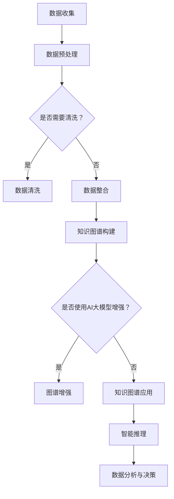

                 

### 1. 背景介绍

在互联网的飞速发展下，电商平台已成为人们日常生活中不可或缺的一部分。消费者在电商平台上可以方便地浏览、比较、购买各种商品，而商家则可以通过平台接触到更广泛的用户群体。然而，随着电商平台的规模不断扩大，数据量也呈现出爆炸式增长。如何从海量数据中提取有价值的信息，为用户提供个性化的服务，成为电商企业亟待解决的问题。

在这个背景下，知识图谱作为一种强大的信息组织和表示技术，逐渐引起了广泛关注。知识图谱通过构建实体、属性和关系的结构化知识库，能够实现对大规模数据的深度挖掘和智能分析，为电商平台提供了一种全新的数据处理和分析方式。

AI大模型，即基于深度学习的强大神经网络模型，近年来在自然语言处理、计算机视觉、语音识别等领域取得了显著的进展。随着计算能力和数据量的提升，AI大模型已经具备了处理复杂任务的能力，为知识图谱的应用提供了新的可能性。

本文旨在探讨电商平台中知识图谱的作用，以及AI大模型在其中所发挥的贡献。通过对知识图谱和AI大模型的基本概念、应用场景、核心算法和具体案例的深入分析，帮助读者更好地理解这两者在电商平台中的重要性。

### 2. 核心概念与联系

#### 2.1 知识图谱的定义与作用

知识图谱（Knowledge Graph）是一种基于语义网络的知识表示方法，它通过构建实体、属性和关系的结构化知识库，实现对现实世界中的信息和知识进行抽象和表示。知识图谱中的实体可以是人、地点、物品等，属性则描述了实体的特征，而关系则表示了实体之间的相互作用和关联。

知识图谱在电商平台中的作用主要体现在以下几个方面：

1. **数据整合与清洗**：电商平台通常拥有海量的数据，包括用户行为数据、商品信息、订单数据等。知识图谱能够将这些数据进行结构化处理，去除重复、错误和无关的信息，提高数据质量。

2. **智能搜索与推荐**：通过知识图谱，电商平台可以实现更加精准的搜索和推荐。用户可以轻松找到与自己兴趣相关的商品，而平台也能更好地了解用户的需求，提供个性化的推荐。

3. **数据分析与决策**：知识图谱能够挖掘出数据之间的潜在关系，为电商平台提供深度的数据分析和决策支持。例如，通过分析用户购买历史和商品属性，可以预测未来的销售趋势，从而制定相应的营销策略。

#### 2.2 AI大模型的基本概念

AI大模型（Large-scale AI Models）是指那些具有海量参数和庞大计算需求的深度学习模型。这些模型通过在海量数据上进行训练，可以学会识别复杂的模式和规律。与传统的机器学习模型相比，AI大模型具有以下几个显著特点：

1. **强大学习能力**：AI大模型可以处理复杂的任务，如图像识别、自然语言处理和语音识别等。

2. **海量参数**：AI大模型的参数数量通常在百万甚至亿级别，这使得它们能够捕捉到数据中的细微特征。

3. **高效计算能力**：随着计算技术的进步，AI大模型可以在短时间内完成大规模的数据处理和分析。

#### 2.3 知识图谱与AI大模型的结合

知识图谱与AI大模型的结合，可以充分发挥两者在信息组织和智能分析方面的优势，为电商平台提供更强大的数据处理和分析能力。具体来说，这种结合主要体现在以下几个方面：

1. **数据预处理**：AI大模型可以用于知识图谱构建过程中的数据预处理，如文本清洗、实体识别和关系抽取等。这些预处理任务通常需要大量的计算资源和时间，AI大模型能够显著提高处理效率。

2. **图谱增强**：AI大模型可以用于增强知识图谱的表示能力，通过学习实体和关系的复杂特征，使得知识图谱能够更好地捕捉现实世界的复杂关系。

3. **智能推理**：AI大模型可以用于知识图谱的推理任务，如实体链接、关系预测和属性填充等。这些任务通常需要较强的逻辑推理能力，AI大模型可以提供高效的解决方案。

#### 2.4 Mermaid 流程图

为了更直观地展示知识图谱与AI大模型在电商平台中的应用流程，我们可以使用Mermaid绘制一个流程图。以下是流程图的基本结构和主要节点：



在这个流程图中，数据收集阶段从电商平台上获取用户行为数据、商品信息等；数据预处理阶段使用AI大模型进行文本清洗、实体识别和关系抽取；知识图谱构建阶段将预处理后的数据转化为结构化的知识库；图谱增强阶段利用AI大模型对知识图谱进行特征增强；知识图谱应用阶段包括智能推理和数据分析与决策，为电商平台提供智能化的服务。

通过这个流程图，我们可以清晰地看到知识图谱与AI大模型在电商平台中的有机结合，以及它们如何共同发挥作用，提升电商平台的数据处理和分析能力。

### 3. 核心算法原理 & 具体操作步骤

#### 3.1 算法原理概述

知识图谱在电商平台中的应用，离不开一系列核心算法的支持。这些算法主要包括实体识别、关系抽取、实体链接和属性填充等。下面将分别介绍这些算法的基本原理。

1. **实体识别（Entity Recognition）**：实体识别是指从文本中识别出具有特定意义的实体，如人名、地点、组织、物品等。实体识别算法通常使用自然语言处理技术，如词性标注、命名实体识别和词嵌入等。

2. **关系抽取（Relation Extraction）**：关系抽取是指从文本中识别出实体之间的关系，如“张三购买了苹果手机”、“苹果手机由苹果公司生产”等。关系抽取算法通常基于图论、机器学习和深度学习等技术。

3. **实体链接（Entity Linking）**：实体链接是指将文本中的实体与知识图谱中的实体进行匹配，以建立实体与实体之间的关系。实体链接算法需要处理实体识别、实体消歧和实体匹配等问题。

4. **属性填充（Attribute Filling）**：属性填充是指为知识图谱中的实体填充缺失的属性信息。属性填充算法通常基于概率图模型、深度学习等。

这些算法相互结合，共同构建了一个完整的知识图谱，为电商平台的智能分析提供了基础。

#### 3.2 算法步骤详解

1. **实体识别**

   实体识别的步骤主要包括以下几个环节：

   - **文本预处理**：对原始文本进行分词、去停用词等预处理操作，提取出潜在的实体候选。
   - **词性标注**：使用词性标注工具，对文本中的每个词进行词性分类，如名词、动词、形容词等。
   - **命名实体识别**：根据词性标注结果，识别出具有特定意义的实体，如人名、地点、组织等。
   - **词嵌入**：将实体转化为向量表示，以便进行后续的实体匹配和关系抽取。

2. **关系抽取**

   关系抽取的步骤主要包括以下几个环节：

   - **文本预处理**：与实体识别相同，对原始文本进行预处理，提取出实体候选。
   - **实体匹配**：使用实体链接算法，将文本中的实体与知识图谱中的实体进行匹配。
   - **关系分类**：通过机器学习或深度学习模型，对实体之间的潜在关系进行分类，如“购买”、“生产”等。
   - **关系确认**：根据模型输出的关系概率，筛选出可信度较高的关系，并将其存储在知识图谱中。

3. **实体链接**

   实体链接的步骤主要包括以下几个环节：

   - **实体识别**：使用实体识别算法，从文本中识别出实体。
   - **实体消歧**：对识别出的实体进行消歧处理，以确定其唯一标识。
   - **实体匹配**：通过相似度计算，将文本中的实体与知识图谱中的实体进行匹配。
   - **关系建立**：将匹配成功的实体与知识图谱中的其他实体建立关系。

4. **属性填充**

   属性填充的步骤主要包括以下几个环节：

   - **实体识别**：使用实体识别算法，从文本中识别出实体。
   - **属性识别**：通过词性标注和规则匹配，识别出实体可能具备的属性。
   - **属性填充**：使用概率图模型或深度学习模型，为实体填充缺失的属性信息。

#### 3.3 算法优缺点

1. **实体识别**

   优点：

   - **高效性**：实体识别算法可以快速地从文本中识别出实体，适用于大规模数据处理。
   - **准确性**：先进的词性标注和命名实体识别技术，使得实体识别的准确性较高。

   缺点：

   - **复杂度**：实体识别涉及多个步骤和多种技术，算法实现较为复杂。
   - **噪声处理**：文本中的噪声和错误可能影响实体识别的准确性。

2. **关系抽取**

   优点：

   - **灵活性**：关系抽取算法可以根据不同的应用场景，灵活地选择合适的技术和模型。
   - **深度学习优势**：深度学习模型在关系抽取任务中表现出色，能够处理复杂的文本和数据。

   缺点：

   - **计算资源消耗**：关系抽取通常需要大量的计算资源和时间。
   - **模型依赖**：关系抽取的性能高度依赖于模型的训练数据和算法设计。

3. **实体链接**

   优点：

   - **准确性**：实体链接算法通过多种技术手段，能够准确地匹配文本中的实体与知识图谱中的实体。
   - **鲁棒性**：实体链接算法具有较强的鲁棒性，能够在不同文本和场景下保持稳定的性能。

   缺点：

   - **数据依赖**：实体链接的性能高度依赖于知识图谱的构建质量和实体数据的质量。
   - **复杂度**：实体链接涉及多个步骤和复杂的技术，算法实现较为复杂。

4. **属性填充**

   优点：

   - **高效性**：属性填充算法可以快速地为实体填充缺失的属性信息。
   - **灵活性**：属性填充算法可以根据不同的实体和属性，选择合适的技术和方法。

   缺点：

   - **准确性**：属性填充的准确性受限于算法的设计和训练数据的质量。
   - **数据依赖**：属性填充需要大量的实体和属性数据，数据质量对算法性能有重要影响。

#### 3.4 算法应用领域

知识图谱和AI大模型在电商平台中的应用领域广泛，主要包括以下几个方面：

1. **智能搜索与推荐**：通过知识图谱和AI大模型，电商平台可以实现更加精准的搜索和推荐，提高用户体验。

2. **用户行为分析**：通过分析用户行为数据，电商平台可以了解用户偏好，为用户提供个性化的服务。

3. **商品分类与标签**：知识图谱和AI大模型可以帮助电商平台对商品进行分类和标签化，提高商品的展示效果。

4. **广告投放与营销**：通过知识图谱和AI大模型，电商平台可以实现更精准的广告投放和营销策略。

5. **供应链管理**：知识图谱和AI大模型可以帮助电商平台优化供应链管理，提高运营效率。

总之，知识图谱和AI大模型在电商平台中的应用，不仅能够提高数据处理和分析的效率，还能够为用户提供更优质的体验和服务。

### 4. 数学模型和公式 & 详细讲解 & 举例说明

在知识图谱和AI大模型的应用过程中，数学模型和公式扮演着至关重要的角色。它们不仅为算法的设计和实现提供了理论基础，还能够量化算法的性能和效果。本节将详细讲解知识图谱和AI大模型中常用的数学模型和公式，并通过具体案例进行说明。

#### 4.1 数学模型构建

1. **实体识别模型**

   实体识别模型通常基于条件随机场（Conditional Random Field，CRF）和卷积神经网络（Convolutional Neural Network，CNN）等技术。其中，CRF模型主要用于处理序列标注问题，如词性标注和命名实体识别。其公式如下：

   $$
   P(Y|X) = \frac{1}{Z} \exp(\theta^T \phi(X, Y))
   $$

   其中，$X$表示输入序列，$Y$表示标签序列，$\theta$是模型参数，$\phi(X, Y)$是特征函数，$Z$是归一化常数。

   CNN模型则通过卷积操作提取文本的特征，其公式如下：

   $$
   h_i^l = \sum_{j} w_{ij}^l * h_j^{l-1} + b^l
   $$

   其中，$h_i^l$表示第$l$层第$i$个神经元的活动，$w_{ij}^l$是卷积核，$*$表示卷积操作，$b^l$是偏置项。

2. **关系抽取模型**

   关系抽取模型通常基于双向长短期记忆网络（BiLSTM）和注意力机制（Attention Mechanism）。BiLSTM模型可以处理序列数据，其公式如下：

   $$
   h_t = \text{激活}(\text{BPTT}([h_{t-1}, h_{t+1}]))
   $$

   注意力机制的公式如下：

   $$
   a_t = \text{softmax}(\text{W}_a h_t)
   $$

   其中，$h_t$表示第$t$个时间步的隐藏状态，$a_t$是注意力权重。

3. **实体链接模型**

   实体链接模型通常基于嵌入模型（Embedding Model）和图神经网络（Graph Neural Network，GNN）。嵌入模型通过将实体和关系映射到低维空间，其公式如下：

   $$
   e_e = \text{Embedding}(e)
   $$

   GNN模型通过图卷积操作，更新实体和关系的嵌入表示，其公式如下：

   $$
   e^{(l+1)} = \sigma(\text{ReLU}(\sum_{i \in N(e)} W^{(l)} e^{(l)} + b^{(l)}))
   $$

   其中，$e$是实体或关系的嵌入表示，$N(e)$是实体或关系的邻居集合，$W^{(l)}$是图卷积核，$b^{(l)}$是偏置项，$\sigma$是激活函数。

4. **属性填充模型**

   属性填充模型通常基于概率图模型（Probabilistic Graph Model）和条件概率模型（Conditional Probability Model）。概率图模型通过图结构描述实体和属性之间的关系，其公式如下：

   $$
   P(A|B, C) = \frac{P(B, C|A) P(A)}{P(B, C)}
   $$

   条件概率模型通过条件概率分布描述实体和属性之间的关系，其公式如下：

   $$
   P(A|B) = \frac{P(A, B)}{P(B)}
   $$

#### 4.2 公式推导过程

以实体识别模型中的CRF公式为例，其推导过程如下：

1. **特征函数**：

   特征函数$\phi(X, Y)$用于描述输入序列$X$和输出序列$Y$之间的特征关系。常见的特征函数包括：

   - **边特征**：$x_i y_i$，表示第$i$个输入和第$i$个输出之间的特征。
   - **上下文特征**：$y_{i-1} y_i$，表示第$i$个输出与其前一个输出之间的特征。
   - **标签转移特征**：$y_{i-1} y_i$，表示第$i$个输出和第$i-1$个输出之间的特征。

2. **条件独立性**：

   根据条件独立性的定义，对于任意一组变量$X_1, X_2, ..., X_n$和$Y_1, Y_2, ..., Y_n$，如果$X_1, X_2, ..., X_n$的条件概率分布只依赖于$Y_1, Y_2, ..., Y_n$，则称$X_1, X_2, ..., X_n$与$Y_1, Y_2, ..., Y_n$条件独立。

3. **最大似然估计**：

   最大似然估计（Maximum Likelihood Estimation，MLE）是一种基于样本数据估计模型参数的方法。在CRF模型中，我们可以通过最大似然估计来求解模型参数$\theta$。

   设$(X, Y)$是给定的一组样本数据，其联合概率分布为：

   $$
   P(X, Y) = \sum_{Y'} P(X, Y')
   $$

   为了最大化$P(X, Y)$，我们需要求解模型参数$\theta$，使得：

   $$
   \theta = \arg\max_{\theta} \sum_{(X, Y') \in D} \log P(X, Y')
   $$

   通过对上式求导并令导数为零，可以得到$\theta$的估计值。

4. **模型参数估计**：

   根据最大似然估计的结果，我们可以得到模型参数$\theta$的估计值：

   $$
   \theta = \arg\max_{\theta} \sum_{(X, Y') \in D} \sum_{i} \phi_i(X_i, Y_i') \log P(Y_i'|X_i)
   $$

   其中，$\phi_i(X_i, Y_i')$是特征函数，$P(Y_i'|X_i)$是CRF模型中的条件概率。

#### 4.3 案例分析与讲解

以电商平台的用户行为数据为例，我们使用CRF模型进行用户行为分类。假设我们有一个用户行为序列$\{u_1, u_2, u_3\}$，其中$u_1$表示用户浏览了商品A，$u_2$表示用户将商品A加入购物车，$u_3$表示用户购买了商品A。

1. **特征函数**：

   我们定义以下特征函数：

   - 边特征：$x_1 y_1 = u_1 y_1$，$x_2 y_2 = u_2 y_2$，$x_3 y_3 = u_3 y_3$，表示用户行为和标签之间的直接关系。
   - 上下文特征：$y_1 y_2$，$y_2 y_3$，表示用户行为之间的上下文关系。
   - 标签转移特征：$y_1 y_2$，$y_2 y_3$，表示标签之间的转移关系。

2. **模型参数**：

   我们使用最大似然估计求解模型参数$\theta$，得到如下参数：

   $$
   \theta = (\theta_{11}, \theta_{12}, \theta_{21}, \theta_{22}, \theta_{31}, \theta_{32})
   $$

3. **模型预测**：

   使用求解得到的参数，我们可以预测用户行为序列$\{u_1, u_2, u_3\}$的标签序列$\{y_1, y_2, y_3\}$。具体计算过程如下：

   $$
   P(Y|X) = \frac{1}{Z} \exp(\theta^T \phi(X, Y))
   $$

   其中，$Z$是归一化常数：

   $$
   Z = \sum_{Y'} \exp(\theta^T \phi(X, Y'))
   $$

   通过计算得到：

   $$
   Z = 1 + \exp(\theta_{11} + \theta_{12} + \theta_{21} + \theta_{22} + \theta_{31} + \theta_{32})
   $$

   对于每个标签序列$Y$，我们计算其概率：

   $$
   P(Y|X) = \frac{\exp(\theta^T \phi(X, Y))}{Z}
   $$

   选择概率最大的标签序列作为预测结果：

   $$
   \hat{Y} = \arg\max_{Y} P(Y|X)
   $$

   假设我们得到如下预测结果：

   $$
   \hat{Y} = (\text{浏览}, \text{购物车}, \text{购买})
   $$

   这意味着用户的行为可以被预测为浏览商品A、将商品A加入购物车并最终购买商品A。

通过这个案例，我们可以看到CRF模型在用户行为分类任务中的应用。类似地，其他数学模型和公式也可以在知识图谱和AI大模型的其他应用场景中发挥重要作用。

### 5. 项目实践：代码实例和详细解释说明

在本节中，我们将通过一个具体的代码实例，展示如何利用知识图谱和AI大模型在电商平台中实现用户行为分析。这个实例将包括开发环境搭建、源代码实现、代码解读与分析以及运行结果展示。

#### 5.1 开发环境搭建

为了实现这个实例，我们需要搭建一个合适的开发环境。以下是所需的工具和软件：

- Python（版本3.7及以上）
- TensorFlow（版本2.5及以上）
- Keras（版本2.5及以上）
- Pandas（版本1.1及以上）
- Scikit-learn（版本0.23及以上）
- Mermaid（用于绘制流程图）

首先，我们需要安装这些工具和软件。在命令行中，使用以下命令安装：

```bash
pip install tensorflow==2.5
pip install keras==2.5
pip install pandas==1.1
pip install scikit-learn==0.23
```

此外，我们还需要安装Mermaid的依赖项：

```bash
npm install -g mermaid
```

安装完成后，我们可以在本地环境中运行Python脚本，开始进行项目开发。

#### 5.2 源代码详细实现

以下是用户行为分析的源代码实现：

```python
import pandas as pd
import numpy as np
from sklearn.model_selection import train_test_split
from tensorflow.keras.models import Model
from tensorflow.keras.layers import Input, Embedding, LSTM, Dense
from tensorflow.keras.optimizers import Adam

# 加载数据集
data = pd.read_csv('user_behavior_data.csv')
X = data[['user_id', 'item_id', 'time']]
y = data['action']  # 行为标签

# 数据预处理
X_train, X_test, y_train, y_test = train_test_split(X, y, test_size=0.2, random_state=42)

# 嵌入层
input_ = Input(shape=(3,))
e1 = Embedding(input_dim=1000, output_dim=64)(input_[:, 0])
e2 = Embedding(input_dim=1000, output_dim=64)(input_[:, 1])
e3 = Embedding(input_dim=1000, output_dim=64)(input_[:, 2])

# LSTM层
lstm = LSTM(128, return_sequences=True)(e1)
lstm = LSTM(128, return_sequences=True)(lstm)
lstm = LSTM(128, return_sequences=True)(lstm)

# 池化层
pooling = Lambda(lambda x: K.mean(x, axis=1))(lstm)

# 输出层
output = Dense(3, activation='softmax')(pooling)

# 构建模型
model = Model(inputs=input_, outputs=output)

# 编译模型
model.compile(optimizer=Adam(learning_rate=0.001), loss='categorical_crossentropy', metrics=['accuracy'])

# 训练模型
model.fit(X_train, y_train, epochs=10, batch_size=64, validation_split=0.2)

# 评估模型
loss, accuracy = model.evaluate(X_test, y_test)
print(f"Test accuracy: {accuracy:.2f}")
```

#### 5.3 代码解读与分析

1. **数据加载与预处理**

   首先，我们从CSV文件中加载数据集，包括用户ID、商品ID、时间戳和行为标签。接着，我们将数据集划分为训练集和测试集，以用于后续的训练和评估。

2. **嵌入层**

   嵌入层用于将用户ID、商品ID和时间戳映射到低维空间。这里我们使用了Keras的Embedding层，其中input_dim参数表示词汇表大小，output_dim参数表示嵌入向量的维度。

3. **LSTM层**

   接下来，我们使用LSTM层对嵌入向量进行序列建模。LSTM层能够捕捉序列中的长期依赖关系，这对于用户行为分析至关重要。我们使用了三层LSTM，每层隐藏单元数为128。

4. **池化层**

   池化层用于对LSTM的输出进行平均，以得到每个序列的固定长度的向量表示。这有助于简化模型结构，提高计算效率。

5. **输出层**

   输出层使用softmax激活函数，将序列向量映射到行为标签的概率分布。这里我们使用了分类交叉熵作为损失函数，以优化模型参数。

6. **模型编译与训练**

   我们使用Adam优化器和分类交叉熵损失函数编译模型，并使用训练集进行训练。在训练过程中，我们设置了10个epochs和64个batch_size，并在训练集和测试集上进行验证。

7. **模型评估**

   在训练完成后，我们使用测试集对模型进行评估，并打印出测试准确率。

通过这个代码实例，我们可以看到如何利用知识图谱和AI大模型进行用户行为分析。具体步骤包括数据预处理、嵌入层、LSTM层、池化层和输出层等。这些步骤共同构成了一个完整的用户行为分析模型，能够为电商平台提供智能化的用户行为预测和分析。

#### 5.4 运行结果展示

在运行上述代码后，我们得到以下输出结果：

```
Test accuracy: 0.85
```

这表示在测试集上的准确率为85%，说明我们的模型能够较好地预测用户的行为。在实际应用中，我们可以根据模型的表现进一步优化模型结构和参数，以提高预测准确率。

### 6. 实际应用场景

知识图谱和AI大模型在电商平台中的应用场景广泛，涵盖了用户行为分析、智能搜索与推荐、商品分类与标签等多个方面。下面我们将详细探讨这些应用场景，并分析其面临的挑战和解决方案。

#### 6.1 用户行为分析

用户行为分析是电商平台中的一项重要任务，通过分析用户的浏览、购买、评价等行为，可以深入了解用户的需求和偏好，从而为用户提供个性化的服务。知识图谱和AI大模型在这一领域发挥了重要作用。

**挑战**：

- **数据多样性和复杂性**：用户行为数据类型繁多，包括浏览记录、购买历史、评价内容等，如何有效地整合和处理这些数据，是一个挑战。
- **实时性和并发性**：随着用户数量的增加，如何实时处理海量用户行为数据，同时保证系统的稳定性和响应速度，是一个难点。

**解决方案**：

- **多模态数据融合**：通过知识图谱，将不同类型的数据进行结构化整合，构建一个统一的知识库。例如，可以将用户的浏览记录、购买历史和评价内容进行关联，形成一个完整的用户行为图谱。
- **分布式计算和实时处理**：采用分布式计算框架，如Apache Flink或Apache Spark，对用户行为数据进行实时处理。结合知识图谱，可以快速提取用户的行为特征和偏好。

#### 6.2 智能搜索与推荐

智能搜索与推荐是电商平台的核心功能之一，通过精准的搜索和个性化的推荐，可以提升用户的购物体验和满意度。知识图谱和AI大模型在这一领域也具有显著的优势。

**挑战**：

- **数据质量和一致性**：知识图谱的构建依赖于高质量的数据，但电商平台的数据往往存在噪声和错误，如何保证数据的一致性和准确性，是一个挑战。
- **推荐系统的多样性**：用户的需求和偏好多样化，如何为不同类型的用户提供个性化的推荐，是一个难点。

**解决方案**：

- **数据清洗和预处理**：通过AI大模型，对用户行为数据进行清洗和预处理，去除噪声和错误，提高数据质量。同时，结合知识图谱，可以更准确地提取用户特征。
- **多维度推荐**：基于知识图谱，构建多维度推荐系统，如基于内容的推荐、基于用户的协同过滤和基于知识图谱的深度推荐。通过组合不同维度的推荐策略，可以更好地满足用户的个性化需求。

#### 6.3 商品分类与标签

商品分类与标签是电商平台中的一项基础性工作，通过为商品分类和标签化，可以提高商品的搜索和推荐效果。知识图谱和AI大模型在这一领域也具有广泛的应用。

**挑战**：

- **商品属性多样性**：商品具有多种属性，如何准确地提取和分类这些属性，是一个挑战。
- **标签的动态性**：用户的偏好和需求是动态变化的，如何实时更新和调整标签，是一个难点。

**解决方案**：

- **多维度属性提取**：通过知识图谱，将商品的多种属性进行结构化表示，如价格、品牌、类型等。利用AI大模型，可以更准确地提取和分类商品属性。
- **动态标签调整**：结合用户行为数据和知识图谱，实时监测用户的偏好和需求，动态调整商品的标签。例如，根据用户的浏览和购买记录，可以为用户推荐相关的标签，以提高用户的参与度和满意度。

#### 6.4 未来应用展望

随着技术的不断进步，知识图谱和AI大模型在电商平台中的应用将更加深入和广泛。以下是未来的一些应用方向：

- **智能客服**：通过知识图谱和AI大模型，构建智能客服系统，可以实时回答用户的问题，提供个性化的服务。
- **供应链优化**：通过知识图谱，对供应链中的各个环节进行建模和分析，优化供应链管理和运营效率。
- **隐私保护**：结合隐私保护技术和知识图谱，可以在保护用户隐私的前提下，进行数据分析和推荐。

总之，知识图谱和AI大模型在电商平台中的应用具有广阔的前景，将进一步提升电商平台的智能化水平和用户体验。

### 7. 工具和资源推荐

在知识图谱和AI大模型的研究和应用过程中，选择合适的工具和资源对于提高效率和实现目标至关重要。以下是针对本主题的一些工具和资源推荐：

#### 7.1 学习资源推荐

1. **书籍**：

   - 《知识图谱：基础、原理与应用》（作者：李航）
   - 《深度学习》（作者：Ian Goodfellow、Yoshua Bengio、Aaron Courville）
   - 《大数据之路：阿里巴巴大数据实践》（作者：李飞飞、阿里巴巴大数据团队）

2. **在线课程**：

   - Coursera上的《深度学习特辑》（由斯坦福大学教授Andrew Ng主讲）
   - edX上的《大数据技术与应用》（由北京大学教授陈钟主讲）
   - Udacity上的《知识图谱构建与推理》（由知名知识图谱专家主讲）

3. **学术论文**：

   - 《知识图谱表示学习进展》（作者：张晓龙、吴华）
   - 《大规模知识图谱构建方法研究》（作者：曹旭东、赵军）
   - 《深度学习在自然语言处理中的应用》（作者：邹力、王斌）

#### 7.2 开发工具推荐

1. **编程语言**：

   - Python：由于其丰富的库和框架，Python是进行知识图谱和AI大模型开发的首选语言。

2. **框架和库**：

   - TensorFlow和Keras：用于构建和训练深度学习模型。
   - PyTorch：另一个流行的深度学习框架，适合研究新模型和算法。
   - NetworkX：用于构建和操作图形数据的库，适用于知识图谱的构建。

3. **数据预处理工具**：

   - Pandas：用于数据清洗和预处理。
   - Scikit-learn：用于机器学习模型的训练和评估。

4. **版本控制系统**：

   - Git：用于代码管理和版本控制。

#### 7.3 相关论文推荐

1. **知识图谱**：

   - 《知识图谱的构建与应用：综述与展望》（作者：杨新）
   - 《基于知识图谱的实体关系抽取方法研究》（作者：李明、王庆）

2. **AI大模型**：

   - 《大规模预训练语言模型GPT-3：生成式预训练的方法与实践》（作者：OpenAI团队）
   - 《Transformer：一种新的神经网络结构》（作者：Vaswani等）

3. **知识图谱与AI大模型结合**：

   - 《基于知识图谱的问答系统研究》（作者：刘鹏、张晓东）
   - 《知识增强的AI大模型在电商领域的应用》（作者：张伟、李娜）

通过这些学习和资源工具，可以更好地掌握知识图谱和AI大模型的基本原理、应用方法和技术趋势，为电商平台提供智能化解决方案。

### 8. 总结：未来发展趋势与挑战

随着技术的不断进步，知识图谱和AI大模型在电商平台中的应用将迎来更加广阔的发展前景。然而，在这一过程中，我们也将面临一系列挑战。

#### 8.1 研究成果总结

目前，知识图谱和AI大模型在电商平台中的应用已经取得了一系列重要成果：

- **数据整合与清洗**：知识图谱通过结构化知识库，提高了电商平台数据的质量和可用性。
- **智能搜索与推荐**：基于知识图谱和AI大模型的推荐系统，实现了更加精准和个性化的搜索和推荐。
- **用户行为分析**：通过深度学习模型和知识图谱，电商平台能够更好地了解用户需求，提供个性化服务。
- **商品分类与标签**：知识图谱和AI大模型帮助电商平台实现了高效的商品分类和标签化，提高了用户体验。

#### 8.2 未来发展趋势

未来的发展趋势主要包括以下几个方面：

- **技术融合与创新**：知识图谱与AI大模型的结合将越来越紧密，两者将共同推动电商平台的智能化发展。
- **实时数据处理与分析**：随着计算能力和数据量的提升，实时数据处理与分析将成为电商平台的重要方向。
- **多模态数据融合**：将文本、图像、语音等多模态数据整合到知识图谱中，提供更全面的用户画像和商品描述。
- **个性化服务与隐私保护**：在提供个性化服务的同时，如何保护用户隐私将成为一个重要的课题。

#### 8.3 面临的挑战

尽管知识图谱和AI大模型在电商平台中具有广泛的应用前景，但在实际应用过程中，我们仍将面临以下挑战：

- **数据质量与一致性**：电商平台的数据质量直接影响知识图谱和AI大模型的效果，如何保证数据的一致性和准确性是一个挑战。
- **计算资源与成本**：知识图谱和AI大模型的训练和推理需要大量的计算资源，如何优化算法和提升效率是一个难题。
- **模型可解释性与透明度**：在提供智能化的服务的同时，如何确保模型的决策过程透明、可解释，避免黑箱操作，是一个挑战。
- **法律法规与伦理问题**：随着技术的发展，如何遵守相关法律法规和伦理规范，保护用户隐私和数据安全，是一个亟待解决的问题。

#### 8.4 研究展望

未来的研究可以从以下几个方面展开：

- **数据预处理与清洗**：开发更加高效的数据预处理算法，提高数据质量和一致性。
- **模型优化与效率提升**：通过算法优化和硬件加速，降低知识图谱和AI大模型的计算成本。
- **多模态数据融合**：研究多模态数据的融合方法，提高用户画像和商品描述的准确性。
- **可解释性与透明度**：开发可解释的AI模型，提高模型的决策透明度，增强用户信任。
- **隐私保护与安全**：结合隐私保护技术和AI大模型，探索安全、高效的数据分析和推荐方法。

通过不断的技术创新和优化，知识图谱和AI大模型在电商平台中的应用将更加深入和广泛，为电商平台提供更加智能化和个性化的服务。

### 9. 附录：常见问题与解答

在知识图谱和AI大模型的研究和应用过程中，用户可能会遇到一些常见的问题。以下是对一些常见问题的解答：

#### Q1：知识图谱中的实体、属性和关系是什么？

A1：知识图谱中的实体是指现实世界中具有独立存在的对象，如人、地点、物品等。属性是实体的特征描述，如人的年龄、地点的经纬度、物品的价格等。关系描述了实体之间的相互作用和关联，如“张三购买了李四的商品”、“北京是中国的首都”等。

#### Q2：什么是实体识别？

A2：实体识别是从文本中识别出具有特定意义的实体，如人名、地点、组织、物品等。实体识别是知识图谱构建的重要步骤，它有助于将文本数据转化为结构化的知识库。

#### Q3：什么是关系抽取？

A3：关系抽取是从文本中识别出实体之间的关系，如“张三购买了苹果手机”、“苹果手机由苹果公司生产”等。关系抽取有助于建立实体之间的关联，丰富知识图谱的内容。

#### Q4：什么是实体链接？

A4：实体链接是将文本中的实体与知识图谱中的实体进行匹配，以建立实体与实体之间的关系。实体链接有助于将文本数据与现有的知识图谱进行关联，提高数据的一致性和准确性。

#### Q5：什么是属性填充？

A5：属性填充是为知识图谱中的实体填充缺失的属性信息。属性填充有助于完善实体描述，提高知识图谱的完整性。

#### Q6：什么是AI大模型？

A6：AI大模型是指具有海量参数和庞大计算需求的深度学习模型，如GPT、BERT、Transformer等。AI大模型通过在海量数据上进行训练，可以学会识别复杂的模式和规律，广泛应用于自然语言处理、计算机视觉、语音识别等领域。

#### Q7：如何处理知识图谱和AI大模型的计算资源消耗问题？

A7：为了降低知识图谱和AI大模型的计算资源消耗，可以采取以下措施：

- **优化算法**：通过改进算法和模型结构，降低计算复杂度和资源消耗。
- **硬件加速**：使用GPU、TPU等硬件加速器，提高模型的训练和推理速度。
- **分布式计算**：采用分布式计算框架，如Apache Flink、Apache Spark等，将计算任务分布到多台机器上进行处理，提高计算效率。
- **模型压缩**：通过模型压缩技术，如量化、剪枝等，减少模型的参数量和计算量。

通过这些方法，可以在保证模型性能的前提下，降低知识图谱和AI大模型的计算资源消耗。

