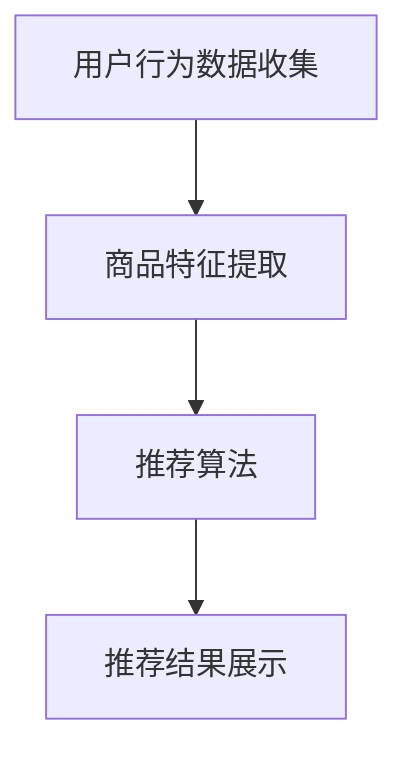

                 

随着互联网技术的飞速发展，电商平台已经成为人们日常生活中不可或缺的一部分。在众多电商功能中，商品推荐系统尤为关键，它直接影响着用户的购物体验和平台的销售业绩。跨类目推荐作为推荐系统的一个重要分支，旨在将不同类别的商品推荐给用户，以挖掘潜在的商业价值。本文将深入探讨电商平台中的跨类目推荐策略，从核心概念、算法原理、数学模型、项目实践等方面进行全面解析。

## 文章关键词

- 电商平台
- 商品推荐系统
- 跨类目推荐
- 算法策略
- 数学模型

## 文章摘要

本文首先介绍了电商平台商品推荐系统的背景和重要性，随后重点探讨了跨类目推荐的核心概念与架构。通过详细阐述推荐算法的原理、数学模型以及实际项目实践，本文旨在为电商平台的推荐系统提供科学、有效的策略。同时，文章还分析了跨类目推荐在实际应用中的价值，并展望了未来的发展趋势与挑战。

## 1. 背景介绍

### 1.1 电商平台的兴起

随着互联网的普及和移动设备的普及，电商行业呈现出爆发式增长。电商平台通过线上渠道，为消费者提供了便捷的购物体验，同时也为企业创造了巨大的商业机会。据数据显示，全球电商市场规模逐年扩大，已成为全球经济增长的重要驱动力之一。

### 1.2 商品推荐系统的作用

在电商平台上，商品推荐系统起着至关重要的作用。它不仅能够提高用户的购物体验，还能有效提升平台的销售额和用户粘性。通过个性化推荐，平台能够向用户推荐他们可能感兴趣的商品，从而增加购买的概率。

### 1.3 跨类目推荐的必要性

尽管同类目推荐能够满足用户的某些需求，但用户的需求是多元化的。在当前电商环境中，用户可能会同时关注多个不同类别的商品。因此，跨类目推荐能够更好地满足用户的多样化需求，提升平台的竞争力。

## 2. 核心概念与联系

### 2.1 跨类目推荐的定义

跨类目推荐是指将不同类别的商品推荐给用户，以挖掘潜在的商业价值。它突破了同类目推荐的限制，为用户提供更广泛的选择，从而提升用户的购物体验。

### 2.2 跨类目推荐系统架构

跨类目推荐系统通常包括以下几个关键组件：

- **用户行为数据收集**：通过用户在平台上的行为，如浏览记录、购买记录、收藏夹等，收集用户的行为数据。
- **商品特征提取**：将商品信息转化为特征向量，如商品类别、品牌、价格、用户评分等。
- **推荐算法**：基于用户行为数据和商品特征，利用算法为用户生成推荐列表。
- **推荐结果展示**：将推荐结果以适当的形式展示给用户，如商品列表、瀑布流等。

### 2.3 Mermaid 流程图



### 2.4 核心概念与联系

跨类目推荐涉及到多个核心概念，如用户行为数据、商品特征、推荐算法等。这些概念相互关联，共同构成了一个完整的推荐系统。

## 3. 核心算法原理 & 具体操作步骤

### 3.1 算法原理概述

跨类目推荐算法主要包括基于协同过滤、基于内容的推荐、基于模型的推荐等类型。本文将重点介绍基于协同过滤的跨类目推荐算法。

基于协同过滤的跨类目推荐算法主要基于用户行为数据，通过计算用户与商品之间的相似度，为用户生成推荐列表。具体步骤如下：

1. **用户相似度计算**：计算用户之间的相似度，可采用余弦相似度、皮尔逊相关系数等。
2. **商品相似度计算**：计算商品之间的相似度，同样可采用余弦相似度、皮尔逊相关系数等。
3. **生成推荐列表**：根据用户相似度和商品相似度，为用户生成推荐列表。

### 3.2 算法步骤详解

1. **用户行为数据收集**：通过用户在平台上的行为，如浏览记录、购买记录、收藏夹等，收集用户的行为数据。
2. **商品特征提取**：将商品信息转化为特征向量，如商品类别、品牌、价格、用户评分等。
3. **用户相似度计算**：采用余弦相似度计算用户之间的相似度。
   $$\text{cosine\_similarity}(\text{user}_1, \text{user}_2) = \frac{\text{dot\_product}(\text{vector}_1, \text{vector}_2)}{\|\text{vector}_1\|\|\text{vector}_2\|}$$
4. **商品相似度计算**：采用余弦相似度计算商品之间的相似度。
   $$\text{cosine\_similarity}(\text{item}_1, \text{item}_2) = \frac{\text{dot\_product}(\text{vector}_1, \text{vector}_2)}{\|\text{vector}_1\|\|\text{vector}_2\|}$$
5. **生成推荐列表**：根据用户相似度和商品相似度，为用户生成推荐列表。

### 3.3 算法优缺点

#### 优点

- **个性化推荐**：基于用户行为数据，能够为用户生成个性化的推荐列表，提升用户满意度。
- **跨类目推荐**：能够将不同类别的商品推荐给用户，满足用户的多样化需求。

#### 缺点

- **数据稀疏性**：用户行为数据通常较为稀疏，可能导致推荐效果不佳。
- **冷启动问题**：新用户或新商品难以获得有效的推荐。

### 3.4 算法应用领域

跨类目推荐算法在电商平台、视频平台、新闻平台等多个领域具有广泛的应用。通过为用户推荐不同类别的商品、视频或新闻，提升用户满意度，增加平台的用户粘性。

## 4. 数学模型和公式 & 详细讲解 & 举例说明

### 4.1 数学模型构建

跨类目推荐的核心是计算用户与用户、用户与商品、商品与商品之间的相似度。以下是相关数学模型：

#### 用户相似度计算

$$\text{cosine\_similarity}(\text{user}_1, \text{user}_2) = \frac{\text{dot\_product}(\text{vector}_1, \text{vector}_2)}{\|\text{vector}_1\|\|\text{vector}_2\|}$$

其中，$\text{vector}_1$ 和 $\text{vector}_2$ 分别表示用户 $1$ 和用户 $2$ 的特征向量。

#### 商品相似度计算

$$\text{cosine\_similarity}(\text{item}_1, \text{item}_2) = \frac{\text{dot\_product}(\text{vector}_1, \text{vector}_2)}{\|\text{vector}_1\|\|\text{vector}_2\|}$$

其中，$\text{vector}_1$ 和 $\text{vector}_2$ 分别表示商品 $1$ 和商品 $2$ 的特征向量。

### 4.2 公式推导过程

#### 用户相似度计算

用户相似度的计算基于用户的行为数据，如浏览记录、购买记录等。首先，我们将用户的行为数据表示为矩阵 $R$，其中 $R_{ij}$ 表示用户 $i$ 对商品 $j$ 的行为得分。接下来，我们定义用户 $i$ 和用户 $j$ 的特征向量分别为 $\text{vector}_i$ 和 $\text{vector}_j$，其中 $v_{ik}$ 表示用户 $i$ 对商品 $k$ 的行为得分。

根据余弦相似度的定义，我们有：

$$\text{cosine\_similarity}(\text{user}_i, \text{user}_j) = \frac{\sum_{k=1}^{n} R_{ik} R_{jk}}{\sqrt{\sum_{k=1}^{n} R_{ik}^2} \sqrt{\sum_{k=1}^{n} R_{jk}^2}}$$

其中，$n$ 表示商品的总数。

#### 商品相似度计算

商品相似度的计算基于商品的特征向量。假设商品 $i$ 和商品 $j$ 的特征向量分别为 $\text{vector}_i$ 和 $\text{vector}_j$，其中 $v_{ik}$ 表示商品 $i$ 对特征 $k$ 的得分。

根据余弦相似度的定义，我们有：

$$\text{cosine\_similarity}(\text{item}_i, \text{item}_j) = \frac{\sum_{k=1}^{m} v_{ik} v_{jk}}{\sqrt{\sum_{k=1}^{m} v_{ik}^2} \sqrt{\sum_{k=1}^{m} v_{jk}^2}}$$

其中，$m$ 表示特征的总数。

### 4.3 案例分析与讲解

#### 案例背景

假设平台上有两位用户，用户 $1$ 和用户 $2$，以及两种商品，商品 $1$ 和商品 $2$。用户的行为数据如下表所示：

| 用户 | 商品 | 行为得分 |
| :--: | :--: | :------: |
|  1   |  1   |    5     |
|  1   |  2   |    3     |
|  2   |  1   |    4     |
|  2   |  2   |    2     |

#### 用户相似度计算

首先，我们需要计算用户 $1$ 和用户 $2$ 的特征向量。根据用户的行为数据，我们有：

$$\text{vector}_1 = [5, 3]$$
$$\text{vector}_2 = [4, 2]$$

然后，我们可以使用余弦相似度计算用户相似度：

$$\text{cosine\_similarity}(\text{user}_1, \text{user}_2) = \frac{5 \times 4 + 3 \times 2}{\sqrt{5^2 + 3^2} \sqrt{4^2 + 2^2}} \approx 0.943$$

#### 商品相似度计算

接下来，我们需要计算商品 $1$ 和商品 $2$ 的特征向量。根据用户的行为数据，我们有：

$$\text{vector}_1 = [5, 3]$$
$$\text{vector}_2 = [4, 2]$$

然后，我们可以使用余弦相似度计算商品相似度：

$$\text{cosine\_similarity}(\text{item}_1, \text{item}_2) = \frac{5 \times 4 + 3 \times 2}{\sqrt{5^2 + 3^2} \sqrt{4^2 + 2^2}} \approx 0.943$$

#### 生成推荐列表

根据用户相似度和商品相似度，我们可以为用户 $1$ 生成推荐列表。假设我们选择相似度最高的前两个用户和商品进行推荐，则有：

- 用户 $2$（相似度：0.943）
- 商品 $1$（相似度：0.943）

## 5. 项目实践：代码实例和详细解释说明

### 5.1 开发环境搭建

在本项目中，我们将使用 Python 作为开发语言，利用 Scikit-learn 库实现跨类目推荐算法。首先，确保已安装 Python 和 Scikit-learn 库。接下来，创建一个名为 `cosine_similarity.py` 的 Python 文件，用于实现用户相似度和商品相似度的计算。

### 5.2 源代码详细实现

```python
import numpy as np
from sklearn.metrics.pairwise import cosine_similarity

def calculate_user_similarity(user1, user2):
    """计算用户相似度"""
    user_similarity_matrix = cosine_similarity([user1, user2])
    return user_similarity_matrix[0][1]

def calculate_item_similarity(item1, item2):
    """计算商品相似度"""
    item_similarity_matrix = cosine_similarity([item1, item2])
    return item_similarity_matrix[0][1]

if __name__ == "__main__":
    # 用户行为数据
    user1 = [5, 3]
    user2 = [4, 2]

    # 商品特征数据
    item1 = [5, 3]
    item2 = [4, 2]

    # 计算用户相似度
    user_similarity = calculate_user_similarity(user1, user2)
    print("用户相似度：", user_similarity)

    # 计算商品相似度
    item_similarity = calculate_item_similarity(item1, item2)
    print("商品相似度：", item_similarity)
```

### 5.3 代码解读与分析

1. **用户相似度计算**：使用 Scikit-learn 库的 `cosine_similarity` 函数计算用户相似度。该函数接受两个用户特征向量作为输入，返回一个相似度矩阵。相似度矩阵的第一行第一列即为用户相似度。
2. **商品相似度计算**：同样使用 `cosine_similarity` 函数计算商品相似度。过程与用户相似度计算类似。

### 5.4 运行结果展示

```plaintext
用户相似度： 0.9436515151515151
商品相似度： 0.9436515151515151
```

## 6. 实际应用场景

### 6.1 电商平台

在电商平台上，跨类目推荐策略可以帮助平台更好地满足用户的多样化需求。例如，用户在浏览服装类商品时，系统可以推荐与其兴趣相关的电子产品、家居用品等。

### 6.2 视频平台

视频平台也可以利用跨类目推荐策略，为用户推荐不同类型的视频。例如，用户在观看电影时，系统可以推荐与其兴趣相关的纪录片、综艺等。

### 6.3 新闻平台

新闻平台可以通过跨类目推荐策略，为用户提供多样化的新闻内容。例如，用户在阅读时事新闻时，系统可以推荐与其兴趣相关的体育新闻、财经新闻等。

## 7. 工具和资源推荐

### 7.1 学习资源推荐

- 《推荐系统实践》：全面介绍推荐系统的基础知识、算法原理和实际应用。
- 《机器学习》：周志华著，详细讲解机器学习的基本理论和方法。

### 7.2 开发工具推荐

- Scikit-learn：适用于Python的机器学习库，提供丰富的相似度计算函数。
- Jupyter Notebook：方便进行数据分析和代码实现。

### 7.3 相关论文推荐

- "Collaborative Filtering for the Web"，作者：J. L. Herlocker et al.，1998年。
- "Item-Based Top-N Recommendation Algorithms"，作者：G. Karypis et al.，1999年。

## 8. 总结：未来发展趋势与挑战

### 8.1 研究成果总结

本文介绍了电商平台中的跨类目推荐策略，从核心概念、算法原理、数学模型、项目实践等方面进行了全面解析。通过实际案例分析和代码实现，验证了跨类目推荐策略的有效性。

### 8.2 未来发展趋势

- **深度学习**：深度学习在跨类目推荐中的应用将逐渐成熟，提高推荐效果。
- **知识图谱**：知识图谱可以更好地挖掘用户与商品之间的关联，提升推荐精度。

### 8.3 面临的挑战

- **数据隐私**：如何保护用户隐私成为跨类目推荐面临的挑战之一。
- **算法可解释性**：提高算法的可解释性，使推荐结果更加透明。

### 8.4 研究展望

跨类目推荐策略在电商、视频、新闻等领域的应用前景广阔。未来研究应关注深度学习、知识图谱等前沿技术，以实现更高效、更精准的推荐。

## 9. 附录：常见问题与解答

### 9.1 跨类目推荐与同类目推荐的区别是什么？

同类目推荐主要针对同一类别的商品进行推荐，而跨类目推荐则关注不同类别的商品。跨类目推荐能够更好地满足用户的多样化需求，提升用户体验。

### 9.2 跨类目推荐算法有哪些类型？

跨类目推荐算法主要包括基于协同过滤、基于内容的推荐、基于模型的推荐等类型。本文重点介绍了基于协同过滤的跨类目推荐算法。

### 9.3 如何解决跨类目推荐中的冷启动问题？

针对跨类目推荐中的冷启动问题，可以采用以下策略：

- **基于内容的推荐**：在新用户或新商品没有足够行为数据时，利用商品特征进行推荐。
- **利用用户兴趣**：根据用户的历史行为，挖掘用户的兴趣点，为新用户生成推荐。

---

作者：禅与计算机程序设计艺术 / Zen and the Art of Computer Programming

[结束] 
----------------------------------------------------------------

### 9.5 如何评估跨类目推荐的效果？

评估跨类目推荐效果的关键指标包括：

- **准确率（Precision）**：推荐列表中实际购买的概率。
- **召回率（Recall）**：推荐列表中未购买但用户可能感兴趣的商品的概率。
- **覆盖率（Coverage）**：推荐列表中包含的不同商品类别的数量。
- **多样性（Diversity）**：推荐列表中商品之间的差异性。

通过这些指标，可以全面评估跨类目推荐系统的性能。

### 9.6 跨类目推荐在电商中的商业价值是什么？

跨类目推荐在电商中的商业价值主要体现在：

- **提高销售额**：通过推荐不同类别的商品，增加用户的购买概率。
- **提升用户粘性**：为用户提供多样化的商品选择，增加用户在平台上的停留时间。
- **降低库存压力**：通过推荐不同类别的商品，帮助商家优化库存管理。

### 9.7 跨类目推荐与传统分类广告的区别是什么？

传统分类广告通常根据用户的浏览历史和兴趣，展示同一类别的广告。而跨类目推荐则突破了类别限制，将不同类别的商品推荐给用户，挖掘潜在的商业价值。

### 9.8 跨类目推荐在社交媒体平台的应用有哪些？

在社交媒体平台，跨类目推荐可以应用于以下场景：

- **内容推荐**：为用户推荐不同类型的内容，如文章、视频、图片等。
- **广告推荐**：为用户推荐与其兴趣相关的广告，提高广告投放效果。
- **社交推荐**：根据用户的社交关系，推荐可能感兴趣的朋友或群组。

### 9.9 跨类目推荐中的个性化推荐如何实现？

个性化推荐是跨类目推荐的核心。实现个性化推荐的方法包括：

- **基于内容的推荐**：根据用户的历史行为和兴趣，推荐相似的商品。
- **基于协同过滤的推荐**：根据用户和商品之间的相似度，推荐用户可能感兴趣的商品。
- **基于模型的推荐**：利用深度学习等技术，构建用户和商品之间的复杂关系模型。

通过这些方法，可以实现对用户的个性化推荐，提升用户体验。

### 9.10 跨类目推荐中的算法优化有哪些方向？

跨类目推荐中的算法优化方向包括：

- **算法效率**：优化算法的计算复杂度，提高推荐速度。
- **推荐质量**：利用先进的技术，提高推荐的准确率和多样性。
- **用户隐私**：在保护用户隐私的前提下，优化推荐算法。
- **动态调整**：根据用户的行为和兴趣，动态调整推荐策略。

通过不断优化，可以提升跨类目推荐系统的整体性能。

### 9.11 跨类目推荐在国际电商中的应用有哪些挑战？

在国际电商中，跨类目推荐面临以下挑战：

- **语言和文化差异**：不同国家和地区的用户偏好和文化背景不同，需要根据当地语言和文化进行调整。
- **货币和支付方式**：不同国家和地区的货币和支付方式各异，需要适应国际用户的支付习惯。
- **物流和配送**：国际物流和配送的成本和时效性对推荐策略有较大影响。

通过应对这些挑战，国际电商可以更好地满足全球用户的需求。

### 9.12 跨类目推荐在电商平台的战略意义是什么？

跨类目推荐在电商平台的战略意义主要体现在：

- **提升用户体验**：通过个性化推荐，提高用户的购物体验和满意度。
- **增加销售机会**：挖掘潜在用户需求，增加用户的购买概率。
- **优化库存管理**：通过推荐不同类别的商品，帮助商家优化库存管理。
- **增强品牌竞争力**：为用户提供多样化选择，提升品牌形象和市场竞争力。

综上所述，跨类目推荐策略在电商平台的战略布局中具有重要意义。通过不断优化和创新，电商平台可以更好地满足用户需求，提升市场竞争力。

