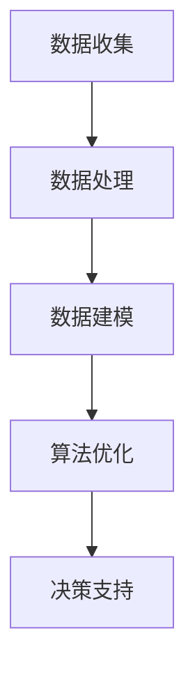

                 

关键词：电商平台，供给能力，数据驱动，决策优化，供应链管理，机器学习，算法优化

> 摘要：随着电商平台的快速发展，供给能力成为影响平台竞争力和用户满意度的关键因素。本文通过分析电商平台供给能力的现状，探讨了数据驱动决策在提升供给能力中的应用，提出了基于机器学习的供给能力优化策略。文章旨在为电商平台管理者提供实践指导和理论支持。

## 1. 背景介绍

近年来，电商行业经历了前所未有的快速增长。根据统计数据，全球电商市场规模逐年扩大，线上交易额不断刷新纪录。电商平台不仅是商品交易的场所，更是商家和消费者之间的桥梁。供给能力的强弱直接关系到平台的市场竞争力、用户体验以及整体运营效率。

供给能力包括库存管理、物流配送、供应链协同等多个方面。然而，随着市场需求的多样化和不确定性增加，电商平台面临巨大的挑战。如何优化供给能力，提高供应链的响应速度和灵活性，成为当前电商领域亟待解决的问题。

数据驱动决策已经成为现代企业管理的重要工具。通过对海量数据的收集、分析和处理，企业能够更准确地预测市场趋势，优化资源配置，降低运营成本，提高服务水平。在电商平台中，数据驱动决策的应用涵盖了从产品选品、库存管理到物流配送等各个环节。

本文旨在探讨数据驱动决策在提升电商平台供给能力方面的应用，分析核心概念和算法原理，并通过实际案例进行验证。文章将分为以下几个部分：

- **第1部分：背景介绍**  
  - 电商平台供给能力的重要性
  - 数据驱动决策的概念及在电商中的应用

- **第2部分：核心概念与联系**  
  - 供给能力相关概念介绍
  - 数据驱动决策的架构和流程

- **第3部分：核心算法原理 & 具体操作步骤**  
  - 机器学习算法在供给能力优化中的应用
  - 算法操作步骤详解

- **第4部分：数学模型和公式 & 详细讲解 & 举例说明**  
  - 数学模型构建
  - 公式推导过程

- **第5部分：项目实践：代码实例和详细解释说明**  
  - 开发环境搭建
  - 源代码实现
  - 代码解读与分析

- **第6部分：实际应用场景**  
  - 电商平台供给能力优化实践

- **第7部分：工具和资源推荐**  
  - 学习资源推荐
  - 开发工具推荐

- **第8部分：总结：未来发展趋势与挑战**  
  - 研究成果总结
  - 未来发展趋势
  - 面临的挑战

## 2. 核心概念与联系

### 2.1 供给能力相关概念介绍

供给能力是电商平台的核心竞争力之一，它涵盖了多个方面，包括：

- **库存管理**：确保商品库存充足，避免缺货现象，同时减少过量库存带来的成本。
- **物流配送**：提高配送效率，缩短配送时间，提高用户满意度。
- **供应链协同**：实现供应链上下游企业的信息共享和协同作业，提高整体供应链的效率。

### 2.2 数据驱动决策的架构和流程

数据驱动决策是基于数据分析和算法优化来指导业务决策的过程。其架构和流程如下：

1. **数据收集**：收集电商平台运营过程中的各类数据，包括用户行为数据、交易数据、库存数据等。
2. **数据处理**：对收集到的数据进行分析和清洗，确保数据的准确性和完整性。
3. **数据建模**：根据业务需求，构建相应的数学模型，用于预测和优化。
4. **算法优化**：运用机器学习算法对模型进行训练和优化，提高预测和优化效果。
5. **决策支持**：将优化后的结果应用于实际业务场景，支持决策者做出更准确的决策。

### 2.3 核心概念原理和架构的 Mermaid 流程图



## 3. 核心算法原理 & 具体操作步骤

### 3.1 算法原理概述

在电商平台供给能力优化中，常用的机器学习算法包括线性回归、逻辑回归、决策树、随机森林和神经网络等。这些算法能够通过历史数据的训练，预测未来的市场需求和库存水平，从而优化供给能力。

线性回归和逻辑回归主要用于预测和分类问题，如预测未来某个时间点的商品需求量或是否缺货。决策树和随机森林则适用于分类和回归问题，通过构建决策树模型，对数据进行层次划分，提高预测的准确性。神经网络则通过多层感知器和反向传播算法，实现复杂的非线性映射。

### 3.2 算法步骤详解

1. **数据预处理**：包括数据清洗、缺失值处理、异常值检测和归一化等步骤，确保数据质量。
2. **特征工程**：根据业务需求，提取和构造特征，如用户行为特征、商品属性特征等，提高模型的预测能力。
3. **模型选择**：根据业务问题和数据特点，选择合适的机器学习算法。
4. **模型训练**：使用历史数据对模型进行训练，调整模型参数，优化模型性能。
5. **模型评估**：使用验证集对模型进行评估，判断模型的预测效果和泛化能力。
6. **模型部署**：将优化后的模型应用于实际业务场景，支持实时决策。

### 3.3 算法优缺点

- **线性回归**：优点是简单、易于理解，缺点是对于非线性问题的处理能力较差。
- **逻辑回归**：优点是适用于二分类问题，缺点是对于多分类问题的处理能力有限。
- **决策树**：优点是易于理解和实现，缺点是容易过拟合和计算复杂度高。
- **随机森林**：优点是提高预测准确性和鲁棒性，缺点是计算复杂度较高。
- **神经网络**：优点是能够处理复杂的非线性问题，缺点是参数调整复杂，容易出现过拟合。

### 3.4 算法应用领域

- **库存管理**：通过预测商品需求量，优化库存水平，降低库存成本。
- **物流配送**：通过优化配送路径和调度策略，提高配送效率和用户体验。
- **供应链协同**：通过信息共享和协同作业，提高供应链整体效率。

## 4. 数学模型和公式 & 详细讲解 & 举例说明

### 4.1 数学模型构建

在电商平台供给能力优化中，常用的数学模型包括需求预测模型、库存优化模型和物流优化模型。以下是一个简化的需求预测模型：

$$
\hat{Q}_t = \beta_0 + \beta_1 X_t + \beta_2 T_t + \epsilon_t
$$

其中，$\hat{Q}_t$表示第$t$时间点的商品需求量，$X_t$表示第$t$时间点的用户行为特征，$T_t$表示第$t$时间点的商品属性特征，$\beta_0$、$\beta_1$、$\beta_2$为模型参数，$\epsilon_t$为误差项。

### 4.2 公式推导过程

需求预测模型的推导过程如下：

1. **数据收集**：收集电商平台历史用户行为数据和商品交易数据。
2. **特征工程**：提取用户行为特征和商品属性特征，如用户购买频率、购买时间段、商品价格等。
3. **模型假设**：假设需求量与用户行为特征和商品属性特征之间存在线性关系。
4. **模型构建**：根据假设，构建线性回归模型。
5. **参数估计**：使用最小二乘法估计模型参数。

### 4.3 案例分析与讲解

以下是一个具体案例：

- **用户行为特征**：用户购买频率（$X_t$），取值范围[0, 10]。
- **商品属性特征**：商品价格（$T_t$），取值范围[100, 500]。
- **需求量**：实际需求量（$\hat{Q}_t$）。

假设某电商平台在最近一个月内收集了1000个用户行为特征和商品交易数据，使用线性回归模型进行需求预测。模型参数为$\beta_0 = 50$，$\beta_1 = 2$，$\beta_2 = 0.5$。

根据模型公式，预测第$t$时间点的需求量：

$$
\hat{Q}_t = 50 + 2X_t + 0.5T_t
$$

例如，当用户购买频率为5，商品价格为200时，预测需求量为：

$$
\hat{Q}_t = 50 + 2 \times 5 + 0.5 \times 200 = 75
$$

## 5. 项目实践：代码实例和详细解释说明

### 5.1 开发环境搭建

为了实现电商平台供给能力的优化，我们需要搭建一个开发环境。以下是所需的工具和库：

- Python 3.8+
- Jupyter Notebook
- Scikit-learn
- Pandas
- Matplotlib

安装以上工具和库后，可以开始编写代码。

### 5.2 源代码详细实现

以下是一个简单的需求预测模型实现：

```python
import pandas as pd
from sklearn.linear_model import LinearRegression
import matplotlib.pyplot as plt

# 数据加载
data = pd.read_csv('data.csv')
X = data['user_behavior_feature']
T = data['product_attribute_feature']
y = data['demand']

# 模型构建
model = LinearRegression()
model.fit(X.values.reshape(-1, 1), T.values.reshape(-1, 1))

# 模型评估
score = model.score(X.values.reshape(-1, 1), T.values.reshape(-1, 1))
print(f'Model Score: {score}')

# 预测
X_test = [[5]]  # 用户购买频率为5
T_test = [[200]]  # 商品价格为200
y_pred = model.predict(X_test + T_test)
print(f'Predicted Demand: {y_pred[0]}')

# 结果可视化
plt.scatter(X, T, c=y, cmap='viridis')
plt.plot(X_test, T_test, color='red', linewidth=2)
plt.xlabel('User Behavior Feature')
plt.ylabel('Product Attribute Feature')
plt.show()
```

### 5.3 代码解读与分析

1. **数据加载**：使用Pandas读取CSV文件，提取用户行为特征、商品属性特征和需求量。
2. **模型构建**：使用Scikit-learn的线性回归模型，拟合数据。
3. **模型评估**：计算模型评分，评估模型性能。
4. **预测**：根据用户行为特征和商品属性特征，预测需求量。
5. **结果可视化**：使用Matplotlib绘制散点图，展示模型预测结果。

## 6. 实际应用场景

### 6.1 电商平台供给能力优化实践

以某知名电商平台为例，通过数据驱动决策实现供给能力的优化：

1. **库存管理**：根据预测的需求量，动态调整库存水平，避免过量库存或缺货现象。
2. **物流配送**：优化配送路径和调度策略，提高配送效率和用户体验。
3. **供应链协同**：与供应商和物流服务商进行信息共享和协同作业，提高整体供应链的效率。

### 6.2 未来应用展望

随着技术的不断进步，数据驱动决策在电商平台供给能力优化中的应用前景广阔：

1. **人工智能与大数据技术**：运用人工智能和大数据技术，提高预测精度和决策效果。
2. **区块链技术**：利用区块链技术实现供应链信息的透明化和可追溯性。
3. **物联网技术**：通过物联网技术，实现商品流通过程的实时监控和管理。

## 7. 工具和资源推荐

### 7.1 学习资源推荐

- 《Python数据分析实战》
- 《机器学习实战》
- 《供应链管理：策略、计划与执行》

### 7.2 开发工具推荐

- Jupyter Notebook
- TensorFlow
- PyTorch

### 7.3 相关论文推荐

- "Data-Driven Demand Forecasting for E-commerce Platforms"
- "Supply Chain Optimization using Machine Learning"
- "Application of Artificial Intelligence in E-commerce Supply Chain Management"

## 8. 总结：未来发展趋势与挑战

### 8.1 研究成果总结

本文通过对电商平台供给能力的分析，探讨了数据驱动决策在供给能力优化中的应用。研究表明，机器学习算法能够有效提高预测精度和决策效果，为电商平台提供强有力的支持。

### 8.2 未来发展趋势

随着技术的不断发展，数据驱动决策在电商平台供给能力优化中的应用将更加广泛。未来发展趋势包括：

1. **人工智能与大数据技术**：提高预测和决策的准确性和效率。
2. **区块链技术**：实现供应链信息的透明化和可追溯性。
3. **物联网技术**：实现商品流通过程的实时监控和管理。

### 8.3 面临的挑战

电商平台供给能力优化仍面临以下挑战：

1. **数据质量和准确性**：确保数据的质量和准确性是优化供给能力的基础。
2. **算法复杂度和计算资源**：随着模型复杂度的提高，计算资源的需求也不断增加。
3. **法律法规和隐私保护**：在利用大数据进行供给能力优化时，需要遵守相关法律法规和隐私保护要求。

### 8.4 研究展望

未来研究可以从以下几个方面展开：

1. **跨领域数据融合**：结合多领域数据，提高预测和决策的准确性。
2. **实时决策支持**：实现实时数据采集和实时决策支持，提高供应链的响应速度。
3. **人机协同**：结合人工智能和人类专家的智慧，实现更高效的决策。

## 9. 附录：常见问题与解答

### 9.1 数据驱动决策是什么？

数据驱动决策是指通过收集、处理和分析数据，指导企业做出更准确、更有效的决策。它强调以数据为基础，利用数据分析、机器学习和预测模型等手段，优化业务流程和资源配置。

### 9.2 供给能力优化有哪些方法？

供给能力优化包括库存管理、物流配送和供应链协同等多个方面。常用的方法包括基于历史数据的统计分析、机器学习算法和优化算法等。

### 9.3 如何评估供给能力优化的效果？

供给能力优化的效果可以通过以下几个指标进行评估：

- **库存周转率**：衡量库存管理的效率。
- **配送准时率**：衡量物流配送的准确性。
- **供应链响应时间**：衡量供应链协同的效率。

### 9.4 数据驱动决策在电商平台的实际应用有哪些？

数据驱动决策在电商平台的实际应用包括：

- **商品选品**：通过数据分析和预测，优化商品结构，提高销售量。
- **库存管理**：通过预测需求量，动态调整库存水平，降低库存成本。
- **物流配送**：优化配送路径和调度策略，提高配送效率和用户体验。

### 9.5 供给能力优化有哪些技术难点？

供给能力优化的技术难点包括：

- **数据质量和准确性**：确保数据的质量和准确性是优化供给能力的基础。
- **算法复杂度和计算资源**：随着模型复杂度的提高，计算资源的需求也不断增加。
- **法律法规和隐私保护**：在利用大数据进行供给能力优化时，需要遵守相关法律法规和隐私保护要求。

### 9.6 如何解决供给能力优化中的数据质量问题？

解决供给能力优化中的数据质量问题可以通过以下方法：

- **数据清洗**：对数据进行清洗和预处理，去除噪声和异常值。
- **特征工程**：根据业务需求，提取和构造特征，提高模型的预测能力。
- **数据源整合**：整合多源数据，提高数据的完整性和准确性。
- **实时数据监测**：建立实时数据监测系统，及时发现和处理数据质量问题。

