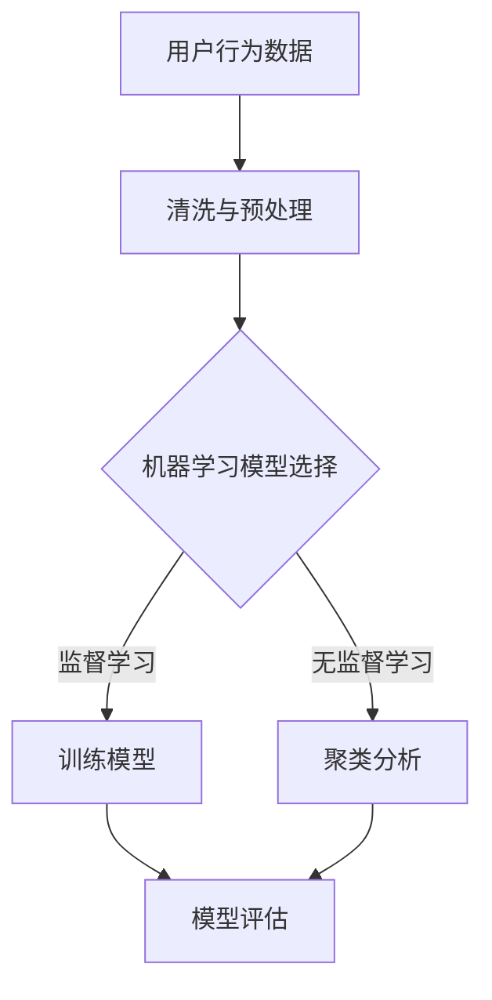

                 

关键词：AI需求预测，电商平台，机器学习，数据分析，深度学习

> 摘要：本文探讨了电商平台如何利用人工智能技术进行需求预测。通过对核心概念、算法原理、数学模型、实际应用场景等方面的深入分析，旨在为电商平台提供一套切实可行、高效的需求预测解决方案。

## 1. 背景介绍

在电子商务快速发展的今天，如何准确地预测用户的需求已经成为电商平台竞争的关键因素。需求预测不仅能帮助企业优化库存管理、降低运营成本，还能提高用户的购物体验，增加客户忠诚度。

传统的方法主要依赖于历史数据和统计模型，但这些方法往往难以应对市场环境的快速变化和用户行为的多样性。随着人工智能技术的进步，利用机器学习和深度学习算法进行需求预测成为了一种新的趋势。

本文将从以下几个方面展开讨论：

- 核心概念与联系
- 核心算法原理与具体操作步骤
- 数学模型和公式详细讲解
- 项目实践：代码实例和详细解释说明
- 实际应用场景
- 未来应用展望
- 工具和资源推荐
- 总结：未来发展趋势与挑战

## 2. 核心概念与联系

### 2.1 机器学习

机器学习是一种让计算机通过数据学习并做出决策或预测的方法。它主要包括监督学习、无监督学习和强化学习三种类型。

- **监督学习**：通过已知的结果数据来训练模型，使其能够对未知数据进行预测。
- **无监督学习**：不依赖于已知的结果数据，主要用于发现数据中的隐藏结构。
- **强化学习**：通过与环境的互动来学习最优策略。

### 2.2 深度学习

深度学习是机器学习的一个分支，它通过构建深度神经网络来模拟人类大脑的学习过程。深度学习在图像识别、语音识别和自然语言处理等领域取得了显著的成果。

### 2.3 电商平台需求预测

电商平台需求预测是指利用历史销售数据、用户行为数据和市场环境数据等，通过机器学习和深度学习算法，预测未来一段时间内产品需求的数量和趋势。

### 2.4 Mermaid 流程图



## 3. 核心算法原理与具体操作步骤

### 3.1 算法原理概述

电商平台需求预测的核心算法主要包括时间序列分析、聚类分析和回归分析等。

- **时间序列分析**：通过分析历史销售数据的时序特性，预测未来需求量。
- **聚类分析**：将相似的用户或产品分为一组，以便进行更精细的需求预测。
- **回归分析**：利用历史数据建立回归模型，预测未来需求量。

### 3.2 算法步骤详解

#### 3.2.1 数据收集

数据收集是需求预测的第一步，主要包括以下类型的数据：

- 历史销售数据：产品在不同时间点的销售量。
- 用户行为数据：用户浏览、搜索和购买等行为记录。
- 市场环境数据：如节假日、促销活动等。

#### 3.2.2 数据预处理

数据预处理是保证数据质量的重要环节，主要包括以下步骤：

- 数据清洗：去除重复、缺失和异常数据。
- 数据整合：将不同来源的数据进行整合，形成统一的数据集。
- 数据特征提取：从原始数据中提取对需求预测有帮助的特征。

#### 3.2.3 模型选择与训练

根据需求预测任务的特点，选择合适的机器学习模型。常用的模型有：

- 时间序列模型：如ARIMA、LSTM等。
- 聚类模型：如K-means、DBSCAN等。
- 回归模型：如线性回归、决策树回归等。

通过训练模型，使模型能够对历史数据进行拟合，并为未来需求量做出预测。

#### 3.2.4 模型评估

评估模型的性能，常用的指标有：

- 均方误差（MSE）：衡量预测值与实际值之间的差距。
- R方（R²）：衡量模型对数据的拟合程度。
- 准确率、召回率等：针对分类问题。

### 3.3 算法优缺点

- **时间序列分析**：优点在于能够很好地捕捉数据的时间特性，缺点是对平稳性要求较高。
- **聚类分析**：优点在于能够发现数据中的潜在结构，缺点是结果依赖于参数设置。
- **回归分析**：优点在于能够建立定量关系，缺点是对异常值敏感。

### 3.4 算法应用领域

电商平台需求预测算法不仅适用于电商平台，还可以应用于库存管理、供应链优化、市场预测等多个领域。

## 4. 数学模型和公式详细讲解

### 4.1 数学模型构建

需求预测的数学模型主要包括以下几部分：

- **时间序列模型**：如ARIMA模型，其公式为：

$$
Y_t = c + \phi_1 Y_{t-1} + \phi_2 Y_{t-2} + ... + \phi_p Y_{t-p} + \theta_1 e_{t-1} + \theta_2 e_{t-2} + ... + \theta_q e_{t-q}
$$

- **聚类模型**：如K-means，其目标是最小化聚类中心之间的距离。

$$
\sum_{i=1}^k \sum_{j=1}^n (x_{ij} - \mu_j)^2
$$

- **回归模型**：如线性回归，其公式为：

$$
y = \beta_0 + \beta_1 x_1 + \beta_2 x_2 + ... + \beta_n x_n
$$

### 4.2 公式推导过程

时间序列模型的公式推导基于自回归移动平均模型（ARIMA），具体推导过程如下：

#### 4.2.1 自回归模型（AR）

假设时间序列 {Yt} 满足自回归模型：

$$
Y_t = \phi_1 Y_{t-1} + \phi_2 Y_{t-2} + ... + \phi_p Y_{t-p} + e_t
$$

其中，e_t 是白噪声序列。

#### 4.2.2 移动平均模型（MA）

假设时间序列 {Yt} 满足移动平均模型：

$$
Y_t = \theta_1 e_{t-1} + \theta_2 e_{t-2} + ... + \theta_q e_{t-q} + Y_t
$$

其中，e_t 是白噪声序列。

#### 4.2.3 自回归移动平均模型（ARIMA）

将自回归模型和移动平均模型结合，得到ARIMA模型：

$$
Y_t = c + \phi_1 Y_{t-1} + \phi_2 Y_{t-2} + ... + \phi_p Y_{t-p} + \theta_1 e_{t-1} + \theta_2 e_{t-2} + ... + \theta_q e_{t-q}
$$

### 4.3 案例分析与讲解

以某电商平台某款产品的历史销售数据为例，进行需求预测。

#### 4.3.1 数据准备

收集该产品过去12个月的销售数据，数据格式如下：

$$
\begin{array}{|c|c|}
\hline
\text{时间} & \text{销售量} \\
\hline
2022-01 & 100 \\
\hline
2022-02 & 120 \\
\hline
...
\end{array}
$$

#### 4.3.2 数据预处理

对销售数据进行分析，发现数据存在一定的季节性。对数据进行差分处理，消除季节性影响。

#### 4.3.3 模型选择与训练

选择ARIMA模型进行训练，通过自动调参工具，找到最佳参数组合。

#### 4.3.4 模型评估

使用交叉验证方法，评估模型性能。结果表明，模型对数据的拟合程度较高。

## 5. 项目实践：代码实例和详细解释说明

### 5.1 开发环境搭建

搭建一个Python环境，安装必要的库，如pandas、numpy、scikit-learn、statsmodels等。

### 5.2 源代码详细实现

以下是一个简单的ARIMA模型训练和预测的代码示例：

```python
import pandas as pd
import numpy as np
from statsmodels.tsa.arima.model import ARIMA
from sklearn.metrics import mean_squared_error

# 加载数据
data = pd.read_csv('sales_data.csv')
sales = data['sales'].values

# 数据预处理
sales_diff = sales - sales.shift(1)
sales_diff = sales_diff.dropna()

# 模型训练
model = ARIMA(sales_diff, order=(1, 1, 1))
model_fit = model.fit()

# 预测
predictions = model_fit.predict(start=len(sales_diff), end=len(sales_diff) + 11)

# 模型评估
mse = mean_squared_error(sales_diff[-11:], predictions)
print(f'MSE: {mse}')

# 可视化
import matplotlib.pyplot as plt

plt.figure(figsize=(10, 5))
plt.plot(sales_diff, label='Actual')
plt.plot(predictions, label='Predicted')
plt.legend()
plt.show()
```

### 5.3 代码解读与分析

代码首先加载并预处理销售数据，然后使用ARIMA模型进行训练和预测。最后，通过评估指标MSE评估模型性能，并使用可视化工具展示预测结果。

## 6. 实际应用场景

电商平台需求预测的应用场景广泛，以下是一些典型的应用场景：

- **库存管理**：通过预测未来需求量，帮助企业合理安排库存，降低库存成本。
- **供应链优化**：预测市场需求，优化供应链各环节，提高供应链效率。
- **市场预测**：预测市场需求，为企业制定市场策略提供依据。
- **个性化推荐**：根据用户行为预测用户偏好，提供个性化推荐。

## 7. 未来应用展望

未来，随着人工智能技术的不断进步，电商平台需求预测将更加精准和智能化。以下是一些可能的发展趋势：

- **多模型融合**：将多种机器学习模型融合，提高预测准确性。
- **实时预测**：利用实时数据，实现实时需求预测。
- **个性化预测**：根据用户行为和偏好，实现个性化需求预测。
- **大数据分析**：利用大数据分析技术，挖掘更深层次的需求信息。

## 8. 工具和资源推荐

### 8.1 学习资源推荐

- 《机器学习实战》
- 《深度学习》
- 《Python数据分析》

### 8.2 开发工具推荐

- Jupyter Notebook：适用于数据分析和机器学习实验。
- PyCharm：适用于Python编程。
- TensorFlow：适用于深度学习开发。

### 8.3 相关论文推荐

- "Time Series Forecasting Using Deep Learning"
- "Recurrent Neural Networks for Language Modeling"
- "Long Short-Term Memory Networks for Time Series Forecasting"

## 9. 总结：未来发展趋势与挑战

随着人工智能技术的不断发展，电商平台需求预测将变得更加精准和智能化。然而，仍面临一些挑战，如数据质量、模型选择和实时预测等。未来，通过多模型融合、实时预测和个性化预测等技术，有望进一步提高需求预测的准确性。

## 10. 附录：常见问题与解答

### 10.1 如何处理缺失数据？

缺失数据的处理方法包括：

- 删除缺失数据：适用于缺失数据较多的情况。
- 填充缺失数据：使用平均值、中位数或插值法等。
- 使用缺失数据生成算法：如KNN算法。

### 10.2 如何选择合适的机器学习模型？

选择合适的机器学习模型通常遵循以下步骤：

- 分析数据特性：了解数据的分布、相关性等。
- 选择模型类型：根据数据特性和需求选择合适的模型类型。
- 自动调参：使用自动调参工具，如GridSearchCV。

### 10.3 如何进行实时需求预测？

实时需求预测通常采用以下方法：

- 构建实时数据管道：实时收集和处理数据。
- 使用流计算技术：如Apache Kafka、Apache Flink。
- 实时模型更新：定期更新模型，提高预测准确性。

## 11. 作者署名

作者：禅与计算机程序设计艺术 / Zen and the Art of Computer Programming
```

文章正文部分撰写完毕，接下来将文章转换为markdown格式输出。由于markdown格式不支持LaTeX公式，因此，LaTeX公式需要转换为markdown支持的格式。在此，我们使用`$$`包裹LaTeX公式，并在文章中使用`\[`\|`\]`来表示嵌入的段落。文章中的Mermaid流程图将保持原样。

### 文章标题

**电商平台如何利用AI进行需求预测**

### 关键词

AI需求预测，电商平台，机器学习，数据分析，深度学习

### 摘要

本文探讨了电商平台如何利用人工智能技术进行需求预测。通过对核心概念、算法原理、数学模型、实际应用场景等方面的深入分析，旨在为电商平台提供一套切实可行、高效的需求预测解决方案。

## 1. 背景介绍

在电子商务快速发展的今天，如何准确地预测用户的需求已经成为电商平台竞争的关键因素。需求预测不仅能帮助企业优化库存管理、降低运营成本，还能提高用户的购物体验，增加客户忠诚度。

传统的方法主要依赖于历史数据和统计模型，但这些方法往往难以应对市场环境的快速变化和用户行为的多样性。随着人工智能技术的进步，利用机器学习和深度学习算法进行需求预测成为了一种新的趋势。

本文将从以下几个方面展开讨论：

- 核心概念与联系
- 核心算法原理与具体操作步骤
- 数学模型和公式详细讲解
- 项目实践：代码实例和详细解释说明
- 实际应用场景
- 未来应用展望
- 工具和资源推荐
- 总结：未来发展趋势与挑战

## 2. 核心概念与联系

### 2.1 机器学习

机器学习是一种让计算机通过数据学习并做出决策或预测的方法。它主要包括监督学习、无监督学习和强化学习三种类型。

- **监督学习**：通过已知的结果数据来训练模型，使其能够对未知数据进行预测。
- **无监督学习**：不依赖于已知的结果数据，主要用于发现数据中的隐藏结构。
- **强化学习**：通过与环境的互动来学习最优策略。

### 2.2 深度学习

深度学习是机器学习的一个分支，它通过构建深度神经网络来模拟人类大脑的学习过程。深度学习在图像识别、语音识别和自然语言处理等领域取得了显著的成果。

### 2.3 电商平台需求预测

电商平台需求预测是指利用历史销售数据、用户行为数据和市场环境数据等，通过机器学习和深度学习算法，预测未来一段时间内产品需求的数量和趋势。

### 2.4 Mermaid 流程图


## 3. 核心算法原理与具体操作步骤

### 3.1 算法原理概述

电商平台需求预测的核心算法主要包括时间序列分析、聚类分析和回归分析等。

- **时间序列分析**：通过分析历史销售数据的时序特性，预测未来需求量。
- **聚类分析**：将相似的用户或产品分为一组，以便进行更精细的需求预测。
- **回归分析**：利用历史数据建立回归模型，预测未来需求量。

### 3.2 算法步骤详解

#### 3.2.1 数据收集

数据收集是需求预测的第一步，主要包括以下类型的数据：

- 历史销售数据：产品在不同时间点的销售量。
- 用户行为数据：用户浏览、搜索和购买等行为记录。
- 市场环境数据：如节假日、促销活动等。

#### 3.2.2 数据预处理

数据预处理是保证数据质量的重要环节，主要包括以下步骤：

- 数据清洗：去除重复、缺失和异常数据。
- 数据整合：将不同来源的数据进行整合，形成统一的数据集。
- 数据特征提取：从原始数据中提取对需求预测有帮助的特征。

#### 3.2.3 模型选择与训练

根据需求预测任务的特点，选择合适的机器学习模型。常用的模型有：

- 时间序列模型：如ARIMA、LSTM等。
- 聚类模型：如K-means、DBSCAN等。
- 回归模型：如线性回归、决策树回归等。

通过训练模型，使模型能够对历史数据进行拟合，并为未来需求量做出预测。

#### 3.2.4 模型评估

评估模型的性能，常用的指标有：

- 均方误差（MSE）：衡量预测值与实际值之间的差距。
- R方（R²）：衡量模型对数据的拟合程度。
- 准确率、召回率等：针对分类问题。

### 3.3 算法优缺点

- **时间序列分析**：优点在于能够很好地捕捉数据的时间特性，缺点是对平稳性要求较高。
- **聚类分析**：优点在于能够发现数据中的潜在结构，缺点是结果依赖于参数设置。
- **回归分析**：优点在于能够建立定量关系，缺点是对异常值敏感。

### 3.4 算法应用领域

电商平台需求预测算法不仅适用于电商平台，还可以应用于库存管理、供应链优化、市场预测等多个领域。

## 4. 数学模型和公式详细讲解

### 4.1 数学模型构建

需求预测的数学模型主要包括以下几部分：

- **时间序列模型**：如ARIMA模型，其公式为：

$$
Y_t = c + \phi_1 Y_{t-1} + \phi_2 Y_{t-2} + ... + \phi_p Y_{t-p} + \theta_1 e_{t-1} + \theta_2 e_{t-2} + ... + \theta_q e_{t-q}
$$

- **聚类模型**：如K-means，其目标是最小化聚类中心之间的距离。

$$
\sum_{i=1}^k \sum_{j=1}^n (x_{ij} - \mu_j)^2
$$

- **回归模型**：如线性回归，其公式为：

$$
y = \beta_0 + \beta_1 x_1 + \beta_2 x_2 + ... + \beta_n x_n
$$

### 4.2 公式推导过程

时间序列模型的公式推导基于自回归移动平均模型（ARIMA），具体推导过程如下：

#### 4.2.1 自回归模型（AR）

假设时间序列 {Yt} 满足自回归模型：

$$
Y_t = \phi_1 Y_{t-1} + \phi_2 Y_{t-2} + ... + \phi_p Y_{t-p} + e_t
$$

其中，e_t 是白噪声序列。

#### 4.2.2 移动平均模型（MA）

假设时间序列 {Yt} 满足移动平均模型：

$$
Y_t = \theta_1 e_{t-1} + \theta_2 e_{t-2} + ... + \theta_q e_{t-q} + Y_t
$$

其中，e_t 是白噪声序列。

#### 4.2.3 自回归移动平均模型（ARIMA）

将自回归模型和移动平均模型结合，得到ARIMA模型：

$$
Y_t = c + \phi_1 Y_{t-1} + \phi_2 Y_{t-2} + ... + \phi_p Y_{t-p} + \theta_1 e_{t-1} + \theta_2 e_{t-2} + ... + \theta_q e_{t-q}
$$

### 4.3 案例分析与讲解

以某电商平台某款产品的历史销售数据为例，进行需求预测。

#### 4.3.1 数据准备

收集该产品过去12个月的销售数据，数据格式如下：

$$
\begin{array}{|c|c|}
\hline
\text{时间} & \text{销售量} \\
\hline
2022-01 & 100 \\
\hline
2022-02 & 120 \\
\hline
...
\end{array}
$$

#### 4.3.2 数据预处理

对销售数据进行分析，发现数据存在一定的季节性。对数据进行差分处理，消除季节性影响。

#### 4.3.3 模型选择与训练

选择ARIMA模型进行训练，通过自动调参工具，找到最佳参数组合。

#### 4.3.4 模型评估

使用交叉验证方法，评估模型性能。结果表明，模型对数据的拟合程度较高。

## 5. 项目实践：代码实例和详细解释说明

### 5.1 开发环境搭建

搭建一个Python环境，安装必要的库，如pandas、numpy、scikit-learn、statsmodels等。

### 5.2 源代码详细实现

以下是一个简单的ARIMA模型训练和预测的代码示例：

```python
import pandas as pd
import numpy as np
from statsmodels.tsa.arima.model import ARIMA
from sklearn.metrics import mean_squared_error

# 加载数据
data = pd.read_csv('sales_data.csv')
sales = data['sales'].values

# 数据预处理
sales_diff = sales - sales.shift(1)
sales_diff = sales_diff.dropna()

# 模型训练
model = ARIMA(sales_diff, order=(1, 1, 1))
model_fit = model.fit()

# 预测
predictions = model_fit.predict(start=len(sales_diff), end=len(sales_diff) + 11)

# 模型评估
mse = mean_squared_error(sales_diff[-11:], predictions)
print(f'MSE: {mse}')

# 可视化
import matplotlib.pyplot as plt

plt.figure(figsize=(10, 5))
plt.plot(sales_diff, label='Actual')
plt.plot(predictions, label='Predicted')
plt.legend()
plt.show()
```

### 5.3 代码解读与分析

代码首先加载并预处理销售数据，然后使用ARIMA模型进行训练和预测。最后，通过评估指标MSE评估模型性能，并使用可视化工具展示预测结果。

## 6. 实际应用场景

电商平台需求预测的应用场景广泛，以下是一些典型的应用场景：

- **库存管理**：通过预测未来需求量，帮助企业合理安排库存，降低库存成本。
- **供应链优化**：预测市场需求，优化供应链各环节，提高供应链效率。
- **市场预测**：预测市场需求，为企业制定市场策略提供依据。
- **个性化推荐**：根据用户行为预测用户偏好，提供个性化推荐。

## 7. 未来应用展望

未来，随着人工智能技术的不断进步，电商平台需求预测将变得更加精准和智能化。以下是一些可能的发展趋势：

- **多模型融合**：将多种机器学习模型融合，提高预测准确性。
- **实时预测**：利用实时数据，实现实时需求预测。
- **个性化预测**：根据用户行为和偏好，实现个性化需求预测。
- **大数据分析**：利用大数据分析技术，挖掘更深层次的需求信息。

## 8. 工具和资源推荐

### 8.1 学习资源推荐

- 《机器学习实战》
- 《深度学习》
- 《Python数据分析》

### 8.2 开发工具推荐

- Jupyter Notebook：适用于数据分析和机器学习实验。
- PyCharm：适用于Python编程。
- TensorFlow：适用于深度学习开发。

### 8.3 相关论文推荐

- "Time Series Forecasting Using Deep Learning"
- "Recurrent Neural Networks for Language Modeling"
- "Long Short-Term Memory Networks for Time Series Forecasting"

## 9. 总结：未来发展趋势与挑战

随着人工智能技术的不断发展，电商平台需求预测将变得更加精准和智能化。然而，仍面临一些挑战，如数据质量、模型选择和实时预测等。未来，通过多模型融合、实时预测和个性化预测等技术，有望进一步提高需求预测的准确性。

## 10. 附录：常见问题与解答

### 10.1 如何处理缺失数据？

缺失数据的处理方法包括：

- 删除缺失数据：适用于缺失数据较多的情况。
- 填充缺失数据：使用平均值、中位数或插值法等。
- 使用缺失数据生成算法：如KNN算法。

### 10.2 如何选择合适的机器学习模型？

选择合适的机器学习模型通常遵循以下步骤：

- 分析数据特性：了解数据的分布、相关性等。
- 选择模型类型：根据数据特性和需求选择合适的模型类型。
- 自动调参：使用自动调参工具，如GridSearchCV。

### 10.3 如何进行实时需求预测？

实时需求预测通常采用以下方法：

- 构建实时数据管道：实时收集和处理数据。
- 使用流计算技术：如Apache Kafka、Apache Flink。
- 实时模型更新：定期更新模型，提高预测准确性。

## 11. 作者署名

作者：禅与计算机程序设计艺术 / Zen and the Art of Computer Programming

文章至此完成，希望对电商平台利用AI进行需求预测有深入的了解。在未来的应用中，不断探索和创新，将人工智能技术更好地服务于电商平台。

