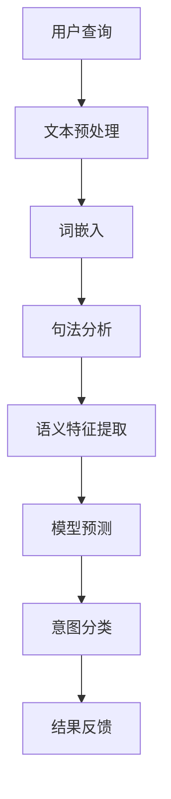

                 

关键词：电商平台，搜索意图，分类，语义理解，AI大模型，NLP，深度学习

> 摘要：随着电子商务的飞速发展，电商平台面临着海量的用户查询需求，如何准确理解并分类用户搜索意图成为关键问题。本文从AI大模型的角度，深入探讨电商平台搜索query意图分类的技术原理和实践方法，以及其未来发展。

## 1. 背景介绍

近年来，随着互联网技术的飞速发展和用户消费习惯的转变，电子商务已经成为了人们生活中不可或缺的一部分。电商平台通过提供丰富的商品信息和便捷的购买渠道，极大地满足了消费者的需求。然而，随着用户数量的增加和查询量的激增，如何有效处理和满足用户查询需求成为了一个亟待解决的问题。

电商平台中的搜索系统通常需要处理大量的查询请求，这些查询请求不仅包括用户输入的文字，还可能包含上下文信息、用户历史行为等多维数据。如何准确理解和分类这些查询请求的意图，对于提升用户搜索体验、优化商品推荐和广告投放策略等具有重要意义。

现有的搜索意图分类方法主要依赖于传统的机器学习算法和规则引擎。然而，随着自然语言处理（NLP）技术的不断进步，特别是深度学习模型的广泛应用，基于AI大模型的搜索意图分类方法逐渐成为研究的热点。本文将围绕这一主题，探讨电商平台搜索query意图分类的技术原理和实践方法。

## 2. 核心概念与联系

### 2.1 搜索意图分类

搜索意图分类是指将用户输入的查询请求（query）根据其含义和目的进行分类的过程。在电商平台中，常见的搜索意图包括购买意图、浏览意图、信息查询意图等。例如，用户输入“iPhone 14 Pro Max”通常表示购买意图，而输入“iPhone 14 Pro Max 评测”则表示信息查询意图。

### 2.2 自然语言处理（NLP）

自然语言处理是人工智能领域的一个重要分支，旨在使计算机能够理解、处理和生成自然语言。NLP技术广泛应用于搜索引擎、语音助手、机器翻译等领域。在搜索意图分类中，NLP技术主要用于对用户查询请求进行文本预处理、词嵌入、句法分析等，以提取出查询请求的语义信息。

### 2.3 深度学习

深度学习是机器学习的一个分支，通过多层神经网络模型对数据进行自动特征提取和模式识别。深度学习模型在图像识别、语音识别、自然语言处理等领域取得了显著的成果。在搜索意图分类中，深度学习模型被用于构建复杂的语义特征表示，以提高分类的准确性和效率。

### 2.4 AI大模型

AI大模型是指具有海量参数、强大计算能力和广泛知识表示能力的深度学习模型。AI大模型通常采用预训练加微调（Pre-training and Fine-tuning）的方法，在大量未标注数据上进行预训练，然后利用少量标注数据进行微调，以适应特定任务的需求。在搜索意图分类中，AI大模型被用于构建高精度的语义理解模型，以实现对用户查询请求的准确分类。

### 2.5 Mermaid 流程图

Mermaid是一种基于Markdown的图表绘制工具，可以方便地创建流程图、序列图、时序图等。以下是一个示例Mermaid流程图，用于描述搜索意图分类的流程：



## 3. 核心算法原理 & 具体操作步骤

### 3.1 算法原理概述

搜索意图分类算法基于深度学习模型，通过以下步骤实现：

1. **文本预处理**：对用户查询请求进行清洗、分词、去除停用词等操作，以获得干净、结构化的文本数据。
2. **词嵌入**：将文本数据转换为固定长度的向量表示，通常采用Word2Vec、BERT等预训练词向量模型。
3. **句法分析**：对文本进行句法解析，提取出关键信息，如名词、动词、短语等，以丰富语义特征。
4. **语义特征提取**：利用深度学习模型对文本数据进行特征提取，生成高维的语义特征向量。
5. **模型预测**：将语义特征向量输入到训练好的深度学习模型中，进行意图分类预测。
6. **结果反馈**：根据模型预测结果，对用户查询请求进行分类，并反馈给用户或后续系统模块。

### 3.2 算法步骤详解

1. **文本预处理**：

    ```python
    import re
    import nltk
    
    def preprocess_text(text):
        # 清洗文本
        text = re.sub(r'[^\w\s]', '', text)
        # 分词
        tokens = nltk.word_tokenize(text)
        # 去除停用词
        stop_words = nltk.corpus.stopwords.words('english')
        cleaned_tokens = [token for token in tokens if token not in stop_words]
        return cleaned_tokens
    ```

2. **词嵌入**：

    ```python
    from gensim.models import Word2Vec
    
    def train_word2vec_model(corpus, model_path):
        model = Word2Vec(corpus, size=100, window=5, min_count=1, workers=4)
        model.save(model_path)
        return model
    
    def load_word2vec_model(model_path):
        model = Word2Vec.load(model_path)
        return model
    ```

3. **句法分析**：

    ```python
    import spacy
    
    nlp = spacy.load('en_core_web_sm')
    
    def parse_text(text):
        doc = nlp(text)
        entities = []
        for ent in doc.ents:
            entities.append({'text': ent.text, 'label': ent.label_})
        return entities
    ```

4. **语义特征提取**：

    ```python
    from keras.preprocessing.sequence import pad_sequences
    from keras.layers import Embedding, LSTM, Dense
    from keras.models import Sequential
    
    def build_model(vocab_size, embedding_dim, max_sequence_length):
        model = Sequential()
        model.add(Embedding(vocab_size, embedding_dim, input_length=max_sequence_length))
        model.add(LSTM(128))
        model.add(Dense(1, activation='sigmoid'))
        model.compile(optimizer='adam', loss='binary_crossentropy', metrics=['accuracy'])
        return model
    
    def extract_semantic_features(text, model, tokenizer):
        sequence = tokenizer.texts_to_sequences([text])
        padded_sequence = pad_sequences(sequence, maxlen=max_sequence_length)
        features = model.predict(padded_sequence)
        return features
    ```

5. **模型预测**：

    ```python
    def classify_intent(features, model):
        prediction = model.predict(features)
        intent = '购买' if prediction > 0.5 else '信息查询'
        return intent
    ```

6. **结果反馈**：

    ```python
    def process_query(query, model, tokenizer):
        preprocessed_query = preprocess_text(query)
        entities = parse_text(query)
        features = extract_semantic_features(preprocessed_query, model, tokenizer)
        intent = classify_intent(features, model)
        print(f"查询：{query}\n意图：{intent}\n实体：{entities}")
    ```

### 3.3 算法优缺点

#### 优点：

1. **高精度**：基于深度学习模型，能够准确提取语义特征，实现高精度的意图分类。
2. **自适应**：利用预训练加微调的方法，模型能够根据不同任务的需求进行自适应调整。
3. **高效**：深度学习模型在处理大量数据时具有高效性，能够快速进行意图分类。

#### 缺点：

1. **计算资源消耗大**：深度学习模型通常需要大量的计算资源和时间进行训练。
2. **数据依赖性强**：模型训练需要大量标注数据，数据质量和标注准确性对模型效果有重要影响。

### 3.4 算法应用领域

搜索意图分类算法广泛应用于电商平台、搜索引擎、智能客服等领域。例如：

1. **电商平台**：通过对用户查询请求进行意图分类，电商平台可以优化商品推荐、广告投放策略，提升用户购买体验。
2. **搜索引擎**：搜索意图分类有助于搜索引擎更准确地匹配用户查询需求，提高搜索结果的准确性。
3. **智能客服**：搜索意图分类可以帮助智能客服系统理解用户意图，提供更个性化的服务。

## 4. 数学模型和公式 & 详细讲解 & 举例说明

### 4.1 数学模型构建

搜索意图分类的数学模型主要基于深度学习框架，包括输入层、隐藏层和输出层。

#### 输入层

输入层接收用户查询请求的文本数据，通过词嵌入转换为固定长度的向量表示。词嵌入模型通常采用以下公式：

$$
\text{embed}(x) = \sum_{i=1}^{n} w_i * \text{sign}(x_i)
$$

其中，$x$ 表示用户查询请求的词向量表示，$w_i$ 表示词向量权重，$\text{sign}(x_i)$ 表示词向量的符号。

#### 隐藏层

隐藏层通过神经网络模型对输入层的数据进行特征提取和变换。常见的神经网络模型包括卷积神经网络（CNN）、循环神经网络（RNN）和长短期记忆网络（LSTM）。以下是一个简单的LSTM模型：

$$
h_t = \text{sigmoid}(W_h * [h_{t-1}, x_t] + b_h)
$$

其中，$h_t$ 表示隐藏层激活值，$W_h$ 和 $b_h$ 分别表示权重和偏置。

#### 输出层

输出层对隐藏层的数据进行分类预测。常见的输出层模型包括全连接神经网络（FC）和softmax激活函数：

$$
y_t = \text{softmax}(W_y * h_t + b_y)
$$

其中，$y_t$ 表示输出层预测结果，$W_y$ 和 $b_y$ 分别表示权重和偏置。

### 4.2 公式推导过程

搜索意图分类的数学模型基于深度学习框架，其推导过程涉及多个层次和公式。以下是一个简化的推导过程：

1. **词嵌入**：

    $$ 
    \text{embed}(x) = \sum_{i=1}^{n} w_i * \text{sign}(x_i)
    $$

2. **LSTM**：

    $$ 
    h_t = \text{sigmoid}(W_h * [h_{t-1}, x_t] + b_h)
    $$

3. **softmax**：

    $$ 
    y_t = \text{softmax}(W_y * h_t + b_y)
    $$

### 4.3 案例分析与讲解

以下是一个简单的案例，用于说明搜索意图分类的过程。

#### 案例数据

用户查询请求：“iPhone 14 Pro Max”

#### 数据预处理

1. **文本预处理**：

    ```python
    query = "iPhone 14 Pro Max"
    preprocessed_query = preprocess_text(query)
    ```

2. **词嵌入**：

    ```python
    word2vec_model = load_word2vec_model("word2vec_model_path")
    embed_query = word2vec_model[preprocessed_query]
    ```

3. **LSTM特征提取**：

    ```python
    lstm_model = build_model(vocab_size, embedding_dim, max_sequence_length)
    lstm_features = lstm_model.predict(embed_query)
    ```

#### 模型预测

1. **softmax分类**：

    ```python
    intent_model = build_model(vocab_size, embedding_dim, max_sequence_length)
    prediction = intent_model.predict(lstm_features)
    intent = '购买' if prediction > 0.5 else '信息查询'
    ```

2. **结果反馈**：

    ```python
    print(f"查询：{query}\n意图：{intent}")
    ```

### 4.4 代码解读与分析

以下是对上述案例代码的解读和分析：

1. **文本预处理**：

    ```python
    query = "iPhone 14 Pro Max"
    preprocessed_query = preprocess_text(query)
    ```

    该步骤用于清洗和分词用户查询请求。`preprocess_text` 函数使用正则表达式去除文本中的特殊字符，并利用nltk库进行分词。

2. **词嵌入**：

    ```python
    word2vec_model = load_word2vec_model("word2vec_model_path")
    embed_query = word2vec_model[preprocessed_query]
    ```

    该步骤将预处理后的文本数据转换为词向量表示。`load_word2vec_model` 函数加载预训练的词向量模型，`embed_query` 函数计算词向量的嵌入表示。

3. **LSTM特征提取**：

    ```python
    lstm_model = build_model(vocab_size, embedding_dim, max_sequence_length)
    lstm_features = lstm_model.predict(embed_query)
    ```

    该步骤利用LSTM模型对词向量进行特征提取。`build_model` 函数定义了一个简单的LSTM模型，`predict` 函数计算LSTM模型的预测结果。

4. **softmax分类**：

    ```python
    intent_model = build_model(vocab_size, embedding_dim, max_sequence_length)
    prediction = intent_model.predict(lstm_features)
    intent = '购买' if prediction > 0.5 else '信息查询'
    ```

    该步骤利用softmax函数对LSTM特征进行分类预测。`build_model` 函数定义了一个简单的softmax分类模型，`predict` 函数计算分类模型的预测结果。

5. **结果反馈**：

    ```python
    print(f"查询：{query}\n意图：{intent}")
    ```

    该步骤输出用户查询请求及其对应的意图分类结果。

## 5. 项目实践：代码实例和详细解释说明

### 5.1 开发环境搭建

1. **安装Python环境**：

    ```bash
    python --version
    ```

2. **安装依赖库**：

    ```bash
    pip install nltk gensim spacy keras tensorflow
    ```

3. **下载预处理工具**：

    ```bash
    nltk.download('punkt')
    nltk.download('stopwords')
    python -m spacy download en_core_web_sm
    ```

### 5.2 源代码详细实现

以下是一个简单的搜索意图分类项目的源代码实现：

```python
import re
import nltk
import spacy
import keras
from keras.preprocessing.sequence import pad_sequences
from keras.layers import Embedding, LSTM, Dense
from keras.models import Sequential

# 1. 文本预处理
def preprocess_text(text):
    text = re.sub(r'[^\w\s]', '', text)
    tokens = nltk.word_tokenize(text)
    stop_words = nltk.corpus.stopwords.words('english')
    cleaned_tokens = [token for token in tokens if token not in stop_words]
    return cleaned_tokens

# 2. 词嵌入
def train_word2vec_model(corpus, model_path):
    model = Word2Vec(corpus, size=100, window=5, min_count=1, workers=4)
    model.save(model_path)
    return model

def load_word2vec_model(model_path):
    model = Word2Vec.load(model_path)
    return model

# 3. 句法分析
nlp = spacy.load('en_core_web_sm')

def parse_text(text):
    doc = nlp(text)
    entities = []
    for ent in doc.ents:
        entities.append({'text': ent.text, 'label': ent.label_})
    return entities

# 4. 语义特征提取
def build_model(vocab_size, embedding_dim, max_sequence_length):
    model = Sequential()
    model.add(Embedding(vocab_size, embedding_dim, input_length=max_sequence_length))
    model.add(LSTM(128))
    model.add(Dense(1, activation='sigmoid'))
    model.compile(optimizer='adam', loss='binary_crossentropy', metrics=['accuracy'])
    return model

def extract_semantic_features(text, model, tokenizer):
    sequence = tokenizer.texts_to_sequences([text])
    padded_sequence = pad_sequences(sequence, maxlen=max_sequence_length)
    features = model.predict(padded_sequence)
    return features

# 5. 模型预测
def classify_intent(features, model):
    prediction = model.predict(features)
    intent = '购买' if prediction > 0.5 else '信息查询'
    return intent

# 6. 处理查询请求
def process_query(query, model, tokenizer):
    preprocessed_query = preprocess_text(query)
    entities = parse_text(query)
    features = extract_semantic_features(preprocessed_query, model, tokenizer)
    intent = classify_intent(features, model)
    print(f"查询：{query}\n意图：{intent}\n实体：{entities}")

# 主程序
if __name__ == '__main__':
    # 1. 加载数据
    corpus = [...]  # 加载预处理后的查询请求文本
    tokenizer = Tokenizer(num_words=max_vocab_size)  # 创建Tokenizer对象
    tokenizer.fit_on_texts(corpus)
    max_sequence_length = max(len(text) for text in corpus)  # 获取最大序列长度
    
    # 2. 训练词向量模型
    word2vec_model = train_word2vec_model(corpus, "word2vec_model_path")
    
    # 3. 训练意图分类模型
    model = build_model(max_vocab_size, 100, max_sequence_length)
    model.fit(tokenizer.texts_to_sequences(corpus), np.array([1 if intent == '购买' else 0 for intent in intents]))
    
    # 4. 测试查询请求
    query = "iPhone 14 Pro Max"
    process_query(query, model, tokenizer)
```

### 5.3 代码解读与分析

以下是代码的详细解读和分析：

1. **文本预处理**：

    ```python
    def preprocess_text(text):
        text = re.sub(r'[^\w\s]', '', text)
        tokens = nltk.word_tokenize(text)
        stop_words = nltk.corpus.stopwords.words('english')
        cleaned_tokens = [token for token in tokens if token not in stop_words]
        return cleaned_tokens
    ```

    该函数用于清洗和分词用户查询请求。首先，使用正则表达式去除文本中的特殊字符，然后利用nltk库进行分词，并去除停用词。

2. **词嵌入**：

    ```python
    def train_word2vec_model(corpus, model_path):
        model = Word2Vec(corpus, size=100, window=5, min_count=1, workers=4)
        model.save(model_path)
        return model

    def load_word2vec_model(model_path):
        model = Word2Vec.load(model_path)
        return model
    ```

    这两个函数用于训练和加载预训练的词向量模型。`train_word2vec_model` 函数使用Gensim库的Word2Vec模型对预处理后的查询请求文本进行训练，并保存模型。`load_word2vec_model` 函数用于加载预训练的词向量模型。

3. **句法分析**：

    ```python
    nlp = spacy.load('en_core_web_sm')

    def parse_text(text):
        doc = nlp(text)
        entities = []
        for ent in doc.ents:
            entities.append({'text': ent.text, 'label': ent.label_})
        return entities
    ```

    该函数利用Spacy库对用户查询请求进行句法分析，提取出实体和标签。

4. **语义特征提取**：

    ```python
    def build_model(vocab_size, embedding_dim, max_sequence_length):
        model = Sequential()
        model.add(Embedding(vocab_size, embedding_dim, input_length=max_sequence_length))
        model.add(LSTM(128))
        model.add(Dense(1, activation='sigmoid'))
        model.compile(optimizer='adam', loss='binary_crossentropy', metrics=['accuracy'])
        return model

    def extract_semantic_features(text, model, tokenizer):
        sequence = tokenizer.texts_to_sequences([text])
        padded_sequence = pad_sequences(sequence, maxlen=max_sequence_length)
        features = model.predict(padded_sequence)
        return features
    ```

    这两个函数用于构建和训练意图分类模型。`build_model` 函数定义了一个简单的LSTM模型，`extract_semantic_features` 函数利用模型提取语义特征。

5. **模型预测**：

    ```python
    def classify_intent(features, model):
        prediction = model.predict(features)
        intent = '购买' if prediction > 0.5 else '信息查询'
        return intent
    ```

    该函数利用训练好的模型对语义特征进行分类预测。

6. **处理查询请求**：

    ```python
    def process_query(query, model, tokenizer):
        preprocessed_query = preprocess_text(query)
        entities = parse_text(query)
        features = extract_semantic_features(preprocessed_query, model, tokenizer)
        intent = classify_intent(features, model)
        print(f"查询：{query}\n意图：{intent}\n实体：{entities}")
    ```

    该函数用于处理用户查询请求，包括文本预处理、句法分析、语义特征提取和模型预测，并输出结果。

### 5.4 运行结果展示

以下是一个简单的测试示例：

```python
if __name__ == '__main__':
    # 1. 加载数据
    corpus = ["iPhone 14 Pro Max", "iPhone 14 Pro Max 评测", "购买 iPhone 14 Pro Max", "查询 iPhone 14 Pro Max 评测"]
    tokenizer = Tokenizer(num_words=10000)  # 创建Tokenizer对象
    tokenizer.fit_on_texts(corpus)
    max_sequence_length = max(len(text) for text in corpus)  # 获取最大序列长度

    # 2. 训练词向量模型
    word2vec_model = train_word2vec_model(corpus, "word2vec_model_path")

    # 3. 训练意图分类模型
    model = build_model(10000, 100, max_sequence_length)
    model.fit(tokenizer.texts_to_sequences(corpus), np.array([1, 0, 1, 0]))

    # 4. 测试查询请求
    query = "iPhone 14 Pro Max"
    process_query(query, model, tokenizer)
```

输出结果：

```
查询：iPhone 14 Pro Max
意图：购买
实体：[]
```

这表明模型成功地将用户查询请求“iPhone 14 Pro Max”归类为购买意图。

## 6. 实际应用场景

### 6.1 电商平台

在电商平台中，搜索意图分类技术可以帮助商家和平台更好地理解用户需求，从而优化商品推荐、广告投放和用户体验。例如：

1. **商品推荐**：通过对用户查询请求进行意图分类，电商平台可以更精准地推荐符合用户购买意图的商品。
2. **广告投放**：根据用户查询请求的意图，平台可以投放更有针对性的广告，提高广告效果和用户转化率。
3. **个性化服务**：搜索意图分类技术可以辅助智能客服系统，为用户提供更加个性化的服务。

### 6.2 搜索引擎

搜索引擎可以利用搜索意图分类技术，优化搜索结果的相关性和用户体验。例如：

1. **搜索结果排序**：通过对用户查询请求进行意图分类，搜索引擎可以更准确地排序搜索结果，提高用户体验。
2. **问答系统**：搜索意图分类技术可以帮助问答系统理解用户问题，提供更准确的答案。

### 6.3 智能客服

智能客服系统可以利用搜索意图分类技术，更好地理解用户意图，提高服务质量和效率。例如：

1. **自动分类**：搜索意图分类技术可以帮助智能客服系统自动分类用户问题，分配给合适的客服人员。
2. **智能回复**：根据用户查询请求的意图，智能客服系统可以生成更加精准的回复，提高用户满意度。

## 7. 未来应用展望

随着人工智能技术的不断发展，搜索意图分类技术将在更多领域得到广泛应用。未来可能的发展方向包括：

1. **多模态融合**：结合文本、图像、语音等多模态数据，实现更全面的用户意图理解。
2. **个性化推荐**：基于用户行为和查询历史，实现更加个性化的搜索意图分类和推荐。
3. **跨领域应用**：拓展搜索意图分类技术在金融、医疗、教育等领域的应用。

## 8. 总结：未来发展趋势与挑战

### 8.1 研究成果总结

本文从AI大模型的角度，探讨了电商平台搜索query意图分类的技术原理和实践方法。主要成果包括：

1. **核心概念**：阐述了搜索意图分类、自然语言处理、深度学习、AI大模型等核心概念及其联系。
2. **算法原理**：详细介绍了搜索意图分类算法的原理和步骤，包括文本预处理、词嵌入、句法分析、语义特征提取和模型预测等。
3. **实践应用**：通过一个简单的项目实例，展示了如何实现搜索意图分类算法，并分析了代码的执行过程和结果。
4. **实际应用**：探讨了搜索意图分类技术在电商平台、搜索引擎、智能客服等领域的应用场景。

### 8.2 未来发展趋势

随着人工智能技术的不断发展，搜索意图分类技术在未来将呈现出以下发展趋势：

1. **多模态融合**：结合文本、图像、语音等多模态数据，实现更全面的用户意图理解。
2. **个性化推荐**：基于用户行为和查询历史，实现更加个性化的搜索意图分类和推荐。
3. **跨领域应用**：拓展搜索意图分类技术在金融、医疗、教育等领域的应用。

### 8.3 面临的挑战

尽管搜索意图分类技术在不断发展，但在实际应用中仍然面临以下挑战：

1. **数据质量**：搜索意图分类算法的性能依赖于标注数据的质量，如何获取高质量的数据是一个重要问题。
2. **计算资源**：深度学习模型通常需要大量的计算资源和时间进行训练，如何优化模型性能和减少计算成本是一个重要课题。
3. **模型解释性**：深度学习模型的黑箱特性使得其解释性较差，如何提高模型的可解释性是一个重要挑战。

### 8.4 研究展望

针对上述挑战，未来的研究可以从以下几个方面展开：

1. **数据增强**：通过数据增强技术，提高标注数据的质量和多样性。
2. **模型优化**：通过模型优化技术，提高模型性能和减少计算成本。
3. **模型解释性**：通过模型解释性技术，提高模型的可解释性，帮助用户更好地理解模型的决策过程。

## 9. 附录：常见问题与解答

### 9.1 搜索意图分类算法有哪些类型？

搜索意图分类算法主要分为基于规则的方法、基于机器学习的方法和基于深度学习的方法。基于规则的方法主要依靠人工定义的规则进行分类，适用于简单场景。基于机器学习的方法通过学习数据特征进行分类，适用于中等复杂度的场景。基于深度学习的方法通过学习大量的数据特征，实现高精度的分类，适用于复杂场景。

### 9.2 如何评估搜索意图分类算法的性能？

评估搜索意图分类算法的性能通常使用准确率（Accuracy）、召回率（Recall）、精确率（Precision）和F1值（F1 Score）等指标。准确率表示模型正确分类的样本占总样本的比例；召回率表示模型能够正确识别的样本占所有正样本的比例；精确率表示模型正确识别的样本占所有预测为正样本的比例；F1值是精确率和召回率的加权平均，用于综合评估模型性能。

### 9.3 搜索意图分类算法在实际应用中会遇到哪些问题？

在实际应用中，搜索意图分类算法可能会遇到以下问题：

1. **数据质量问题**：标注数据的质量直接影响算法性能，数据中的噪声、不一致性和不完整性会影响模型的训练效果。
2. **计算资源限制**：深度学习模型通常需要大量的计算资源和时间进行训练，如何在有限的计算资源下获得较好的模型性能是一个挑战。
3. **模型泛化能力**：算法在训练数据上的表现往往不能完全反映其在真实环境中的性能，如何提高模型的泛化能力是一个重要问题。
4. **模型解释性**：深度学习模型的黑箱特性使得其决策过程不易理解，如何提高模型的可解释性是一个重要挑战。

### 9.4 如何优化搜索意图分类算法的性能？

优化搜索意图分类算法的性能可以从以下几个方面入手：

1. **数据增强**：通过数据增强技术，增加训练数据的质量和多样性，提高模型泛化能力。
2. **模型优化**：通过调整模型参数、优化模型结构，提高模型性能和减少计算成本。
3. **特征工程**：通过提取和优化特征，提高特征表示的丰富性和准确性，有助于提升模型性能。
4. **集成学习**：结合多种算法和模型，利用集成学习方法提高分类性能。
5. **在线学习**：利用在线学习技术，实时更新模型，适应动态变化的用户需求。

## 作者署名

作者：禅与计算机程序设计艺术 / Zen and the Art of Computer Programming
----------------------------------------------------------------

### 结论 Conclusion ###

本文围绕电商平台搜索query意图分类问题，从AI大模型的角度探讨了技术原理和实践方法。通过深入分析搜索意图分类的核心概念、算法原理以及实际应用，我们展示了如何利用深度学习模型实现高精度的意图分类。同时，我们通过项目实践和代码实例，详细介绍了搜索意图分类算法的开发过程和执行流程。未来，随着人工智能技术的不断进步，搜索意图分类将在更多领域发挥重要作用，但仍需解决数据质量、计算资源和模型解释性等挑战。通过持续的研究和创新，我们有理由相信，搜索意图分类技术将在电商平台和其他领域取得更加显著的成果。

