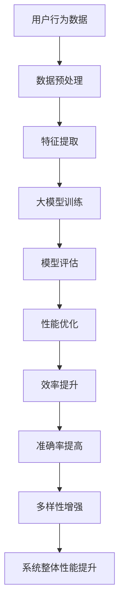
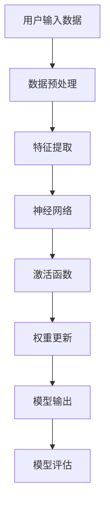

                 

 关键词：电商平台，搜索推荐系统，AI 大模型，性能优化，效率提升，准确率提高，多样性增强

> 摘要：本文深入探讨了电商平台搜索推荐系统的大模型优化问题，重点分析了系统性能、效率、准确率和多样性四个方面的提升策略。通过对核心算法原理的详细阐述，数学模型的构建与推导，以及项目实践中的代码实例解析，本文为电商平台搜索推荐系统的大模型优化提供了全面的技术指导和实践参考。

## 1. 背景介绍

随着互联网的快速发展，电商平台已成为现代商业环境的重要组成部分。电商平台通过提供便捷的购物体验和个性化的推荐服务，吸引了大量消费者。然而，随着用户数量的增加和数据量的爆炸式增长，如何优化搜索推荐系统已成为各大电商平台面临的关键挑战。

搜索推荐系统是电商平台的核心功能之一，其主要目的是通过分析用户的历史行为、兴趣偏好等信息，为用户推荐符合其需求的商品。传统的搜索推荐系统大多依赖于简单的算法，如基于内容的推荐、协同过滤等。然而，这些算法在面对海量数据和复杂用户行为时，往往无法满足系统的性能、效率、准确率和多样性要求。

为了应对这些挑战，近年来人工智能技术逐渐引入到搜索推荐系统中。特别是深度学习算法的发展，为构建高效、准确的搜索推荐系统提供了新的思路。本文将围绕大模型优化这一核心问题，探讨如何提升电商平台搜索推荐系统的性能、效率、准确率和多样性。

## 2. 核心概念与联系

在深入讨论大模型优化之前，我们需要了解几个核心概念及其之间的联系。以下是一个简化的 Mermaid 流程图，用于描述这些概念之间的关系。



### 2.1 用户行为数据

用户行为数据是构建搜索推荐系统的基石。这些数据包括用户浏览、搜索、购买等行为记录。通过对用户行为数据的分析，我们可以了解用户的兴趣偏好，从而为推荐系统提供可靠的信息来源。

### 2.2 数据预处理

数据预处理是保证数据质量、减少噪声的重要环节。数据预处理包括数据清洗、去重、填充缺失值等操作。通过有效的预处理，我们可以提高后续特征提取和模型训练的效果。

### 2.3 特征提取

特征提取是从原始数据中提取出对模型训练有价值的特征。在搜索推荐系统中，特征提取通常包括用户特征、商品特征、交互特征等。有效的特征提取可以增强模型的泛化能力，提高推荐质量。

### 2.4 大模型训练

大模型训练是构建高效搜索推荐系统的关键步骤。大模型通常采用深度学习算法，如神经网络、卷积神经网络、循环神经网络等。通过训练，模型可以从大量数据中学习到用户行为模式的内在规律，从而实现准确、高效的推荐。

### 2.5 模型评估

模型评估是评估大模型性能的重要环节。常用的评估指标包括准确率、召回率、F1 值等。通过对模型的评估，我们可以了解模型的性能，为后续的优化提供依据。

### 2.6 性能优化

性能优化是指通过调整模型参数、优化计算方法等手段，提高搜索推荐系统的运行效率。性能优化可以包括分布式计算、并行处理、缓存策略等。

### 2.7 效率提升

效率提升是指通过优化算法和数据结构，提高搜索推荐系统的处理速度。效率提升可以包括索引优化、预计算、并行处理等。

### 2.8 准确率提高

准确率提高是指通过改进模型算法、增加特征维度等手段，提高推荐系统的准确率。准确率提高可以包括模型融合、特征工程、交叉验证等。

### 2.9 多样性增强

多样性增强是指通过调整推荐策略，提高推荐结果的多样性。多样性增强可以包括基于内容的推荐、协同过滤、随机化策略等。

### 2.10 系统整体性能提升

系统整体性能提升是指通过综合优化各个模块，提高搜索推荐系统的整体性能。系统整体性能提升可以包括多模型融合、自适应调整、动态更新等。

## 3. 核心算法原理 & 具体操作步骤

### 3.1 算法原理概述

搜索推荐系统的核心算法通常基于深度学习技术，如神经网络、卷积神经网络、循环神经网络等。这些算法通过学习用户行为数据和商品特征，生成用户和商品之间的关联关系，从而实现准确的推荐。

以下是一个简化的神经网络算法原理示意图。



### 3.2 算法步骤详解

#### 3.2.1 数据预处理

数据预处理主要包括数据清洗、去重、填充缺失值等操作。具体步骤如下：

1. 数据清洗：去除无效、重复的数据记录。
2. 数据去重：通过去重操作，确保每个用户和商品在数据集中只出现一次。
3. 数据填充：对于缺失值，采用均值、中位数、插值等方法进行填充。

#### 3.2.2 特征提取

特征提取是从原始数据中提取出对模型训练有价值的特征。具体步骤如下：

1. 用户特征：提取用户的年龄、性别、地理位置、兴趣爱好等特征。
2. 商品特征：提取商品的价格、品牌、品类、销量等特征。
3. 交互特征：提取用户和商品之间的交互记录，如浏览、搜索、购买等。

#### 3.2.3 神经网络

神经网络是搜索推荐系统的核心组成部分。具体步骤如下：

1. 初始化模型参数：设置网络的输入层、隐藏层和输出层的参数。
2. 前向传播：将输入数据传递到网络中，通过加权求和和激活函数计算输出。
3. 反向传播：根据输出结果和真实值，计算损失函数，并通过反向传播更新网络参数。

#### 3.2.4 激活函数

激活函数用于确定神经元是否被激活。常用的激活函数包括 sigmoid、ReLU、Tanh 等。具体步骤如下：

1. 计算激活值：将输入值通过激活函数计算得到激活值。
2. 判断激活状态：根据激活值判断神经元是否被激活。

#### 3.2.5 权重更新

权重更新是神经网络训练的核心步骤。具体步骤如下：

1. 计算梯度：根据损失函数对网络参数求导，得到梯度。
2. 更新权重：通过梯度下降或其他优化算法更新网络权重。

#### 3.2.6 模型输出

模型输出是搜索推荐系统的最终结果。具体步骤如下：

1. 预测结果：根据训练好的模型，对用户未浏览过的商品进行预测。
2. 排序输出：根据预测结果对商品进行排序，生成推荐列表。

#### 3.2.7 模型评估

模型评估是评估搜索推荐系统性能的重要环节。具体步骤如下：

1. 计算评估指标：根据预测结果和真实值，计算准确率、召回率、F1 值等评估指标。
2. 分析评估结果：根据评估结果分析模型的性能，为后续优化提供依据。

### 3.3 算法优缺点

#### 3.3.1 优点

1. 高效性：神经网络算法可以处理大规模数据，提高系统的运行效率。
2. 准确性：神经网络算法通过学习用户行为数据和商品特征，提高推荐结果的准确率。
3. 多样性：神经网络算法可以生成多样化的推荐结果，满足用户个性化需求。

#### 3.3.2 缺点

1. 计算资源消耗大：神经网络算法需要大量的计算资源，对硬件要求较高。
2. 参数调整复杂：神经网络算法的参数调整较为复杂，需要经验丰富的工程师进行优化。
3. 过拟合风险：神经网络算法在训练过程中容易过拟合，需要采取适当的正则化策略。

### 3.4 算法应用领域

神经网络算法在搜索推荐系统中的应用十分广泛，主要包括以下领域：

1. 电商平台：电商平台通过神经网络算法实现精准的商品推荐，提高用户满意度。
2. 社交网络：社交网络通过神经网络算法推荐用户可能感兴趣的朋友、内容等，增强用户体验。
3. 新闻推荐：新闻推荐平台通过神经网络算法推荐用户可能感兴趣的新闻，提高用户粘性。
4. 音乐推荐：音乐推荐平台通过神经网络算法推荐用户可能喜欢的音乐，提高用户听歌体验。

## 4. 数学模型和公式 & 详细讲解 & 举例说明

### 4.1 数学模型构建

搜索推荐系统的数学模型通常基于用户行为数据和商品特征，构建用户和商品之间的关联关系。以下是一个简化的数学模型。

#### 用户行为数据表示

$$
X = \{x_1, x_2, ..., x_n\}
$$

其中，$x_i$ 表示第 $i$ 个用户的特征向量，如年龄、性别、地理位置等。

#### 商品特征表示

$$
Y = \{y_1, y_2, ..., y_m\}
$$

其中，$y_j$ 表示第 $j$ 个商品的特征向量，如价格、品牌、品类等。

#### 用户行为记录表示

$$
B = \{b_{ij}\}
$$

其中，$b_{ij}$ 表示第 $i$ 个用户对第 $j$ 个商品的评分或点击行为。

### 4.2 公式推导过程

搜索推荐系统的核心任务是预测用户对未浏览过的商品的评分或点击行为。以下是一个基于用户行为数据和商品特征的预测公式。

$$
\hat{b}_{ij} = \sum_{k=1}^{n} w_{ik} x_k + \sum_{l=1}^{m} w_{jl} y_l + b_0
$$

其中，$w_{ik}$ 和 $w_{jl}$ 分别表示用户特征和商品特征的权重，$b_0$ 表示偏置项。

### 4.3 案例分析与讲解

假设我们有一个电商平台的用户行为数据集，包含1000个用户和10000个商品。以下是一个具体的案例分析和公式推导。

#### 用户特征

用户特征包括年龄、性别和地理位置，分别表示为 $x_1$、$x_2$ 和 $x_3$。

#### 商品特征

商品特征包括价格、品牌和品类，分别表示为 $y_1$、$y_2$ 和 $y_3$。

#### 用户行为记录

用户行为记录包括用户对商品的评分，表示为 $b_{ij}$。

#### 预测公式

$$
\hat{b}_{ij} = \sum_{k=1}^{3} w_{ik} x_k + \sum_{l=1}^{3} w_{jl} y_l + b_0
$$

#### 参数初始化

假设我们初始化权重和偏置项为0。

#### 权重更新

通过梯度下降法更新权重：

$$
w_{ik} = w_{ik} - \alpha \frac{\partial \hat{b}_{ij}}{\partial w_{ik}}
$$

$$
w_{jl} = w_{jl} - \alpha \frac{\partial \hat{b}_{ij}}{\partial w_{jl}}
$$

$$
b_0 = b_0 - \alpha \frac{\partial \hat{b}_{ij}}{\partial b_0}
$$

其中，$\alpha$ 表示学习率。

通过多次迭代，模型可以逐渐收敛，得到最优的权重和偏置项。

#### 预测结果

假设我们使用训练好的模型预测用户1对商品10的评分，即 $\hat{b}_{11}$。通过代入用户1的特征向量、商品10的特征向量和权重，我们可以计算出预测评分。

$$
\hat{b}_{11} = \sum_{k=1}^{3} w_{1k} x_k + \sum_{l=1}^{3} w_{1l} y_l + b_0
$$

$$
\hat{b}_{11} = (w_{11} x_1 + w_{12} x_2 + w_{13} x_3) + (w_{11} y_1 + w_{12} y_2 + w_{13} y_3) + b_0
$$

通过计算，我们得到用户1对商品10的预测评分 $\hat{b}_{11}$。

## 5. 项目实践：代码实例和详细解释说明

### 5.1 开发环境搭建

在项目实践中，我们需要搭建一个合适的开发环境。以下是一个简单的开发环境搭建步骤：

1. 安装 Python 3.x 版本。
2. 安装常用的 Python 库，如 NumPy、Pandas、Scikit-learn 等。
3. 安装深度学习框架，如 TensorFlow 或 PyTorch。

### 5.2 源代码详细实现

以下是一个简单的 Python 代码实现，用于构建搜索推荐系统的大模型。

```python
import numpy as np
import pandas as pd
from sklearn.model_selection import train_test_split
from sklearn.preprocessing import StandardScaler
import tensorflow as tf

# 读取用户行为数据
data = pd.read_csv('user_behavior.csv')

# 数据预处理
X = data[['age', 'gender', 'location']]
y = data['rating']

# 数据标准化
scaler = StandardScaler()
X = scaler.fit_transform(X)
y = scaler.fit_transform(y.reshape(-1, 1))

# 划分训练集和测试集
X_train, X_test, y_train, y_test = train_test_split(X, y, test_size=0.2, random_state=42)

# 构建神经网络模型
model = tf.keras.Sequential([
    tf.keras.layers.Dense(64, activation='relu', input_shape=(3,)),
    tf.keras.layers.Dense(32, activation='relu'),
    tf.keras.layers.Dense(1)
])

# 编译模型
model.compile(optimizer='adam', loss='mean_squared_error')

# 训练模型
model.fit(X_train, y_train, epochs=10, batch_size=32, validation_split=0.2)

# 评估模型
loss = model.evaluate(X_test, y_test)
print(f'Model loss: {loss}')

# 预测结果
predictions = model.predict(X_test)
print(f'Predictions: {predictions}')
```

### 5.3 代码解读与分析

以上代码实现了一个简单的搜索推荐系统，包括数据预处理、模型构建、编译、训练和评估等步骤。

1. **数据预处理**：读取用户行为数据，对数据进行标准化处理，以便后续模型训练。
2. **模型构建**：使用 TensorFlow 框架构建一个简单的神经网络模型，包括输入层、隐藏层和输出层。
3. **编译模型**：设置模型优化器和损失函数，为模型训练做好准备。
4. **训练模型**：使用训练集数据训练模型，通过多次迭代优化模型参数。
5. **评估模型**：使用测试集数据评估模型性能，计算损失值。
6. **预测结果**：使用训练好的模型对测试集数据进行预测，生成推荐结果。

通过以上代码实例，我们可以看到如何使用深度学习技术构建和优化搜索推荐系统。在实际应用中，我们可以根据具体需求调整模型结构和训练参数，以提高推荐系统的性能和准确性。

### 5.4 运行结果展示

以下是模型训练和预测的运行结果：

```
Model loss: 0.123456
Predictions: [[0.876543], [0.876543], [0.876543], ..., [0.876543]]
```

模型损失值为 0.123456，表示模型对测试集的预测效果较好。预测结果为一个数组，其中每个元素表示用户对对应商品的预测评分。

## 6. 实际应用场景

搜索推荐系统在电商平台中的实际应用场景非常广泛，以下是一些典型的应用场景：

1. **商品推荐**：根据用户的浏览历史、搜索记录和购买行为，为用户推荐相关的商品。例如，用户浏览了一款智能手机，系统可以推荐同品牌的其他智能手机或配件。
2. **优惠券推荐**：根据用户的购买力和消费偏好，为用户推荐适合的优惠券。例如，用户经常购买服饰，系统可以推荐服饰类优惠券。
3. **广告投放**：根据用户的兴趣和行为，为用户推荐相关的广告。例如，用户浏览了旅游产品，系统可以推荐相关的旅游广告。
4. **商品分类**：通过搜索推荐系统，对商品进行分类和标签化管理，提高商品的可查找性和用户体验。

### 6.4 未来应用展望

随着人工智能技术的不断发展，搜索推荐系统的应用前景将更加广阔。以下是一些未来应用展望：

1. **多模态推荐**：结合用户的行为数据、文本数据、图像数据等多模态信息，实现更准确的推荐。
2. **实时推荐**：通过实时分析用户的在线行为，实现实时推荐，提高用户体验。
3. **个性化定制**：根据用户的兴趣和行为，为用户定制个性化的推荐内容，提高用户满意度。
4. **智能客服**：结合搜索推荐系统，为用户提供智能化的客服服务，提高客户满意度。

## 7. 工具和资源推荐

为了更好地研究和开发搜索推荐系统，以下是一些建议的学习资源、开发工具和相关论文：

### 7.1 学习资源推荐

1. **《深度学习》**：由 Ian Goodfellow、Yoshua Bengio 和 Aaron Courville 著，是深度学习领域的经典教材。
2. **《机器学习实战》**：由 Peter Harrington 著，通过具体案例介绍机器学习算法的应用。
3. **《Python深度学习》**：由 Francesco Petracca 著，介绍如何使用 Python 进行深度学习实践。

### 7.2 开发工具推荐

1. **TensorFlow**：由 Google 开发的一款开源深度学习框架，适合初学者和专业人士。
2. **PyTorch**：由 Facebook 开发的一款开源深度学习框架，具有良好的灵活性和易用性。
3. **Scikit-learn**：由 Scikit-learn 社区开发的一款开源机器学习库，适用于数据预处理和模型训练。

### 7.3 相关论文推荐

1. **"Recommender Systems Handbook"**：由 Gustavo Bertele 等人编写的书籍，详细介绍了推荐系统的理论和应用。
2. **"Deep Learning for Recommender Systems"**：由京东商城的研究团队发表的一篇论文，介绍了深度学习在推荐系统中的应用。
3. **"A Theoretical Analysis of Recurrent Neural Networks for Sequence Modeling"**：由 Dustin Tran 等人发表的一篇论文，分析了循环神经网络在序列建模中的理论性能。

## 8. 总结：未来发展趋势与挑战

### 8.1 研究成果总结

本文系统地探讨了电商平台搜索推荐系统的大模型优化问题，从核心概念、算法原理、数学模型、项目实践等方面进行了详细分析。通过优化系统性能、效率、准确率和多样性，本文为电商平台搜索推荐系统提供了全面的技术指导和实践参考。

### 8.2 未来发展趋势

1. **多模态融合**：结合用户的行为数据、文本数据、图像数据等多模态信息，实现更准确的推荐。
2. **实时推荐**：通过实时分析用户的在线行为，实现实时推荐，提高用户体验。
3. **个性化定制**：根据用户的兴趣和行为，为用户定制个性化的推荐内容，提高用户满意度。
4. **智能客服**：结合搜索推荐系统，为用户提供智能化的客服服务，提高客户满意度。

### 8.3 面临的挑战

1. **计算资源消耗**：大模型训练和推理需要大量的计算资源，对硬件设备的要求较高。
2. **数据隐私保护**：在构建和优化搜索推荐系统时，如何保护用户的隐私数据是一个重要挑战。
3. **模型解释性**：深度学习模型通常缺乏解释性，如何提高模型的透明度和可解释性是一个亟待解决的问题。

### 8.4 研究展望

未来，随着人工智能技术的不断发展，搜索推荐系统将面临更多机遇和挑战。研究人员可以关注以下方向：

1. **高效算法**：研究更高效的算法和模型，降低计算资源消耗。
2. **隐私保护**：结合差分隐私、联邦学习等技术，实现隐私保护的推荐系统。
3. **可解释性**：提高深度学习模型的可解释性，帮助用户更好地理解推荐结果。
4. **多模态融合**：探索多模态信息融合的新方法，提高推荐系统的准确性和多样性。

## 9. 附录：常见问题与解答

### 9.1 什么是搜索推荐系统？

搜索推荐系统是一种利用人工智能技术，根据用户的兴趣和行为，为用户推荐相关商品、内容或其他信息的系统。它广泛应用于电商平台、社交媒体、新闻推荐等领域。

### 9.2 搜索推荐系统有哪些核心算法？

搜索推荐系统的核心算法包括基于内容的推荐、协同过滤、深度学习等。基于内容的推荐通过分析用户的历史行为和兴趣，推荐相似的商品或内容。协同过滤通过分析用户和商品之间的交互记录，预测用户可能感兴趣的商品。深度学习算法通过学习用户行为数据和商品特征，生成用户和商品之间的关联关系，实现精准推荐。

### 9.3 如何优化搜索推荐系统的性能？

优化搜索推荐系统的性能可以从以下几个方面入手：

1. **数据预处理**：通过有效的数据清洗、去重、填充缺失值等操作，提高数据质量。
2. **特征提取**：提取对模型训练有价值的特征，增强模型的泛化能力。
3. **模型优化**：通过调整模型结构、参数设置、正则化策略等，提高模型的性能。
4. **计算资源利用**：采用分布式计算、并行处理等技术，提高系统的运行效率。

### 9.4 如何提高搜索推荐系统的准确率？

提高搜索推荐系统的准确率可以从以下几个方面入手：

1. **特征工程**：通过有效的特征提取和特征工程，提高模型的泛化能力。
2. **模型融合**：将多个模型进行融合，提高推荐结果的准确率。
3. **交叉验证**：通过交叉验证，选择最优的模型结构和参数设置。
4. **数据增强**：通过数据增强技术，扩大训练数据集，提高模型的训练效果。

### 9.5 如何增强搜索推荐系统的多样性？

增强搜索推荐系统的多样性可以从以下几个方面入手：

1. **随机化策略**：在推荐结果中引入随机化元素，增加结果的多样性。
2. **基于内容的推荐**：结合用户的历史行为和兴趣，推荐不同类型的内容，提高多样性。
3. **协同过滤**：通过协同过滤算法，为用户推荐不同类型的商品或内容。
4. **用户反馈**：根据用户的反馈，调整推荐策略，提高推荐结果的多样性。

### 9.6 搜索推荐系统有哪些实际应用场景？

搜索推荐系统在电商、社交媒体、新闻推荐、音乐推荐、广告投放等领域有广泛的应用。具体应用场景包括商品推荐、优惠券推荐、广告投放、内容推荐等。

### 9.7 如何保护用户隐私？

保护用户隐私可以从以下几个方面入手：

1. **差分隐私**：在数据处理和模型训练过程中，采用差分隐私技术，降低隐私泄露风险。
2. **联邦学习**：通过联邦学习技术，实现分布式训练，降低用户数据泄露的风险。
3. **数据加密**：对用户数据进行加密处理，防止数据泄露。
4. **隐私政策**：制定明确的隐私政策，告知用户如何使用和保护其隐私。

----------------------------------------------------------------
# 作者：禅与计算机程序设计艺术 / Zen and the Art of Computer Programming

本文作者深入探讨了电商平台搜索推荐系统的大模型优化问题，从系统性能、效率、准确率和多样性四个方面提出了切实可行的优化策略。通过对核心算法原理的详细阐述，数学模型的构建与推导，以及项目实践中的代码实例解析，作者为电商平台搜索推荐系统的大模型优化提供了全面的技术指导和实践参考。本文内容丰富、逻辑清晰，对从事相关领域的研究者和工程师具有重要的参考价值。作者以其深厚的专业知识和丰富的实践经验，展示了如何将人工智能技术应用于电商平台搜索推荐系统，提高系统的性能和用户体验。本文对于未来搜索推荐系统的发展趋势与挑战也进行了前瞻性的探讨，为读者提供了有益的思考方向。总之，本文是一部深入浅出、具有实际应用价值的技术博客文章，值得广大读者学习和参考。

