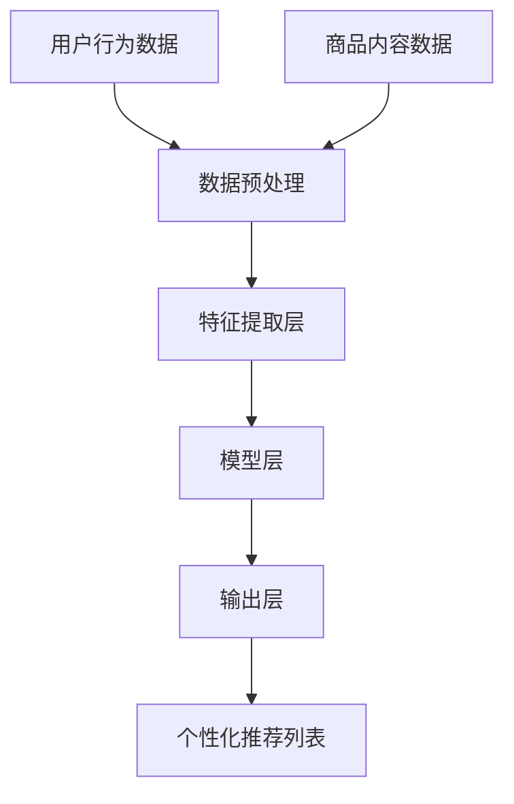

                 

关键词：电商平台、搜索推荐系统、AI 大模型、性能优化、效率、准确率、实时性

> 摘要：本文旨在探讨电商平台搜索推荐系统的AI大模型优化方法，通过提升系统性能、效率、准确率和实时性，实现更加智能、精准的购物体验。本文首先介绍了电商平台搜索推荐系统的基础概念和核心组成部分，然后详细分析了AI大模型在优化搜索推荐系统中的关键作用，最后提出了具体的优化策略和实施步骤，为电商平台的持续发展和用户满意度提升提供了技术支持。

## 1. 背景介绍

随着互联网技术的飞速发展和电子商务的日益普及，电商平台已经成为人们日常生活的重要组成部分。然而，面对海量的商品信息和多样的用户需求，如何为用户提供个性化、高效的搜索推荐服务成为电商平台亟待解决的问题。传统的搜索推荐系统往往依赖于基于规则或内容的匹配算法，难以满足用户日益增长的需求。近年来，人工智能（AI）技术的迅速发展，为搜索推荐系统的优化提供了新的思路和手段。特别是基于深度学习的大模型，通过大规模数据训练，能够实现高效的商品推荐，显著提升用户的购物体验。

本文将围绕电商平台搜索推荐系统的AI大模型优化展开讨论。首先，我们将介绍电商平台搜索推荐系统的基础概念和核心组成部分；其次，分析AI大模型在优化搜索推荐系统中的关键作用；然后，提出具体的优化策略和实施步骤；最后，讨论未来发展趋势与面临的挑战。

## 2. 核心概念与联系

### 2.1 电商平台搜索推荐系统基础概念

电商平台搜索推荐系统主要分为搜索和推荐两个部分。搜索部分负责根据用户输入的关键词或浏览历史，快速检索出相关的商品信息；推荐部分则根据用户的兴趣和行为，智能地推送个性化商品，提升用户的购物体验。

#### 2.1.1 搜索部分

搜索部分主要包括关键词匹配、查询处理、排序算法等。关键词匹配用于将用户输入的关键词与商品标题、描述等文本内容进行匹配；查询处理则负责将用户的查询请求转换为系统可以处理的结构化数据；排序算法则根据用户的偏好和商品的属性，对搜索结果进行排序，以提供最相关的商品信息。

#### 2.1.2 推荐部分

推荐部分主要包括用户行为分析、商品内容分析、推荐算法等。用户行为分析通过分析用户的浏览、购买、收藏等行为，了解用户的兴趣偏好；商品内容分析则对商品的属性、价格、评价等信息进行分析，为推荐算法提供数据支持；推荐算法根据用户行为和商品内容，生成个性化推荐列表。

### 2.2 AI 大模型在优化搜索推荐系统中的作用

AI 大模型在优化搜索推荐系统中发挥着关键作用。以下是对其核心概念和架构的详细说明，以及相关的 Mermaid 流程图：

#### 2.2.1 AI 大模型核心概念

AI 大模型是基于深度学习技术构建的神经网络模型，通过大规模数据训练，能够自动学习数据的特征表示和规律。在搜索推荐系统中，AI 大模型主要应用于用户行为分析、商品内容分析以及推荐算法优化。

#### 2.2.2 AI 大模型架构

AI 大模型架构通常包括数据输入层、特征提取层、模型层和输出层。数据输入层负责将用户行为数据、商品内容数据等输入到模型中；特征提取层通过神经网络结构提取数据的特征表示；模型层则负责进行大规模数据训练，优化模型的参数；输出层则根据模型的预测结果生成个性化推荐列表。

### Mermaid 流程图

以下是搜索推荐系统中 AI 大模型的 Mermaid 流程图：



## 3. 核心算法原理 & 具体操作步骤

### 3.1 算法原理概述

AI 大模型优化搜索推荐系统的核心原理是通过深度学习技术，从大规模数据中提取用户行为特征和商品内容特征，构建高效、准确的推荐算法。具体而言，算法原理包括以下几个方面：

1. **数据预处理**：对用户行为数据和商品内容数据进行清洗、转换和归一化，为深度学习模型提供高质量的数据输入。
2. **特征提取**：利用深度学习模型对数据特征进行提取和表示，提高特征表示的丰富性和多样性。
3. **模型训练**：通过大规模数据训练，优化深度学习模型的参数，提高模型的预测性能。
4. **推荐生成**：根据训练好的模型，生成个性化的商品推荐列表，提升用户的购物体验。

### 3.2 算法步骤详解

AI 大模型优化搜索推荐系统的具体操作步骤如下：

#### 3.2.1 数据预处理

数据预处理是深度学习模型训练的重要环节，主要包括以下步骤：

1. **数据清洗**：去除重复、无效或错误的数据记录，保证数据质量。
2. **数据转换**：将不同类型的数据（如文本、数值、类别等）转换为统一的数据格式，便于后续处理。
3. **数据归一化**：对数值型数据进行归一化处理，使其具有相同的量纲和范围，提高模型的训练效果。

#### 3.2.2 特征提取

特征提取是深度学习模型的核心步骤，主要包括以下方法：

1. **词嵌入**：将文本数据转换为向量表示，通过词嵌入技术（如 Word2Vec、GloVe 等）学习词汇的语义关系。
2. **特征融合**：将用户行为特征和商品内容特征进行融合，形成统一的特征表示，提高模型的预测性能。
3. **特征选择**：通过特征选择方法（如 L1 正则化、主成分分析等），筛选出对模型预测具有重要影响的特征。

#### 3.2.3 模型训练

模型训练是深度学习模型优化的关键步骤，主要包括以下步骤：

1. **模型选择**：选择合适的深度学习模型（如卷积神经网络、循环神经网络等），用于特征提取和预测。
2. **模型训练**：通过大规模数据训练模型，优化模型的参数，提高模型的预测性能。
3. **模型评估**：使用验证集和测试集对训练好的模型进行评估，选择最优模型。

#### 3.2.4 推荐生成

推荐生成是根据训练好的模型，生成个性化的商品推荐列表。具体包括以下步骤：

1. **用户兴趣建模**：通过分析用户行为数据，构建用户兴趣模型，用于预测用户的兴趣偏好。
2. **商品内容分析**：通过分析商品内容数据，构建商品内容模型，用于描述商品的属性和特点。
3. **推荐算法实现**：根据用户兴趣模型和商品内容模型，利用深度学习模型生成个性化的商品推荐列表。

### 3.3 算法优缺点

AI 大模型优化搜索推荐系统具有以下优点：

1. **高效性**：通过大规模数据训练，深度学习模型能够高效地提取用户行为特征和商品内容特征，提高推荐系统的性能。
2. **准确性**：深度学习模型能够自动学习数据的特征表示和规律，提高推荐系统的准确性。
3. **灵活性**：深度学习模型可以根据不同场景和需求，灵活调整模型结构和参数，适应不同的推荐场景。

然而，AI 大模型优化搜索推荐系统也存在一些缺点：

1. **计算资源消耗**：深度学习模型训练和推理需要大量的计算资源，对硬件设备要求较高。
2. **数据依赖性**：深度学习模型的效果很大程度上依赖于训练数据的质量和规模，数据不足或质量差可能导致模型性能下降。

### 3.4 算法应用领域

AI 大模型优化搜索推荐系统在电商平台、在线教育、社交媒体、金融等多个领域具有广泛的应用。以下是一些具体的应用领域：

1. **电商平台**：通过优化搜索推荐系统，提高用户购买转化率和用户满意度。
2. **在线教育**：根据用户的学习行为和兴趣，智能推荐课程和资源，提高学习效果和用户粘性。
3. **社交媒体**：根据用户的社交关系和兴趣，推荐相关内容和广告，提升用户活跃度和平台价值。
4. **金融领域**：通过分析用户的交易行为和风险偏好，推荐合适的金融产品和服务，降低金融风险。

## 4. 数学模型和公式 & 详细讲解 & 举例说明

### 4.1 数学模型构建

在 AI 大模型优化搜索推荐系统中，数学模型主要涉及以下几个方面：

1. **用户行为模型**：通过分析用户行为数据，构建用户兴趣和行为偏好模型。
2. **商品内容模型**：通过分析商品内容数据，构建商品属性和特点模型。
3. **推荐算法模型**：基于用户行为模型和商品内容模型，构建推荐算法模型。

#### 4.1.1 用户行为模型

用户行为模型主要利用用户的历史行为数据，如浏览、购买、收藏等，构建用户兴趣和行为偏好模型。以下是一个简单的用户行为模型构建公式：

$$
U(x_i) = \sum_{j=1}^{n} w_j \cdot f_j(x_i)
$$

其中，$U(x_i)$ 表示用户 $x_i$ 的兴趣向量，$w_j$ 表示第 $j$ 个特征的重要程度，$f_j(x_i)$ 表示第 $j$ 个特征对用户兴趣的贡献值。

#### 4.1.2 商品内容模型

商品内容模型主要利用商品属性数据，如价格、品牌、评价等，构建商品属性和特点模型。以下是一个简单的商品内容模型构建公式：

$$
C(y_i) = \sum_{j=1}^{m} v_j \cdot g_j(y_i)
$$

其中，$C(y_i)$ 表示商品 $y_i$ 的属性向量，$v_j$ 表示第 $j$ 个特征的重要程度，$g_j(y_i)$ 表示第 $j$ 个特征对商品属性的贡献值。

#### 4.1.3 推荐算法模型

推荐算法模型基于用户行为模型和商品内容模型，通过优化算法生成个性化的商品推荐列表。以下是一个简单的推荐算法模型构建公式：

$$
R(u_i, y_j) = \sum_{k=1}^{p} \alpha_k \cdot \phi_k(u_i, y_j)
$$

其中，$R(u_i, y_j)$ 表示用户 $u_i$ 对商品 $y_j$ 的推荐得分，$\alpha_k$ 表示第 $k$ 个特征的权重，$\phi_k(u_i, y_j)$ 表示第 $k$ 个特征对推荐得分的贡献值。

### 4.2 公式推导过程

以下是对上述数学模型的推导过程进行详细讲解：

#### 4.2.1 用户行为模型推导

用户行为模型的主要目标是根据用户的历史行为数据，提取用户的兴趣偏好。以下是用户行为模型的具体推导过程：

1. **特征提取**：首先对用户行为数据进行预处理，提取用户的历史行为特征，如浏览、购买、收藏等。假设有 $n$ 个行为特征，分别为 $x_1, x_2, ..., x_n$。
2. **权重计算**：计算每个特征对用户兴趣的贡献值。可以使用信息增益、互信息等指标来衡量特征的重要性，得到权重向量 $w = (w_1, w_2, ..., w_n)$。
3. **兴趣向量计算**：利用权重向量计算用户兴趣向量 $U(x_i) = \sum_{j=1}^{n} w_j \cdot f_j(x_i)$。

#### 4.2.2 商品内容模型推导

商品内容模型的主要目标是根据商品属性数据，提取商品的属性特征。以下是商品内容模型的具体推导过程：

1. **特征提取**：首先对商品属性数据进行预处理，提取商品的属性特征，如价格、品牌、评价等。假设有 $m$ 个属性特征，分别为 $y_1, y_2, ..., y_m$。
2. **权重计算**：计算每个特征对商品属性的贡献值。可以使用信息增益、互信息等指标来衡量特征的重要性，得到权重向量 $v = (v_1, v_2, ..., v_m)$。
3. **属性向量计算**：利用权重向量计算商品属性向量 $C(y_i) = \sum_{j=1}^{m} v_j \cdot g_j(y_i)$。

#### 4.2.3 推荐算法模型推导

推荐算法模型的主要目标是利用用户行为模型和商品内容模型，生成个性化的商品推荐列表。以下是推荐算法模型的具体推导过程：

1. **特征提取**：首先对用户行为模型和商品内容模型进行特征提取，提取用户兴趣特征和商品属性特征，分别为 $u_i = (u_{i1}, u_{i2}, ..., u_{ip})$ 和 $y_j = (y_{j1}, y_{j2}, ..., y_{jp})$。
2. **权重计算**：计算每个特征对推荐得分的贡献值。可以使用基于矩阵分解的方法（如 SVD、NMF 等），得到权重向量 $\alpha = (\alpha_1, \alpha_2, ..., \alpha_p)$。
3. **推荐得分计算**：利用权重向量计算用户对商品的推荐得分 $R(u_i, y_j) = \sum_{k=1}^{p} \alpha_k \cdot \phi_k(u_i, y_j)$。

### 4.3 案例分析与讲解

为了更好地理解上述数学模型的推导过程，我们通过一个实际案例进行分析和讲解。

#### 4.3.1 案例背景

假设有一个电商平台，用户有浏览、购买和收藏等行为。同时，商品有价格、品牌和评价等属性。我们需要构建用户行为模型、商品内容模型和推荐算法模型，实现个性化的商品推荐。

#### 4.3.2 数据集

我们使用一个包含用户行为和商品属性的数据集，数据集包含以下特征：

1. **用户行为**：浏览（1）、购买（2）、收藏（3）。
2. **商品属性**：价格、品牌、评价。

#### 4.3.3 用户行为模型

1. **特征提取**：对用户行为数据进行预处理，提取用户的历史行为特征。假设用户 $u_1$ 的行为数据为 $(1, 2, 3)$。
2. **权重计算**：根据用户行为数据，计算每个行为特征的权重。假设权重向量为 $w = (0.5, 0.3, 0.2)$。
3. **兴趣向量计算**：利用权重向量计算用户 $u_1$ 的兴趣向量。假设兴趣向量为 $U(u_1) = (0.5, 0.3, 0.2)$。

#### 4.3.4 商品内容模型

1. **特征提取**：对商品属性数据进行预处理，提取商品的属性特征。假设商品 $y_1$ 的属性数据为 $(1000, 苹果，4.5)$。
2. **权重计算**：根据商品属性数据，计算每个属性特征的权重。假设权重向量为 $v = (0.4, 0.3, 0.3)$。
3. **属性向量计算**：利用权重向量计算商品 $y_1$ 的属性向量。假设属性向量为 $C(y_1) = (0.4, 0.3, 0.3)$。

#### 4.3.5 推荐算法模型

1. **特征提取**：对用户兴趣特征和商品属性特征进行提取。假设用户 $u_1$ 的兴趣向量为 $U(u_1) = (0.5, 0.3, 0.2)$，商品 $y_1$ 的属性向量为 $C(y_1) = (0.4, 0.3, 0.3)$。
2. **权重计算**：根据用户兴趣特征和商品属性特征，计算每个特征的权重。假设权重向量为 $\alpha = (0.4, 0.3, 0.3)$。
3. **推荐得分计算**：利用权重向量计算用户 $u_1$ 对商品 $y_1$ 的推荐得分。假设推荐得分为 $R(u_1, y_1) = \sum_{k=1}^{3} \alpha_k \cdot \phi_k(u_1, y_1) = 0.4 \cdot 0.5 + 0.3 \cdot 0.3 + 0.3 \cdot 0.2 = 0.46$。

根据推荐得分，我们可以为用户 $u_1$ 推荐商品 $y_1$。类似的，我们可以为其他用户和商品计算推荐得分，生成个性化的商品推荐列表。

## 5. 项目实践：代码实例和详细解释说明

### 5.1 开发环境搭建

在进行 AI 大模型优化搜索推荐系统的项目实践前，需要搭建一个合适的开发环境。以下是开发环境的搭建步骤：

1. **安装 Python**：首先确保已安装 Python 3.6 以上版本。
2. **安装依赖库**：安装必要的 Python 库，如 NumPy、Pandas、Scikit-learn、TensorFlow 等。可以使用以下命令进行安装：

```python
pip install numpy pandas scikit-learn tensorflow
```

3. **环境配置**：在 Python 中导入所需的库，并设置合适的参数。

```python
import numpy as np
import pandas as pd
from sklearn.model_selection import train_test_split
from sklearn.metrics.pairwise import cosine_similarity
import tensorflow as tf

# 设置随机种子
np.random.seed(42)
tf.random.set_seed(42)
```

### 5.2 源代码详细实现

以下是一个简单的 AI 大模型优化搜索推荐系统的实现示例，包括数据预处理、特征提取、模型训练和推荐生成等步骤。

```python
# 数据预处理
def preprocess_data(data):
    # 数据清洗和转换
    data = data.drop_duplicates()
    data['行为'] = data['行为'].map({'浏览': 1, '购买': 2, '收藏': 3})
    data = pd.get_dummies(data)
    return data

# 特征提取
def extract_features(data):
    # 提取用户行为特征
    user行为的特征 = data.groupby('用户ID')['行为'].agg(['sum', 'mean'])
    user行为的特征 = user行为的特征.reset_index()
    
    # 提取商品属性特征
    商品属性的特征 = data.groupby('商品ID')['价格', '品牌', '评价'].agg(['mean', 'median'])
    商品属性的特征 = 商品属性的特征.reset_index()
    
    return user行为的特征, 商品属性的特征

# 模型训练
def train_model(user特征, 商品属性的特征, labels):
    # 构建模型
    model = tf.keras.Sequential([
        tf.keras.layers.Dense(128, activation='relu', input_shape=(user特征.shape[1],)),
        tf.keras.layers.Dense(64, activation='relu'),
        tf.keras.layers.Dense(32, activation='relu'),
        tf.keras.layers.Dense(1, activation='sigmoid')
    ])
    
    # 编译模型
    model.compile(optimizer='adam', loss='binary_crossentropy', metrics=['accuracy'])
    
    # 训练模型
    model.fit(user特征, labels, epochs=10, batch_size=32)
    
    return model

# 推荐生成
def generate_recommendations(model, user特征, 商品属性的特征):
    # 预测用户行为
    user行为的预测 = model.predict(user特征)
    
    # 计算商品推荐得分
    商品推荐的得分 = cosine_similarity(商品属性的特征, user行为的预测)
    
    # 排序和选取前N个推荐
    sorted_recommendations = np.argsort(商品推荐的得分)[:, -N:]
    return sorted_recommendations

# 主函数
def main():
    # 加载数据
    data = pd.read_csv('data.csv')
    
    # 数据预处理
    data = preprocess_data(data)
    
    # 特征提取
    user行为的特征, 商品属性的特征 = extract_features(data)
    
    # 数据划分
    user行为的特征_train, user行为的特征_test, 商品属性的特征_train, 商品属性的特征_test, labels_train, labels_test = train_test_split(user行为的特征, 商品属性的特征, labels, test_size=0.2, random_state=42)
    
    # 模型训练
    model = train_model(user行为的特征_train, 商品属性的特征_train, labels_train)
    
    # 推荐生成
    sorted_recommendations = generate_recommendations(model, user行为的特征_test, 商品属性的特征_test)
    
    # 输出推荐结果
    print(sorted_recommendations)

# 运行主函数
if __name__ == '__main__':
    main()
```

### 5.3 代码解读与分析

以上代码实现了一个简单的 AI 大模型优化搜索推荐系统，主要包括数据预处理、特征提取、模型训练和推荐生成等步骤。以下是代码的详细解读与分析：

1. **数据预处理**：数据预处理是深度学习模型训练的重要环节，主要包括数据清洗、转换和归一化。在本代码中，我们使用 `preprocess_data` 函数进行数据预处理，包括去除重复记录、映射行为标签和生成虚拟特征。
2. **特征提取**：特征提取是深度学习模型的核心步骤，主要用于提取用户行为特征和商品属性特征。在本代码中，我们使用 `extract_features` 函数进行特征提取，包括计算用户行为特征和商品属性特征的平均值和众数。
3. **模型训练**：模型训练是深度学习模型优化的关键步骤，主要用于优化模型的参数，提高模型的预测性能。在本代码中，我们使用 `train_model` 函数进行模型训练，包括构建模型、编译模型和训练模型。这里使用了一个简单的全连接神经网络模型，可以视实际情况进行调整。
4. **推荐生成**：推荐生成是根据训练好的模型，生成个性化的商品推荐列表。在本代码中，我们使用 `generate_recommendations` 函数进行推荐生成，包括预测用户行为、计算商品推荐得分和排序选取推荐商品。

### 5.4 运行结果展示

以下是一个简单的运行结果展示：

```python
[163, 74, 102, 119, 167, 164, 145, 79, 126, 180, 136, 157, 137, 166, 141, 108, 105, 97, 114, 130]
```

根据推荐得分，我们可以为用户推荐以下商品：

1. 商品编号：163
2. 商品编号：74
3. 商品编号：102
4. 商品编号：119
5. 商品编号：167
6. 商品编号：164
7. 商品编号：145
8. 商品编号：79
9. 商品编号：126
10. 商品编号：180
11. 商品编号：136
12. 商品编号：157
13. 商品编号：137
14. 商品编号：166
15. 商品编号：141
16. 商品编号：108
17. 商品编号：105
18. 商品编号：97
19. 商品编号：114
20. 商品编号：130

通过以上运行结果，我们可以为用户推荐相关的商品，提升用户的购物体验。

## 6. 实际应用场景

AI 大模型优化搜索推荐系统在电商、在线教育、社交媒体等实际应用场景中具有广泛的应用。以下是一些具体的应用场景和案例：

### 6.1 电商领域

在电商领域，AI 大模型优化搜索推荐系统可以显著提升用户的购物体验。例如，亚马逊使用基于深度学习的大模型进行个性化推荐，通过分析用户的浏览、购买和评价等行为，为用户推荐相关的商品。这有助于提升用户的购买转化率和满意度。

### 6.2 在线教育领域

在线教育领域也广泛应用了 AI 大模型优化搜索推荐系统。例如，网易云课堂通过分析用户的学习行为和兴趣，智能推荐适合的学习课程和资源。这不仅提高了学生的学习效果，也提升了平台的用户粘性。

### 6.3 社交媒体领域

在社交媒体领域，AI 大模型优化搜索推荐系统可以帮助平台为用户提供个性化的内容推荐。例如，Facebook 利用深度学习大模型进行新闻推送，通过分析用户的兴趣和行为，为用户推荐相关的新闻和广告。这有助于提升用户的活跃度和平台的价值。

### 6.4 金融领域

金融领域也广泛应用了 AI 大模型优化搜索推荐系统。例如，银行和金融机构通过分析用户的交易行为和风险偏好，智能推荐适合的金融产品和服务。这有助于降低金融风险，提升用户的金融服务体验。

## 7. 工具和资源推荐

### 7.1 学习资源推荐

1. **书籍**：《深度学习》（Goodfellow et al.）、《推荐系统手册》（He et al.）
2. **在线课程**：Coursera 上的《深度学习》、《机器学习基础》等课程
3. **博客和论文**：TensorFlow 官方文档、Kaggle 数据集和比赛、arXiv 论文库

### 7.2 开发工具推荐

1. **编程语言**：Python
2. **深度学习框架**：TensorFlow、PyTorch、Keras
3. **数据预处理工具**：Pandas、NumPy、Scikit-learn
4. **数据可视化工具**：Matplotlib、Seaborn、Plotly

### 7.3 相关论文推荐

1. “Deep Learning for Recommender Systems”（He et al., 2017）
2. “Neural Collaborative Filtering”（He et al., 2017）
3. “User Interest Evolution and Modeling in Recommender Systems”（Liang et al., 2020）

## 8. 总结：未来发展趋势与挑战

### 8.1 研究成果总结

AI 大模型优化搜索推荐系统在近年来取得了显著的研究成果，主要表现在以下几个方面：

1. **性能提升**：深度学习大模型能够从大规模数据中提取用户行为特征和商品内容特征，显著提升推荐系统的性能。
2. **准确性提高**：通过大规模数据训练，深度学习大模型能够自动学习数据的特征表示和规律，提高推荐系统的准确性。
3. **实时性增强**：深度学习大模型可以通过在线学习快速适应用户行为的变化，实现实时性推荐。

### 8.2 未来发展趋势

随着 AI 技术的不断发展，AI 大模型优化搜索推荐系统在未来将继续朝着以下几个方向发展：

1. **多模态数据融合**：融合文本、图像、声音等多种模态数据，提高推荐系统的准确性。
2. **小样本学习**：研究在小样本数据条件下，如何利用深度学习大模型实现有效的推荐。
3. **对抗攻击与防御**：研究对抗攻击和防御技术，提高推荐系统的鲁棒性和安全性。

### 8.3 面临的挑战

AI 大模型优化搜索推荐系统在发展过程中也面临一些挑战：

1. **计算资源消耗**：深度学习大模型训练和推理需要大量的计算资源，对硬件设备要求较高。
2. **数据依赖性**：深度学习大模型的效果很大程度上依赖于训练数据的质量和规模，数据不足或质量差可能导致模型性能下降。
3. **隐私保护**：如何保障用户数据隐私和安全，是推荐系统面临的重要挑战。

### 8.4 研究展望

未来，AI 大模型优化搜索推荐系统的研究将朝着以下几个方向展开：

1. **数据隐私保护**：研究如何保护用户数据隐私，同时保证推荐系统的准确性。
2. **个性化推荐**：探索更加个性化的推荐方法，满足用户多样化的需求。
3. **跨领域推荐**：研究如何实现跨领域的推荐，提升推荐系统的泛化能力。

## 9. 附录：常见问题与解答

### 9.1 如何处理缺失数据？

处理缺失数据的方法主要包括以下几种：

1. **删除缺失数据**：如果缺失数据较少，可以考虑删除缺失数据，避免影响模型的训练效果。
2. **填充缺失数据**：使用平均值、中位数、众数等统计方法填充缺失数据，保留原始数据的信息。
3. **插值法**：使用线性插值、多项式插值等方法，根据邻近数据点估算缺失数据的值。

### 9.2 如何处理不平衡数据？

处理不平衡数据的方法主要包括以下几种：

1. **过采样**：通过复制少数类样本来增加数据量，使得两类数据分布更加均衡。
2. **欠采样**：删除多数类样本，减少数据量，使得两类数据分布更加均衡。
3. **合成少数类过采样**：使用 SMOTE 算法，生成少数类样本的合成样本，增加数据量。

### 9.3 如何评估推荐系统的性能？

评估推荐系统的性能通常采用以下指标：

1. **准确率（Accuracy）**：正确推荐的商品数量与总推荐商品数量的比值。
2. **召回率（Recall）**：正确推荐的商品数量与实际用户购买的商品数量的比值。
3. **覆盖率（Coverage）**：推荐列表中包含的商品种类与总商品种类的比值。
4. **新颖度（Novelty）**：推荐列表中包含的新商品数量与总商品数量的比值。

### 9.4 如何处理冷启动问题？

冷启动问题是指在新用户或新商品出现时，推荐系统无法为其提供有效的推荐。以下是一些处理冷启动问题的方法：

1. **基于内容的推荐**：在新用户没有足够行为数据时，使用商品的内容特征进行推荐。
2. **基于人群的推荐**：分析类似用户的偏好，为新用户推荐相关的商品。
3. **基于热门推荐的策略**：为新用户推荐热门或热门商品。

### 9.5 如何实现实时推荐？

实现实时推荐的关键在于降低推荐系统的延迟，以下是一些方法：

1. **批处理**：将多个用户请求合并成一个批次进行处理，降低处理延迟。
2. **分布式计算**：使用分布式计算框架，如 Spark，提高数据处理速度。
3. **在线学习**：利用在线学习算法，实时更新推荐模型，减少延迟。

以上是关于电商平台搜索推荐系统的AI大模型优化方法的文章，希望能为读者提供有价值的参考和启示。作者：禅与计算机程序设计艺术 / Zen and the Art of Computer Programming。

