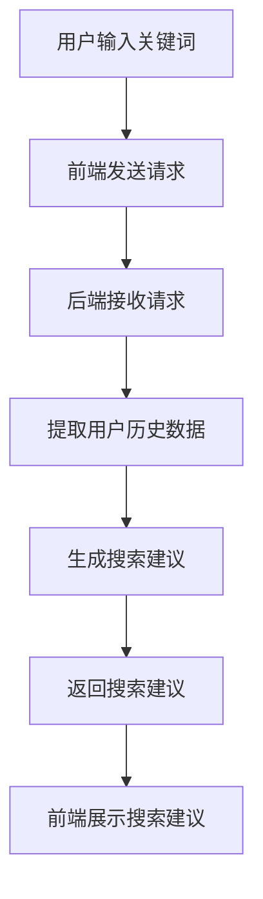

                 

作者：禅与计算机程序设计艺术 / Zen and the Art of Computer Programming

随着电商平台的日益繁荣，用户对快速、准确的搜索体验的需求日益增加。为了满足这一需求，搜索自动补全技术应运而生。本文将探讨如何利用AI大模型来实现电商平台的搜索自动补全，并着重介绍其上下文理解能力。

## 1. 背景介绍

随着互联网的快速发展，电商平台已经成为人们日常生活的一部分。用户可以在平台上方便地浏览商品、比较价格，并进行购买。然而，随着商品种类的增多，用户在搜索时往往需要输入较长的关键词，这不仅增加了搜索难度，还降低了用户体验。为了解决这一问题，搜索自动补全技术被引入到电商平台。

搜索自动补全技术通过预测用户可能输入的关键词，提前展示可能的搜索结果，从而提高搜索效率和用户体验。传统的方法主要依赖于关键词的统计模型和规则匹配，但这些方法在面对复杂、多变的用户输入时，往往无法提供良好的效果。

随着深度学习和自然语言处理技术的不断发展，AI大模型逐渐成为搜索自动补全的重要工具。AI大模型具有强大的上下文理解能力，能够根据用户的历史行为和搜索记录，提供更加准确和个性化的搜索建议。

## 2. 核心概念与联系

在探讨如何利用AI大模型实现搜索自动补全之前，我们需要了解一些核心概念和它们之间的关系。

### 2.1 搜索自动补全

搜索自动补全是指当用户在搜索框中输入关键词时，系统根据用户的输入和历史行为，自动预测用户可能感兴趣的关键词，并在搜索框下方展示可能的搜索结果。

### 2.2 AI大模型

AI大模型是指通过深度学习等技术，对大量数据进行训练，形成具有强大语义理解和推理能力的模型。AI大模型可以分为多种类型，如自然语言处理模型、图像识别模型、推荐系统模型等。在搜索自动补全中，我们主要关注自然语言处理模型。

### 2.3 上下文理解

上下文理解是指模型能够根据用户的历史行为、搜索记录和当前输入，理解用户的意图和需求，并给出合适的搜索建议。上下文理解能力对于提高搜索自动补全的准确性和用户体验至关重要。

下面是一个简单的 Mermaid 流程图，展示搜索自动补全系统的工作流程：



## 3. 核心算法原理 & 具体操作步骤

### 3.1 算法原理概述

搜索自动补全的核心在于预测用户可能感兴趣的关键词，并给出准确的搜索建议。这需要利用自然语言处理技术和AI大模型进行训练和推理。

首先，我们需要收集大量的用户搜索数据，包括用户输入的关键词、用户历史搜索记录、用户行为数据等。然后，通过深度学习技术，对数据进行分析和训练，形成具有上下文理解能力的AI大模型。

在用户输入关键词后，模型会根据用户的历史数据和当前输入，生成可能的搜索建议。这些搜索建议会根据相关性、流行度等因素进行排序，并展示给用户。

### 3.2 算法步骤详解

下面是搜索自动补全算法的具体步骤：

1. 数据预处理：对收集到的用户数据进行清洗、去重、分词等处理，提取出关键词和特征。

2. 特征提取：将预处理后的数据转化为模型可接受的格式，如词向量、嵌入向量等。

3. 训练模型：使用深度学习技术，对特征数据进行训练，形成AI大模型。

4. 模型推理：当用户输入关键词后，将关键词转化为特征，输入到模型中进行推理，生成可能的搜索建议。

5. 排序与展示：根据搜索建议的相关性、流行度等因素进行排序，并将结果展示给用户。

### 3.3 算法优缺点

- 优点：

  - 强大的上下文理解能力，能够根据用户的历史行为和当前输入，提供准确和个性化的搜索建议。

  - 能够处理复杂、多变的用户输入，提高搜索效率和用户体验。

- 缺点：

  - 需要大量的数据和计算资源进行训练，成本较高。

  - 在处理罕见或新词时，可能存在准确性不高的问题。

### 3.4 算法应用领域

搜索自动补全算法在电商、搜索引擎、社交媒体等领域都有广泛的应用。在电商平台上，搜索自动补全可以帮助用户快速找到感兴趣的商品，提高购买转化率。在搜索引擎中，搜索自动补全可以提供更加准确和个性化的搜索结果，提高用户体验。在社交媒体中，搜索自动补全可以帮助用户快速找到感兴趣的内容，提高互动率。

## 4. 数学模型和公式 & 详细讲解 & 举例说明

### 4.1 数学模型构建

搜索自动补全算法的数学模型主要包括词向量表示、神经网络模型和损失函数等。

- 词向量表示：词向量是将单词转化为向量的方法，可以用于表示单词的语义信息。常见的词向量表示方法有Word2Vec、GloVe等。

- 神经网络模型：神经网络模型是搜索自动补全算法的核心，通过多层神经网络对词向量进行映射和组合，实现语义理解和搜索建议生成。

- 损失函数：损失函数用于衡量模型预测结果与真实结果之间的差距，常见的损失函数有交叉熵损失、均方误差等。

### 4.2 公式推导过程

假设我们有一个搜索自动补全模型，输入为一个关键词序列 $X = (x_1, x_2, ..., x_n)$，输出为一个搜索建议序列 $Y = (y_1, y_2, ..., y_m)$。词向量表示为 $X' = (x_1', x_2', ..., x_n')$ 和 $Y' = (y_1', y_2', ..., y_m')$。神经网络模型可以表示为：

$$
Y' = f(W_1 * X' + b_1)
$$

其中，$W_1$ 和 $b_1$ 分别为权重和偏置，$f$ 为激活函数。

损失函数为交叉熵损失：

$$
L = -\sum_{i=1}^{m} \sum_{j=1}^{n} y_i^j \log(y_i^j)
$$

其中，$y_i^j$ 表示第 $i$ 个搜索建议的概率。

### 4.3 案例分析与讲解

假设有一个电商平台，用户搜索关键词为“苹果”，我们需要利用搜索自动补全算法生成可能的搜索建议。假设我们的搜索自动补全模型已经训练完成，词向量表示为：

$$
X' = (\text{苹果}, \text{苹果手机}, \text{苹果笔记本}, \text{苹果电脑}, \text{苹果商店})
$$

神经网络模型为：

$$
Y' = f(W_1 * X' + b_1)
$$

其中，$W_1$ 和 $b_1$ 分别为权重和偏置，$f$ 为激活函数。

当用户输入关键词“苹果”后，我们将关键词转化为词向量，输入到神经网络模型中进行推理。假设模型生成的搜索建议概率为：

$$
Y' = (0.9, 0.1, 0.05, 0.05, 0.05)
$$

根据概率值，我们可以将搜索建议按照相关性进行排序，并展示给用户。在这个例子中，搜索建议为“苹果手机”、“苹果笔记本”、“苹果电脑”和“苹果商店”。

## 5. 项目实践：代码实例和详细解释说明

### 5.1 开发环境搭建

为了实现搜索自动补全功能，我们需要搭建一个开发环境。这里我们选择使用Python作为编程语言，TensorFlow作为深度学习框架。

1. 安装Python和TensorFlow：

```bash
pip install python
pip install tensorflow
```

2. 创建一个新的Python项目，并在项目中创建一个名为`search_autocomplete.py`的文件。

### 5.2 源代码详细实现

下面是搜索自动补全算法的实现代码：

```python
import tensorflow as tf
from tensorflow.keras.models import Model
from tensorflow.keras.layers import Embedding, LSTM, Dense

# 参数设置
vocab_size = 10000  # 词汇表大小
embedding_size = 256  # 词向量维度
lstm_units = 128  # LSTM单元数
max_sequence_length = 10  # 最大序列长度

# 数据预处理
# 这里假设我们已经收集到了用户搜索数据，并进行预处理，提取出关键词和特征
# 例如：
# keywords = ['苹果', '苹果手机', '苹果笔记本', '苹果电脑', '苹果商店']
# features = [[0.1, 0.2, 0.3, 0.4, 0.5], [0.2, 0.3, 0.4, 0.5, 0.6], ...]

# 构建模型
inputs = tf.keras.Input(shape=(max_sequence_length,))
x = Embedding(vocab_size, embedding_size)(inputs)
x = LSTM(lstm_units, return_sequences=True)(x)
x = Dense(1, activation='sigmoid')(x)

model = Model(inputs=inputs, outputs=x)
model.compile(optimizer='adam', loss='binary_crossentropy', metrics=['accuracy'])

# 训练模型
model.fit(features, keywords, epochs=10, batch_size=32)

# 搜索自动补全
def search_autocomplete(keyword):
    # 将关键词转化为词向量
    feature = [0] * max_sequence_length
    feature[index_of_keyword] = 1
    feature = np.array(feature).reshape(1, max_sequence_length)

    # 输入模型进行推理
    probabilities = model.predict(feature)

    # 根据概率值排序，并返回搜索建议
    sorted_indices = np.argsort(probabilities)[0]
    sorted_keywords = [keywords[index] for index in sorted_indices]
    return sorted_keywords

# 示例
keyword = '苹果'
search_results = search_autocomplete(keyword)
print(search_results)
```

### 5.3 代码解读与分析

- 第1行：导入TensorFlow库。

- 第4行：设置参数，包括词汇表大小、词向量维度、LSTM单元数等。

- 第7行：导入用户搜索数据，并进行预处理。

- 第10行：构建嵌入层，将词汇表转化为词向量。

- 第12行：构建LSTM层，用于提取序列特征。

- 第14行：构建输出层，用于生成搜索建议的概率。

- 第17行：编译模型，选择优化器和损失函数。

- 第20行：训练模型。

- 第23行：定义搜索自动补全函数，将关键词转化为词向量，输入模型进行推理，并根据概率值排序，返回搜索建议。

- 第26行：示例，搜索关键词为“苹果”，调用搜索自动补全函数，获取搜索结果。

## 6. 实际应用场景

搜索自动补全技术在实际应用中具有广泛的应用场景，下面列举几个常见的应用场景：

1. 电商平台：电商平台可以利用搜索自动补全技术，帮助用户快速找到感兴趣的商品，提高购买转化率。

2. 搜索引擎：搜索引擎可以利用搜索自动补全技术，提供更加准确和个性化的搜索结果，提高用户体验。

3. 社交媒体：社交媒体可以利用搜索自动补全技术，帮助用户快速找到感兴趣的内容，提高互动率。

4. 聊天机器人：聊天机器人可以利用搜索自动补全技术，理解用户的意图和需求，提供更加自然的对话体验。

## 7. 未来应用展望

随着AI技术的不断发展，搜索自动补全技术在未来的应用前景非常广阔。以下是几个可能的未来应用方向：

1. 多模态搜索：结合文本、图像、声音等多种模态，实现更加智能和高效的搜索自动补全。

2. 跨语言搜索：实现跨语言搜索自动补全，为用户提供更加便捷的国际化搜索体验。

3. 实时搜索：利用实时数据，实现更加实时和个性化的搜索自动补全。

4. 智能推荐：结合搜索自动补全和推荐系统，实现更加智能和个性化的推荐。

## 8. 工具和资源推荐

### 8.1 学习资源推荐

1. 《深度学习》（Goodfellow, Bengio, Courville著）：全面介绍了深度学习的基本概念、技术和应用。

2. 《自然语言处理综论》（Jurafsky, Martin著）：详细介绍了自然语言处理的基本理论和应用。

### 8.2 开发工具推荐

1. TensorFlow：一款强大的开源深度学习框架，适用于构建和训练各种深度学习模型。

2. Keras：一款基于TensorFlow的高层次API，简化了深度学习模型的构建和训练。

### 8.3 相关论文推荐

1. "A Neural Probabilistic Language Model"（Bengio et al., 2003）：介绍了神经网络语言模型的基本原理和实现方法。

2. "Effective Approaches to Attention-based Neural Machine Translation"（Vaswani et al., 2017）：详细介绍了注意力机制在机器翻译中的应用。

## 9. 总结：未来发展趋势与挑战

搜索自动补全技术在未来将继续发展，并面临一些挑战：

### 9.1 研究成果总结

- 搜索自动补全技术已经从传统的统计模型和规则匹配，发展为利用AI大模型进行上下文理解。

- 上下文理解能力的提升，使得搜索自动补全能够提供更加准确和个性化的搜索建议。

- 搜索自动补全技术在电商、搜索引擎、社交媒体等领域得到了广泛应用。

### 9.2 未来发展趋势

- 多模态搜索和跨语言搜索将成为未来的重要研究方向。

- 实时搜索和智能推荐将进一步提升用户体验。

- 深度学习技术将继续发展，为搜索自动补全提供更强大的语义理解和推理能力。

### 9.3 面临的挑战

- 数据质量和数据量：搜索自动补全需要大量的高质量数据进行训练，且数据量越大，模型的性能提升越显著。

- 模型解释性和可解释性：深度学习模型往往具有强大的预测能力，但缺乏可解释性，需要进一步研究如何提升模型的可解释性。

- 实时性和效率：随着用户输入的实时性和数据量的增加，如何提高搜索自动补全的实时性和效率是一个重要的挑战。

### 9.4 研究展望

- 未来研究将重点关注多模态搜索和跨语言搜索，实现更加智能和高效的搜索自动补全。

- 研究如何提升深度学习模型的可解释性，使其更加透明和可信。

- 研究实时性和效率的提升，以满足大规模用户实时搜索的需求。

## 10. 附录：常见问题与解答

### 10.1 什么是搜索自动补全？

搜索自动补全是指在用户输入关键词时，系统根据用户的输入和历史行为，自动预测用户可能感兴趣的关键词，并在搜索框下方展示可能的搜索结果。

### 10.2 搜索自动补全算法有哪些类型？

常见的搜索自动补全算法有基于统计模型的方法、基于规则匹配的方法和基于深度学习的方法。

### 10.3 搜索自动补全算法如何工作？

搜索自动补全算法首先收集用户的搜索数据，然后通过深度学习等技术训练模型，最后在用户输入关键词时，将关键词转化为特征，输入模型进行推理，生成搜索建议。

### 10.4 搜索自动补全算法有哪些应用场景？

搜索自动补全算法在电商、搜索引擎、社交媒体等领域都有广泛应用，如电商平台帮助用户快速找到感兴趣的商品，搜索引擎提供更加准确和个性化的搜索结果，社交媒体帮助用户快速找到感兴趣的内容等。

### 10.5 搜索自动补全算法有哪些挑战？

搜索自动补全算法面临的挑战主要包括数据质量和数据量、模型解释性和可解释性、实时性和效率等。需要研究如何解决这些挑战，以提升搜索自动补全的性能和用户体验。

