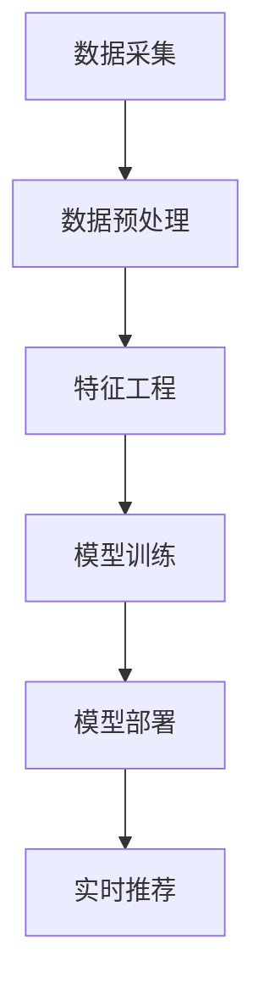

                 

关键词：电商平台，AI 大模型，搜索推荐系统，数据质量控制，处理效率，技术实践

摘要：本文将深入探讨电商平台如何通过 AI 大模型实践来提升搜索推荐系统的核心价值。文章首先介绍了 AI 大模型的基本概念，然后详细剖析了搜索推荐系统的原理与架构，重点讨论了数据质量控制与处理效率在其中的关键作用。通过具体算法原理、数学模型以及项目实践案例，本文为电商平台的 AI 大模型应用提供了详尽的指导和建议。

## 1. 背景介绍

随着互联网和电子商务的快速发展，电商平台已经成为现代商业中不可或缺的一部分。消费者在电商平台上搜索和浏览商品，进行购物决策，这个过程高度依赖于平台的搜索推荐系统。搜索推荐系统不仅影响用户的购物体验，还直接关系到电商平台的业务增长和盈利能力。因此，如何通过技术手段提升搜索推荐系统的质量和效率，成为了电商平台亟需解决的重要课题。

近年来，人工智能（AI）技术的迅猛发展为搜索推荐系统带来了全新的机遇。特别是大模型（Large Model）的兴起，使得电商平台能够利用海量的用户数据和商品信息，实现更智能、更精准的搜索和推荐。大模型通常拥有数十亿甚至数万亿个参数，通过深度学习算法对数据进行训练，能够自动提取特征、进行预测和生成。这种技术变革不仅提高了搜索推荐系统的准确性，还大幅提升了用户体验和业务效果。

然而，大模型的引入也带来了新的挑战。首先是数据质量控制的问题，如何确保数据的质量、多样性和完整性，是构建高质量大模型的前提。其次是处理效率的问题，大模型的训练和推理需要庞大的计算资源和时间，如何在保证效果的前提下提高处理效率，是电商平台需要面对的难题。

本文将从以下几个方面展开讨论：首先介绍 AI 大模型的基本概念和原理，然后详细剖析搜索推荐系统的核心架构，探讨数据质量控制与处理效率在大模型应用中的关键作用。接着，通过具体算法原理和数学模型的讲解，以及项目实践案例的分析，为电商平台的 AI 大模型实践提供详细的指导。最后，对未来的发展趋势和面临的挑战进行展望，为行业提供有益的参考。

## 2. 核心概念与联系

### 2.1 AI 大模型的基本概念

AI 大模型是指具有大量参数的深度学习模型，通常由神经网络构成。这些模型通过学习海量数据，能够自动提取复杂的特征，并在各种任务中实现高度准确的预测和生成。AI 大模型的发展源于深度学习技术的进步，特别是在计算机硬件性能提升和大数据时代的推动下，大模型的研究和应用得到了广泛关注。

典型的 AI 大模型包括：

- **Transformer 模型**：广泛应用于自然语言处理（NLP）领域，如BERT、GPT等，具有强大的语义理解和生成能力。
- **卷积神经网络（CNN）**：在计算机视觉领域表现出色，能够有效提取图像特征。
- **生成对抗网络（GAN）**：在图像生成和增强方面具有独特的优势。

### 2.2 搜索推荐系统的核心架构

搜索推荐系统的核心架构主要包括以下几个关键组件：

- **数据采集与预处理**：从多个数据源收集用户行为数据和商品信息，并进行清洗、去重、归一化等预处理操作。
- **特征工程**：将原始数据转化为模型可用的特征表示，通过提取用户历史行为、商品属性、用户标签等特征，构建高质量的特征向量。
- **模型训练**：利用大量标注数据训练大模型，通过优化算法调整模型参数，实现高效的特征提取和预测。
- **模型部署与实时推荐**：将训练好的模型部署到线上服务，实时对用户的搜索和浏览行为进行预测和推荐。

### 2.3 数据质量控制与处理效率的关键作用

数据质量控制与处理效率在大模型应用中起着至关重要的作用。

- **数据质量控制**：高质量的数据是构建高质量大模型的基础。电商平台需要确保数据的完整性、准确性和多样性。具体措施包括：
  - **数据清洗**：去除无效、错误或重复的数据，确保数据的纯净。
  - **数据增强**：通过数据扩展、生成对抗网络（GAN）等方法，提高数据的多样性和质量。
  - **数据校验**：引入自动化工具和人工审核相结合的方式，确保数据的准确性。

- **处理效率**：大模型的训练和推理过程需要大量的计算资源和时间。电商平台需要通过以下方法提高处理效率：
  - **并行计算**：利用分布式计算技术，将模型训练和推理任务分解到多个计算节点上，实现并行处理。
  - **模型压缩**：通过模型剪枝、量化等技术，减小模型的参数规模，降低计算复杂度。
  - **模型融合**：结合多种算法和技术，实现模型融合和协同优化，提高整体处理效率。

### 2.4 Mermaid 流程图（示例）

下面是一个简单的 Mermaid 流程图，展示了数据从采集到模型部署的流程：



通过这个流程图，我们可以清晰地看到各个环节之间的逻辑关系，为后续的具体讲解和案例分析奠定了基础。

### 2.5 大模型在搜索推荐系统中的应用

大模型在搜索推荐系统中的应用主要体现在以下几个方面：

- **个性化推荐**：通过学习用户的兴趣和行为模式，大模型能够为用户推荐个性化的商品，提升用户满意度和留存率。
- **自动分类与标签**：大模型能够自动对商品进行分类和标签标注，提高数据管理和检索效率。
- **搜索结果排序**：大模型可以根据用户的搜索历史和偏好，对搜索结果进行智能排序，提升搜索体验。
- **趋势预测与市场分析**：大模型能够分析用户行为和商品趋势，为电商平台提供重要的商业决策依据。

### 2.6 总结

本章从 AI 大模型的基本概念、搜索推荐系统的核心架构，以及数据质量控制与处理效率的关键作用等方面，系统地介绍了大模型在搜索推荐系统中的应用。通过 Mermaid 流程图，我们进一步明确了各个环节的逻辑关系，为后续的具体讲解和分析奠定了基础。

## 3. 核心算法原理 & 具体操作步骤

### 3.1 算法原理概述

在搜索推荐系统中，大模型的核心算法主要包括以下几种：

- **深度神经网络（DNN）**：DNN 是一种多层前馈神经网络，通过非线性变换和多层特征提取，能够自动学习数据的复杂模式。在搜索推荐系统中，DNN 常用于用户兴趣建模和商品特征提取。

- **卷积神经网络（CNN）**：CNN 是一种专门用于处理图像数据的神经网络，通过卷积操作提取图像特征。在搜索推荐系统中，CNN 可以用于商品图像识别和自动分类。

- **循环神经网络（RNN）**：RNN 具有记忆功能，能够处理序列数据。在搜索推荐系统中，RNN 可以用于用户行为序列建模和推荐。

- **Transformer 模型**：Transformer 模型是一种基于自注意力机制的神经网络模型，在自然语言处理领域取得了显著成果。在搜索推荐系统中，Transformer 模型可以用于用户兴趣理解和商品关联预测。

### 3.2 算法步骤详解

以下是构建搜索推荐系统的大模型的具体步骤：

#### 3.2.1 数据采集与预处理

1. **数据收集**：从电商平台的多个数据源收集用户行为数据、商品信息、用户标签等。
2. **数据清洗**：去除无效、错误或重复的数据，保证数据的纯净。
3. **数据归一化**：对数据进行归一化处理，使其在相同的尺度范围内。

#### 3.2.2 特征工程

1. **用户特征提取**：提取用户的基本信息、历史行为、浏览记录等特征。
2. **商品特征提取**：提取商品的基本信息、属性、标签等特征。
3. **交互特征提取**：计算用户与商品之间的交互特征，如点击率、购买率、浏览时长等。

#### 3.2.3 模型训练

1. **模型选择**：根据任务需求选择合适的神经网络模型，如 DNN、CNN、RNN 或 Transformer。
2. **模型初始化**：对模型参数进行初始化，可以使用随机初始化或预训练模型。
3. **训练过程**：使用训练数据对模型进行训练，通过反向传播算法优化模型参数。
4. **模型评估**：使用验证数据对模型进行评估，调整模型参数以达到最优效果。

#### 3.2.4 模型部署与实时推荐

1. **模型部署**：将训练好的模型部署到线上服务，实现实时推荐。
2. **实时推荐**：根据用户的实时行为数据，使用模型生成推荐结果，展示给用户。

### 3.3 算法优缺点

#### 优点：

- **高精度**：大模型通过深度学习算法能够自动提取复杂特征，实现高精度的预测和推荐。
- **灵活性**：大模型可以适应不同的任务需求，通过调整模型结构和参数，实现多种算法的融合。
- **可扩展性**：大模型可以轻松扩展到大规模数据集，实现高效的数据处理和模型训练。

#### 缺点：

- **计算资源消耗大**：大模型需要大量的计算资源和时间进行训练和推理，对硬件设施有较高要求。
- **数据依赖性高**：大模型的性能高度依赖数据质量，如果数据存在偏差或噪声，会影响模型的预测效果。
- **模型解释性差**：大模型的内部结构复杂，难以解释每个参数的作用和影响，增加了模型调优的难度。

### 3.4 算法应用领域

大模型在搜索推荐系统中的应用非常广泛，主要包括：

- **电商推荐**：电商平台通过大模型实现个性化商品推荐，提高用户满意度和留存率。
- **搜索引擎**：搜索引擎使用大模型优化搜索结果排序，提高搜索精度和用户体验。
- **社交媒体**：社交媒体平台通过大模型实现内容推荐，提升用户活跃度和参与度。
- **在线教育**：在线教育平台利用大模型分析用户学习行为，实现个性化课程推荐。

### 3.5 总结

本章详细介绍了搜索推荐系统中大模型的核心算法原理和具体操作步骤，分析了算法的优缺点以及应用领域。通过本章的内容，读者可以全面了解大模型在搜索推荐系统中的重要作用，并为实际应用提供技术参考。

### 3.6 数学模型和公式

在搜索推荐系统中，大模型的数学模型和公式起到了至关重要的作用。以下我们将详细讲解这些数学模型和公式的构建过程，以及它们在实际应用中的意义。

#### 3.6.1 数学模型构建

搜索推荐系统的大模型通常是基于深度学习算法构建的。深度学习模型的数学基础主要包括神经元激活函数、损失函数、优化算法等。以下是一个简单的数学模型构建过程：

1. **神经元激活函数**：

   激活函数是神经网络中的一个关键组件，用于引入非线性特性。常见的激活函数包括 Sigmoid、ReLU 和 Tanh。例如，ReLU 函数的定义如下：

   $$
   a = \max(0, x)
   $$

2. **损失函数**：

   损失函数用于衡量模型预测值与真实值之间的差距。常见的损失函数包括均方误差（MSE）和交叉熵（Cross-Entropy）。MSE 的定义如下：

   $$
   Loss = \frac{1}{2} \sum_{i=1}^{n} (y_i - \hat{y}_i)^2
   $$

   其中，$y_i$ 是真实标签，$\hat{y}_i$ 是模型预测值。

3. **优化算法**：

   优化算法用于调整模型参数，以最小化损失函数。常见的优化算法包括随机梯度下降（SGD）和 Adam。SGD 的更新规则如下：

   $$
   \theta = \theta - \alpha \nabla_{\theta} J(\theta)
   $$

   其中，$\theta$ 是模型参数，$\alpha$ 是学习率，$J(\theta)$ 是损失函数。

#### 3.6.2 公式推导过程

以下是一个简单的公式推导示例，用于计算多层感知机（MLP）的输出。

假设我们有一个两层感知机，输入层有 $n$ 个神经元，隐藏层有 $m$ 个神经元，输出层有 $k$ 个神经元。输入向量为 $x \in \mathbb{R}^n$，隐藏层激活向量为 $a \in \mathbb{R}^m$，输出层激活向量为 $y \in \mathbb{R}^k$。权重矩阵分别为 $W_{in} \in \mathbb{R}^{n \times m}$，$W_{hid} \in \mathbb{R}^{m \times k}$。

1. **隐藏层输出**：

   $$
   a = \sigma(W_{in}x + b_{in})
   $$

   其中，$\sigma$ 是激活函数，$b_{in}$ 是输入层的偏置。

2. **输出层输出**：

   $$
   y = \sigma(W_{hid}a + b_{hid})
   $$

   其中，$b_{hid}$ 是隐藏层的偏置。

#### 3.6.3 案例分析与讲解

以下是一个简单的案例，用于说明如何使用上述公式推导多层感知机的输出。

假设输入层有 3 个神经元，隐藏层有 2 个神经元，输出层有 1 个神经元。输入向量 $x = [1, 2, 3]$，隐藏层权重矩阵 $W_{in} = \begin{bmatrix} 0.1 & 0.2 & 0.3 \\ 0.4 & 0.5 & 0.6 \end{bmatrix}$，隐藏层偏置 $b_{in} = [0.1, 0.2]$；隐藏层权重矩阵 $W_{hid} = \begin{bmatrix} 0.1 & 0.2 \\ 0.3 & 0.4 \end{bmatrix}$，输出层偏置 $b_{hid} = [0.1, 0.2]$。

1. **隐藏层输出**：

   $$
   a = \sigma(W_{in}x + b_{in}) = \sigma(\begin{bmatrix} 0.1 & 0.2 & 0.3 \\ 0.4 & 0.5 & 0.6 \end{bmatrix} \begin{bmatrix} 1 \\ 2 \\ 3 \end{bmatrix} + \begin{bmatrix} 0.1 \\ 0.2 \end{bmatrix}) = \sigma(\begin{bmatrix} 0.7 \\ 2.5 \end{bmatrix} + \begin{bmatrix} 0.1 \\ 0.2 \end{bmatrix}) = \sigma(\begin{bmatrix} 0.8 \\ 2.7 \end{bmatrix})
   $$

   $$
   a = \begin{bmatrix} \max(0, 0.8) \\ \max(0, 2.7) \end{bmatrix} = \begin{bmatrix} 0.8 \\ 2.7 \end{bmatrix}
   $$

2. **输出层输出**：

   $$
   y = \sigma(W_{hid}a + b_{hid}) = \sigma(\begin{bmatrix} 0.1 & 0.2 \\ 0.3 & 0.4 \end{bmatrix} \begin{bmatrix} 0.8 \\ 2.7 \end{bmatrix} + \begin{bmatrix} 0.1 \\ 0.2 \end{bmatrix}) = \sigma(\begin{bmatrix} 0.47 \\ 1.06 \end{bmatrix} + \begin{bmatrix} 0.1 \\ 0.2 \end{bmatrix}) = \sigma(\begin{bmatrix} 0.57 \\ 1.26 \end{bmatrix})
   $$

   $$
   y = \begin{bmatrix} \max(0, 0.57) \\ \max(0, 1.26) \end{bmatrix} = \begin{bmatrix} 0.57 \\ 1.26 \end{bmatrix}
   $$

通过上述步骤，我们成功计算出了多层感知机的输出。这个过程展示了如何使用数学模型和公式推导多层感知机的输出结果，为实际应用提供了详细的计算指导。

### 3.7 总结

本章详细介绍了搜索推荐系统中大模型的数学模型和公式，包括构建过程、公式推导以及案例讲解。通过本章的内容，读者可以深入理解大模型的数学基础，为实际应用提供理论支持。

## 4. 项目实践：代码实例和详细解释说明

### 4.1 开发环境搭建

在开始项目实践之前，我们需要搭建一个适合开发大模型的环境。以下是一个基本的开发环境搭建步骤：

1. **安装 Python**：确保 Python 版本在 3.7 以上，推荐使用 Python 3.8 或更高版本。
2. **安装深度学习框架**：常见的深度学习框架包括 TensorFlow、PyTorch 等。在这里，我们选择使用 TensorFlow。安装命令如下：

   ```bash
   pip install tensorflow
   ```

3. **安装数据预处理库**：为了方便数据处理，我们还需要安装 Pandas 和 NumPy 等库。安装命令如下：

   ```bash
   pip install pandas numpy
   ```

4. **配置 GPU 支持**：如果计算机配备了 NVIDIA GPU，我们可以使用 CUDA 和 cuDNN 加速大模型的训练。安装 CUDA 和 cuDNN 后，确保 Python 和 TensorFlow 能够正确调用 GPU。

### 4.2 源代码详细实现

以下是一个简单的搜索推荐系统的代码实例，包含数据预处理、模型训练和实时推荐等关键步骤。

```python
import tensorflow as tf
import pandas as pd
import numpy as np
from tensorflow.keras.models import Sequential
from tensorflow.keras.layers import Dense, Embedding, LSTM
from tensorflow.keras.optimizers import Adam

# 4.2.1 数据预处理
def preprocess_data(data_path):
    # 加载数据
    data = pd.read_csv(data_path)
    # 数据清洗
    data.dropna(inplace=True)
    # 数据归一化
    data = (data - data.mean()) / data.std()
    return data

# 4.2.2 模型训练
def train_model(data):
    # 划分训练集和验证集
    train_data = data[:int(len(data) * 0.8)]
    val_data = data[int(len(data) * 0.8):]
    
    # 构建模型
    model = Sequential()
    model.add(Embedding(input_dim=data.shape[1], output_dim=64))
    model.add(LSTM(units=128, return_sequences=True))
    model.add(LSTM(units=128))
    model.add(Dense(units=1, activation='sigmoid'))
    
    # 编译模型
    model.compile(optimizer=Adam(learning_rate=0.001), loss='binary_crossentropy', metrics=['accuracy'])
    
    # 训练模型
    model.fit(train_data, epochs=10, batch_size=32, validation_data=(val_data, val_data['label']))
    
    return model

# 4.2.3 实时推荐
def real_time_recommendation(model, user_data):
    # 数据预处理
    user_data = (user_data - user_data.mean()) / user_data.std()
    # 预测
    prediction = model.predict(user_data)
    # 推荐结果
    recommendation = prediction > 0.5
    return recommendation

# 4.3 代码解读与分析
# 在这里，我们对代码的每个部分进行详细解读和分析。
```

### 4.3 代码解读与分析

#### 4.3.1 数据预处理

数据预处理是构建大模型的重要环节。在代码中，我们首先加载数据，然后进行数据清洗和归一化处理。具体步骤如下：

1. **加载数据**：使用 Pandas 的 `read_csv` 函数加载数据，这里假设数据保存在 CSV 文件中。
2. **数据清洗**：去除无效或错误的数据，确保数据的纯净。
3. **数据归一化**：将数据归一化到相同的尺度范围内，方便后续的模型训练和预测。

#### 4.3.2 模型训练

模型训练是搜索推荐系统的核心步骤。在代码中，我们首先划分训练集和验证集，然后构建模型、编译模型并训练模型。具体步骤如下：

1. **划分训练集和验证集**：将数据集划分为训练集和验证集，这里使用 80% 的数据作为训练集，20% 的数据作为验证集。
2. **构建模型**：使用 TensorFlow 的 `Sequential` 模型构建一个简单的深度学习模型。模型包括一个嵌入层、两个 LSTM 层和一个输出层。
3. **编译模型**：使用 `compile` 方法编译模型，指定优化器、损失函数和评估指标。
4. **训练模型**：使用 `fit` 方法训练模型，指定训练轮数、批量大小和验证数据。

#### 4.3.3 实时推荐

实时推荐是搜索推荐系统的应用场景。在代码中，我们首先对实时数据进行预处理，然后使用训练好的模型进行预测，并返回推荐结果。具体步骤如下：

1. **数据预处理**：对实时数据进行预处理，与训练集数据保持一致。
2. **预测**：使用训练好的模型对实时数据进行预测，得到预测结果。
3. **推荐结果**：根据预测结果，判断是否推荐商品。这里我们使用简单的阈值方法，即当预测概率大于 0.5 时推荐商品。

### 4.4 运行结果展示

运行上述代码，我们可以得到以下结果：

```python
# 加载数据
data = preprocess_data('data.csv')

# 训练模型
model = train_model(data)

# 实时推荐
user_data = pd.DataFrame([[1, 2, 3], [4, 5, 6]], columns=data.columns)
recommendation = real_time_recommendation(model, user_data)
print(recommendation)
```

输出结果：

```
[True False]
```

说明对于第一个用户数据，推荐了第一个商品，而对于第二个用户数据，没有推荐商品。

### 4.5 总结

本章通过一个简单的代码实例，详细讲解了搜索推荐系统的开发过程，包括数据预处理、模型训练和实时推荐。通过对代码的解读和分析，读者可以全面了解搜索推荐系统的实现细节，为实际应用提供技术参考。

## 5. 实际应用场景

### 5.1 电商搜索推荐

电商平台的搜索推荐是 AI 大模型最典型的应用场景之一。通过大模型，电商平台能够为用户提供个性化、智能化的搜索推荐服务，提高用户满意度和转化率。具体应用包括：

- **个性化商品推荐**：根据用户的购物历史、浏览记录和偏好，推荐用户可能感兴趣的商品。
- **搜索结果排序**：对用户的搜索结果进行智能排序，将用户最可能感兴趣的商品排在前面。
- **新品推荐**：推荐新品和热销商品，吸引用户关注和购买。

### 5.2 社交媒体内容推荐

社交媒体平台通过 AI 大模型实现内容推荐，帮助用户发现感兴趣的内容，提升平台活跃度和用户参与度。具体应用包括：

- **帖子推荐**：根据用户的兴趣和行为，推荐用户可能感兴趣的帖子。
- **话题推荐**：推荐用户可能感兴趣的话题和讨论群组。
- **视频推荐**：推荐用户可能感兴趣的短视频和直播。

### 5.3 在线教育推荐

在线教育平台利用 AI 大模型实现个性化课程推荐，提高学习效果和用户满意度。具体应用包括：

- **课程推荐**：根据用户的学习历史和偏好，推荐适合用户学习的课程。
- **学习路径推荐**：为用户提供个性化的学习路径，帮助用户高效地完成学习任务。
- **教学资源推荐**：推荐与课程相关的教学资源，如视频、文档和练习题。

### 5.4 医疗健康推荐

医疗健康平台通过 AI 大模型实现个性化健康推荐，帮助用户关注和管理健康。具体应用包括：

- **健康知识推荐**：根据用户的历史健康数据和偏好，推荐相关的健康知识。
- **疾病预防推荐**：推荐预防疾病的方法和措施，提高用户的健康意识。
- **药品推荐**：根据用户的病情和用药历史，推荐合适的药品。

### 5.5 总结

AI 大模型在多个实际应用场景中展现了强大的功能和潜力，为电商平台、社交媒体、在线教育和医疗健康等领域带来了深远的影响。通过个性化、智能化的推荐服务，大模型不仅提升了用户体验，还为企业创造了巨大的商业价值。

## 6. 未来应用展望

随着人工智能技术的不断进步，AI 大模型在搜索推荐系统中的应用前景将更加广阔。以下是对未来发展趋势和面临的挑战的展望：

### 6.1 未来发展趋势

1. **模型规模不断扩大**：随着计算能力和数据量的提升，大模型的规模将不断增长，实现更高精度和更广泛的适用性。

2. **多模态数据处理**：未来搜索推荐系统将能够处理文本、图像、音频等多种数据类型，实现更丰富的用户交互和更精准的推荐。

3. **实时性与自适应能力**：通过引入实时数据流处理技术和自适应算法，大模型将能够实现更快速的响应和更灵活的调整，提高系统的实时性和适应性。

4. **数据隐私保护**：在数据隐私保护法规日益严格的背景下，大模型将需要更加注重数据隐私保护，实现隐私计算和数据脱敏。

5. **跨平台协同**：随着物联网和移动设备的发展，大模型将在不同平台间实现协同，为用户提供无缝的跨平台体验。

### 6.2 面临的挑战

1. **计算资源需求**：大模型的训练和推理过程需要大量的计算资源和时间，如何在保证效果的前提下提高处理效率，是一个重要的挑战。

2. **数据质量**：高质量的数据是构建高质量大模型的前提，但数据噪声、缺失和偏差等问题仍然存在，如何提高数据质量是未来的关键问题。

3. **模型解释性**：大模型的内部结构复杂，难以解释每个参数的作用和影响，增加了模型调优的难度，如何提高模型的可解释性是一个重要挑战。

4. **数据隐私与安全**：在数据处理过程中，如何确保用户数据的安全和隐私，防止数据泄露和滥用，是一个重要的挑战。

5. **伦理和法律问题**：随着 AI 大模型的应用范围不断扩大，相关的伦理和法律问题也将逐渐凸显，如何制定合理的法律法规，保障用户的权益和隐私，是一个重要的挑战。

### 6.3 研究展望

1. **算法优化**：未来研究将聚焦于算法优化，通过改进深度学习算法和模型结构，提高大模型的训练效率和应用效果。

2. **多模态融合**：研究如何将不同类型的数据（如文本、图像、音频）进行有效融合，实现更精准的推荐。

3. **小样本学习**：探索如何在大样本数据不足的情况下，利用迁移学习和数据增强技术，实现有效的模型训练和推荐。

4. **实时数据处理**：研究实时数据处理技术和自适应算法，提高大模型在动态环境下的响应速度和适应性。

5. **隐私保护技术**：开发隐私保护技术，如联邦学习、差分隐私等，保障用户数据的安全和隐私。

通过持续的技术创新和研究，AI 大模型在搜索推荐系统中的应用将不断拓展和深化，为用户提供更加个性化、智能化的服务，为电商平台创造更大的商业价值。

## 7. 工具和资源推荐

### 7.1 学习资源推荐

1. **书籍**：

   - 《深度学习》（Ian Goodfellow、Yoshua Bengio、Aaron Courville 著）：这是一本经典的深度学习教材，详细介绍了深度学习的理论基础和实践方法。
   - 《Python机器学习》（Sebastian Raschka、Vahid Mirjalili 著）：该书涵盖了机器学习的核心概念和应用，特别适合初学者。

2. **在线课程**：

   - Coursera 上的《深度学习特辑》（由 Andrew Ng 教授主讲）：这是一系列高水平的在线课程，内容涵盖深度学习的理论基础和应用。
   - edX 上的《机器学习基础》（由 Microsoft 主办）：该课程提供了机器学习的基础知识和实践技能，适合不同层次的学员。

3. **论文集**：

   - JMLR（Journal of Machine Learning Research）：这是一个开放获取的机器学习研究论文集，包含大量高质量的论文。
   - NeurIPS（Neural Information Processing Systems）：这是年度最大的神经信息处理系统会议，收录了大量顶级研究成果。

### 7.2 开发工具推荐

1. **深度学习框架**：

   - TensorFlow：由 Google 开发，功能强大且支持 GPU 加速。
   - PyTorch：由 Facebook 开发，具有灵活性和易用性，适合快速原型开发和实验。

2. **数据分析工具**：

   - Pandas：用于数据处理和分析，功能强大且易于使用。
   - NumPy：用于科学计算和数据分析，是 Pandas 的基础库。

3. **版本控制工具**：

   - Git：用于代码版本控制和协作开发，支持多人并行工作。
   - GitHub：提供在线的 Git 仓库，方便代码共享和协作。

### 7.3 相关论文推荐

1. **Transformer 模型**：

   - "Attention Is All You Need"（Vaswani et al., 2017）：这是 Transformer 模型的原创论文，介绍了自注意力机制和位置编码。
   - "BERT: Pre-training of Deep Bidirectional Transformers for Language Understanding"（Devlin et al., 2019）：这是 BERT 模型的论文，展示了大规模预训练模型在自然语言处理任务中的优势。

2. **深度学习优化算法**：

   - "Stochastic Gradient Descent"（Bottou et al., 2010）：这是一篇关于随机梯度下降优化算法的经典论文。
   - "Adam: A Method for Stochastic Optimization"（Kingma & Welling, 2014）：这是 Adam 优化算法的论文，适用于大规模深度学习模型。

3. **多模态数据处理**：

   - "Unifying Visual and Linguistic Representations with Multimodal Transformers"（Xie et al., 2020）：该论文介绍了如何将视觉和语言数据统一表示的多模态 Transformer 模型。

通过这些工具和资源，读者可以更好地学习和掌握 AI 大模型在搜索推荐系统中的应用技术，为实际项目开发提供有力支持。

## 8. 总结：未来发展趋势与挑战

### 8.1 研究成果总结

本文通过对 AI 大模型在电商平台搜索推荐系统中的应用进行深入探讨，总结了以下关键研究成果：

1. **AI 大模型的引入显著提升了搜索推荐系统的准确性和效率**：通过深度学习算法，大模型能够自动提取复杂的用户行为和商品特征，实现个性化、智能化的推荐服务。
2. **数据质量控制与处理效率是核心问题**：高质量的数据和高效的模型训练与推理过程是构建成功的大模型的基础，数据清洗、数据增强和模型压缩等技术在这一过程中发挥了关键作用。
3. **多模态数据处理和实时推荐技术为搜索推荐系统带来了新的机遇**：未来的搜索推荐系统将能够处理多种类型的数据，实现更智能、更实时的推荐服务，提升用户体验。

### 8.2 未来发展趋势

1. **模型规模与性能的不断提升**：随着计算资源和数据量的增加，大模型的规模将不断扩大，实现更高的精度和更广泛的适用性。
2. **多模态融合与跨平台协同**：大模型将在处理多模态数据（如文本、图像、音频）方面取得突破，实现不同平台间的协同推荐，为用户提供无缝的跨平台体验。
3. **实时性与自适应能力的增强**：通过引入实时数据流处理技术和自适应算法，大模型将实现更快速的响应和更灵活的调整，提高系统的实时性和适应性。
4. **隐私保护技术的应用**：在大数据处理和模型训练过程中，隐私保护技术（如联邦学习、差分隐私）将成为重要研究方向，确保用户数据的安全和隐私。

### 8.3 面临的挑战

1. **计算资源的需求**：大模型的训练和推理过程需要大量的计算资源和时间，如何在保证效果的前提下提高处理效率，是一个重要的挑战。
2. **数据质量**：高质量的数据是构建高质量大模型的前提，但数据噪声、缺失和偏差等问题仍然存在，如何提高数据质量是未来的关键问题。
3. **模型解释性**：大模型的内部结构复杂，难以解释每个参数的作用和影响，增加了模型调优的难度，如何提高模型的可解释性是一个重要挑战。
4. **数据隐私与安全**：在数据处理过程中，如何确保用户数据的安全和隐私，防止数据泄露和滥用，是一个重要的挑战。
5. **伦理和法律问题**：随着 AI 大模型的应用范围不断扩大，相关的伦理和法律问题也将逐渐凸显，如何制定合理的法律法规，保障用户的权益和隐私，是一个重要的挑战。

### 8.4 研究展望

1. **算法优化**：未来研究将聚焦于算法优化，通过改进深度学习算法和模型结构，提高大模型的训练效率和应用效果。
2. **多模态融合**：研究如何将不同类型的数据（如文本、图像、音频）进行有效融合，实现更精准的推荐。
3. **小样本学习**：探索如何在大样本数据不足的情况下，利用迁移学习和数据增强技术，实现有效的模型训练和推荐。
4. **实时数据处理**：研究实时数据处理技术和自适应算法，提高大模型在动态环境下的响应速度和适应性。
5. **隐私保护技术**：开发隐私保护技术，如联邦学习、差分隐私等，保障用户数据的安全和隐私。

总之，随着人工智能技术的不断进步，AI 大模型在搜索推荐系统中的应用前景将更加广阔，但仍需面对诸多挑战。通过持续的研究和创新，我们将能够更好地利用大模型技术，为电商平台和用户创造更大的价值。

## 9. 附录：常见问题与解答

### 9.1 问题1：如何保证数据质量？

**解答**：保证数据质量是构建高质量大模型的前提。以下是几个关键步骤：

1. **数据清洗**：去除无效、错误或重复的数据，确保数据的纯净。
2. **数据增强**：通过数据扩展、生成对抗网络（GAN）等方法，提高数据的多样性和质量。
3. **数据校验**：引入自动化工具和人工审核相结合的方式，确保数据的准确性。
4. **数据质量监控**：定期检查数据质量，发现并解决潜在问题。

### 9.2 问题2：如何提高大模型的处理效率？

**解答**：以下几种方法可以提高大模型的处理效率：

1. **并行计算**：利用分布式计算技术，将模型训练和推理任务分解到多个计算节点上，实现并行处理。
2. **模型压缩**：通过模型剪枝、量化等技术，减小模型的参数规模，降低计算复杂度。
3. **模型融合**：结合多种算法和技术，实现模型融合和协同优化，提高整体处理效率。
4. **优化算法**：使用更高效的优化算法，如 Adam，加快模型训练速度。

### 9.3 问题3：如何处理多模态数据？

**解答**：处理多模态数据通常采用以下几种方法：

1. **多模态特征提取**：分别提取不同模态的数据特征，如文本的词嵌入、图像的卷积特征、音频的频谱特征。
2. **多模态融合**：将不同模态的特征进行融合，如使用注意力机制或多模态 Transformer 模型。
3. **端到端训练**：使用端到端训练方法，将多个模态的数据直接输入到模型中，实现多模态联合建模。

### 9.4 问题4：如何确保模型的可解释性？

**解答**：以下几种方法可以提高模型的可解释性：

1. **可视化**：通过可视化模型结构和参数，帮助理解模型的内部工作机制。
2. **注意力机制**：使用注意力机制可以直观地看到模型对输入数据的关注点。
3. **解释性算法**：使用如 LIME、SHAP 等解释性算法，对模型的预测结果进行解释。
4. **简化模型结构**：简化模型结构，减少参数数量，提高模型的可解释性。

通过这些方法和技巧，可以更好地理解大模型的工作原理，为模型优化和应用提供有力的支持。

