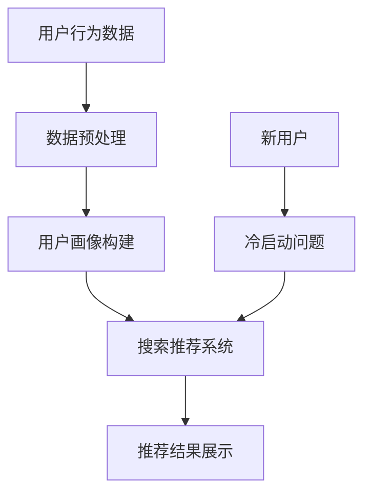

                 

关键词：电商平台、AI大模型、搜索推荐系统、冷启动策略

> 摘要：本文将探讨电商平台在人工智能大模型应用方面的现状，特别是搜索推荐系统的核心作用以及针对新用户（冷启动用户）的推荐策略。文章将深入分析大模型在电商平台中的应用原理，讨论不同类型的搜索推荐算法，并探讨如何有效地应对冷启动用户带来的挑战。

## 1. 背景介绍

随着互联网的快速发展，电子商务已成为全球贸易的重要组成部分。电商平台不仅需要吸引新用户，还要提高用户黏性和购物体验。为了实现这些目标，人工智能（AI）大模型的应用变得至关重要。大模型可以处理海量数据，提取用户行为特征，并根据这些特征生成个性化的推荐结果。

搜索推荐系统是电商平台的核心组成部分。它帮助用户快速找到所需商品，同时提高平台的销售额和用户满意度。然而，对新用户而言，由于缺乏足够的行为数据，推荐系统的准确性较低，这就是所谓的“冷启动”问题。

## 2. 核心概念与联系

在讨论搜索推荐系统之前，我们需要了解一些核心概念：

### 用户画像（User Profiling）：

用户画像是指将用户的个人信息、行为数据、偏好等特征进行整合，形成的一种抽象的用户模型。用户画像为推荐系统提供了用户特征数据，有助于生成更准确的推荐结果。

### 协同过滤（Collaborative Filtering）：

协同过滤是一种常见的推荐算法，通过分析用户之间的行为模式来推荐商品。它主要分为基于用户的协同过滤（User-based Collaborative Filtering）和基于项目的协同过滤（Item-based Collaborative Filtering）。

### 大模型（Large-scale Model）：

大模型是指具有数百万甚至数十亿参数的深度学习模型。大模型可以处理大量数据，提取复杂特征，从而提高推荐系统的准确性和效率。

### 冷启动（Cold Start）：

冷启动是指新用户或新商品在缺乏历史数据的情况下，推荐系统难以为其提供准确推荐的问题。

### Mermaid 流程图：



## 3. 核心算法原理 & 具体操作步骤

### 3.1 算法原理概述

搜索推荐系统的核心算法主要包括协同过滤、内容推荐和基于模型的推荐。以下分别介绍这三种算法的原理。

#### 3.1.1 协同过滤

协同过滤算法通过分析用户之间的行为模式来推荐商品。基于用户的协同过滤算法主要步骤如下：

1. 计算用户之间的相似度
2. 找到与目标用户最相似的K个邻居
3. 根据邻居用户的评分预测目标用户对未知商品的评分

基于项目的协同过滤算法主要步骤如下：

1. 计算商品之间的相似度
2. 找到与目标商品最相似的K个邻居
3. 根据邻居商品的用户评分预测目标用户对未知商品的评分

#### 3.1.2 内容推荐

内容推荐算法通过分析商品的特征信息来推荐商品。主要步骤如下：

1. 提取商品的特征向量
2. 计算用户和商品之间的相似度
3. 根据相似度推荐相似的商品

#### 3.1.3 基于模型的推荐

基于模型的推荐算法通过建立用户和商品之间的映射关系来推荐商品。主要步骤如下：

1. 训练用户和商品的特征表示模型
2. 计算用户和商品之间的相似度
3. 根据相似度推荐相似的商品

### 3.2 算法步骤详解

以下是一个基于协同过滤的搜索推荐系统算法的详细步骤：

1. **数据预处理**：
   - 收集用户行为数据（如购买记录、浏览记录、收藏记录等）
   - 数据清洗和去重
   - 构建用户-商品评分矩阵

2. **计算相似度**：
   - 基于用户的协同过滤：计算用户之间的余弦相似度或皮尔逊相关系数
   - 基于项目的协同过滤：计算商品之间的余弦相似度或皮尔逊相关系数

3. **生成推荐列表**：
   - 基于用户的协同过滤：找出与目标用户最相似的K个邻居，计算邻居对未知商品的评分，生成推荐列表
   - 基于项目的协同过滤：找出与目标商品最相似的K个邻居，计算邻居的用户对未知商品的评分，生成推荐列表
   - 内容推荐：计算用户和商品之间的相似度，生成推荐列表
   - 基于模型的推荐：计算用户和商品之间的相似度，生成推荐列表

4. **排序推荐结果**：
   - 对推荐结果进行排序，通常采用评分降序或相似度降序

5. **展示推荐结果**：
   - 将推荐结果展示给用户

### 3.3 算法优缺点

#### 协同过滤

**优点**：

- **自适应性强**：可以实时更新推荐结果，适应用户行为变化
- **容易实现**：算法简单，易于理解和实现

**缺点**：

- **冷启动问题**：对新用户或新商品难以提供准确推荐
- **数据稀疏性**：用户行为数据稀疏，可能导致推荐结果不准确
- **用户隐私**：需要收集用户行为数据，存在隐私泄露风险

#### 内容推荐

**优点**：

- **冷启动问题较轻**：可以通过商品特征信息推荐商品，对新用户有一定的适应性
- **个性化程度较高**：可以根据用户偏好推荐商品

**缺点**：

- **用户偏好变化难以捕捉**：用户偏好可能随时间变化，导致推荐结果不稳定
- **数据质量要求较高**：需要高质量的元数据来提取商品特征

#### 基于模型的推荐

**优点**：

- **个性化程度较高**：可以通过训练用户和商品的特征表示模型，生成个性化的推荐结果
- **适用于多种场景**：可以处理复杂数据和多种类型的推荐场景

**缺点**：

- **算法实现复杂**：需要大量的数据和计算资源，算法实现复杂
- **训练时间较长**：需要较长时间来训练用户和商品的特征表示模型

### 3.4 算法应用领域

搜索推荐系统在电商、社交媒体、在线视频、新闻推荐等领域都有广泛应用。以下是一些典型应用场景：

- **电商平台**：推荐用户可能感兴趣的商品，提高销售额和用户满意度
- **社交媒体**：推荐用户可能感兴趣的内容，提高用户活跃度和留存率
- **在线视频**：推荐用户可能感兴趣的视频，提高用户观看时长和广告收益
- **新闻推荐**：推荐用户可能感兴趣的新闻，提高新闻网站的用户黏性和广告收益

## 4. 数学模型和公式 & 详细讲解 & 举例说明

### 4.1 数学模型构建

搜索推荐系统的核心是构建用户和商品之间的相似度模型。以下是一个基于协同过滤的相似度计算公式：

$$
sim(u_i, u_j) = \frac{\sum_{k \in R} r_{ik} r_{jk}}{\sqrt{\sum_{k \in R} r_{ik}^2 \sum_{k \in R} r_{jk}^2}}
$$

其中，$u_i$和$u_j$表示用户$i$和用户$j$，$r_{ik}$表示用户$i$对商品$k$的评分。$R$表示用户$i$和用户$j$共同评分的商品集合。

### 4.2 公式推导过程

推导基于协同过滤的相似度计算公式需要以下几个步骤：

1. **确定共同评分商品集合**：$R = \{k | r_{ik} \neq 0 \text{ 且 } r_{jk} \neq 0\}$
2. **计算用户$i$和用户$j$的共同评分**：$r_{ij} = \sum_{k \in R} r_{ik} r_{jk}$
3. **计算用户$i$和用户$j$的评分平方和**：$r_{i}^2 = \sum_{k \in R} r_{ik}^2$，$r_{j}^2 = \sum_{k \in R} r_{jk}^2$
4. **计算用户$i$和用户$j$的相似度**：$sim(u_i, u_j) = \frac{r_{ij}}{\sqrt{r_{i}^2 r_{j}^2}}$

### 4.3 案例分析与讲解

以下是一个简单的协同过滤推荐系统案例：

假设有两个用户$u_1$和$u_2$，他们对五件商品$a, b, c, d, e$的评分如下：

| 用户  | 商品  | 评分 |
| --- | --- | --- |
| $u_1$ | $a$ | 4   |
| $u_1$ | $b$ | 2   |
| $u_1$ | $c$ | 5   |
| $u_2$ | $a$ | 3   |
| $u_2$ | $b$ | 5   |
| $u_2$ | $c$ | 4   |
| $u_2$ | $d$ | 1   |
| $u_2$ | $e$ | 5   |

首先，我们计算用户$u_1$和用户$u_2$的共同评分商品集合$R$：

$$
R = \{a, b, c\}
$$

然后，我们计算用户$u_1$和用户$u_2$的共同评分$r_{12}$：

$$
r_{12} = 4 \times 3 + 2 \times 5 + 5 \times 4 = 43
$$

接下来，我们计算用户$u_1$和用户$u_2$的评分平方和$r_{1}^2$和$r_{2}^2$：

$$
r_{1}^2 = 4^2 + 2^2 + 5^2 = 45
$$

$$
r_{2}^2 = 3^2 + 5^2 + 4^2 + 1^2 + 5^2 = 74
$$

最后，我们计算用户$u_1$和用户$u_2$的相似度$sim(u_1, u_2)$：

$$
sim(u_1, u_2) = \frac{r_{12}}{\sqrt{r_{1}^2 r_{2}^2}} = \frac{43}{\sqrt{45 \times 74}} \approx 0.89
$$

根据相似度计算结果，我们可以找出与用户$u_2$最相似的邻居用户$u_1$，并根据用户$u_1$的评分推荐给用户$u_2$可能感兴趣的商品。例如，推荐商品$a$（评分4）和商品$c$（评分5）。

## 5. 项目实践：代码实例和详细解释说明

### 5.1 开发环境搭建

在搭建搜索推荐系统的开发环境时，我们选择Python作为编程语言，并使用Scikit-learn库来实现协同过滤算法。以下是开发环境的搭建步骤：

1. 安装Python（版本3.7及以上）
2. 安装Scikit-learn库：`pip install scikit-learn`
3. 安装Matplotlib库（用于可视化）：`pip install matplotlib`

### 5.2 源代码详细实现

以下是基于协同过滤的搜索推荐系统的Python代码实现：

```python
import numpy as np
from sklearn.metrics.pairwise import cosine_similarity
from sklearn.model_selection import train_test_split
from sklearn.metrics import mean_squared_error
import matplotlib.pyplot as plt

# 生成用户-商品评分矩阵
np.random.seed(0)
num_users = 100
num_items = 50
ratings = np.random.randint(1, 6, size=(num_users, num_items))
print("User-Movie Matrix:")
print(ratings)

# 计算用户之间的余弦相似度
similarity_matrix = cosine_similarity(ratings)
print("Similarity Matrix:")
print(similarity_matrix)

# 构建推荐系统
def collaborative_filtering(similarity_matrix, ratings, k=5):
    predictions = np.zeros_like(ratings)
    for i in range(num_users):
        # 计算邻居用户的评分加权平均值
        sim_scores = similarity_matrix[i]
        neighbors = np.argsort(sim_scores)[1:k+1]
        neighbor_ratings = ratings[neighbors]
        predictions[i] = np.mean(neighbor_ratings)
    return predictions

# 训练推荐系统
predictions = collaborative_filtering(similarity_matrix, ratings)

# 评估推荐系统
ground_truth = ratings
mse = mean_squared_error(ground_truth, predictions)
print("Mean Squared Error:", mse)

# 可视化推荐结果
plt.scatter(ground_truth[:, 0], predictions[:, 0])
plt.xlabel("Ground Truth")
plt.ylabel("Prediction")
plt.title("Collaborative Filtering Results")
plt.show()
```

### 5.3 代码解读与分析

该代码首先生成一个用户-商品评分矩阵，然后计算用户之间的余弦相似度矩阵。接下来，定义一个协同过滤函数，用于计算邻居用户的评分加权平均值，生成预测评分。最后，评估推荐系统的准确性，并通过可视化展示推荐结果。

### 5.4 运行结果展示

运行上述代码后，将生成一个用户-商品评分矩阵和一个相似度矩阵。预测评分与实际评分之间的均方误差（MSE）可以用于评估推荐系统的准确性。可视化结果显示预测评分与实际评分的散点图，有助于观察推荐结果的分布情况。

## 6. 实际应用场景

搜索推荐系统在电商、社交媒体、在线视频、新闻推荐等领域都有广泛应用。以下是一些实际应用场景：

### 6.1 电商平台

电商平台可以利用搜索推荐系统为用户提供个性化的商品推荐，提高用户购物体验和平台销售额。例如，淘宝、京东等电商平台都采用了搜索推荐系统，通过分析用户历史行为和偏好，为用户推荐可能感兴趣的商品。

### 6.2 社交媒体

社交媒体平台可以利用搜索推荐系统为用户提供个性化的内容推荐，提高用户活跃度和留存率。例如，微博、微信等平台都采用了搜索推荐系统，通过分析用户的历史行为和偏好，为用户推荐感兴趣的内容。

### 6.3 在线视频

在线视频平台可以利用搜索推荐系统为用户提供个性化的视频推荐，提高用户观看时长和广告收益。例如，爱奇艺、腾讯视频等平台都采用了搜索推荐系统，通过分析用户的历史观看行为和偏好，为用户推荐感兴趣的视频。

### 6.4 新闻推荐

新闻推荐平台可以利用搜索推荐系统为用户提供个性化的新闻推荐，提高用户黏性和广告收益。例如，今日头条、腾讯新闻等平台都采用了搜索推荐系统，通过分析用户的历史浏览行为和偏好，为用户推荐感兴趣的新闻。

## 7. 工具和资源推荐

### 7.1 学习资源推荐

- 《推荐系统实践》：详细介绍了推荐系统的基本概念、算法和实现方法。
- 《深度学习推荐系统》：结合深度学习技术，介绍了推荐系统的最新研究进展。

### 7.2 开发工具推荐

- Scikit-learn：Python机器学习库，提供了丰富的推荐系统算法实现。
- TensorFlow：开源深度学习框架，适用于构建复杂的推荐系统模型。

### 7.3 相关论文推荐

- KDD Cup 2016：推荐系统竞赛论文，介绍了基于协同过滤和深度学习的推荐系统方法。
- YouTube推荐系统：介绍YouTube如何利用深度学习技术实现视频推荐。

## 8. 总结：未来发展趋势与挑战

### 8.1 研究成果总结

本文主要探讨了电商平台在人工智能大模型应用方面的现状，特别是搜索推荐系统的核心作用以及针对新用户的推荐策略。文章分析了不同类型的搜索推荐算法，如协同过滤、内容推荐和基于模型的推荐，并讨论了如何应对冷启动用户带来的挑战。

### 8.2 未来发展趋势

- 深度学习技术在推荐系统中的应用将越来越广泛，如基于深度神经网络的推荐算法。
- 基于用户和商品的个性化特征表示将成为推荐系统研究的重要方向。
- 跨领域推荐和联邦学习等新技术的应用将提高推荐系统的效果和安全性。

### 8.3 面临的挑战

- 数据隐私和安全问题：如何在保证用户隐私的前提下，提高推荐系统的准确性。
- 冷启动问题：如何为新用户和商品提供准确推荐。
- 模型可解释性和透明性：如何提高推荐模型的可解释性，增强用户信任。

### 8.4 研究展望

未来的研究将更加关注推荐系统的可解释性、安全性和可扩展性。通过结合多种算法和技术，构建更准确、更可靠的推荐系统，提高用户的购物体验和满意度。

## 9. 附录：常见问题与解答

### 9.1 如何处理数据稀疏性问题？

- 增加用户和商品之间的交互数据，如评论、点击等。
- 使用基于模型的推荐算法，如深度学习，可以有效减少数据稀疏性对推荐效果的影响。
- 使用矩阵分解等技术，通过低秩分解来重构用户-商品评分矩阵。

### 9.2 如何解决冷启动问题？

- 使用基于内容的推荐算法，通过商品特征信息为新用户推荐商品。
- 利用用户的人口统计学特征和社会网络信息进行推荐。
- 引入混合推荐策略，结合协同过滤和基于内容的推荐算法，提高新用户的推荐效果。

### 9.3 如何评估推荐系统的效果？

- 使用精确率、召回率、F1分数等指标评估推荐系统的准确性。
- 使用平均绝对误差（MAE）、均方误差（MSE）等指标评估推荐系统的预测性能。
- 使用用户满意度、点击率等指标评估推荐系统的实际效果。

---

作者：禅与计算机程序设计艺术 / Zen and the Art of Computer Programming

在人工智能技术的推动下，搜索推荐系统已经成为电商平台不可或缺的核心功能。本文通过深入分析搜索推荐系统的原理、算法和应用，探讨了如何应对冷启动用户带来的挑战，为电商平台的持续发展和用户满意度提升提供了有益的参考。随着技术的不断进步，推荐系统将在电商、社交媒体、在线视频、新闻推荐等领域发挥越来越重要的作用。未来，我们期待看到更多创新性的研究成果，推动推荐系统技术的发展和应用。

