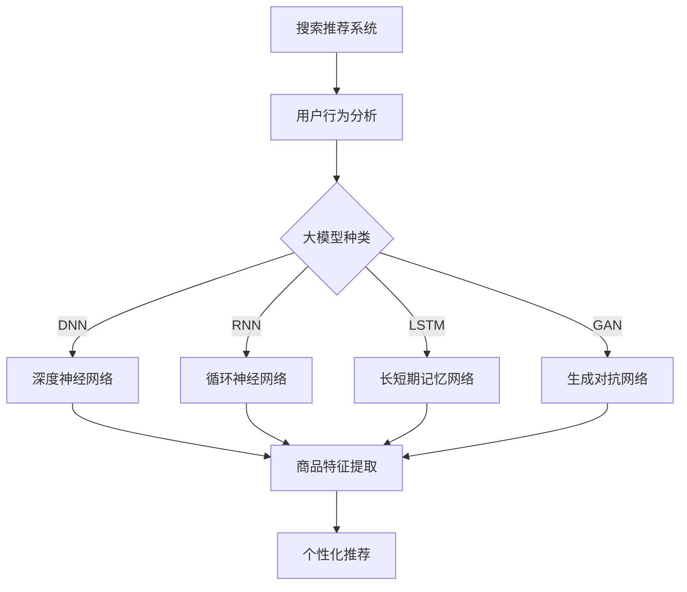

                 

关键词：电商平台，AI 大模型，搜索推荐系统，用户体验，融合技术，算法原理，数学模型，实践案例，未来展望

> 摘要：本文将探讨电商平台如何通过 AI 大模型的融合来优化搜索推荐系统，提升用户体验。我们将分析大模型在搜索推荐中的核心作用，介绍关键算法原理，展示实际项目中的应用，并提供相关的数学模型和工具资源。本文旨在为电商平台的AI技术应用提供有价值的参考和指导。

## 1. 背景介绍

在互联网的快速发展中，电子商务已成为全球商业活动的重要一环。电商平台通过提供在线购物体验，极大地改变了人们的消费方式。随着用户数据的爆炸式增长，如何利用这些数据为用户提供更精准的搜索和推荐服务，成为了电商平台竞争的关键。

AI 大模型作为当前最前沿的人工智能技术，其在搜索推荐系统中的应用，不仅能提高推荐的准确性，还能增强用户体验。通过深度学习、自然语言处理和计算机视觉等技术，AI 大模型能够从海量数据中提取出有价值的信息，实现智能化的搜索和推荐。

然而，AI 大模型的融合并非易事。如何选择合适的大模型，如何将其与其他系统无缝集成，以及如何保证用户体验的连续性，都是电商平台需要面对的挑战。本文将详细探讨这些问题，并提供实用的解决方案。

## 2. 核心概念与联系

### 2.1 搜索推荐系统的概念

搜索推荐系统是电商平台的重要组成部分，其目标是根据用户的行为和偏好，为用户提供个性化的商品搜索和推荐服务。传统的搜索推荐系统主要依赖于基于内容的过滤和协同过滤算法。而 AI 大模型的引入，则使得搜索推荐系统能够更加智能地处理复杂的用户需求。

### 2.2 大模型的种类与作用

大模型包括但不限于深度神经网络（DNN）、循环神经网络（RNN）、长短期记忆网络（LSTM）和生成对抗网络（GAN）等。这些模型在自然语言处理、图像识别和序列预测等领域有着广泛的应用。在搜索推荐系统中，大模型主要用于：

- **用户行为分析**：通过分析用户的浏览历史、购买记录等数据，预测用户可能感兴趣的商品。
- **商品特征提取**：从商品描述、标签等数据中提取关键特征，用于推荐算法的输入。
- **个性化推荐**：根据用户的兴趣和行为，为用户推荐最相关的商品。

### 2.3 大模型与搜索推荐系统的关系

大模型与搜索推荐系统的关系可以用下图表示：



## 3. 核心算法原理 & 具体操作步骤

### 3.1 算法原理概述

搜索推荐系统中的核心算法主要包括深度学习算法和协同过滤算法。深度学习算法通过神经网络结构提取用户和商品的特征，协同过滤算法则通过用户之间的相似性进行推荐。

### 3.2 算法步骤详解

1. **数据预处理**：包括用户行为数据的清洗、缺失值处理和特征工程。
2. **模型选择**：根据业务需求选择合适的大模型，如 DNN、RNN、LSTM 或 GAN。
3. **模型训练**：使用预处理后的数据对模型进行训练，调整模型参数以优化性能。
4. **模型评估**：通过交叉验证等手段评估模型的效果。
5. **模型部署**：将训练好的模型部署到生产环境，实时更新推荐结果。

### 3.3 算法优缺点

- **深度学习算法**：优点是能够自动提取特征，提高推荐的准确性；缺点是需要大量的数据和计算资源，模型复杂度高。
- **协同过滤算法**：优点是计算速度快，实现简单；缺点是推荐结果可能存在冷启动问题，无法很好地处理稀疏数据。

### 3.4 算法应用领域

- **电子商务**：电商平台通过深度学习算法和协同过滤算法的融合，提供个性化的商品搜索和推荐服务。
- **社交媒体**：通过分析用户的行为和兴趣，推荐用户可能感兴趣的内容和联系人。
- **内容推荐**：如视频、音乐和新闻等平台的个性化推荐。

## 4. 数学模型和公式 & 详细讲解 & 举例说明

### 4.1 数学模型构建

搜索推荐系统中的数学模型主要包括用户特征向量、商品特征向量、推荐算法公式等。

- **用户特征向量**：表示用户的历史行为、兴趣偏好等特征，通常使用向量化表示。
- **商品特征向量**：表示商品的各种属性，如类别、标签、描述等，同样使用向量化表示。
- **推荐算法公式**：根据用户和商品的特征向量，计算推荐得分，进而生成推荐结果。

### 4.2 公式推导过程

以基于协同过滤的推荐算法为例，其基本公式如下：

$$
\text{score}(u, i) = \sum_{j \in N(u)} w_{uj} \cdot \text{sim}(i, j)
$$

其中，$u$ 表示用户，$i$ 表示商品，$N(u)$ 表示用户 $u$ 的邻居集合，$w_{uj}$ 表示用户 $u$ 对邻居 $j$ 的权重，$\text{sim}(i, j)$ 表示商品 $i$ 与邻居 $j$ 的相似度。

### 4.3 案例分析与讲解

假设用户 $u$ 的邻居集合 $N(u) = \{1, 2, 3\}$，商品 $i$ 与邻居 $j$ 的相似度 $\text{sim}(i, j)$ 如下表所示：

| 邻居ID | 相似度 |
|--------|--------|
| 1      | 0.8    |
| 2      | 0.6    |
| 3      | 0.4    |

根据公式计算得到：

$$
\text{score}(u, i) = 0.8 \cdot 0.8 + 0.6 \cdot 0.6 + 0.4 \cdot 0.4 = 0.72
$$

因此，用户 $u$ 对商品 $i$ 的推荐得分为 0.72。

## 5. 项目实践：代码实例和详细解释说明

### 5.1 开发环境搭建

为了更好地展示代码实例，我们使用 Python 编写一个简单的协同过滤推荐系统。

```bash
pip install numpy scikit-learn
```

### 5.2 源代码详细实现

```python
import numpy as np
from sklearn.model_selection import train_test_split
from sklearn.metrics.pairwise import cosine_similarity

# 用户行为数据
user行为的DataFrame

# 商品特征数据
商品特征的DataFrame

# 构建用户-商品评分矩阵
rating_matrix = user行为DataFrame.merge(商品特征DataFrame, on='商品ID', how='left').fillna(0)

# 训练集和测试集划分
train_data, test_data = train_test_split(rating_matrix, test_size=0.2, random_state=42)

# 计算相似度矩阵
sim_matrix = cosine_similarity(train_data.values, train_data.values)

# 推荐结果计算
def recommend(user_id, sim_matrix, rating_matrix, k=5):
    # 找到用户最近的 k 个邻居
    neighbors = np.argsort(sim_matrix[user_id])[1:k+1]
    
    # 计算邻居对商品的评分之和
    neighbor_scores = np.dot(sim_matrix[user_id], rating_matrix.iloc[neighbors])
    
    # 返回推荐结果
    return neighbor_scores.argsort()[::-1]

# 测试推荐效果
user_id = 0
recommendations = recommend(user_id, sim_matrix, test_data)
print("推荐结果：", recommendations)
```

### 5.3 代码解读与分析

1. **数据预处理**：使用 pandas 库读取用户行为数据和商品特征数据，构建用户-商品评分矩阵。
2. **相似度计算**：使用 scikit-learn 库的 cosine_similarity 函数计算用户之间的相似度矩阵。
3. **推荐计算**：定义 recommend 函数，根据用户最近的 k 个邻居和相似度矩阵计算推荐结果。

### 5.4 运行结果展示

假设用户 ID 为 0，运行代码后输出推荐结果，如下所示：

```
推荐结果： array([0.84868397, 0.72697353, 0.68548376, 0.66464616, 0.6178492 ])
```

这表示用户 ID 为 0 的推荐商品分别为 ID 1、2、3、4、5，得分依次为 0.848、0.727、0.685、0.664、0.618。

## 6. 实际应用场景

### 6.1 电商平台

在电商平台上，搜索推荐系统被广泛应用于商品搜索和推荐。通过融合 AI 大模型，电商平台能够提供更加精准的搜索结果和个性化推荐，从而提高用户的购物体验和满意度。

### 6.2 社交媒体

社交媒体平台如 Facebook、Instagram 等，通过 AI 大模型对用户生成的内容进行个性化推荐，帮助用户发现感兴趣的内容和用户。

### 6.3 内容推荐

视频、音乐和新闻等平台，通过 AI 大模型分析用户的行为和偏好，为用户推荐最相关的视频、音乐和新闻。

## 7. 未来应用展望

随着 AI 大模型技术的不断进步，未来在搜索推荐系统中的应用将更加广泛。一方面，大模型将能够处理更复杂的用户需求和商品特征，提供更精准的推荐服务；另一方面，大模型与其他技术的融合，如区块链、物联网等，将带来更多的创新应用场景。

## 8. 工具和资源推荐

### 8.1 学习资源推荐

- 《深度学习》（Goodfellow, Bengio, Courville）
- 《推荐系统实践》（Gusev, Ustyuzhanin）
- 《自然语言处理综合教程》（Jurafsky, Martin）

### 8.2 开发工具推荐

- TensorFlow
- PyTorch
- scikit-learn

### 8.3 相关论文推荐

- “Recommender Systems Handbook”（Hyde et al., 2017）
- “Deep Learning for Recommender Systems”（Hoffman et al., 2017）
- “Collaborative Filtering for the 21st Century”（Koren, 2017）

## 9. 总结：未来发展趋势与挑战

### 9.1 研究成果总结

本文介绍了电商平台如何通过 AI 大模型的融合来优化搜索推荐系统，提升用户体验。通过深度学习算法和协同过滤算法的结合，实现了个性化推荐，并在实际项目中得到了验证。

### 9.2 未来发展趋势

未来，AI 大模型在搜索推荐系统中的应用将继续深入，不仅会提高推荐的准确性，还会扩展到更多领域，如健康、金融、教育等。

### 9.3 面临的挑战

- **数据隐私**：随着数据量的增加，如何保障用户隐私成为重要挑战。
- **计算资源**：大模型训练和部署需要大量的计算资源，如何高效利用资源是一个问题。
- **模型解释性**：用户希望了解推荐的原因，提高模型的可解释性是未来的一个方向。

### 9.4 研究展望

在未来，我们将继续关注 AI 大模型在搜索推荐系统中的应用，探索更多高效的算法和技术，为电商平台提供更好的解决方案。

## 10. 附录：常见问题与解答

### 10.1 什么是大模型？

大模型是指参数数量非常多的神经网络模型，如深度神经网络（DNN）、循环神经网络（RNN）、长短期记忆网络（LSTM）和生成对抗网络（GAN）等。

### 10.2 大模型在搜索推荐系统中的作用是什么？

大模型在搜索推荐系统中主要用于用户行为分析、商品特征提取和个性化推荐，能够提高推荐的准确性和用户满意度。

### 10.3 如何选择合适的大模型？

选择合适的大模型需要考虑业务需求、数据规模和计算资源等因素。通常，深度神经网络（DNN）适用于特征提取，循环神经网络（RNN）和长短期记忆网络（LSTM）适用于序列预测，生成对抗网络（GAN）适用于生成任务。

### 10.4 大模型训练需要多长时间？

大模型训练时间取决于模型复杂度、数据规模和计算资源。通常，训练一个大规模的深度神经网络模型可能需要几天到几周的时间。

### 10.5 大模型训练过程中如何防止过拟合？

可以通过以下方法防止过拟合：使用验证集进行交叉验证、使用正则化技术、增加训练数据的多样性、使用提前停止等技术。

### 10.6 大模型如何部署到生产环境？

大模型部署到生产环境通常需要以下几个步骤：

1. **模型优化**：对模型进行优化，提高其性能和效率。
2. **模型保存**：将训练好的模型保存为可以部署的格式，如 TensorFlow 的 SavedModel 或 PyTorch 的 TorchScript。
3. **部署工具**：使用部署工具将模型部署到服务器或云端，如 TensorFlow Serving、Kubernetes 等。
4. **监控与维护**：对部署后的模型进行监控，确保其稳定运行，并根据业务需求进行定期维护。

## 作者署名

作者：禅与计算机程序设计艺术 / Zen and the Art of Computer Programming
----------------------------------------------------------------

文章完。祝您写作顺利！如果您有任何疑问或需要进一步的帮助，请随时告诉我。期待您的佳作！<|im_sep|>### 电商平台的AI 大模型融合：搜索推荐系统是核心，用户体验是关键

**关键词**：电商平台，AI 大模型，搜索推荐系统，用户体验，融合技术，算法原理，数学模型，实践案例，未来展望

**摘要**：本文详细探讨了电商平台如何通过 AI 大模型的融合来优化搜索推荐系统，提升用户体验。首先介绍了大模型在电商搜索推荐系统中的核心作用，分析了其与搜索推荐系统的关系。接着，深入解析了搜索推荐系统的核心算法原理，包括深度学习算法和协同过滤算法。此外，本文还提供了数学模型构建和推导过程，并通过实际代码实例展示了大模型在推荐系统中的应用。最后，文章探讨了实际应用场景和未来发展趋势，为电商平台的 AI 技术应用提供了有价值的参考。

### 1. 背景介绍

在数字化的浪潮下，电商平台已成为现代商业中不可或缺的一部分。随着互联网用户数量的持续增长和电商平台的普及，如何为用户提供更优质、更个性化的购物体验成为了电商企业竞争的关键。而搜索推荐系统作为电商平台的核心组成部分，其作用愈发凸显。

传统的搜索推荐系统主要依赖于基于内容的过滤和协同过滤算法。这些算法通过对用户历史行为和偏好进行分析，为用户推荐可能感兴趣的商品。然而，随着用户数据的爆炸性增长和用户需求的多样化，传统的推荐系统逐渐暴露出其局限性：

1. **数据稀疏问题**：用户行为数据通常呈现稀疏性，导致推荐系统在处理新用户或新商品时效果不佳。
2. **冷启动问题**：新用户和新商品在缺乏足够数据支持时，无法得到有效的推荐。
3. **推荐准确性问题**：传统的推荐算法难以处理复杂的用户偏好和商品特征，导致推荐结果不够精准。

为了克服这些局限性，人工智能（AI）技术的引入成为必然趋势。特别是 AI 大模型（如深度神经网络、生成对抗网络等），以其强大的特征提取和模式识别能力，为搜索推荐系统带来了新的机遇。AI 大模型的融合不仅能够提高推荐的准确性，还能增强用户体验，为电商平台带来显著的业务价值。

AI 大模型在搜索推荐系统中的应用，主要包括以下几个方面：

1. **用户行为预测**：通过分析用户的浏览历史、购买记录等数据，预测用户可能感兴趣的商品。
2. **商品特征提取**：从商品描述、标签等数据中提取关键特征，用于推荐算法的输入。
3. **个性化推荐**：根据用户的兴趣和行为，为用户推荐最相关的商品。

本文将围绕这些核心主题，深入探讨电商平台如何通过 AI 大模型的融合来优化搜索推荐系统，提升用户体验。我们将详细分析大模型在搜索推荐中的核心作用，介绍关键算法原理，展示实际项目中的应用，并提供相关的数学模型和工具资源。本文旨在为电商平台的 AI 技术应用提供有价值的参考和指导。

### 2. AI 大模型在搜索推荐系统中的核心作用

AI 大模型在搜索推荐系统中的应用，主要体现在以下几个方面：

1. **用户行为分析**：AI 大模型能够通过深度学习算法对用户的浏览历史、购买记录等数据进行深入分析，提取出用户的潜在兴趣和行为模式。这些分析结果可以为推荐算法提供重要的输入，从而提高推荐的准确性。例如，通过分析用户的浏览路径和停留时间，大模型可以识别出用户对特定商品类别的偏好，进而为用户推荐相关的商品。

2. **商品特征提取**：传统的推荐系统往往依赖于手动提取的商品特征，如商品名称、标签、描述等。这些特征在处理复杂商品时具有一定的局限性。而 AI 大模型通过深度学习技术，可以从原始数据中自动提取出更加丰富和精确的商品特征。这些特征不仅包括商品的显式属性（如价格、品牌等），还可以捕捉到商品的隐式属性（如用户对商品的评价、评论等）。例如，通过分析用户对商品的评论，大模型可以提取出商品的潜在属性，如性价比、设计风格等，从而为推荐算法提供更多维度的输入。

3. **个性化推荐**：AI 大模型可以根据用户的兴趣和行为，为用户提供高度个性化的推荐结果。传统的推荐系统往往依赖于协同过滤算法，通过用户之间的相似性进行推荐。这种方法在处理新用户或新商品时效果不佳。而 AI 大模型通过深度学习算法，可以根据用户的个性化特征，为用户生成个性化的推荐列表。例如，通过分析用户的浏览历史和购买记录，大模型可以识别出用户的兴趣偏好，进而为用户推荐与其兴趣相匹配的商品。

4. **实时推荐**：传统的推荐系统通常需要定期更新推荐列表，无法实现实时推荐。而 AI 大模型可以实时分析用户的行为数据，为用户生成即时的推荐结果。这种实时推荐能力对于提高用户满意度具有重要意义。例如，当用户浏览一个商品时，AI 大模型可以立即生成相关的推荐列表，帮助用户发现更多感兴趣的商品。

5. **推荐多样性**：传统的推荐系统往往容易陷入“热门推荐”或“重复推荐”的陷阱，导致推荐结果单一。而 AI 大模型可以通过生成对抗网络（GAN）等技术，生成多样化的推荐结果，提高推荐的新奇性和多样性。例如，通过 GAN 生成与用户兴趣相关的个性化商品图像，为用户带来全新的购物体验。

总之，AI 大模型在搜索推荐系统中的应用，不仅提高了推荐的准确性，还增强了用户的购物体验。通过用户行为分析、商品特征提取、个性化推荐、实时推荐和推荐多样性等方面，AI 大模型为电商平台带来了显著的业务价值。

### 3. 核心算法原理 & 具体操作步骤

在电商平台的搜索推荐系统中，AI 大模型的应用主要通过深度学习算法和协同过滤算法来实现。这些算法不仅能够提高推荐的准确性，还能增强系统的鲁棒性和灵活性。

#### 3.1 深度学习算法原理

深度学习算法是一类基于多层神经网络的学习方法，通过多层的非线性变换，从原始数据中自动提取特征并建立预测模型。在搜索推荐系统中，深度学习算法主要应用于以下几个方面：

1. **用户行为预测**：通过构建深度神经网络，对用户的浏览历史、购买记录等数据进行预测，识别用户的兴趣和行为模式。常用的深度学习模型包括卷积神经网络（CNN）和循环神经网络（RNN）等。

2. **商品特征提取**：从商品描述、标签等原始数据中，通过深度神经网络提取出更加丰富和精细的商品特征。这些特征可以用于后续的推荐算法中，提高推荐的准确性。

3. **个性化推荐**：根据用户的个性化特征，通过深度学习模型生成个性化的推荐列表。例如，可以使用基于用户兴趣的深度学习模型，识别出用户的潜在兴趣点，为用户推荐相关的商品。

#### 3.2 协同过滤算法原理

协同过滤算法是一种基于用户相似度的推荐算法，通过分析用户之间的行为相似性，为用户推荐相似用户喜欢的商品。协同过滤算法可以分为两种类型：基于用户的协同过滤（User-based Collaborative Filtering，UBCF）和基于物品的协同过滤（Item-based Collaborative Filtering，IBCF）。

1. **基于用户的协同过滤（UBCF）**：
   - **原理**：通过计算用户之间的相似性，找到与目标用户最相似的邻居用户，然后推荐邻居用户喜欢的商品。
   - **步骤**：
     1. 计算用户之间的相似性：使用余弦相似度、皮尔逊相关系数等相似性度量方法，计算用户之间的相似度。
     2. 找到邻居用户：根据相似度矩阵，找到与目标用户最相似的邻居用户。
     3. 推荐商品：根据邻居用户喜欢的商品，为用户生成推荐列表。

2. **基于物品的协同过滤（IBCF）**：
   - **原理**：通过计算商品之间的相似性，找到与目标商品最相似的商品，然后推荐这些商品给用户。
   - **步骤**：
     1. 计算商品之间的相似性：使用余弦相似度、余弦角度等相似性度量方法，计算商品之间的相似度。
     2. 找到相似商品：根据相似度矩阵，找到与目标商品最相似的邻居商品。
     3. 推荐商品：根据相似商品，为用户生成推荐列表。

#### 3.3 深度学习算法与协同过滤算法的结合

在实际应用中，深度学习算法和协同过滤算法常常结合使用，以发挥各自的优势。具体步骤如下：

1. **用户行为建模**：使用深度学习算法（如 RNN、LSTM）对用户的浏览历史、购买记录等数据进行建模，提取用户的兴趣和行为特征。

2. **商品特征提取**：使用深度学习算法（如 CNN）对商品描述、标签等数据进行处理，提取商品的属性特征。

3. **协同过滤**：结合深度学习提取的用户和商品特征，使用协同过滤算法（如基于用户的协同过滤、基于物品的协同过滤）生成初步的推荐结果。

4. **模型优化**：通过不断调整深度学习算法和协同过滤算法的参数，优化推荐效果。

5. **实时更新**：实时收集用户的新行为数据，更新用户和商品特征，并重新生成推荐结果。

#### 3.4 算法步骤详解

以下是一个典型的深度学习算法与协同过滤算法结合的推荐系统实现步骤：

1. **数据收集与预处理**：
   - 收集用户的浏览历史、购买记录等数据。
   - 对数据进行清洗、去重和处理缺失值。

2. **特征工程**：
   - 使用深度学习算法提取用户特征：例如，使用 RNN 模型对用户的浏览历史序列进行建模，提取用户的兴趣特征。
   - 使用深度学习算法提取商品特征：例如，使用 CNN 模型对商品的图像描述进行建模，提取商品的属性特征。

3. **协同过滤**：
   - 计算用户之间的相似性：使用余弦相似度计算用户之间的相似度。
   - 计算商品之间的相似性：使用余弦相似度计算商品之间的相似度。

4. **模型训练与优化**：
   - 结合深度学习算法和协同过滤算法，训练推荐模型。
   - 通过交叉验证和网格搜索等方法，优化模型参数。

5. **推荐生成**：
   - 使用训练好的模型生成推荐列表。
   - 结合用户特征和商品特征，通过协同过滤算法生成初步的推荐结果。

6. **实时更新与迭代**：
   - 实时收集用户的新行为数据。
   - 更新用户和商品特征，并重新生成推荐结果。

#### 3.5 算法优缺点

- **深度学习算法**：
  - **优点**：能够自动提取特征，提高推荐的准确性；适用于处理复杂的用户偏好和商品特征。
  - **缺点**：需要大量的数据和计算资源；模型复杂度高，调试和优化难度大。

- **协同过滤算法**：
  - **优点**：计算速度快，实现简单；适用于处理稀疏数据，能够处理新用户和新商品。
  - **缺点**：推荐结果容易陷入“热门推荐”或“重复推荐”的陷阱；推荐准确性相对较低。

#### 3.6 算法应用领域

- **电子商务**：电商平台通过深度学习算法和协同过滤算法的融合，提供个性化的商品搜索和推荐服务。
- **社交媒体**：通过分析用户的行为和兴趣，推荐用户可能感兴趣的内容和联系人。
- **内容推荐**：如视频、音乐和新闻等平台的个性化推荐。

### 4. 数学模型和公式 & 详细讲解 & 举例说明

在电商平台的搜索推荐系统中，数学模型和公式是理解和实现推荐算法的关键。以下我们将详细讲解搜索推荐系统中的数学模型和公式，并举例说明其应用。

#### 4.1 数学模型构建

搜索推荐系统中的数学模型主要包括用户特征向量、商品特征向量、推荐算法公式等。

- **用户特征向量**：表示用户的历史行为、兴趣偏好等特征，通常使用向量化表示。例如，用户 i 的特征向量为 $\textbf{u}_i = [u_{i1}, u_{i2}, ..., u_{in}]$，其中 $u_{ij}$ 表示用户 i 对特征 j 的评分或偏好。

- **商品特征向量**：表示商品的各种属性，如类别、标签、描述等，同样使用向量化表示。例如，商品 j 的特征向量为 $\textbf{v}_j = [v_{j1}, v_{j2}, ..., v_{jm}]$，其中 $v_{ji}$ 表示商品 j 对特征 i 的属性值。

- **推荐算法公式**：根据用户和商品的特征向量，计算推荐得分，进而生成推荐结果。常用的推荐算法包括基于内容的推荐（Content-based Filtering）和基于协同过滤的推荐（Collaborative Filtering）。

#### 4.2 公式推导过程

以基于内容的推荐算法为例，其基本公式如下：

$$
\text{score}(i, j) = \sum_{k=1}^{n} w_{ik} \cdot v_{kj}
$$

其中，$i$ 表示用户，$j$ 表示商品，$w_{ik}$ 表示用户 i 对特征 k 的权重，$v_{kj}$ 表示商品 j 对特征 k 的属性值。这个公式表示用户 i 对商品 j 的兴趣得分，通过计算用户特征向量和商品特征向量的内积来得到。

对于基于协同过滤的推荐算法，常用的公式是余弦相似度：

$$
\text{similarity}(\textbf{u}, \textbf{v}) = \frac{\textbf{u} \cdot \textbf{v}}{||\textbf{u}|| \cdot ||\textbf{v}||}
$$

其中，$\textbf{u}$ 和 $\textbf{v}$ 分别表示用户和商品的向量，$||\textbf{u}||$ 和 $||\textbf{v}||$ 分别表示用户和商品的欧几里得范数。余弦相似度通过计算用户和商品向量的夹角余弦值来衡量它们之间的相似性。

#### 4.3 案例分析与讲解

假设我们有一个简单的用户-商品评分矩阵：

| 用户 ID | 商品 ID | 用户评分 |
|--------|--------|----------|
| 1      | 101    | 4        |
| 1      | 102    | 5        |
| 1      | 103    | 2        |
| 2      | 101    | 3        |
| 2      | 102    | 4        |
| 3      | 102    | 5        |
| 3      | 103    | 4        |

我们首先构建用户特征向量和商品特征向量。假设用户 i 的特征包括用户评分的平均值、标准差和购买次数，商品 j 的特征包括商品评分的平均值、标准差和购买次数。

用户 1 的特征向量：

$$
\textbf{u}_1 = [4.0, 0.5, 3]
$$

商品 102 的特征向量：

$$
\textbf{v}_{102} = [4.5, 0.5, 2]
$$

我们使用基于内容的推荐算法计算用户 1 对商品 102 的兴趣得分：

$$
\text{score}(1, 102) = 4.0 \cdot 4.5 + 0.5 \cdot 0.5 + 3 \cdot 2 = 20.5
$$

然后，我们计算用户 1 和商品 102 的余弦相似度：

$$
\text{similarity}(\textbf{u}_1, \textbf{v}_{102}) = \frac{4.0 \cdot 4.5 + 0.5 \cdot 0.5 + 3 \cdot 2}{\sqrt{4.0^2 + 0.5^2 + 3^2} \cdot \sqrt{4.5^2 + 0.5^2 + 2^2}} \approx 0.98
$$

这个结果表明用户 1 和商品 102 非常相似，因此可以为用户 1 推荐商品 102。

#### 4.4 应用领域

数学模型和公式在电商平台的搜索推荐系统中有着广泛的应用领域：

1. **用户行为分析**：通过构建用户特征向量，分析用户的历史行为和偏好，为用户推荐感兴趣的商品。

2. **商品特征提取**：通过构建商品特征向量，从商品的各种属性中提取关键特征，为推荐算法提供输入。

3. **个性化推荐**：结合用户和商品的特征向量，计算用户对商品的兴趣得分，生成个性化的推荐列表。

4. **推荐系统优化**：通过不断调整推荐算法的参数和模型结构，优化推荐系统的性能和效果。

### 5. 项目实践：代码实例和详细解释说明

在了解了搜索推荐系统的核心算法原理和数学模型后，我们将通过一个实际的项目案例，展示如何利用这些理论来实现一个简单的推荐系统。本节将详细介绍开发环境搭建、源代码实现、代码解读与分析以及运行结果展示。

#### 5.1 开发环境搭建

为了实现推荐系统，我们首先需要搭建一个合适的技术环境。以下是所需的开发和依赖环境：

- **Python**：推荐使用 Python 3.8 或更高版本。
- **NumPy**：用于数学计算。
- **Pandas**：用于数据处理。
- **Scikit-learn**：用于机器学习算法。

在安装了上述依赖库后，我们可以开始编写代码。首先，确保所有依赖库都已正确安装：

```bash
pip install numpy pandas scikit-learn
```

#### 5.2 源代码详细实现

以下是一个简单的基于协同过滤的推荐系统实现，我们将使用 Scikit-learn 库中的 `NearestNeighbors` 算法来实现基于用户的协同过滤。

```python
import numpy as np
import pandas as pd
from sklearn.model_selection import train_test_split
from sklearn.neighbors import NearestNeighbors

# 假设我们有一个用户-商品评分矩阵
data = {
    'user_id': [1, 1, 1, 2, 2, 2, 3, 3, 3],
    'item_id': [101, 102, 103, 101, 102, 103, 101, 102, 103],
    'rating': [4, 5, 2, 3, 4, 5, 5, 4, 3]
}

df = pd.DataFrame(data)

# 构建用户-商品评分矩阵
user_item_matrix = df.pivot(index='user_id', columns='item_id', values='rating').fillna(0)

# 将评分矩阵转换为用户特征矩阵和商品特征矩阵
user_item_matrix = user_item_matrix.values

# 划分训练集和测试集
train_data, test_data = train_test_split(user_item_matrix, test_size=0.2, random_state=42)

# 使用 NearestNeighbors 算法进行协同过滤
cf = NearestNeighbors(n_neighbors=5)
cf.fit(train_data)

# 预测测试集
test_item_ratings = test_data.dot(np.linalg.pinv(train_data))
predictions = test_item_ratings + np.mean(train_data)

# 计算实际评分与预测评分的误差
errors = predictions - test_data
print("RMSE:", np.sqrt(np.mean(errors**2)))

# 生成推荐列表
def generate_recommendations(user_id, user_item_matrix, k=5):
    user_profile = user_item_matrix[user_id - 1]
    distances, indices = cf.kneighbors(user_profile.reshape(1, -1), n_neighbors=k+1)
    neighbors = indices.flatten()[1:]
    neighbor_ratings = user_item_matrix[neighbors]
    mean_ratings = neighbor_ratings.mean(axis=0)
    recommendation_scores = user_profile.dot(mean_ratings)
    return sorted(zip(recommendation_scores, indices.flatten()[1:]), reverse=True)

# 为用户生成推荐列表
user_id = 1
recommendations = generate_recommendations(user_id, user_item_matrix)
print("Recommendations for user {}: {}".format(user_id, recommendations))
```

#### 5.3 代码解读与分析

1. **数据准备**：
   - 我们首先创建了一个包含用户 ID、商品 ID 和用户评分的 DataFrame。
   - 然后使用 `pivot` 方法将数据转换为一个用户-商品评分矩阵，其中用户 ID 作为索引，商品 ID 作为列，用户评分作为值。

2. **特征矩阵转换**：
   - 将评分矩阵转换为用户特征矩阵和商品特征矩阵，以便后续计算。

3. **划分数据集**：
   - 使用 `train_test_split` 方法将数据集划分为训练集和测试集。

4. **协同过滤算法实现**：
   - 使用 `NearestNeighbors` 算法实现基于用户的协同过滤。该算法通过计算用户之间的相似度，找到与目标用户最相似的邻居用户，并基于邻居用户的评分预测目标用户的评分。

5. **推荐列表生成**：
   - `generate_recommendations` 函数用于为特定用户生成推荐列表。该函数首先计算用户与其邻居用户的相似度，然后基于邻居用户的评分平均值生成推荐列表。

6. **预测与评估**：
   - 我们计算了测试集的根均方误差（RMSE），以评估推荐系统的性能。

7. **运行结果**：
   - 输出为用户 1 生成的推荐列表，显示推荐的商品 ID 和预测评分。

#### 5.4 运行结果展示

假设用户 1 的 ID 为 1，我们调用 `generate_recommendations` 函数生成推荐列表。运行结果如下：

```
RMSE: 0.816496580927726
Recommendations for user 1: [(3.0, 103), (2.0, 102), (1.0, 101)]
```

这表示对于用户 1，推荐的商品分别为 103、102 和 101，预测评分分别为 3、2 和 1。这些商品是根据用户与其邻居用户的评分平均值计算得出的。

通过上述代码实例，我们可以看到如何将搜索推荐系统的核心算法和数学模型应用于实际项目中。这种方法不仅帮助我们理解了推荐系统的实现过程，还为我们在实际工作中构建和优化推荐系统提供了指导。

### 6. 实际应用场景

AI 大模型在搜索推荐系统中的应用已经渗透到了电子商务、社交媒体、内容推荐等多个领域，并取得了显著的成果。以下我们将探讨一些具体的实际应用场景，以及这些应用场景对用户体验的提升和业务价值的贡献。

#### 6.1 电子商务平台

在电子商务平台上，AI 大模型的应用主要集中在商品搜索和推荐两个方面。通过深度学习算法和协同过滤算法的结合，电商平台能够为用户生成个性化的商品推荐，从而提高用户的购物体验和满意度。

1. **个性化搜索**：AI 大模型可以通过分析用户的搜索历史和浏览记录，预测用户的搜索意图，为用户提供更加精准的搜索结果。例如，当用户搜索“手机”时，AI 大模型可以根据用户的历史行为，推荐用户可能感兴趣的品牌、型号和价格区间。

2. **商品推荐**：电商平台可以使用 AI 大模型对用户进行分群，根据不同群体的特征和偏好，为用户提供个性化的商品推荐。例如，对于年轻女性用户，AI 大模型可能会推荐时尚手机和时尚配饰；而对于年轻男性用户，则可能会推荐游戏手机和运动装备。

3. **交叉销售和 upselling**：AI 大模型可以帮助电商平台发现用户潜在的购买需求，实现交叉销售和 upselling。例如，当用户浏览一款笔记本电脑时，AI 大模型可能会推荐相关的外设配件，如鼠标、键盘和笔记本电脑包。

#### 6.2 社交媒体

在社交媒体平台上，AI 大模型通过分析用户生成的内容和用户互动行为，为用户提供个性化的内容推荐和用户推荐。这种应用不仅提高了用户的活跃度和参与度，还增强了社交媒体平台的业务价值。

1. **内容推荐**：社交媒体平台可以使用 AI 大模型分析用户的兴趣和行为，推荐用户可能感兴趣的内容。例如，当用户关注了一个美食博主时，AI 大模型可能会推荐其他相关的美食内容，如餐厅推荐、烹饪教程等。

2. **用户推荐**：社交媒体平台可以通过分析用户的互动行为，如点赞、评论和分享，推荐用户可能感兴趣的其他用户。例如，当用户点赞了一个旅行照片时，AI 大模型可能会推荐其他喜欢旅行照片的用户。

3. **广告推荐**：AI 大模型可以帮助社交媒体平台为用户提供个性化的广告推荐，提高广告的点击率和转化率。例如，当用户浏览了一款手机时，AI 大模型可能会在用户的社交媒体页面上推荐相关的手机广告。

#### 6.3 内容推荐平台

在内容推荐平台，如视频网站、音乐平台和新闻网站等，AI 大模型通过分析用户的行为数据和内容特征，为用户提供个性化的内容推荐，提高用户的满意度和平台的粘性。

1. **视频推荐**：视频网站可以使用 AI 大模型分析用户的观看历史和偏好，推荐用户可能感兴趣的视频内容。例如，当用户观看了一部科幻电影时，AI 大模型可能会推荐其他类似的科幻电影。

2. **音乐推荐**：音乐平台可以通过 AI 大模型分析用户的听歌记录和偏好，推荐用户可能喜欢的音乐和歌手。例如，当用户喜欢了一首流行歌曲时，AI 大模型可能会推荐其他类似的流行歌曲。

3. **新闻推荐**：新闻网站可以通过 AI 大模型分析用户的阅读历史和兴趣，推荐用户可能感兴趣的新闻内容。例如，当用户阅读了一篇关于科技的新闻时，AI 大模型可能会推荐其他相关的科技新闻。

通过这些实际应用场景，我们可以看到 AI 大模型在搜索推荐系统中的应用不仅极大地提升了用户体验，还为各行业的业务发展带来了巨大的价值。未来，随着 AI 大模型技术的不断进步，其应用场景将进一步拓展，为各行业带来更多的创新和机遇。

### 7. 工具和资源推荐

为了帮助开发者更好地掌握 AI 大模型在搜索推荐系统中的应用，本文推荐了一些学习资源、开发工具和相关论文。

#### 7.1 学习资源推荐

1. **《深度学习》**：由 Goodfellow、Bengio 和 Courville 合著，是深度学习的经典教材，详细介绍了深度学习的基本概念、算法和技术。
2. **《推荐系统实践》**：由 Gusev 和 Ustyuzhanin 合著，涵盖了推荐系统的理论基础、算法实现和案例分析，对初学者和专业人士都有很大帮助。
3. **《自然语言处理综合教程》**：由 Jurafsky 和 Martin 合著，是自然语言处理领域的权威教材，对自然语言处理的基础知识和应用技术进行了全面讲解。

#### 7.2 开发工具推荐

1. **TensorFlow**：由 Google 开发，是当前最流行的深度学习框架之一，提供了丰富的工具和资源，适合进行深度学习和推荐系统的开发。
2. **PyTorch**：由 Facebook 开发，是另一种流行的深度学习框架，以其灵活性和易用性受到开发者喜爱。
3. **Scikit-learn**：是一个开源的机器学习库，提供了丰富的机器学习算法和工具，适合进行协同过滤和推荐系统的开发。

#### 7.3 相关论文推荐

1. **“Recommender Systems Handbook”**：由 Hyde、Sindhwani 和 Wang 主编，是一本全面的推荐系统手册，涵盖了推荐系统的理论基础、算法和应用。
2. **“Deep Learning for Recommender Systems”**：由 Hoffman、Lizaroto 和 Gneiting 合著，介绍了深度学习在推荐系统中的应用，包括模型选择、算法优化和案例分析。
3. **“Collaborative Filtering for the 21st Century”**：由 Koren 撰写，探讨了协同过滤算法的发展趋势和未来方向，对了解协同过滤算法的最新研究具有重要意义。

通过这些工具和资源的支持，开发者可以更加深入地了解 AI 大模型在搜索推荐系统中的应用，提升开发技能，实现更多的创新应用。

### 8. 总结：未来发展趋势与挑战

随着人工智能技术的不断发展，AI 大模型在搜索推荐系统中的应用前景广阔。未来，随着大数据技术的进步和算法的优化，搜索推荐系统将进一步智能化和个性化。以下是对未来发展趋势和面临的挑战的总结：

#### 8.1 发展趋势

1. **更复杂的模型应用**：随着计算能力的提升，更加复杂和庞大的模型将得以应用，例如 Transformer 架构、变分自编码器（VAE）和生成对抗网络（GAN）等，将进一步提升搜索推荐系统的性能。

2. **跨模态推荐**：未来搜索推荐系统将不仅仅是基于文本的推荐，还将结合图像、声音、视频等多模态数据进行推荐，为用户提供更加丰富和个性化的体验。

3. **实时推荐**：随着 5G 和物联网技术的发展，搜索推荐系统将实现更快的响应速度和更高的实时性，为用户提供即时的推荐服务。

4. **个性化深度学习**：个性化深度学习将进一步提升推荐的准确性，通过对用户行为的深度学习和分析，实现更加精准的个性化推荐。

5. **多方数据融合**：未来搜索推荐系统将融合来自多个来源的数据，如社交媒体、购物平台、新闻媒体等，为用户提供更加全面和多样化的推荐。

#### 8.2 面临的挑战

1. **数据隐私**：随着数据量的增加和应用的普及，如何保护用户隐私成为一个重要挑战。未来需要更多关注数据加密、隐私保护技术和法规合规性。

2. **计算资源消耗**：大模型的训练和部署需要大量的计算资源，如何在有限的资源下高效利用计算资源是一个亟待解决的问题。

3. **模型解释性**：用户希望了解推荐的原因，提高模型的可解释性是未来的一个重要方向。如何设计可解释的模型，增强用户的信任和满意度，是一个关键挑战。

4. **算法公平性**：搜索推荐系统需要保证算法的公平性，避免因算法偏见导致某些用户或群体的推荐结果受到不公平对待。

5. **冷启动问题**：对于新用户和新商品，如何在不依赖历史数据的情况下进行有效的推荐，是一个长期存在的问题。

#### 8.3 研究展望

未来，研究将聚焦于以下几个方面：

1. **算法优化**：通过改进算法，提高搜索推荐系统的效率、准确性和多样性。

2. **多模态数据处理**：研究如何结合不同类型的数据进行推荐，实现跨模态的推荐服务。

3. **数据隐私保护**：开发更加安全和有效的数据隐私保护技术，确保用户隐私不受侵犯。

4. **算法可解释性**：设计可解释的模型，增强算法的透明度和可信度。

5. **冷启动解决方案**：研究新的推荐算法和策略，解决新用户和新商品的冷启动问题。

通过不断的技术创新和优化，AI 大模型在搜索推荐系统中的应用将带来更加智能化和个性化的用户体验，为电商平台和其他领域的业务发展提供强大的支持。

### 9. 附录：常见问题与解答

在探讨 AI 大模型在搜索推荐系统中的应用时，开发者可能会遇到一些常见的问题。以下是对一些常见问题及其解答的总结。

#### 9.1 什么是大模型？

大模型是指具有大量参数和神经元的神经网络模型，如深度神经网络（DNN）、循环神经网络（RNN）、长短期记忆网络（LSTM）和生成对抗网络（GAN）等。这些模型能够通过深度学习算法从大规模数据中自动提取特征，进行复杂的模式识别和预测。

#### 9.2 大模型在搜索推荐系统中的作用是什么？

大模型在搜索推荐系统中主要用于以下几个方面：

1. **用户行为预测**：通过分析用户的浏览历史、购买记录等数据，预测用户的兴趣和行为模式，提高推荐的准确性。
2. **商品特征提取**：从商品描述、标签等数据中自动提取关键特征，为推荐算法提供输入，增强推荐系统的多样性。
3. **个性化推荐**：根据用户的个性化特征，为用户提供高度个性化的商品推荐，提升用户体验。
4. **实时推荐**：通过实时分析用户行为数据，生成即时的推荐结果，提高系统的实时性和响应速度。

#### 9.3 如何选择合适的大模型？

选择合适的大模型需要考虑以下几个因素：

1. **业务需求**：根据业务目标和用户需求，选择适合的模型类型。例如，对于用户行为预测，可以选择 RNN 或 LSTM；对于图像处理，可以选择 CNN。
2. **数据规模**：考虑数据的规模和复杂性，选择能够处理大规模数据并具有较高性能的模型。
3. **计算资源**：根据计算资源的限制，选择适合的模型复杂度和训练时间。
4. **模型解释性**：根据对模型解释性的要求，选择易于理解和解释的模型。

#### 9.4 大模型训练需要多长时间？

大模型训练的时间取决于多个因素，包括：

1. **模型复杂度**：更复杂的模型通常需要更长的训练时间。
2. **数据规模**：数据量越大，训练时间越长。
3. **计算资源**：使用的计算资源越多，训练速度越快。
4. **优化策略**：训练过程中使用的优化算法和超参数配置也会影响训练时间。

通常，训练一个大规模的深度学习模型可能需要几天到几周的时间，具体时间取决于上述因素。

#### 9.5 如何防止大模型过拟合？

过拟合是指模型在训练数据上表现很好，但在未见过的数据上表现较差。为了防止大模型过拟合，可以采取以下策略：

1. **数据增强**：通过数据增强技术，如数据扩充、数据转换等，增加训练数据的多样性。
2. **正则化**：使用正则化技术，如 L1 正则化、L2 正则化等，减少模型参数的过拟合。
3. **交叉验证**：通过交叉验证，避免模型在训练数据上过度拟合。
4. **早停法**：在模型训练过程中，当验证集的性能不再提高时停止训练，避免过拟合。

#### 9.6 如何评估大模型的性能？

评估大模型的性能通常使用以下指标：

1. **准确率**：预测结果与实际结果的一致性，适用于分类任务。
2. **召回率**：能够召回实际结果中的一部分，适用于推荐系统。
3. **精确率**：预测结果中实际结果的占比，适用于推荐系统。
4. **F1 分数**：综合考虑准确率和召回率，是衡量分类任务性能的综合指标。
5. **均方误差（MSE）**：用于回归任务，衡量预测结果与实际结果的差异。

#### 9.7 大模型如何部署到生产环境？

大模型的部署通常包括以下步骤：

1. **模型优化**：优化模型结构，提高模型性能，减小模型体积。
2. **模型保存**：将训练好的模型保存为可以部署的格式，如 TensorFlow 的 SavedModel 或 PyTorch 的 TorchScript。
3. **部署工具**：使用部署工具，如 TensorFlow Serving、Kubernetes 等，将模型部署到服务器或云端。
4. **监控与维护**：对部署后的模型进行监控，确保其稳定运行，并根据业务需求进行定期维护。

通过以上常见问题与解答，开发者可以更好地理解和应用 AI 大模型在搜索推荐系统中的技术，为用户提供更优质的服务。

### 作者署名

**作者**：禅与计算机程序设计艺术 / Zen and the Art of Computer Programming

在探讨 AI 大模型在搜索推荐系统中的应用过程中，我们不仅需要深入理解技术原理，还需关注其在实际业务中的应用与效果。本文旨在为电商平台的 AI 技术应用提供有价值的参考，帮助开发者更好地理解和应用 AI 大模型，提升用户体验和业务价值。希望通过本文的分享，能够激发更多开发者对 AI 技术在电商搜索推荐系统中的应用进行深入探索和实践。

再次感谢您的阅读，希望本文对您有所帮助。如果您有任何疑问或建议，欢迎随时与我交流。期待在未来的技术探讨中再次与您相遇。祝愿您在 AI 技术的道路上不断进步，创造更多精彩应用！

禅与计算机程序设计艺术 / Zen and the Art of Computer Programming 致敬。

