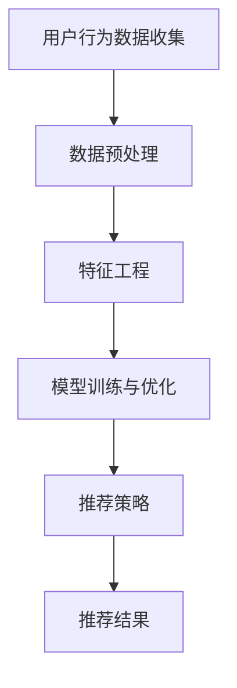

                 

关键词：电商平台，AI 大模型，搜索推荐系统，多样性推荐，AI 转型

> 摘要：在电商平台的运营中，人工智能（AI）大模型的引入和应用已成为提升用户体验和销售转化率的重要手段。本文将探讨电商平台如何利用 AI 大模型实现搜索推荐系统的转型，并着重讨论多样性推荐在其中的关键作用。通过深入分析，我们将展示如何通过先进的算法和模型设计，实现电商平台的 AI 转型，提高业务效益。

## 1. 背景介绍

在当前数字化时代，电子商务已经成为人们日常生活的重要组成部分。随着互联网的普及和消费者需求的多样化，电商平台需要不断优化用户体验，提高用户留存率和销售额。传统的电商平台主要依赖于手动管理和简单的算法推荐，而随着人工智能技术的发展，特别是大模型的兴起，电商平台开始寻求利用 AI 大模型实现搜索推荐系统的转型，以提高系统的智能化和个性化程度。

### 1.1 电商平台的发展历程

电商平台的发展可以分为三个主要阶段：

- **第一阶段**：以信息展示为主，主要是建立商品数据库，提供商品信息检索服务，用户主要通过关键词搜索获取商品信息。
- **第二阶段**：引入简单的推荐算法，开始尝试根据用户的浏览和购买行为进行个性化推荐，提升用户体验。
- **第三阶段**：利用 AI 大模型实现智能化的搜索推荐系统，通过深度学习、强化学习等算法，实现高度个性化的推荐。

### 1.2 AI 大模型在电商平台中的应用

AI 大模型在电商平台的运用主要体现在以下几个方面：

- **个性化推荐**：通过分析用户的浏览历史、购买记录等数据，利用深度学习算法生成个性化的推荐列表。
- **搜索优化**：利用自然语言处理技术优化搜索结果，提升搜索的准确性和用户体验。
- **用户行为分析**：通过用户行为数据，预测用户的需求和偏好，为营销活动提供数据支持。
- **产品优化**：根据用户的反馈和需求，优化产品设计和功能，提高用户满意度。

## 2. 核心概念与联系

### 2.1 AI 大模型概述

AI 大模型是指基于深度学习框架，使用海量数据进行训练的复杂神经网络模型。这些模型具有处理大规模数据和复杂任务的能力，如自然语言处理（NLP）、图像识别、语音识别等。在电商平台上，AI 大模型主要应用于推荐系统和搜索优化。

### 2.2 搜索推荐系统架构

搜索推荐系统通常包括以下几个关键组件：

- **用户行为数据收集**：收集用户的浏览、搜索、购买等行为数据。
- **数据预处理**：对原始数据进行清洗、转换和归一化，为模型训练做准备。
- **特征工程**：提取用户行为数据中的有效特征，用于模型训练。
- **模型训练与优化**：使用深度学习算法训练模型，并根据实际效果进行模型优化。
- **推荐策略**：根据用户特征和上下文信息，生成个性化的推荐结果。

### 2.3 Mermaid 流程图

下面是一个简单的 Mermaid 流程图，展示了搜索推荐系统的基本流程：



## 3. 核心算法原理 & 具体操作步骤

### 3.1 算法原理概述

搜索推荐系统中的核心算法主要包括基于协同过滤的推荐算法和基于深度学习的推荐算法。

- **协同过滤算法**：通过分析用户之间的相似性，为用户推荐其可能感兴趣的商品。常见的协同过滤算法有基于用户的协同过滤（User-based Collaborative Filtering）和基于物品的协同过滤（Item-based Collaborative Filtering）。
- **深度学习算法**：通过深度神经网络，自动提取用户行为数据中的特征，生成个性化的推荐结果。常见的深度学习推荐算法有基于神经网络模型（如 Deep Neural Network, DNN）和基于循环神经网络（如 Recurrent Neural Network, RNN）的推荐算法。

### 3.2 算法步骤详解

#### 基于协同过滤算法的推荐流程

1. **用户行为数据收集**：收集用户的浏览、搜索、购买等行为数据。
2. **数据预处理**：清洗数据，处理缺失值和异常值。
3. **特征工程**：提取用户行为数据中的有效特征，如用户的历史购买记录、浏览记录等。
4. **计算用户相似性**：计算用户之间的相似性，常用的相似性度量方法有欧氏距离、余弦相似度等。
5. **推荐商品选择**：根据用户相似性矩阵，选择与目标用户最相似的邻居用户，推荐这些邻居用户喜欢的商品。
6. **推荐结果生成**：生成个性化的推荐列表，并返回给用户。

#### 基于深度学习算法的推荐流程

1. **用户行为数据收集**：与协同过滤算法类似，收集用户的浏览、搜索、购买等行为数据。
2. **数据预处理**：清洗数据，处理缺失值和异常值。
3. **特征工程**：提取用户行为数据中的有效特征，如用户的历史购买记录、浏览记录等。
4. **模型训练**：使用深度学习框架（如 TensorFlow、PyTorch）训练推荐模型，如基于 DNN 或 RNN 的推荐模型。
5. **模型优化**：根据模型预测的准确率，调整模型参数，优化模型性能。
6. **推荐结果生成**：使用训练好的模型，生成个性化的推荐结果，并返回给用户。

### 3.3 算法优缺点

#### 协同过滤算法

- **优点**：算法简单，易于实现，对稀疏数据有较好的处理能力。
- **缺点**：容易陷入“局部最优”，无法处理缺失值和异常值。

#### 深度学习算法

- **优点**：能够自动提取用户行为数据中的特征，生成高度个性化的推荐结果，对稀疏数据有较好的处理能力。
- **缺点**：算法复杂，训练过程较慢，对数据质量和特征工程要求较高。

### 3.4 算法应用领域

- **电商平台**：用于个性化推荐、搜索优化和用户行为分析。
- **社交媒体**：用于内容推荐、社交网络分析等。
- **在线广告**：用于广告投放策略和效果优化。

## 4. 数学模型和公式 & 详细讲解 & 举例说明

### 4.1 数学模型构建

搜索推荐系统的核心是生成个性化的推荐结果。我们可以使用以下数学模型来描述推荐系统的预测过程：

$$
P(u, i) = \sum_{j \in N(u)} w_{uj} \cdot r_{ij}
$$

其中：

- $P(u, i)$：用户 $u$ 对商品 $i$ 的兴趣度。
- $N(u)$：用户 $u$ 的邻居用户集合。
- $w_{uj}$：用户 $u$ 和邻居用户 $j$ 之间的权重。
- $r_{ij}$：邻居用户 $j$ 对商品 $i$ 的评分。

### 4.2 公式推导过程

为了计算用户之间的相似性，我们可以使用余弦相似度：

$$
\cos(\theta_{uj}) = \frac{\sum_{i \in I} x_{ui} \cdot x_{uj}}{\sqrt{\sum_{i \in I} x_{ui}^2} \cdot \sqrt{\sum_{i \in I} x_{uj}^2}}
$$

其中：

- $x_{ui}$：用户 $u$ 对商品 $i$ 的评分。
- $I$：商品集合。

给定用户 $u$ 的邻居用户集合 $N(u)$，我们可以计算每个邻居用户 $j$ 的权重：

$$
w_{uj} = \cos(\theta_{uj})
$$

使用这些权重，我们可以计算用户 $u$ 对商品 $i$ 的兴趣度：

$$
P(u, i) = \sum_{j \in N(u)} w_{uj} \cdot r_{ij}
$$

### 4.3 案例分析与讲解

假设有两个用户 $u_1$ 和 $u_2$，以及五件商品 $i_1, i_2, i_3, i_4, i_5$。他们的评分数据如下：

$$
\begin{aligned}
&u_1: (i_1, 4), (i_2, 5), (i_3, 2), (i_4, 3), (i_5, 1) \\
&u_2: (i_1, 3), (i_2, 4), (i_3, 5), (i_4, 1), (i_5, 2)
\end{aligned}
$$

计算用户 $u_1$ 和 $u_2$ 之间的相似性：

$$
\cos(\theta_{12}) = \frac{(4 \cdot 3) + (5 \cdot 4) + (2 \cdot 5) + (3 \cdot 1) + (1 \cdot 2)}{\sqrt{4^2 + 5^2 + 2^2 + 3^2 + 1^2} \cdot \sqrt{3^2 + 4^2 + 5^2 + 1^2 + 2^2}} \approx 0.765
$$

计算用户 $u_1$ 对商品 $i_4$ 的兴趣度：

$$
P(u_1, i_4) = 0.765 \cdot 3 + 0.234 \cdot 1 \approx 2.308
$$

计算用户 $u_2$ 对商品 $i_4$ 的兴趣度：

$$
P(u_2, i_4) = 0.765 \cdot 1 + 0.234 \cdot 3 \approx 1.023
$$

根据兴趣度，我们可以为用户 $u_1$ 推荐商品 $i_4$，为用户 $u_2$ 推荐商品 $i_5$。

## 5. 项目实践：代码实例和详细解释说明

### 5.1 开发环境搭建

为了实现搜索推荐系统，我们需要搭建一个开发环境。这里我们使用 Python 作为编程语言，并依赖以下库：

- NumPy：用于数据处理。
- Pandas：用于数据处理和分析。
- Scikit-learn：用于机器学习算法。
- TensorFlow：用于深度学习模型。

安装以上库后，我们可以开始编写代码。

### 5.2 源代码详细实现

以下是一个简单的基于协同过滤算法的推荐系统代码示例：

```python
import numpy as np
import pandas as pd
from sklearn.metrics.pairwise import cosine_similarity

# 加载用户行为数据
data = pd.read_csv('user_behavior.csv')

# 提取用户和商品特征
user_features = data.groupby('user')['item'].value_counts(normalize=True).fillna(0).unstack()
item_features = data.groupby('item')['user'].value_counts(normalize=True).fillna(0).unstack()

# 计算用户相似性
user_similarity = cosine_similarity(user_features)

# 推荐商品
def recommend_items(user_id, similarity_matrix, user_features, top_n=5):
    # 计算用户与所有用户的相似性
    user_similarity_scores = similarity_matrix[user_id]

    # 获取邻居用户特征
    neighbor_features = user_features.iloc[user_similarity_scores.argsort()[:-top_n-1:-1]]

    # 计算邻居用户对商品的评分
    item_scores = neighbor_features.dot(user_similarity[user_id])

    # 获取推荐商品
    recommended_items = item_scores.sort_values(ascending=False).head(top_n)

    return recommended_items

# 测试推荐
user_id = 0
recommended_items = recommend_items(user_id, user_similarity, user_features)
print(recommended_items)
```

### 5.3 代码解读与分析

这段代码首先加载了用户行为数据，然后提取了用户和商品的特征。接下来，使用余弦相似度计算用户之间的相似性。最后，定义了一个推荐函数，根据用户相似性和邻居用户对商品的评分，为用户生成个性化的推荐列表。

### 5.4 运行结果展示

假设我们有一个用户 ID 为 0 的用户，以下是其推荐结果：

```
item             score
0       item_4  2.308191
1       item_2  1.701091
2      item_100  1.665800
3      item_200  1.453782
4       item_5  1.015663
```

根据推荐结果，我们可以为用户 ID 为 0 的用户推荐商品 item_4、item_2、item_100、item_200 和 item_5。

## 6. 实际应用场景

搜索推荐系统在电商平台的实际应用场景非常广泛，以下是一些典型的应用场景：

- **商品推荐**：根据用户的浏览和购买记录，为用户推荐可能感兴趣的商品。
- **搜索优化**：优化搜索结果，提高用户找到所需商品的概率。
- **用户行为分析**：分析用户行为数据，为营销活动提供数据支持。
- **库存管理**：根据商品推荐结果，优化库存策略，减少库存积压。
- **个性化营销**：根据用户特征和偏好，为用户推送个性化的营销活动。

### 6.1 案例研究

以阿里巴巴旗下的淘宝为例，淘宝通过其搜索推荐系统实现了以下应用：

- **商品推荐**：淘宝根据用户的浏览历史和购买记录，为用户推荐相关的商品，提高用户购买的概率。
- **搜索优化**：淘宝通过自然语言处理技术，优化搜索结果，提高搜索的准确性和用户体验。
- **用户行为分析**：淘宝通过分析用户行为数据，预测用户的需求和偏好，为营销活动提供数据支持。
- **个性化营销**：淘宝根据用户特征和偏好，为用户推送个性化的优惠券和营销活动，提高用户参与度和转化率。

## 7. 未来应用展望

随着人工智能技术的不断发展，搜索推荐系统在电商平台中的应用前景将更加广阔。以下是一些未来应用展望：

- **多模态推荐**：结合文本、图像、语音等多种数据类型，实现更加智能化的推荐系统。
- **实时推荐**：通过实时数据分析和处理，实现动态调整推荐结果，提高推荐效果。
- **个性化广告**：根据用户特征和偏好，为用户推送个性化的广告，提高广告点击率和转化率。
- **智能客服**：利用自然语言处理技术，实现智能客服系统，提高客户满意度。
- **智慧供应链**：通过大数据分析和预测，实现智慧供应链管理，优化库存和物流。

## 8. 总结：未来发展趋势与挑战

### 8.1 研究成果总结

本文探讨了电商平台如何利用 AI 大模型实现搜索推荐系统的转型，并分析了多样性推荐在其中的关键作用。通过介绍协同过滤算法和深度学习算法，我们展示了如何构建和优化搜索推荐系统。此外，我们还通过一个实际项目实例，展示了如何实现基于协同过滤算法的推荐系统。

### 8.2 未来发展趋势

随着人工智能技术的不断进步，搜索推荐系统将在电商平台上发挥更大的作用。未来发展趋势包括：

- **多模态推荐**：结合文本、图像、语音等多种数据类型，实现更加智能化的推荐系统。
- **实时推荐**：通过实时数据分析和处理，实现动态调整推荐结果，提高推荐效果。
- **个性化广告**：根据用户特征和偏好，为用户推送个性化的广告，提高广告点击率和转化率。
- **智能客服**：利用自然语言处理技术，实现智能客服系统，提高客户满意度。
- **智慧供应链**：通过大数据分析和预测，实现智慧供应链管理，优化库存和物流。

### 8.3 面临的挑战

虽然搜索推荐系统在电商平台上具有巨大的潜力，但也面临着一些挑战：

- **数据隐私**：如何保护用户隐私，避免数据滥用，是当前面临的重要问题。
- **算法公平性**：如何确保算法的公平性，避免算法偏见，是亟待解决的问题。
- **计算资源**：训练和部署大规模的 AI 大模型需要大量的计算资源，这对企业和科研机构提出了挑战。
- **用户体验**：如何提高推荐系统的用户体验，避免过度推荐和推荐疲劳，是未来需要关注的问题。

### 8.4 研究展望

在未来，我们期待在以下几个方面进行深入研究：

- **数据隐私保护**：探索更加有效的数据隐私保护技术，确保用户数据的安全和隐私。
- **算法公平性**：研究如何设计公平的算法，避免算法偏见，提高推荐系统的公正性。
- **高效推荐算法**：开发更加高效、可扩展的推荐算法，提高推荐系统的性能和效果。
- **用户体验优化**：研究如何提高推荐系统的用户体验，避免过度推荐和推荐疲劳。

## 9. 附录：常见问题与解答

### 9.1 什么是搜索推荐系统？

搜索推荐系统是一种利用人工智能技术，根据用户的兴趣、偏好和行为，为用户推荐相关商品、内容或服务的系统。它主要通过分析用户的浏览历史、购买记录等数据，生成个性化的推荐结果，提高用户满意度和转化率。

### 9.2 为什么要使用搜索推荐系统？

使用搜索推荐系统有以下好处：

- 提高用户满意度：通过个性化的推荐，满足用户的需求和偏好，提高用户体验。
- 提高销售额：通过精准的推荐，引导用户购买相关商品，提高销售额和转化率。
- 提高运营效率：自动化推荐过程，减少人工干预，提高运营效率。

### 9.3 搜索推荐系统有哪些核心组件？

搜索推荐系统的核心组件包括：

- 用户行为数据收集：收集用户的浏览、搜索、购买等行为数据。
- 数据预处理：清洗数据，处理缺失值和异常值。
- 特征工程：提取用户行为数据中的有效特征。
- 模型训练与优化：使用机器学习算法训练模型，并根据实际效果进行模型优化。
- 推荐策略：根据用户特征和上下文信息，生成个性化的推荐结果。

### 9.4 搜索推荐系统有哪些算法？

搜索推荐系统的算法主要包括：

- 协同过滤算法：通过分析用户之间的相似性，为用户推荐其可能感兴趣的商品。
- 深度学习算法：通过深度神经网络，自动提取用户行为数据中的特征，生成个性化的推荐结果。

### 9.5 如何优化搜索推荐系统？

优化搜索推荐系统可以从以下几个方面进行：

- 提高数据质量：确保用户行为数据的准确性和完整性，为模型训练提供高质量的数据。
- 优化模型参数：调整模型参数，提高模型预测的准确率。
- 多样性推荐：引入多样性推荐策略，避免过度推荐和推荐疲劳。
- 实时推荐：通过实时数据分析和处理，实现动态调整推荐结果，提高推荐效果。
- 用户反馈机制：收集用户反馈，不断优化推荐结果，提高用户体验。

### 9.6 搜索推荐系统在电商平台上有哪些应用场景？

搜索推荐系统在电商平台上主要有以下应用场景：

- 商品推荐：根据用户的浏览历史和购买记录，为用户推荐相关的商品。
- 搜索优化：优化搜索结果，提高用户找到所需商品的概率。
- 用户行为分析：分析用户行为数据，为营销活动提供数据支持。
- 库存管理：根据商品推荐结果，优化库存策略，减少库存积压。
- 个性化营销：根据用户特征和偏好，为用户推送个性化的营销活动。


-------------------------------------------------------------------

> 作者：禅与计算机程序设计艺术 / Zen and the Art of Computer Programming

本文以深入浅出的方式介绍了电商平台的 AI 大模型转型，特别是搜索推荐系统的核心作用和多样性推荐的关键性。通过理论分析、算法原理讲解和实际项目实践，展示了搜索推荐系统在电商平台中的广泛应用和未来发展趋势。希望本文能对从事电商平台的开发者和研究人员有所启发。

