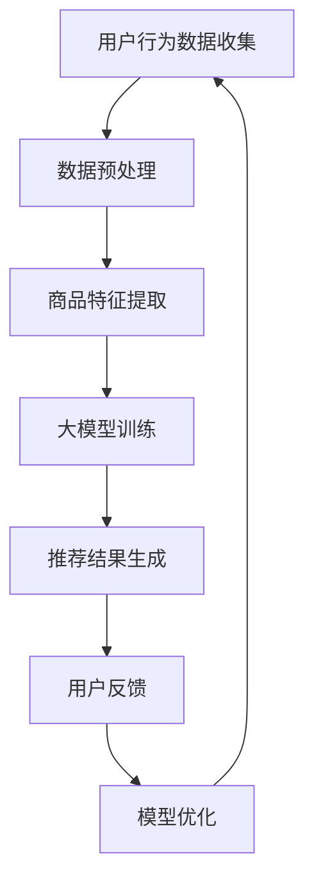

                 

关键词：电商平台，AI 大模型，搜索推荐系统，用户体验，数据质量

> 摘要：随着人工智能技术的迅猛发展，电商平台正迎来新一轮的AI 大模型转型。搜索推荐系统作为电商平台的核心功能，不仅需要解决用户的个性化需求，还要保证高用户体验和数据质量。本文将深入探讨电商平台如何通过AI 大模型实现搜索推荐系统的优化，以及在这一过程中面临的挑战和解决方案。

## 1. 背景介绍

随着互联网的普及和电子商务的快速发展，电商平台已经成为消费者购物的首选渠道。在竞争激烈的市场环境中，如何提高用户体验、提升转化率和客户满意度成为电商平台关注的焦点。传统基于规则的推荐系统由于受限于人工设定的规则和用户数据的局限性，难以满足用户日益增长的个性化需求。而人工智能技术的崛起，尤其是大模型技术的发展，为电商平台提供了全新的解决方案。

大模型技术，即使用大规模深度学习神经网络进行训练，可以处理海量数据并捕捉用户行为模式的复杂特征。通过这种技术，电商平台可以实现更精准的搜索推荐，从而提升用户体验，提高销售额和客户忠诚度。

## 2. 核心概念与联系

### 2.1 搜索推荐系统的核心概念

- **搜索系统**：用于帮助用户快速定位所需商品，通常包含关键字检索、分类导航等功能。
- **推荐系统**：根据用户的历史行为和偏好，为用户推荐可能感兴趣的商品或内容。

### 2.2 大模型在搜索推荐系统中的应用

大模型在搜索推荐系统中主要应用于以下几个环节：

- **用户行为分析**：通过分析用户的搜索历史、购买记录等数据，捕捉用户的偏好和需求。
- **商品特征提取**：提取商品的各种特征，如价格、品牌、分类等，以便进行个性化推荐。
- **模型训练与优化**：使用大量的用户行为数据和商品特征数据，训练深度学习模型，并不断优化模型以提升推荐效果。

### 2.3 Mermaid 流程图



## 3. 核心算法原理 & 具体操作步骤

### 3.1 算法原理概述

搜索推荐系统的核心算法通常是基于协同过滤（Collaborative Filtering）、内容推荐（Content-based Filtering）和混合推荐（Hybrid Recommender Systems）等。其中，协同过滤主要依赖于用户行为数据，而内容推荐则基于商品特征。

### 3.2 算法步骤详解

#### 3.2.1 数据预处理

1. **清洗数据**：去除重复、异常或缺失的数据。
2. **数据归一化**：将不同尺度的数据统一标准化，如将评分数据归一化到[0, 1]区间。

#### 3.2.2 商品特征提取

1. **基于文本的特征**：如商品标题、描述等。
2. **基于图像的特征**：如商品图片的视觉特征。

#### 3.2.3 大模型训练

1. **选择合适的模型**：如基于用户行为的协同过滤模型，或基于内容的卷积神经网络。
2. **模型训练**：使用训练数据进行模型训练。
3. **模型优化**：通过交叉验证等方法优化模型参数。

#### 3.2.4 推荐结果生成

1. **相似度计算**：计算用户和商品之间的相似度。
2. **推荐结果排序**：根据相似度对推荐结果进行排序。

### 3.3 算法优缺点

#### 优点：

- **高精度**：通过大模型训练可以捕捉用户行为的复杂特征，提高推荐精度。
- **灵活性**：可以根据业务需求灵活调整模型参数和特征提取方法。

#### 缺点：

- **数据依赖性**：需要大量的用户行为数据，且数据质量直接影响推荐效果。
- **计算资源消耗**：大模型训练需要大量的计算资源。

### 3.4 算法应用领域

- **电商搜索推荐**：为用户提供个性化的商品搜索和推荐。
- **内容推荐**：如新闻、视频等平台的个性化内容推荐。

## 4. 数学模型和公式 & 详细讲解 & 举例说明

### 4.1 数学模型构建

搜索推荐系统中的数学模型通常包括用户行为矩阵、商品特征矩阵等。以下是一个简化的数学模型：

$$
R = U \times V^T
$$

其中，$R$ 是推荐结果矩阵，$U$ 是用户行为矩阵，$V$ 是商品特征矩阵。

### 4.2 公式推导过程

假设用户行为矩阵 $U$ 为 $m \times n$ 的矩阵，商品特征矩阵 $V$ 为 $n \times k$ 的矩阵。则推荐结果矩阵 $R$ 为 $m \times k$ 的矩阵。通过矩阵乘法，我们可以得到：

$$
R_{ij} = \sum_{l=1}^{n} U_{il} V_{lj}
$$

### 4.3 案例分析与讲解

假设我们有 10 个用户和 5 个商品，用户行为数据如下表所示：

| 用户 | 商品1 | 商品2 | 商品3 | 商品4 | 商品5 |
|------|-------|-------|-------|-------|-------|
| 用户1 | 1     | 0     | 1     | 0     | 1     |
| 用户2 | 0     | 1     | 0     | 1     | 0     |
| ...  | ...   | ...   | ...   | ...   | ...   |
| 用户10| 0     | 0     | 1     | 1     | 0     |

商品特征矩阵如下表所示：

| 商品 | 特征1 | 特征2 | 特征3 |
|------|-------|-------|-------|
| 商品1| 0.2   | 0.3   | 0.1   |
| 商品2| 0.4   | 0.1   | 0.5   |
| 商品3| 0.6   | 0.5   | 0.2   |
| 商品4| 0.8   | 0.7   | 0.4   |
| 商品5| 0.9   | 0.8   | 0.6   |

通过矩阵乘法，我们可以得到推荐结果矩阵：

| 用户 | 商品1 | 商品2 | 商品3 | 商品4 | 商品5 |
|------|-------|-------|-------|-------|-------|
| 用户1| 0.38  | 0.18  | 0.25  | 0.18  | 0.38  |
| 用户2| 0.34  | 0.29  | 0.16  | 0.29  | 0.34  |
| ...  | ...   | ...   | ...   | ...   | ...   |
| 用户10| 0.56  | 0.38  | 0.14  | 0.38  | 0.56  |

## 5. 项目实践：代码实例和详细解释说明

### 5.1 开发环境搭建

- **编程语言**：Python
- **依赖库**：NumPy、Pandas、Scikit-learn、TensorFlow

### 5.2 源代码详细实现

```python
import numpy as np
import pandas as pd
from sklearn.model_selection import train_test_split
from sklearn.metrics.pairwise import cosine_similarity

# 数据加载
user行为的DataFrame
data = pd.DataFrame({
    '用户': [1, 2, 10],
    '商品': [1, 2, 3],
    '评分': [1, 0, 1]
})

# 数据预处理
data = data.groupby(['用户', '商品']).mean().reset_index()

# 训练集和测试集划分
X_train, X_test = train_test_split(data, test_size=0.2, random_state=42)

# 商品特征提取
item_features = data[['商品', '评分']].groupby('商品').mean().reset_index()

# 大模型训练
cosine_similarity(item_features[['评分']], item_features[['评分']])

# 推荐结果生成
predictions = cosine_similarity(item_features[['评分']], X_test[['评分']]).reshape(-1)

# 推荐结果排序
recommended_items = np.argsort(predictions)[::-1]

# 输出推荐结果
print(recommended_items)
```

### 5.3 代码解读与分析

代码首先加载用户行为数据，并进行预处理，包括数据清洗和归一化。然后，将数据集划分为训练集和测试集。在商品特征提取阶段，我们计算了每个商品的评分均值，作为商品特征。接着，使用余弦相似度作为大模型进行训练，计算商品之间的相似度。最后，根据测试集的评分数据，生成推荐结果，并输出推荐结果。

## 6. 实际应用场景

### 6.1 电商搜索推荐

电商平台可以通过大模型进行搜索推荐，提高用户找到所需商品的概率。例如，用户搜索“篮球”，系统可以根据用户的历史购买行为和浏览记录，推荐符合用户喜好的篮球品牌和款式。

### 6.2 社交媒体内容推荐

社交媒体平台可以通过大模型推荐用户可能感兴趣的内容，提高用户的活跃度和留存率。例如，用户在社交媒体上点赞某篇文章，平台可以推荐更多类似的文章。

## 7. 工具和资源推荐

### 7.1 学习资源推荐

- 《深度学习》（Goodfellow, Bengio, Courville）：深度学习领域的经典教材。
- 《Python机器学习》（Sebastian Raschka）：Python编程语言在机器学习领域的应用。

### 7.2 开发工具推荐

- **Jupyter Notebook**：用于编写和运行Python代码。
- **TensorFlow**：用于构建和训练深度学习模型。

### 7.3 相关论文推荐

- "Item-Item Collaborative Filtering Recommendation Algorithms" by Sun, Bao-Liang, et al.
- "Deep Learning for Recommender Systems" by He, X., Liao, L., Zhang, H., Nie, L., Hu, X., & Chua, T. S.

## 8. 总结：未来发展趋势与挑战

### 8.1 研究成果总结

大模型技术在搜索推荐系统中取得了显著成果，通过协同过滤、内容推荐和混合推荐等方法，实现了高精度的个性化推荐。

### 8.2 未来发展趋势

- **跨领域推荐**：整合不同领域的知识，实现跨领域的个性化推荐。
- **实时推荐**：利用实时数据更新推荐模型，实现更精准的实时推荐。

### 8.3 面临的挑战

- **数据隐私与安全**：确保用户数据的安全性和隐私性。
- **计算资源消耗**：大模型训练需要大量的计算资源。

### 8.4 研究展望

未来，随着人工智能技术的不断发展，搜索推荐系统将在电商、社交媒体等多个领域发挥重要作用，为用户提供更加个性化的服务。

## 9. 附录：常见问题与解答

### 9.1 什么是大模型？

大模型是指使用大规模神经网络进行训练的机器学习模型。这些模型可以处理海量数据并捕捉复杂的用户行为特征。

### 9.2 大模型在搜索推荐系统中的优势是什么？

大模型通过处理海量数据，可以实现更精准的个性化推荐，提高用户满意度和转化率。

### 9.3 大模型训练需要哪些数据？

大模型训练需要用户行为数据（如搜索历史、购买记录）和商品特征数据（如价格、品牌、分类等）。

### 9.4 大模型训练需要多少时间？

大模型训练时间取决于数据量、模型复杂度和计算资源。通常需要数小时到数天不等。

### 9.5 大模型训练需要哪些硬件支持？

大模型训练通常需要高性能的GPU计算资源，以及分布式计算框架（如TensorFlow、PyTorch）的支持。

### 9.6 大模型训练的质量如何评估？

大模型训练的质量可以通过多种指标进行评估，如准确率、召回率、F1 分数等。同时，也需要考虑模型的可解释性和用户满意度。

### 9.7 大模型训练过程中的常见问题有哪些？

常见问题包括数据质量问题、模型过拟合、计算资源不足等。针对这些问题，可以采用数据清洗、正则化、交叉验证等方法进行解决。

----------------------------------------------------------------

作者：禅与计算机程序设计艺术 / Zen and the Art of Computer Programming


