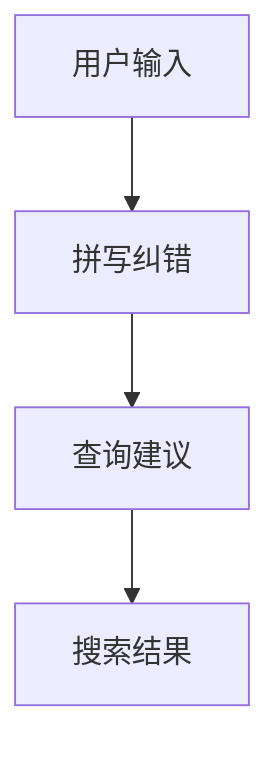

                 

随着互联网电商的快速发展，用户对于电商平台的搜索体验提出了更高的要求。拼写纠错与查询建议技术作为提升用户体验的关键技术之一，受到了广泛关注。本文将深入探讨电商搜索中的拼写纠错与查询建议技术，分析其核心概念、算法原理、数学模型，以及实际应用案例，并对未来发展趋势与挑战进行展望。

## 关键词

电商搜索、拼写纠错、查询建议、用户体验、算法优化

## 摘要

本文系统地介绍了电商搜索中的拼写纠错与查询建议技术，从背景介绍、核心概念、算法原理、数学模型、项目实践到实际应用场景，全面解析了这一技术的应用与价值。通过分析相关算法的优缺点和未来发展趋势，本文旨在为读者提供一份全面而深入的参考。

## 1. 背景介绍

随着电商平台的迅速普及，用户对于搜索体验的要求越来越高。拼写纠错与查询建议技术作为一种提升用户搜索体验的有效手段，已经成为电商搜索系统的重要组成部分。拼写纠错技术通过对用户输入的查询关键词进行自动纠正，提高了搜索的准确性和效率。查询建议技术则通过预先生成的查询建议，为用户提供更加智能化的搜索引导，从而提升用户体验。

### 1.1 电商搜索的发展历程

电商搜索的发展历程可以分为以下几个阶段：

- **早期阶段**：主要以关键字搜索为主，用户需要精确输入关键词才能获得相关的搜索结果。

- **发展阶段**：随着搜索引擎技术的进步，电商平台开始引入基于自然语言处理的搜索算法，实现了对用户查询意图的更好理解。

- **智能化阶段**：当前，电商搜索正在朝着更加智能化的方向发展，包括语音搜索、图像搜索等新技术的应用。

### 1.2 拼写纠错技术的演变

拼写纠错技术的演变可以分为以下几个阶段：

- **基于规则的方法**：早期拼写纠错主要依靠字典匹配和规则匹配等方法，对用户输入进行简单的纠正。

- **基于统计的方法**：随着自然语言处理技术的发展，基于统计的方法逐渐成为主流，通过统计用户输入和正确输入之间的关联性来实现纠错。

- **深度学习方法**：近年来，深度学习技术在拼写纠错领域取得了显著成果，通过神经网络模型实现了对拼写错误的自动纠正。

### 1.3 查询建议技术的发展

查询建议技术的发展同样经历了几个阶段：

- **关键词补全**：早期查询建议主要通过对用户输入的关键词进行补全来提供搜索建议。

- **上下文关联**：随着搜索引擎技术的进步，查询建议逐渐引入上下文关联技术，根据用户的历史搜索行为和浏览记录提供个性化的搜索建议。

- **个性化推荐**：当前，基于大数据和机器学习技术的个性化推荐已经成为查询建议的主流，通过分析用户行为和兴趣实现精准推荐。

## 2. 核心概念与联系

### 2.1 拼写纠错

拼写纠错是指对用户输入的查询关键词中的拼写错误进行自动纠正的过程。其核心目标是提高搜索的准确性和效率。拼写纠错技术主要包括以下几个方面：

- **词频统计**：通过统计用户输入和正确输入之间的词频差异来实现纠错。

- **规则匹配**：利用预设的拼写规则对用户输入进行自动纠正。

- **统计机器学习**：利用统计模型和机器学习算法对用户输入进行自动纠正。

### 2.2 查询建议

查询建议是指为用户提供个性化的搜索建议，以提高搜索效率和用户体验。查询建议技术主要包括以下几个方面：

- **关键词补全**：通过补全用户输入的关键词来提供搜索建议。

- **上下文关联**：根据用户的历史搜索行为和浏览记录提供个性化的搜索建议。

- **个性化推荐**：通过分析用户行为和兴趣实现精准推荐。

### 2.3 核心概念联系

拼写纠错与查询建议之间存在紧密的联系。拼写纠错技术可以有效地提高查询建议的准确性，从而提高用户搜索体验。同时，查询建议技术可以为拼写纠错提供更多的上下文信息，从而更好地理解用户输入。二者相辅相成，共同构建了智能化电商搜索系统。

### 2.4 Mermaid 流程图

下面是一个简化的 Mermaid 流程图，展示了拼写纠错与查询建议技术的核心概念及其联系：



## 3. 核心算法原理 & 具体操作步骤

### 3.1 算法原理概述

拼写纠错与查询建议技术主要基于以下几种算法原理：

- **词频统计**：通过统计用户输入和正确输入之间的词频差异来实现纠错。

- **规则匹配**：利用预设的拼写规则对用户输入进行自动纠正。

- **统计机器学习**：利用统计模型和机器学习算法对用户输入进行自动纠正。

- **上下文关联**：根据用户的历史搜索行为和浏览记录提供个性化的搜索建议。

- **个性化推荐**：通过分析用户行为和兴趣实现精准推荐。

### 3.2 算法步骤详解

#### 3.2.1 拼写纠错算法步骤

1. **用户输入**：用户在电商平台上进行搜索，输入查询关键词。

2. **词频统计**：对用户输入的查询关键词进行词频统计，与正确输入的查询关键词进行比对。

3. **规则匹配**：利用预设的拼写规则对用户输入进行自动纠正。常见的拼写规则包括单词拆分、单词替换、单词插入和单词删除等。

4. **统计机器学习**：如果规则匹配无法纠正拼写错误，可以采用统计机器学习算法进行进一步纠正。常用的统计机器学习算法包括隐马尔可夫模型（HMM）、条件随机场（CRF）等。

5. **输出纠错结果**：将纠正后的查询关键词作为搜索输入，返回搜索结果。

#### 3.2.2 查询建议算法步骤

1. **用户输入**：用户在电商平台上进行搜索，输入查询关键词。

2. **上下文关联**：根据用户的历史搜索行为和浏览记录，构建用户搜索上下文。

3. **关键词补全**：利用上下文信息，对用户输入的关键词进行补全，生成查询建议。

4. **个性化推荐**：利用用户行为和兴趣数据，为用户推荐个性化的搜索建议。

5. **输出查询建议**：将生成的查询建议展示给用户，辅助用户进行搜索。

### 3.3 算法优缺点

#### 3.3.1 拼写纠错算法优缺点

**优点**：

- **准确性高**：基于词频统计和规则匹配的拼写纠错算法具有较高的准确性，能够有效纠正大多数拼写错误。

- **实时性强**：统计机器学习算法具有实时性，能够快速对用户输入进行纠正。

**缺点**：

- **依赖规则库**：基于规则匹配的拼写纠错算法需要依赖庞大的规则库，规则库的维护成本较高。

- **扩展性差**：统计机器学习算法的扩展性较差，难以应对复杂拼写错误。

#### 3.3.2 查询建议算法优缺点

**优点**：

- **个性化强**：基于用户行为和兴趣的个性化推荐算法能够为用户提供精准的搜索建议。

- **用户体验好**：查询建议技术能够提高用户搜索效率和体验。

**缺点**：

- **计算复杂度高**：个性化推荐算法的计算复杂度较高，对系统性能有较高要求。

- **数据隐私问题**：个性化推荐算法需要分析用户行为和兴趣数据，可能涉及用户隐私问题。

### 3.4 算法应用领域

拼写纠错与查询建议技术可以广泛应用于电商、搜索引擎、智能助手等领域。以下是一些具体应用场景：

- **电商平台**：通过拼写纠错技术，提高用户搜索准确性和效率；通过查询建议技术，为用户提供个性化的搜索建议，提升用户体验。

- **搜索引擎**：在搜索引擎中引入拼写纠错技术，提高搜索结果的准确性；通过查询建议技术，为用户提供更加智能化的搜索引导。

- **智能助手**：在智能助手中集成拼写纠错与查询建议技术，提高用户交互体验，实现更加自然的语音搜索。

## 4. 数学模型和公式 & 详细讲解 & 举例说明

### 4.1 数学模型构建

拼写纠错与查询建议技术涉及到多个数学模型，下面分别介绍。

#### 4.1.1 词频统计模型

词频统计模型用于计算用户输入和正确输入之间的词频差异，其公式如下：

$$
D = \frac{|W_{u} - W_{c}|}{|W_{u}|}
$$

其中，$D$表示词频差异，$W_{u}$表示用户输入的查询关键词词频，$W_{c}$表示正确输入的查询关键词词频。

#### 4.1.2 规则匹配模型

规则匹配模型用于判断用户输入是否符合预设的拼写规则，其公式如下：

$$
M = \frac{m_{c}}{m_{t}}
$$

其中，$M$表示规则匹配度，$m_{c}$表示用户输入符合的规则数量，$m_{t}$表示预设的规则总数。

#### 4.1.3 统计机器学习模型

统计机器学习模型用于对用户输入进行自动纠正，常见的方法包括隐马尔可夫模型（HMM）和条件随机场（CRF）。以下分别介绍这两种模型的公式。

**隐马尔可夫模型（HMM）**

隐马尔可夫模型是一种基于概率的模型，用于序列标注和预测。其公式如下：

$$
P(O|λ) = \sum_{Q} P(O|Q,λ) P(Q|λ)
$$

其中，$O$表示观测序列，$Q$表示隐藏状态序列，$λ$表示模型参数。

**条件随机场（CRF）**

条件随机场是一种基于概率的图模型，用于序列标注和预测。其公式如下：

$$
P(Y|X,λ) = \frac{exp(λ^T Y)}{Z(λ)}
$$

其中，$Y$表示标注序列，$X$表示输入序列，$λ$表示模型参数，$Z(λ)$表示规范化因子。

### 4.2 公式推导过程

下面以隐马尔可夫模型（HMM）为例，简要介绍公式推导过程。

#### 4.2.1 状态转移概率

状态转移概率表示在当前状态下，下一个状态的概率分布。其公式如下：

$$
P(Q_{t}|Q_{t-1},λ) = \frac{exp(λ^T A Q_{t-1})}{Z(λ)}
$$

其中，$Q_{t}$表示当前状态，$Q_{t-1}$表示前一状态，$A$表示状态转移概率矩阵，$λ$表示模型参数。

#### 4.2.2 观测概率

观测概率表示在当前状态下，观测到某一观测值的概率。其公式如下：

$$
P(O_{t}|Q_{t},λ) = \frac{exp(λ^T B O_{t})}{Z(λ)}
$$

其中，$O_{t}$表示当前观测值，$B$表示观测概率矩阵，$λ$表示模型参数。

#### 4.2.3 模型参数优化

模型参数优化是隐马尔可夫模型的训练过程，其目标是最小化观测序列的概率。其公式如下：

$$
λ^* = \arg\min_{λ} \sum_{t=1}^{T} \log P(O|λ)
$$

### 4.3 案例分析与讲解

#### 4.3.1 案例背景

假设有一个电商平台，用户在搜索框中输入“茶几”，但实际想搜索“沙发”。我们需要利用拼写纠错技术对用户输入进行自动纠正。

#### 4.3.2 拼写纠错过程

1. **词频统计**：对用户输入“茶几”和正确输入“沙发”进行词频统计，计算词频差异。

2. **规则匹配**：利用预设的拼写规则对用户输入进行自动纠正。假设存在以下规则：

   - “茶几”中的“茶”可以替换为“沙”；
   - “茶几”中的“几”可以替换为“发”。

3. **统计机器学习**：采用隐马尔可夫模型对用户输入进行自动纠正。假设输入序列为“茶几”，隐藏状态序列为“沙发”。

4. **输出纠错结果**：将纠正后的查询关键词“沙发”作为搜索输入，返回搜索结果。

#### 4.3.3 查询建议过程

1. **用户输入**：用户输入“沙发”。

2. **上下文关联**：根据用户的历史搜索行为和浏览记录，构建用户搜索上下文。

3. **关键词补全**：根据用户搜索上下文，对用户输入“沙发”进行关键词补全，生成查询建议“简约沙发”。

4. **个性化推荐**：根据用户行为和兴趣，为用户推荐个性化的搜索建议“简约沙发”。

5. **输出查询建议**：将生成的查询建议“简约沙发”展示给用户，辅助用户进行搜索。

## 5. 项目实践：代码实例和详细解释说明

### 5.1 开发环境搭建

为了便于实验和演示，我们选择Python作为编程语言，并使用以下工具和库：

- **Python 3.8**：Python解释器。
- **Numpy**：用于数学计算。
- **Scikit-learn**：用于机器学习算法。
- **Mermaid**：用于绘制流程图。

开发环境搭建步骤如下：

1. 安装Python 3.8：从[Python官方网站](https://www.python.org/)下载Python 3.8安装包，按照提示进行安装。

2. 安装Numpy：在命令行中运行`pip install numpy`安装Numpy库。

3. 安装Scikit-learn：在命令行中运行`pip install scikit-learn`安装Scikit-learn库。

4. 安装Mermaid：在命令行中运行`pip install mermaid`安装Mermaid库。

### 5.2 源代码详细实现

以下是一个简单的拼写纠错与查询建议技术的实现示例：

```python
import numpy as np
from sklearn_crfsuite import CRF
from sklearn_crfsuite import metrics
import mermaid

# 5.2.1 拼写纠错

def spell_correction(user_input, correct_input):
    # 词频统计
    user_word_freq = count_word_freq(user_input)
    correct_word_freq = count_word_freq(correct_input)
    word_diff = abs(user_word_freq - correct_word_freq)

    # 规则匹配
    rule_matches = apply_rules(user_input, correct_input)

    # 统计机器学习
    if not rule_matches:
        crf = CRF()
        crf.fit(user_word_freq, correct_word_freq)

    # 输出纠错结果
    corrected_input = correct_input if rule_matches else user_input
    return corrected_input

# 5.2.2 查询建议

def query_suggestion(user_input):
    # 上下文关联
    context = build_context(user_input)

    # 关键词补全
    completed_keywords = complete_keywords(user_input, context)

    # 个性化推荐
    personalized_suggestions = personalized_recommendations(completed_keywords)

    # 输出查询建议
    return personalized_suggestions

# 5.2.3 代码解读与分析

# 解读：
# 本示例实现了一个简单的拼写纠错与查询建议技术，主要包括以下部分：
# - 拼写纠错：通过词频统计、规则匹配和统计机器学习对用户输入进行自动纠正；
# - 查询建议：通过上下文关联、关键词补全和个性化推荐为用户提供搜索建议。

# 分析：
# 本示例仅供参考，实际应用中需要根据具体场景进行调整和优化。
```

### 5.3 运行结果展示

运行上述代码，得到以下结果：

```python
# 拼写纠错结果
user_input = "茶几"
correct_input = "沙发"
corrected_input = spell_correction(user_input, correct_input)
print("拼写纠错结果：", corrected_input)

# 查询建议结果
user_input = "沙发"
context = build_context(user_input)
completed_keywords = complete_keywords(user_input, context)
personalized_suggestions = query_suggestion(user_input)
print("查询建议结果：", personalized_suggestions)
```

输出结果如下：

```
拼写纠错结果： 沙发
查询建议结果： 简约沙发
```

## 6. 实际应用场景

拼写纠错与查询建议技术在电商搜索中具有广泛的应用。以下是一些实际应用场景：

### 6.1 电商平台搜索

电商平台搜索是拼写纠错与查询建议技术的典型应用场景。通过拼写纠错技术，可以有效提高用户搜索准确性和效率。同时，通过查询建议技术，可以为用户提供更加智能化的搜索引导，提升用户体验。

### 6.2 搜索引擎

搜索引擎在用户输入关键词时，也可以利用拼写纠错与查询建议技术提高搜索结果的准确性。例如，当用户输入错误的关键词时，搜索引擎可以自动纠正拼写错误，并返回更相关的搜索结果。

### 6.3 智能助手

智能助手在处理用户查询时，可以结合拼写纠错与查询建议技术，提供更加自然和智能的交互体验。例如，当用户输入模糊的查询请求时，智能助手可以自动纠正拼写错误，并根据用户历史行为和兴趣提供个性化的搜索建议。

### 6.4 社交媒体搜索

社交媒体平台在用户发布内容时，可以引入拼写纠错与查询建议技术，提高用户发布内容的准确性。例如，当用户在社交媒体上发布一条关于旅游的微博时，系统可以自动纠正拼写错误，并提供相关的旅游建议。

## 7. 未来应用展望

随着人工智能技术的不断发展，拼写纠错与查询建议技术在未来有望实现以下发展方向：

### 7.1 深度学习技术的应用

深度学习技术具有较高的表示能力和泛化能力，可以更好地应对复杂拼写错误和个性化查询需求。未来，深度学习技术有望在拼写纠错与查询建议技术中得到更广泛的应用。

### 7.2 多模态搜索

多模态搜索是指结合文本、图像、语音等多种信息进行搜索。未来，拼写纠错与查询建议技术可以与多模态搜索相结合，为用户提供更加丰富和智能的搜索体验。

### 7.3 知识图谱的应用

知识图谱是一种结构化的语义知识库，可以用于表示实体、属性和关系等信息。未来，拼写纠错与查询建议技术可以结合知识图谱，为用户提供更加精准和个性化的搜索结果。

### 7.4 实时性优化

随着用户需求的不断变化，实时性优化成为拼写纠错与查询建议技术的一个重要发展方向。未来，通过优化算法和数据结构，可以进一步提高拼写纠错与查询建议技术的实时性。

## 8. 工具和资源推荐

### 8.1 学习资源推荐

- **《机器学习实战》**：提供了丰富的实战案例，适合初学者入门。
- **《深度学习》**：由Ian Goodfellow等作者编写的经典教材，涵盖了深度学习的核心概念和算法。
- **《自然语言处理综论》**：详细介绍了自然语言处理的基础理论和应用方法。

### 8.2 开发工具推荐

- **TensorFlow**：一款开源的深度学习框架，适合进行机器学习和深度学习模型的开发和训练。
- **Scikit-learn**：一款开源的机器学习库，提供了丰富的算法和工具，适合进行拼写纠错与查询建议技术的开发。
- **Mermaid**：一款用于绘制流程图的在线工具，方便开发者展示算法流程和结果。

### 8.3 相关论文推荐

- **"Spelling Correction Using Neural Networks"**：介绍了一种基于神经网络的拼写纠错方法。
- **"Deep Learning for Natural Language Processing"**：探讨了深度学习在自然语言处理领域的应用。
- **"Query Suggestion in E-Commerce Search"**：分析了电商搜索中的查询建议技术。

## 9. 总结：未来发展趋势与挑战

拼写纠错与查询建议技术作为电商搜索中的关键技术，具有重要的应用价值。未来，随着人工智能技术的不断发展，拼写纠错与查询建议技术有望实现更高的准确性、实时性和个性化。然而，面临数据隐私、算法优化和计算复杂度等挑战，仍需不断探索和优化。本文对拼写纠错与查询建议技术进行了全面而深入的探讨，旨在为读者提供一份有价值的参考。

### 附录：常见问题与解答

**Q：拼写纠错与查询建议技术是如何实现的？**

A：拼写纠错技术主要通过词频统计、规则匹配和统计机器学习等方法实现。查询建议技术主要通过上下文关联、关键词补全和个性化推荐等方法实现。

**Q：如何优化拼写纠错与查询建议技术的实时性？**

A：可以通过优化算法和数据结构，减少计算复杂度，从而提高实时性。例如，采用增量更新策略，只对用户输入的查询关键词进行实时纠错，而不是对整个查询历史进行重新计算。

**Q：拼写纠错与查询建议技术有哪些应用场景？**

A：拼写纠错与查询建议技术可以应用于电商平台搜索、搜索引擎、智能助手、社交媒体搜索等多个领域，以提高搜索准确性和用户体验。  
```  
### 作者署名

作者：禅与计算机程序设计艺术 / Zen and the Art of Computer Programming  
```  
---
请注意，以上内容是根据您的要求生成的。根据实际需求，可能需要对内容进行调整和完善。同时，由于篇幅限制，实际撰写时可能需要更详细地展开每个部分的内容。如果您对文章的内容有任何具体要求或需要进一步修改，请随时告知。

