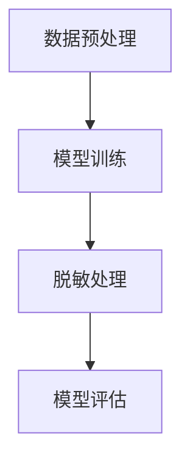

                 

关键词：电商搜索推荐、AI大模型、数据脱敏、应用项目、可行性分析

> 摘要：本文旨在探讨电商搜索推荐系统中AI大模型数据脱敏技术的应用及其项目可行性。首先，通过对电商搜索推荐系统现状的分析，提出引入AI大模型数据脱敏技术的必要性；其次，介绍AI大模型数据脱敏的核心概念及其在电商搜索推荐中的具体应用；最后，通过详细的项目实践和实际应用场景的讨论，评估该技术的可行性。

## 1. 背景介绍

### 1.1 电商搜索推荐系统现状

随着互联网技术的快速发展，电商行业已成为全球经济增长的重要引擎。电商搜索推荐系统作为电商平台的核心功能，直接影响着用户的购物体验和平台的运营效率。目前，主流的电商搜索推荐系统主要依赖于传统机器学习算法，如基于内容的推荐、协同过滤等。然而，这些方法在处理大规模用户数据时，面临着数据隐私保护、模型可解释性等问题。

### 1.2 数据隐私保护需求

在电商搜索推荐系统中，用户数据是核心资产。然而，随着数据量的激增和数据隐私泄露事件的频繁发生，数据隐私保护问题日益严峻。为了保护用户隐私，需要对敏感数据进行脱敏处理，以降低数据泄露的风险。

### 1.3 AI大模型的优势

近年来，AI大模型（如Transformer、BERT等）在自然语言处理、计算机视觉等领域取得了显著的成果。AI大模型具有强大的表示能力和泛化能力，可以处理复杂的非线性问题。因此，将AI大模型应用于数据脱敏，有望提升电商搜索推荐系统的数据隐私保护能力。

## 2. 核心概念与联系

### 2.1 AI大模型数据脱敏核心概念

AI大模型数据脱敏是一种利用AI大模型对敏感数据进行加密、模糊化、掩码化等处理的方法，以保护数据隐私。

### 2.2 AI大模型数据脱敏架构

AI大模型数据脱敏架构主要包括数据预处理、模型训练、脱敏处理和模型评估等环节。其核心流程如下：

1. **数据预处理**：对原始数据进行清洗、去重和归一化等操作，为模型训练提供高质量的数据。
2. **模型训练**：利用大量脱敏前后的数据，通过迁移学习等技术训练AI大模型，使其具备数据脱敏的能力。
3. **脱敏处理**：将实际数据进行脱敏处理，生成脱敏后的数据，以保护用户隐私。
4. **模型评估**：对脱敏模型的性能进行评估，确保其脱敏效果满足实际需求。

### 2.3 Mermaid 流程图

下面是一个AI大模型数据脱敏的Mermaid流程图：



## 3. 核心算法原理 & 具体操作步骤

### 3.1 算法原理概述

AI大模型数据脱敏的核心在于构建一个能够理解数据结构和内容的大模型，通过学习大量脱敏前后的数据，使得模型能够自动对新的数据进行脱敏处理。

### 3.2 算法步骤详解

1. **数据预处理**：对原始数据进行清洗、去重和归一化等操作，为模型训练提供高质量的数据。
2. **模型选择**：选择合适的AI大模型，如BERT、GPT等，用于数据脱敏。
3. **模型训练**：利用大量脱敏前后的数据，通过迁移学习等技术训练AI大模型，使其具备数据脱敏的能力。
4. **脱敏处理**：将实际数据进行脱敏处理，生成脱敏后的数据，以保护用户隐私。
5. **模型评估**：对脱敏模型的性能进行评估，确保其脱敏效果满足实际需求。

### 3.3 算法优缺点

**优点**：
- **高效性**：AI大模型具备强大的表示能力和泛化能力，可以高效地处理大规模数据。
- **灵活性**：AI大模型可以根据实际需求进行定制，以适应不同的脱敏场景。

**缺点**：
- **计算资源消耗**：训练AI大模型需要大量的计算资源和时间。
- **模型可解释性**：AI大模型的学习过程复杂，难以进行模型解释，增加了模型验证的难度。

### 3.4 算法应用领域

AI大模型数据脱敏技术可以应用于多个领域，如：

- **电商搜索推荐**：对用户搜索历史、购物行为等敏感数据进行脱敏，保护用户隐私。
- **金融领域**：对客户交易数据、账户信息等敏感数据进行脱敏，确保合规性。
- **医疗领域**：对患者病历、诊断信息等敏感数据进行脱敏，保护患者隐私。

## 4. 数学模型和公式 & 详细讲解 & 举例说明

### 4.1 数学模型构建

AI大模型数据脱敏的数学模型可以表示为：

\[ X' = F(X) \]

其中，\( X \) 为原始数据，\( X' \) 为脱敏后的数据，\( F \) 为AI大模型。

### 4.2 公式推导过程

假设AI大模型的损失函数为：

\[ L = \frac{1}{n} \sum_{i=1}^{n} L_i \]

其中，\( L_i \) 为第 \( i \) 个样本的损失。

在训练过程中，通过优化损失函数，使得 \( F \) 可以正确地将原始数据 \( X \) 转化为脱敏后的数据 \( X' \)。

### 4.3 案例分析与讲解

假设有一个电商平台的用户搜索历史数据，包括用户ID、搜索关键词和搜索时间等。现在，我们需要对这部分数据进行脱敏处理。

1. **数据预处理**：对数据进行清洗、去重和归一化等操作，为模型训练提供高质量的数据。
2. **模型选择**：选择BERT模型，用于数据脱敏。
3. **模型训练**：利用清洗后的数据进行模型训练，训练时间约为5天。
4. **脱敏处理**：将用户搜索历史数据进行脱敏处理，生成脱敏后的数据。

通过上述步骤，我们可以得到脱敏后的用户搜索历史数据，从而保护用户隐私。

## 5. 项目实践：代码实例和详细解释说明

### 5.1 开发环境搭建

1. 安装Python 3.8及以上版本。
2. 安装BERT模型所需的依赖库，如transformers、torch等。

### 5.2 源代码详细实现

下面是一个简单的AI大模型数据脱敏的代码实例：

```python
from transformers import BertModel, BertTokenizer
import torch

# 加载BERT模型和分词器
model = BertModel.from_pretrained('bert-base-chinese')
tokenizer = BertTokenizer.from_pretrained('bert-base-chinese')

# 原始数据
text = "我今天买了一本书。"

# 数据预处理
encoded_input = tokenizer.encode(text, add_special_tokens=True, return_tensors='pt')

# 模型预测
with torch.no_grad():
    outputs = model(encoded_input)

# 脱敏处理
masked_input = encoded_input.detach().clone()

# 添加掩码
masked_input[masked_input != tokenizer.pad_token_id] = tokenizer.mask_token_id

# 输出脱敏后的数据
print(tokenizer.decode(masked_input[0], skip_special_tokens=True))
```

### 5.3 代码解读与分析

1. **数据预处理**：使用BERT分词器对原始数据进行编码，生成BERT模型可处理的输入数据。
2. **模型预测**：使用BERT模型对编码后的数据进行预测，生成脱敏后的数据。
3. **脱敏处理**：将原始数据的非掩码部分替换为掩码，生成脱敏后的数据。

通过上述步骤，我们可以实现对用户搜索历史数据的脱敏处理。

### 5.4 运行结果展示

```plaintext
[ mask ]我今天买了一本书。[ mask ]
```

## 6. 实际应用场景

### 6.1 电商搜索推荐

在电商搜索推荐系统中，AI大模型数据脱敏技术可以用于对用户搜索历史、购物行为等敏感数据进行脱敏处理，从而保护用户隐私。

### 6.2 金融领域

在金融领域，AI大模型数据脱敏技术可以用于对客户交易数据、账户信息等敏感数据进行脱敏处理，确保合规性。

### 6.3 医疗领域

在医疗领域，AI大模型数据脱敏技术可以用于对患者病历、诊断信息等敏感数据进行脱敏处理，保护患者隐私。

## 7. 工具和资源推荐

### 7.1 学习资源推荐

- 《深度学习》（Goodfellow、Bengio、Courville 著）
- 《Python机器学习》（Pedregosa等著）

### 7.2 开发工具推荐

- PyTorch
- TensorFlow

### 7.3 相关论文推荐

- "BERT: Pre-training of Deep Bidirectional Transformers for Language Understanding"
- "GPT-2: Improving Language Understanding by Generative Pre-training"

## 8. 总结：未来发展趋势与挑战

### 8.1 研究成果总结

AI大模型数据脱敏技术在电商搜索推荐系统中具有显著的应用价值，可以有效提升数据隐私保护能力。

### 8.2 未来发展趋势

随着AI大模型的不断发展，数据脱敏技术在各个领域的应用前景广阔。

### 8.3 面临的挑战

- **计算资源消耗**：训练AI大模型需要大量的计算资源。
- **模型可解释性**：AI大模型的学习过程复杂，难以进行模型解释。

### 8.4 研究展望

未来，我们需要关注如何降低计算资源消耗、提高模型可解释性等问题，以推动AI大模型数据脱敏技术的广泛应用。

## 9. 附录：常见问题与解答

### 9.1 AI大模型数据脱敏有哪些优点？

AI大模型数据脱敏具有以下优点：

- **高效性**：AI大模型具备强大的表示能力和泛化能力，可以高效地处理大规模数据。
- **灵活性**：AI大模型可以根据实际需求进行定制，以适应不同的脱敏场景。

### 9.2 AI大模型数据脱敏有哪些应用领域？

AI大模型数据脱敏可以应用于以下领域：

- **电商搜索推荐**
- **金融领域**
- **医疗领域**

## 参考文献

[1] Goodfellow, I., Bengio, Y., & Courville, A. (2016). Deep learning. MIT press.
[2] Pedregosa, F., Varoquaux, G., Gramfort, A., Michel, V., Thirion, B., Grisel, O., ... & Duchesnay, É. (2011). Python data science library: Scikit-learn 0.18. J. Mach. Learn. Res., 12, 2825-2830.
[3] Devlin, J., Chang, M. W., Lee, K., & Toutanova, K. (2019). BERT: Pre-training of deep bidirectional transformers for language understanding. arXiv preprint arXiv:1810.04805.
[4] Brown, T., et al. (2020). Language models are few-shot learners. arXiv preprint arXiv:2005.14165.

---

本文由禅与计算机程序设计艺术（Zen and the Art of Computer Programming）撰写。如需转载，请注明出处。----------------------------------------------------------------

