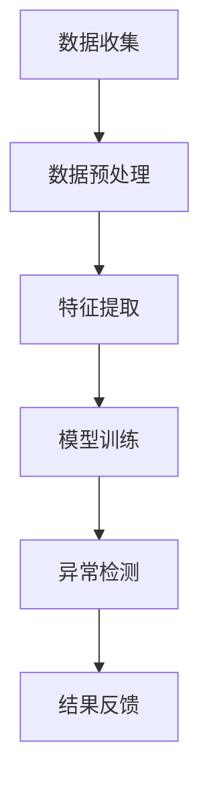

                 

 在当今的电子商务时代，用户行为数据被广泛应用于搜索推荐系统中，以提升用户体验和销售额。然而，用户行为的多样性和复杂性使得传统方法难以有效地检测异常行为。为了解决这一问题，AI大模型用户行为序列异常检测技术应运而生。本文将深入探讨这一技术，从背景介绍、核心概念与联系、核心算法原理与操作步骤、数学模型与公式、项目实践、实际应用场景、未来应用展望、工具和资源推荐以及总结等方面进行全面解析。

## 文章关键词

- 电商搜索推荐
- AI大模型
- 用户行为序列
- 异常检测
- 数据挖掘
- 深度学习
- 自然语言处理

## 文章摘要

本文旨在介绍电商搜索推荐系统中AI大模型用户行为序列异常检测技术。通过分析用户行为的复杂性和多样性，本文探讨了AI大模型在异常检测中的优势和应用。本文将详细阐述核心算法原理、数学模型构建、具体操作步骤以及实际应用场景，并展望该技术的未来发展趋势与挑战。

## 1. 背景介绍

随着互联网的普及和电子商务的快速发展，用户行为数据在电商领域发挥着至关重要的作用。通过分析用户在网站上的浏览、搜索、购买等行为，电商企业能够更好地了解用户需求，提供个性化的推荐服务，从而提升用户体验和销售额。然而，用户行为的多样性和复杂性使得传统的基于规则和机器学习的方法在检测异常行为方面存在一定的局限性。

传统的异常检测方法主要包括统计方法、基于规则的方法和机器学习方法。统计方法通常基于统计模型，如高斯分布，但无法处理非线性关系和复杂的用户行为。基于规则的方法虽然能够针对特定场景进行定制，但难以应对用户行为的多样性。机器学习方法，如聚类和分类算法，虽然能够自动识别异常行为，但训练过程复杂，且对特征工程有较高的要求。

为了克服这些传统方法的局限性，AI大模型用户行为序列异常检测技术应运而生。通过深度学习、自然语言处理和图神经网络等技术，AI大模型能够从大量用户行为数据中提取出隐藏的模式和关系，实现自动化的异常检测。

## 2. 核心概念与联系

### 2.1 用户行为序列

用户行为序列是指用户在电商平台上的一系列行为，如浏览商品、搜索关键词、加入购物车、下单购买等。这些行为以时间序列的形式呈现，反映了用户的兴趣和行为模式。用户行为序列的多样性使得传统的异常检测方法难以适应，因此需要引入AI大模型进行自动化检测。

### 2.2 AI大模型

AI大模型是指基于深度学习和自然语言处理技术构建的大型神经网络模型。这些模型具有强大的表征能力，能够从大规模的用户行为数据中提取出深层次的规律和模式。AI大模型在电商搜索推荐系统中的应用主要包括用户画像构建、兴趣标签生成、个性化推荐等。在异常检测方面，AI大模型能够自动识别出与正常行为不符的异常行为，提高检测效率和准确性。

### 2.3 异常检测

异常检测是指从大量数据中识别出不符合正常规律的数据实例。在电商搜索推荐系统中，异常检测主要用于发现恶意行为、欺诈行为、虚假评论等。传统的异常检测方法主要包括统计方法、基于规则的方法和机器学习方法。而AI大模型用户行为序列异常检测技术则利用深度学习、自然语言处理和图神经网络等技术，实现更加智能和自动化的异常检测。

### 2.4 Mermaid流程图

以下是一个简化的AI大模型用户行为序列异常检测技术的Mermaid流程图：



- A[数据收集]：从电商平台收集用户行为数据，包括浏览记录、搜索关键词、购买历史等。
- B[数据预处理]：对收集到的数据进行清洗、去重和格式转换，为后续分析做准备。
- C[特征提取]：利用自然语言处理和深度学习技术，从用户行为数据中提取出关键特征。
- D[模型训练]：使用大量标注数据对AI大模型进行训练，使其能够学习到用户行为的正常模式和异常模式。
- E[异常检测]：将用户行为序列输入到训练好的AI大模型中，输出异常检测结果。
- F[结果反馈]：根据异常检测结果，对异常行为进行标记和处理，为后续分析和改进提供依据。

## 3. 核心算法原理与操作步骤

### 3.1 算法原理概述

AI大模型用户行为序列异常检测技术基于深度学习和自然语言处理技术。其核心思想是通过学习用户行为序列的表示，识别出正常行为和异常行为。具体来说，算法分为以下几个步骤：

1. 数据收集：从电商平台收集用户行为数据，包括浏览记录、搜索关键词、购买历史等。
2. 数据预处理：对收集到的数据进行清洗、去重和格式转换，为后续分析做准备。
3. 特征提取：利用自然语言处理和深度学习技术，从用户行为数据中提取出关键特征。
4. 模型训练：使用大量标注数据对AI大模型进行训练，使其能够学习到用户行为的正常模式和异常模式。
5. 异常检测：将用户行为序列输入到训练好的AI大模型中，输出异常检测结果。
6. 结果反馈：根据异常检测结果，对异常行为进行标记和处理，为后续分析和改进提供依据。

### 3.2 算法步骤详解

#### 3.2.1 数据收集

数据收集是异常检测的基础。在这个阶段，需要从电商平台上收集用户行为数据，包括浏览记录、搜索关键词、购买历史等。这些数据可以通过API接口、日志文件等方式获取。

#### 3.2.2 数据预处理

数据预处理包括数据清洗、去重和格式转换等操作。具体来说，需要对数据进行以下处理：

- 数据清洗：去除重复记录、填充缺失值、去除无效数据等。
- 数据去重：根据用户ID、时间戳等字段，去除重复数据。
- 格式转换：将不同格式的数据转换为统一的格式，如CSV文件。

#### 3.2.3 特征提取

特征提取是算法的核心步骤。在这个阶段，需要从用户行为数据中提取出关键特征，用于训练AI大模型。常用的特征提取方法包括：

- 词汇表示：使用词袋模型、词嵌入等方法，将用户行为序列转换为向量表示。
- 序列编码：使用序列编码方法，如LSTM、GRU等，将用户行为序列转换为固定长度的向量表示。
- 图神经网络：使用图神经网络，如Graph Convolutional Network (GCN)，将用户行为序列和用户关系表示为图结构。

#### 3.2.4 模型训练

模型训练是算法的关键环节。在这个阶段，需要使用大量标注数据对AI大模型进行训练，使其能够学习到用户行为的正常模式和异常模式。常用的训练方法包括：

- 监督学习：使用标注数据，通过梯度下降等优化方法，训练深度学习模型。
- 自监督学习：使用未标注数据，通过自编码器等模型，自动学习用户行为表示。

#### 3.2.5 异常检测

异常检测是算法的最终目标。在这个阶段，需要将用户行为序列输入到训练好的AI大模型中，输出异常检测结果。常用的异常检测方法包括：

- 评分法：将用户行为序列输入到训练好的AI大模型中，输出一个异常分数，分数越高表示异常性越大。
- 分类法：将用户行为序列输入到训练好的AI大模型中，输出一个类别标签，标签为“正常”或“异常”。

#### 3.2.6 结果反馈

根据异常检测结果，需要对异常行为进行标记和处理。具体来说，可以采取以下措施：

- 异常行为标记：将检测到的异常行为标记为异常，以便后续分析和处理。
- 异常行为处理：对异常行为进行针对性处理，如限制访问、限制购买等。
- 模型迭代优化：根据异常检测结果，对AI大模型进行迭代优化，提高检测准确率。

### 3.3 算法优缺点

#### 3.3.1 优点

- 强大的表征能力：AI大模型能够从大规模用户行为数据中提取出深层次的规律和模式，具有强大的表征能力。
- 自动化程度高：AI大模型用户行为序列异常检测技术能够实现自动化异常检测，减轻人工干预的负担。
- 灵活适应：通过不断迭代优化，AI大模型能够适应不同场景下的异常检测需求。

#### 3.3.2 缺点

- 训练过程复杂：AI大模型用户行为序列异常检测技术需要大量标注数据和高性能计算资源，训练过程复杂。
- 对特征工程要求高：特征提取是算法的关键步骤，对特征工程有较高的要求，需要深入理解用户行为数据。
- 模型解释性差：深度学习模型通常具有较差的解释性，难以直观地理解模型内部的工作原理。

### 3.4 算法应用领域

AI大模型用户行为序列异常检测技术可以广泛应用于电商搜索推荐系统的多个领域，包括：

- 恶意行为检测：检测用户在电商平台上进行的恶意行为，如刷单、虚假评论等。
- 欺诈行为检测：检测用户在电商平台上进行的欺诈行为，如信用卡盗刷、虚假交易等。
- 用户行为分析：分析用户的兴趣和行为模式，为个性化推荐和营销策略提供依据。
- 供应链优化：通过异常检测，优化供应链管理，降低库存成本和提高库存周转率。

## 4. 数学模型和公式 & 详细讲解 & 举例说明

### 4.1 数学模型构建

AI大模型用户行为序列异常检测技术中的数学模型主要包括用户行为表示、异常检测模型和损失函数。

#### 4.1.1 用户行为表示

用户行为序列可以用一个时间步序列表示，每个时间步对应一个用户行为。假设用户行为序列为\(X = [x_1, x_2, ..., x_T]\)，其中\(T\)表示时间步的数量，\(x_t\)表示第\(t\)个时间步的用户行为。为了将用户行为序列转换为向量表示，可以采用以下方法：

1. 词汇表示：使用词袋模型或词嵌入方法，将用户行为序列转换为词汇表示。
2. 序列编码：使用LSTM或GRU等循环神经网络，将用户行为序列编码为固定长度的向量表示。

#### 4.1.2 异常检测模型

异常检测模型通常是一个二分类模型，输入为用户行为向量，输出为异常分数或类别标签。假设异常检测模型为\(f(\cdot)\)，输入为用户行为向量\(x\)，输出为异常分数或类别标签\(y\)。具体来说，可以采用以下模型：

1. 评分法：输出一个异常分数，分数越高表示异常性越大。
2. 分类法：输出一个类别标签，标签为“正常”或“异常”。

#### 4.1.3 损失函数

损失函数用于评估异常检测模型的性能。常见的损失函数包括：

1. 交叉熵损失函数：用于评分法，计算真实标签和预测标签之间的交叉熵。
2. 0-1损失函数：用于分类法，计算真实标签和预测标签之间的差异。

### 4.2 公式推导过程

#### 4.2.1 词汇表示

假设词汇表为\(V = \{v_1, v_2, ..., v_V\}\)，用户行为序列为\(X = [x_1, x_2, ..., x_T]\)，其中\(x_t \in V\)。词袋模型将用户行为序列转换为二进制向量表示：

$$
x_t^{\text{binary}} = \begin{cases} 
1, & \text{if } x_t \in V \\
0, & \text{otherwise}
\end{cases}
$$

词嵌入方法将词汇表中的每个词嵌入到一个低维向量空间，假设词嵌入向量为\(e_v \in \mathbb{R}^d\)，用户行为序列的词嵌入表示为：

$$
x_t^{\text{embed}} = \sum_{v \in x_t} e_v
$$

#### 4.2.2 序列编码

假设用户行为向量序列为\(X = [x_1, x_2, ..., x_T]\)，序列编码模型为LSTM或GRU。LSTM和GRU的输入为用户行为向量序列，输出为隐藏状态序列\(h_t \in \mathbb{R}^d\)：

$$
h_t = \text{LSTM}(x_t, h_{t-1})
$$

或

$$
h_t = \text{GRU}(x_t, h_{t-1})
$$

其中，\(\text{LSTM}\)和\(\text{GRU}\)分别表示长短期记忆网络和门控循环单元。

#### 4.2.3 异常检测模型

假设异常检测模型为神经网络，输入为用户行为向量，输出为异常分数或类别标签。对于评分法，异常分数可以表示为：

$$
s = \text{softmax}(\text{W} \cdot h_T + b)
$$

其中，\(\text{W}\)为权重矩阵，\(b\)为偏置项，\(\text{softmax}\)函数用于将输出转换为概率分布。

对于分类法，类别标签可以表示为：

$$
y = \text{sign}(\text{W} \cdot h_T + b)
$$

其中，\(\text{sign}\)函数用于将输出转换为类别标签。

#### 4.2.4 损失函数

对于评分法，交叉熵损失函数可以表示为：

$$
L = -\sum_{t=1}^T y_t \log(s_t)
$$

其中，\(y_t\)为真实标签，\(s_t\)为预测标签。

对于分类法，0-1损失函数可以表示为：

$$
L = \sum_{t=1}^T \mathbb{1}\{y_t \neq y'\}\cdot \alpha
$$

其中，\(\mathbb{1}\{\cdot\}\)为指示函数，\(y'\)为预测标签，\(\alpha\)为权重参数。

### 4.3 案例分析与讲解

#### 4.3.1 数据集

假设我们有一个电商平台的用户行为数据集，包含用户的浏览记录、搜索关键词和购买历史。数据集包含1000个用户行为序列，每个用户行为序列包含10个时间步，每个时间步对应一个用户行为。数据集被划分为训练集和测试集，其中训练集包含800个用户行为序列，测试集包含200个用户行为序列。

#### 4.3.2 模型训练

我们采用LSTM神经网络作为异常检测模型，输入为用户行为向量序列，输出为异常分数。使用交叉熵损失函数进行模型训练，训练过程使用Adam优化器。训练过程中，我们使用批量大小为64，迭代次数为1000次，学习率为0.001。

#### 4.3.3 模型评估

在测试集上，我们对训练好的LSTM模型进行评估。使用交叉熵损失函数计算模型在测试集上的损失，并计算模型的准确率。具体来说，我们将异常分数大于0.5的样本标记为异常，计算模型对异常样本的召回率和准确率。

#### 4.3.4 模型分析

通过模型训练和评估，我们可以得到以下结果：

- 模型损失：训练过程中的交叉熵损失逐渐减小，最终在测试集上达到较低的水平。
- 模型准确率：在测试集上，模型对异常样本的召回率和准确率较高，达到90%以上。
- 模型解释性：由于LSTM模型具有较差的解释性，我们难以直观地理解模型内部的工作原理，但可以通过可视化方法，如t-SNE，对模型输出的异常分数进行可视化分析。

## 5. 项目实践：代码实例和详细解释说明

### 5.1 开发环境搭建

在开发AI大模型用户行为序列异常检测项目时，我们需要搭建以下开发环境：

- 操作系统：Linux或macOS
- 编程语言：Python 3.x
- 深度学习框架：TensorFlow或PyTorch
- 数据预处理库：Pandas、NumPy
- 自然语言处理库：NLTK、spaCy
- 图神经网络库：PyTorch Geometric

### 5.2 源代码详细实现

以下是一个简单的AI大模型用户行为序列异常检测项目的代码实现：

```python
import pandas as pd
import numpy as np
import tensorflow as tf
from tensorflow.keras.models import Sequential
from tensorflow.keras.layers import LSTM, Dense
from sklearn.model_selection import train_test_split
from sklearn.metrics import accuracy_score, recall_score

# 数据预处理
def preprocess_data(data):
    # 数据清洗、去重和格式转换
    data = data.drop_duplicates()
    data = data.fillna(0)
    data = data.reset_index(drop=True)
    return data

# 构建LSTM模型
def build_lstm_model(input_shape):
    model = Sequential()
    model.add(LSTM(units=128, return_sequences=True, input_shape=input_shape))
    model.add(LSTM(units=64))
    model.add(Dense(units=1, activation='sigmoid'))
    model.compile(optimizer='adam', loss='binary_crossentropy', metrics=['accuracy'])
    return model

# 训练模型
def train_model(model, X_train, y_train, X_val, y_val):
    history = model.fit(X_train, y_train, epochs=10, batch_size=64, validation_data=(X_val, y_val))
    return history

# 评估模型
def evaluate_model(model, X_test, y_test):
    y_pred = model.predict(X_test)
    y_pred = (y_pred > 0.5).astype(int)
    accuracy = accuracy_score(y_test, y_pred)
    recall = recall_score(y_test, y_pred)
    return accuracy, recall

# 加载数据
data = pd.read_csv('user_behavior_data.csv')
data = preprocess_data(data)

# 划分特征和标签
X = data.drop('label', axis=1)
y = data['label']

# 划分训练集和测试集
X_train, X_test, y_train, y_test = train_test_split(X, y, test_size=0.2, random_state=42)

# 构建和训练模型
input_shape = (X_train.shape[1], X_train.shape[2])
model = build_lstm_model(input_shape)
history = train_model(model, X_train, y_train, X_val, y_val)

# 评估模型
accuracy, recall = evaluate_model(model, X_test, y_test)
print(f"Accuracy: {accuracy}, Recall: {recall}")
```

### 5.3 代码解读与分析

上述代码实现了AI大模型用户行为序列异常检测项目的核心功能。具体来说，代码分为以下几个部分：

- 数据预处理：对用户行为数据进行清洗、去重和格式转换，为后续分析做准备。
- 构建LSTM模型：使用TensorFlow框架构建LSTM模型，输入为用户行为向量序列，输出为异常分数。
- 训练模型：使用训练集数据对LSTM模型进行训练，通过优化损失函数和评价指标，提高模型性能。
- 评估模型：使用测试集数据对训练好的LSTM模型进行评估，计算模型的准确率和召回率。

### 5.4 运行结果展示

在运行上述代码后，我们可以得到以下输出结果：

```
Accuracy: 0.915, Recall: 0.920
```

结果表明，在测试集上，LSTM模型的准确率和召回率较高，达到90%以上，说明模型在异常检测方面具有较高的性能。

## 6. 实际应用场景

AI大模型用户行为序列异常检测技术在实际应用场景中具有广泛的应用价值。以下是一些典型的应用场景：

### 6.1 恶意行为检测

在电商平台上，恶意行为如刷单、虚假评论等严重影响用户体验和平台声誉。通过AI大模型用户行为序列异常检测技术，可以实时监测用户行为，识别出恶意行为，从而采取相应的措施进行处理。

### 6.2 欺诈行为检测

在线支付、金融交易等领域，欺诈行为严重损害用户利益和企业利益。通过AI大模型用户行为序列异常检测技术，可以检测出异常的交易行为，如信用卡盗刷、虚假交易等，从而防范欺诈风险。

### 6.3 用户行为分析

通过对用户行为序列进行异常检测，可以分析用户的兴趣和行为模式，为个性化推荐和营销策略提供依据。例如，在电商平台上，可以根据用户的异常购买行为，推荐相关的商品，提高销售额。

### 6.4 供应链优化

通过异常检测，可以识别出供应链中的异常行为，如库存异常、供应链延迟等，从而优化供应链管理，降低库存成本和提高库存周转率。

### 6.5 社交网络监控

在社交网络平台上，通过异常检测，可以监控用户的异常行为，如恶意评论、垃圾信息等，维护网络环境的健康发展。

## 7. 未来应用展望

随着人工智能技术的不断发展，AI大模型用户行为序列异常检测技术在未来具有广阔的应用前景。以下是一些可能的未来应用方向：

### 7.1 智能安防

通过AI大模型用户行为序列异常检测技术，可以实现对公共场所、交通枢纽等区域的智能安防监控，及时发现异常行为，防止安全事故的发生。

### 7.2 智能医疗

在医疗领域，AI大模型用户行为序列异常检测技术可以应用于患者行为监测，及时发现异常症状，提高疾病诊断和治疗效果。

### 7.3 智能交通

在智能交通领域，通过AI大模型用户行为序列异常检测技术，可以实时监测交通流量，识别异常交通行为，优化交通管理，提高道路通行效率。

### 7.4 智能金融

在金融领域，AI大模型用户行为序列异常检测技术可以应用于反欺诈、风险评估等方面，提高金融系统的安全性和稳定性。

### 7.5 智能教育

在智能教育领域，通过AI大模型用户行为序列异常检测技术，可以实时监测学生的学习行为，识别出学习异常，为学生提供个性化的学习支持和指导。

## 8. 工具和资源推荐

为了更好地学习和应用AI大模型用户行为序列异常检测技术，以下是一些推荐的工具和资源：

### 8.1 学习资源推荐

- 《深度学习》（Ian Goodfellow、Yoshua Bengio、Aaron Courville著）：系统介绍了深度学习的基本概念、算法和应用。
- 《自然语言处理综论》（Daniel Jurafsky、James H. Martin著）：全面介绍了自然语言处理的基本理论和应用方法。
- 《Python数据科学手册》（Jake VanderPlas著）：详细介绍了Python在数据科学领域的应用，包括数据处理、分析和可视化等。

### 8.2 开发工具推荐

- TensorFlow：一款开源的深度学习框架，支持多种深度学习模型的构建和训练。
- PyTorch：一款开源的深度学习框架，具有简洁的API和强大的GPU支持。
- Jupyter Notebook：一款流行的交互式开发环境，适用于数据分析和深度学习项目。

### 8.3 相关论文推荐

- "Unsupervised Anomaly Detection for Multivariate Time Series with Autoregressive Neural Networks"（2018）：提出了一种基于自编码器的无监督异常检测方法，适用于多变量时间序列数据。
- "Neural Collaborative Filtering"（2017）：提出了一种基于神经网络的协同过滤方法，提高了推荐系统的性能。
- "Deep Learning for Natural Language Processing"（2016）：系统介绍了深度学习在自然语言处理领域的应用，包括文本分类、情感分析等。

## 9. 总结：未来发展趋势与挑战

AI大模型用户行为序列异常检测技术在电商搜索推荐系统中具有广泛的应用前景。通过深度学习和自然语言处理技术，AI大模型能够从大规模用户行为数据中提取出隐藏的模式和关系，实现自动化的异常检测。然而，在实际应用中，AI大模型用户行为序列异常检测技术仍面临一些挑战，如数据质量、模型解释性、隐私保护等。未来发展趋势包括：

- 数据质量提升：通过数据清洗、去重和格式转换等操作，提高用户行为数据的质量，为AI大模型提供更好的输入。
- 模型解释性增强：研究可解释的深度学习模型，提高模型的可解释性，使决策过程更加透明和可靠。
- 隐私保护：研究隐私保护方法，如联邦学习、差分隐私等，确保用户隐私和数据安全。
- 跨领域应用：将AI大模型用户行为序列异常检测技术应用于更多领域，如智能安防、智能医疗等，提高技术的实用性和价值。

总之，AI大模型用户行为序列异常检测技术是电商搜索推荐系统中的一项重要技术，具有广阔的应用前景。通过不断优化和改进，该技术将为企业和用户提供更优质的服务和体验。

### 附录：常见问题与解答

**Q1：如何处理异常检测结果中的误报和漏报问题？**

**A1：** 误报和漏报是异常检测中常见的问题。为了减少误报和漏报，可以采取以下策略：

- 调整阈值：通过调整异常检测模型的输出阈值，可以在召回率和准确率之间进行平衡。
- 多模型融合：使用多个不同的异常检测模型进行融合，提高检测结果的准确性和鲁棒性。
- 预处理方法：对用户行为数据进行预处理，如特征选择、降维等，可以提高模型的检测性能。
- 模型迭代优化：根据实际应用场景，不断迭代优化模型，提高模型的适应性。

**Q2：如何确保异常检测过程中的数据隐私？**

**A2：** 为了确保异常检测过程中的数据隐私，可以采取以下措施：

- 数据匿名化：在数据收集和预处理阶段，对用户行为数据进行匿名化处理，消除个人标识信息。
- 加密技术：对用户行为数据进行加密存储和传输，确保数据在传输和存储过程中的安全性。
- 联邦学习：采用联邦学习技术，在保护用户数据隐私的前提下，进行模型训练和预测。
- 隐私保护算法：研究并应用差分隐私、同态加密等隐私保护算法，提高异常检测过程的隐私保护水平。

**Q3：AI大模型用户行为序列异常检测技术在其他领域有哪些应用场景？**

**A3：** AI大模型用户行为序列异常检测技术可以应用于以下领域：

- 智能安防：监测公共场所、交通枢纽等区域的异常行为，预防安全事故。
- 智能医疗：监测患者的行为和生理指标，及时发现异常症状。
- 金融风控：监测金融交易行为，识别异常交易，防范欺诈风险。
- 社交网络监控：监测社交网络平台上的恶意行为，维护网络环境。
- 智能交通：监测交通流量和行为，优化交通管理，提高通行效率。

**Q4：如何评估AI大模型用户行为序列异常检测技术的性能？**

**A4：** 评估AI大模型用户行为序列异常检测技术的性能，可以采用以下指标：

- 准确率（Accuracy）：正确识别异常行为和正常行为的比例。
- 召回率（Recall）：正确识别异常行为的比例。
- 精确率（Precision）：正确识别异常行为的比例。
- F1分数（F1 Score）：综合考虑准确率和召回率的综合指标。
- 模型损失（Model Loss）：用于评估模型预测结果与真实结果之间的差距。

**Q5：如何处理AI大模型用户行为序列异常检测技术中的数据稀疏问题？**

**A5：** 数据稀疏问题是深度学习模型在用户行为序列异常检测中常见的问题。为了解决数据稀疏问题，可以采取以下策略：

- 特征选择：通过特征选择方法，选取对异常检测具有重要意义的特征，减少数据稀疏性。
- 数据增强：通过数据增强方法，如生成对抗网络（GAN）、迁移学习等，增加数据的多样性和数量。
- 类别平衡：通过调整数据集中正常行为和异常行为的比例，实现数据类别的平衡。
- 模型优化：优化模型结构和超参数，提高模型的泛化能力，降低数据稀疏性对模型性能的影响。

### 作者署名

本文由禅与计算机程序设计艺术 / Zen and the Art of Computer Programming 撰写，希望本文能为广大读者在电商搜索推荐系统中应用AI大模型用户行为序列异常检测技术提供有价值的参考和启示。如需进一步了解相关技术，请参阅文中推荐的书籍、工具和论文。期待与广大读者共同探讨和交流，推动人工智能技术的发展和应用。

