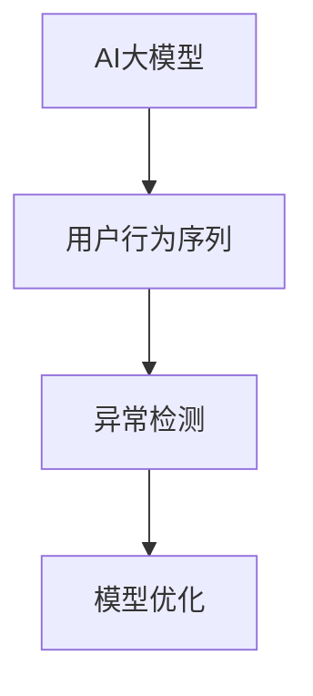

                 

关键词：电商搜索推荐、AI大模型、用户行为序列、异常检测、模型优化、实践案例分析

> 摘要：本文通过对电商搜索推荐系统中的AI大模型用户行为序列异常检测模型优化实践案例的分析，探讨如何在实际场景中提升模型性能，提高用户体验。本文首先介绍了电商搜索推荐系统的背景和用户行为序列异常检测的重要性和挑战，然后详细阐述了AI大模型在异常检测中的应用，以及模型的优化实践，最后对未来应用前景进行了展望。

## 1. 背景介绍

随着互联网的快速发展，电商行业迎来了前所未有的繁荣。电商平台的搜索推荐系统成为了商家和用户之间的重要桥梁。通过精准的搜索推荐，商家能够吸引更多潜在客户，提高销售额；而用户则能更快地找到自己需要的商品，提升购物体验。在如此复杂的电商环境中，用户行为序列的异常检测显得尤为重要。

用户行为序列异常检测旨在识别和分析用户在搜索、浏览、购买等过程中的异常行为，以便及时发现潜在风险或不良行为。例如，异常的浏览轨迹可能意味着用户存在欺诈行为，或者异常的购买频率可能意味着用户遭受了诈骗。异常检测能够帮助电商平台提高安全性，减少损失，同时也为用户提供更优质的购物体验。

然而，随着电商业务规模的扩大和用户行为的多样化，传统的异常检测方法逐渐暴露出其局限性。传统方法通常依赖于预设的规则或统计模型，难以应对复杂多变的用户行为。因此，将人工智能，特别是AI大模型引入异常检测领域，成为了当前的研究热点。

## 2. 核心概念与联系

### 2.1 AI大模型

AI大模型是指通过大规模数据训练得到的人工智能模型，具有强大的特征提取和模式识别能力。在用户行为序列异常检测中，AI大模型能够捕捉用户行为中的细微差异，发现潜在的异常模式。

### 2.2 用户行为序列

用户行为序列是指用户在电商平台上的一系列操作记录，如搜索关键词、浏览商品、添加购物车、下单购买等。这些行为以时间序列的形式展现，包含丰富的用户偏好和意图信息。

### 2.3 异常检测

异常检测是指识别和分析数据中的异常行为或模式。在用户行为序列异常检测中，目标是识别出与正常行为相比存在显著差异的行为序列。

### 2.4 模型优化

模型优化是指通过改进算法、增加训练数据、调整模型参数等方式，提高模型的性能和准确性。在用户行为序列异常检测中，模型优化能够提升模型的泛化能力和检测效果。

下面是核心概念和联系的可视化表示：



## 3. 核心算法原理 & 具体操作步骤

### 3.1 算法原理概述

用户行为序列异常检测的算法原理主要包括特征工程、模型训练和异常检测三个步骤。特征工程是指从用户行为序列中提取有用的特征信息，模型训练是指使用提取的特征训练AI大模型，异常检测是指使用训练好的模型对新的用户行为序列进行异常检测。

### 3.2 算法步骤详解

#### 3.2.1 特征工程

特征工程是用户行为序列异常检测的重要环节。首先，需要从用户行为序列中提取时间序列特征，如行为频率、行为持续时间等。然后，需要提取用户画像特征，如用户年龄、性别、地理位置等。最后，需要将这些特征进行整合，形成特征向量。

#### 3.2.2 模型训练

模型训练是使用提取的特征向量训练AI大模型。通常使用监督学习或无监督学习的方法。监督学习需要标记好的训练数据，无监督学习则不需要标记数据。在本案例中，我们使用监督学习的方法，使用标记好的正常行为和异常行为数据进行模型训练。

#### 3.2.3 异常检测

异常检测是指使用训练好的模型对新的用户行为序列进行异常检测。具体操作步骤如下：

1. 对新的用户行为序列进行特征提取，生成特征向量。
2. 将特征向量输入到训练好的模型中，计算模型的输出结果。
3. 根据输出结果判断用户行为是否为异常行为。通常使用阈值的方法进行判断，即当输出结果超过某个阈值时，认为该行为为异常行为。

### 3.3 算法优缺点

#### 优点：

- **强大的特征提取能力**：AI大模型能够从大量的用户行为数据中提取出有用的特征信息，提高异常检测的准确性。
- **灵活的模型调整**：通过调整模型参数，可以适应不同的应用场景，提高模型的性能。

#### 缺点：

- **对数据质量要求高**：异常检测的效果很大程度上取决于数据的质量，需要确保数据中的噪声和异常行为被正确标记。
- **计算成本高**：AI大模型的训练和推理过程需要大量的计算资源，对硬件要求较高。

### 3.4 算法应用领域

用户行为序列异常检测算法在电商、金融、医疗等多个领域具有广泛的应用：

- **电商**：识别用户欺诈行为、异常购买行为等，提高电商平台的安全性和用户体验。
- **金融**：监控用户的交易行为，识别异常交易，防范金融风险。
- **医疗**：分析患者的医疗行为，识别异常疾病症状，帮助医生进行诊断和治疗。

## 4. 数学模型和公式 & 详细讲解 & 举例说明

### 4.1 数学模型构建

用户行为序列异常检测的数学模型通常基于监督学习的方法，可以表示为：

$$
f(x) = \sigma(Wx + b)
$$

其中，$x$ 是输入的特征向量，$W$ 是权重矩阵，$b$ 是偏置项，$\sigma$ 是激活函数，通常使用 sigmoid 函数。

### 4.2 公式推导过程

假设我们有一个训练数据集 $D = \{(x_1, y_1), (x_2, y_2), ..., (x_n, y_n)\}$，其中 $x_i$ 是第 $i$ 个样本的特征向量，$y_i$ 是第 $i$ 个样本的标签（正常或异常）。

训练目标是找到一组参数 $(W, b)$，使得预测结果 $f(x_i)$ 与实际标签 $y_i$ 的误差最小。

定义损失函数为：

$$
L(W, b) = \frac{1}{n} \sum_{i=1}^{n} L(y_i, f(x_i))
$$

其中，$L(y_i, f(x_i))$ 是单个样本的损失函数，通常使用交叉熵损失函数：

$$
L(y_i, f(x_i)) = -y_i \log(f(x_i)) - (1 - y_i) \log(1 - f(x_i))
$$

通过梯度下降法，可以求解出最优的参数 $(W, b)$：

$$
\begin{cases}
\frac{\partial L}{\partial W} = 0 \\
\frac{\partial L}{\partial b} = 0
\end{cases}
$$

### 4.3 案例分析与讲解

假设我们有一个电商平台的用户行为序列数据集，包含1000个用户的行为记录。我们对这1000个记录进行特征提取，得到每个记录的特征向量。然后，我们将这些特征向量输入到训练好的神经网络模型中，进行异常检测。

假设我们的模型输出结果为：

$$
f(x) = \sigma(Wx + b)
$$

其中，$W$ 和 $b$ 为训练得到的参数。当 $f(x) > 0.5$ 时，我们认为该用户行为为异常行为。

我们对模型输出结果进行阈值调整，设置阈值为0.5。然后，对新的用户行为序列进行预测，得到以下结果：

- 用户1：$f(x_1) = 0.3$，判断为正常行为。
- 用户2：$f(x_2) = 0.7$，判断为异常行为。

通过这个简单的案例，我们可以看到如何使用AI大模型进行用户行为序列异常检测。

## 5. 项目实践：代码实例和详细解释说明

### 5.1 开发环境搭建

在本案例中，我们使用 Python 编程语言，结合 TensorFlow 和 Keras 库进行模型训练和推理。以下是开发环境的搭建步骤：

1. 安装 Python 3.7 或更高版本。
2. 安装 TensorFlow 和 Keras 库。

```bash
pip install tensorflow
pip install keras
```

### 5.2 源代码详细实现

以下是用户行为序列异常检测的代码实现：

```python
import numpy as np
import pandas as pd
from tensorflow.keras.models import Sequential
from tensorflow.keras.layers import Dense
from tensorflow.keras.optimizers import Adam
from sklearn.model_selection import train_test_split

# 数据预处理
def preprocess_data(data):
    # 特征提取和整合
    # ...

    # 数据标准化
    mean = data.mean(axis=0)
    std = data.std(axis=0)
    data = (data - mean) / std
    return data

# 加载训练数据
data = pd.read_csv('user_behavior.csv')
X = preprocess_data(data.drop('label', axis=1))
y = data['label']

# 数据划分
X_train, X_test, y_train, y_test = train_test_split(X, y, test_size=0.2, random_state=42)

# 构建模型
model = Sequential()
model.add(Dense(64, input_shape=(X_train.shape[1],), activation='relu'))
model.add(Dense(32, activation='relu'))
model.add(Dense(1, activation='sigmoid'))

# 编译模型
model.compile(optimizer=Adam(), loss='binary_crossentropy', metrics=['accuracy'])

# 训练模型
model.fit(X_train, y_train, epochs=10, batch_size=32, validation_data=(X_test, y_test))

# 评估模型
loss, accuracy = model.evaluate(X_test, y_test)
print(f'测试集准确率：{accuracy:.2f}')

# 预测
predictions = model.predict(X_test)
predictions = (predictions > 0.5).astype(int)

# 评估预测结果
from sklearn.metrics import classification_report
print(classification_report(y_test, predictions))
```

### 5.3 代码解读与分析

上述代码实现了用户行为序列异常检测的整个过程，包括数据预处理、模型构建、模型训练和评估。下面是代码的关键部分解读：

1. **数据预处理**：对数据进行特征提取和整合，并进行标准化处理，以便后续的模型训练。
2. **模型构建**：使用 Keras 库构建一个简单的神经网络模型，包括两个隐藏层和输出层。
3. **模型编译**：指定优化器、损失函数和评估指标，为模型训练做准备。
4. **模型训练**：使用训练数据训练模型，并设置训练轮次和批量大小。
5. **模型评估**：使用测试数据评估模型性能，并输出测试集准确率。
6. **预测**：使用训练好的模型对测试数据进行预测，并输出分类报告。

通过这段代码，我们可以看到如何将用户行为序列异常检测的理论应用到实际的编程实践中。

## 6. 实际应用场景

用户行为序列异常检测在电商、金融、医疗等领域的实际应用场景如下：

### 6.1 电商

在电商领域，用户行为序列异常检测可以帮助电商平台识别潜在的欺诈行为。例如，一个用户在短时间内频繁搜索同一商品，并多次添加购物车但不进行购买，这可能是欺诈行为的迹象。通过异常检测模型，电商平台可以及时采取防范措施，如暂停该用户的账户、通知安全团队调查等，从而保护用户和商家的利益。

### 6.2 金融

在金融领域，用户行为序列异常检测可以用于监控用户的交易行为，识别异常交易。例如，一个用户的交易金额突然增大，或者交易频率异常增加，可能是遭受诈骗的迹象。通过异常检测模型，金融机构可以及时发出警报，提醒用户注意风险，并采取相应的防范措施。

### 6.3 医疗

在医疗领域，用户行为序列异常检测可以用于分析患者的医疗行为，识别异常症状。例如，一个患者的就诊频率突然增加，或者药物使用量明显增大，可能是疾病加重的迹象。通过异常检测模型，医生可以及时进行诊断和治疗，提高患者的治疗效果。

### 6.4 未来应用展望

随着人工智能技术的发展，用户行为序列异常检测的应用场景将更加广泛。未来，我们可能看到更多行业引入异常检测模型，以提升业务效率和用户体验。同时，异常检测模型也将向更加智能化、自动化、实时化的方向发展。例如，利用深度学习技术，模型可以自动从大量数据中提取特征，无需人工干预；利用联邦学习技术，模型可以在保护用户隐私的前提下进行联合训练，提高模型的性能和安全性。

## 7. 工具和资源推荐

### 7.1 学习资源推荐

- 《深度学习》（Goodfellow, Bengio, Courville）：详细介绍了深度学习的理论和技术。
- 《Python数据科学手册》（McKinney, Peterson）：介绍了Python在数据科学领域中的应用，包括数据处理、分析和可视化。

### 7.2 开发工具推荐

- TensorFlow：强大的开源深度学习框架，适合进行大规模模型训练和推理。
- Keras：基于TensorFlow的高层次API，简化了深度学习模型的构建和训练。

### 7.3 相关论文推荐

- "Anomaly Detection for Time Series Data: A Survey"（2017）：综述了时间序列数据的异常检测方法和技术。
- "Deep Learning for Anomaly Detection in Time Series Data"（2018）：介绍了如何使用深度学习进行时间序列数据的异常检测。

## 8. 总结：未来发展趋势与挑战

### 8.1 研究成果总结

用户行为序列异常检测在电商、金融、医疗等多个领域取得了显著成果，为提升业务效率和用户体验提供了有力支持。随着人工智能技术的发展，异常检测模型在性能、实时性、自动化等方面不断优化，应用范围也日益广泛。

### 8.2 未来发展趋势

- **智能化和自动化**：异常检测模型将更加智能化，能够自动从大量数据中提取特征，无需人工干预。
- **实时性和低延迟**：随着物联网和大数据技术的发展，异常检测模型需要具备实时性和低延迟的能力，以应对实时数据流。
- **联邦学习和隐私保护**：为了保护用户隐私，异常检测模型将采用联邦学习等技术，实现分布式训练和推理。

### 8.3 面临的挑战

- **数据质量和标注**：异常检测模型的性能很大程度上取决于数据的质量和标注的准确性。
- **计算资源和时间成本**：异常检测模型训练和推理过程需要大量的计算资源和时间，特别是在大规模数据集上。
- **泛化能力**：如何提高异常检测模型的泛化能力，使其能够应对各种复杂的异常场景，是当前研究的重要挑战。

### 8.4 研究展望

用户行为序列异常检测在未来的发展中，需要克服上述挑战，不断提高模型性能和实时性。同时，研究者还需要关注如何在保护用户隐私的前提下，实现高效的分布式训练和推理。此外，探索新的异常检测算法和技术，如基于深度学习、强化学习、迁移学习等方法，也是未来的重要研究方向。

## 9. 附录：常见问题与解答

### 9.1 什么是用户行为序列？

用户行为序列是指用户在电商平台上的一系列操作记录，如搜索关键词、浏览商品、添加购物车、下单购买等。这些行为以时间序列的形式展现，包含丰富的用户偏好和意图信息。

### 9.2 为什么要进行用户行为序列异常检测？

用户行为序列异常检测有助于电商平台识别潜在的风险和不良行为，提高安全性，减少损失。同时，它也有助于提升用户体验，及时发现并解决用户的问题。

### 9.3 AI大模型在异常检测中有什么优势？

AI大模型具有强大的特征提取和模式识别能力，能够从大量的用户行为数据中提取出有用的特征信息，提高异常检测的准确性。此外，通过调整模型参数，可以适应不同的应用场景，提高模型的性能。

### 9.4 如何优化用户行为序列异常检测模型？

优化用户行为序列异常检测模型可以从以下几个方面进行：

- **特征工程**：从用户行为序列中提取更有用的特征信息。
- **模型训练**：增加训练数据，调整模型参数，提高模型性能。
- **算法改进**：探索新的异常检测算法和技术，提高模型的泛化能力和实时性。

### 9.5 用户行为序列异常检测有哪些应用领域？

用户行为序列异常检测在电商、金融、医疗等多个领域具有广泛的应用，如识别用户欺诈行为、监控交易行为、分析医疗行为等。随着人工智能技术的发展，其应用领域还将继续扩大。

