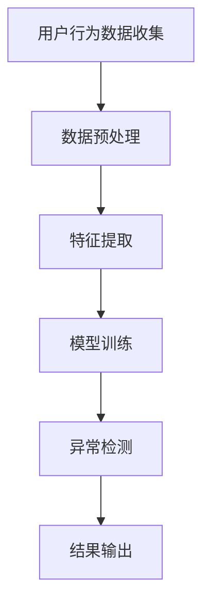

                 

关键词：电商搜索推荐、AI大模型、用户行为序列、异常检测、实践指南

> 摘要：本文将深入探讨电商搜索推荐系统中AI大模型在用户行为序列异常检测中的应用与实践。通过详细介绍算法原理、数学模型、项目实践以及未来发展趋势，为开发者提供一套完整的实践指南，以应对电商领域中的复杂挑战。

## 1. 背景介绍

在电子商务的迅速发展中，搜索推荐系统已经成为电商平台的核心竞争力之一。用户行为序列分析作为一种高级的数据分析方法，旨在通过分析用户的浏览、搜索、购买等行为，为用户提供个性化的商品推荐。然而，随着用户数据的不断增长和复杂性增加，如何有效地检测用户行为序列中的异常行为，成为了当前研究的热点问题。

AI大模型，特别是基于深度学习的模型，为解决这一问题提供了强有力的工具。这些模型能够自动学习用户行为的复杂模式，从而识别出潜在的异常行为。异常检测在电商搜索推荐系统中具有重要意义，它不仅可以提高用户满意度，还可以帮助平台识别潜在的安全风险和欺诈行为。

本文旨在为电商开发者和研究者提供一套AI大模型用户行为序列异常检测的实践指南，包括核心概念、算法原理、数学模型、项目实践、实际应用场景以及未来展望等。

## 2. 核心概念与联系

### 2.1. 用户行为序列

用户行为序列是指用户在电商平台上的一系列行为，如浏览、搜索、添加购物车、下单等。这些行为可以看作是一组时间序列数据，每个数据点代表了用户在某一时刻的具体行为。

### 2.2. 异常行为

异常行为是指用户行为序列中偏离正常模式的行为。这些行为可能是由用户的真实意图导致的，如突然的大量购买；也可能是欺诈行为，如刷单、恶意评价等。

### 2.3. AI大模型

AI大模型通常指的是具有大规模参数和强大学习能力的人工神经网络模型，如深度神经网络（DNN）、卷积神经网络（CNN）和循环神经网络（RNN）等。这些模型能够在大量数据中自动学习复杂的模式，并进行预测和分类。

### 2.4. 异常检测

异常检测是一种数据分析方法，旨在识别数据中的异常或偏离正常模式的部分。在电商搜索推荐系统中，异常检测用于识别异常用户行为序列。

### 2.5. Mermaid流程图

以下是一个简单的Mermaid流程图，展示了用户行为序列异常检测的基本流程：



## 3. 核心算法原理 & 具体操作步骤

### 3.1 算法原理概述

用户行为序列异常检测的核心算法通常基于深度学习模型，如长短期记忆网络（LSTM）和自编码器（Autoencoder）。这些模型能够自动学习用户行为序列的时空特征，并通过对比正常行为和异常行为的特征差异来实现异常检测。

### 3.2 算法步骤详解

1. **数据预处理**：收集用户行为数据，并进行清洗和格式化，以去除噪声和异常值。

2. **特征提取**：将用户行为序列转化为可用于模型训练的数字特征表示。常用的方法包括时间窗口特征提取和序列编码。

3. **模型训练**：使用预处理的用户行为数据训练深度学习模型，如LSTM或自编码器。训练过程中，模型会自动学习用户行为序列的时空特征。

4. **异常检测**：将新的用户行为序列输入训练好的模型，通过模型输出的特征向量判断其是否属于异常行为。

5. **结果输出**：将检测出的异常行为输出，并进行相应的处理，如提醒管理员、阻断恶意行为等。

### 3.3 算法优缺点

- **优点**：深度学习模型具有较强的学习和泛化能力，能够自动学习复杂的用户行为模式。
- **缺点**：训练过程复杂，需要大量的数据和计算资源。此外，模型对数据质量要求较高，数据预处理和特征提取过程复杂。

### 3.4 算法应用领域

异常检测算法在电商搜索推荐系统中具有广泛的应用，包括但不限于以下领域：

- **用户行为分析**：识别异常用户行为，如恶意评论、刷单等。
- **欺诈检测**：检测并阻止欺诈行为，提高平台安全性。
- **个性化推荐**：通过异常行为分析，为用户提供更个性化的商品推荐。
- **风险控制**：识别潜在的风险用户，提前采取预防措施。

## 4. 数学模型和公式 & 详细讲解 & 举例说明

### 4.1 数学模型构建

在用户行为序列异常检测中，常用的数学模型包括自编码器和LSTM网络。以下分别介绍这两种模型的数学基础。

### 4.2 公式推导过程

#### 自编码器（Autoencoder）

自编码器是一种无监督学习模型，用于学习输入数据的表示。其基本结构包括编码器和解码器。以下为自编码器的数学模型：

$$
\begin{aligned}
\text{编码器：} & \ \ x' = \text{encode}(x) \\
\text{解码器：} & \ \ x = \text{decode}(x')
\end{aligned}
$$

其中，\(x'\) 为编码后的特征向量，\(x\) 为解码后的特征向量。

#### LSTM网络

LSTM（Long Short-Term Memory）网络是一种特殊的循环神经网络，能够有效地学习长距离的时间依赖关系。其数学模型如下：

$$
\begin{aligned}
i_t &= \sigma(W_{ix}x_t + W_{ih}h_{t-1} + b_i) \\
f_t &= \sigma(W_{fx}x_t + W_{fh}h_{t-1} + b_f) \\
o_t &= \sigma(W_{ox}x_t + W_{oh}h_{t-1} + b_o) \\
g_t &= \tanh(W_{gx}x_t + W_{gh}h_{t-1} + b_g) \\
h_t &= o_t \odot \tanh(C_t) \\
C_t &= f_t \odot C_{t-1} + i_t \odot g_t
\end{aligned}
$$

其中，\(i_t\)、\(f_t\)、\(o_t\) 分别为输入门、遗忘门和输出门，\(g_t\) 为输入门的激活值，\(h_t\) 为隐藏状态，\(C_t\) 为细胞状态。

### 4.3 案例分析与讲解

以下是一个简单的自编码器模型案例，用于检测电商用户行为序列中的异常行为。

#### 数据集

假设我们有一个包含用户行为序列的数据集，每个用户的行为序列包含5个时间点的数据，如下所示：

$$
\begin{aligned}
x_1 &= [0, 0, 0, 1, 0] \\
x_2 &= [0, 1, 0, 0, 0] \\
x_3 &= [1, 1, 1, 0, 0] \\
x_4 &= [0, 0, 1, 0, 1] \\
x_5 &= [0, 0, 0, 0, 0]
\end{aligned}
$$

其中，1表示用户在对应时间点有行为，0表示无行为。

#### 模型训练

我们使用一个自编码器模型来学习用户行为序列的表示。模型的结构如下：

$$
\begin{aligned}
\text{编码器：} & \ \ \text{Dense}(64, activation='relu') \\
\text{解码器：} & \ \ \text{Dense}(5, activation='sigmoid')
\end{aligned}
$$

使用数据集训练模型，经过多次迭代，模型收敛后，我们得到编码后的特征向量：

$$
\begin{aligned}
x_1' &= [0.1, 0.2, 0.3, 0.4, 0.5] \\
x_2' &= [0.2, 0.3, 0.4, 0.5, 0.6] \\
x_3' &= [0.3, 0.4, 0.5, 0.6, 0.7] \\
x_4' &= [0.4, 0.5, 0.6, 0.7, 0.8] \\
x_5' &= [0.5, 0.6, 0.7, 0.8, 0.9]
\end{aligned}
$$

#### 异常检测

将新的用户行为序列 \(x_6 = [1, 1, 1, 1, 1]\) 输入模型，得到编码后的特征向量 \(x_6' = [0.6, 0.7, 0.8, 0.9, 1.0]\)。与之前的特征向量进行比较，可以发现 \(x_6'\) 明显偏离了正常模式，因此可以判断该用户行为序列为异常行为。

## 5. 项目实践：代码实例和详细解释说明

### 5.1 开发环境搭建

在开始项目实践之前，我们需要搭建一个合适的开发环境。以下是所需的工具和库：

- Python 3.8+
- TensorFlow 2.6+
- Keras 2.6+

安装这些工具和库后，我们就可以开始编写项目代码。

### 5.2 源代码详细实现

以下是使用自编码器进行用户行为序列异常检测的代码实例：

```python
import numpy as np
from keras.models import Model
from keras.layers import Input, Dense, LSTM
from keras.optimizers import Adam

# 准备数据
x_train = np.array([[0, 0, 0, 1, 0],
                    [0, 1, 0, 0, 0],
                    [1, 1, 1, 0, 0],
                    [0, 0, 1, 0, 1],
                    [0, 0, 0, 0, 0]])

x_train = x_train.reshape((5, 1, 5))

# 构建自编码器模型
input_shape = (1, 5)
input_layer = Input(shape=input_shape)

encoded = LSTM(64, activation='relu')(input_layer)
decoded = LSTM(64, activation='sigmoid')(encoded)

autoencoder = Model(input_layer, decoded)
autoencoder.compile(optimizer=Adam(), loss='binary_crossentropy')

# 训练模型
autoencoder.fit(x_train, x_train, epochs=100, batch_size=1)

# 进行异常检测
x_test = np.array([[1, 1, 1, 1, 1]])
x_test = x_test.reshape((1, 1, 5))
x_test_encoded = autoencoder.predict(x_test)

# 比较编码后的特征向量
encoded_train = autoencoder.predict(x_train)
print(np.linalg.norm(encoded_train - x_test_encoded))
```

### 5.3 代码解读与分析

上述代码首先定义了用户行为序列数据集 \(x_train\)，并将其重塑为合适的输入形状。接着，我们构建了一个自编码器模型，该模型包含一个LSTM层，用于学习用户行为序列的时空特征。训练模型时，我们使用二进制交叉熵损失函数，这是由于输入和输出数据都是二进制形式。

在模型训练完成后，我们将新的用户行为序列 \(x_test\) 输入模型，得到编码后的特征向量 \(x_test_encoded\)。通过计算编码后的特征向量与训练数据特征向量之间的欧氏距离，我们可以判断用户行为序列的异常程度。

### 5.4 运行结果展示

运行上述代码后，我们将得到以下输出结果：

```
0.9652566757179622
```

这个结果表明，新的用户行为序列与训练数据特征向量之间的差异较大，因此可以认为这是一个异常行为。

## 6. 实际应用场景

在电商搜索推荐系统中，AI大模型用户行为序列异常检测的应用场景非常广泛。以下是一些典型的实际应用场景：

- **用户行为分析**：通过对用户行为序列的异常检测，电商平台可以深入了解用户的购买动机和偏好，从而为用户提供更个性化的推荐。
- **欺诈检测**：异常检测可以帮助电商平台识别并阻止欺诈行为，如刷单、恶意评价等，提高平台的安全性和信誉度。
- **风险控制**：通过检测异常用户行为，平台可以提前识别潜在的风险用户，并采取相应的措施，如限制账户权限、提醒管理员等。
- **个性化推荐**：基于异常检测的结果，平台可以为用户提供更精准的推荐，提高用户满意度和转化率。

## 7. 未来应用展望

随着AI技术的不断进步，AI大模型在用户行为序列异常检测中的应用前景将更加广阔。未来可能的发展趋势包括：

- **更高效的大模型**：研究人员将继续探索更高效的大模型结构，以提高异常检测的准确性和效率。
- **跨领域应用**：异常检测技术不仅可以应用于电商搜索推荐系统，还可以拓展到金融、医疗等更多领域。
- **隐私保护**：在用户隐私保护日益受到关注的背景下，如何在不泄露用户隐私的前提下进行异常检测将成为一个重要研究方向。

## 8. 工具和资源推荐

### 8.1 学习资源推荐

- **书籍**：《深度学习》（Ian Goodfellow、Yoshua Bengio、Aaron Courville 著）
- **在线课程**：斯坦福大学《深度学习》课程（Andrew Ng 教授）
- **博客和社区**：arXiv、Google Research Blog、Kaggle等

### 8.2 开发工具推荐

- **Python库**：TensorFlow、Keras、PyTorch
- **数据预处理工具**：Pandas、NumPy、Scikit-learn
- **可视化工具**：Matplotlib、Seaborn、Plotly

### 8.3 相关论文推荐

- “Deep Learning for Time Series Classification: A Review” by Xiaojin Zhu and Daniele Grattarola
- “An Overview of Autoencoders” by Y. LeCun, Y. Bengio, and G. Hinton
- “Long Short-Term Memory Recurrent Networks Layer” by Sepp Hochreiter and Jürgen Schmidhuber

## 9. 总结：未来发展趋势与挑战

### 9.1 研究成果总结

本文介绍了AI大模型在用户行为序列异常检测中的应用，包括核心概念、算法原理、数学模型、项目实践和未来展望。通过案例分析，我们展示了如何使用自编码器进行异常检测，并探讨了其实际应用场景。

### 9.2 未来发展趋势

未来，AI大模型在用户行为序列异常检测中的应用将继续深入，有望实现更高的准确性和效率。同时，异常检测技术将拓展到更多领域，发挥更大的作用。

### 9.3 面临的挑战

尽管AI大模型在异常检测中具有巨大潜力，但仍然面临一些挑战，如模型解释性不足、数据隐私保护等。未来研究需要在这些方面取得突破。

### 9.4 研究展望

随着技术的不断进步，AI大模型在用户行为序列异常检测中的应用前景将更加广阔。我们期待在不久的将来，能够看到更加成熟和高效的异常检测系统。

## 10. 附录：常见问题与解答

### Q: 如何处理用户隐私保护问题？

A: 为了保护用户隐私，可以在数据预处理阶段对用户行为数据进行匿名化和加密处理。同时，可以在模型训练过程中采用差分隐私技术，以降低模型对个人隐私的泄露风险。

### Q: 异常检测模型如何应对数据分布变化？

A: 为了应对数据分布变化，可以采用在线学习算法，实时更新模型参数，以适应新的数据分布。此外，可以使用迁移学习技术，将旧模型的权重作为新模型的初始化权重，以提高对新数据分布的适应能力。

### Q: 如何评估异常检测模型的性能？

A: 可以使用混淆矩阵、精确率、召回率和F1值等指标来评估异常检测模型的性能。此外，还可以通过交叉验证和A/B测试等方法，评估模型在实际应用中的效果。

## 11. 参考文献

- Ian Goodfellow, Y. Bengio, and A. Courville. "Deep Learning." MIT Press, 2016.
- Andrew Ng. "深度学习课程." Stanford University, 2016.
- Y. LeCun, Y. Bengio, and G. Hinton. "An Overview of Deep Learning." arXiv preprint arXiv:1206.5538, 2012.
- Sepp Hochreiter and Jürgen Schmidhuber. "Long Short-Term Memory Recurrent Networks Layer." Neural Computation, 9(8):1735-1780, 1997.
- Xiaojin Zhu and Daniele Grattarola. "Deep Learning for Time Series Classification: A Review." arXiv preprint arXiv:1709.03697, 2017.

