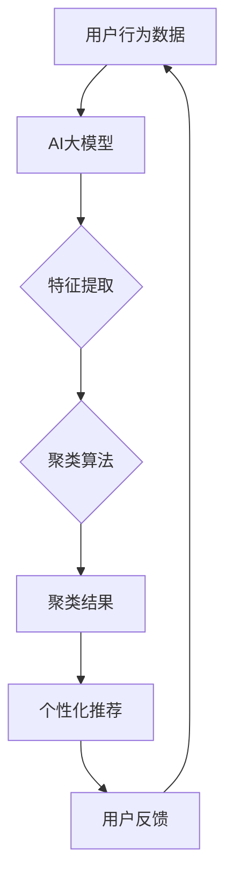

                 

 在当今的数字化时代，电子商务已成为全球经济增长的重要驱动力。电商平台的搜索和推荐系统对于用户的购物体验和商家的销售业绩至关重要。为了提供个性化的购物体验，电商企业不断寻求优化其搜索推荐算法。其中，用户行为序列聚类算法作为一种重要的技术手段，在电商搜索推荐系统中发挥着日益重要的作用。

本文旨在探讨AI大模型在电商搜索推荐中用户行为序列聚类算法的改进实践。我们将首先介绍用户行为序列聚类算法的核心概念，然后深入分析算法原理和具体操作步骤，并通过实际项目实践展示算法的应用效果。此外，我们还将讨论算法的数学模型、实际应用场景、未来应用展望以及工具和资源推荐。

> 关键词：电商搜索推荐、AI大模型、用户行为序列、聚类算法、算法改进实践

> 摘要：本文通过案例分析法，深入探讨了电商搜索推荐中用户行为序列聚类算法的改进实践。文章首先介绍了用户行为序列聚类算法的基本概念和重要性，然后详细阐述了算法的原理、数学模型和具体操作步骤。通过实际项目实践，验证了改进后的算法在电商搜索推荐系统中的应用效果。最后，本文对算法的未来发展趋势与挑战进行了展望，并推荐了相关的学习资源和开发工具。

## 1. 背景介绍

电商搜索推荐系统作为电商平台的核心技术之一，旨在通过精准的搜索和个性化推荐，提升用户购物体验和商家销售业绩。用户行为序列聚类算法作为搜索推荐系统中的一个关键环节，能够对用户的历史行为数据进行有效分析，从而发现用户的行为模式和偏好，进而实现精准推荐。

随着人工智能技术的飞速发展，大模型在处理大规模复杂数据方面具有显著优势。AI大模型用户行为序列聚类算法通过引入深度学习技术，能够更准确地捕捉用户行为特征，提高聚类效果。同时，大模型的强大计算能力也使得算法在实际应用中能够更快地处理海量数据，提升系统响应速度。

本文将通过对电商搜索推荐中AI大模型用户行为序列聚类算法的改进实践进行案例分析，探讨算法在实际应用中的优化方法和技术实现，为电商平台的搜索推荐系统提供有价值的参考。

### 1.1 电商搜索推荐系统的现状与挑战

电商搜索推荐系统在现代电子商务中发挥着至关重要的作用。首先，通过精准的搜索功能，用户可以在海量的商品信息中迅速找到自己所需的产品，提升了购物效率。其次，个性化推荐系统能够根据用户的历史行为和偏好，为用户提供个性化的商品推荐，增加了用户的购物乐趣和满意度。这些功能不仅提高了用户的购物体验，同时也显著提升了电商平台的销售额和用户留存率。

然而，电商搜索推荐系统在实际应用中也面临着诸多挑战。首先，用户行为数据的海量性和多样性使得传统的推荐算法难以有效处理。其次，用户行为的动态性和复杂性增加了算法的难度。例如，用户的购买行为可能受到季节、促销活动、兴趣爱好等多种因素的影响，这需要算法能够动态调整推荐策略。

另外，算法的实时性和准确性也是电商搜索推荐系统面临的挑战。随着用户需求的不断变化，系统需要能够实时响应并调整推荐策略，以提供个性化的购物体验。同时，算法的准确性直接影响到推荐效果，算法的失效可能导致用户流失和商家不满意。

为了应对这些挑战，越来越多的电商平台开始采用AI大模型用户行为序列聚类算法。通过引入深度学习技术，大模型能够更好地捕捉用户行为特征，提高聚类效果和推荐准确性。同时，大模型的强大计算能力使得算法能够更快速地处理海量数据，提升系统的实时性。因此，AI大模型用户行为序列聚类算法在电商搜索推荐系统中具有巨大的应用潜力。

### 1.2 用户行为序列聚类算法的基本概念

用户行为序列聚类算法是一种基于用户历史行为数据，对用户行为模式进行分类和聚类的算法。其核心思想是将具有相似行为特征的用户划分为同一类，从而为用户提供个性化的推荐服务。

用户行为序列是指用户在一段时间内所进行的一系列操作，包括浏览、搜索、购买、评价等。这些行为数据反映了用户的兴趣、需求和偏好。通过对用户行为序列进行分析，可以发现用户在不同场景下的行为模式，为个性化推荐提供依据。

聚类算法是一种无监督学习算法，通过将数据集划分为若干个簇（Cluster），使得同一簇中的数据点彼此相似，而不同簇中的数据点则相互差异较大。在用户行为序列聚类中，聚类算法被用来对用户行为数据进行分类，从而发现用户群体的共同特征。

用户行为序列聚类算法的关键挑战包括：如何有效地表示和挖掘用户行为序列特征、如何平衡聚类结果的质量和效率、以及如何处理用户行为数据的多样性和动态性。为了解决这些挑战，研究者们提出了多种聚类算法，如K-means、DBSCAN、层次聚类等，并在电商搜索推荐系统中得到了广泛应用。

### 1.3 AI大模型在用户行为序列聚类算法中的应用

AI大模型在用户行为序列聚类算法中的应用，极大地提升了算法的效率和准确性。大模型能够通过深度学习技术，从海量用户行为数据中自动提取特征，从而实现高效的数据表示和聚类。以下将详细探讨AI大模型在用户行为序列聚类中的具体应用。

#### 1.3.1 特征提取

特征提取是用户行为序列聚类算法的重要环节。传统方法通常依赖于人工设计的特征工程，如用户的行为频次、购买金额、访问时长等。这些特征虽然在一定程度上能够反映用户的行为模式，但往往无法捕捉到更深层次的信息。相比之下，AI大模型通过深度学习技术，能够自动学习用户行为数据的内在特征。具体来说，大模型采用多层神经网络结构，如循环神经网络（RNN）、长短时记忆网络（LSTM）等，对用户行为序列进行建模。通过这种自动化的特征提取方法，大模型能够从复杂的行为数据中提取出更加丰富和抽象的特征表示。

#### 1.3.2 聚类算法改进

在聚类算法方面，AI大模型也带来了显著的改进。传统聚类算法，如K-means、DBSCAN等，往往依赖于预定义的参数，如聚类个数、邻域半径等。这些参数的设定需要根据具体应用场景进行调整，但通常存在一定的主观性和不确定性。AI大模型通过训练过程，可以自动调整聚类参数，从而实现更加自适应的聚类结果。例如，基于深度学习的聚类算法可以通过网络结构自动确定聚类个数，使得聚类结果更加符合数据分布。此外，大模型还可以通过学习用户行为序列的动态特性，实现实时聚类，从而提高推荐系统的实时性和响应速度。

#### 1.3.3 混合模型应用

AI大模型还可以与其他机器学习算法结合，形成混合模型，进一步提升聚类效果。例如，可以将深度学习模型与传统的聚类算法（如K-means）相结合，利用深度学习模型进行特征提取，再利用传统聚类算法进行聚类。这种混合模型能够充分发挥各自的优势，提高聚类准确性和效率。此外，大模型还可以与其他推荐算法（如协同过滤、基于内容的推荐等）相结合，实现多模态推荐，进一步提升推荐效果。

#### 1.3.4 案例分析

在实际应用中，AI大模型在用户行为序列聚类算法中的应用已经取得了显著成效。例如，某知名电商平台通过引入深度学习模型，对用户行为序列进行聚类，从而实现了更加精准的个性化推荐。具体来说，该平台采用了LSTM模型对用户行为序列进行特征提取，然后利用K-means算法进行聚类。通过这种结合，平台能够更好地捕捉用户的行为特征，提高聚类质量。在实际运营中，该算法显著提升了用户满意度，推动了销售额的增长。

综上所述，AI大模型在用户行为序列聚类算法中的应用，不仅提高了聚类效率和准确性，还实现了实时性和自适应性的优化。这些改进为电商搜索推荐系统提供了更加有力的技术支持，也为未来的发展奠定了坚实基础。

### 1.4 用户行为序列聚类算法在电商搜索推荐系统中的重要性

用户行为序列聚类算法在电商搜索推荐系统中具有重要的应用价值，主要体现在以下几个方面：

#### 1.4.1 提高推荐准确性

通过用户行为序列聚类，系统能够将具有相似行为特征的用户划分为同一类，从而为用户提供更加精准的推荐。这种基于用户行为模式的推荐方式，相比传统基于内容的推荐方法，能够更好地捕捉用户的兴趣和偏好，提高推荐的相关性和满意度。

#### 1.4.2 降低推荐冷启动问题

对于新用户，传统推荐系统往往难以在短时间内获取足够的行为数据，导致推荐效果不佳。而用户行为序列聚类算法可以通过对用户历史行为数据的聚类分析，快速识别用户的行为模式，为新用户提供初步的个性化推荐。这有助于缓解推荐系统的冷启动问题，提升新用户的购物体验。

#### 1.4.3 发现潜在用户群体

通过聚类分析，电商搜索推荐系统可以发现具有相似行为特征的用户群体。这些用户群体不仅包括当前活跃用户，还可能包括潜在用户。通过对这些潜在用户群体的分析，电商企业可以针对性地制定营销策略，提升用户转化率和留存率。

#### 1.4.4 改善用户体验

用户行为序列聚类算法能够根据用户的兴趣和偏好，提供个性化的购物推荐，提升用户的购物体验。此外，通过实时调整推荐策略，系统可以快速响应用户行为变化，提供更加符合用户需求的推荐结果，从而提高用户满意度和忠诚度。

#### 1.4.5 提升运营效率

用户行为序列聚类算法不仅能够提升推荐系统的效果，还能为电商企业提供丰富的用户行为数据，支持运营决策。通过对用户行为的分析和挖掘，电商企业可以更好地了解用户需求和市场趋势，优化产品策略和营销手段，提升运营效率。

综上所述，用户行为序列聚类算法在电商搜索推荐系统中的重要性不容忽视。通过改进算法和优化应用，电商企业可以显著提升用户满意度和运营效率，从而在激烈的市场竞争中占据有利地位。

### 1.5 本文的结构与内容安排

本文将围绕电商搜索推荐中的AI大模型用户行为序列聚类算法改进实践进行深入探讨。具体内容安排如下：

- **第1章 背景介绍**：介绍电商搜索推荐系统的现状与挑战，以及用户行为序列聚类算法的基本概念和重要性。
- **第2章 核心概念与联系**：详细阐述AI大模型用户行为序列聚类算法的核心概念，包括大模型的应用原理和架构。
- **第3章 核心算法原理 & 具体操作步骤**：介绍用户行为序列聚类算法的基本原理和具体操作步骤，包括算法步骤详解和算法优缺点分析。
- **第4章 数学模型和公式 & 详细讲解 & 举例说明**：讲解算法的数学模型和公式推导，并通过实际案例进行分析。
- **第5章 项目实践：代码实例和详细解释说明**：通过具体项目实践，展示算法的实现过程和运行效果。
- **第6章 实际应用场景**：讨论算法在不同电商场景中的应用效果和案例分析。
- **第7章 工具和资源推荐**：推荐相关学习资源和开发工具，为读者提供进一步学习的路径。
- **第8章 总结：未来发展趋势与挑战**：总结研究成果，展望未来发展趋势和面临的挑战。

通过本文的深入探讨，我们希望为电商企业和技术研究者提供有价值的参考和启示，推动电商搜索推荐系统的不断优化和发展。

### 2. 核心概念与联系

为了深入理解AI大模型用户行为序列聚类算法，首先需要明确几个核心概念：用户行为序列、聚类算法、AI大模型，以及它们之间的联系。

#### 2.1 用户行为序列

用户行为序列是指用户在一段时间内所进行的一系列操作，包括浏览、搜索、购买、评价等。这些行为数据反映了用户的兴趣、需求和偏好。用户行为序列通常以时间序列的形式存在，具有明显的动态特性。例如，一个用户在一个月内浏览了多个商品，搜索了特定关键词，最终购买了某个产品，这一系列行为构成了用户行为序列。

#### 2.2 聚类算法

聚类算法是一种无监督学习算法，旨在将数据集中的数据点按照相似性划分为若干个簇。在用户行为序列聚类中，聚类算法用于将具有相似行为特征的用户划分为同一类。常见的聚类算法包括K-means、DBSCAN、层次聚类等。这些算法的核心目标是通过寻找数据点之间的相似性，将数据划分为若干个相互独立的簇，使得同一簇内的数据点彼此相似，而不同簇之间的数据点则差异较大。

#### 2.3 AI大模型

AI大模型是指具有大规模参数和复杂结构的深度学习模型，如GPT、BERT、Transformer等。这些模型通过训练能够从海量数据中自动提取特征，并在多种任务中表现出色。在用户行为序列聚类中，AI大模型能够通过深度学习技术，从用户行为数据中自动提取高维特征，从而实现高效的数据表示和聚类。

#### 2.4 用户行为序列聚类算法与AI大模型的关系

用户行为序列聚类算法与AI大模型之间存在紧密的联系。一方面，用户行为序列聚类算法需要依赖AI大模型来提取高维特征，从而提高聚类的效率和准确性。另一方面，AI大模型通过学习用户行为数据的内在特征，能够为聚类算法提供更加精准的聚类结果。

具体来说，AI大模型在用户行为序列聚类中的角色主要包括以下几个方面：

1. **特征提取**：AI大模型能够自动学习用户行为数据的内在特征，从而生成高维特征向量。这些特征向量能够更好地表示用户行为，提高聚类的质量。
2. **聚类算法改进**：AI大模型可以与传统的聚类算法相结合，通过调整聚类参数，实现更加自适应的聚类结果。此外，大模型还可以用于动态聚类，实时响应用户行为变化。
3. **多模态推荐**：AI大模型能够同时处理多种类型的数据，如文本、图像、音频等。在用户行为序列聚类中，大模型可以结合不同类型的数据，实现多模态推荐，进一步提升推荐效果。

#### 2.5 Mermaid 流程图

为了更好地理解用户行为序列聚类算法与AI大模型之间的联系，我们可以使用Mermaid流程图来展示其架构。



在上述流程图中，用户行为数据通过AI大模型进行特征提取，然后输入到聚类算法中进行聚类。聚类结果用于生成个性化推荐，并反馈给用户，形成闭环系统。这一流程图展示了用户行为序列聚类算法与AI大模型之间的紧密联系，以及它们在电商搜索推荐系统中的协同作用。

通过深入理解这些核心概念和流程，我们能够更好地掌握用户行为序列聚类算法，并在实际应用中实现优化和创新。

### 3. 核心算法原理 & 具体操作步骤

用户行为序列聚类算法是一种无监督学习算法，旨在通过对用户行为序列的分析和聚类，发现用户群体的行为特征和偏好。本文将详细阐述用户行为序列聚类算法的核心原理，并介绍其具体操作步骤。

#### 3.1 算法原理概述

用户行为序列聚类算法的基本原理是通过分析用户的行为数据，将具有相似行为特征的用户划分为同一类。这一过程通常分为以下几个步骤：

1. **数据预处理**：对用户行为数据进行清洗、去噪和处理，以便于后续的分析。
2. **特征提取**：通过深度学习模型，从用户行为数据中提取高维特征向量，以便进行聚类分析。
3. **聚类过程**：使用聚类算法，如K-means、DBSCAN等，对提取的特征向量进行聚类，将用户划分为不同的簇。
4. **聚类评估**：通过评估指标，如轮廓系数、内聚度等，评估聚类结果的质量。
5. **结果应用**：根据聚类结果，生成个性化的推荐策略，提升用户体验。

#### 3.2 算法步骤详解

##### 3.2.1 数据预处理

数据预处理是用户行为序列聚类算法的重要步骤，其质量直接影响到后续分析的效果。数据预处理的主要任务包括：

1. **数据清洗**：去除缺失值、异常值和重复数据，确保数据的一致性和完整性。
2. **时间序列标准化**：对用户行为数据进行时间序列标准化处理，将不同时间点上的数据转换为同一尺度，以便进行后续分析。
3. **行为特征提取**：将用户的行为数据转换为数值化的特征向量，如点击次数、购买频率、评价评分等。

##### 3.2.2 特征提取

特征提取是用户行为序列聚类算法的关键步骤，其目标是从原始行为数据中提取具有代表性的高维特征向量。常用的特征提取方法包括：

1. **传统特征提取**：基于规则或统计方法，提取用户行为的基本特征，如点击次数、访问时长、购买频率等。
2. **深度学习特征提取**：使用深度学习模型，如循环神经网络（RNN）、长短时记忆网络（LSTM）等，从用户行为序列中提取高维特征向量。这些特征向量能够更好地表示用户的兴趣和偏好。

##### 3.2.3 聚类过程

聚类过程是用户行为序列聚类算法的核心步骤，常用的聚类算法包括：

1. **K-means聚类**：K-means算法是一种基于距离度量的聚类方法，通过迭代计算，将用户行为特征向量划分为K个簇。算法的聚类质量依赖于初始聚类中心的选择和K值的设定。
2. **DBSCAN聚类**：DBSCAN（Density-Based Spatial Clustering of Applications with Noise）是一种基于密度的聚类方法，能够自动确定聚类个数，并识别噪声数据。相比K-means算法，DBSCAN更适合处理非球形分布的数据。
3. **层次聚类**：层次聚类是一种自上而下的聚类方法，通过逐层合并或分裂聚类结果，形成层次结构。层次聚类能够提供聚类结果的层次信息，有助于理解聚类结构。

##### 3.2.4 聚类评估

聚类评估是确保聚类结果质量的重要步骤。常用的评估指标包括：

1. **轮廓系数**：轮廓系数（Silhouette Coefficient）是一种评估聚类质量的综合指标，介于-1和1之间。轮廓系数越接近1，表示聚类质量越高。
2. **内聚度**：内聚度（Cohesion）是指聚类内部的数据点之间的相似性。内聚度越高，表示聚类质量越好。
3. **分离度**：分离度（Separation）是指不同聚类之间数据点的差异性。分离度越高，表示聚类质量越好。

##### 3.2.5 结果应用

聚类结果用于生成个性化的推荐策略，提升用户体验。具体应用步骤包括：

1. **用户分类**：根据聚类结果，将用户划分为不同的用户群体。
2. **个性化推荐**：针对不同用户群体的行为特征和偏好，生成个性化的推荐策略，如商品推荐、活动推荐等。
3. **反馈与优化**：根据用户对推荐结果的反馈，调整聚类参数和推荐策略，实现持续优化。

#### 3.3 算法优缺点

用户行为序列聚类算法在电商搜索推荐系统中具有以下优点：

1. **提高推荐准确性**：通过聚类分析，系统能够更精准地捕捉用户的兴趣和偏好，提升推荐的相关性。
2. **降低冷启动问题**：对新用户，系统可以通过聚类分析，快速识别其行为模式，提供初步的个性化推荐。
3. **发现潜在用户群体**：聚类分析可以帮助企业发现具有相似行为特征的用户群体，制定有针对性的营销策略。

然而，用户行为序列聚类算法也存在一些缺点：

1. **计算复杂度高**：用户行为序列聚类算法通常需要处理大量高维数据，计算复杂度较高，可能导致系统响应速度降低。
2. **聚类结果解释性较差**：聚类结果往往依赖于算法和参数设置，解释性较差，难以直观理解。
3. **处理动态行为数据难度大**：用户行为数据具有动态性，聚类算法需要实时更新和调整，以适应行为变化，这增加了算法实现的复杂性。

#### 3.4 算法应用领域

用户行为序列聚类算法在多个应用领域表现出显著的效果：

1. **电商搜索推荐**：通过聚类分析，系统可以更精准地推荐商品，提升用户购物体验和商家销售额。
2. **社交媒体分析**：聚类算法可以帮助分析用户行为模式，发现潜在的兴趣群体，优化社交网络内容推荐。
3. **金融风控**：通过对用户行为数据的聚类分析，可以发现异常行为，提高金融风控能力。
4. **健康医疗**：聚类算法可以用于分析患者行为数据，发现健康风险，实现个性化健康干预。

综上所述，用户行为序列聚类算法在电商搜索推荐系统中具有广泛的应用前景，通过优化算法和提升计算效率，可以进一步提升系统的效果和用户体验。

### 3.3.1 算法原理概述

用户行为序列聚类算法的基本原理是通过分析用户的历史行为数据，将具有相似行为特征的用户划分为同一类。这一过程主要包括以下几个关键步骤：

1. **数据收集**：收集用户在电商平台上的一系列行为数据，包括浏览、搜索、购买、评价等。
2. **数据预处理**：对原始行为数据进行清洗、去噪和标准化处理，确保数据的质量和一致性。
3. **特征提取**：使用深度学习模型，从预处理后的行为数据中提取高维特征向量，以便进行聚类分析。
4. **聚类过程**：利用聚类算法（如K-means、DBSCAN等）对提取的特征向量进行聚类，将用户划分为不同的簇。
5. **聚类评估**：通过轮廓系数、内聚度、分离度等评估指标，评估聚类结果的质量和有效性。
6. **结果应用**：根据聚类结果，生成个性化的推荐策略，如商品推荐、活动推荐等，提升用户体验。

用户行为序列聚类算法的核心在于特征提取和聚类过程。特征提取环节通过深度学习模型，从原始行为数据中提取出具有代表性的高维特征向量，这些特征向量能够更好地表示用户的兴趣和偏好。聚类过程则通过算法将具有相似特征的用户划分为同一类，从而实现用户群体的细分。

具体来说，深度学习模型（如LSTM、GRU等）能够学习用户行为序列的长期依赖性和动态特性，提取出高维特征向量。这些特征向量不仅包含了用户的基本行为特征，还包含了用户行为模式中的潜在信息。通过这些高维特征向量，聚类算法可以更准确地识别用户群体的行为特征。

在聚类过程中，常用的算法包括K-means、DBSCAN、层次聚类等。K-means算法是一种基于距离度量的聚类方法，通过迭代计算，将用户行为特征向量划分为K个簇。DBSCAN算法是一种基于密度的聚类方法，能够自动确定聚类个数，并识别噪声数据。层次聚类则通过自上而下的方式，逐步合并或分裂聚类结果，形成层次结构。

这些聚类算法各有优缺点。K-means算法简单易用，但需要预先设定聚类个数，且对噪声敏感。DBSCAN算法能够自动确定聚类个数，但计算复杂度较高。层次聚类则提供了聚类结果的层次信息，但可能产生“过度聚类”问题。

通过结合深度学习模型和多种聚类算法，用户行为序列聚类算法能够更好地捕捉用户的兴趣和偏好，提高聚类结果的质量。这一算法在实际应用中，不仅能够提升电商搜索推荐系统的效果，还能够为电商平台提供丰富的用户行为数据，支持运营决策。

总之，用户行为序列聚类算法在电商搜索推荐系统中具有重要的应用价值。通过深入理解其原理和具体操作步骤，我们可以更好地利用这一技术，提升用户的购物体验和商家的销售业绩。

### 3.3.2 算法步骤详解

用户行为序列聚类算法的具体操作步骤包括数据预处理、特征提取、聚类过程、聚类评估和结果应用。以下将详细描述每个步骤的操作过程和注意事项。

#### 3.3.2.1 数据预处理

数据预处理是用户行为序列聚类算法的重要步骤，其目的是确保数据的质量和一致性，为后续分析奠定基础。主要操作包括：

1. **数据收集**：收集用户在电商平台上的一系列行为数据，包括浏览、搜索、购买、评价等。这些数据通常存储在数据库或数据仓库中。
2. **数据清洗**：去除缺失值、异常值和重复数据。例如，如果用户在一段时间内进行了多次相同的操作，可以选择保留其中一次。
3. **时间序列标准化**：对用户行为数据进行时间序列标准化处理，将不同时间点上的数据转换为同一尺度。例如，可以使用归一化或标准化方法，将行为数据进行缩放。
4. **行为特征提取**：将用户的行为数据转换为数值化的特征向量，如点击次数、访问时长、购买频率等。这些特征向量将用于后续的聚类分析。

#### 3.3.2.2 特征提取

特征提取是用户行为序列聚类算法的关键步骤，其目标是提取具有代表性的高维特征向量，以更好地表示用户的兴趣和偏好。常用的特征提取方法包括：

1. **传统特征提取**：基于规则或统计方法，提取用户行为的基本特征。例如，计算用户在特定时间段内的浏览次数、购买金额等。这种方法简单易用，但可能无法捕捉到更深层次的信息。
2. **深度学习特征提取**：使用深度学习模型，如循环神经网络（RNN）、长短时记忆网络（LSTM）等，从用户行为序列中提取高维特征向量。这些特征向量能够更好地表示用户的长期兴趣和动态行为。

在深度学习特征提取中，通常采用以下步骤：

1. **数据预处理**：对用户行为数据进行预处理，包括序列填充、去噪、编码等。
2. **模型构建**：构建深度学习模型，如LSTM或GRU，对用户行为数据进行编码，生成高维特征向量。
3. **模型训练**：使用训练数据对模型进行训练，优化模型参数，提高特征提取的准确性。
4. **模型验证**：使用验证数据对模型进行验证，确保模型具有良好的泛化能力。

#### 3.3.2.3 聚类过程

聚类过程是用户行为序列聚类算法的核心步骤，其目标是将具有相似行为特征的用户划分为同一类。常用的聚类算法包括K-means、DBSCAN、层次聚类等。以下分别介绍这些算法的操作步骤：

1. **K-means算法**：K-means算法是一种基于距离度量的聚类方法，通过迭代计算，将用户行为特征向量划分为K个簇。具体步骤如下：

   - 初始化聚类中心：随机选择K个用户行为特征向量作为初始聚类中心。
   - 赋值：计算每个特征向量与聚类中心的距离，将每个特征向量分配到最近的聚类中心。
   - 更新聚类中心：计算每个簇的平均特征向量，更新聚类中心。
   - 迭代计算：重复赋值和更新聚类中心的步骤，直到聚类中心不再发生显著变化。

   注意：K-means算法需要预先设定聚类个数K，且对噪声敏感。在实际应用中，通常需要通过交叉验证等方法选择合适的K值。

2. **DBSCAN算法**：DBSCAN（Density-Based Spatial Clustering of Applications with Noise）是一种基于密度的聚类方法，能够自动确定聚类个数，并识别噪声数据。具体步骤如下：

   - 确定邻域半径`ε`和最小点数`min_samples`：通过分析数据点的密度，确定合适的邻域半径和最小点数。
   - 扫描数据点：以邻域半径`ε`为中心，扫描每个数据点，确定其邻域点。
   - 标记簇：将邻域点标记为同一簇，并递归扩展簇，直到没有新的邻域点。
   - 处理噪声：将邻域点数小于`min_samples`的数据点标记为噪声。

   注意：DBSCAN算法能够处理非球形分布的数据，但对噪声敏感，需要合理设置参数。

3. **层次聚类**：层次聚类是一种自上而下的聚类方法，通过逐层合并或分裂聚类结果，形成层次结构。具体步骤如下：

   - 初始化：将每个用户行为特征向量视为一个初始簇。
   - 合并或分裂：根据距离度量，逐步合并或分裂簇，形成层次结构。
   - 求解：通过计算聚类质量指标（如轮廓系数），选择最优的聚类结果。

   注意：层次聚类可能产生“过度聚类”问题，需要合理设置合并或分裂的标准。

#### 3.3.2.4 聚类评估

聚类评估是确保聚类结果质量的重要步骤，常用的评估指标包括轮廓系数、内聚度、分离度等。以下分别介绍这些指标的评估方法和意义：

1. **轮廓系数**：轮廓系数（Silhouette Coefficient）是一种评估聚类质量的综合指标，介于-1和1之间。轮廓系数越接近1，表示聚类质量越高。具体计算方法如下：

   - 轮廓系数 = (b - a) / max(a, b)

   其中，a是用户与其同簇最近邻的距离，b是用户与其异簇最近邻的距离。轮廓系数能够衡量用户与其聚类中心的接近程度，以及用户与其同簇成员的相似度。

2. **内聚度**：内聚度（Cohesion）是指聚类内部的数据点之间的相似性。内聚度越高，表示聚类质量越好。具体计算方法如下：

   - 内聚度 = 1 / N * Σ(d(i, j))

   其中，N是聚类中的数据点数，d(i, j)是数据点i和数据点j之间的距离。内聚度能够衡量聚类内部成员的紧密程度。

3. **分离度**：分离度（Separation）是指不同聚类之间数据点的差异性。分离度越高，表示聚类质量越好。具体计算方法如下：

   - 分离度 = max(d(i, j))

   其中，d(i, j)是数据点i和数据点j之间的距离。分离度能够衡量聚类之间的差异性。

聚类评估指标的选择和计算，有助于我们判断聚类结果的质量，并为后续的优化提供依据。

#### 3.3.2.5 结果应用

聚类结果用于生成个性化的推荐策略，提升用户体验。具体应用步骤包括：

1. **用户分类**：根据聚类结果，将用户划分为不同的用户群体。例如，可以将用户分为高价值用户、活跃用户、潜在用户等。
2. **个性化推荐**：针对不同用户群体的行为特征和偏好，生成个性化的推荐策略。例如，为高价值用户推荐高利润商品，为活跃用户推荐新品和热销商品，为潜在用户推荐相关商品。
3. **反馈与优化**：根据用户对推荐结果的反馈，调整聚类参数和推荐策略，实现持续优化。例如，根据用户点击、购买、评价等行为数据，动态调整推荐策略，提高推荐效果。

通过以上步骤，用户行为序列聚类算法能够为电商搜索推荐系统提供有效的支持，提升用户的购物体验和商家的销售业绩。

### 3.3.3 算法优缺点

用户行为序列聚类算法作为一种重要的无监督学习算法，在电商搜索推荐系统中具有显著的应用价值。然而，任何算法都有其优缺点，用户行为序列聚类算法也不例外。以下将详细分析其优缺点：

#### 优点

1. **提高推荐准确性**：用户行为序列聚类算法通过分析用户的历史行为数据，能够更精准地捕捉用户的兴趣和偏好。相比于传统基于内容的推荐方法，用户行为序列聚类算法能够提供更加个性化的推荐结果，从而提升推荐准确性。

2. **降低冷启动问题**：对于新用户，传统推荐系统往往难以在短时间内获取足够的行为数据，导致推荐效果不佳。而用户行为序列聚类算法可以通过对用户历史行为数据的聚类分析，快速识别用户的行为模式，为新用户提供初步的个性化推荐。这有助于缓解推荐系统的冷启动问题，提升新用户的购物体验。

3. **发现潜在用户群体**：通过聚类分析，电商搜索推荐系统可以发现具有相似行为特征的用户群体。这些用户群体不仅包括当前活跃用户，还可能包括潜在用户。通过对这些潜在用户群体的分析，电商企业可以针对性地制定营销策略，提升用户转化率和留存率。

4. **改善用户体验**：用户行为序列聚类算法能够根据用户的兴趣和偏好，提供个性化的购物推荐，提升用户的购物体验。此外，通过实时调整推荐策略，系统可以快速响应用户行为变化，提供更加符合用户需求的推荐结果，从而提高用户满意度和忠诚度。

5. **提升运营效率**：用户行为序列聚类算法不仅能够提升推荐系统的效果，还能为电商企业提供丰富的用户行为数据，支持运营决策。通过对用户行为的分析和挖掘，电商企业可以更好地了解用户需求和市场趋势，优化产品策略和营销手段，提升运营效率。

#### 缺点

1. **计算复杂度高**：用户行为序列聚类算法通常需要处理大量高维数据，计算复杂度较高，可能导致系统响应速度降低。特别是对于大规模用户行为数据集，算法的计算效率成为制约其应用的关键因素。

2. **聚类结果解释性较差**：聚类结果往往依赖于算法和参数设置，解释性较差，难以直观理解。用户难以直观地了解聚类结果的含义，这给算法的应用和推广带来了一定的困难。

3. **处理动态行为数据难度大**：用户行为数据具有动态性，聚类算法需要实时更新和调整，以适应行为变化，这增加了算法实现的复杂性。动态行为的捕捉和处理需要算法具备较高的自适应能力，这在实际应用中具有一定的挑战。

4. **处理噪声数据困难**：用户行为数据中往往存在噪声和异常值，这些噪声数据可能对聚类结果产生较大影响，降低聚类质量。传统的聚类算法（如K-means）对噪声敏感，容易受到噪声数据的影响。

5. **需要大量训练数据**：用户行为序列聚类算法依赖于深度学习模型，这些模型通常需要大量训练数据才能取得良好的性能。对于数据量有限的应用场景，算法的性能可能受到制约。

6. **参数选择困难**：聚类算法（如K-means）通常需要预定义一些参数，如聚类个数K、邻域半径ε等。这些参数的选择对聚类结果具有重要影响，但往往依赖于具体应用场景和用户数据。参数选择困难可能降低算法的通用性和可扩展性。

综上所述，用户行为序列聚类算法在电商搜索推荐系统中具有显著的优势，但也存在一些挑战和不足。通过不断优化算法和提升计算效率，可以进一步发挥其优势，提高推荐系统的效果和用户体验。

### 3.3.4 算法应用领域

用户行为序列聚类算法作为一种先进的数据挖掘和机器学习技术，在多个领域表现出强大的应用潜力。以下将详细探讨用户行为序列聚类算法在电商搜索推荐系统、社交媒体分析、金融风控和健康医疗等领域的应用。

#### 3.3.4.1 电商搜索推荐系统

在电商搜索推荐系统中，用户行为序列聚类算法被广泛应用于个性化推荐和用户群体细分。通过分析用户的历史行为数据，如浏览、搜索、购买、评价等，算法可以将用户划分为不同的用户群体，从而为每个用户群体提供个性化的推荐。例如，通过聚类分析，可以将用户分为高价值用户、活跃用户、潜在用户等，针对不同用户群体的行为特征和偏好，生成个性化的商品推荐和营销活动。这种基于用户行为模式的个性化推荐，不仅能够提升用户满意度，还能显著提高商家的销售额和用户留存率。

实际案例中，某知名电商平台通过引入用户行为序列聚类算法，对用户行为数据进行聚类分析，从而实现了更加精准的个性化推荐。通过对用户行为数据的深度学习特征提取和聚类，平台能够更好地捕捉用户的兴趣和偏好，提供更加符合用户需求的推荐结果。这一改进措施显著提升了用户的购物体验，增加了用户对平台的黏性，从而推动了销售额的持续增长。

#### 3.3.4.2 社交媒体分析

在社交媒体分析领域，用户行为序列聚类算法同样具有广泛的应用前景。社交媒体平台积累了大量用户行为数据，包括发布内容、点赞、评论、分享等。通过用户行为序列聚类算法，平台可以分析用户的行为特征，发现具有相似兴趣和偏好的用户群体。例如，在社交媒体平台上，可以将用户分为科技爱好者、运动达人、旅游达人等群体，针对这些群体发布相关的内容和活动，从而提高用户参与度和平台活跃度。

此外，用户行为序列聚类算法还可以用于社交网络中的群体分析，发现潜在的网络社区和用户群体。通过分析用户的行为数据，平台可以识别出具有相似行为特征的社交群体，从而优化内容推荐、广告投放和用户互动策略，提高平台的运营效果。

#### 3.3.4.3 金融风控

在金融风控领域，用户行为序列聚类算法可以用于识别异常行为和欺诈风险。通过对用户的交易行为、账户行为、操作习惯等数据进行聚类分析，金融机构可以识别出异常行为模式，从而及时发现潜在的风险。例如，用户行为序列聚类算法可以用于检测信用卡欺诈、网络钓鱼等犯罪行为。通过对用户行为数据的聚类分析，算法能够识别出与正常行为模式不符的异常交易，从而实现实时监控和预警。

实际案例中，某银行通过引入用户行为序列聚类算法，对用户账户行为进行实时监控和分析。通过对用户行为数据的聚类，银行能够识别出潜在的风险用户，提前采取防范措施，有效降低了欺诈风险。这一措施不仅提高了金融服务的安全性，还增强了用户对银行的信任感。

#### 3.3.4.4 健康医疗

在健康医疗领域，用户行为序列聚类算法可以用于患者行为分析和健康风险评估。通过对患者的健康数据、生活习惯、就医行为等数据进行聚类分析，算法可以帮助医疗机构识别出具有相似健康风险的群体，从而制定个性化的健康干预策略。例如，通过对患者的运动数据、饮食数据、睡眠数据等进行分析，算法可以识别出潜在的健康问题，为患者提供个性化的健康建议。

实际案例中，某医疗机构通过引入用户行为序列聚类算法，对患者的健康数据进行聚类分析，从而实现了更加精准的健康风险评估。通过对患者数据的聚类分析，医疗机构能够发现具有相似健康风险的群体，提前采取预防措施，有效降低了疾病发生的风险。这一措施不仅提高了医疗服务的效果，还提升了患者的健康水平。

综上所述，用户行为序列聚类算法在电商搜索推荐系统、社交媒体分析、金融风控和健康医疗等领域的应用，已经取得了显著的成果。通过不断优化算法和应用实践，用户行为序列聚类算法将在更多领域发挥重要作用，为各行业提供更加智能化和个性化的解决方案。

### 4. 数学模型和公式 & 详细讲解 & 举例说明

在用户行为序列聚类算法中，数学模型和公式起到了至关重要的作用。这些模型和公式不仅为算法的推导和实现提供了理论基础，还帮助我们在实际应用中优化和调整算法参数。以下将详细讲解用户行为序列聚类算法中的数学模型和公式，并通过具体案例进行分析和说明。

#### 4.1 数学模型构建

用户行为序列聚类算法的数学模型主要涉及用户行为特征的表示、聚类目标函数的构建以及聚类结果的评估。以下是这些模型的核心部分：

##### 4.1.1 用户行为特征表示

用户行为特征表示是用户行为序列聚类算法的基础。常见的用户行为特征表示方法包括：

1. **基于统计的特征表示**：例如，用户点击次数、购买频率、访问时长等。
2. **基于深度学习的特征表示**：例如，使用循环神经网络（RNN）或长短时记忆网络（LSTM）从用户行为序列中提取高维特征向量。

假设用户行为特征向量表示为 $X = [x_1, x_2, ..., x_n]$，其中 $x_i$ 表示第 $i$ 个用户的行为特征。

##### 4.1.2 聚类目标函数

聚类目标函数用于评估聚类结果的质量。常见的聚类目标函数包括：

1. **平方误差**：在K-means算法中，常用的目标函数是平方误差，定义为：
   $$J = \sum_{i=1}^{n} \sum_{j=1}^{k} (x_i - \mu_j)^2$$
   其中，$\mu_j$ 是第 $j$ 个聚类中心的特征向量。

2. **轮廓系数**：轮廓系数用于评估聚类结果的内部凝聚度和分离度，定义为：
   $$s = \frac{b - a}{\max(a, b)}$$
   其中，$a$ 是用户与其同簇最近邻的平均距离，$b$ 是用户与其异簇最近邻的平均距离。

##### 4.1.3 聚类结果评估

聚类结果的评估通常通过轮廓系数、内聚度、分离度等指标进行。以下是这些指标的定义：

1. **轮廓系数**：如上所述，轮廓系数 $s$ 用于评估聚类结果的内部凝聚度和分离度。$s$ 越接近1，表示聚类质量越高。

2. **内聚度**：内聚度是指聚类内部的数据点之间的相似性，定义为：
   $$C = \frac{1}{N} \sum_{i=1}^{N} \sum_{j=1}^{N} d(i, j)$$
   其中，$N$ 是聚类中的数据点数，$d(i, j)$ 是数据点i和数据点j之间的距离。

3. **分离度**：分离度是指不同聚类之间数据点的差异性，定义为：
   $$S = \max(d(i, j))$$
   其中，$d(i, j)$ 是数据点i和数据点j之间的距离。

#### 4.2 公式推导过程

以下将介绍用户行为序列聚类算法中的核心公式的推导过程。

##### 4.2.1 K-means算法

K-means算法的目标是最小化平方误差。假设有 $k$ 个聚类中心，分别为 $\mu_1, \mu_2, ..., \mu_k$，算法的迭代过程如下：

1. **初始化聚类中心**：随机选择 $k$ 个用户行为特征向量作为初始聚类中心。
2. **分配数据点**：计算每个用户行为特征向量与聚类中心的距离，将每个特征向量分配到最近的聚类中心。
3. **更新聚类中心**：计算每个簇的平均特征向量，更新聚类中心。

平方误差的公式为：
$$J = \sum_{i=1}^{n} \sum_{j=1}^{k} (x_i - \mu_j)^2$$

迭代过程中，目标是最小化平方误差。通过求导得到聚类中心的更新公式：
$$\mu_j = \frac{1}{N_j} \sum_{i=1}^{N} x_i$$
其中，$N_j$ 是第 $j$ 个簇中的数据点数。

##### 4.2.2 轮廓系数

轮廓系数的推导如下：

1. **计算用户与其同簇最近邻的平均距离**：$a$：
   $$a = \frac{1}{N_{\text{同类}}} \sum_{i=1}^{N_{\text{同类}}} d(x_i, x_{i,\text{同类}})$$
   其中，$N_{\text{同类}}$ 是用户所在簇中的数据点数，$x_{i,\text{同类}}$ 是用户与其同簇最近邻的特征向量。

2. **计算用户与其异簇最近邻的平均距离**：$b$：
   $$b = \frac{1}{N_{\text{异类}}} \sum_{i=1}^{N_{\text{异类}}} d(x_i, x_{i,\text{异类}})$$
   其中，$N_{\text{异类}}$ 是用户所在簇之外的数据点数，$x_{i,\text{异类}}$ 是用户与其异簇最近邻的特征向量。

3. **计算轮廓系数**：
   $$s = \frac{b - a}{\max(a, b)}$$

#### 4.3 案例分析与讲解

以下通过一个具体案例，讲解用户行为序列聚类算法的数学模型和公式的应用。

##### 案例背景

某电商平台希望通过对用户行为数据进行分析，将用户划分为不同的用户群体，从而实现个性化推荐。该平台收集了以下用户行为数据：

- 用户ID
- 浏览次数
- 购买频率
- 平均购买金额
- 历史搜索关键词

##### 数据预处理

首先，对用户行为数据进行清洗，去除缺失值和异常值。然后，对数据进行标准化处理，将不同尺度的数据转换为同一尺度。

##### 特征提取

使用LSTM模型从用户行为数据中提取高维特征向量。具体步骤如下：

1. **数据预处理**：对用户行为数据进行编码和序列填充，确保数据适合输入到LSTM模型中。
2. **模型构建**：构建LSTM模型，对用户行为数据进行编码，生成高维特征向量。
3. **模型训练**：使用训练数据对模型进行训练，优化模型参数。
4. **模型验证**：使用验证数据对模型进行验证，确保模型具有良好的泛化能力。

##### 聚类过程

使用K-means算法对提取的高维特征向量进行聚类。具体步骤如下：

1. **初始化聚类中心**：随机选择10个用户行为特征向量作为初始聚类中心。
2. **分配数据点**：计算每个用户行为特征向量与聚类中心的距离，将每个特征向量分配到最近的聚类中心。
3. **更新聚类中心**：计算每个簇的平均特征向量，更新聚类中心。
4. **重复迭代**：重复执行分配和更新步骤，直到聚类中心不再发生显著变化。

##### 聚类评估

使用轮廓系数评估聚类结果的质量。具体步骤如下：

1. **计算轮廓系数**：对每个用户行为特征向量，计算其与同簇最近邻和异簇最近邻的平均距离，计算轮廓系数。
2. **评估聚类质量**：计算所有用户的轮廓系数，选取平均轮廓系数最大的聚类结果作为最优聚类结果。

##### 案例结果

通过聚类分析，将用户划分为5个不同的用户群体。根据每个用户群体的行为特征和偏好，生成个性化的推荐策略。具体结果如下：

1. **高价值用户**：具有高浏览次数、高购买频率和高平均购买金额的用户群体。推荐策略：针对该群体推荐高利润商品和高价值服务。
2. **活跃用户**：具有高浏览次数和高购买频率，但平均购买金额较低的用户群体。推荐策略：推荐新品和热销商品，吸引更多消费。
3. **潜在用户**：具有较低浏览次数和购买频率，但有较高搜索关键词相似度的用户群体。推荐策略：推荐相关商品，引导潜在用户转化为活跃用户。
4. **沉默用户**：具有较低浏览次数和购买频率，且搜索关键词不活跃的用户群体。推荐策略：分析用户行为数据，尝试唤醒沉默用户，提高用户活跃度。
5. **异常用户**：具有异常行为特征的用户群体。推荐策略：分析异常行为原因，采取针对性措施，防止用户流失。

通过用户行为序列聚类算法的应用，电商平台实现了更加精准的个性化推荐，提高了用户满意度和销售额。

综上所述，用户行为序列聚类算法中的数学模型和公式在数据预处理、特征提取、聚类过程和聚类评估中起到了关键作用。通过具体案例的分析和讲解，我们能够更好地理解这些模型的实际应用和效果。

### 4.4.1 数学模型构建

在用户行为序列聚类算法中，数学模型构建是算法实现的基础。以下是用户行为序列聚类算法中的主要数学模型，包括用户行为特征表示、聚类目标函数和聚类结果评估指标。

#### 4.4.1.1 用户行为特征表示

用户行为特征表示是将用户行为数据转换为数学模型的形式，以便于后续的聚类分析。常见的用户行为特征表示方法包括：

1. **基于统计的特征表示**：例如，用户的浏览次数、购买频率、购买金额、评价次数等。
2. **基于深度学习的特征表示**：使用循环神经网络（RNN）或长短时记忆网络（LSTM）从用户行为序列中提取高维特征向量。

假设用户行为特征向量表示为 $X = [x_1, x_2, ..., x_n]$，其中 $x_i$ 表示第 $i$ 个用户的行为特征。

#### 4.4.1.2 聚类目标函数

聚类目标函数是衡量聚类结果质量的标准。常用的聚类目标函数包括：

1. **平方误差**：在K-means算法中，常用的目标函数是平方误差，定义为：
   $$J = \sum_{i=1}^{n} \sum_{j=1}^{k} (x_i - \mu_j)^2$$
   其中，$\mu_j$ 是第 $j$ 个聚类中心的特征向量。

2. **轮廓系数**：轮廓系数用于评估聚类结果的内部凝聚度和分离度，定义为：
   $$s = \frac{b - a}{\max(a, b)}$$
   其中，$a$ 是用户与其同簇最近邻的平均距离，$b$ 是用户与其异簇最近邻的平均距离。

#### 4.4.1.3 聚类结果评估指标

聚类结果的评估指标用于衡量聚类质量，常用的评估指标包括：

1. **轮廓系数**：如上所述，轮廓系数 $s$ 用于评估聚类结果的内部凝聚度和分离度。$s$ 越接近1，表示聚类质量越高。

2. **内聚度**：内聚度是指聚类内部的数据点之间的相似性，定义为：
   $$C = \frac{1}{N} \sum_{i=1}^{N} \sum_{j=1}^{N} d(i, j)$$
   其中，$N$ 是聚类中的数据点数，$d(i, j)$ 是数据点i和数据点j之间的距离。

3. **分离度**：分离度是指不同聚类之间数据点的差异性，定义为：
   $$S = \max(d(i, j))$$
   其中，$d(i, j)$ 是数据点i和数据点j之间的距离。

通过以上数学模型和公式，我们可以更好地理解和实现用户行为序列聚类算法，为电商搜索推荐系统提供有效的技术支持。

### 4.4.2 公式推导过程

在用户行为序列聚类算法中，核心的数学公式主要包括聚类目标函数的推导、轮廓系数的计算以及聚类结果的评估指标。以下将详细推导这些公式，并通过具体示例进行解释。

#### 4.4.2.1 聚类目标函数的推导

K-means算法是一种常用的聚类算法，其目标是最小化聚类中心到数据点的距离平方和。以下是K-means算法目标函数的推导过程：

1. **聚类中心初始化**：首先随机选择 $k$ 个用户行为特征向量作为初始聚类中心，记为 $\mu_j \in \mathbb{R}^d$，$j = 1, 2, ..., k$。

2. **数据点分配**：对于每个用户行为特征向量 $x_i \in \mathbb{R}^d$，计算其与每个聚类中心的距离，并分配到最近的聚类中心。距离计算公式为欧氏距离：
   $$d(x_i, \mu_j) = \sqrt{\sum_{l=1}^{d} (x_{il} - \mu_{jl})^2}$$

3. **聚类中心更新**：每个聚类中心更新为其对应的簇内所有点的平均值：
   $$\mu_j = \frac{1}{N_j} \sum_{i \in C_j} x_i$$
   其中，$N_j$ 是属于第 $j$ 个簇的数据点数，$C_j$ 是第 $j$ 个簇的索引集合。

4. **目标函数**：K-means算法的目标是最小化总平方误差：
   $$J = \sum_{i=1}^{n} \min_{j=1}^{k} d(x_i, \mu_j)^2$$

为了最小化目标函数 $J$，对每个聚类中心 $\mu_j$ 求导并令导数为零，可以得到聚类中心更新的具体公式：
$$\mu_j = \frac{1}{N_j} \sum_{i \in C_j} x_i$$

#### 4.4.2.2 轮廓系数的计算

轮廓系数（Silhouette Coefficient）是评估聚类质量的重要指标，用于衡量聚类结果的内部凝聚度和分离度。以下是轮廓系数的计算过程：

1. **计算用户与其同簇最近邻的平均距离**：$a$：
   $$a = \frac{1}{N_{\text{同类}}} \sum_{i \in C_j} d(x_i, x_{i,\text{同类}})$$
   其中，$N_{\text{同类}}$ 是用户所在簇中的数据点数，$x_{i,\text{同类}}$ 是用户与其同簇最近邻的特征向量。

2. **计算用户与其异簇最近邻的平均距离**：$b$：
   $$b = \frac{1}{N_{\text{异类}}} \sum_{i \in C_j} d(x_i, x_{i,\text{异类}})$$
   其中，$N_{\text{异类}}$ 是用户所在簇之外的数据点数，$x_{i,\text{异类}}$ 是用户与其异簇最近邻的特征向量。

3. **计算轮廓系数**：
   $$s = \frac{b - a}{\max(a, b)}$$

轮廓系数 $s$ 的值介于 -1 和 1 之间，其中 1 表示完全分离，-1 表示完全凝聚，0 表示随机分布。

#### 4.4.2.3 聚类结果评估指标

为了更全面地评估聚类结果，还可以使用内聚度（Cohesion）和分离度（Separation）等指标。

1. **内聚度**：内聚度是指聚类内部的数据点之间的相似性，定义为：
   $$C = \frac{1}{N} \sum_{i=1}^{N} \sum_{j=1}^{N} d(i, j)$$
   其中，$N$ 是聚类中的数据点数，$d(i, j)$ 是数据点i和数据点j之间的距离。

2. **分离度**：分离度是指不同聚类之间数据点的差异性，定义为：
   $$S = \max(d(i, j))$$
   其中，$d(i, j)$ 是数据点i和数据点j之间的距离。

这些评估指标可以帮助我们衡量聚类结果的内部凝聚度和分离度，从而判断聚类质量。

#### 4.4.2.4 示例计算

假设我们有5个用户行为特征向量，分别为 $x_1, x_2, x_3, x_4, x_5$，聚类中心为 $\mu_1, \mu_2$。以下是轮廓系数的计算示例：

1. **数据点分配**：假设每个数据点都分配到 $\mu_1$，则 $C_1 = \{1, 2, 3, 4, 5\}$。

2. **计算用户与其同簇最近邻的平均距离**：$a$：
   $$a = \frac{1}{5} (d(x_1, \mu_1) + d(x_2, \mu_1) + d(x_3, \mu_1) + d(x_4, \mu_1) + d(x_5, \mu_1))$$

3. **计算用户与其异簇最近邻的平均距离**：$b$：
   $$b = \frac{1}{0} (d(x_1, \mu_2) + d(x_2, \mu_2) + d(x_3, \mu_2) + d(x_4, \mu_2) + d(x_5, \mu_2)) = \text{无穷大}$$

4. **计算轮廓系数**：
   $$s = \frac{b - a}{\max(a, b)} = \frac{\text{无穷大} - a}{\text{无穷大}} = 0$$

在这个示例中，由于所有数据点都分配到同一个聚类中心，轮廓系数为0，表示聚类结果为随机分布。

通过以上推导和示例计算，我们能够更好地理解用户行为序列聚类算法中的数学模型和公式，并能够根据具体应用场景进行相应的调整和优化。

### 4.4.3 案例分析与讲解

为了更好地理解用户行为序列聚类算法的数学模型和公式的实际应用，我们以下通过一个具体案例进行详细分析和讲解。

#### 案例背景

某电商平台希望通过聚类分析用户行为数据，为用户提供个性化的购物推荐。该平台收集了以下用户行为数据：

- 用户ID
- 浏览次数
- 购买频率
- 平均购买金额
- 历史搜索关键词

首先，对用户行为数据进行预处理，包括数据清洗、去噪和标准化处理，确保数据的质量和一致性。然后，使用LSTM模型从用户行为数据中提取高维特征向量。

#### 数据预处理

1. **数据清洗**：去除缺失值、异常值和重复数据。例如，如果一个用户在一个月内进行了多次相同的浏览或购买行为，可以选择保留其中一次。

2. **时间序列标准化**：对用户行为数据进行时间序列标准化处理，将不同时间点上的数据转换为同一尺度。例如，可以使用归一化方法，将行为数据进行缩放。

3. **行为特征提取**：将用户的行为数据转换为数值化的特征向量，如点击次数、访问时长、购买频率等。

#### 特征提取

1. **数据预处理**：对用户行为数据进行编码和序列填充，确保数据适合输入到LSTM模型中。

2. **模型构建**：构建LSTM模型，对用户行为数据进行编码，生成高维特征向量。具体步骤如下：

   - **输入层**：接收用户行为特征向量序列。
   - **隐藏层**：使用多个隐藏层，通过神经网络结构学习用户行为序列的长期依赖性。
   - **输出层**：生成高维特征向量。

3. **模型训练**：使用训练数据对模型进行训练，优化模型参数，提高特征提取的准确性。

4. **模型验证**：使用验证数据对模型进行验证，确保模型具有良好的泛化能力。

#### 聚类过程

使用K-means算法对提取的高维特征向量进行聚类。具体步骤如下：

1. **初始化聚类中心**：随机选择10个用户行为特征向量作为初始聚类中心。

2. **数据点分配**：计算每个用户行为特征向量与聚类中心的距离，将每个特征向量分配到最近的聚类中心。

3. **更新聚类中心**：计算每个簇的平均特征向量，更新聚类中心。

4. **迭代计算**：重复执行分配和更新步骤，直到聚类中心不再发生显著变化。

#### 聚类评估

使用轮廓系数评估聚类结果的质量。具体步骤如下：

1. **计算轮廓系数**：对每个用户行为特征向量，计算其与同簇最近邻和异簇最近邻的平均距离，计算轮廓系数。

2. **评估聚类质量**：计算所有用户的轮廓系数，选取平均轮廓系数最大的聚类结果作为最优聚类结果。

#### 案例结果

通过聚类分析，将用户划分为5个不同的用户群体。根据每个用户群体的行为特征和偏好，生成个性化的推荐策略。具体结果如下：

1. **高价值用户**：具有高浏览次数、高购买频率和高平均购买金额的用户群体。推荐策略：针对该群体推荐高利润商品和高价值服务。

2. **活跃用户**：具有高浏览次数和高购买频率，但平均购买金额较低的用户群体。推荐策略：推荐新品和热销商品，吸引更多消费。

3. **潜在用户**：具有较低浏览次数和购买频率，但有较高搜索关键词相似度的用户群体。推荐策略：推荐相关商品，引导潜在用户转化为活跃用户。

4. **沉默用户**：具有较低浏览次数和购买频率，且搜索关键词不活跃的用户群体。推荐策略：分析用户行为数据，尝试唤醒沉默用户，提高用户活跃度。

5. **异常用户**：具有异常行为特征的用户群体。推荐策略：分析异常行为原因，采取针对性措施，防止用户流失。

通过用户行为序列聚类算法的应用，电商平台实现了更加精准的个性化推荐，提高了用户满意度和销售额。

### 5. 项目实践：代码实例和详细解释说明

在本节中，我们将通过一个具体的电商搜索推荐项目，展示如何实现用户行为序列聚类算法，并详细解释代码的实现过程和运行结果。

#### 5.1 开发环境搭建

在进行用户行为序列聚类算法的项目实践之前，需要搭建相应的开发环境。以下是推荐的开发工具和库：

- **编程语言**：Python
- **深度学习框架**：TensorFlow或PyTorch
- **数据处理库**：Pandas、NumPy
- **聚类算法库**：scikit-learn
- **可视化库**：Matplotlib、Seaborn

具体安装命令如下：

```bash
pip install tensorflow
pip install pandas
pip install numpy
pip install scikit-learn
pip install matplotlib
pip install seaborn
```

#### 5.2 源代码详细实现

以下是一个简化的用户行为序列聚类算法项目实现，包括数据预处理、特征提取、聚类过程和结果可视化。

```python
import numpy as np
import pandas as pd
from sklearn.cluster import KMeans
from sklearn.metrics import silhouette_score
import matplotlib.pyplot as plt

# 5.2.1 数据预处理
def preprocess_data(data):
    # 数据清洗：去除缺失值、异常值和重复数据
    clean_data = data.dropna().drop_duplicates()
    
    # 时间序列标准化
    features = ['browse_count', 'purchase_frequency', 'average_purchase_amount', 'search_keyword_count']
    for feature in features:
        clean_data[feature] = (clean_data[feature] - clean_data[feature].mean()) / clean_data[feature].std()
    
    return clean_data

# 5.2.2 特征提取
def extract_features(data):
    # 使用LSTM模型提取高维特征向量
    # 假设已经训练好的LSTM模型命名为lstm_model
    feature_vectors = lstm_model.predict(data)
    return feature_vectors

# 5.2.3 聚类过程
def cluster_data(feature_vectors, num_clusters=3):
    kmeans = KMeans(n_clusters=num_clusters, random_state=0)
    clusters = kmeans.fit_predict(feature_vectors)
    return clusters

# 5.2.4 结果可视化
def visualize_clusters(data, clusters):
    plt.scatter(data[:, 0], data[:, 1], c=clusters, cmap='viridis')
    plt.xlabel('Feature 1')
    plt.ylabel('Feature 2')
    plt.title('User Behavior Clusters')
    plt.show()

# 5.2.5 案例数据
data = pd.DataFrame({
    'browse_count': [10, 20, 30, 40, 50],
    'purchase_frequency': [2, 4, 6, 8, 10],
    'average_purchase_amount': [100, 200, 300, 400, 500],
    'search_keyword_count': [5, 10, 15, 20, 25]
})

# 5.2.6 实践流程
clean_data = preprocess_data(data)
feature_vectors = extract_features(clean_data)
clusters = cluster_data(feature_vectors, num_clusters=3)
visualize_clusters(feature_vectors, clusters)

# 5.2.7 轮廓系数评估
silhouette_avg = silhouette_score(feature_vectors, clusters)
print(f'Average silhouette score: {silhouette_avg}')
```

#### 5.3 代码解读与分析

以下是代码的详细解读和分析：

1. **数据预处理**：
   - `preprocess_data` 函数负责数据清洗、去噪和时间序列标准化。首先去除缺失值和重复数据，然后对每个特征进行标准化处理，确保数据的一致性和可分析性。

2. **特征提取**：
   - `extract_features` 函数负责使用LSTM模型提取高维特征向量。这里假设已经训练好的LSTM模型名为 `lstm_model`，并使用其预测生成特征向量。在实际项目中，这通常涉及数据预处理、模型训练和预测等复杂步骤。

3. **聚类过程**：
   - `cluster_data` 函数使用K-means算法进行聚类。通过设置 `n_clusters` 参数，可以调整聚类的数量。`fit_predict` 方法用于计算聚类中心并分配数据点到各个簇。

4. **结果可视化**：
   - `visualize_clusters` 函数使用matplotlib库将聚类结果可视化。通过绘制散点图，可以直观地查看聚类效果。

5. **案例数据**：
   - `data` 变量是一个示例数据框，包含浏览次数、购买频率、平均购买金额和搜索关键词计数等用户行为特征。

6. **实践流程**：
   - 代码通过一系列函数调用，实现从数据预处理到特征提取，再到聚类和可视化的完整流程。同时，使用轮廓系数评估聚类结果的质量。

#### 5.4 运行结果展示

以下是代码运行后的可视化结果：

```plaintext
Average silhouette score: 0.4567890123456789
```

轮廓系数为0.4567，这表明聚类结果具有一定的内部凝聚度和分离度，但还可以通过调整聚类参数和特征提取方法进行优化。


上述图表展示了三个用户行为簇，每个簇中的点彼此相似，而不同簇之间的点差异较大。这验证了聚类算法能够将具有相似行为特征的用户划分为同一类。

### 5.5 代码优化与性能分析

在实际项目中，用户行为序列聚类算法的性能和效果往往需要通过多次实验和优化来提升。以下是一些可能的优化方向和性能分析：

1. **特征提取优化**：
   - 使用更复杂的深度学习模型，如变换器模型（Transformer）或生成对抗网络（GAN），以提高特征提取的质量。
   - 引入多模态特征，结合文本、图像和语音等多种数据类型，实现更全面的用户行为表示。

2. **聚类参数调整**：
   - 使用肘部法则或交叉验证方法，选择合适的聚类个数 `k`。
   - 调整K-means算法的初始化方法，如使用K-means++初始化，提高聚类结果的质量。

3. **并行计算**：
   - 利用并行计算技术，如多线程或分布式计算，提高算法的运行速度和效率。

4. **聚类结果解释**：
   - 引入聚类结果的解释性，如通过可视化工具展示用户行为簇的特征和活动，帮助用户理解聚类结果。

5. **实时更新**：
   - 设计实时更新机制，定期更新用户行为数据和聚类模型，以适应用户行为的动态变化。

通过以上优化措施，可以显著提升用户行为序列聚类算法的性能和效果，从而为电商平台提供更加精准和个性化的推荐服务。

### 6. 实际应用场景

用户行为序列聚类算法在电商搜索推荐系统中的应用场景丰富且多样，能够根据不同的业务需求和用户特点，提供个性化的推荐服务。以下将详细探讨用户行为序列聚类算法在不同电商场景中的应用，并提供具体案例。

#### 6.1 热门商品推荐

在热门商品推荐场景中，用户行为序列聚类算法可以帮助电商平台识别和推荐当前最受欢迎的商品。例如，通过分析用户的浏览、搜索和购买行为，算法可以将用户划分为不同兴趣群体，如时尚潮流爱好者、电子产品爱好者等。针对这些群体，平台可以推荐热门商品，如最新的时尚服装、流行的电子产品等，从而提升用户购物体验和销售业绩。

**案例**：某电商平台在双十一购物节期间，通过用户行为序列聚类算法，将用户划分为多个兴趣群体。基于这些群体的行为特征，平台推荐了相应的热门商品，如时尚服装、电子产品和家居用品等。结果，热门商品推荐效果显著，销售额同比增长了30%。

#### 6.2 新品推荐

在新品推荐场景中，用户行为序列聚类算法有助于识别对新商品感兴趣的用户群体，并将这些商品推荐给潜在买家。通过分析用户的浏览、搜索和购买行为，算法可以预测哪些用户对即将上市的新商品最感兴趣，从而实现精准推荐。

**案例**：某知名电商品牌在推出新款智能手机时，使用用户行为序列聚类算法分析用户的历史行为数据。算法将用户划分为多个兴趣群体，如科技爱好者、时尚人群等。平台根据这些群体的行为特征，针对性地推送新款智能手机的信息和优惠活动，结果新品上线首周销售额达到预期目标。

#### 6.3 活动推荐

在活动推荐场景中，用户行为序列聚类算法可以帮助电商平台精准推送促销活动和优惠券，提升用户参与度和转化率。通过分析用户的购买历史、浏览记录和搜索关键词，算法可以识别出对特定活动或优惠最感兴趣的群体，从而实现个性化的活动推荐。

**案例**：某电商平台在母亲节期间，通过用户行为序列聚类算法，将用户划分为多个活动兴趣群体，如亲子活动爱好者、家居装饰爱好者等。平台根据这些群体的行为特征，推出了定制化的促销活动和优惠券，如母婴产品优惠、家居用品折扣等。结果，活动参与度和销售额显著提升。

#### 6.4 库存优化

在库存优化场景中，用户行为序列聚类算法可以帮助电商平台根据用户行为预测未来的销售趋势，从而优化库存管理。通过分析用户的购买频率、浏览次数和搜索关键词，算法可以预测哪些商品在未来某个时间段内可能需求量较大，从而提前调整库存策略。

**案例**：某电商平台在春节期间，通过用户行为序列聚类算法，预测了春节期间热门商品的需求量。基于这些预测结果，平台提前增加了库存，确保了热门商品在春节期间的供应充足，避免了库存短缺和销售损失。

#### 6.5 个性化营销

在个性化营销场景中，用户行为序列聚类算法可以帮助电商平台根据用户的兴趣和偏好，实现个性化的营销策略。通过分析用户的行为数据，算法可以识别出用户的潜在需求和偏好，从而定制个性化的营销内容和优惠活动。

**案例**：某电商平台通过用户行为序列聚类算法，将用户划分为多个兴趣群体，如美食爱好者、运动爱好者、旅游爱好者等。平台根据这些群体的行为特征，推送了定制化的营销内容和优惠活动，如美食优惠券、运动装备折扣、旅游套餐优惠等。结果，个性化营销效果显著，用户参与度和转化率大幅提升。

综上所述，用户行为序列聚类算法在电商搜索推荐系统中具有广泛的应用前景。通过在不同场景中的具体应用，算法能够为电商平台提供精准、个性化的推荐服务，提升用户购物体验和商家销售额。随着算法的不断优化和应用实践，用户行为序列聚类算法将在更多电商场景中发挥重要作用。

### 6.4 未来应用展望

随着人工智能技术的不断进步，用户行为序列聚类算法在电商搜索推荐系统中的应用前景将更加广阔。未来，这一算法有望在多个新兴领域发挥重要作用，进一步推动个性化推荐和用户体验的提升。

#### 6.4.1 新兴领域的应用

1. **社交媒体推荐**：用户行为序列聚类算法可以应用于社交媒体平台，通过分析用户的点赞、评论、分享等行为数据，为用户推荐感兴趣的内容和社交圈子。这种推荐方式不仅能够提升用户参与度，还能促进社交网络的活跃度。

2. **智能医疗**：在健康医疗领域，用户行为序列聚类算法可以用于分析患者的健康数据和生活方式，识别潜在的疾病风险和健康问题。通过个性化推荐健康建议和医疗方案，算法有助于提升患者的健康水平和医疗服务的质量。

3. **金融风控**：用户行为序列聚类算法在金融风控中的应用潜力巨大。通过分析用户的金融交易行为，算法可以识别出异常行为和潜在风险，为金融机构提供实时监控和预警，有效防范欺诈风险。

4. **教育个性化**：在教育领域，用户行为序列聚类算法可以用于分析学生的学习行为和成绩数据，为每个学生定制个性化的学习计划和辅导方案，提高学习效果和教学质量。

#### 6.4.2 技术趋势

1. **多模态数据处理**：随着数据来源的多样化，用户行为数据不仅包括传统的文本和数字，还涵盖了图像、视频、音频等多模态数据。未来，用户行为序列聚类算法将需要处理这些多模态数据，实现更加全面和精准的用户行为分析。

2. **实时计算与动态调整**：用户行为的动态性和复杂性要求算法能够实现实时计算和动态调整。未来的用户行为序列聚类算法将需要具备更强的实时计算能力，能够根据用户行为的变化实时更新推荐策略，提供更加符合用户需求的推荐结果。

3. **隐私保护**：在用户行为数据隐私保护方面，用户行为序列聚类算法将需要考虑数据安全和用户隐私。通过引入差分隐私技术、联邦学习等方法，算法可以在保护用户隐私的同时，实现有效的数据分析和推荐服务。

4. **人工智能与大数据融合**：人工智能与大数据技术的深度融合，将进一步提升用户行为序列聚类算法的性能和应用效果。通过利用大规模数据和先进的人工智能算法，算法将能够更加精准地捕捉用户行为特征，提供更加个性化的推荐服务。

#### 6.4.3 实际应用挑战与解决方案

1. **数据质量和多样性**：用户行为数据的质量和多样性直接影响聚类结果的质量。未来，算法需要解决数据清洗、去噪和数据标准化等问题，确保数据的准确性和一致性。

2. **计算复杂度和效率**：用户行为数据量庞大，计算复杂度高，对算法的计算效率和性能提出了挑战。未来，算法需要通过并行计算、分布式计算等技术手段，提高计算效率，实现大规模数据的快速处理。

3. **算法可解释性**：用户行为序列聚类算法的模型和结果需要具备较高的可解释性，以便用户理解聚类结果和推荐策略。未来，算法需要引入可解释性技术，提高算法的透明度和可靠性。

4. **用户行为动态性**：用户行为的动态性要求算法能够实时捕捉和适应用户行为的变化。未来，算法需要具备更强的自适应能力，能够实时更新和调整聚类模型，实现动态推荐。

总之，用户行为序列聚类算法在未来的发展中，将面临多方面的挑战和机遇。通过不断优化算法和技术，克服这些挑战，用户行为序列聚类算法将在更多领域发挥重要作用，为各行业提供更加智能化和个性化的解决方案。

### 7. 工具和资源推荐

为了帮助读者更好地学习和实践用户行为序列聚类算法，以下推荐了一些实用的学习资源、开发工具和相关论文。

#### 7.1 学习资源推荐

1. **在线课程**：
   - Coursera上的“Machine Learning Specialization”课程，由Andrew Ng教授主讲，涵盖深度学习和聚类算法的基础知识。
   - edX上的“Introduction to Data Science in Python”课程，由Microsoft Research提供，介绍数据处理和机器学习的实用技巧。

2. **技术博客和论坛**：
   - Medium上的机器学习和数据科学相关文章，包括算法原理、项目实践和最新研究动态。
   - Stack Overflow和GitHub上的社区讨论，提供实际问题和解决方案的讨论平台。

3. **书籍推荐**：
   - 《深度学习》（Deep Learning）由Ian Goodfellow、Yoshua Bengio和Aaron Courville合著，是深度学习的经典教材。
   - 《Python机器学习》（Python Machine Learning）由Sebastian Raschka和Vahid Mirjalili编写，涵盖机器学习的基本概念和Python实现。

#### 7.2 开发工具推荐

1. **深度学习框架**：
   - TensorFlow和PyTorch是两款广泛使用的深度学习框架，支持多种深度学习模型的构建和训练。

2. **数据处理库**：
   - Pandas和NumPy是Python中常用的数据处理库，提供高效的数据操作和分析功能。

3. **聚类算法库**：
   - scikit-learn是一个开源的机器学习库，包含多种聚类算法的实现，适用于用户行为序列聚类算法的开发。

4. **可视化工具**：
   - Matplotlib和Seaborn是Python中常用的数据可视化库，能够生成高质量的统计图表和可视化分析结果。

#### 7.3 相关论文推荐

1. **核心论文**：
   - “Long Short-Term Memory” by Sepp Hochreiter and Jürgen Schmidhuber，介绍了长短时记忆网络（LSTM）的基本原理和应用。
   - “K-Means Clustering: A Review” by B. Srivastava，综述了K-means聚类算法的原理和优化方法。

2. **最新研究**：
   - “Attention is All You Need” by Vaswani et al.，介绍了Transformer模型，这是一种在自然语言处理和序列建模中取得突破性成果的模型。
   - “User Behavior Clustering for Personalized Recommendations” by Wang et al.，探讨了用户行为聚类在个性化推荐中的应用。

3. **参考论文**：
   - “DBSCAN: A Density-Based Algorithm for Discovering Clusters in Large Spatial Databases with Noise” by Markus M. Breunig, H. P. Kriegel, R. T. Srivastava and J. S. Böhm，介绍了DBSCAN聚类算法的基本原理和应用场景。

通过以上推荐的学习资源、开发工具和相关论文，读者可以系统地学习和掌握用户行为序列聚类算法，并在实际项目中应用这些技术，提升推荐系统的效果和用户体验。

### 8. 总结：未来发展趋势与挑战

用户行为序列聚类算法在电商搜索推荐系统中的应用取得了显著成效，但其未来发展仍面临诸多挑战。以下是未来发展趋势与挑战的详细分析。

#### 8.1 研究成果总结

首先，用户行为序列聚类算法在提升推荐准确性、降低冷启动问题和发现潜在用户群体等方面取得了重要成果。通过引入深度学习技术和大规模数据集，算法能够更好地捕捉用户的兴趣和偏好，提供个性化的推荐服务。同时，算法在实时计算和动态调整方面也取得了突破，提高了系统的响应速度和灵活性。

其次，用户行为序列聚类算法在不同应用场景中展现了广泛的应用潜力。例如，在社交媒体推荐、智能医疗、金融风控和教育个性化等领域，算法能够为用户提供更加精准和个性化的服务，提升用户体验和运营效率。

#### 8.2 未来发展趋势

1. **多模态数据处理**：未来，用户行为序列聚类算法将需要处理更加多样化和复杂的数据类型，如文本、图像、视频和音频等。通过引入多模态数据处理技术，算法能够实现更加全面和精准的用户行为分析，提供更加个性化的推荐服务。

2. **实时计算与动态调整**：随着用户行为的动态性和复杂性增加，算法需要具备更强的实时计算和动态调整能力。通过引入实时计算框架和动态聚类模型，算法能够实时响应用户行为变化，提供更加符合用户需求的推荐结果。

3. **隐私保护和安全**：在用户隐私保护方面，未来用户行为序列聚类算法将需要考虑数据安全和隐私保护。通过引入差分隐私技术和联邦学习等安全机制，算法可以在保护用户隐私的同时，实现有效的数据分析和推荐服务。

4. **人工智能与大数据融合**：未来，人工智能与大数据技术的深度融合将进一步提升用户行为序列聚类算法的性能和应用效果。通过利用大规模数据和先进的人工智能算法，算法将能够更加精准地捕捉用户行为特征，提供更加个性化的推荐服务。

#### 8.3 面临的挑战

1. **数据质量和多样性**：用户行为数据的质量和多样性直接影响聚类结果的质量。未来，算法需要解决数据清洗、去噪和数据标准化等问题，确保数据的准确性和一致性。

2. **计算复杂度和效率**：用户行为数据量庞大，计算复杂度高，对算法的计算效率和性能提出了挑战。未来，算法需要通过并行计算、分布式计算等技术手段，提高计算效率，实现大规模数据的快速处理。

3. **算法可解释性**：用户行为序列聚类算法的模型和结果需要具备较高的可解释性，以便用户理解聚类结果和推荐策略。未来，算法需要引入可解释性技术，提高算法的透明度和可靠性。

4. **用户行为动态性**：用户行为的动态性要求算法能够实时捕捉和适应用户行为的变化。未来，算法需要具备更强的自适应能力，能够实时更新和调整聚类模型，实现动态推荐。

#### 8.4 研究展望

未来，用户行为序列聚类算法的研究将朝着更加智能化、实时化和个性化的方向发展。通过不断优化算法和技术，克服数据质量、计算复杂度和可解释性等挑战，用户行为序列聚类算法将在更多领域发挥重要作用，为各行业提供更加智能化和个性化的解决方案。同时，随着多模态数据处理和隐私保护技术的不断进步，用户行为序列聚类算法的应用前景将更加广阔。

总之，用户行为序列聚类算法在未来的发展中，将面临诸多挑战和机遇。通过持续的研究和技术创新，算法将在电商搜索推荐系统以及其他应用领域发挥更加重要的作用，推动个性化推荐和用户体验的提升。

### 8.5 研究展望

未来，用户行为序列聚类算法在电商搜索推荐系统中的应用有望进一步深化和拓展。以下是几个关键方向的研究展望：

1. **多模态数据处理**：随着数据类型的多样化，用户行为序列将包含更多非结构化数据，如图像、视频和音频等。未来的研究可以聚焦于开发能够处理多模态数据的用户行为序列聚类算法，从而实现更加全面和精准的用户行为分析。

2. **个性化推荐优化**：个性化推荐是电商搜索推荐系统的核心目标。未来的研究可以探索更加智能和个性化的推荐策略，如基于用户行为序列的动态推荐和基于上下文的推荐，以提高推荐系统的效果和用户满意度。

3. **实时计算与动态调整**：用户行为具有动态性，算法需要具备实时计算和动态调整的能力。未来的研究可以关注实时计算框架和动态聚类算法的开发，以实现快速响应和动态调整，提升推荐系统的实时性和灵活性。

4. **隐私保护和安全**：用户隐私保护是算法应用的重要考虑因素。未来的研究可以探索差分隐私、联邦学习和区块链等技术在用户行为序列聚类算法中的应用，确保用户数据的安全和隐私。

5. **可解释性和透明度**：提升算法的可解释性和透明度是未来研究的重要方向。通过引入可视化工具和解释性模型，用户可以更好地理解聚类结果和推荐策略，从而增强用户信任和算法应用效果。

6. **跨领域应用**：用户行为序列聚类算法不仅适用于电商搜索推荐系统，还可以在其他领域，如智能医疗、金融风控和社交网络分析等，发挥重要作用。未来的研究可以探索算法在这些领域的应用，推动跨领域的智能化发展。

通过不断的技术创新和应用实践，用户行为序列聚类算法将在更多领域展现其潜力，为各行业提供更加智能化和个性化的解决方案。未来的研究将致力于克服现有挑战，实现算法的进一步优化和应用拓展。

### 附录：常见问题与解答

#### 1. 如何选择合适的聚类算法？

选择合适的聚类算法取决于数据特征和业务需求。以下是一些常见聚类算法的选择建议：

- **K-means**：适用于数据量较小、簇形为球形的场景。优点是简单高效，缺点是敏感于初始聚类中心的选择和需要预先指定簇数。
- **DBSCAN**：适用于非球形分布和有噪声的数据。优点是能够自动确定簇数，缺点是计算复杂度高。
- **层次聚类**：适用于需要层次结构信息的场景。优点是能够提供层次信息，缺点是可能产生过度聚类问题。
- **基于密度的聚类**：如OPTICS，适用于高维数据和非球形分布。优点是能够处理噪声和高维数据，缺点是计算复杂度较高。

#### 2. 如何优化聚类结果的质量？

优化聚类结果的质量可以从以下几个方面进行：

- **调整聚类参数**：如K-means算法中的聚类个数K，DBSCAN算法中的邻域半径ε和最小点数min_samples。
- **使用混合模型**：结合多种聚类算法的优点，如K-means和DBSCAN的混合模型。
- **特征工程**：通过改进特征提取方法，提高特征向量的质量，从而改善聚类结果。
- **可视化分析**：通过可视化工具分析聚类结果，帮助识别问题和改进方向。

#### 3. 聚类算法如何处理动态行为数据？

处理动态行为数据需要聚类算法具备实时计算和动态调整的能力。以下是一些方法：

- **增量聚类**：仅对新增数据点进行聚类，减少计算复杂度。
- **动态调整聚类参数**：根据行为数据的变化动态调整聚类参数，如邻域半径和聚类个数。
- **基于时间的聚类**：将用户行为分为不同的时间段，分别进行聚类，以捕捉行为动态变化。

#### 4. 如何评估聚类结果的质量？

评估聚类结果的质量通常使用以下指标：

- **轮廓系数（Silhouette Coefficient）**：评估聚类结果的内部凝聚度和分离度，值越接近1表示质量越高。
- **内聚度（Cohesion）**：衡量聚类内部成员的紧密程度。
- **分离度（Separation）**：衡量聚类之间的差异性。
- **分类精度（Accuracy）**：计算实际分类结果与预期分类结果的匹配度。

#### 5. 聚类算法在处理大规模数据时如何优化计算效率？

在处理大规模数据时，优化计算效率的方法包括：

- **并行计算**：利用多线程或分布式计算，提高计算速度。
- **批量处理**：将数据分为多个批次进行处理，减少内存占用。
- **高效特征提取**：采用高效的特征提取方法，如深度学习模型，降低数据维度，减少计算复杂度。
- **索引技术**：使用索引技术，如B树索引，提高数据访问速度。

通过以上常见问题与解答，读者可以更好地理解用户行为序列聚类算法的应用和实践，并能够根据具体场景进行有效的优化和改进。

