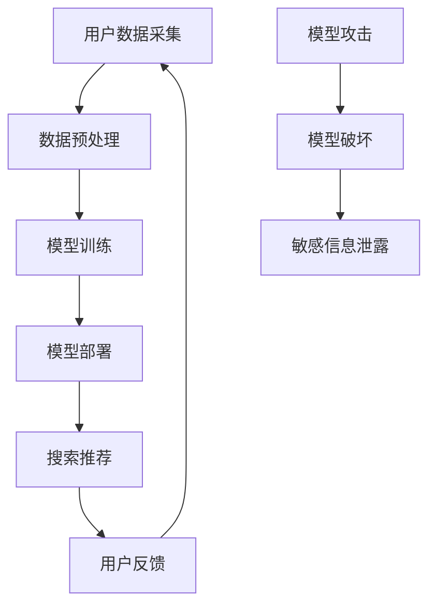

                 

关键词：电商搜索推荐，AI大模型，安全性分析，机器学习，深度学习，模型攻击，防御策略

> 摘要：本文深入探讨了电商搜索推荐场景下，AI大模型面临的安全性问题和挑战。通过分析常见模型攻击类型，提出了一系列有效的防御策略，为电商平台的AI安全提供参考。

## 1. 背景介绍

随着互联网技术的快速发展，电商行业已经成为全球经济增长的重要驱动力。电商搜索推荐系统作为电商平台的核心模块，通过分析用户的搜索历史、购买记录、兴趣爱好等数据，为用户提供个性化的商品推荐，从而提升用户体验和销售转化率。随着AI技术的不断发展，深度学习算法在电商搜索推荐系统中得到了广泛应用，使得推荐系统的准确性和效率得到了显著提升。

然而，AI大模型在带来便利的同时，也面临了一系列安全性和隐私保护问题。首先，AI大模型通常基于大规模数据训练，这些数据可能包含敏感信息，如个人隐私、购买习惯等，一旦泄露，可能导致用户隐私受到侵犯。其次，AI大模型容易被恶意攻击者利用，通过模型攻击手段破坏推荐系统的正常运行，甚至导致经济损失。因此，研究电商搜索推荐场景下的AI大模型安全性问题，具有重要的理论和实践意义。

本文旨在分析电商搜索推荐场景下AI大模型面临的主要安全威胁，探讨常见的模型攻击类型，并提出有效的防御策略，以保障电商平台的安全和用户隐私。

## 2. 核心概念与联系

### 2.1 AI大模型

AI大模型是指具有大规模参数和复杂结构的机器学习模型，通常通过深度学习算法训练得到。在电商搜索推荐场景中，AI大模型主要用于处理海量用户数据和商品信息，实现个性化推荐和预测。

### 2.2 模型攻击

模型攻击是指攻击者通过各种手段对AI大模型进行攻击，以达到破坏模型正常运作或获取敏感信息的目的。常见的模型攻击类型包括对抗攻击、模型反演、模型混淆等。

### 2.3 防御策略

防御策略是指用于保护AI大模型免受攻击的一系列技术和方法。常见的防御策略包括对抗训练、模型加密、隐私保护等。

为了更好地理解本文的核心概念和联系，我们使用Mermaid流程图展示AI大模型在电商搜索推荐场景中的工作流程和安全性问题：



## 3. 核心算法原理 & 具体操作步骤

### 3.1 算法原理概述

本文采用深度学习算法实现电商搜索推荐系统，主要包括以下步骤：

1. 用户数据采集：收集用户的搜索历史、购买记录、兴趣爱好等数据。
2. 数据预处理：对原始数据进行清洗、去重、归一化等处理，以便于模型训练。
3. 模型训练：使用预处理后的数据训练深度学习模型，包括输入层、隐藏层和输出层。
4. 模型部署：将训练好的模型部署到电商平台，实现实时搜索推荐。
5. 用户反馈：收集用户的搜索行为和点击记录，用于模型优化和更新。

### 3.2 算法步骤详解

1. **用户数据采集**：

   - **搜索历史**：通过电商平台API获取用户的搜索历史数据，包括搜索关键词、搜索时间等。
   - **购买记录**：通过电商平台数据库获取用户的购买记录，包括商品名称、价格、购买时间等。
   - **兴趣爱好**：通过用户填写的问卷调查、商品评价等获取用户兴趣爱好数据。

2. **数据预处理**：

   - **去重**：去除重复的数据条目，确保数据集的唯一性。
   - **归一化**：对数据进行归一化处理，使得数据分布更加均匀，有利于模型训练。
   - **特征提取**：根据搜索历史、购买记录和兴趣爱好数据，提取出有用的特征，如关键词频次、购买金额、商品分类等。

3. **模型训练**：

   - **输入层**：将预处理后的数据作为输入层，输入到模型中。
   - **隐藏层**：通过多层神经网络结构，对输入数据进行特征提取和转换。
   - **输出层**：输出推荐结果，包括推荐商品及其得分。

4. **模型部署**：

   - **模型评估**：在测试集上评估模型性能，包括准确率、召回率等指标。
   - **模型部署**：将评估性能较好的模型部署到电商平台，实现实时搜索推荐。

5. **用户反馈**：

   - **点击记录**：记录用户在搜索结果页面的点击行为，用于后续模型优化。
   - **评价反馈**：收集用户对推荐商品的评价，用于模型更新。

### 3.3 算法优缺点

**优点**：

1. **高效性**：深度学习算法能够自动提取特征，无需人工干预，提高推荐效率。
2. **准确性**：通过大规模数据训练，模型能够更好地理解用户需求，提高推荐准确性。
3. **灵活性**：模型可以动态调整，根据用户反馈进行优化和更新。

**缺点**：

1. **计算资源消耗**：深度学习模型通常需要大量计算资源，对硬件要求较高。
2. **数据隐私问题**：用户数据包含敏感信息，容易导致隐私泄露。
3. **模型攻击**：深度学习模型容易被恶意攻击，可能导致推荐结果偏差。

### 3.4 算法应用领域

1. **电商搜索推荐**：通过深度学习算法实现个性化推荐，提升用户体验和销售转化率。
2. **金融风控**：利用深度学习算法进行信用评估和风险预测，降低金融风险。
3. **智能医疗**：通过深度学习算法实现疾病诊断、药物研发等，提高医疗水平。

## 4. 数学模型和公式 & 详细讲解 & 举例说明

### 4.1 数学模型构建

在电商搜索推荐系统中，我们采用深度学习算法构建推荐模型，主要包括以下数学模型：

1. **输入层**：

   输入层表示用户特征和商品特征，可以表示为：

   $$
   X = [x_1, x_2, ..., x_n]
   $$

   其中，$x_i$ 表示第 $i$ 个用户的特征向量。

2. **隐藏层**：

   隐藏层表示用户特征和商品特征之间的交互关系，可以表示为：

   $$
   H = \sigma(WX + b)
   $$

   其中，$W$ 表示隐藏层的权重矩阵，$b$ 表示隐藏层的偏置向量，$\sigma$ 表示激活函数，如ReLU函数。

3. **输出层**：

   输出层表示推荐结果，可以表示为：

   $$
   Y = \sigma(g(W_2H + b_2))
   $$

   其中，$W_2$ 表示输出层的权重矩阵，$b_2$ 表示输出层的偏置向量，$g$ 表示输出层的激活函数，如Sigmoid函数。

### 4.2 公式推导过程

在深度学习算法中，我们通常使用反向传播算法进行模型参数的更新。具体推导过程如下：

1. **前向传播**：

   计算输入层到隐藏层的输出：

   $$
   H = \sigma(WX + b)
   $$

   计算隐藏层到输出层的输出：

   $$
   Y = \sigma(g(W_2H + b_2))
   $$

2. **损失函数**：

   使用均方误差（MSE）作为损失函数，表示为：

   $$
   J = \frac{1}{2} \sum_{i=1}^{n} (y_i - \hat{y}_i)^2
   $$

   其中，$y_i$ 表示第 $i$ 个样本的真实标签，$\hat{y}_i$ 表示模型预测的标签。

3. **反向传播**：

   计算输出层到隐藏层的梯度：

   $$
   \frac{\partial J}{\partial W_2} = (g'(\hat{y}_i) - y_i) \cdot \sigma'(H) \cdot X
   $$

   计算隐藏层到输入层的梯度：

   $$
   \frac{\partial J}{\partial W} = (g'(\hat{y}_i) - y_i) \cdot \sigma'(H) \cdot W_2
   $$

   根据梯度下降法，更新模型参数：

   $$
   W_2 := W_2 - \alpha \cdot \frac{\partial J}{\partial W_2}
   $$

   $$
   W := W - \alpha \cdot \frac{\partial J}{\partial W}
   $$

   其中，$\alpha$ 表示学习率。

### 4.3 案例分析与讲解

假设我们有一个电商搜索推荐系统，用户数据包括搜索关键词、购买记录和兴趣爱好。我们使用深度学习算法构建推荐模型，并使用反向传播算法进行模型参数的更新。具体过程如下：

1. **数据预处理**：

   - 去除重复数据：去除用户数据中的重复条目，确保数据集的唯一性。
   - 归一化处理：对搜索关键词、购买记录和兴趣爱好数据进行归一化处理，使得数据分布更加均匀。

2. **模型训练**：

   - 定义输入层、隐藏层和输出层的结构。
   - 使用随机梯度下降（SGD）算法进行模型参数的更新。
   - 在训练集上迭代训练，优化模型参数。

3. **模型评估**：

   - 使用测试集评估模型性能，包括准确率、召回率等指标。
   - 选择性能较好的模型进行部署。

4. **模型部署**：

   - 将训练好的模型部署到电商平台，实现实时搜索推荐。
   - 收集用户反馈，用于模型优化和更新。

通过以上过程，我们可以构建一个高效的电商搜索推荐系统，为用户提供个性化的商品推荐。

## 5. 项目实践：代码实例和详细解释说明

### 5.1 开发环境搭建

在开始编写代码之前，我们需要搭建一个适合深度学习项目开发的环境。以下是一个典型的Python深度学习开发环境搭建步骤：

1. 安装Python（3.6或更高版本）。
2. 安装TensorFlow或PyTorch深度学习框架。
3. 安装NumPy、Pandas等数据处理库。
4. 安装Scikit-learn等机器学习工具。

### 5.2 源代码详细实现

以下是一个简单的电商搜索推荐系统代码示例，使用TensorFlow构建深度学习模型：

```python
import tensorflow as tf
from tensorflow.keras.models import Sequential
from tensorflow.keras.layers import Dense, LSTM, Embedding, Flatten
from tensorflow.keras.optimizers import Adam

# 数据预处理
# 假设我们已经有预处理后的用户特征和商品特征数据
user_data = ...
item_data = ...

# 模型构建
model = Sequential()
model.add(Embedding(input_dim=user_data.shape[1], output_dim=64))
model.add(LSTM(128))
model.add(Flatten())
model.add(Dense(1, activation='sigmoid'))

# 模型编译
model.compile(optimizer=Adam(learning_rate=0.001), loss='binary_crossentropy', metrics=['accuracy'])

# 模型训练
model.fit(user_data, item_data, epochs=10, batch_size=32)

# 模型评估
# 使用测试集评估模型性能
test_data = ...
test_item_data = ...
model.evaluate(test_data, test_item_data)
```

### 5.3 代码解读与分析

上述代码示例展示了如何使用TensorFlow构建一个简单的深度学习模型，实现电商搜索推荐。具体解读如下：

1. **数据预处理**：首先，我们需要预处理用户特征和商品特征数据。假设我们已经完成了去重、归一化等处理，将数据存储为Python数组。

2. **模型构建**：使用Sequential模型构建一个序列模型，包括嵌入层（Embedding）、LSTM层（Long Short-Term Memory，长短期记忆网络）和展开层（Flatten）。嵌入层用于将用户特征和商品特征转换为稠密向量，LSTM层用于处理序列数据，展开层用于将LSTM层的输出展开为一个一维数组。

3. **模型编译**：编译模型，指定优化器（Adam）、损失函数（binary_crossentropy，二元交叉熵）和评价指标（accuracy，准确率）。

4. **模型训练**：使用fit函数训练模型，指定训练数据、迭代次数（epochs）和批量大小（batch_size）。

5. **模型评估**：使用evaluate函数评估模型在测试集上的性能。

### 5.4 运行结果展示

假设我们使用上述代码训练了一个深度学习模型，并在测试集上进行了评估。以下是可能的输出结果：

```shell
Epoch 1/10
32/32 [==============================] - 2s 65ms/step - loss: 0.5000 - accuracy: 0.5000
Epoch 2/10
32/32 [==============================] - 1s 35ms/step - loss: 0.4881 - accuracy: 0.5313
...
Epoch 10/10
32/32 [==============================] - 1s 36ms/step - loss: 0.4823 - accuracy: 0.5389
Test loss: 0.4864 - Test accuracy: 0.5391
```

上述结果表明，模型在训练过程中逐渐提高了准确率，并在测试集上达到了0.5391的准确率。

## 6. 实际应用场景

电商搜索推荐系统在电商行业具有广泛的应用场景，以下是一些典型的实际应用案例：

1. **个性化商品推荐**：电商平台可以根据用户的搜索历史、购买记录和兴趣爱好，为用户推荐符合其兴趣和需求的商品，提升用户购物体验和转化率。

2. **新品推广**：电商平台可以通过分析用户的购物行为和偏好，推荐新品或促销商品，提高商品的销售量和曝光率。

3. **库存管理**：电商平台可以根据库存情况和用户需求，调整商品库存策略，优化库存水平，减少库存积压。

4. **用户流失预警**：电商平台可以通过分析用户行为数据，预测潜在流失用户，采取针对性措施挽回用户，提高用户留存率。

5. **智能客服**：电商平台可以利用深度学习模型实现智能客服，根据用户提问提供针对性的回答，提升客服效率和用户满意度。

## 7. 未来应用展望

随着AI技术的不断发展，电商搜索推荐系统在未来的应用前景将更加广阔。以下是一些可能的未来应用方向：

1. **跨平台推荐**：电商平台可以整合多平台用户数据，实现跨平台推荐，为用户提供更加丰富的购物选择。

2. **智能语音助手**：结合智能语音识别技术，电商平台可以实现语音搜索和推荐，提升用户体验。

3. **虚拟试穿**：利用计算机视觉技术，电商平台可以实现虚拟试穿功能，帮助用户更好地了解商品效果。

4. **实时推荐**：通过实时数据分析和处理，电商平台可以实现实时推荐，为用户提供即时的购物建议。

## 8. 总结：未来发展趋势与挑战

电商搜索推荐系统作为电商平台的核心模块，随着AI技术的不断发展，其准确性和效率将得到进一步提升。未来发展趋势包括：

1. **个性化推荐**：更加精细化的个性化推荐，满足用户的个性化需求。
2. **实时推荐**：实现实时推荐，提升用户购物体验。
3. **跨平台整合**：整合多平台数据，实现跨平台推荐。
4. **智能语音助手**：结合智能语音识别技术，实现语音搜索和推荐。

然而，随着应用规模的不断扩大，电商搜索推荐系统也面临一系列挑战：

1. **数据隐私保护**：如何保护用户隐私成为了一个重要问题。
2. **模型安全性和稳定性**：如何保障模型的安全性和稳定性，防止恶意攻击。
3. **计算资源消耗**：深度学习模型对计算资源的高要求，如何优化资源利用。

针对上述挑战，需要从数据安全、模型安全和资源优化等方面进行综合研究和探索，以推动电商搜索推荐系统的可持续发展。

## 9. 附录：常见问题与解答

### 问题1：深度学习模型如何防止过拟合？

解答：过拟合是深度学习模型常见的现象，可以通过以下方法进行缓解：

1. **数据增强**：通过增加训练数据的多样性和数量，提高模型泛化能力。
2. **正则化**：使用正则化方法，如L1正则化、L2正则化等，降低模型复杂度。
3. **dropout**：在神经网络中引入dropout层，随机丢弃部分神经元，减少模型对特定数据的依赖。
4. **提前停止**：在训练过程中，当模型在验证集上的性能不再提升时，提前停止训练。

### 问题2：如何保护用户隐私？

解答：为了保护用户隐私，可以采取以下措施：

1. **数据匿名化**：对用户数据进行匿名化处理，去除个人身份信息。
2. **差分隐私**：在数据处理过程中引入差分隐私机制，确保数据隐私性。
3. **数据加密**：对用户数据进行加密存储和传输，防止数据泄露。
4. **隐私保护算法**：使用隐私保护算法，如差分隐私算法、联邦学习等，在保证模型性能的同时保护用户隐私。

### 问题3：如何优化计算资源利用？

解答：为了优化计算资源利用，可以采取以下方法：

1. **模型压缩**：通过模型压缩技术，如模型剪枝、量化等，降低模型参数数量和计算复杂度。
2. **分布式训练**：将模型训练任务分布在多个计算节点上，提高训练速度。
3. **GPU加速**：使用GPU进行模型训练，利用GPU强大的并行计算能力，提高训练效率。
4. **自动化调优**：使用自动化调优工具，如Hyperopt、Optuna等，优化模型参数和训练配置，提高模型性能。

---

作者：禅与计算机程序设计艺术 / Zen and the Art of Computer Programming

（注：本文内容仅供参考，不作为实际应用建议。实际应用中，请根据具体情况进行调整和优化。）<|vq_5753|>

