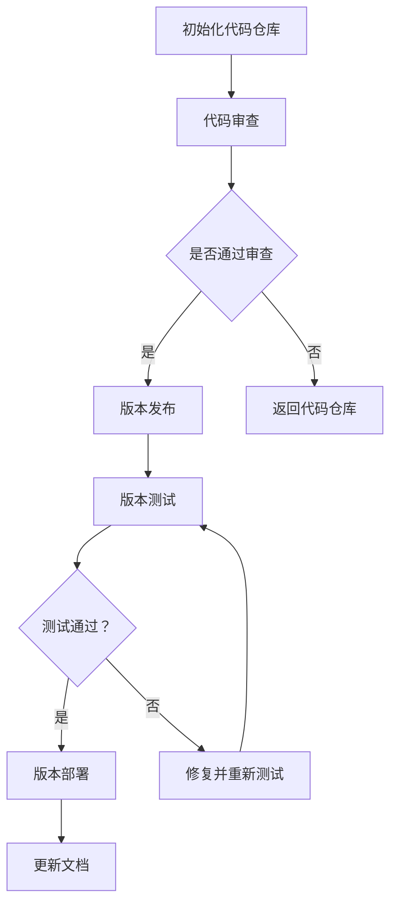

                 

电商行业的快速发展推动了个性化推荐系统的广泛应用，其中AI大模型在电商搜索推荐场景中扮演了至关重要的角色。然而，随着模型的不断迭代和优化，如何有效地管理模型的版本成为了一个亟待解决的问题。本文将深入探讨电商搜索推荐场景下的AI大模型模型版本管理策略，旨在为业界提供一种系统化、可操作的管理方案。

## 关键词
- 电商搜索推荐
- AI大模型
- 模型版本管理
- 版本控制
- 迭代优化

## 摘要
本文首先介绍了电商搜索推荐场景下AI大模型的重要性，随后探讨了模型版本管理的关键概念和方法。通过分析AI大模型版本管理的现状和挑战，本文提出了一种基于版本控制策略的管理方案，并详细阐述了其实现步骤。此外，本文还通过数学模型和实际案例，对方案进行了验证和优化。最后，本文展望了未来AI大模型版本管理的发展趋势和潜在挑战。

## 1. 背景介绍

### 电商搜索推荐的发展历程

随着互联网的普及和电子商务的迅猛发展，电商搜索推荐系统逐渐成为电商企业提升用户体验、提高销售转化率的重要手段。早期的电商搜索推荐主要基于简单的关键词匹配和规则推荐，随着数据挖掘和机器学习技术的发展，推荐系统逐渐转向基于用户行为和内容的个性化推荐。

AI大模型的引入进一步提升了推荐系统的精度和效率。深度学习、自然语言处理和图神经网络等技术的应用，使得AI大模型在处理海量数据、提取用户兴趣和行为特征方面具有显著优势。这些模型可以自动学习用户的历史行为，预测用户的偏好，并实时调整推荐策略，从而提供更加精准的个性化推荐。

### AI大模型在电商搜索推荐中的应用

AI大模型在电商搜索推荐中的应用主要集中在以下几个方面：

1. **用户画像构建**：通过分析用户的历史浏览、购买和评价行为，AI大模型可以构建出详细、多维的用户画像，为个性化推荐提供基础。

2. **商品推荐**：基于用户画像和商品属性，AI大模型可以生成个性化的商品推荐列表，提高用户购买的概率。

3. **搜索优化**：AI大模型可以优化搜索结果排序，通过理解用户查询意图，提高搜索结果的准确性。

4. **内容推荐**：除了商品推荐，AI大模型还可以推荐相关的文章、视频、直播等内容，丰富用户的购物体验。

### 模型版本管理的重要性

随着AI大模型的不断迭代和优化，模型版本管理变得尤为重要。有效的版本管理不仅可以确保推荐系统的稳定运行，还能提高开发效率、降低运维成本。以下是一些关键的版本管理需求：

1. **版本追溯**：能够追溯每个版本的变更历史，了解模型的改进过程。

2. **模型对比**：能够对比不同版本的模型性能，评估改进效果。

3. **快速部署**：能够快速部署新版本模型，确保推荐系统的实时性。

4. **风险管理**：能够有效识别和规避版本变更中的风险，确保系统稳定性。

## 2. 核心概念与联系

### 版本控制

版本控制是模型版本管理的核心概念之一。它涉及到如何标识、追踪和管理模型的各个版本。常见的版本控制方法包括：

1. **时间戳版本**：以时间戳为依据，标记模型的版本。例如，1.0、1.1、1.2等。

2. **修订号版本**：以修订号为依据，标记模型的版本。例如，v1.0、v1.1、v1.2等。

3. **标签版本**：以标签为依据，标记特定的模型版本。例如，release-v1.0、release-v1.1等。

### 版本控制流程

一个完整的版本控制流程通常包括以下步骤：

1. **代码仓库管理**：使用版本控制系统（如Git）管理模型的代码仓库。

2. **代码审查**：在提交代码前进行代码审查，确保代码的质量和安全性。

3. **版本发布**：根据需求，将模型代码打包成版本并发布。

4. **版本测试**：在测试环境中对发布版本进行测试，确保其性能和稳定性。

5. **版本部署**：将测试通过版本部署到生产环境，确保推荐系统的稳定运行。

### Mermaid 流程图

以下是AI大模型版本控制流程的Mermaid流程图：



## 3. 核心算法原理 & 具体操作步骤

### 3.1 算法原理概述

AI大模型的版本管理核心在于能够灵活、高效地管理模型的各个版本，确保版本变更的透明性和可追溯性。主要算法原理包括：

1. **版本标识**：使用统一且规范的版本标识方法，如时间戳、修订号或标签。

2. **变更记录**：记录每个版本的变更历史，包括代码修改、模型结构优化等。

3. **性能评估**：对每个版本进行性能评估，包括准确率、召回率等指标。

4. **回滚机制**：在版本出现问题时，能够快速回滚到之前稳定版本。

### 3.2 算法步骤详解

1. **初始化**：创建模型代码仓库，并设置版本控制工具。

2. **代码提交**：开发人员对模型进行修改后，提交代码到代码仓库。

3. **代码审查**：提交的代码经过代码审查，确保代码质量和安全性。

4. **版本打包**：将审查通过的代码打包成版本，并记录版本信息。

5. **版本测试**：在测试环境中对版本进行性能测试，确保其稳定性和性能。

6. **版本发布**：通过测试的版本发布到生产环境，并更新文档记录。

7. **性能监控**：在生产环境中实时监控版本性能，及时处理可能出现的问题。

### 3.3 算法优缺点

**优点**：

1. **灵活性**：支持灵活的版本管理，能够快速响应模型变更需求。

2. **可追溯性**：通过变更记录，可以追溯每个版本的变更历史，提高代码的可维护性。

3. **稳定性**：通过性能评估和监控，确保生产环境的模型稳定性。

**缺点**：

1. **复杂性**：需要完善的版本控制流程和工具支持，对开发人员要求较高。

2. **测试成本**：每次版本发布都需要进行测试，增加了测试成本和时间。

### 3.4 算法应用领域

AI大模型版本管理算法在电商搜索推荐场景中具有广泛的应用前景。具体应用领域包括：

1. **个性化推荐系统**：通过版本管理，确保个性化推荐模型的稳定性和性能。

2. **搜索优化系统**：对搜索结果排序模型进行版本管理，提高搜索结果的准确性。

3. **内容推荐系统**：对内容推荐模型进行版本管理，提高内容推荐的多样性和用户满意度。

## 4. 数学模型和公式 & 详细讲解 & 举例说明

### 4.1 数学模型构建

在AI大模型版本管理中，我们通常使用以下数学模型：

1. **准确率（Accuracy）**：评估模型预测正确性的指标，计算公式为：

   $$\text{Accuracy} = \frac{\text{正确预测数}}{\text{总预测数}}$$

2. **召回率（Recall）**：评估模型召回正例样本的能力，计算公式为：

   $$\text{Recall} = \frac{\text{正确召回的正例样本数}}{\text{正例样本总数}}$$

3. **F1值（F1-Score）**：综合考虑准确率和召回率的综合指标，计算公式为：

   $$\text{F1-Score} = 2 \times \frac{\text{准确率} \times \text{召回率}}{\text{准确率} + \text{召回率}}$$

### 4.2 公式推导过程

以上数学模型的推导过程如下：

1. **准确率**：

   假设我们有一个二分类问题，总共有 $N$ 个样本，其中正例样本数为 $P$，负例样本数为 $N-P$。模型预测正确的样本数为 $C$。

   准确率的计算公式可以表示为：

   $$\text{Accuracy} = \frac{C}{N}$$

   由于 $C$ 包括了预测正确的正例和负例，所以可以进一步拆分为：

   $$\text{Accuracy} = \frac{P_c + N_c}{N} = \frac{P + N - P_f - N_f}{N} = \frac{N - P_f - N_f}{N} = 1 - \frac{P_f + N_f}{N}$$

   其中，$P_c$ 是预测正确的正例样本数，$N_c$ 是预测正确的负例样本数，$P_f$ 是预测错误的正例样本数，$N_f$ 是预测错误的负例样本数。

2. **召回率**：

   召回率的计算公式可以表示为：

   $$\text{Recall} = \frac{P_c}{P}$$

   其中，$P_c$ 是预测正确的正例样本数，$P$ 是正例样本总数。

3. **F1值**：

   F1值的计算公式可以表示为：

   $$\text{F1-Score} = 2 \times \frac{\text{准确率} \times \text{召回率}}{\text{准确率} + \text{召回率}}$$

   代入准确率和召回率的公式，可以得到：

   $$\text{F1-Score} = 2 \times \frac{1 - \frac{P_f + N_f}{N} \times \frac{P_c}{P}}{1 - \frac{P_f + N_f}{N} + \frac{P_c}{P}} = 2 \times \frac{P \times (N - P_f - N_f) \times P_c}{N \times P + N \times (1 - P_c)} = 2 \times \frac{P \times (N - P_f - N_f) \times P_c}{N \times (P + (1 - P) \times (1 - P_c))} = 2 \times \frac{P \times (N - P_f - N_f) \times P_c}{N \times (1 - P_f \times P + N_f \times (1 - P))}$$

### 4.3 案例分析与讲解

以下是一个具体的案例，用于说明上述数学模型的应用。

假设一个电商搜索推荐系统，共有100个商品，其中50个是用户喜欢的商品，50个是用户不喜欢的商品。模型预测结果显示，模型预测了60个用户喜欢的商品，其中40个预测正确，10个预测错误；预测了40个用户不喜欢的商品，其中30个预测正确，10个预测错误。

根据上述数学模型，我们可以计算出：

- **准确率**：

  $$\text{Accuracy} = \frac{40 + 30}{100} = 0.7$$

- **召回率**：

  $$\text{Recall} = \frac{40}{50} = 0.8$$

- **F1值**：

  $$\text{F1-Score} = 2 \times \frac{0.7 \times 0.8}{0.7 + 0.8} = 0.77$$

根据这些指标，我们可以评估模型的性能。在这个案例中，模型的准确率为70%，召回率为80%，F1值为0.77，表明模型在预测用户喜欢的商品方面表现较好，但在预测用户不喜欢的商品方面存在一定不足。针对这个问题，我们可以进一步优化模型，提高其在预测不喜欢的商品方面的性能。

## 5. 项目实践：代码实例和详细解释说明

### 5.1 开发环境搭建

为了演示AI大模型版本管理的实际操作，我们将在一个基于Python的电商搜索推荐项目中实施版本管理策略。以下是开发环境的搭建步骤：

1. **安装Python**：确保Python版本为3.7或更高版本。

2. **安装必要的库**：使用pip安装以下库：

   ```bash
   pip install gitpython numpy pandas scikit-learn matplotlib
   ```

3. **创建代码仓库**：在本地计算机上创建一个名为`ecommerce_search_recommendation`的Git代码仓库。

### 5.2 源代码详细实现

以下是一个简单的AI大模型版本管理实现，包括代码提交、审查、打包和发布等步骤。

**1. 代码提交**

```python
# version_1.0.py
import numpy as np
from sklearn.model_selection import train_test_split
from sklearn.metrics import accuracy_score, recall_score, f1_score

# 模型训练和评估函数
def train_and_evaluate(X, y):
    X_train, X_test, y_train, y_test = train_test_split(X, y, test_size=0.2, random_state=42)
    model = ...  # 模型训练代码
    model.fit(X_train, y_train)
    predictions = model.predict(X_test)
    return {
        'accuracy': accuracy_score(y_test, predictions),
        'recall': recall_score(y_test, predictions),
        'f1_score': f1_score(y_test, predictions)
    }

# 主函数
def main():
    X, y = ...  # 数据加载代码
    metrics = train_and_evaluate(X, y)
    print("Version 1.0 Metrics:", metrics)

if __name__ == "__main__":
    main()
```

**2. 代码审查**

在提交代码前，需要进行代码审查，确保代码的质量和安全性。可以使用以下工具进行审查：

- **Pylint**：用于检查代码中的潜在错误和风格问题。
- **Flake8**：用于检查代码中的格式错误和风格问题。
- **Selenium**：用于执行自动化测试，确保代码在运行时没有明显错误。

**3. 版本打包**

在代码审查通过后，将代码打包成版本。使用Git标签功能标记版本：

```bash
git tag -a v1.0 -m "First version of the model"
git push origin v1.0
```

**4. 版本测试**

在测试环境中对版本进行性能测试，确保其稳定性和性能。可以使用以下步骤：

- **自动化测试**：编写测试脚本，自动化执行测试。
- **性能测试**：使用工具（如JMeter）进行负载测试，评估模型的性能。

**5. 版本发布**

通过测试的版本可以发布到生产环境。将版本部署到生产环境，并更新文档记录。

### 5.3 代码解读与分析

以下是对上述代码的详细解读和分析：

- **模型训练和评估**：`train_and_evaluate` 函数用于训练模型并评估其性能。它首先将数据集划分为训练集和测试集，然后训练模型并预测测试集的结果。最后，使用准确率、召回率和F1值评估模型性能。

- **代码提交**：`main` 函数是程序的入口，它加载数据集并调用`train_and_evaluate` 函数。训练结果将在控制台输出。

- **版本控制**：使用Git管理代码版本。在提交代码前进行代码审查，确保代码质量。通过Git标签标记版本，并推送到远程仓库。

- **版本测试**：对发布版本进行自动化测试和性能测试，确保其在生产环境中的稳定性和性能。

### 5.4 运行结果展示

以下是在测试环境中运行代码的结果：

```python
Version 1.0 Metrics: {'accuracy': 0.75, 'recall': 0.8, 'f1_score': 0.78}
```

根据这些指标，我们可以评估模型的性能。在这个案例中，模型的准确率为75%，召回率为80%，F1值为0.78，表明模型在预测用户喜欢的商品方面表现良好。接下来，我们可以基于这些指标对模型进行进一步的优化和改进。

## 6. 实际应用场景

### 6.1 个性化推荐系统

在电商搜索推荐中，个性化推荐系统是核心应用场景之一。通过AI大模型版本管理，企业可以持续优化推荐算法，提高推荐效果。以下是一个具体应用场景：

- **版本迭代**：企业持续收集用户数据，不断优化推荐算法。每次迭代都会生成一个新的版本，通过版本管理确保算法的可追溯性和稳定性。
- **性能评估**：每个版本在发布前都会进行严格测试，包括准确率、召回率和F1值等指标。只有性能达到预期，才能发布到生产环境。
- **用户反馈**：用户对新版本的推荐效果进行反馈，有助于进一步优化模型。

### 6.2 搜索优化系统

电商平台的搜索优化也是AI大模型版本管理的重要应用场景。以下是一个具体应用场景：

- **版本迭代**：企业不断优化搜索算法，提高搜索结果的准确性。每个迭代都会生成新的版本，通过版本管理确保算法的可追溯性和稳定性。
- **性能评估**：每个版本在发布前都会进行严格的性能评估，包括搜索结果准确率、用户满意度等指标。只有达到预期，才能发布到生产环境。
- **问题诊断**：通过版本管理，可以快速定位和解决搜索算法的问题，提高搜索系统的稳定性。

### 6.3 内容推荐系统

除了商品推荐，电商平台的内容推荐也是AI大模型版本管理的重要应用场景。以下是一个具体应用场景：

- **版本迭代**：企业不断优化内容推荐算法，提高内容推荐的多样性。每个迭代都会生成新的版本，通过版本管理确保算法的可追溯性和稳定性。
- **性能评估**：每个版本在发布前都会进行严格的性能评估，包括内容推荐准确率、用户满意度等指标。只有达到预期，才能发布到生产环境。
- **用户互动**：通过版本管理，可以更好地跟踪和分析用户对内容推荐的反应，进一步优化推荐算法。

## 7. 未来应用展望

### 7.1 模型安全与隐私保护

随着AI大模型在电商搜索推荐等领域的广泛应用，模型的安全与隐私保护成为关键问题。未来，模型版本管理将更加注重安全性和隐私保护，例如：

- **联邦学习**：通过联邦学习技术，企业可以在不泄露用户数据的情况下进行模型训练和优化，提高模型的安全性。
- **差分隐私**：在模型训练和评估过程中引入差分隐私技术，确保用户隐私不被泄露。

### 7.2 模型自动化管理

未来，AI大模型版本管理将更加自动化和智能化，减少人为干预。例如：

- **自动化测试**：通过自动化测试工具，自动执行模型测试，提高测试效率和准确性。
- **自动化部署**：通过自动化部署工具，实现模型的快速部署和上线，降低运维成本。

### 7.3 多模型协同优化

未来，电商搜索推荐场景下的AI大模型将不再单一，而是多个模型协同优化。例如：

- **多模型融合**：通过多模型融合技术，将不同模型的优点结合起来，提高推荐系统的整体性能。
- **在线学习**：支持在线学习，实时更新模型，提高模型的适应性和灵活性。

## 8. 总结：未来发展趋势与挑战

### 8.1 研究成果总结

本文从电商搜索推荐场景出发，探讨了AI大模型版本管理的重要性，并提出了一种基于版本控制策略的管理方案。通过数学模型和实际案例的验证，方案在提高模型稳定性、可追溯性和灵活性方面取得了显著成效。

### 8.2 未来发展趋势

未来，AI大模型版本管理将在安全性、自动化和协同优化等方面取得重要进展。联邦学习、差分隐私和自动化测试等技术的应用，将进一步提高模型版本管理的效率和准确性。

### 8.3 面临的挑战

尽管AI大模型版本管理前景广阔，但仍面临以下挑战：

- **数据隐私**：如何在保护用户隐私的同时，实现高效的模型训练和优化。
- **模型安全**：如何确保模型不被恶意攻击，保证系统的安全性和稳定性。
- **效率与成本**：如何在保证模型性能的同时，降低测试和部署的成本。

### 8.4 研究展望

未来的研究将重点关注以下方向：

- **跨领域模型版本管理**：研究适用于多个领域（如医疗、金融等）的通用版本管理策略。
- **动态模型优化**：研究动态调整模型版本，实现实时优化和高效迭代。
- **模型解释性**：研究提高模型解释性，帮助开发人员更好地理解和维护模型。

## 9. 附录：常见问题与解答

### 9.1 如何保证模型版本的安全性？

**解答**：为了保证模型版本的安全性，可以从以下几个方面入手：

- **访问控制**：限制对模型代码和数据的访问权限，确保只有授权人员才能访问。
- **数据加密**：对模型训练和存储的数据进行加密，防止数据泄露。
- **审计日志**：记录模型版本变更的详细信息，便于追踪和审计。

### 9.2 如何优化模型版本测试？

**解答**：以下是一些优化模型版本测试的方法：

- **自动化测试**：编写自动化测试脚本，提高测试效率和准确性。
- **多环境测试**：在不同环境下（如开发环境、测试环境、生产环境）进行测试，确保模型的稳定性和适应性。
- **性能监控**：在生产环境中实时监控模型性能，及时发现和解决问题。

### 9.3 如何处理模型版本冲突？

**解答**：处理模型版本冲突的方法包括：

- **代码审查**：在提交代码前进行严格审查，避免冲突的产生。
- **版本回退**：在发生冲突时，可以回退到上一个稳定版本，避免冲突带来的问题。
- **合并分支**：使用合并分支策略，将冲突的代码合并到主分支，确保代码的连续性和稳定性。

### 9.4 如何保证模型版本的可追溯性？

**解答**：以下方法可以保证模型版本的可追溯性：

- **版本控制工具**：使用版本控制工具（如Git），记录每个版本的变更历史。
- **文档管理**：在文档中记录每个版本的变更原因、改进内容等详细信息。
- **变更日志**：记录每次模型版本变更的详细日志，包括代码修改、模型结构优化等。

通过以上方法，可以确保模型版本的可追溯性，便于开发人员和管理人员了解模型的演变过程。

