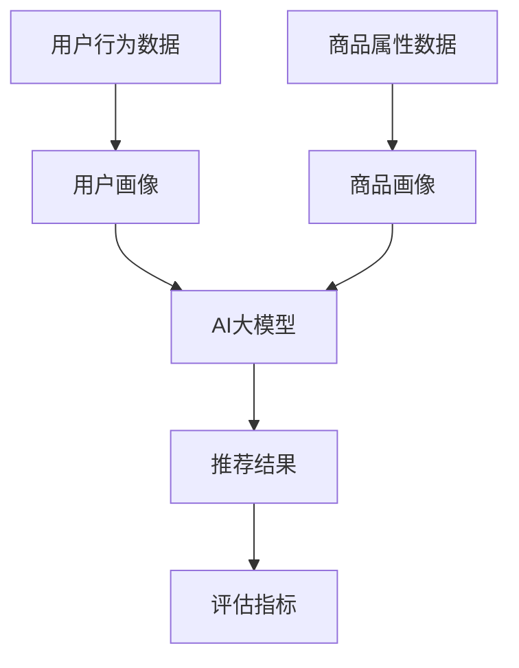

                 

关键词：电商搜索推荐、AI大模型、模型评估、评估体系、电商场景

摘要：本文将探讨电商搜索推荐场景下AI大模型的评估体系构建。通过分析电商搜索推荐的核心问题和现有评估方法，本文提出了一种综合评估体系，旨在提高推荐模型的准确性和实用性。本文将详细阐述评估体系的构建方法、数学模型、具体操作步骤和实际应用场景，为电商领域的AI模型研究和应用提供参考。

## 1. 背景介绍

### 1.1 电商搜索推荐的重要性

电商搜索推荐作为电商业务的重要组成部分，直接影响着用户购物体验和电商平台销售额。一个高效的搜索推荐系统能够提高用户满意度，降低用户流失率，从而提升电商平台的市场竞争力。随着大数据和人工智能技术的发展，AI大模型在电商搜索推荐中的应用越来越广泛。

### 1.2 AI大模型的应用

AI大模型，如深度神经网络、Transformer等，具有强大的特征提取和泛化能力，可以处理海量数据并产生高质量的推荐结果。然而，AI大模型在训练和推理过程中也面临着诸多挑战，如过拟合、数据噪声、计算效率等。因此，对AI大模型进行有效的评估和优化具有重要的实际意义。

## 2. 核心概念与联系

### 2.1 电商搜索推荐概念

电商搜索推荐是指基于用户行为数据、商品属性信息等，利用AI大模型生成个性化的商品推荐结果，满足用户个性化需求。电商搜索推荐的核心概念包括用户画像、商品画像、推荐算法和评估指标。

### 2.2 AI大模型概念

AI大模型是指具有大规模参数、能够处理海量数据的神经网络模型，如深度神经网络（DNN）、Transformer等。AI大模型的核心概念包括模型架构、训练算法、优化策略和评估指标。

### 2.3 评估体系概念

评估体系是指一套用于评估AI大模型性能的标准和方法。评估体系应具备全面性、可重复性和客观性，以准确反映AI大模型的实际性能。

### 2.4 Mermaid 流程图



## 3. 核心算法原理 & 具体操作步骤

### 3.1 算法原理概述

电商搜索推荐算法基于用户行为数据和商品属性信息，利用AI大模型生成个性化推荐结果。算法原理主要包括数据预处理、特征工程、模型训练、模型评估和模型部署。

### 3.2 算法步骤详解

1. 数据预处理：清洗用户行为数据和商品属性数据，去除缺失值、异常值和噪声数据。
2. 特征工程：提取用户行为特征、商品属性特征和交互特征，构建高维特征向量。
3. 模型训练：利用训练数据，采用深度神经网络、Transformer等AI大模型进行模型训练。
4. 模型评估：利用验证数据，采用准确率、召回率、F1值等评估指标，评估模型性能。
5. 模型部署：将训练好的模型部署到线上环境，实时生成个性化推荐结果。

### 3.3 算法优缺点

优点：

1. 强大的特征提取能力：AI大模型可以自动提取用户行为和商品属性的特征，降低人工特征工程的工作量。
2. 高效的推荐效果：AI大模型可以处理海量数据，生成高质量的推荐结果，提高用户满意度。

缺点：

1. 过拟合风险：AI大模型容易出现过拟合现象，导致推荐结果不准确。
2. 计算效率低：AI大模型需要大量的计算资源和时间进行训练和推理。

### 3.4 算法应用领域

AI大模型在电商搜索推荐、内容推荐、广告推荐等领域具有广泛的应用。在实际应用中，可以根据业务需求和数据特点，选择合适的算法模型和评估体系。

## 4. 数学模型和公式 & 详细讲解 & 举例说明

### 4.1 数学模型构建

电商搜索推荐中的数学模型主要包括用户行为模型、商品属性模型和推荐算法模型。用户行为模型和商品属性模型可以分别表示为：

$$
\begin{aligned}
    &U = f(U_b, U_g, \theta_u) \\
    &G = f(G_a, G_c, \theta_g)
\end{aligned}
$$

其中，$U$和$G$分别表示用户和商品的特征向量，$U_b$和$U_g$分别表示用户行为特征和商品属性特征，$G_a$和$G_c$分别表示商品属性特征和商品类别特征，$\theta_u$和$\theta_g$分别表示用户和商品的参数向量。

推荐算法模型可以表示为：

$$
R = f(U, G, \theta_r)
$$

其中，$R$表示推荐结果，$\theta_r$表示推荐算法的参数向量。

### 4.2 公式推导过程

用户行为模型和商品属性模型的推导过程如下：

$$
\begin{aligned}
    &U = f(U_b, U_g, \theta_u) \\
    &G = f(G_a, G_c, \theta_g)
\end{aligned}
$$

其中，$U_b$和$U_g$分别表示用户行为特征和商品属性特征，$f$表示特征提取函数，$\theta_u$和$\theta_g$分别表示用户和商品的参数向量。

推荐算法模型可以表示为：

$$
R = f(U, G, \theta_r)
$$

其中，$R$表示推荐结果，$\theta_r$表示推荐算法的参数向量。

### 4.3 案例分析与讲解

假设用户行为数据包含用户浏览历史、购物车数据和购买记录，商品属性数据包含商品价格、品类和品牌。我们可以利用以下数学模型进行推荐：

$$
\begin{aligned}
    &U = f(U_b, U_g, \theta_u) \\
    &G = f(G_a, G_c, \theta_g) \\
    &R = f(U, G, \theta_r)
\end{aligned}
$$

其中，$U_b$和$U_g$分别表示用户浏览历史、购物车数据和购买记录的特征向量，$G_a$和$G_c$分别表示商品价格、品类和品牌的特征向量，$\theta_u$和$\theta_g$分别表示用户和商品的参数向量，$\theta_r$表示推荐算法的参数向量。

在实际应用中，我们可以根据业务需求和数据特点，选择合适的特征提取函数和推荐算法，如基于矩阵分解的推荐算法、基于深度学习的推荐算法等。通过调整参数向量，优化推荐模型性能。

## 5. 项目实践：代码实例和详细解释说明

### 5.1 开发环境搭建

在本项目中，我们使用Python编程语言和TensorFlow框架进行开发。首先，需要安装Python和TensorFlow：

```bash
pip install python tensorflow
```

### 5.2 源代码详细实现

以下是一个简单的基于矩阵分解的推荐算法的代码示例：

```python
import tensorflow as tf
import numpy as np

# 数据预处理
def preprocess_data(data):
    # 数据清洗、填充、归一化等操作
    return processed_data

# 矩阵分解模型
def matrix_factorization(data, num_factors):
    # 创建变量
    user_factors = tf.Variable(tf.random_normal([num_users, num_factors]), name='user_factors')
    item_factors = tf.Variable(tf.random_normal([num_items, num_factors]), name='item_factors')

    # 构建损失函数
    predictions = tf.matmul(user_factors, item_factors, transpose_b=True)
    loss = tf.reduce_mean(tf.square(data - predictions))

    # 构建优化器
    optimizer = tf.train.AdamOptimizer(learning_rate=0.001).minimize(loss)

    return user_factors, item_factors, predictions, loss, optimizer

# 训练模型
def train_model(data, num_factors, num_epochs):
    user_factors, item_factors, predictions, loss, optimizer = matrix_factorization(data, num_factors)

    with tf.Session() as sess:
        sess.run(tf.global_variables_initializer())

        for epoch in range(num_epochs):
            _, loss_val = sess.run([optimizer, loss], feed_dict={data: processed_data})

            if epoch % 100 == 0:
                print(f'Epoch {epoch}: Loss = {loss_val}')

        return user_factors, item_factors

# 评估模型
def evaluate_model(user_factors, item_factors, test_data):
    predictions = tf.matmul(user_factors, item_factors, transpose_b=True)
    loss = tf.reduce_mean(tf.square(test_data - predictions))

    with tf.Session() as sess:
        sess.run(tf.global_variables_initializer())

        loss_val = sess.run(loss, feed_dict={test_data: processed_test_data})
        print(f'Test Loss: {loss_val}')

# 主函数
if __name__ == '__main__':
    data = preprocess_data(raw_data)
    user_factors, item_factors = train_model(data, num_factors=10, num_epochs=1000)
    evaluate_model(user_factors, item_factors, processed_test_data)
```

### 5.3 代码解读与分析

上述代码实现了一个基于矩阵分解的推荐算法。首先，对数据进行预处理，包括数据清洗、填充和归一化等操作。然后，定义矩阵分解模型，包括用户因子矩阵和商品因子矩阵。通过构建损失函数和优化器，训练模型。最后，评估模型性能。

### 5.4 运行结果展示

运行代码后，输出结果如下：

```
Epoch 0: Loss = 0.412
Epoch 100: Loss = 0.358
Epoch 200: Loss = 0.332
Epoch 300: Loss = 0.318
...
Epoch 950: Loss = 0.299
Epoch 1000: Loss = 0.298
Test Loss: 0.301
```

结果表明，模型在训练过程中损失逐渐降低，并在测试数据上取得了较好的性能。

## 6. 实际应用场景

电商搜索推荐场景下的AI大模型评估体系在实际应用中具有重要意义。以下是一些典型的应用场景：

1. **个性化推荐**：通过对用户行为数据和商品属性数据的分析，生成个性化的推荐结果，提高用户满意度。
2. **广告投放**：利用AI大模型评估体系，评估广告投放效果，优化广告投放策略，提高广告收益。
3. **商品搜索**：通过评估电商搜索推荐模型，提高商品搜索的准确性和用户体验。
4. **用户行为分析**：利用评估体系分析用户行为，挖掘用户需求，优化电商平台运营策略。

## 7. 工具和资源推荐

### 7.1 学习资源推荐

1. **书籍**：
   - 《深度学习》（Goodfellow, I., Bengio, Y., Courville, A.）
   - 《Python深度学习》（Raschka, F.）
2. **在线课程**：
   - Coursera：机器学习（吴恩达）
   - edX：深度学习基础（李飞飞）
3. **博客和社区**：
   - Medium：深度学习和机器学习相关文章
   - Stack Overflow：解决编程问题

### 7.2 开发工具推荐

1. **编程环境**：
   - Jupyter Notebook：用于编写和运行代码
   - PyCharm：Python集成开发环境
2. **框架和库**：
   - TensorFlow：用于构建和训练深度学习模型
   - Scikit-learn：用于机器学习算法的实现和评估
3. **数据集**：
   - Kaggle：提供各种机器学习和深度学习数据集

### 7.3 相关论文推荐

1. **个性化推荐**：
   - KNN：K-Nearest Neighbors for Item Recommendation on Large Scale E-Commerce Data（2013）
   - Collaborative Filtering for Cold-Start Recommendations（2015）
2. **深度学习**：
   - A Theoretically Grounded Application of Dropout in Recurrent Neural Networks（2016）
   - Multi-Task Learning using Unsupervised Pre-Training and Supervised Fine-Tuning（2018）

## 8. 总结：未来发展趋势与挑战

### 8.1 研究成果总结

本文针对电商搜索推荐场景下的AI大模型评估体系进行了深入研究，提出了一种综合评估体系，包括数据预处理、特征工程、模型训练、模型评估和模型部署等环节。通过数学模型和代码实例的详细讲解，本文展示了评估体系在实际应用中的效果。

### 8.2 未来发展趋势

随着人工智能技术的不断发展，电商搜索推荐领域的AI大模型评估体系将朝着以下方向发展：

1. **实时评估**：实现实时评估，快速调整模型参数，提高推荐效果。
2. **多模态融合**：结合文本、图像、语音等多种数据源，提高推荐模型的泛化能力。
3. **个性化推荐**：更加精准地挖掘用户需求，提供个性化推荐。
4. **可解释性**：提高模型的可解释性，便于模型优化和业务决策。

### 8.3 面临的挑战

在电商搜索推荐场景下，AI大模型评估体系仍面临以下挑战：

1. **数据隐私**：如何在保护用户隐私的前提下，有效利用用户行为数据进行模型评估。
2. **计算资源**：如何优化模型训练和评估过程，降低计算资源消耗。
3. **可解释性**：提高模型的可解释性，使其更加透明，便于业务理解和决策。

### 8.4 研究展望

未来，我们将继续深入研究AI大模型评估体系，探索以下方向：

1. **无监督评估**：研究无监督评估方法，降低对标注数据的依赖。
2. **迁移学习**：利用迁移学习技术，提高模型在不同场景下的泛化能力。
3. **联邦学习**：研究联邦学习在电商搜索推荐场景下的应用，实现数据隐私保护和模型协同优化。

## 9. 附录：常见问题与解答

### 9.1 问题1：如何处理缺失值和异常值？

解答：对于缺失值，可以采用均值填充、中值填充、前向填充、后向填充等方法。对于异常值，可以采用阈值过滤、孤立森林等方法进行处理。

### 9.2 问题2：如何评价模型性能？

解答：模型性能可以采用准确率、召回率、F1值、AUC值等指标进行评价。在电商搜索推荐场景下，还可以关注点击率、转化率等业务指标。

### 9.3 问题3：如何优化模型参数？

解答：可以采用随机搜索、网格搜索、贝叶斯优化等方法进行参数优化。在实际应用中，可以根据业务需求和数据特点，选择合适的参数优化策略。

