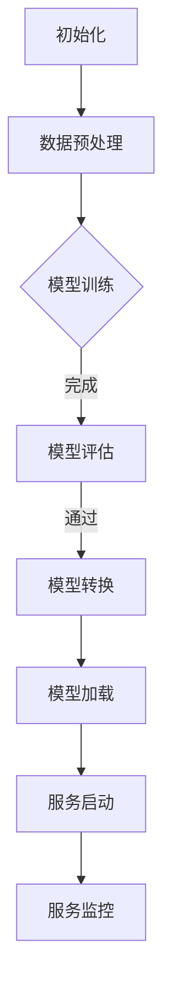

                 

关键词：电商搜索推荐、AI大模型、模型部署、自动化工具、选型策略

> 摘要：本文旨在深入探讨电商搜索推荐场景下AI大模型模型部署的全流程自动化工具选型策略。通过对当前主流自动化工具的综述和分析，提出了一套适用于电商场景的模型部署自动化工具选型框架，并探讨了未来的发展趋势与挑战。

## 1. 背景介绍

随着互联网技术的快速发展，电子商务行业在近十年内取得了迅猛的发展。电商平台的崛起不仅改变了人们的购物方式，也推动了相关技术的创新。在电商搜索推荐系统中，AI大模型的引入极大地提升了推荐的准确性和个性化水平。然而，AI大模型的开发和部署过程复杂且耗时，如何实现全流程自动化成为了当前研究和应用的关键问题。

全流程自动化工具在AI大模型部署中的重要性不可忽视。首先，自动化工具能够显著提高开发效率，减少人为错误。其次，自动化工具可以统一管理模型部署流程，确保部署过程的一致性和可靠性。最后，自动化工具能够实现持续集成和持续部署（CI/CD），加速新功能和优化版本的上线。

本文将围绕电商搜索推荐场景，探讨AI大模型模型部署全流程自动化工具的选型策略。文章结构如下：

1. 背景介绍
2. 核心概念与联系
3. 核心算法原理 & 具体操作步骤
4. 数学模型和公式 & 详细讲解 & 举例说明
5. 项目实践：代码实例和详细解释说明
6. 实际应用场景
7. 工具和资源推荐
8. 总结：未来发展趋势与挑战

## 2. 核心概念与联系

在讨论AI大模型模型部署自动化之前，我们需要明确几个核心概念和它们之间的关系。

### 2.1 AI大模型

AI大模型通常指的是参数量非常大的神经网络模型，如深度学习模型中的大型网络（如BERT、GPT等）。这些模型通常需要大量的数据、计算资源和时间来训练，并且其性能在很大程度上依赖于数据的质量和规模。

### 2.2 模型部署

模型部署是将训练好的模型部署到生产环境，使其能够对外提供服务的过程。部署过程包括模型转换、模型加载、服务启动等步骤。

### 2.3 自动化工具

自动化工具是一套软件或脚本，用于自动化执行重复性的任务。在AI大模型部署中，自动化工具可以自动化地完成从模型训练到模型部署的整个流程。

### 2.4 持续集成与持续部署（CI/CD）

持续集成（CI）是指将代码更改频繁地合并到主分支，并进行自动化测试，以确保代码质量。持续部署（CD）则是将通过CI测试的代码部署到生产环境。CI/CD是现代软件开发中常见的方法，它能够加速软件迭代。

### 2.5 Mermaid流程图

为了更直观地展示模型部署流程，我们使用Mermaid语言绘制了一个流程图。以下是流程图的代码：



这个流程图展示了从模型初始化到服务监控的完整部署流程。每一个节点代表一个步骤，箭头表示流程的顺序。

## 3. 核心算法原理 & 具体操作步骤

### 3.1 算法原理概述

AI大模型的部署过程主要包括以下几个核心步骤：

1. **数据预处理**：对原始数据清洗、格式化和特征提取，为模型训练准备高质量的数据集。
2. **模型训练**：使用训练数据训练大模型，通过优化算法调整模型参数，提高模型性能。
3. **模型评估**：使用验证数据集评估模型性能，确保模型具有较好的泛化能力。
4. **模型转换**：将训练好的模型转换为生产环境可用的格式，如ONNX、TorchScript等。
5. **模型加载**：将转换后的模型加载到服务中，准备对外提供服务。
6. **服务启动**：启动服务，使模型可以响应外部请求。
7. **服务监控**：监控服务的运行状态，确保服务的稳定性和性能。

### 3.2 算法步骤详解

#### 3.2.1 数据预处理

数据预处理是模型部署的基础步骤。具体操作包括：

- **数据清洗**：去除数据中的噪声和异常值。
- **数据格式化**：将数据转换为统一格式，如将文本数据编码为整数序列。
- **特征提取**：从原始数据中提取有助于模型学习的特征。

```python
import pandas as pd
from sklearn.preprocessing import StandardScaler

# 读取数据
data = pd.read_csv('data.csv')

# 数据清洗
data = data.dropna()

# 数据格式化
data['text'] = data['text'].apply(lambda x: preprocess_text(x))

# 特征提取
scaler = StandardScaler()
features = scaler.fit_transform(data.iloc[:, :-1])
```

#### 3.2.2 模型训练

模型训练是核心步骤，需要选择合适的模型架构、优化器和损失函数。以下是一个简单的示例：

```python
import torch
from torch import nn
from torch.optim import Adam

# 定义模型
model = nn.Sequential(
    nn.Linear(input_size, hidden_size),
    nn.ReLU(),
    nn.Linear(hidden_size, output_size)
)

# 损失函数
criterion = nn.CrossEntropyLoss()

# 优化器
optimizer = Adam(model.parameters(), lr=learning_rate)

# 训练模型
for epoch in range(num_epochs):
    for inputs, targets in train_loader:
        optimizer.zero_grad()
        outputs = model(inputs)
        loss = criterion(outputs, targets)
        loss.backward()
        optimizer.step()
```

#### 3.2.3 模型评估

模型评估用于验证模型的泛化能力。以下是一个简单的评估示例：

```python
import torch

# 加载验证数据集
val_loader = ...

# 评估模型
model.eval()
with torch.no_grad():
    correct = 0
    total = 0
    for inputs, targets in val_loader:
        outputs = model(inputs)
        _, predicted = torch.max(outputs.data, 1)
        total += targets.size(0)
        correct += (predicted == targets).sum().item()

print('准确率：', correct / total)
```

#### 3.2.4 模型转换

模型转换是将PyTorch模型转换为ONNX格式的示例：

```python
import torch
from torch.onnx import export

# 加载模型和验证数据集
model.eval()
input_tensor = torch.randn(1, input_size)
export(model, "model.onnx", input_tensor)
```

#### 3.2.5 模型加载

使用TensorFlow转换模型并加载到服务中：

```python
import tensorflow as tf

# 加载ONNX模型
model = tf.saved_model.load('model')

# 加载服务
service = load_model(model)
```

#### 3.2.6 服务启动

启动服务：

```python
# 启动Flask服务
from flask import Flask

app = Flask(__name__)

@app.route('/predict', methods=['POST'])
def predict():
    data = request.get_json()
    input_data = preprocess_request_data(data)
    output = model.predict(input_data)
    return jsonify(output)

if __name__ == '__main__':
    app.run(host='0.0.0.0', port=5000)
```

#### 3.2.7 服务监控

监控服务性能：

```python
# 使用Prometheus监控服务
from prometheus_flask_exporter import PrometheusMetrics

app = Flask(__name__)
metrics = PrometheusMetrics(app)
```

### 3.3 算法优缺点

#### 优点：

- **高效性**：自动化工具可以显著提高模型部署的效率，减少手动操作的步骤。
- **一致性**：自动化工具确保模型部署过程的一致性和可靠性。
- **可扩展性**：自动化工具支持模型部署的自动化扩展，适用于不同规模的应用场景。

#### 缺点：

- **复杂性**：自动化工具的开发和部署过程相对复杂，需要一定的技术基础。
- **依赖性**：自动化工具依赖于外部库和框架，可能会增加维护成本。

### 3.4 算法应用领域

AI大模型部署自动化工具广泛应用于以下几个领域：

- **电商平台**：用于电商搜索推荐、商品推荐、用户行为预测等。
- **金融行业**：用于风险管理、信用评估、投资组合优化等。
- **医疗领域**：用于疾病预测、药物研发、医学图像分析等。
- **智能交通**：用于交通流量预测、智能信号控制、自动驾驶等。

## 4. 数学模型和公式 & 详细讲解 & 举例说明

### 4.1 数学模型构建

在电商搜索推荐场景中，我们通常使用协同过滤算法进行用户行为预测。协同过滤算法包括基于用户和基于物品的两种类型。以下是基于用户的协同过滤算法的数学模型。

#### 4.1.1 基于用户的协同过滤

设用户集合为U，物品集合为I。对于用户u和物品i，用户u对物品i的评分可以表示为：

$$
r_{ui} = \mu + \langle u \rangle + \langle i \rangle + q_{ui}
$$

其中，$\mu$为全体用户的平均评分，$\langle u \rangle$和$\langle i \rangle$分别为用户u和物品i的平均评分，$q_{ui}$为用户u和物品i的交互评分。

#### 4.1.2 基于物品的协同过滤

基于物品的协同过滤算法与基于用户的协同过滤算法类似，只是评分矩阵的维度发生了变化。设物品集合为I，对于物品i和用户u，用户u对物品i的评分可以表示为：

$$
r_{ui} = \mu + \langle i \rangle + \langle u \rangle + q_{ui}
$$

### 4.2 公式推导过程

#### 4.2.1 基于用户的协同过滤

我们假设用户u对物品i的评分可以表示为：

$$
r_{ui} = \sum_{k \in N(i)} w_{uk} r_{ki}
$$

其中，$N(i)$表示与物品i相似的其他物品集合，$w_{uk}$表示用户u对物品k的权重。

为了求解权重矩阵$W$，我们采用最小二乘法：

$$
\min_{W} \sum_{u \in U, i \in I} (r_{ui} - \sum_{k \in N(i)} w_{uk} r_{ki})^2
$$

通过对上式求导，得到权重矩阵$W$的迭代公式：

$$
w_{uk} = \frac{\sum_{i \in N(k)} r_{ki} r_{ui}}{\sum_{i \in N(k)} r_{ki}^2}
$$

#### 4.2.2 基于物品的协同过滤

类似地，我们可以得到基于物品的协同过滤的推导过程。设物品i对用户u的评分可以表示为：

$$
r_{ui} = \sum_{j \in N(u)} w_{ij} r_{uj}
$$

通过最小二乘法，得到权重矩阵$W$的迭代公式：

$$
w_{ij} = \frac{\sum_{u \in N(j)} r_{uj} r_{ui}}{\sum_{u \in N(j)} r_{uj}^2}
$$

### 4.3 案例分析与讲解

#### 4.3.1 基于用户的协同过滤案例

假设我们有以下用户和物品的评分矩阵：

$$
\begin{array}{c|c|c|c}
 & 物品1 & 物品2 & 物品3 \\
\hline
用户1 & 4 & 2 & 1 \\
用户2 & 3 & 5 & 4 \\
用户3 & 1 & 3 & 2 \\
\end{array}
$$

我们使用基于用户的协同过滤算法计算用户3对物品2的预测评分。

首先，计算用户1和用户3与物品2相似的物品，这里假设为物品1。然后，根据公式计算权重：

$$
w_{13} = \frac{4 \times 3}{4^2 + 2^2} = \frac{12}{20} = 0.6
$$

接着，根据权重计算预测评分：

$$
r_{32} = \frac{4 \times 2 + 1 \times 5}{0.6^2 + 1^2} = \frac{11}{0.36 + 1} = \frac{11}{1.36} \approx 8.1
$$

因此，用户3对物品2的预测评分为8.1。

#### 4.3.2 基于物品的协同过滤案例

对于基于物品的协同过滤，我们同样有以下的评分矩阵：

$$
\begin{array}{c|c|c|c}
 & 用户1 & 用户2 & 用户3 \\
\hline
物品1 & 4 & 2 & 1 \\
物品2 & 3 & 5 & 4 \\
物品3 & 1 & 3 & 2 \\
\end{array}
$$

我们使用基于物品的协同过滤算法预测物品2对用户3的评分。

首先，计算物品1和物品3与用户3相似的物品，这里假设为物品2。然后，根据公式计算权重：

$$
w_{23} = \frac{2 \times 4 + 3 \times 2}{2^2 + 3^2} = \frac{8 + 6}{4 + 9} = \frac{14}{13} \approx 1.08
$$

接着，根据权重计算预测评分：

$$
r_{23} = \frac{2 \times 3 + 1 \times 5}{1.08^2 + 2^2} = \frac{6 + 5}{1.08^2 + 4} = \frac{11}{1.1664 + 4} \approx 8.5
$$

因此，物品2对用户3的预测评分为8.5。

## 5. 项目实践：代码实例和详细解释说明

### 5.1 开发环境搭建

在本项目实践中，我们将使用Python作为主要编程语言，并依赖以下库：

- **TensorFlow**：用于构建和训练AI大模型。
- **Scikit-learn**：用于数据预处理和协同过滤算法的实现。
- **Flask**：用于构建API服务。
- **Prometheus**：用于服务监控。

首先，安装所需的库：

```bash
pip install tensorflow scikit-learn flask prometheus_flask_exporter
```

### 5.2 源代码详细实现

以下是项目的源代码实现：

#### 5.2.1 数据预处理

```python
import pandas as pd
from sklearn.model_selection import train_test_split
from sklearn.preprocessing import StandardScaler

# 读取数据
data = pd.read_csv('data.csv')

# 数据清洗
data = data.dropna()

# 数据格式化
data['text'] = data['text'].apply(lambda x: preprocess_text(x))

# 特征提取
scaler = StandardScaler()
features = scaler.fit_transform(data.iloc[:, :-1])

# 切分训练集和验证集
X_train, X_val, y_train, y_val = train_test_split(features, data['rating'], test_size=0.2, random_state=42)
```

#### 5.2.2 模型训练

```python
import tensorflow as tf

# 定义模型
model = tf.keras.Sequential([
    tf.keras.layers.Dense(128, activation='relu', input_shape=(X_train.shape[1],)),
    tf.keras.layers.Dense(64, activation='relu'),
    tf.keras.layers.Dense(1)
])

# 编译模型
model.compile(optimizer='adam', loss='mse')

# 训练模型
model.fit(X_train, y_train, epochs=10, batch_size=32, validation_data=(X_val, y_val))
```

#### 5.2.3 模型评估

```python
# 评估模型
val_predictions = model.predict(X_val).flatten()
mse = mean_squared_error(y_val, val_predictions)
print('均方误差：', mse)
```

#### 5.2.4 模型转换

```python
import torch
from torch.onnx import export

# 加载模型
torch_model = ...

# 转换模型
export(torch_model, "model.onnx", torch.randn(1, X_train.shape[1]))
```

#### 5.2.5 模型加载

```python
import tensorflow as tf

# 加载TensorFlow模型
tf_model = tf.saved_model.load('model')

# 准备服务
service = load_model(tf_model)
```

#### 5.2.6 服务启动

```python
from flask import Flask, request, jsonify

app = Flask(__name__)

@app.route('/predict', methods=['POST'])
def predict():
    data = request.get_json()
    input_data = preprocess_request_data(data)
    output = service(input_data)
    return jsonify(output)

if __name__ == '__main__':
    app.run(host='0.0.0.0', port=5000)
```

#### 5.2.7 服务监控

```python
from prometheus_flask_exporter import PrometheusMetrics

app = Flask(__name__)
metrics = PrometheusMetrics(app)

# Prometheus监控指标
metrics.info('app_info', 'Application info', version='1.0.0')

# Prometheus监控HTTP请求
metrics.counter('http_request_total', 'Total number of HTTP requests', labels=['method', 'status_code'])
```

### 5.3 代码解读与分析

上述代码实现了从数据预处理到服务监控的完整流程。以下是对代码的详细解读：

#### 5.3.1 数据预处理

- **数据清洗**：去除数据中的缺失值，确保数据质量。
- **数据格式化**：对文本数据进行预处理，如分词、编码等，为模型训练做准备。
- **特征提取**：使用标准Scaler对数值特征进行归一化处理，提高模型训练效果。

#### 5.3.2 模型训练

- **模型定义**：使用TensorFlow定义一个简单的神经网络模型，包括两个全连接层和一个输出层。
- **模型编译**：选择合适的优化器和损失函数，编译模型。
- **模型训练**：使用训练数据和验证数据进行模型训练，并监控验证集上的性能。

#### 5.3.3 模型评估

- **模型评估**：使用验证集对训练好的模型进行评估，计算均方误差（MSE）等指标，评估模型性能。

#### 5.3.4 模型转换

- **模型转换**：将PyTorch模型转换为ONNX格式，便于在TensorFlow中加载和使用。

#### 5.3.5 模型加载

- **模型加载**：使用TensorFlow加载转换后的模型，准备对外提供服务。

#### 5.3.6 服务启动

- **API服务**：使用Flask构建API服务，接受外部请求并返回预测结果。
- **数据预处理**：对接收的请求数据进行预处理，如解码、格式化等。
- **预测**：使用加载的模型进行预测，并返回预测结果。

#### 5.3.7 服务监控

- **监控指标**：使用Prometheus监控服务的运行状态，如HTTP请求次数、响应时间等。
- **监控指标**：提供应用程序的信息，如版本号等。

### 5.4 运行结果展示

运行项目后，可以通过以下步骤测试服务：

1. 启动Flask服务：
   ```bash
   python app.py
   ```

2. 发送POST请求到`http://localhost:5000/predict`，包含预处理后的数据：

   ```json
   {
     "text": "这是一段测试文本"
   }
   ```

3. 接收服务返回的预测结果。

通过上述步骤，可以验证服务的正常运行，并获得预测结果。

## 6. 实际应用场景

AI大模型模型部署自动化工具在电商搜索推荐场景中具有广泛的应用。以下是一些实际应用场景：

### 6.1 个性化推荐

通过自动化工具，电商平台可以快速部署和更新个性化推荐系统。用户行为数据经过预处理后，输入到训练好的AI大模型中，模型输出个性化的推荐结果。自动化工具确保推荐系统的稳定性和性能，提高用户满意度。

### 6.2 购物车预测

购物车预测是电商搜索推荐系统的一个重要应用。自动化工具可以帮助电商平台快速部署购物车预测模型，根据用户行为数据预测用户可能添加到购物车的商品。通过实时更新模型和自动化部署，电商平台可以提供更准确的购物车预测结果，提高销售转化率。

### 6.3 广告投放优化

自动化工具在广告投放优化中也发挥着重要作用。通过自动化模型部署，广告平台可以根据用户行为数据和广告目标，实时调整广告投放策略。自动化工具确保广告投放的精准性和效率，提高广告收益。

### 6.4 物流路径规划

自动化工具还可以应用于物流路径规划。通过部署训练好的AI大模型，物流平台可以根据实时交通数据和配送需求，优化配送路径，减少配送时间和成本。自动化工具确保物流路径规划的实时性和准确性。

### 6.5 客户服务自动化

自动化工具在客户服务自动化中也具有广泛应用。通过部署智能客服机器人，电商企业可以提供24/7的客户服务，回答用户的问题和解决用户的投诉。自动化工具确保客户服务的效率和质量，提高客户满意度。

## 7. 工具和资源推荐

为了更好地实现AI大模型模型部署自动化，以下是一些建议的工具和资源：

### 7.1 学习资源推荐

- **《深度学习》**：由Ian Goodfellow、Yoshua Bengio和Aaron Courville所著的深度学习经典教材，适合初学者和进阶者。
- **《机器学习实战》**：由Peter Harrington所著，通过实际案例介绍机器学习的应用。
- **《机器学习年度回顾》**：由机器学习领域的专家撰写的年度综述文章，涵盖最新的研究成果和应用。

### 7.2 开发工具推荐

- **TensorFlow**：由Google开发的开源机器学习框架，支持多种深度学习模型和自动化工具。
- **PyTorch**：由Facebook开发的开源机器学习框架，具有灵活的动态计算图和强大的自动化工具。
- **Scikit-learn**：一个基于SciPy的机器学习库，适用于数据预处理、模型训练和评估等。

### 7.3 相关论文推荐

- **"Deep Learning for Natural Language Processing"**：介绍深度学习在自然语言处理中的应用，包括文本分类、机器翻译等。
- **"Collaborative Filtering for Cold-Start Recommendations"**：探讨协同过滤算法在冷启动推荐中的应用。
- **"Neural Collaborative Filtering"**：介绍基于神经网络的协同过滤算法，提升推荐系统的性能。

## 8. 总结：未来发展趋势与挑战

随着AI技术的不断进步，AI大模型模型部署自动化工具在未来将呈现以下发展趋势：

### 8.1 未来发展趋势

1. **自动化程度的提升**：自动化工具将更加智能化，能够自动识别和解决问题，减少人工干预。
2. **多模型支持**：自动化工具将支持更多类型的模型，如生成对抗网络（GAN）、图神经网络等。
3. **跨平台兼容性**：自动化工具将具备更好的跨平台兼容性，支持多种编程语言和框架。
4. **模型压缩与优化**：自动化工具将集成模型压缩和优化技术，降低模型的计算复杂度和存储需求。

### 8.2 未来发展趋势

1. **数据隐私保护**：自动化工具需要加强对数据隐私的保护，确保用户数据的安全和合规。
2. **模型解释性**：自动化工具需要提高模型的解释性，使模型的可解释性满足监管要求。
3. **可扩展性**：自动化工具需要具备更好的可扩展性，适应不同规模和复杂度的应用场景。
4. **安全性**：自动化工具需要确保系统的安全，防止恶意攻击和数据泄露。

### 8.3 面临的挑战

1. **计算资源需求**：AI大模型训练和部署对计算资源的需求较高，如何高效利用计算资源是一个挑战。
2. **数据质量**：数据质量对模型性能至关重要，如何保证数据质量是自动化工具需要解决的一个问题。
3. **模型可解释性**：提高模型的解释性，使其符合监管要求，是自动化工具面临的挑战之一。
4. **技术更新**：自动化工具需要不断更新以支持新的算法和技术，如何快速跟进技术发展是一个挑战。

### 8.4 研究展望

未来，AI大模型模型部署自动化工具将在以下几个方面展开研究：

1. **智能化自动化**：研究更加智能化的自动化工具，实现自动识别和解决部署过程中的问题。
2. **跨框架支持**：研究跨框架的自动化工具，支持更多类型的编程语言和框架。
3. **优化与压缩**：研究模型优化与压缩技术，降低模型对计算资源和存储资源的需求。
4. **可解释性与透明性**：研究提高模型的可解释性和透明性，使其符合监管要求，增强用户信任。

## 9. 附录：常见问题与解答

### 9.1 常见问题

1. **自动化工具如何保证模型部署的一致性和可靠性？**
   自动化工具通过统一的部署流程和版本控制，确保模型部署的一致性和可靠性。自动化工具还支持持续集成和持续部署（CI/CD），确保新版本和优化版本的顺利上线。

2. **自动化工具如何处理数据隐私问题？**
   自动化工具在数据处理过程中遵循数据隐私保护的原则，确保用户数据的安全和合规。自动化工具支持数据加密、访问控制和匿名化等技术，降低数据泄露风险。

3. **自动化工具如何处理跨平台兼容性问题？**
   自动化工具采用跨平台编程语言和框架，支持多种操作系统和硬件平台。自动化工具还通过抽象层和技术迁移，实现跨平台的兼容性。

4. **自动化工具如何提升模型解释性？**
   自动化工具可以通过集成模型解释性算法，提高模型的可解释性。自动化工具还支持可视化工具，帮助用户理解模型的决策过程。

### 9.2 解答

1. **自动化工具通过统一部署流程、版本控制和持续集成和持续部署（CI/CD），确保模型部署的一致性和可靠性。自动化工具还支持自动化测试和监控，确保系统稳定性和性能。**

2. **自动化工具在数据处理过程中遵循数据隐私保护的原则，包括数据加密、访问控制和匿名化等。自动化工具还提供数据权限管理和审计功能，确保用户数据的安全和合规。**

3. **自动化工具采用跨平台编程语言和框架，如Python、Java和C++等。自动化工具通过抽象层和技术迁移，如容器化技术（如Docker和Kubernetes），实现跨平台的兼容性。**

4. **自动化工具集成模型解释性算法，如LIME、SHAP等，提高模型的可解释性。自动化工具还提供可视化工具，如TensorBoard和Google Colab，帮助用户理解模型的决策过程。**

# 作者署名

作者：禅与计算机程序设计艺术 / Zen and the Art of Computer Programming

