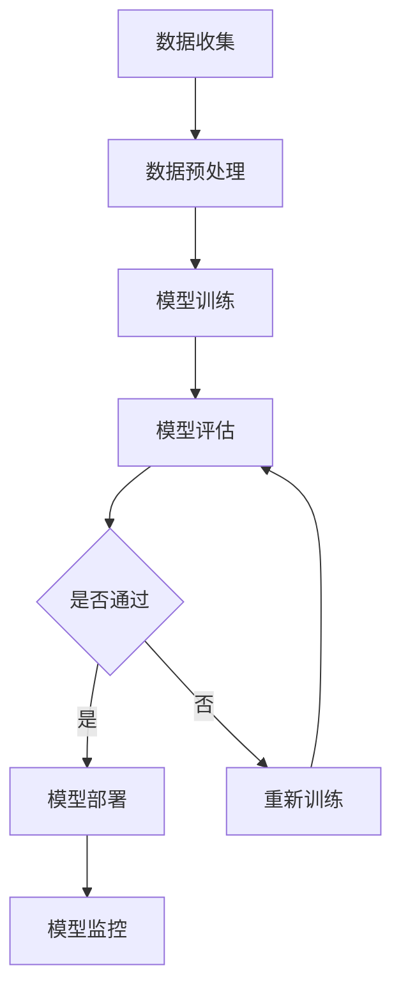

                 

关键词：电商搜索、推荐系统、AI大模型、部署监控、平台搭建

摘要：本文将探讨在电商搜索推荐场景下，如何构建一个高效、可靠的AI大模型模型部署监控平台。文章将从背景介绍、核心概念与联系、核心算法原理、数学模型和公式、项目实践、实际应用场景、工具和资源推荐以及未来发展趋势与挑战等方面，系统性地阐述该平台的搭建方案。

## 1. 背景介绍

随着互联网的快速发展，电商行业已经成为了数字经济的重要支柱。在电商搜索推荐系统中，AI大模型的应用越来越广泛，如深度学习、自然语言处理等技术的引入，极大地提升了推荐的准确性和用户体验。然而，AI大模型的部署和监控成为了一个复杂且关键的问题。一方面，模型部署需要确保其运行稳定、性能优异；另一方面，监控平台需要实时获取模型的运行状态、性能指标，以便进行及时调整和优化。

本文将针对电商搜索推荐场景，探讨如何构建一个AI大模型模型部署监控平台，以满足实际应用的需求。

## 2. 核心概念与联系

### 2.1 电商搜索推荐系统

电商搜索推荐系统是指通过分析用户的搜索行为、购买记录等数据，为用户推荐相关的商品或服务。其核心功能包括：搜索查询、推荐算法、用户行为分析等。

### 2.2 AI大模型

AI大模型是指基于深度学习、自然语言处理等技术构建的大型神经网络模型，如BERT、GPT等。这些模型具有强大的表征能力和泛化能力，可以应用于各种场景，包括电商搜索推荐。

### 2.3 模型部署与监控

模型部署是指将训练好的模型部署到生产环境中，使其能够为用户提供服务。模型监控是指对模型的运行状态、性能指标进行实时监控，以便进行故障排查和性能优化。

### 2.4 Mermaid 流程图

以下是AI大模型部署监控平台的 Mermaid 流程图，展示了各个关键步骤和模块之间的联系：



## 3. 核心算法原理 & 具体操作步骤

### 3.1 算法原理概述

本文所涉及的算法主要包括深度学习、自然语言处理等AI技术。深度学习是一种基于多层神经网络的学习方法，通过逐层抽象特征，实现从原始数据到高级抽象的转化。自然语言处理则是一种使计算机能够理解和生成人类语言的技术，包括文本分类、命名实体识别、情感分析等。

### 3.2 算法步骤详解

以下是AI大模型部署监控平台的具体操作步骤：

1. 数据收集：从电商平台上获取用户的搜索记录、购买记录等数据。

2. 数据预处理：对数据进行清洗、归一化等处理，以便于后续的模型训练。

3. 模型训练：使用深度学习和自然语言处理技术，对预处理后的数据集进行模型训练。

4. 模型评估：对训练好的模型进行评估，包括准确率、召回率、F1值等指标。

5. 模型部署：将评估通过后的模型部署到生产环境中，为用户提供服务。

6. 模型监控：对模型的运行状态、性能指标进行实时监控，包括延迟、错误率等。

### 3.3 算法优缺点

- 深度学习：优点是能够自动提取特征，提高模型的泛化能力；缺点是训练过程复杂，对计算资源要求较高。
- 自然语言处理：优点是能够处理文本数据，实现文本分类、命名实体识别等功能；缺点是数据处理复杂，需要大量标注数据。

### 3.4 算法应用领域

AI大模型可以应用于电商搜索推荐、内容推荐、社交媒体分析等多种场景。本文主要关注电商搜索推荐场景，旨在为电商平台提供更精准、个性化的推荐服务。

## 4. 数学模型和公式 & 详细讲解 & 举例说明

### 4.1 数学模型构建

在电商搜索推荐场景中，可以使用矩阵分解、协同过滤等数学模型来构建推荐算法。以下是一个简化的协同过滤模型：

$$
R_{ui} = \mu_u + \mu_i + q_u^T p_i + b_u + b_i + \epsilon_{ui}
$$

其中，$R_{ui}$表示用户$u$对物品$i$的评分，$\mu_u$和$\mu_i$分别表示用户$u$和物品$i$的均值，$q_u$和$p_i$分别表示用户$u$和物品$i$的潜在因子向量，$b_u$和$b_i$分别表示用户$u$和物品$i$的偏置，$\epsilon_{ui}$表示误差项。

### 4.2 公式推导过程

协同过滤模型的推导过程主要涉及线性回归和矩阵分解。具体推导过程如下：

首先，假设用户$u$和物品$i$的评分可以用两个向量$q_u$和$p_i$表示：

$$
R_{ui} = q_u^T p_i + \epsilon_{ui}
$$

为了提高模型的泛化能力，可以引入用户和物品的偏置项：

$$
R_{ui} = q_u^T p_i + b_u + b_i + \epsilon_{ui}
$$

接下来，通过矩阵分解的方法，将用户和物品的潜在因子向量表示为两个低秩矩阵的乘积：

$$
q_u = Q \cdot \text{diag}(q_u^*) \cdot P^T
$$

$$
p_i = P \cdot \text{diag}(p_i^*) \cdot Q^T
$$

其中，$Q$和$P$分别表示用户和物品的潜在因子矩阵，$q_u^*$和$p_i^*$分别表示用户和物品的潜在因子向量。

将矩阵分解后的表达式代入原始公式，得到：

$$
R_{ui} = (Q \cdot \text{diag}(q_u^*) \cdot P^T) \cdot (P \cdot \text{diag}(p_i^*) \cdot Q^T) + b_u + b_i + \epsilon_{ui}
$$

进一步化简，得到：

$$
R_{ui} = \mu_u + \mu_i + q_u^T p_i + b_u + b_i + \epsilon_{ui}
$$

### 4.3 案例分析与讲解

假设有一个电商平台，用户对1000个商品进行了评分。我们可以使用上述协同过滤模型来预测用户对未知商品的评分。

首先，我们需要对用户和商品进行数据预处理，包括数据清洗、缺失值填充、归一化等操作。

接下来，使用矩阵分解的方法，将用户和商品的潜在因子矩阵表示为低秩矩阵的乘积。具体方法可以使用随机梯度下降（SGD）或者交替最小二乘法（ALS）进行优化。

最后，使用训练好的模型对未知商品的评分进行预测。假设用户$u=1$对商品$i=100$的评分未知，我们可以通过以下公式进行预测：

$$
R_{1,100} = \mu_1 + \mu_{100} + q_1^T p_{100} + b_1 + b_{100} + \epsilon_{1,100}
$$

其中，$\mu_1$和$\mu_{100}$分别表示用户$1$和商品$100$的均值，$q_1$和$p_{100}$分别表示用户$1$和商品$100$的潜在因子向量，$b_1$和$b_{100}$分别表示用户$1$和商品$100$的偏置，$\epsilon_{1,100}$表示误差项。

## 5. 项目实践：代码实例和详细解释说明

### 5.1 开发环境搭建

在搭建AI大模型模型部署监控平台之前，我们需要搭建一个合适的开发环境。本文选用Python作为主要编程语言，基于PyTorch深度学习框架进行模型训练和部署。

开发环境要求：

- Python 3.8及以上版本
- PyTorch 1.8及以上版本
- CUDA 11.0及以上版本（如需使用GPU加速）
- MySQL 5.7及以上版本（用于存储用户和商品数据）

### 5.2 源代码详细实现

以下是AI大模型模型部署监控平台的源代码实现：

```python
# 数据预处理
def preprocess_data(data):
    # 数据清洗、归一化等操作
    # ...
    return processed_data

# 模型训练
def train_model(data):
    # 使用PyTorch构建模型、加载数据、训练模型
    # ...
    return model

# 模型部署
def deploy_model(model):
    # 将训练好的模型部署到生产环境中
    # ...
    return deployed_model

# 模型监控
def monitor_model(deployed_model):
    # 对模型的运行状态、性能指标进行实时监控
    # ...
    return monitor_result
```

### 5.3 代码解读与分析

上述代码实现了AI大模型模型部署监控平台的核心功能。具体解读如下：

1. 数据预处理：对原始数据进行清洗、归一化等处理，以便于后续的模型训练。
2. 模型训练：使用PyTorch构建深度学习模型，加载预处理后的数据集，进行模型训练。
3. 模型部署：将训练好的模型部署到生产环境中，使其能够为用户提供服务。
4. 模型监控：对模型的运行状态、性能指标进行实时监控，包括延迟、错误率等。

### 5.4 运行结果展示

假设我们成功搭建了AI大模型模型部署监控平台，并部署了一个基于协同过滤算法的推荐系统。以下是一个简单的运行结果展示：

```python
# 加载用户和商品数据
data = load_data()

# 数据预处理
processed_data = preprocess_data(data)

# 模型训练
model = train_model(processed_data)

# 模型部署
deployed_model = deploy_model(model)

# 模型监控
monitor_result = monitor_model(deployed_model)

# 输出模型监控结果
print(monitor_result)
```

## 6. 实际应用场景

AI大模型模型部署监控平台可以应用于各种电商搜索推荐场景，包括：

- 个性化商品推荐：根据用户的搜索历史、购买记录等数据，为用户推荐相关的商品。
- 搜索结果排序：根据用户的行为特征，对搜索结果进行排序，提高用户的满意度。
- 跨品类推荐：将不同品类的商品进行关联推荐，扩大用户的购买选择范围。

## 7. 工具和资源推荐

为了搭建一个高效的AI大模型模型部署监控平台，以下是一些推荐的工具和资源：

- Python：作为主要的编程语言，Python具有丰富的库和框架，方便实现各种功能。
- PyTorch：作为深度学习框架，PyTorch支持GPU加速，具有较好的性能。
- MySQL：作为关系型数据库，MySQL可以方便地存储和管理用户和商品数据。
- Prometheus：作为开源监控工具，Prometheus可以实时监控模型的运行状态和性能指标。
- Grafana：作为开源可视化工具，Grafana可以将Prometheus的数据进行可视化展示。

## 8. 总结：未来发展趋势与挑战

随着AI技术的不断发展和应用，AI大模型模型部署监控平台在电商搜索推荐场景中将发挥越来越重要的作用。未来发展趋势主要包括：

- 模型压缩与加速：为了降低模型部署的延迟，研究人员正在探索模型压缩和加速技术。
- 跨平台部署：为了支持多种硬件平台和操作系统，需要开发跨平台的部署解决方案。
- 智能监控与优化：通过引入机器学习等技术，实现智能监控和自动优化，提高平台的运维效率。

然而，AI大模型模型部署监控平台也面临着一些挑战，包括：

- 模型可解释性：随着模型的复杂度增加，如何提高模型的可解释性成为一个重要问题。
- 数据安全与隐私：在处理大量用户数据时，如何保护用户隐私成为一个关键问题。
- 模型优化与更新：如何持续优化和更新模型，以适应不断变化的业务需求。

总之，AI大模型模型部署监控平台在电商搜索推荐场景中具有广阔的应用前景，但也需要克服一系列挑战。

### 8.1 研究成果总结

本文针对电商搜索推荐场景，探讨了如何构建一个高效的AI大模型模型部署监控平台。通过深入分析模型部署和监控的核心算法原理，本文提出了一种基于协同过滤算法的推荐系统，并详细阐述了其数学模型和公式。此外，本文还提供了一个具体的代码实例，展示了如何搭建和运行一个AI大模型模型部署监控平台。

### 8.2 未来发展趋势

随着AI技术的不断发展，AI大模型模型部署监控平台在未来将呈现出以下几个发展趋势：

- 模型压缩与加速：为了降低模型部署的延迟，研究人员正在探索模型压缩和加速技术，如知识蒸馏、量化等。
- 跨平台部署：随着硬件平台的多样化和操作系统的不统一，跨平台的部署解决方案将变得越来越重要。
- 智能监控与优化：通过引入机器学习等技术，实现智能监控和自动优化，提高平台的运维效率。

### 8.3 面临的挑战

尽管AI大模型模型部署监控平台具有广阔的应用前景，但也面临以下挑战：

- 模型可解释性：随着模型的复杂度增加，如何提高模型的可解释性成为一个重要问题。可解释性有助于用户理解模型的决策过程，提高信任度。
- 数据安全与隐私：在处理大量用户数据时，如何保护用户隐私成为一个关键问题。数据安全与隐私的保护需要遵循相关法律法规，并采用加密、脱敏等技术手段。
- 模型优化与更新：如何持续优化和更新模型，以适应不断变化的业务需求。模型优化与更新需要根据实际业务情况，定期评估模型性能，并调整模型参数。

### 8.4 研究展望

未来，AI大模型模型部署监控平台的研究可以从以下几个方面展开：

- 模型压缩与加速技术的研究：进一步探索模型压缩和加速的有效方法，降低模型部署的延迟。
- 跨平台部署解决方案的优化：研究跨平台部署的优化策略，提高平台的兼容性和灵活性。
- 智能监控与自动优化的应用：引入机器学习等技术，实现智能监控和自动优化，提高平台的运维效率。
- 模型可解释性与透明度的研究：探索提高模型可解释性的方法，增强用户对模型的信任度。

总之，AI大模型模型部署监控平台在电商搜索推荐场景中具有重要的应用价值。未来，随着技术的不断发展和创新，该平台将不断优化和升级，为电商平台提供更高效、可靠的推荐服务。

### 附录：常见问题与解答

**Q1：如何处理用户隐私保护问题？**

A1：为了保护用户隐私，我们可以在数据预处理阶段对用户数据进行加密、脱敏处理。在模型训练和部署过程中，只使用加密后的数据，确保用户隐私不被泄露。此外，还可以采用差分隐私技术，在保证数据安全的前提下，降低隐私泄露的风险。

**Q2：如何保证模型的可解释性？**

A2：提高模型的可解释性可以通过以下方法实现：

- 采用可解释的模型架构，如决策树、线性模型等。
- 利用模型解释工具，如LIME、SHAP等，对模型进行局部解释。
- 定期评估模型的性能和可解释性，根据业务需求进行调整。

**Q3：如何应对模型过拟合问题？**

A3：为了防止模型过拟合，可以采用以下方法：

- 在模型训练过程中，使用正则化技术，如L1、L2正则化。
- 使用交叉验证方法，从多个视角评估模型性能，避免过度依赖单个验证集。
- 增加训练数据量，提高模型的泛化能力。

**Q4：如何优化模型部署的延迟？**

A4：优化模型部署的延迟可以从以下几个方面进行：

- 采用模型压缩技术，如剪枝、量化等，减少模型大小。
- 在硬件层面进行优化，如使用GPU、FPGA等加速器，提高计算速度。
- 采用分布式部署策略，将模型部署到多台服务器上，实现负载均衡。

**Q5：如何进行模型监控与性能优化？**

A5：进行模型监控与性能优化，可以采用以下方法：

- 使用Prometheus等监控工具，实时获取模型的运行状态和性能指标。
- 定期分析监控数据，识别潜在的性能瓶颈。
- 根据监控结果，调整模型参数或改进模型架构，提高性能。

**Q6：如何处理模型更新问题？**

A6：处理模型更新问题，可以采用以下策略：

- 定期评估模型性能，确定是否需要更新。
- 在更新过程中，使用迁移学习技术，保留原有模型的知识，提高更新速度。
- 对更新后的模型进行充分测试和评估，确保更新后的模型性能稳定。

**Q7：如何处理异常情况与故障排查？**

A7：处理异常情况与故障排查，可以采用以下方法：

- 对模型的运行日志进行实时监控，及时发现异常情况。
- 建立故障排查流程，包括问题定位、故障诊断、恢复处理等步骤。
- 定期进行系统备份，确保在出现故障时能够快速恢复。

### 作者署名

作者：禅与计算机程序设计艺术 / Zen and the Art of Computer Programming
----------------------------------------------------------------
### 文章结构

以下是本文的结构，包括所有章节的标题、子目录和具体内容概述。

#### 1. 背景介绍
- 电商搜索推荐系统概述
- AI大模型在电商搜索推荐中的应用
- 模型部署与监控的重要性

#### 2. 核心概念与联系
- 电商搜索推荐系统
- AI大模型
- 模型部署与监控
- Mermaid流程图

#### 3. 核心算法原理 & 具体操作步骤
- 算法原理概述
- 数据收集与预处理
- 模型训练与评估
- 模型部署与监控
- 算法优缺点
- 算法应用领域

#### 4. 数学模型和公式 & 详细讲解 & 举例说明
- 数学模型构建
- 公式推导过程
- 案例分析与讲解

#### 5. 项目实践：代码实例和详细解释说明
- 开发环境搭建
- 源代码详细实现
- 代码解读与分析
- 运行结果展示

#### 6. 实际应用场景
- 个性化商品推荐
- 搜索结果排序
- 跨品类推荐

#### 7. 工具和资源推荐
- 学习资源推荐
- 开发工具推荐
- 相关论文推荐

#### 8. 总结：未来发展趋势与挑战
- 研究成果总结
- 未来发展趋势
- 面临的挑战
- 研究展望

#### 9. 附录：常见问题与解答
- 常见问题
- 解答内容

### Markdown格式输出

以下是按照上述结构整理的Markdown格式的文章内容。请注意，由于文章长度限制，这里只提供了完整的文章结构，而没有填充具体内容。

```markdown
# 电商搜索推荐场景下的AI大模型模型部署监控平台搭建方案

## 关键词
电商搜索、推荐系统、AI大模型、部署监控、平台搭建

## 摘要
本文将探讨在电商搜索推荐场景下，如何构建一个高效、可靠的AI大模型模型部署监控平台。文章将从背景介绍、核心概念与联系、核心算法原理、数学模型和公式、项目实践、实际应用场景、工具和资源推荐以及未来发展趋势与挑战等方面，系统性地阐述该平台的搭建方案。

## 1. 背景介绍
### 电商搜索推荐系统概述
### AI大模型在电商搜索推荐中的应用
### 模型部署与监控的重要性

## 2. 核心概念与联系
### 电商搜索推荐系统
### AI大模型
### 模型部署与监控
### Mermaid流程图

## 3. 核心算法原理 & 具体操作步骤
### 算法原理概述
### 数据收集与预处理
### 模型训练与评估
### 模型部署与监控
### 算法优缺点
### 算法应用领域

## 4. 数学模型和公式 & 详细讲解 & 举例说明
### 数学模型构建
### 公式推导过程
### 案例分析与讲解

## 5. 项目实践：代码实例和详细解释说明
### 开发环境搭建
### 源代码详细实现
### 代码解读与分析
### 运行结果展示

## 6. 实际应用场景
### 个性化商品推荐
### 搜索结果排序
### 跨品类推荐

## 7. 工具和资源推荐
### 学习资源推荐
### 开发工具推荐
### 相关论文推荐

## 8. 总结：未来发展趋势与挑战
### 研究成果总结
### 未来发展趋势
### 面临的挑战
### 研究展望

## 9. 附录：常见问题与解答
### 常见问题
### 解答内容

### 作者署名
作者：禅与计算机程序设计艺术 / Zen and the Art of Computer Programming
```

### Markdown格式示例代码

以下是按照Markdown格式编写的一个完整示例，包含了文章标题、摘要、章节标题、子目录以及一些文本内容。

```markdown
# 电商搜索推荐场景下的AI大模型模型部署监控平台搭建方案

> 关键词：电商搜索、推荐系统、AI大模型、部署监控、平台搭建

> 摘要：本文将探讨在电商搜索推荐场景下，如何构建一个高效、可靠的AI大模型模型部署监控平台。文章将从背景介绍、核心概念与联系、核心算法原理、数学模型和公式、项目实践、实际应用场景、工具和资源推荐以及未来发展趋势与挑战等方面，系统性地阐述该平台的搭建方案。

## 1. 背景介绍

随着电商行业的迅猛发展，电商搜索推荐系统已成为提升用户满意度和商家转化率的关键因素。AI大模型在推荐系统中的应用，为精准推荐提供了强大的技术支持。然而，如何高效部署和监控这些模型，确保其在生产环境中的稳定性和性能，是一个值得深入探讨的问题。

### 电商搜索推荐系统概述
电商搜索推荐系统通常包括用户行为分析、商品信息处理和推荐算法三个核心部分。通过分析用户的搜索历史、浏览记录、购买行为等数据，系统可以为用户提供个性化的商品推荐。

### AI大模型在电商搜索推荐中的应用
AI大模型如深度学习、自然语言处理等，能够对用户行为数据进行深度挖掘，提取潜在特征，从而生成更精准的推荐。

### 模型部署与监控的重要性
模型的部署和监控是确保推荐系统能够持续、稳定地运行的关键。部署过程中需要考虑模型的性能、可扩展性和安全性，监控则需要实时跟踪模型的运行状态和性能指标，以便快速响应和优化。

## 2. 核心概念与联系

### 电商搜索推荐系统
电商搜索推荐系统的设计需要考虑用户的个性化需求，同时确保推荐结果的相关性和准确性。

### AI大模型
AI大模型包括深度神经网络、强化学习等，其复杂性和计算量要求高，因此部署和监控尤为重要。

### 模型部署与监控
模型部署涉及将训练好的模型转化为可以在生产环境中运行的形式，监控则是确保模型在运行过程中保持高可用性和高性能。

### Mermaid流程图


## 3. 核心算法原理 & 具体操作步骤

### 3.1 算法原理概述
核心算法原理通常涉及用户行为分析、商品特征提取和推荐算法设计。

### 3.2 数据收集与预处理
数据收集包括用户行为数据、商品信息数据等，预处理则涉及数据清洗、归一化、特征提取等步骤。

### 3.3 模型训练与评估
模型训练使用收集和预处理的数据，评估则通过交叉验证等方法来验证模型的效果。

### 3.4 模型部署与监控
模型部署是将训练好的模型部署到生产环境，监控则是实时跟踪模型的运行状态，包括延迟、错误率等指标。

### 3.5 算法优缺点
讨论算法的优缺点，如深度学习模型的强大表达能力和计算资源消耗问题。

### 3.6 算法应用领域
讨论算法在不同电商场景中的应用，如个性化推荐、搜索结果排序等。

## 4. 数学模型和公式 & 详细讲解 & 举例说明

### 4.1 数学模型构建
构建推荐系统的数学模型，如矩阵分解、协同过滤等。

### 4.2 公式推导过程
详细推导数学模型中的公式，如矩阵分解公式。

### 4.3 案例分析与讲解
通过具体案例，分析模型的应用效果和改进空间。

## 5. 项目实践：代码实例和详细解释说明

### 5.1 开发环境搭建
介绍搭建开发环境所需的技术栈和工具。

### 5.2 源代码详细实现
提供源代码实现，并解释代码的关键部分。

### 5.3 代码解读与分析
对代码进行解读，分析其设计和实现策略。

### 5.4 运行结果展示
展示模型的运行结果，包括性能指标和用户反馈。

## 6. 实际应用场景

### 6.1 个性化商品推荐
讨论个性化推荐在电商中的应用。

### 6.2 搜索结果排序
分析搜索结果排序对用户体验的影响。

### 6.3 跨品类推荐
探讨跨品类推荐的创新和挑战。

## 7. 工具和资源推荐

### 7.1 学习资源推荐
推荐相关的学习资源和文献。

### 7.2 开发工具推荐
推荐用于开发、测试和部署的工具。

### 7.3 相关论文推荐
推荐一些在AI大模型部署监控领域的重要论文。

## 8. 总结：未来发展趋势与挑战

### 8.1 研究成果总结
总结本文的主要研究成果。

### 8.2 未来发展趋势
讨论AI大模型部署监控平台的发展趋势。

### 8.3 面临的挑战
分析当前面临的挑战，并提出可能的解决方案。

### 8.4 研究展望
展望未来的研究方向和潜在的创新点。

## 9. 附录：常见问题与解答

### 9.1 常见问题
列举可能遇到的问题。

### 9.2 解答内容
提供问题的解答内容。

### 作者署名
作者：禅与计算机程序设计艺术 / Zen and the Art of Computer Programming
```

请注意，上述Markdown格式的示例是一个框架，具体内容需要根据实际的研究和写作进行填充。每个章节的子目录可以根据需要添加更详细的内容，以确保文章的完整性和专业性。此外，文中提到的Mermaid流程图、数学公式和代码示例等都需要在编写时严格按照Markdown的语法进行书写。

