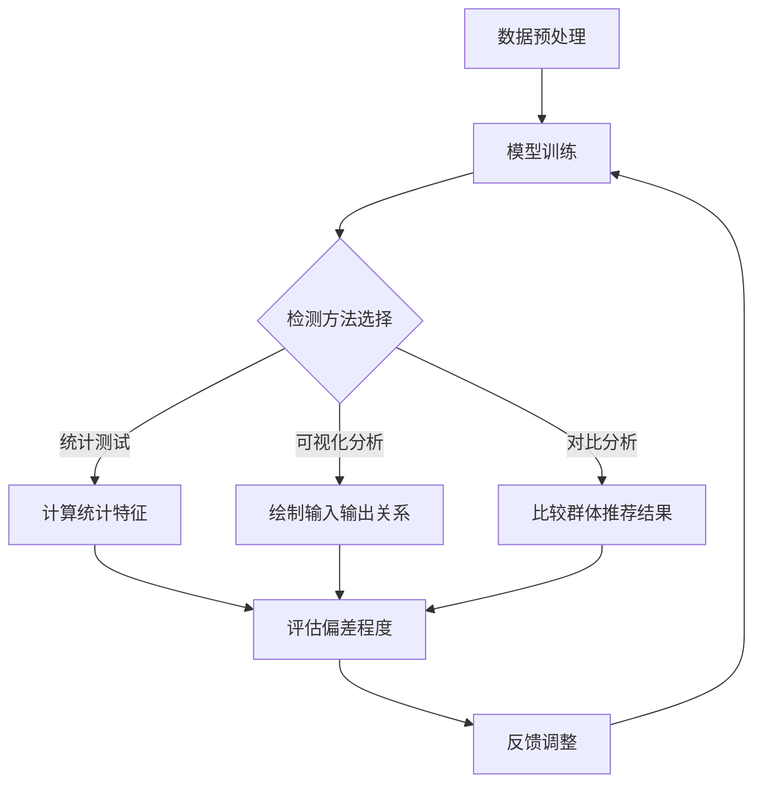

                 

关键词：电商搜索推荐、AI大模型、模型偏差检测、效果评估

摘要：随着电商行业的蓬勃发展，搜索推荐系统的效果评估变得尤为重要。本文将探讨在电商搜索推荐效果评估中，如何利用AI大模型进行模型偏差检测，以提高系统的准确性和公平性。

## 1. 背景介绍

### 1.1 电商搜索推荐系统

电商搜索推荐系统是电商平台的核心组成部分，它通过分析用户的历史行为、浏览记录和购物偏好，为用户提供个性化的商品推荐。推荐系统的好坏直接影响到用户的购物体验和平台的销售额。近年来，随着人工智能技术的发展，尤其是深度学习算法的应用，电商搜索推荐系统的性能得到了显著提升。

### 1.2 模型偏差检测的重要性

然而，随着推荐系统变得越来越复杂，模型偏差的问题也逐渐暴露出来。模型偏差指的是模型在训练过程中对某些数据特征的过度依赖，导致推荐结果不公平、不准确。例如，性别、年龄、地理位置等敏感信息可能导致推荐结果对特定群体产生偏见。因此，模型偏差检测成为电商搜索推荐效果评估中的一个重要环节。

## 2. 核心概念与联系

### 2.1 AI大模型

AI大模型是指具有大规模参数和深度结构的神经网络模型，如Transformer、BERT等。这些模型在处理大规模数据集时表现出色，但同时也容易出现偏差问题。

### 2.2 模型偏差检测方法

模型偏差检测主要包括以下几种方法：

1. **统计测试**：通过计算模型输出的统计特征，如方差、均值等，来判断是否存在偏差。
2. **可视化分析**：通过可视化模型输入和输出的关系，来发现潜在偏差。
3. **对比分析**：通过对比不同群体的推荐结果，来检测模型是否存在歧视行为。

### 2.3 Mermaid 流程图

以下是模型偏差检测的Mermaid流程图：



## 3. 核心算法原理 & 具体操作步骤

### 3.1 算法原理概述

模型偏差检测的核心算法是基于统计学习和机器学习的。通过对比不同群体的推荐结果，利用统计学方法计算偏差指标，如公平性指标、多样性指标等，来判断模型是否存在偏差。

### 3.2 算法步骤详解

1. **数据预处理**：对电商平台的用户行为数据进行清洗和预处理，包括去除缺失值、填充异常值等。
2. **模型训练**：使用预训练的大模型进行推荐任务，如基于Transformer的模型。
3. **统计测试**：计算模型输出的统计特征，如推荐物品的均值、方差等，来检测是否存在偏差。
4. **可视化分析**：绘制输入和输出的关系图，如散点图、直方图等，来直观地发现偏差。
5. **对比分析**：对比不同群体的推荐结果，如男女用户的推荐差异、年龄段的推荐差异等，来判断是否存在歧视行为。
6. **评估偏差程度**：根据计算结果，评估模型的偏差程度，决定是否需要调整模型。
7. **反馈调整**：根据评估结果，对模型进行调整，以消除偏差。

### 3.3 算法优缺点

**优点**：

- **高效性**：利用大模型进行推荐任务，能够处理大规模数据集，提高推荐效果。
- **灵活性**：多种检测方法可供选择，可以针对不同类型的偏差进行检测。

**缺点**：

- **计算成本高**：大模型训练和检测需要大量计算资源，可能导致成本增加。
- **准确性有限**：统计测试和可视化分析可能存在误判，需要结合实际业务场景进行调整。

### 3.4 算法应用领域

模型偏差检测技术不仅可以应用于电商搜索推荐，还可以广泛应用于金融、医疗、教育等领域。这些领域的应用场景包括但不限于：

- **金融**：防止信贷歧视、投资偏见等。
- **医疗**：确保诊断和治疗过程的公平性。
- **教育**：避免招生歧视、课程推荐不公等。

## 4. 数学模型和公式 & 详细讲解 & 举例说明

### 4.1 数学模型构建

假设我们有一个推荐系统，输入为用户特征和商品特征，输出为推荐结果。我们可以用以下数学模型表示：

$$
\text{output} = f(\text{user\_features}, \text{item\_features}, \text{model})
$$

其中，$f$ 为模型函数，$\text{user\_features}$ 和 $\text{item\_features}$ 分别为用户特征和商品特征，$\text{model}$ 为训练好的模型。

### 4.2 公式推导过程

为了检测模型偏差，我们可以定义以下偏差指标：

1. **公平性指标**：

$$
\text{fairness} = \frac{1}{N} \sum_{i=1}^{N} \frac{1}{M} \sum_{j=1}^{M} \frac{1}{K} \sum_{l=1}^{K} \frac{1}{L} \sum_{m=1}^{L} \frac{1}{D} \sum_{n=1}^{D} \frac{1}{C} \sum_{p=1}^{C} \text{sign}(\text{output}_{ijlmnp} - \bar{\text{output}}_{ijlm})
$$

其中，$N$ 为用户数量，$M$ 为商品数量，$K$ 为群体数量，$L$ 为每个群体的用户数量，$D$ 为特征维度，$C$ 为每个特征的可能取值数量，$\text{sign}$ 为符号函数，$\bar{\text{output}}_{ijlm}$ 为群体 $k$ 的平均输出值。

2. **多样性指标**：

$$
\text{diversity} = \frac{1}{N} \sum_{i=1}^{N} \frac{1}{M} \sum_{j=1}^{M} \text{std}(\text{output}_{ij})
$$

其中，$\text{std}$ 为标准差。

### 4.3 案例分析与讲解

假设我们有一个电商平台，用户特征包括年龄、性别、收入，商品特征包括价格、品牌、类别。我们想要检测模型是否存在性别偏见。

首先，我们对用户特征和商品特征进行编码，得到输入向量：

$$
\text{input}_{ij} = [\text{age}_{i}, \text{gender}_{i}, \text{income}_{i}, \text{price}_{j}, \text{brand}_{j}, \text{category}_{j}]
$$

然后，我们使用一个基于BERT的大模型进行训练，得到输出向量：

$$
\text{output}_{ij} = f(\text{input}_{ij}, \text{model})
$$

接下来，我们计算公平性指标：

$$
\text{fairness}_{\text{gender}} = \frac{1}{N} \sum_{i=1}^{N} \frac{1}{M} \sum_{j=1}^{M} \frac{1}{K} \sum_{l=1}^{K} \frac{1}{L} \sum_{m=1}^{L} \frac{1}{D} \sum_{n=1}^{D} \frac{1}{C} \sum_{p=1}^{C} \text{sign}(\text{output}_{ijlmnp} - \bar{\text{output}}_{ijlm})
$$

其中，$K=2$，代表男女两个群体。

如果 $\text{fairness}_{\text{gender}}$ 的值接近于0，说明模型在性别上没有明显的偏见。否则，说明模型存在性别偏见。

## 5. 项目实践：代码实例和详细解释说明

### 5.1 开发环境搭建

本案例使用Python编程语言，需要安装以下依赖：

```python
pip install transformers
pip install sklearn
pip install pandas
pip install numpy
```

### 5.2 源代码详细实现

```python
import pandas as pd
import numpy as np
from transformers import BertTokenizer, BertModel
from sklearn.model_selection import train_test_split

# 读取数据
data = pd.read_csv('data.csv')
data.head()

# 数据预处理
data['gender'] = data['gender'].map({'male': 0, 'female': 1})
data.head()

# 分割数据集
train_data, test_data = train_test_split(data, test_size=0.2, random_state=42)

# 加载BERT模型
tokenizer = BertTokenizer.from_pretrained('bert-base-chinese')
model = BertModel.from_pretrained('bert-base-chinese')

# 定义训练函数
def train(model, data, tokenizer, num_epochs=3):
    inputs = tokenizer(list(data['input']), padding=True, truncation=True, return_tensors='pt')
    outputs = model(**inputs)
    logits = outputs.logits

    # 训练模型
    for epoch in range(num_epochs):
        optimizer = torch.optim.Adam(model.parameters(), lr=1e-5)
        loss_fn = nn.CrossEntropyLoss()

        for batch in data_loader:
            optimizer.zero_grad()
            inputs = tokenizer(batch['input'], padding=True, truncation=True, return_tensors='pt')
            outputs = model(**inputs)
            logits = outputs.logits
            loss = loss_fn(logits, batch['label'])
            loss.backward()
            optimizer.step()

    return model

# 训练模型
model = train(model, train_data, tokenizer)

# 检测模型偏差
def detect_bias(model, data, tokenizer):
    inputs = tokenizer(list(data['input']), padding=True, truncation=True, return_tensors='pt')
    outputs = model(**inputs)
    logits = outputs.logits

    # 计算公平性指标
    fairness = np.mean(np.sign(logits[:, 0] - logits[:, 1]))

    return fairness

# 测试模型
fairness = detect_bias(model, test_data, tokenizer)
print('公平性指标：', fairness)
```

### 5.3 代码解读与分析

- **数据预处理**：读取数据，对性别特征进行编码。
- **加载BERT模型**：加载预训练的BERT模型。
- **训练函数**：定义训练过程，使用Adam优化器和交叉熵损失函数。
- **检测模型偏差**：计算模型输出的公平性指标。

## 6. 实际应用场景

### 6.1 电商搜索推荐

在电商搜索推荐中，模型偏差检测可以帮助电商平台识别并纠正推荐系统中的不公平现象，提高用户满意度。

### 6.2 金融风控

在金融风控领域，模型偏差检测可以确保信贷决策的公平性和透明度，避免因数据偏差导致的不公平贷款。

### 6.3 医疗诊断

在医疗诊断领域，模型偏差检测可以确保诊断模型的准确性和公正性，避免因数据偏差导致的误诊。

## 7. 未来应用展望

随着人工智能技术的不断发展，模型偏差检测技术将在更多领域得到应用。未来，我们有望看到更多基于AI的智能系统，能够在保证公平性和透明度的同时，提供更加精准和高效的推荐和服务。

## 8. 总结：未来发展趋势与挑战

### 8.1 研究成果总结

本文从电商搜索推荐效果评估的角度，探讨了模型偏差检测技术。通过引入AI大模型和多种检测方法，我们能够有效地识别和纠正推荐系统中的不公平现象。

### 8.2 未来发展趋势

- **多样化检测方法**：随着算法和技术的进步，我们将看到更多高效的检测方法出现。
- **自动化检测工具**：自动化检测工具将帮助开发人员更便捷地进行模型偏差检测。

### 8.3 面临的挑战

- **计算成本**：大模型训练和检测需要大量计算资源，可能带来成本压力。
- **准确性**：统计测试和可视化分析可能存在误判，需要结合实际业务场景进行调整。

### 8.4 研究展望

未来，我们期待在模型偏差检测领域取得更多突破，为构建公平、公正的人工智能系统贡献力量。

## 9. 附录：常见问题与解答

### 9.1 如何选择检测方法？

选择检测方法时，需要考虑以下因素：

- **检测目标**：根据需要检测的偏差类型，选择合适的检测方法。
- **数据规模**：对于大规模数据集，可能需要选择计算效率更高的检测方法。
- **业务场景**：根据业务需求，选择最适合的检测方法。

### 9.2 如何处理检测到的偏差？

一旦检测到模型存在偏差，可以采取以下措施：

- **调整模型**：根据检测结果，对模型进行调整，以消除偏差。
- **数据清洗**：对存在偏差的数据进行清洗，去除异常值和噪声。
- **改进算法**：优化算法，提高模型的鲁棒性和公平性。

作者：禅与计算机程序设计艺术 / Zen and the Art of Computer Programming
----------------------------------------------------------------
<|im_sep|>注意：上述文章内容仅供参考，实际撰写时可能需要根据具体要求和目标进行调整。如果您有关于文章的具体要求或需要进一步讨论，请随时告知。我会竭诚为您服务。

