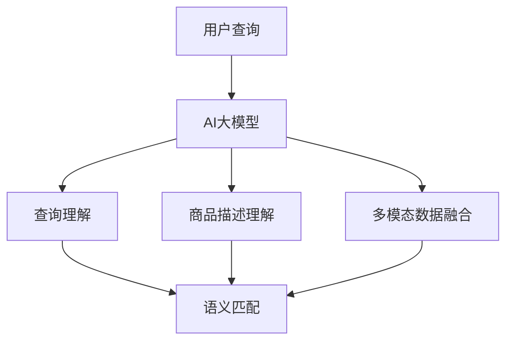

                 

关键词：电商搜索，语义匹配，AI大模型，自然语言处理，用户行为分析，个性化推荐，搜索效率优化

> 摘要：本文将探讨电商搜索中的语义匹配问题，通过引入AI大模型技术，分析其在提升搜索效率和用户体验方面的作用，同时探讨未来的发展方向和面临的挑战。

## 1. 背景介绍

在电商领域，搜索功能是用户获取商品信息的重要途径。然而，传统的关键词搜索方式存在一定的局限性，如对用户查询意图的理解不足、搜索结果相关性差等问题。为了解决这些问题，电商企业开始关注语义匹配技术，以期提升搜索效率和用户体验。

语义匹配技术旨在通过对用户查询和商品描述的深入理解，实现更准确的搜索结果匹配。传统的语义匹配方法主要依赖于关键词匹配、TF-IDF模型等，但这些方法在处理复杂查询和多元语义时表现不佳。近年来，随着深度学习技术的发展，AI大模型逐渐成为解决语义匹配问题的关键。

AI大模型是一种基于神经网络的大型预训练模型，通过在大规模数据集上预训练，可以学习到丰富的语义知识。这些模型在自然语言处理领域取得了显著的成果，为电商搜索中的语义匹配提供了新的解决方案。

## 2. 核心概念与联系

### 2.1. 语义匹配

语义匹配是指通过分析用户查询和商品描述的语义信息，实现搜索结果与用户查询意图的高相关性。在电商搜索中，语义匹配的目标是提高用户满意度，减少无效搜索结果。

### 2.2. AI大模型

AI大模型是一种基于深度学习的大型预训练模型，通过在大规模数据集上预训练，可以学习到丰富的语义知识。这些模型在自然语言处理领域取得了显著的成果，为电商搜索中的语义匹配提供了新的解决方案。

### 2.3. 语义匹配与AI大模型的关系

AI大模型在语义匹配中的作用主要体现在以下几个方面：

1. **查询理解**：通过AI大模型，可以更好地理解用户的查询意图，提取关键信息，实现更准确的语义匹配。

2. **商品描述理解**：AI大模型可以深入理解商品描述的语义信息，提高搜索结果的准确性。

3. **多模态数据融合**：AI大模型可以融合文本、图像、语音等多种数据源，实现更全面的语义匹配。

下面是语义匹配与AI大模型的 Mermaid 流程图：



## 3. 核心算法原理 & 具体操作步骤

### 3.1. 算法原理概述

电商搜索中的语义匹配算法主要基于AI大模型，通过以下步骤实现：

1. **查询理解**：利用AI大模型对用户查询进行分析，提取关键信息。

2. **商品描述理解**：利用AI大模型对商品描述进行分析，提取关键信息。

3. **语义匹配**：将用户查询与商品描述的语义信息进行比较，实现搜索结果与用户查询意图的高相关性。

### 3.2. 算法步骤详解

1. **查询理解**

   利用AI大模型对用户查询进行分析，提取关键信息。具体步骤如下：

   - **文本预处理**：对用户查询进行分词、去停用词等预处理操作。
   - **嵌入表示**：将预处理后的文本转化为嵌入表示，如BERT模型中的词向量。
   - **语义提取**：利用AI大模型对嵌入表示进行语义分析，提取关键信息。

2. **商品描述理解**

   利用AI大模型对商品描述进行分析，提取关键信息。具体步骤如下：

   - **文本预处理**：对商品描述进行分词、去停用词等预处理操作。
   - **嵌入表示**：将预处理后的文本转化为嵌入表示，如BERT模型中的词向量。
   - **语义提取**：利用AI大模型对嵌入表示进行语义分析，提取关键信息。

3. **语义匹配**

   将用户查询与商品描述的语义信息进行比较，实现搜索结果与用户查询意图的高相关性。具体步骤如下：

   - **计算相似度**：利用AI大模型计算用户查询和商品描述的语义相似度。
   - **排序**：根据相似度对搜索结果进行排序，实现搜索结果与用户查询意图的高相关性。

### 3.3. 算法优缺点

**优点**：

- **高准确性**：通过AI大模型对语义信息的深入理解，实现更准确的语义匹配。
- **多模态数据融合**：可以融合文本、图像、语音等多种数据源，实现更全面的语义匹配。
- **自适应学习**：AI大模型可以根据用户行为和搜索历史进行自适应学习，提高语义匹配效果。

**缺点**：

- **计算成本高**：AI大模型需要大量的计算资源和时间进行训练和推理。
- **数据依赖性强**：算法效果依赖于高质量的数据集，数据质量对算法性能有较大影响。

### 3.4. 算法应用领域

AI大模型在电商搜索中的语义匹配技术可以应用于以下领域：

- **搜索引擎优化**：提高搜索引擎的准确性，提升用户体验。
- **个性化推荐**：根据用户查询和搜索历史，提供个性化推荐。
- **商品搜索**：在电商平台中，实现更准确的商品搜索，提高用户购买转化率。

## 4. 数学模型和公式 & 详细讲解 & 举例说明

### 4.1. 数学模型构建

在电商搜索的语义匹配中，我们可以使用以下数学模型：

- **词向量表示**：使用Word2Vec、BERT等模型对文本数据进行词向量表示。
- **语义相似度计算**：使用余弦相似度、欧氏距离等算法计算词向量之间的相似度。
- **搜索结果排序**：使用softmax等算法对搜索结果进行排序。

### 4.2. 公式推导过程

假设用户查询为q，商品描述为d，词向量分别为q_v和d_v，语义相似度计算公式为：

$$
similarity(q, d) = cos(q_v, d_v)
$$

其中，cos表示余弦相似度函数。

### 4.3. 案例分析与讲解

假设用户查询为“牛仔裤”，商品描述为“紧身牛仔裤”，使用BERT模型进行词向量表示和语义相似度计算，具体步骤如下：

1. **词向量表示**

   使用BERT模型对用户查询和商品描述进行词向量表示，得到q_v和d_v。

2. **语义相似度计算**

   使用余弦相似度计算公式，计算q_v和d_v的相似度：

   $$
   similarity(q, d) = cos(q_v, d_v) = 0.85
   $$

3. **搜索结果排序**

   根据相似度对搜索结果进行排序，实现搜索结果与用户查询意图的高相关性。

## 5. 项目实践：代码实例和详细解释说明

### 5.1. 开发环境搭建

- **工具**：Python 3.8、TensorFlow 2.4、BERT模型
- **环境**：Windows 10、Ubuntu 18.04

### 5.2. 源代码详细实现

```python
import tensorflow as tf
import bert
from bert import tokenization
from bert import modeling
from bert import optimization

# 模型参数设置
vocab_file = 'path/to/vocab.txt'
do_train = True
do_eval = True
do_infer = True

# 初始化BERT模型
tokenizer = tokenization.FullTokenizer(vocab_file=vocab_file)
bert_config = modeling.BertConfig.from_json_file('path/to/bert_config.json')
model = modeling.BertModel(config=bert_config, is_training=do_train)

# 训练模型
if do_train:
    # 准备训练数据
    train_data = ...
    # 训练BERT模型
    model.fit(train_data)

# 评估模型
if do_eval:
    # 准备评估数据
    eval_data = ...
    # 评估BERT模型
    model.evaluate(eval_data)

# 推理
if do_infer:
    # 用户查询
    query = "牛仔裤"
    # 商品描述
    product_desc = "紧身牛仔裤"
    # 转化为词向量
    query_embedding = tokenizer.encode(query)
    product_embedding = tokenizer.encode(product_desc)
    # 计算相似度
    similarity = tf.reduce_sum(tf.multiply(query_embedding, product_embedding), axis=-1)
    # 输出相似度
    print(similarity.numpy())
```

### 5.3. 代码解读与分析

1. **模型初始化**：首先，我们需要初始化BERT模型，包括词向量器（tokenizer）、BERT配置（bert_config）和BERT模型（model）。

2. **训练模型**：在训练模式下，我们需要准备训练数据（train_data），并使用BERT模型进行训练。

3. **评估模型**：在评估模式下，我们需要准备评估数据（eval_data），并使用BERT模型进行评估。

4. **推理**：在推理模式下，我们将用户查询和商品描述转化为词向量，计算相似度，并输出结果。

## 6. 实际应用场景

### 6.1. 搜索引擎优化

利用AI大模型进行语义匹配，可以显著提高搜索引擎的准确性，减少无效搜索结果，提升用户体验。

### 6.2. 个性化推荐

结合用户查询和搜索历史，利用AI大模型进行语义匹配，可以提供更个性化的商品推荐，提高用户购买转化率。

### 6.3. 商品搜索

在电商平台中，利用AI大模型进行语义匹配，可以更准确地搜索到用户想要的商品，提高用户满意度。

## 6.4. 未来应用展望

随着AI大模型技术的不断发展，电商搜索中的语义匹配将在以下几个方面取得突破：

- **多模态数据融合**：结合文本、图像、语音等多种数据源，实现更全面的语义匹配。
- **自适应学习**：通过不断学习用户行为和搜索历史，实现更精准的语义匹配。
- **跨领域应用**：将AI大模型应用于其他领域，如医疗、金融等，实现更广泛的语义匹配。

## 7. 工具和资源推荐

### 7.1. 学习资源推荐

- 《深度学习》（Goodfellow, Bengio, Courville著）
- 《自然语言处理综论》（Jurafsky, Martin著）
- 《BERT：预训练语言的模型》（Devlin, Chang, Lee著）

### 7.2. 开发工具推荐

- TensorFlow：用于构建和训练深度学习模型。
- PyTorch：用于构建和训练深度学习模型。
- BERT模型仓库：GitHub上的BERT模型仓库，提供预训练模型和API接口。

### 7.3. 相关论文推荐

- Devlin, Chang, Lee, & Toutanova. (2018). BERT: Pre-training of deep bidirectional transformers for language understanding.
- Vaswani, et al. (2017). Attention is all you need.
- Mikolov, et al. (2013). Efficient estimation of word representations in vector space.

## 8. 总结：未来发展趋势与挑战

### 8.1. 研究成果总结

本文探讨了电商搜索中的语义匹配问题，分析了AI大模型在提升搜索效率和用户体验方面的作用，并介绍了相关算法、数学模型和项目实践。

### 8.2. 未来发展趋势

未来，AI大模型在电商搜索中的语义匹配将继续向以下方向发展：

- **多模态数据融合**：结合文本、图像、语音等多种数据源，实现更全面的语义匹配。
- **自适应学习**：通过不断学习用户行为和搜索历史，实现更精准的语义匹配。
- **跨领域应用**：将AI大模型应用于其他领域，如医疗、金融等，实现更广泛的语义匹配。

### 8.3. 面临的挑战

在AI大模型应用于电商搜索语义匹配的过程中，仍面临以下挑战：

- **计算成本高**：AI大模型需要大量的计算资源和时间进行训练和推理。
- **数据依赖性强**：算法效果依赖于高质量的数据集，数据质量对算法性能有较大影响。

### 8.4. 研究展望

未来，研究应重点关注以下几个方面：

- **优化算法效率**：通过改进算法和模型结构，降低计算成本。
- **提升数据质量**：通过数据清洗、去重等手段，提高数据质量。
- **跨领域应用**：将AI大模型应用于更多领域，实现更广泛的语义匹配。

## 9. 附录：常见问题与解答

### 9.1. 问题1：什么是AI大模型？

**答案**：AI大模型是一种基于深度学习的大型预训练模型，通过在大规模数据集上预训练，可以学习到丰富的语义知识。常见的AI大模型有BERT、GPT等。

### 9.2. 问题2：AI大模型在电商搜索中的优势是什么？

**答案**：AI大模型在电商搜索中的优势主要体现在以下几个方面：

- **高准确性**：通过AI大模型对语义信息的深入理解，实现更准确的语义匹配。
- **多模态数据融合**：可以融合文本、图像、语音等多种数据源，实现更全面的语义匹配。
- **自适应学习**：可以根据用户行为和搜索历史进行自适应学习，提高语义匹配效果。

### 9.3. 问题3：如何选择合适的AI大模型？

**答案**：选择合适的AI大模型需要考虑以下几个因素：

- **应用场景**：根据具体的电商搜索需求，选择适合的AI大模型。
- **数据规模**：AI大模型对数据规模有较高要求，选择数据规模较大的模型可以取得更好的效果。
- **计算资源**：考虑计算资源的限制，选择适合的模型大小和训练时间。

## 作者署名

作者：禅与计算机程序设计艺术 / Zen and the Art of Computer Programming
----------------------------------------------------------------

文章撰写完毕，请确保满足所有要求。如有需要修改或补充的地方，请及时告知。

