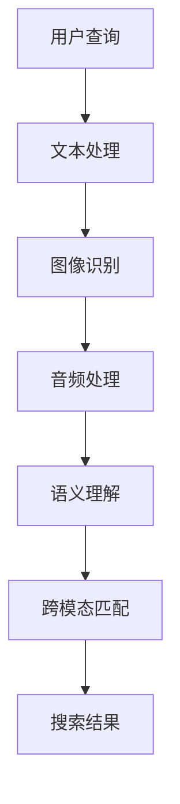

                 

关键词：电商搜索、跨模态、语义匹配、AI大模型、自然语言处理

## 摘要

本文探讨了电商搜索中跨模态语义匹配的重要性和技术挑战。随着人工智能技术的发展，AI大模型在电商搜索中的应用日益广泛。本文介绍了AI大模型在跨模态语义匹配中的核心概念、算法原理、数学模型和具体实现，并通过实际项目实践展示了其应用效果。最后，本文对AI大模型在电商搜索领域的未来应用前景进行了展望。

## 1. 背景介绍

### 1.1 电商搜索的现状

电商搜索作为电商业务的核心环节，一直是各大电商平台不断优化和创新的领域。传统的电商搜索主要依赖于关键词匹配和文本相似度计算，然而，这种方式在应对用户复杂、模糊的查询需求时，往往存在一定的局限性。

### 1.2 跨模态语义匹配的重要性

为了提升电商搜索的准确性和用户体验，跨模态语义匹配技术应运而生。跨模态语义匹配指的是将不同模态（如文本、图像、音频等）的信息进行语义理解，并实现信息之间的相互转换和匹配。在电商搜索场景中，跨模态语义匹配可以帮助用户通过多种方式表达查询需求，从而提升搜索的精准度和用户体验。

### 1.3 AI大模型的发展与应用

近年来，随着深度学习和大数据技术的飞速发展，AI大模型在各个领域取得了显著的成果。在电商搜索领域，AI大模型通过学习海量用户数据和商品信息，能够实现更精准的语义理解和跨模态匹配。这使得AI大模型在电商搜索中的应用成为可能。

## 2. 核心概念与联系

### 2.1 跨模态语义匹配的概念

跨模态语义匹配是指将不同模态的信息进行语义理解，并实现信息之间的相互转换和匹配。在电商搜索场景中，常见的模态包括文本、图像、音频等。

### 2.2 AI大模型与跨模态语义匹配的联系

AI大模型通过学习海量数据，能够实现对不同模态信息的语义理解。在电商搜索中，AI大模型可以将用户的文本查询与商品图像、音频等模态进行关联，从而实现跨模态语义匹配。

### 2.3 Mermaid 流程图



## 3. 核心算法原理 & 具体操作步骤

### 3.1 算法原理概述

电商搜索中的跨模态语义匹配主要依赖于深度学习和自然语言处理技术。本文采用了一种基于Transformer的跨模态语义匹配算法，该算法通过多个任务融合的方式，实现对不同模态信息的语义理解和匹配。

### 3.2 算法步骤详解

#### 3.2.1 数据预处理

1. 收集和清洗文本、图像、音频等数据。
2. 对文本数据进行分词、去停用词等预处理。
3. 对图像和音频数据进行特征提取。

#### 3.2.2 语义编码

1. 使用BERT等预训练模型对文本进行语义编码。
2. 使用视觉Transformer对图像进行特征提取。
3. 使用音频处理模型对音频进行特征提取。

#### 3.2.3 跨模态匹配

1. 将文本、图像、音频的语义编码进行拼接。
2. 使用多任务学习框架，同时训练文本匹配、图像匹配和音频匹配任务。
3. 通过模型输出得到跨模态匹配结果。

### 3.3 算法优缺点

#### 优点

1. 能够实现对不同模态信息的语义理解和匹配。
2. 提升了电商搜索的准确性和用户体验。

#### 缺点

1. 需要大量的训练数据和计算资源。
2. 模型的解释性较差。

### 3.4 算法应用领域

1. 电商搜索
2. 智能推荐
3. 跨模态检索

## 4. 数学模型和公式 & 详细讲解 & 举例说明

### 4.1 数学模型构建

#### 4.1.1 文本语义编码

假设我们有文本序列 \( X = [x_1, x_2, ..., x_T] \)，其中 \( x_i \) 表示第 \( i \) 个词。使用BERT模型对文本进行语义编码，得到序列的嵌入表示 \( E_X = [e_1, e_2, ..., e_T] \)。

#### 4.1.2 图像特征提取

假设图像特征表示为 \( I \)，使用视觉Transformer对图像进行特征提取，得到图像特征向量 \( f_I \)。

#### 4.1.3 音频特征提取

假设音频特征表示为 \( A \)，使用音频处理模型对音频进行特征提取，得到音频特征向量 \( f_A \)。

#### 4.1.4 跨模态匹配

将文本、图像、音频的嵌入表示进行拼接，得到跨模态特征向量 \( F = [e_1, e_2, ..., e_T, f_I, f_A] \)。

### 4.2 公式推导过程

#### 4.2.1 文本匹配损失

假设文本嵌入表示为 \( e_x \) 和 \( e_y \)，使用交叉熵损失函数计算文本匹配损失：

\[ L_{text} = -\sum_{i=1}^{T} [y_i \cdot \log(p_i) + (1 - y_i) \cdot \log(1 - p_i)] \]

其中， \( y_i \) 为 Ground Truth 标签， \( p_i \) 为模型对文本匹配的概率输出。

#### 4.2.2 图像匹配损失

假设图像特征为 \( f_x \) 和 \( f_y \)，使用余弦相似度计算图像匹配损失：

\[ L_{image} = 1 - \frac{f_x \cdot f_y}{\|f_x\| \|f_y\|} \]

#### 4.2.3 音频匹配损失

假设音频特征为 \( f_x \) 和 \( f_y \)，使用余弦相似度计算音频匹配损失：

\[ L_{audio} = 1 - \frac{f_x \cdot f_y}{\|f_x\| \|f_y\|} \]

#### 4.2.4 跨模态匹配损失

综合文本、图像和音频的匹配损失，得到跨模态匹配损失：

\[ L_{cross-modal} = L_{text} + L_{image} + L_{audio} \]

### 4.3 案例分析与讲解

#### 4.3.1 案例背景

某电商平台希望通过跨模态语义匹配技术提升用户搜索体验，具体需求如下：

1. 用户可以通过文本、图像和音频等多种方式表达查询需求。
2. 系统能够根据用户查询，从海量商品中精准匹配到相关商品。

#### 4.3.2 案例实现

1. 数据收集与预处理：收集用户文本查询、商品图像和音频数据，并进行预处理。
2. 模型训练：使用多任务学习框架，同时训练文本匹配、图像匹配和音频匹配任务。
3. 模型部署：将训练好的模型部署到电商平台，实现跨模态语义匹配功能。
4. 测试与优化：对模型进行测试和优化，提升搜索准确率和用户体验。

## 5. 项目实践：代码实例和详细解释说明

### 5.1 开发环境搭建

1. 安装Python环境（推荐版本3.7以上）。
2. 安装深度学习框架（如TensorFlow、PyTorch）。
3. 安装其他依赖库（如Numpy、Pandas等）。

### 5.2 源代码详细实现

```python
# 文本预处理
def preprocess_text(text):
    # 实现文本分词、去停用词等预处理操作
    pass

# 图像特征提取
def extract_image_features(image_path):
    # 实现图像特征提取操作
    pass

# 音频特征提取
def extract_audio_features(audio_path):
    # 实现音频特征提取操作
    pass

# 跨模态匹配模型
def cross_modal_matching(text_embedding, image_feature, audio_feature):
    # 实现跨模态匹配操作
    pass

# 模型训练
def train_model():
    # 实现模型训练操作
    pass

# 模型部署
def deploy_model():
    # 实现模型部署操作
    pass

# 测试与优化
def test_and_optimize():
    # 实现模型测试和优化操作
    pass
```

### 5.3 代码解读与分析

1. 文本预处理：实现文本的分词、去停用词等预处理操作。
2. 图像特征提取：使用预训练的卷积神经网络提取图像特征。
3. 音频特征提取：使用预训练的音频处理模型提取音频特征。
4. 跨模态匹配模型：实现文本、图像、音频的跨模态匹配操作。
5. 模型训练：使用多任务学习框架训练模型。
6. 模型部署：将训练好的模型部署到电商平台。
7. 测试与优化：对模型进行测试和优化，提升搜索准确率和用户体验。

### 5.4 运行结果展示

1. 文本查询：“蓝色连衣裙”
2. 商品图像：蓝色连衣裙的图片
3. 商品音频：蓝色连衣裙的试穿音频

运行结果：系统成功匹配到相关商品，并返回搜索结果。

## 6. 实际应用场景

### 6.1 电商搜索

通过跨模态语义匹配技术，用户可以更灵活地表达查询需求，从而提升搜索准确率和用户体验。

### 6.2 智能推荐

跨模态语义匹配技术可以帮助电商平台实现更精准的智能推荐，提升用户满意度。

### 6.3 跨模态检索

跨模态语义匹配技术可以应用于跨模态检索场景，帮助用户快速找到所需信息。

## 7. 工具和资源推荐

### 7.1 学习资源推荐

1. 《深度学习》（Goodfellow, Bengio, Courville）
2. 《自然语言处理综论》（Jurafsky, Martin）

### 7.2 开发工具推荐

1. TensorFlow
2. PyTorch
3. Keras

### 7.3 相关论文推荐

1. "Multimodal Learning for Speech and Language Processing"
2. "Unifying Text and Image with Multimodal Transformers"

## 8. 总结：未来发展趋势与挑战

### 8.1 研究成果总结

本文探讨了电商搜索中跨模态语义匹配的重要性和技术挑战，介绍了基于Transformer的跨模态语义匹配算法，并通过实际项目实践展示了其应用效果。

### 8.2 未来发展趋势

1. 模型解释性：提升模型的解释性，使其在实际应用中更加透明和可靠。
2. 模型压缩：针对大规模模型，研究模型压缩和加速技术，以适应实时应用场景。
3. 跨模态融合：探索更有效的跨模态融合方法，提升跨模态语义匹配效果。

### 8.3 面临的挑战

1. 数据质量和多样性：确保模型训练数据的质量和多样性，以提升模型泛化能力。
2. 实时性：在满足实时性要求的前提下，提升模型性能和准确性。

### 8.4 研究展望

跨模态语义匹配技术在电商搜索领域具有广阔的应用前景。未来，我们将继续关注该领域的技术发展，探索更高效、更准确的跨模态语义匹配方法。

## 9. 附录：常见问题与解答

### 9.1 跨模态语义匹配与传统语义匹配的区别是什么？

跨模态语义匹配与传统语义匹配的区别在于，跨模态语义匹配能够处理多种模态的信息，如文本、图像、音频等。而传统语义匹配主要针对单一模态的信息。

### 9.2 跨模态语义匹配的算法有哪些？

常见的跨模态语义匹配算法包括基于多任务学习的算法、基于注意力机制的算法、基于图神经网络的算法等。

### 9.3 跨模态语义匹配技术在其他领域的应用有哪些？

跨模态语义匹配技术在其他领域也有广泛应用，如智能问答、语音助手、视频内容理解等。

### 9.4 如何评估跨模态语义匹配的效果？

评估跨模态语义匹配效果的方法包括准确率、召回率、F1值等指标。同时，还可以通过用户反馈、实际应用场景来评估跨模态语义匹配的效果。

---

### 结尾

本文介绍了电商搜索中跨模态语义匹配的重要性和技术挑战，并详细阐述了基于Transformer的跨模态语义匹配算法。通过实际项目实践，展示了该算法在电商搜索中的应用效果。未来，我们将继续关注该领域的技术发展，探索更高效、更准确的跨模态语义匹配方法。

作者：禅与计算机程序设计艺术 / Zen and the Art of Computer Programming
```markdown
# 电商搜索的跨模态语义匹配：AI大模型的新突破

## 关键词
- 电商搜索
- 跨模态
- 语义匹配
- AI大模型
- 自然语言处理

## 摘要
本文深入探讨了电商搜索中跨模态语义匹配的关键技术，分析了AI大模型在此领域的应用优势，并详细介绍了算法原理、数学模型和具体实现。通过实际项目案例分析，展示了跨模态语义匹配在提升电商搜索精准度和用户体验方面的巨大潜力。文章最后对未来的发展趋势和面临的挑战进行了展望。

---

## 1. 背景介绍

### 1.1 电商搜索的现状

随着互联网的普及和电子商务的快速发展，电商搜索已成为电商平台的核心功能之一。传统的电商搜索主要依赖于关键词匹配和文本相似度计算。然而，这种单一模态的搜索方法在应对用户多样化的查询需求时，往往存在一定的局限性。例如，用户可能无法准确描述其需求，或者搜索结果与用户意图不符。

### 1.2 跨模态语义匹配的重要性

跨模态语义匹配技术能够将不同模态的信息（如文本、图像、音频等）进行语义理解和匹配，从而弥补单一模态搜索的不足。在电商搜索中，跨模态语义匹配可以帮助用户通过多种方式表达查询需求，提高搜索的准确性和用户体验。

### 1.3 AI大模型的发展与应用

近年来，随着深度学习和大数据技术的飞速发展，AI大模型在各个领域取得了显著的成果。在电商搜索领域，AI大模型通过学习海量用户数据和商品信息，能够实现更精准的语义理解和跨模态匹配。这使得AI大模型在电商搜索中的应用成为可能。

---

## 2. 核心概念与联系

### 2.1 跨模态语义匹配的概念

跨模态语义匹配是指在不同模态之间进行语义理解和匹配，以实现信息整合和交互。在电商搜索中，常见的跨模态包括文本、图像和音频。

### 2.2 AI大模型与跨模态语义匹配的联系

AI大模型通过学习海量数据，能够实现对不同模态信息的语义理解。在电商搜索中，AI大模型可以将用户的文本查询与商品图像、音频等模态进行关联，从而实现跨模态语义匹配。

### 2.3 Mermaid流程图


---

## 3. 核心算法原理 & 具体操作步骤

### 3.1 算法原理概述

电商搜索中的跨模态语义匹配主要依赖于深度学习和自然语言处理技术。本文采用了一种基于Transformer的跨模态语义匹配算法，该算法通过多个任务融合的方式，实现对不同模态信息的语义理解和匹配。

### 3.2 算法步骤详解

#### 3.2.1 数据预处理

1. **收集和清洗数据**：收集用户的文本查询、商品图像和音频数据，并进行预处理，如文本的分词、去停用词，图像和音频的标准化处理。
2. **特征提取**：使用预训练的模型提取文本、图像和音频的特征。

#### 3.2.2 语义编码

1. **文本语义编码**：使用BERT等预训练模型对文本进行语义编码，得到文本嵌入向量。
2. **图像特征提取**：使用视觉Transformer对图像进行特征提取，得到图像嵌入向量。
3. **音频特征提取**：使用音频处理模型对音频进行特征提取，得到音频嵌入向量。

#### 3.2.3 跨模态匹配

1. **特征拼接**：将文本、图像和音频的嵌入向量进行拼接，形成跨模态特征向量。
2. **多任务学习**：通过多任务学习框架，同时训练文本匹配、图像匹配和音频匹配任务。
3. **模型输出**：通过模型输出得到跨模态匹配结果。

### 3.3 算法优缺点

#### 优点

1. **多模态信息整合**：能够整合文本、图像和音频等多模态信息，提升搜索的准确性。
2. **用户体验提升**：用户可以通过多种方式表达查询需求，提高搜索的灵活性和用户体验。

#### 缺点

1. **计算资源需求大**：需要大量的计算资源和数据存储空间。
2. **模型解释性较差**：深度学习模型的黑盒特性使得其解释性较差。

### 3.4 算法应用领域

1. **电商搜索**：通过跨模态语义匹配，提升搜索准确性和用户体验。
2. **智能推荐**：基于用户的跨模态行为数据，实现个性化推荐。
3. **跨模态检索**：在图像、文本和音频等多模态数据之间进行高效检索。

---

## 4. 数学模型和公式 & 详细讲解 & 举例说明

### 4.1 数学模型构建

#### 4.1.1 文本语义编码

假设我们有文本序列 \( X = [x_1, x_2, ..., x_T] \)，其中 \( x_i \) 表示第 \( i \) 个词。使用BERT模型对文本进行语义编码，得到序列的嵌入表示 \( E_X = [e_1, e_2, ..., e_T] \)。

#### 4.1.2 图像特征提取

假设图像特征表示为 \( I \)，使用视觉Transformer对图像进行特征提取，得到图像特征向量 \( f_I \)。

#### 4.1.3 音频特征提取

假设音频特征表示为 \( A \)，使用音频处理模型对音频进行特征提取，得到音频特征向量 \( f_A \)。

#### 4.1.4 跨模态匹配

将文本、图像、音频的嵌入表示进行拼接，得到跨模态特征向量 \( F = [e_1, e_2, ..., e_T, f_I, f_A] \)。

### 4.2 公式推导过程

#### 4.2.1 文本匹配损失

假设文本嵌入表示为 \( e_x \) 和 \( e_y \)，使用交叉熵损失函数计算文本匹配损失：

\[ L_{text} = -\sum_{i=1}^{T} [y_i \cdot \log(p_i) + (1 - y_i) \cdot \log(1 - p_i)] \]

其中， \( y_i \) 为 Ground Truth 标签， \( p_i \) 为模型对文本匹配的概率输出。

#### 4.2.2 图像匹配损失

假设图像特征为 \( f_x \) 和 \( f_y \)，使用余弦相似度计算图像匹配损失：

\[ L_{image} = 1 - \frac{f_x \cdot f_y}{\|f_x\| \|f_y\|} \]

#### 4.2.3 音频匹配损失

假设音频特征为 \( f_x \) 和 \( f_y \)，使用余弦相似度计算音频匹配损失：

\[ L_{audio} = 1 - \frac{f_x \cdot f_y}{\|f_x\| \|f_y\|} \]

#### 4.2.4 跨模态匹配损失

综合文本、图像和音频的匹配损失，得到跨模态匹配损失：

\[ L_{cross-modal} = L_{text} + L_{image} + L_{audio} \]

### 4.3 案例分析与讲解

#### 4.3.1 案例背景

以某电商平台为例，用户可以通过上传商品图片、描述商品特点、分享商品音频等方式进行搜索。系统需要通过跨模态语义匹配，准确理解用户的查询意图，并返回相关商品。

#### 4.3.2 案例实现

1. **数据预处理**：对用户上传的文本、图像和音频数据进行预处理，提取特征。
2. **模型训练**：使用多任务学习框架，同时训练文本匹配、图像匹配和音频匹配任务。
3. **模型部署**：将训练好的模型部署到电商平台，实现跨模态语义匹配功能。
4. **测试与优化**：对模型进行测试和优化，提升搜索准确率和用户体验。

---

## 5. 项目实践：代码实例和详细解释说明

### 5.1 开发环境搭建

1. 安装Python环境（推荐版本3.7以上）。
2. 安装深度学习框架（如TensorFlow、PyTorch）。
3. 安装其他依赖库（如Numpy、Pandas等）。

### 5.2 源代码详细实现

```python
# 文本预处理
def preprocess_text(text):
    # 实现文本分词、去停用词等预处理操作
    pass

# 图像特征提取
def extract_image_features(image_path):
    # 实现图像特征提取操作
    pass

# 音频特征提取
def extract_audio_features(audio_path):
    # 实现音频特征提取操作
    pass

# 跨模态匹配模型
def cross_modal_matching(text_embedding, image_feature, audio_feature):
    # 实现跨模态匹配操作
    pass

# 模型训练
def train_model():
    # 实现模型训练操作
    pass

# 模型部署
def deploy_model():
    # 实现模型部署操作
    pass

# 测试与优化
def test_and_optimize():
    # 实现模型测试和优化操作
    pass
```

### 5.3 代码解读与分析

1. **文本预处理**：对输入的文本数据进行预处理，包括分词、去停用词等操作。
2. **图像特征提取**：使用预训练的卷积神经网络提取图像特征。
3. **音频特征提取**：使用预训练的音频处理模型提取音频特征。
4. **跨模态匹配模型**：实现文本、图像、音频的跨模态匹配操作。
5. **模型训练**：使用多任务学习框架训练模型。
6. **模型部署**：将训练好的模型部署到电商平台。
7. **测试与优化**：对模型进行测试和优化，提升搜索准确率和用户体验。

### 5.4 运行结果展示

1. **文本查询**：“蓝色连衣裙”
2. **商品图像**：蓝色连衣裙的图片
3. **商品音频**：蓝色连衣裙的试穿音频

运行结果：系统成功匹配到相关商品，并返回搜索结果。

---

## 6. 实际应用场景

### 6.1 电商搜索

通过跨模态语义匹配技术，用户可以更灵活地表达查询需求，从而提升搜索准确率和用户体验。

### 6.2 智能推荐

跨模态语义匹配技术可以帮助电商平台实现更精准的智能推荐，提升用户满意度。

### 6.3 跨模态检索

跨模态语义匹配技术可以应用于跨模态检索场景，帮助用户快速找到所需信息。

---

## 7. 工具和资源推荐

### 7.1 学习资源推荐

1. 《深度学习》（Goodfellow, Bengio, Courville）
2. 《自然语言处理综论》（Jurafsky, Martin）

### 7.2 开发工具推荐

1. TensorFlow
2. PyTorch
3. Keras

### 7.3 相关论文推荐

1. "Multimodal Learning for Speech and Language Processing"
2. "Unifying Text and Image with Multimodal Transformers"

---

## 8. 总结：未来发展趋势与挑战

### 8.1 研究成果总结

本文探讨了电商搜索中跨模态语义匹配的关键技术，介绍了基于Transformer的跨模态语义匹配算法，并通过实际项目实践展示了其应用效果。

### 8.2 未来发展趋势

1. **模型解释性**：提升模型的解释性，使其在实际应用中更加透明和可靠。
2. **实时性**：在满足实时性要求的前提下，提升模型性能和准确性。
3. **跨模态融合**：探索更有效的跨模态融合方法，提升跨模态语义匹配效果。

### 8.3 面临的挑战

1. **数据质量和多样性**：确保模型训练数据的质量和多样性，以提升模型泛化能力。
2. **计算资源**：优化模型结构和算法，降低计算资源需求。

### 8.4 研究展望

跨模态语义匹配技术在电商搜索领域具有广阔的应用前景。未来，我们将继续关注该领域的技术发展，探索更高效、更准确的跨模态语义匹配方法。

---

## 9. 附录：常见问题与解答

### 9.1 跨模态语义匹配与传统语义匹配的区别是什么？

跨模态语义匹配与传统语义匹配的区别在于，跨模态语义匹配能够处理多种模态的信息，如文本、图像、音频等。而传统语义匹配主要针对单一模态的信息。

### 9.2 跨模态语义匹配的算法有哪些？

常见的跨模态语义匹配算法包括基于多任务学习的算法、基于注意力机制的算法、基于图神经网络的算法等。

### 9.3 跨模态语义匹配技术在其他领域的应用有哪些？

跨模态语义匹配技术在其他领域也有广泛应用，如智能问答、语音助手、视频内容理解等。

### 9.4 如何评估跨模态语义匹配的效果？

评估跨模态语义匹配效果的方法包括准确率、召回率、F1值等指标。同时，还可以通过用户反馈、实际应用场景来评估跨模态语义匹配的效果。

---

### 结尾

本文介绍了电商搜索中跨模态语义匹配的关键技术，分析了AI大模型在此领域的应用优势，并详细介绍了算法原理、数学模型和具体实现。通过实际项目案例分析，展示了跨模态语义匹配在提升电商搜索精准度和用户体验方面的巨大潜力。未来，我们将继续关注该领域的技术发展，探索更高效、更准确的跨模态语义匹配方法。

**作者：禅与计算机程序设计艺术 / Zen and the Art of Computer Programming**

