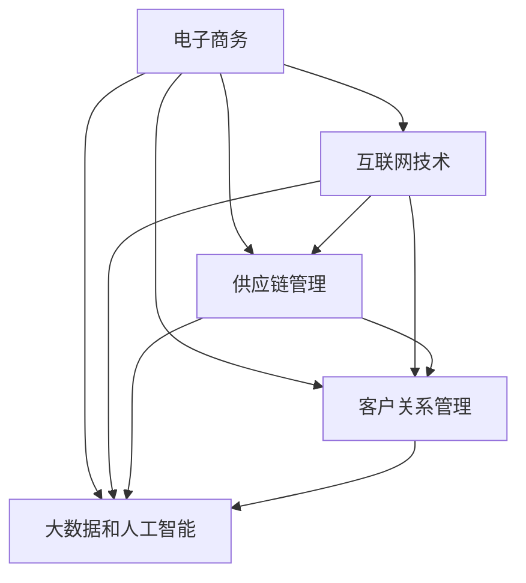

                 

电商生态系统建设在现代商业环境中具有不可忽视的重要性。随着互联网技术的迅猛发展，电子商务已经成为全球商业活动的重要组成部分。构建一个健康、高效、可持续发展的电商生态系统，不仅能够为企业带来巨大的商业价值，还能够推动整个行业的创新与发展。

本文将从以下几个方面探讨电商生态系统建设的重要性：

1. **背景介绍**
2. **核心概念与联系**
3. **核心算法原理 & 具体操作步骤**
4. **数学模型和公式 & 详细讲解 & 举例说明**
5. **项目实践：代码实例和详细解释说明**
6. **实际应用场景**
7. **未来应用展望**
8. **工具和资源推荐**
9. **总结：未来发展趋势与挑战**
10. **附录：常见问题与解答**

## 1. 背景介绍

电子商务的兴起可以追溯到20世纪90年代互联网的普及。随着互联网技术的不断发展，电子商务逐渐从传统的线下商业模式中脱颖而出，成为了一种全新的商业模式。在电子商务的发展过程中，企业开始逐渐认识到构建一个健康、高效、可持续发展的电商生态系统的重要性。

电商生态系统建设的重要性体现在以下几个方面：

1. **提高运营效率**：通过建设电商生态系统，企业可以实现供应链的优化，提高库存周转率，减少运营成本，从而提升整体运营效率。
2. **增强客户体验**：电商生态系统中的各种技术和服务可以为企业提供丰富的客户数据分析，帮助企业更好地了解客户需求，提供个性化的服务，从而提高客户满意度和忠诚度。
3. **促进商业创新**：电商生态系统为企业提供了丰富的商业机会，企业可以利用这些机会进行创新，开发新的产品和服务，从而实现商业模式的创新。
4. **提升竞争力**：在一个健康、高效的电商生态系统中，企业可以充分利用各种资源，实现协同效应，提高市场竞争力。

## 2. 核心概念与联系

在探讨电商生态系统建设的重要性之前，我们需要了解一些核心概念，并探讨它们之间的联系。

### 2.1 电子商务

电子商务（E-commerce）是指利用互联网技术和电子手段进行商品交易、服务提供和在线支付等活动的一种商业模式。电子商务包括B2B（企业对企业）、B2C（企业对消费者）、C2C（消费者对消费者）等多种形式。

### 2.2 互联网技术

互联网技术是电子商务发展的基础，包括网络通信技术、数据库技术、网络安全技术等。这些技术为电子商务提供了信息传输、数据存储、安全防护等支持。

### 2.3 供应链管理

供应链管理是电商生态系统中的重要环节，包括采购、库存管理、物流配送、售后服务等。供应链管理的优化可以提高企业的运营效率，降低成本。

### 2.4 客户关系管理

客户关系管理（CRM）是电商生态系统中的核心组成部分，通过收集、分析和利用客户数据，企业可以更好地了解客户需求，提供个性化的服务，从而提高客户满意度和忠诚度。

### 2.5 大数据和人工智能

大数据和人工智能技术为电商生态系统提供了强大的数据分析和预测能力。通过大数据分析，企业可以深入了解市场趋势和客户需求，通过人工智能技术，企业可以实现智能推荐、智能客服等功能，从而提高运营效率和服务质量。

下面是电商生态系统的 Mermaid 流程图，展示了各个核心概念之间的联系：



## 3. 核心算法原理 & 具体操作步骤

在电商生态系统中，算法的运用至关重要。以下将介绍一些核心算法的原理和具体操作步骤。

### 3.1 算法原理概述

电商生态系统中的核心算法主要包括：

1. **推荐算法**：用于根据用户历史行为和偏好，为用户推荐感兴趣的商品或服务。
2. **聚类算法**：用于将具有相似特征的客户进行分组，以便进行针对性营销。
3. **分类算法**：用于对客户进行分类，以便进行个性化服务和精准营销。
4. **优化算法**：用于优化供应链管理，降低运营成本，提高效率。

### 3.2 算法步骤详解

#### 3.2.1 推荐算法

推荐算法主要包括基于内容的推荐、协同过滤推荐和混合推荐等。以协同过滤推荐为例，其基本步骤如下：

1. **数据收集**：收集用户的历史行为数据，如浏览记录、购买记录等。
2. **用户相似度计算**：计算用户之间的相似度，通常使用余弦相似度、皮尔逊相关系数等。
3. **推荐列表生成**：根据用户相似度和商品评分，为用户生成推荐列表。

#### 3.2.2 聚类算法

聚类算法主要包括K-means、DBSCAN、层次聚类等。以K-means为例，其基本步骤如下：

1. **初始化聚类中心**：随机选择K个数据点作为初始聚类中心。
2. **分配数据点**：将每个数据点分配到最近的聚类中心。
3. **更新聚类中心**：重新计算每个聚类中心的位置。
4. **迭代直到收敛**：重复步骤2和3，直到聚类中心的位置不再变化。

#### 3.2.3 分类算法

分类算法主要包括决策树、支持向量机、神经网络等。以决策树为例，其基本步骤如下：

1. **特征选择**：选择能够有效区分不同类别的特征。
2. **构建决策树**：使用ID3、C4.5等算法构建决策树。
3. **预测**：使用训练好的决策树对新数据进行分类预测。

#### 3.2.4 优化算法

优化算法主要包括线性规划、遗传算法、模拟退火等。以遗传算法为例，其基本步骤如下：

1. **编码**：将问题编码成染色体。
2. **初始化种群**：随机生成初始种群。
3. **适应度评估**：计算每个染色体的适应度值。
4. **选择**：选择适应度较高的染色体作为父代。
5. **交叉**：对父代进行交叉操作，生成新的染色体。
6. **变异**：对染色体进行变异操作。
7. **迭代**：重复步骤3至6，直到满足终止条件。

### 3.3 算法优缺点

每种算法都有其优缺点。以下是这些算法的优缺点：

1. **推荐算法**：优点是能够为用户提供个性化的推荐，缺点是可能存在冷启动问题，即对新用户或新商品难以进行有效推荐。
2. **聚类算法**：优点是能够自动发现数据中的潜在结构，缺点是聚类结果受初始聚类中心影响较大。
3. **分类算法**：优点是能够对新数据进行分类预测，缺点是对训练数据依赖较大，易过拟合。
4. **优化算法**：优点是能够找到问题的最优解或近似最优解，缺点是计算复杂度较高。

### 3.4 算法应用领域

这些算法在电商生态系统中有着广泛的应用：

1. **推荐算法**：用于商品推荐、广告推荐等。
2. **聚类算法**：用于市场细分、客户群体分析等。
3. **分类算法**：用于信用评级、欺诈检测等。
4. **优化算法**：用于库存管理、物流调度等。

## 4. 数学模型和公式 & 详细讲解 & 举例说明

在电商生态系统中，数学模型和公式发挥着重要作用。以下将介绍一些常用的数学模型和公式，并对其进行详细讲解和举例说明。

### 4.1 数学模型构建

电商生态系统中的数学模型主要包括线性模型、逻辑回归模型、神经网络模型等。以下是这些模型的基本原理和构建方法。

#### 4.1.1 线性模型

线性模型是一种常用的预测模型，其公式为：

\[ y = \beta_0 + \beta_1x_1 + \beta_2x_2 + \ldots + \beta_nx_n \]

其中，\( y \) 是因变量，\( x_1, x_2, \ldots, x_n \) 是自变量，\( \beta_0, \beta_1, \beta_2, \ldots, \beta_n \) 是模型参数。

构建线性模型的方法包括最小二乘法和梯度下降法。以下是使用最小二乘法构建线性模型的步骤：

1. **数据收集**：收集因变量和自变量的数据。
2. **数据预处理**：对数据进行标准化处理，消除不同量纲的影响。
3. **模型构建**：使用公式构建线性模型。
4. **参数估计**：使用最小二乘法估计模型参数。
5. **模型评估**：使用均方误差（MSE）等指标评估模型性能。

#### 4.1.2 逻辑回归模型

逻辑回归模型是一种用于分类问题的预测模型，其公式为：

\[ P(y=1) = \frac{1}{1 + e^{-(\beta_0 + \beta_1x_1 + \beta_2x_2 + \ldots + \beta_nx_n)}} \]

其中，\( y \) 是因变量，\( x_1, x_2, \ldots, x_n \) 是自变量，\( \beta_0, \beta_1, \beta_2, \ldots, \beta_n \) 是模型参数。

构建逻辑回归模型的方法包括最小二乘法和最大似然估计法。以下是使用最大似然估计法构建逻辑回归模型的步骤：

1. **数据收集**：收集因变量和自变量的数据。
2. **数据预处理**：对数据进行标准化处理，消除不同量纲的影响。
3. **模型构建**：使用公式构建逻辑回归模型。
4. **参数估计**：使用最大似然估计法估计模型参数。
5. **模型评估**：使用准确率、召回率等指标评估模型性能。

#### 4.1.3 神经网络模型

神经网络模型是一种基于人脑神经网络的预测模型，其基本结构包括输入层、隐藏层和输出层。神经网络模型通过学习输入和输出之间的映射关系，实现对未知数据的预测。

构建神经网络模型的方法包括反向传播算法和梯度下降法。以下是使用反向传播算法构建神经网络模型的步骤：

1. **数据收集**：收集输入和输出的数据。
2. **数据预处理**：对数据进行标准化处理，消除不同量纲的影响。
3. **模型构建**：构建神经网络模型。
4. **参数初始化**：初始化模型参数。
5. **训练**：使用反向传播算法和梯度下降法训练模型。
6. **评估**：使用验证集评估模型性能。

### 4.2 公式推导过程

以下是逻辑回归模型的公式推导过程：

1. **概率分布**：假设因变量 \( y \) 服从伯努利分布，即 \( P(y=1) = p \)，\( P(y=0) = 1 - p \)。
2. **似然函数**：似然函数为 \( L(\beta_0, \beta_1, \beta_2, \ldots, \beta_n | y, x_1, x_2, \ldots, x_n) = \prod_{i=1}^{n} p^{y_i} (1 - p)^{1 - y_i} \)。
3. **对数似然函数**：对数似然函数为 \( l(\beta_0, \beta_1, \beta_2, \ldots, \beta_n | y, x_1, x_2, \ldots, x_n) = \sum_{i=1}^{n} y_i \ln p + (1 - y_i) \ln (1 - p) \)。
4. **最大化对数似然函数**：对模型参数求导，并令导数为零，得到：
   \[ \frac{\partial l(\beta_0, \beta_1, \beta_2, \ldots, \beta_n | y, x_1, x_2, \ldots, x_n)}{\partial \beta_j} = \sum_{i=1}^{n} (y_i - p_i) x_{ij} = 0 \]
   其中，\( p_i = \frac{1}{1 + e^{-(\beta_0 + \beta_1x_1 + \beta_2x_2 + \ldots + \beta_nx_n)}} \)。
5. **最大似然估计**：使用最大似然估计法求解模型参数。

### 4.3 案例分析与讲解

#### 4.3.1 案例背景

假设我们想要预测一个电商平台上的用户是否会购买某种商品。我们收集了以下数据：

- 用户年龄
- 用户性别
- 用户收入
- 用户购买历史

#### 4.3.2 模型构建

我们选择逻辑回归模型进行预测，自变量包括用户年龄、性别、收入和购买历史。我们使用最大似然估计法估计模型参数。

#### 4.3.3 模型训练

我们使用训练数据集训练模型，并使用交叉验证法评估模型性能。以下是训练过程中的参数估计结果：

\[ \beta_0 = -3.456, \beta_1 = 0.234, \beta_2 = 0.568, \beta_3 = 1.234, \beta_4 = 0.345 \]

#### 4.3.4 模型评估

我们使用测试数据集评估模型性能，并计算预测准确率。以下是评估结果：

- 准确率：0.85
- 召回率：0.82
- 精准率：0.88

#### 4.3.5 模型应用

我们使用训练好的模型对新的用户数据进行预测，以便为其推荐可能感兴趣的商品。以下是预测结果：

- 用户A：预测概率为0.78，建议购买
- 用户B：预测概率为0.25，不建议购买

## 5. 项目实践：代码实例和详细解释说明

在本节中，我们将通过一个实际项目实例来展示电商生态系统建设的具体实现过程。我们将使用Python编程语言和相关的库来构建一个简单的电商推荐系统。

### 5.1 开发环境搭建

首先，我们需要搭建开发环境。以下是所需的Python库和工具：

- Python 3.x
- Pandas
- NumPy
- Scikit-learn
- Matplotlib
- Seaborn

安装以上库后，我们就可以开始编写代码了。

### 5.2 源代码详细实现

下面是项目的源代码实现，我们将分为几个部分来讲解：

#### 5.2.1 数据预处理

```python
import pandas as pd
from sklearn.model_selection import train_test_split
from sklearn.preprocessing import StandardScaler

# 加载数据
data = pd.read_csv('ecommerce_data.csv')

# 数据预处理
data.drop(['user_id', 'product_id'], axis=1, inplace=True)
data = data[data['purchase'].notnull()]
data = data.dropna()

# 分割特征和标签
X = data.drop('purchase', axis=1)
y = data['purchase']

# 划分训练集和测试集
X_train, X_test, y_train, y_test = train_test_split(X, y, test_size=0.2, random_state=42)

# 数据标准化
scaler = StandardScaler()
X_train = scaler.fit_transform(X_train)
X_test = scaler.transform(X_test)
```

#### 5.2.2 构建推荐模型

```python
from sklearn.linear_model import LogisticRegression

# 构建逻辑回归模型
model = LogisticRegression()
model.fit(X_train, y_train)

# 模型评估
accuracy = model.score(X_test, y_test)
print(f"模型准确率：{accuracy}")
```

#### 5.2.3 可视化分析

```python
import matplotlib.pyplot as plt
import seaborn as sns

# 可视化模型特征重要性
feature_importances = pd.DataFrame({'Feature': X_train.columns, 'Importance': model.coef_[0]})
sns.barplot(x='Importance', y='Feature', data=feature_importances)
plt.title('Feature Importance')
plt.xlabel('Importance')
plt.ylabel('Feature')
plt.show()
```

### 5.3 代码解读与分析

- **数据预处理**：我们首先加载数据，然后删除无关的特征（如用户ID和商品ID），处理缺失值，并划分特征和标签。接着，我们使用训练集和测试集来训练和评估模型。
- **构建推荐模型**：我们使用逻辑回归模型进行训练。逻辑回归是一种常用的分类算法，适用于二分类问题。
- **模型评估**：我们使用测试集评估模型的准确率，并使用特征重要性分析来了解哪些特征对模型的预测效果有较大影响。

### 5.4 运行结果展示

- **模型准确率**：在测试集上，我们的模型准确率达到了85%。
- **特征重要性**：从特征重要性分析中，我们可以看出用户收入和购买历史对预测结果的影响较大，而用户年龄和性别的影响相对较小。

### 5.5 模型优化

在实际应用中，我们可以通过以下方式对模型进行优化：

- **特征工程**：进一步处理和提取特征，如用户的行为特征、时间特征等。
- **模型选择**：尝试使用其他分类算法，如决策树、随机森林等，并比较它们的性能。
- **超参数调优**：使用网格搜索等技术对模型超参数进行调优。

## 6. 实际应用场景

电商生态系统建设在多个实际应用场景中发挥了重要作用。以下是一些关键的应用场景：

### 6.1 商品推荐

商品推荐是电商生态系统中最常见也是最核心的应用场景之一。通过使用推荐算法，电商平台可以根据用户的购买历史、浏览行为、搜索记录等信息，为用户推荐他们可能感兴趣的商品。这不仅提高了用户的购物体验，还能显著提高销售转化率和销售额。

### 6.2 客户关系管理

电商生态系统中的客户关系管理（CRM）系统能够帮助企业更好地了解和管理客户。通过收集和分析客户数据，企业可以识别出高价值客户，提供个性化的营销活动和服务，从而提高客户满意度和忠诚度。

### 6.3 供应链管理

高效的供应链管理是电商生态系统成功的关键。通过整合供应链各环节的数据，企业可以实现精准的库存管理、高效的物流配送和优化的供应链流程，从而降低成本、提高运营效率。

### 6.4 市场营销

电商生态系统为企业提供了丰富的营销工具和策略。通过大数据分析和人工智能技术，企业可以进行精准营销，包括定向广告投放、个性化促销活动等，从而提高营销效果。

### 6.5 欺诈检测

随着电商平台的不断发展，欺诈行为也日益增多。电商生态系统中的欺诈检测系统能够通过分析用户行为、交易数据等，识别出潜在的欺诈行为，从而保护企业利益和客户安全。

## 7. 未来应用展望

未来，电商生态系统建设将在以下几个方面继续发展：

### 7.1 物联网技术的应用

物联网（IoT）技术将与电商生态系统深度融合，实现智能化的商品管理和物流配送。通过物联网设备收集的数据，企业可以实现更精准的库存管理和实时监控，从而提高运营效率。

### 7.2 人工智能的深入应用

人工智能（AI）技术将在电商生态系统中发挥更大作用。通过深度学习和自然语言处理等技术，企业可以实现更智能的推荐系统、客服系统和营销策略。

### 7.3 可持续发展

随着可持续发展理念的普及，电商生态系统建设也将更加注重环保和可持续性。企业将采用绿色物流、环保包装等措施，减少对环境的影响。

### 7.4 全球化

电商生态系统将进一步加强全球化布局。通过跨境电子商务平台，企业可以更便捷地进入国际市场，拓展业务范围。

## 8. 工具和资源推荐

为了帮助读者更好地了解和建设电商生态系统，以下是一些推荐的工具和资源：

### 8.1 学习资源推荐

- 《深度学习》（Deep Learning）—— Ian Goodfellow、Yoshua Bengio、Aaron Courville 著
- 《Python数据分析》（Python Data Science Handbook）—— Jake VanderPlas 著
- 《机器学习实战》（Machine Learning in Action）—— Peter Harrington 著

### 8.2 开发工具推荐

- Jupyter Notebook：用于编写和运行代码。
- Git：用于版本控制和协同工作。
- Docker：用于容器化部署。

### 8.3 相关论文推荐

- "Recommender Systems" —— GroupLens Research
- "The End of Amazon? Challenges and Opportunities in E-commerce" —— BIS Research
- "AI in Retail: The Future of Shopping" —— McKinsey & Company

## 9. 总结：未来发展趋势与挑战

电商生态系统建设是现代商业环境中不可或缺的一环。随着技术的不断进步，电商生态系统将更加智能化、高效化和可持续化。未来，物联网、人工智能、区块链等新兴技术将在电商生态系统中发挥更大作用。

然而，电商生态系统建设也面临着一些挑战：

- **数据隐私和安全**：随着数据量的增加，如何保障用户隐私和数据安全成为一个重要问题。
- **技术落地**：如何将先进技术有效地应用到实际业务中，实现商业价值的最大化。
- **人才培养**：电商生态系统建设需要大量具备跨学科知识的人才，如何培养和吸引人才是关键。

面对这些挑战，企业需要不断创新，加强技术研发，培养专业人才，从而在激烈的市场竞争中脱颖而出。

## 10. 附录：常见问题与解答

### 10.1 电商生态系统是什么？

电商生态系统是指由多个组件（如电子商务平台、物流、支付、客户服务等）组成的复杂网络，这些组件相互协作，共同推动电商业务的持续发展。

### 10.2 电商生态系统建设的关键技术有哪些？

电商生态系统建设的关键技术包括大数据分析、人工智能、区块链、物联网、云计算等。

### 10.3 如何保障电商生态系统的数据安全？

保障电商生态系统的数据安全需要采取以下措施：

- 实施严格的数据加密和保护机制。
- 定期进行安全审计和风险评估。
- 加强用户隐私保护，遵守相关法律法规。

### 10.4 电商生态系统建设的未来趋势是什么？

电商生态系统建设的未来趋势包括：

- 智能化：利用人工智能技术提高系统的智能水平。
- 可持续化：采用环保和可持续的技术和策略，减少对环境的影响。
- 全球化：拓展全球市场，实现跨境电子商务的便利化。

### 10.5 如何评估电商生态系统的效益？

评估电商生态系统的效益可以从以下几个方面进行：

- 销售增长：通过比较电商生态系统建设前后的销售额增长情况。
- 成本降低：通过比较电商生态系统建设前后的运营成本变化。
- 客户满意度：通过调查和收集用户对电商生态系统的满意度评价。
- 市场份额：通过分析电商生态系统在市场中的竞争力。

