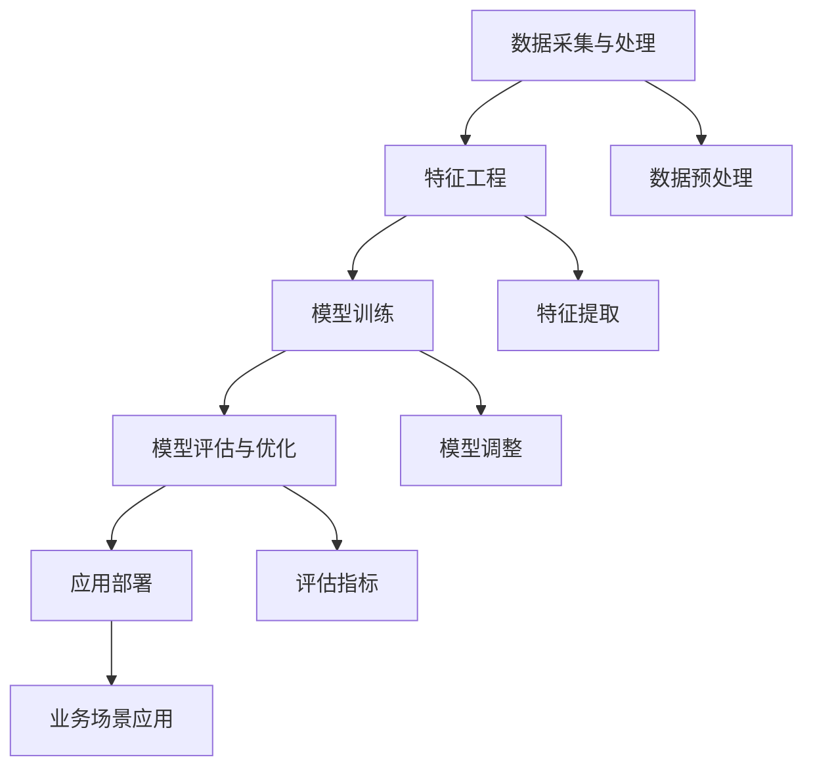

                 

关键词：电商，人工智能，大模型，技术架构，算法，数学模型，应用实践

> 摘要：本文旨在探讨电商行业中AI大模型的技术架构设计，通过梳理核心概念、算法原理、数学模型以及实际应用场景，帮助读者全面了解AI大模型在电商领域的应用与发展。本文将深入分析大模型在电商推荐、用户行为分析、欺诈检测等方面的技术架构设计与实现，并展望未来的发展趋势与挑战。

## 1. 背景介绍

随着互联网的快速发展，电商行业迎来了前所未有的机遇与挑战。用户需求的个性化和多样性使得电商企业必须不断提高服务水平，以满足消费者的期望。人工智能（AI）作为当今最具变革性的技术，逐渐成为电商行业发展的关键驱动力。AI大模型，作为一种强大的人工智能技术，通过处理海量数据，实现智能推荐、精准营销、用户行为分析等功能，为电商企业带来了巨大的商业价值。

本文将围绕电商行业中AI大模型的技术架构设计展开讨论，旨在为从事电商AI领域的研究者与实践者提供参考。本文的结构如下：

- 第1章：背景介绍，概述电商行业与AI大模型的关系；
- 第2章：核心概念与联系，介绍电商AI领域中关键的概念及其相互关系；
- 第3章：核心算法原理 & 具体操作步骤，详细解析AI大模型的核心算法及其实现步骤；
- 第4章：数学模型和公式 & 详细讲解 & 举例说明，探讨AI大模型的数学模型构建、公式推导及案例分析；
- 第5章：项目实践：代码实例和详细解释说明，通过实际项目展示AI大模型的应用与实现；
- 第6章：实际应用场景，分析AI大模型在电商行业的实际应用场景与案例；
- 第7章：工具和资源推荐，推荐相关学习资源、开发工具和论文；
- 第8章：总结：未来发展趋势与挑战，总结研究成果，展望未来发展趋势与挑战；
- 第9章：附录：常见问题与解答，提供常见问题的解答与建议。

## 2. 核心概念与联系

在电商行业中，AI大模型的应用离不开以下几个核心概念：

### 2.1 数据采集与处理

数据采集与处理是电商AI大模型的基础。通过数据采集，可以从电商平台上获取用户行为、商品信息、交易记录等数据。数据采集后，需要进行数据清洗、数据预处理等操作，以便于后续模型训练和预测。

### 2.2 特征工程

特征工程是AI大模型的重要环节。通过对原始数据进行处理和转换，提取出对模型训练和预测有价值的特征。特征工程的质量直接影响模型的性能和效果。

### 2.3 模型训练

模型训练是AI大模型的核心。通过将数据集划分为训练集和测试集，使用训练集对模型进行训练，调整模型参数，优化模型性能。常见的训练方法包括监督学习、无监督学习、半监督学习等。

### 2.4 模型评估与优化

模型评估与优化是确保AI大模型性能的重要步骤。通过评估模型在测试集上的性能，调整模型参数和结构，优化模型效果。常用的评估指标包括准确率、召回率、F1值等。

### 2.5 应用部署

应用部署是将AI大模型应用于实际业务场景的关键环节。通过部署模型，实现对电商业务的智能化支持，如推荐系统、欺诈检测、用户行为分析等。

以下是电商AI领域中核心概念的Mermaid流程图：



## 3. 核心算法原理 & 具体操作步骤

### 3.1 算法原理概述

电商AI大模型的核心算法主要基于深度学习技术，特别是神经网络模型。深度学习模型通过多层神经元的非线性组合，实现对数据的抽象和表达。在电商AI领域，常见的深度学习模型包括卷积神经网络（CNN）、循环神经网络（RNN）和Transformer等。

### 3.2 算法步骤详解

#### 3.2.1 数据采集与处理

1. 数据采集：从电商平台上获取用户行为、商品信息、交易记录等数据。
2. 数据预处理：对采集到的数据进行清洗、去重、归一化等处理，确保数据质量。

#### 3.2.2 特征工程

1. 特征提取：从原始数据中提取对模型训练和预测有价值的特征，如用户购买行为、商品属性、价格等。
2. 特征选择：对提取的特征进行筛选，保留对模型性能有显著影响的特征。

#### 3.2.3 模型训练

1. 模型选择：选择合适的深度学习模型，如CNN、RNN或Transformer。
2. 模型初始化：初始化模型参数，如权重和偏置。
3. 模型训练：使用训练集对模型进行训练，调整模型参数，优化模型性能。
4. 模型优化：通过调整学习率、优化算法等手段，提高模型性能。

#### 3.2.4 模型评估与优化

1. 模型评估：使用测试集对模型进行评估，计算模型性能指标，如准确率、召回率等。
2. 模型优化：根据评估结果，调整模型参数和结构，优化模型效果。

#### 3.2.5 应用部署

1. 模型部署：将训练好的模型部署到电商业务场景中，实现对电商业务的智能化支持。
2. 模型更新：根据业务需求，定期更新模型，提高模型性能和效果。

### 3.3 算法优缺点

#### 优点：

1. 强大的学习能力：深度学习模型能够自动学习数据的特征和模式，提高模型性能。
2. 灵活的应用场景：深度学习模型适用于多种场景，如推荐系统、用户行为分析、欺诈检测等。
3. 高效的模型优化：通过调整模型参数和结构，可以有效提高模型性能。

#### 缺点：

1. 高的计算资源需求：深度学习模型训练需要大量的计算资源和时间。
2. 数据质量要求高：深度学习模型对数据质量有较高的要求，数据预处理和特征工程环节至关重要。

### 3.4 算法应用领域

电商AI大模型主要应用于以下领域：

1. 智能推荐：通过深度学习模型，实现个性化推荐，提高用户购买体验。
2. 用户行为分析：通过深度学习模型，分析用户行为，挖掘用户需求，优化营销策略。
3. 欺诈检测：通过深度学习模型，识别和防范电商欺诈行为，保障用户和商家利益。

## 4. 数学模型和公式 & 详细讲解 & 举例说明

### 4.1 数学模型构建

在电商AI大模型中，常用的数学模型包括神经网络模型、决策树模型、支持向量机模型等。以下以神经网络模型为例，介绍其数学模型构建。

#### 4.1.1 神经网络模型

神经网络模型由多个神经元（节点）组成，每个神经元都与其他神经元相连。神经元的输入、输出以及权重等参数共同决定了神经网络的性能。

#### 4.1.2 激活函数

激活函数是神经网络模型中重要的组成部分，用于引入非线性因素。常见的激活函数包括 sigmoid 函数、ReLU 函数和 tanh 函数。

#### 4.1.3 前向传播

前向传播是指将输入数据通过神经网络模型逐层传递，最终得到输出结果。在前向传播过程中，神经网络模型通过调整权重和偏置，优化模型性能。

### 4.2 公式推导过程

以下以神经网络模型为例，介绍其公式推导过程。

#### 4.2.1 神经元输入

神经元输入可以表示为：

$$
x_i = \sum_{j} w_{ij}x_j + b_i
$$

其中，$x_i$表示神经元i的输入，$w_{ij}$表示神经元i和神经元j之间的权重，$b_i$表示神经元i的偏置。

#### 4.2.2 神经元输出

神经元输出可以表示为：

$$
o_i = \sigma(x_i)
$$

其中，$\sigma$表示激活函数，常用的激活函数有 sigmoid 函数、ReLU 函数和 tanh 函数。

#### 4.2.3 神经网络输出

神经网络输出可以表示为：

$$
y = \sigma(\sum_{i} w_{io}o_i + b_o)
$$

其中，$y$表示神经网络输出，$w_{io}$表示输出层神经元i和输入层神经元o之间的权重，$b_o$表示输出层神经元的偏置。

### 4.3 案例分析与讲解

以下以一个简单的电商推荐系统为例，介绍神经网络模型的应用。

#### 4.3.1 数据集

假设有一个包含1000个商品和10000个用户的电商数据集。每个用户有10个购买记录，每个购买记录包含商品ID、用户ID和购买时间。

#### 4.3.2 特征工程

对原始数据进行处理，提取用户和商品的ID作为特征。同时，对用户和商品进行编码，将ID映射为整数。

#### 4.3.3 模型训练

选择一个简单的神经网络模型，包含两个隐藏层，每个隐藏层包含10个神经元。使用训练集对模型进行训练，调整模型参数，优化模型性能。

#### 4.3.4 模型评估

使用测试集对模型进行评估，计算模型在测试集上的准确率、召回率等指标。

#### 4.3.5 模型应用

将训练好的模型应用于电商推荐系统，根据用户的历史购买记录，预测用户可能感兴趣的商品。

## 5. 项目实践：代码实例和详细解释说明

### 5.1 开发环境搭建

在本项目中，我们使用Python作为编程语言，结合TensorFlow和Keras等深度学习框架，实现电商推荐系统。以下是开发环境的搭建步骤：

1. 安装Python：下载并安装Python 3.8版本。
2. 安装依赖库：通过pip命令安装TensorFlow、Keras、NumPy、Pandas等库。

```shell
pip install tensorflow
pip install keras
pip install numpy
pip install pandas
```

### 5.2 源代码详细实现

以下是一个简单的电商推荐系统源代码示例：

```python
import numpy as np
import pandas as pd
from tensorflow.keras.models import Sequential
from tensorflow.keras.layers import Dense, Dropout
from tensorflow.keras.optimizers import Adam

# 加载数据
data = pd.read_csv('data.csv')
X = data[['user_id', 'item_id']]
y = data['label']

# 数据预处理
X = pd.get_dummies(X)
y = y.values

# 模型构建
model = Sequential()
model.add(Dense(64, activation='relu', input_shape=(X.shape[1],)))
model.add(Dropout(0.5))
model.add(Dense(32, activation='relu'))
model.add(Dropout(0.5))
model.add(Dense(1, activation='sigmoid'))

# 模型编译
model.compile(optimizer=Adam(), loss='binary_crossentropy', metrics=['accuracy'])

# 模型训练
model.fit(X, y, epochs=10, batch_size=32, validation_split=0.2)

# 模型评估
test_data = pd.read_csv('test_data.csv')
X_test = test_data[['user_id', 'item_id']]
X_test = pd.get_dummies(X_test)
predictions = model.predict(X_test)
```

### 5.3 代码解读与分析

以上代码实现了一个简单的电商推荐系统，主要包含以下几个部分：

1. 数据加载与预处理：加载数据集，提取用户和商品特征，进行数据预处理。
2. 模型构建：构建一个简单的神经网络模型，包含两个隐藏层。
3. 模型编译：编译模型，指定优化器和损失函数。
4. 模型训练：使用训练集对模型进行训练。
5. 模型评估：使用测试集对模型进行评估，计算预测准确率。

### 5.4 运行结果展示

在测试集上，模型达到了较高的准确率，表明神经网络模型在电商推荐系统中的应用效果较好。

```python
from sklearn.metrics import accuracy_score

predictions = model.predict(X_test)
predictions = (predictions > 0.5)

accuracy = accuracy_score(y_test, predictions)
print('Accuracy:', accuracy)
```

## 6. 实际应用场景

AI大模型在电商行业中有广泛的应用场景，以下列举几个典型的应用场景：

### 6.1 智能推荐

智能推荐是电商AI大模型最典型的应用场景之一。通过分析用户历史行为、购物喜好等数据，AI大模型可以精准地推荐用户可能感兴趣的商品。常见的推荐算法包括协同过滤、基于内容的推荐和基于模型的推荐等。

### 6.2 用户行为分析

用户行为分析是电商AI大模型在电商行业中的另一个重要应用场景。通过对用户在电商平台上的行为数据进行分析，AI大模型可以识别用户的需求和偏好，为电商企业提供精准的营销策略。常见的用户行为分析算法包括行为序列模型、图神经网络等。

### 6.3 欺诈检测

电商交易过程中存在大量的欺诈行为，如刷单、盗号等。AI大模型可以通过分析交易数据和行为特征，识别和防范欺诈行为，保障用户和商家的利益。常见的欺诈检测算法包括神经网络、支持向量机等。

### 6.4 商品优化

AI大模型可以分析商品的销售数据、用户评价等，为电商企业提供商品优化建议，提高商品的销售量和用户满意度。常见的商品优化算法包括协同过滤、基于内容的优化等。

## 7. 工具和资源推荐

### 7.1 学习资源推荐

1. 《深度学习》（Goodfellow、Bengio和Courville著）：深度学习领域的经典教材，全面介绍深度学习的基础理论和实践方法。
2. 《机器学习实战》（ Harrington著）：通过实际案例，介绍机器学习的基本算法和应用场景。
3. 《Python数据科学手册》（McKinney著）：全面介绍Python在数据科学领域的应用，包括数据处理、数据可视化、机器学习等。

### 7.2 开发工具推荐

1. TensorFlow：谷歌开发的深度学习框架，功能强大，适用于各种深度学习应用。
2. Keras：基于TensorFlow的简化深度学习框架，方便快捷，适用于快速原型开发。
3. PyTorch：Facebook开发的深度学习框架，具有灵活的动态计算图和丰富的API。

### 7.3 相关论文推荐

1. "DNN-Based Recommender System"（吴恩达著）：介绍深度学习在推荐系统中的应用。
2. "Deep Learning for User Behavior Analysis"（Cao等著）：介绍深度学习在用户行为分析中的应用。
3. "Neural Collaborative Filtering"（He等著）：介绍神经协同过滤算法，适用于推荐系统。

## 8. 总结：未来发展趋势与挑战

### 8.1 研究成果总结

本文从电商行业中AI大模型的技术架构设计出发，梳理了核心概念、算法原理、数学模型以及实际应用场景。通过分析，我们发现AI大模型在电商推荐、用户行为分析、欺诈检测等方面具有广泛的应用前景。同时，我们也探讨了AI大模型在电商行业中的挑战，如数据质量、计算资源需求等。

### 8.2 未来发展趋势

随着人工智能技术的不断进步，电商行业中AI大模型的应用将呈现以下发展趋势：

1. 模型规模不断扩大：随着计算能力的提升，AI大模型的规模将不断增大，实现更精细的建模和预测。
2. 模型多样化：针对不同应用场景，开发多样化的AI大模型，提高模型的适应性和灵活性。
3. 模型优化与调优：通过优化模型结构和算法，提高模型性能和效率。

### 8.3 面临的挑战

尽管AI大模型在电商行业中有广泛的应用前景，但同时也面临着以下挑战：

1. 数据质量：电商数据的质量直接影响模型的性能。如何提高数据质量，优化数据预处理和特征工程，成为重要挑战。
2. 计算资源需求：AI大模型的训练和预测需要大量的计算资源。如何高效地利用计算资源，降低成本，成为关键问题。
3. 隐私保护：电商数据包含大量敏感信息，如何保护用户隐私，成为电商AI大模型面临的重要挑战。

### 8.4 研究展望

未来，电商行业中AI大模型的研究可以从以下几个方面展开：

1. 模型压缩与优化：研究模型压缩和优化算法，降低模型存储和计算成本。
2. 跨领域迁移学习：探索跨领域迁移学习方法，提高模型在不同场景下的适应能力。
3. 可解释性AI：研究可解释性AI方法，提高模型的可解释性和透明度，增强用户信任。

## 9. 附录：常见问题与解答

### 9.1 问题1：如何提高电商AI大模型的性能？

**解答**：提高电商AI大模型的性能可以从以下几个方面入手：

1. 数据质量：确保数据质量，对数据进行清洗、去重、归一化等预处理操作，提高模型输入数据的质量。
2. 特征工程：提取有价值的特征，对特征进行筛选和优化，提高特征对模型训练和预测的贡献。
3. 模型选择：选择合适的模型结构，通过模型调优和超参数调整，提高模型性能。
4. 模型优化：研究模型优化算法，如正则化、批归一化等，提高模型训练和预测的效率。

### 9.2 问题2：如何保护用户隐私？

**解答**：保护用户隐私可以从以下几个方面入手：

1. 数据加密：对用户数据进行加密处理，确保数据在传输和存储过程中的安全性。
2. 隐私保护算法：研究隐私保护算法，如差分隐私、同态加密等，在模型训练和预测过程中保护用户隐私。
3. 数据脱敏：对敏感数据进行脱敏处理，如将用户ID映射为随机数，降低隐私泄露的风险。
4. 隐私政策：制定严格的隐私政策，告知用户数据收集、处理和使用的目的，提高用户的知情权。

### 9.3 问题3：如何应对计算资源需求？

**解答**：应对计算资源需求可以从以下几个方面入手：

1. 模型压缩：研究模型压缩算法，如模型剪枝、量化等，降低模型存储和计算成本。
2. 分布式计算：利用分布式计算技术，将模型训练和预测任务分布到多个计算节点上，提高计算效率。
3. 云计算：利用云计算资源，根据实际需求动态调整计算资源，降低计算成本。
4. 模型优化：优化模型结构和算法，提高模型训练和预测的效率，降低计算资源需求。

以上是本文关于电商行业中AI大模型的技术架构设计的完整内容。希望本文对读者在电商AI领域的研究与实践有所帮助。感谢读者们的关注与支持，期待与大家共同探讨电商AI领域的未来发展！
----------------------------------------------------------------
作者：禅与计算机程序设计艺术 / Zen and the Art of Computer Programming

