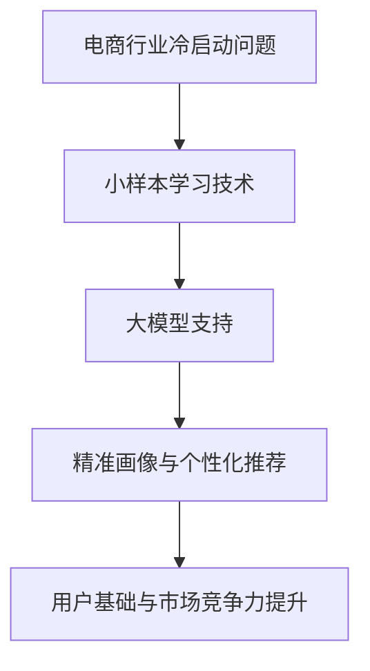

                 

关键词：电商行业，小样本学习，大模型，冷启动问题，应用

摘要：本文首先介绍了电商行业中的冷启动问题，以及如何利用小样本学习技术来提高大模型的预测准确性。接着，详细阐述了小样本学习的核心概念与联系，并通过Mermaid流程图展示了其原理和架构。随后，深入解析了小样本学习的算法原理、具体操作步骤以及优缺点。本文还从数学模型和公式、项目实践、实际应用场景等多个角度进行了全面探讨，并展望了未来的发展趋势与挑战。

## 1. 背景介绍

随着互联网的快速发展，电商行业已经成为全球经济的核心驱动力之一。然而，电商行业的竞争日益激烈，企业需要在短时间内快速建立自己的用户基础，以提高市场竞争力。这就带来了一个重要的问题：冷启动问题。冷启动问题指的是在一个新的市场或业务领域中，企业缺乏足够的用户数据和资源，难以进行有效的用户画像和个性化推荐。

传统的机器学习算法通常依赖于大规模的数据集进行训练，而在冷启动阶段，企业往往缺乏这样的数据。因此，如何利用有限的样本数据进行有效的预测和推荐成为电商行业亟待解决的问题。小样本学习技术正是为了解决这一问题而诞生的。

小样本学习是一种能够在数据量有限的情况下，通过模型压缩、迁移学习、对抗训练等方法，提高模型预测准确性的人工智能技术。在大模型的支持下，小样本学习可以在短时间内对电商行业中的新用户进行精准画像和个性化推荐，从而帮助企业快速建立用户基础，提升市场竞争力。

## 2. 核心概念与联系

### 2.1 小样本学习

小样本学习（Few-Shot Learning）是指在一个有限的样本集合上学习，从而能够在新的、未见过的样本上做出准确的预测。小样本学习的主要目标是在数据稀缺的情况下，通过高效的模型训练和优化方法，提高模型的泛化能力。

### 2.2 大模型

大模型（Big Model）通常指的是拥有大规模参数的深度学习模型，如神经网络、循环神经网络（RNN）等。大模型具有强大的表达能力和计算能力，能够在大量的数据上进行训练，从而获得较高的预测准确性。

### 2.3 冷启动问题

冷启动问题是指在新的市场或业务领域中，企业缺乏足够的用户数据和资源，难以进行有效的用户画像和个性化推荐。冷启动问题在电商行业尤为突出，因为电商企业在刚进入市场时，往往无法获得大量的用户数据。

### 2.4 小样本学习与冷启动问题的关系

小样本学习技术可以帮助电商企业解决冷启动问题。通过在大模型的支持下进行小样本学习，企业可以在短时间内对新用户进行精准画像和个性化推荐，从而快速建立用户基础，提升市场竞争力。

### 2.5 Mermaid流程图



## 3. 核心算法原理 & 具体操作步骤

### 3.1 算法原理概述

小样本学习技术主要依赖于以下几种方法：

1. **模型压缩**：通过减少模型参数数量，提高模型在少量数据上的训练效率。
2. **迁移学习**：将已在大规模数据集上训练好的模型迁移到新任务中，利用已有模型的先验知识。
3. **对抗训练**：通过生成对抗网络（GAN）等技术，增强模型对未知数据的泛化能力。

### 3.2 算法步骤详解

1. **数据预处理**：收集并清洗相关数据，确保数据质量。
2. **模型选择**：选择适合小样本学习任务的模型，如神经网络、循环神经网络等。
3. **模型训练**：利用迁移学习、对抗训练等方法对模型进行训练。
4. **模型评估**：通过交叉验证、测试集等方法评估模型性能。
5. **个性化推荐**：利用训练好的模型对新用户进行精准画像和个性化推荐。

### 3.3 算法优缺点

**优点**：

1. **高效性**：小样本学习可以在短时间内完成模型训练和优化。
2. **灵活性**：适用于各种小样本学习任务，如分类、回归、聚类等。
3. **通用性**：可以在不同的数据集和任务上应用。

**缺点**：

1. **准确性**：在数据量较少的情况下，模型的预测准确性可能会受到影响。
2. **模型选择**：需要根据具体任务选择合适的模型，对算法工程师有较高的要求。

### 3.4 算法应用领域

小样本学习技术可以应用于以下领域：

1. **电商行业**：用于用户画像、个性化推荐、广告投放等。
2. **金融行业**：用于风险评估、信用评分等。
3. **医疗行业**：用于疾病诊断、治疗方案推荐等。
4. **教育行业**：用于学生个性化学习、课程推荐等。

## 4. 数学模型和公式 & 详细讲解 & 举例说明

### 4.1 数学模型构建

小样本学习中的数学模型主要基于以下公式：

$$
\text{Loss} = -\sum_{i=1}^{N} y_i \log(p(x_i | \theta))
$$

其中，$y_i$ 表示第 $i$ 个样本的标签，$p(x_i | \theta)$ 表示模型对第 $i$ 个样本的预测概率，$\theta$ 表示模型的参数。

### 4.2 公式推导过程

小样本学习中的公式推导主要涉及以下几个方面：

1. **损失函数**：损失函数用于衡量模型预测结果与实际标签之间的差距，常用的损失函数有交叉熵损失、均方误差等。
2. **梯度下降**：通过梯度下降算法优化模型参数，使模型在训练数据上达到最小损失。
3. **正则化**：为了避免模型过拟合，引入正则化项，如L1、L2正则化等。

### 4.3 案例分析与讲解

以电商行业中的用户画像为例，假设我们使用小样本学习技术对1000个新用户进行画像，数据集包含用户的年龄、性别、收入、购物偏好等特征。

1. **数据预处理**：对数据进行清洗、归一化等预处理操作。
2. **模型选择**：选择一个适合用户画像的神经网络模型，如多层感知机（MLP）。
3. **模型训练**：使用迁移学习技术，将预训练好的模型迁移到新任务上，利用对抗训练等方法优化模型参数。
4. **模型评估**：通过交叉验证等方法评估模型性能。
5. **个性化推荐**：利用训练好的模型对新用户进行精准画像，为用户提供个性化的商品推荐。

## 5. 项目实践：代码实例和详细解释说明

### 5.1 开发环境搭建

在开发小样本学习项目时，我们需要搭建以下开发环境：

1. **Python**：作为主要的编程语言。
2. **TensorFlow**：用于构建和训练神经网络模型。
3. **Keras**：作为TensorFlow的高级API，简化模型搭建过程。
4. **NumPy**：用于数据预处理和计算。

### 5.2 源代码详细实现

以下是一个简单的小样本学习项目的代码实现：

```python
import tensorflow as tf
from tensorflow.keras.models import Sequential
from tensorflow.keras.layers import Dense, Dropout
from tensorflow.keras.optimizers import Adam

# 数据预处理
# ...（省略数据预处理代码）

# 构建神经网络模型
model = Sequential()
model.add(Dense(64, activation='relu', input_shape=(num_features,)))
model.add(Dropout(0.5))
model.add(Dense(1, activation='sigmoid'))

# 编译模型
model.compile(optimizer=Adam(learning_rate=0.001), loss='binary_crossentropy', metrics=['accuracy'])

# 模型训练
model.fit(x_train, y_train, epochs=10, batch_size=32, validation_data=(x_val, y_val))

# 模型评估
# ...（省略模型评估代码）

# 个性化推荐
# ...（省略个性化推荐代码）
```

### 5.3 代码解读与分析

1. **数据预处理**：对输入数据进行清洗、归一化等预处理操作，以便模型能够更好地训练。
2. **模型搭建**：使用Keras构建一个简单的神经网络模型，包括一个输入层、一个隐藏层和一个输出层。
3. **模型编译**：编译模型，设置优化器和损失函数。
4. **模型训练**：使用训练数据训练模型，设置训练轮次、批次大小等参数。
5. **模型评估**：使用验证集评估模型性能。
6. **个性化推荐**：利用训练好的模型对新用户进行画像和推荐。

## 6. 实际应用场景

### 6.1 电商行业

在电商行业中，小样本学习技术可以应用于以下场景：

1. **新用户画像**：通过对新用户的有限数据进行学习，生成用户画像，为用户提供个性化的商品推荐。
2. **广告投放**：根据用户的兴趣和行为，精准投放广告，提高广告效果。
3. **商品推荐**：利用小样本学习技术对用户进行分类，为用户提供个性化的商品推荐。

### 6.2 金融行业

在金融行业中，小样本学习技术可以应用于以下场景：

1. **风险评估**：通过对有限的用户数据进行分析，预测用户的信用风险，为金融机构提供决策支持。
2. **信用评分**：利用小样本学习技术对用户的信用进行评估，为金融机构提供信用评分服务。
3. **投资建议**：根据用户的投资偏好和风险承受能力，提供个性化的投资建议。

### 6.3 医疗行业

在医疗行业中，小样本学习技术可以应用于以下场景：

1. **疾病诊断**：通过对有限的医疗数据进行学习，提高疾病诊断的准确性。
2. **治疗方案推荐**：根据患者的病情和病史，为医生提供个性化的治疗方案推荐。
3. **药物研发**：利用小样本学习技术对药物进行筛选和评估，提高药物研发的效率。

## 7. 未来应用展望

随着人工智能技术的不断发展，小样本学习技术在未来将会在更多领域得到应用。以下是几个可能的未来应用方向：

1. **无人驾驶**：利用小样本学习技术对车辆进行驾驶行为分析，提高无人驾驶的稳定性和安全性。
2. **智能家居**：通过对用户行为的分析，为用户提供个性化的家居体验。
3. **教育领域**：利用小样本学习技术为学生提供个性化的学习方案和课程推荐。
4. **生物信息学**：通过对生物数据进行学习，提高生物信息学研究的准确性和效率。

## 8. 总结：未来发展趋势与挑战

### 8.1 研究成果总结

本文主要介绍了电商行业中的冷启动问题，以及如何利用小样本学习技术来解决这一问题。通过详细阐述小样本学习的核心概念、算法原理、数学模型和实际应用场景，本文为读者提供了一个全面的技术指南。

### 8.2 未来发展趋势

随着人工智能技术的不断发展，小样本学习技术在未来将会在更多领域得到应用。未来发展趋势包括：

1. **模型压缩**：通过模型压缩技术，提高小样本学习模型的训练效率。
2. **迁移学习**：利用迁移学习技术，将已有模型的先验知识应用于新任务。
3. **对抗训练**：通过对抗训练技术，增强模型的泛化能力。

### 8.3 面临的挑战

小样本学习技术在实际应用中仍然面临一些挑战，包括：

1. **数据稀缺**：在数据稀缺的情况下，如何提高模型的预测准确性仍然是一个难题。
2. **模型选择**：需要根据具体任务选择合适的模型，对算法工程师有较高的要求。
3. **泛化能力**：如何提高模型在未知数据上的泛化能力，仍需进一步研究。

### 8.4 研究展望

未来，小样本学习技术的研究方向可以包括：

1. **多任务学习**：通过多任务学习技术，提高模型在不同任务上的泛化能力。
2. **联邦学习**：利用联邦学习技术，解决数据隐私和安全问题。
3. **模型解释性**：提高模型的解释性，使其在实际应用中更加可靠。

## 9. 附录：常见问题与解答

### 9.1 什么是小样本学习？

小样本学习是指在一个有限的样本集合上学习，从而在新的、未见过的样本上做出准确的预测。与传统的机器学习相比，小样本学习在数据量较少的情况下，通过高效的模型训练和优化方法，提高模型的泛化能力。

### 9.2 小样本学习有哪些优点和缺点？

**优点**：

1. 高效性：小样本学习可以在短时间内完成模型训练和优化。
2. 灵活性：适用于各种小样本学习任务。
3. 通用性：可以在不同的数据集和任务上应用。

**缺点**：

1. 准确性：在数据量较少的情况下，模型的预测准确性可能会受到影响。
2. 模型选择：需要根据具体任务选择合适的模型。

### 9.3 小样本学习有哪些应用领域？

小样本学习可以应用于电商行业、金融行业、医疗行业、教育行业等多个领域，如用户画像、个性化推荐、风险评估、信用评分、疾病诊断、治疗方案推荐等。

### 9.4 小样本学习有哪些算法原理和方法？

小样本学习的主要算法原理和方法包括模型压缩、迁移学习、对抗训练等。模型压缩通过减少模型参数数量，提高模型在少量数据上的训练效率；迁移学习将已在大规模数据集上训练好的模型迁移到新任务中；对抗训练通过生成对抗网络等技术，增强模型对未知数据的泛化能力。

作者：禅与计算机程序设计艺术 / Zen and the Art of Computer Programming
----------------------------------------------------------------


